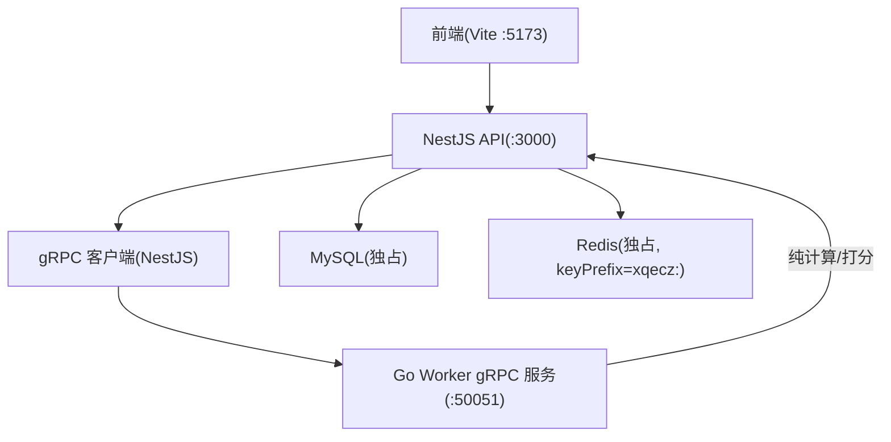
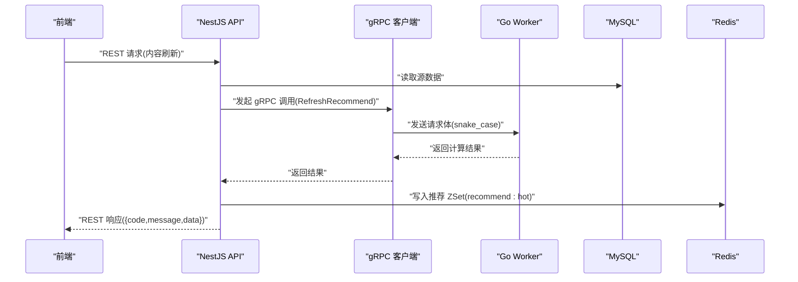
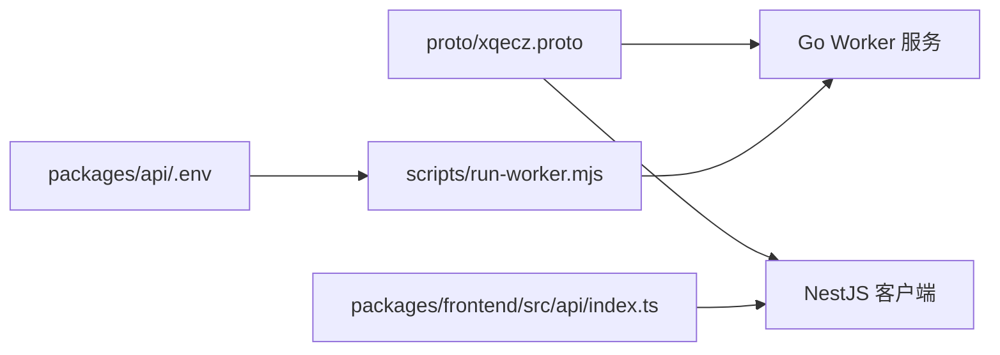

# gRPC 协议定义

<cite>
**本文引用的文件**   
- [proto/xqecz.proto](file://proto/xqecz.proto)
- [packages/api/.env](file://packages/api/.env)
- [scripts/run-worker.mjs](file://scripts/run-worker.mjs)
- [packages/frontend/src/api/index.ts](file://packages/frontend/src/api/index.ts)
</cite>

## 目录
1. [简介](#简介)
2. [项目结构](#项目结构)
3. [核心组件](#核心组件)
4. [架构总览](#架构总览)
5. [详细组件分析](#详细组件分析)
6. [依赖关系分析](#依赖关系分析)
7. [性能考虑](#性能考虑)
8. [故障排查指南](#故障排查指南)
9. [结论](#结论)
10. [附录](#附录)

## 简介
本文件为 xqecz 平台的 gRPC 协议技术文档，聚焦 proto/xqecz.proto 中定义的接口规范、字段命名约定与 keepCase:true 配置的作用、gRPC 通信数据格式与序列化方式、版本兼容性策略、NestJS 客户端与 Go 服务端之间的数据类型映射，以及协议扩展原则与向后兼容保证。同时提供接口调用示例与调试方法，帮助开发者快速理解并正确使用该协议。

## 项目结构
xqecz 采用 monorepo 组织，gRPC 契约定义位于 proto/xqecz.proto；NestJS API 作为客户端通过 gRPC 调用无状态的 Go Worker 计算服务；前端通过 REST API 与 NestJS 交互。运行方式为 pnpm dev（开发）或 pnpm start（生产），分别启动 NestJS API(:3000)、Go Worker(:50051)、Vite 前端(:5173)。

**图表来源** 
- [proto/xqecz.proto](file://proto/xqecz.proto)
- [packages/api/.env](file://packages/api/.env)
- [scripts/run-worker.mjs](file://scripts/run-worker.mjs)
- [packages/frontend/src/api/index.ts](file://packages/frontend/src/api/index.ts)

**章节来源**
- [proto/xqecz.proto](file://proto/xqecz.proto)
- [packages/api/.env](file://packages/api/.env)
- [scripts/run-worker.mjs](file://scripts/run-worker.mjs)
- [packages/frontend/src/api/index.ts](file://packages/frontend/src/api/index.ts)

## 核心组件
- gRPC 契约：proto/xqecz.proto 定义了消息类型与服务接口，是 NestJS 客户端与 Go 服务端之间的唯一契约。
- NestJS 客户端：使用 gRPC 客户端连接 Go Worker，请求参数遵循 snake_case 字段命名，并通过 keepCase:true 保持字段名不变。
- Go Worker 服务：无状态计算服务，接收 gRPC 请求进行纯计算（如推荐打分），返回结果由 NestJS 落库或写入缓存。
- 环境变量与路径：UPLOAD_DIR 统一由 packages/api/.env 管理，Worker 经 scripts/run-worker.mjs 启动时自动注入，文件路径以绝对路径在 gRPC 中传递。
- 前端契约：packages/frontend/src/api/index.ts 是前后端 REST 接口契约，响应统一包装为 { code, message, data }。

**章节来源**
- [proto/xqecz.proto](file://proto/xqecz.proto)
- [packages/api/.env](file://packages/api/.env)
- [scripts/run-worker.mjs](file://scripts/run-worker.mjs)
- [packages/frontend/src/api/index.ts](file://packages/frontend/src/api/index.ts)

## 架构总览
NestJS 作为 API 层，负责数据库与缓存操作，并通过 gRPC 将计算密集型任务委托给 Go Worker。Worker 不直接访问数据库或缓存，仅执行计算逻辑并将结果回传。前端通过 REST API 与 NestJS 交互，REST 响应统一封装。

**图表来源** 
- [proto/xqecz.proto](file://proto/xqecz.proto)
- [packages/api/.env](file://packages/api/.env)
- [scripts/run-worker.mjs](file://scripts/run-worker.mjs)
- [packages/frontend/src/api/index.ts](file://packages/frontend/src/api/index.ts)

## 详细组件分析

### 消息类型与字段命名约定
- 字段命名：所有字段采用 snake_case，便于跨语言一致性与可读性。
- keepCase:true：NestJS gRPC 客户端启用 keepCase:true，确保字段名在序列化/反序列化过程中保持不变，避免默认驼峰转换导致的字段名不一致问题。
- 建议：新增字段时保持 snake_case，并在 proto 中明确注释用途与取值范围。

**章节来源**
- [proto/xqecz.proto](file://proto/xqecz.proto)

### 服务接口与方法定义
- 服务接口：在 proto/xqecz.proto 中定义，包含若干 RPC 方法，用于触发 Worker 的计算任务（例如 RefreshRecommend）。
- 方法语义：每个方法对应一个明确的业务动作，输入为请求消息，输出为响应消息，错误通过 success=false 与 error 文本表达，而非 rpc error。
- 版本控制：建议在 proto 中使用版本号前缀或独立版本化服务定义，避免破坏现有调用方。

**章节来源**
- [proto/xqecz.proto](file://proto/xqecz.proto)

### gRPC 通信的数据格式与序列化
- 传输协议：HTTP/2 + Protobuf 二进制序列化，具备高效、紧凑的特点。
- 字段映射：NestJS 客户端与 Go 服务端之间通过 Protobuf 类型系统完成映射，字符串、数值、布尔、枚举等类型需严格对齐。
- 路径传递：文件路径以绝对路径形式在 gRPC 消息中传递，确保 Worker 能正确访问共享上传目录。

**章节来源**
- [proto/xqecz.proto](file://proto/xqecz.proto)
- [packages/api/.env](file://packages/api/.env)
- [scripts/run-worker.mjs](file://scripts/run-worker.mjs)

### NestJS 客户端与 Go 服务端的数据类型映射
- 字符串：对应 Protobuf string，注意编码与长度限制。
- 整数：int32/int64，根据数值范围选择合适类型，避免溢出。
- 布尔：bool，用于开关标志。
- 枚举：enum，用于有限集合的选项，需在两端保持一致。
- 复合类型：message 嵌套结构，保持层级清晰与可选字段标记。

**章节来源**
- [proto/xqecz.proto](file://proto/xqecz.proto)

### 版本兼容性与扩展原则
- 向后兼容：新增字段应设为可选（proto3 默认行为），不得修改或删除已有字段编号；废弃字段保留但标注 deprecated。
- 向前兼容：旧客户端忽略未知字段，新客户端对缺失字段提供默认值或降级逻辑。
- 扩展指导：新增 RPC 方法时保持幂等性，必要时引入版本号或独立服务定义，避免影响既有调用链。

**章节来源**
- [proto/xqecz.proto](file://proto/xqecz.proto)

### 接口调用示例与调试方法
- 调用示例：NestJS 调用 ContentService.refreshRecommend()，触发 gRPC RefreshRecommend，Worker 计算后返回结果，NestJS 写入 Redis ZSet recommend:hot。
- 调试方法：
  - 本地启动：pnpm dev 启动 API、Worker、前端，确认端口 :3000、:50051、:5173 正常监听。
  - 日志观察：查看 NestJS 与 Worker 的日志输出，定位请求与响应。
  - 网络抓包：使用 grpcurl 或 gRPC-Web 工具验证 proto 方法与字段。
  - 环境变量：检查 UPLOAD_DIR 是否正确注入，确保 Worker 可访问共享目录。

**章节来源**
- [proto/xqecz.proto](file://proto/xqecz.proto)
- [packages/api/.env](file://packages/api/.env)
- [scripts/run-worker.mjs](file://scripts/run-worker.mjs)
- [packages/frontend/src/api/index.ts](file://packages/frontend/src/api/index.ts)

## 依赖关系分析
- NestJS 客户端依赖 proto 生成的代码，连接 Go Worker 的 gRPC 服务。
- Go Worker 依赖 proto 定义的消息类型，执行计算逻辑并返回结果。
- 环境变量 UPLOAD_DIR 由 packages/api/.env 统一管理，Worker 启动时通过 scripts/run-worker.mjs 注入。
- 前端依赖 packages/frontend/src/api/index.ts 中的 REST 接口契约。

**图表来源** 
- [proto/xqecz.proto](file://proto/xqecz.proto)
- [packages/api/.env](file://packages/api/.env)
- [scripts/run-worker.mjs](file://scripts/run-worker.mjs)
- [packages/frontend/src/api/index.ts](file://packages/frontend/src/api/index.ts)

**章节来源**
- [proto/xqecz.proto](file://proto/xqecz.proto)
- [packages/api/.env](file://packages/api/.env)
- [scripts/run-worker.mjs](file://scripts/run-worker.mjs)
- [packages/frontend/src/api/index.ts](file://packages/frontend/src/api/index.ts)

## 性能考虑
- Protobuf 二进制序列化减少带宽占用，提升传输效率。
- Worker 无状态设计便于水平扩展，支持高并发计算场景。
- 推荐结果写入 Redis ZSet，利用内存数据结构实现高效排序与查询。
- 软删除策略降低数据清理成本，避免频繁物理删除带来的性能损耗。

[本节为通用性能讨论，无需特定文件引用]

## 故障排查指南
- 常见问题：
  - gRPC 连接失败：检查 Worker 是否启动且端口 :50051 可用。
  - 字段名不一致：确认 keepCase:true 已启用，字段名为 snake_case。
  - 文件路径错误：核对 UPLOAD_DIR 环境变量与绝对路径传递。
  - 依赖缺失：外部依赖（Tinify/S3/FFmpeg/Worker）缺失时，系统应降级处理，不应抛出 rpc error。
- 调试步骤：
  - 查看 NestJS 与 Worker 日志，定位错误堆栈。
  - 使用 grpcurl 验证 proto 方法与字段。
  - 检查 Redis 键空间与 MySQL 软删除字段 deleted_at。

**章节来源**
- [proto/xqecz.proto](file://proto/xqecz.proto)
- [packages/api/.env](file://packages/api/.env)
- [scripts/run-worker.mjs](file://scripts/run-worker.mjs)

## 结论
xqecz 平台的 gRPC 协议以 proto/xqecz.proto 为核心，结合 NestJS 客户端的 keepCase:true 与 snake_case 字段命名，确保跨语言一致性。Worker 无状态设计与纯计算职责使系统具备良好的可扩展性与性能。通过严格的版本兼容策略与降级机制，平台在演进过程中保持稳定与可靠。

[本节为总结性内容，无需特定文件引用]

## 附录
- 术语表：
  - gRPC：高性能远程过程调用框架。
  - Protobuf：Google 开发的序列化框架。
  - KeepCase：保持字段名大小写与下划线的配置。
  - 软删除：通过 deleted_at 标记删除，而非物理移除。
- 参考链接：
  - proto/xqecz.proto：gRPC 契约定义。
  - packages/api/.env：环境变量配置。
  - scripts/run-worker.mjs：Worker 启动脚本。
  - packages/frontend/src/api/index.ts：前端 REST 接口契约。

[本节为补充信息，无需特定文件引用]