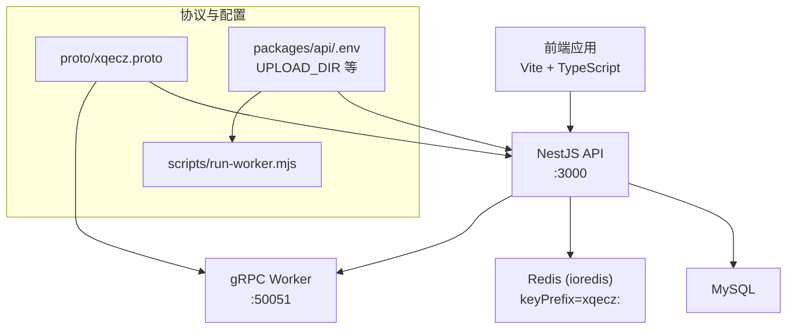
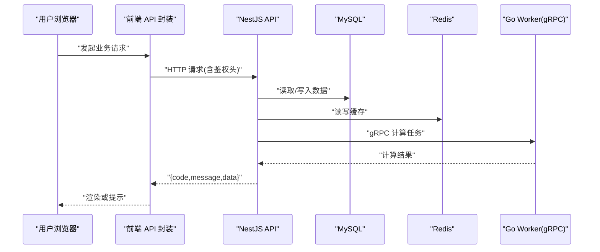
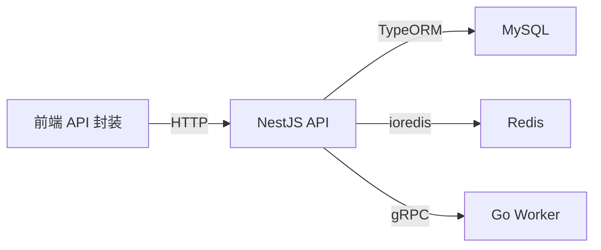

# API 集成与接口契约

<cite>
**本文引用的文件**   
- [packages/frontend/src/api/index.ts](file://packages/frontend/src/api/index.ts)
- [proto/xqecz.proto](file://proto/xqecz.proto)
- [scripts/run-worker.mjs](file://scripts/run-worker.mjs)
- [packages/api/.env](file://packages/api/.env)
</cite>

## 目录
1. [简介](#简介)
2. [项目结构](#项目结构)
3. [核心组件](#核心组件)
4. [架构总览](#架构总览)
5. [详细组件分析](#详细组件分析)
6. [依赖关系分析](#依赖关系分析)
7. [性能考虑](#性能考虑)
8. [故障排查指南](#故障排查指南)
9. [结论](#结论)
10. [附录](#附录)

## 简介
本文件面向 xqecz 平台前端开发者，系统化说明前端如何与 NestJS 后端进行 API 集成。重点包括：
- 统一响应格式 { code, message, data } 的约定与处理策略
- HTTP 请求封装、错误处理与重试机制
- 与 NestJS 后端的通信协议、参数传递与数据序列化规则
- 认证授权流程、请求/响应拦截器实现要点
- 具体调用示例、错误码处理与调试技巧
- 降级处理策略与离线支持方案

## 项目结构
xqecz 为 monorepo，前端位于 packages/frontend，API 定义集中在 packages/frontend/src/api/index.ts；gRPC 契约在 proto/xqecz.proto；Worker 启动脚本在 scripts/run-worker.mjs；环境变量集中管理于 packages/api/.env。

图表来源
- [proto/xqecz.proto](file://proto/xqecz.proto)
- [scripts/run-worker.mjs](file://scripts/run-worker.mjs)
- [packages/api/.env](file://packages/api/.env)

章节来源
- [packages/frontend/src/api/index.ts](file://packages/frontend/src/api/index.ts)
- [proto/xqecz.proto](file://proto/xqecz.proto)
- [scripts/run-worker.mjs](file://scripts/run-worker.mjs)
- [packages/api/.env](file://packages/api/.env)

## 核心组件
- 统一响应体契约：所有 API 返回统一包装 { code, message, data }。前端据此进行成功分支、业务错误分支与网络异常分支的处理。
- HTTP 客户端封装：提供统一的请求方法（GET/POST/PUT/DELETE），内置请求头设置、序列化、反序列化、错误转换与可选重试。
- 认证与拦截器：请求拦截器注入鉴权信息（如 Token），响应拦截器解析统一响应体并抛出业务错误以便上层捕获。
- gRPC 契约：proto/xqecz.proto 定义 Worker 计算接口，字段命名采用 snake_case，保持 keepCase:true 以与后端一致。

章节来源
- [packages/frontend/src/api/index.ts](file://packages/frontend/src/api/index.ts)
- [proto/xqecz.proto](file://proto/xqecz.proto)

## 架构总览
前端通过 HTTP REST 与 NestJS 交互，NestJS 负责数据库与缓存操作，并在需要时调用 Go Worker 进行纯计算任务（如推荐打分）。Worker 无状态，不直连数据库，仅通过 gRPC 接收输入并返回结果。

图表来源
- [packages/frontend/src/api/index.ts](file://packages/frontend/src/api/index.ts)
- [proto/xqecz.proto](file://proto/xqecz.proto)

## 详细组件分析

### 统一响应格式 { code, message, data }
- 语义约定
  - code：业务状态码，0 表示成功，非 0 表示业务异常
  - message：人类可读的错误或提示信息
  - data：业务数据载荷，可能为对象、数组或空值
- 前端处理策略
  - code === 0：进入成功分支，使用 data 更新 UI
  - code !== 0：进入业务错误分支，根据 message 提示用户或走降级逻辑
  - 网络异常：超时、断网、DNS 失败等由客户端拦截器捕获，触发重试或离线回退

章节来源
- [packages/frontend/src/api/index.ts](file://packages/frontend/src/api/index.ts)

### HTTP 请求封装与序列化
- 请求封装要点
  - 统一 baseURL、超时时间、Content-Type
  - 自动附加鉴权头（Authorization）
  - 请求体 JSON 序列化，查询参数 URL 编码
  - 响应体 JSON 反序列化为 JS 对象
- 参数传递方式
  - GET：query 参数
  - POST/PUT：application/json 请求体
  - DELETE：路径参数或 query 参数
- 数据序列化规则
  - 日期转为 ISO 字符串
  - null/undefined 过滤
  - 大对象分片上传（如需）

章节来源
- [packages/frontend/src/api/index.ts](file://packages/frontend/src/api/index.ts)

### 错误处理策略与重试机制
- 错误分类
  - 网络错误：超时、断网、CORS 等
  - HTTP 错误：4xx/5xx
  - 业务错误：code !== 0
- 重试策略
  - 对幂等请求（GET/HEAD/OPTIONS）可启用指数退避重试
  - 最大重试次数、重试间隔、是否允许中断
- 降级策略
  - 网络不可用时返回本地缓存或默认数据
  - 关键路径失败时展示友好提示并提供重试入口

章节来源
- [packages/frontend/src/api/index.ts](file://packages/frontend/src/api/index.ts)

### 认证授权流程
- 登录流程
  - 提交用户名/密码获取 Token
  - 将 Token 存入安全存储（如内存或加密存储）
- 请求拦截器
  - 自动在 Authorization 头携带 Token
  - 未登录或 Token 过期时跳转登录页
- 响应拦截器
  - 解析 { code, message, data }
  - 业务错误抛出，供上层 try/catch 处理
  - 鉴权失败（如 401）触发刷新或重新登录

章节来源
- [packages/frontend/src/api/index.ts](file://packages/frontend/src/api/index.ts)

### 与 NestJS 后端的通信协议与数据规则
- 协议
  - HTTP REST 用于前后端交互
  - gRPC 用于 NestJS 与 Worker 之间
- 字段命名
  - NestJS 客户端设置 keepCase:true，字段名保持 snake_case
  - 前端按后端契约映射字段，避免大小写不一致
- 序列化
  - JSON 传输，日期、枚举、布尔等类型需严格匹配

章节来源
- [proto/xqecz.proto](file://proto/xqecz.proto)
- [packages/frontend/src/api/index.ts](file://packages/frontend/src/api/index.ts)

### gRPC Worker 协作与降级
- 协作模式
  - NestJS 调用 Worker 执行计算密集型任务（如推荐打分）
  - Worker 无状态，不访问数据库，仅返回计算结果
- 降级策略
  - Worker 不可用时，NestJS 回退到基于 view_count 的排序
  - 前端收到 success=false 时显示提示并继续可用功能

章节来源
- [proto/xqecz.proto](file://proto/xqecz.proto)
- [scripts/run-worker.mjs](file://scripts/run-worker.mjs)

### 环境变量与共享目录
- UPLOAD_DIR
  - 单一配置源位于 packages/api/.env
  - Worker 启动脚本读取同一 .env，确保路径一致
- 绝对路径传递
  - gRPC 中文件路径以绝对路径传递，避免相对路径歧义

章节来源
- [packages/api/.env](file://packages/api/.env)
- [scripts/run-worker.mjs](file://scripts/run-worker.mjs)

## 依赖关系分析
- 前端依赖
  - HTTP 客户端库（如 axios/fetch）
  - 路由与状态管理（用于鉴权态与缓存）
- 后端依赖
  - NestJS 框架、TypeORM、ioredis
  - gRPC 客户端/服务端
- 外部依赖
  - MySQL、Redis
  - 可选：Tinify/S3/FFmpeg（缺失即降级）

图表来源
- [packages/frontend/src/api/index.ts](file://packages/frontend/src/api/index.ts)
- [proto/xqecz.proto](file://proto/xqecz.proto)

## 性能考虑
- 请求优化
  - 合理设置超时与重试，避免雪崩
  - 合并重复请求、取消过时请求
- 缓存策略
  - 列表数据优先读 Redis，写操作后失效缓存
  - 前端短期缓存热点数据，减少重复请求
- 资源加载
  - 图片懒加载、分片上传、CDN 加速
- 降级与容错
  - 关键路径失败快速回退，保证可用性

## 故障排查指南
- 常见问题
  - 401 未授权：检查 Token 是否存在且有效
  - 403 禁止访问：检查权限与角色
  - 404 未找到：检查路由与参数
  - 500 服务器错误：查看后端日志与数据库连接
- 调试技巧
  - 开启浏览器 Network 面板，观察请求/响应
  - 打印统一响应体 { code, message, data } 定位问题
  - 使用控制台日志记录关键路径参数与返回值
- 降级验证
  - 模拟 Worker 不可用，确认回退至 view_count 排序
  - 模拟断网，确认本地缓存与提示正常

## 结论
通过统一响应格式、严格的请求封装与拦截器、完善的错误处理与重试机制，以及清晰的 gRPC 契约与环境变量管理，xqecz 前端能够稳定地与 NestJS 后端及 Worker 协作，保障用户体验与系统可靠性。建议在生产环境持续监控错误率与延迟，结合缓存与降级策略进一步提升鲁棒性。

## 附录

### API 调用示例（概念性）
- 获取内容列表
  - 方法：GET /api/content/list
  - 参数：page、size、keyword
  - 响应：{ code: 0, message: "ok", data: { list, total } }
- 创建内容
  - 方法：POST /api/content/create
  - 请求体：title、description、fileUrl
  - 响应：{ code: 0, message: "ok", data: { id } }
- 删除内容（软删除）
  - 方法：DELETE /api/content/:id
  - 响应：{ code: 0, message: "ok", data: null }

### 错误码处理建议
- code === 0：正常处理 data
- code !== 0：根据 message 提示用户，必要时引导重试或切换路径
- 网络异常：提示网络不可用，尝试重连或切换到离线模式

### 降级与离线支持
- 缓存优先：首次加载成功后缓存数据，后续优先读缓存
- 离线模式：在网络不可用时展示缓存数据与提示
- 关键路径降级：推荐服务不可用时回退到热度排序