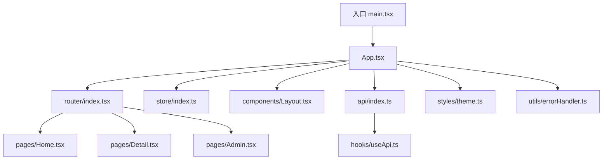
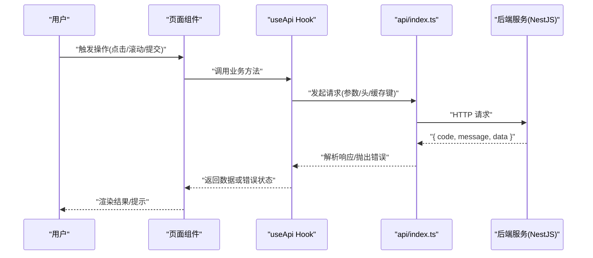
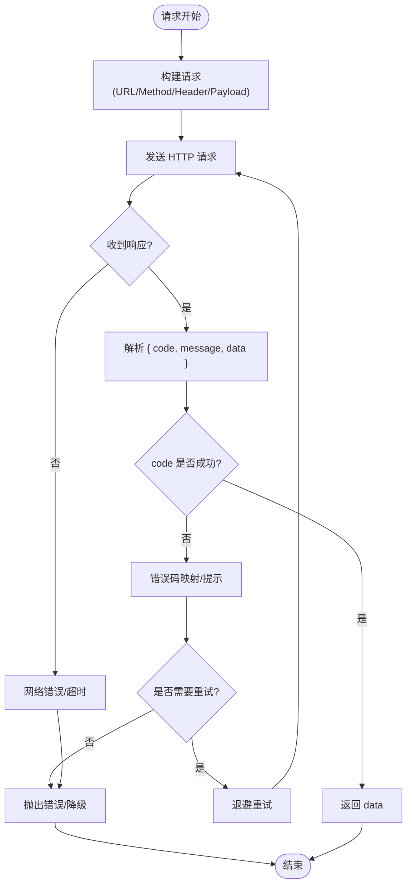
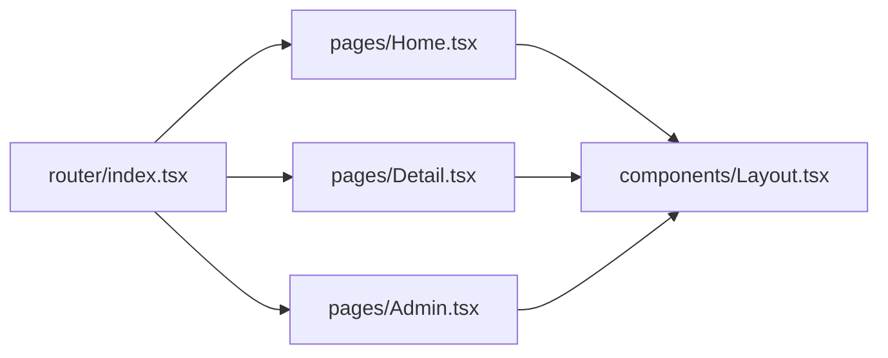
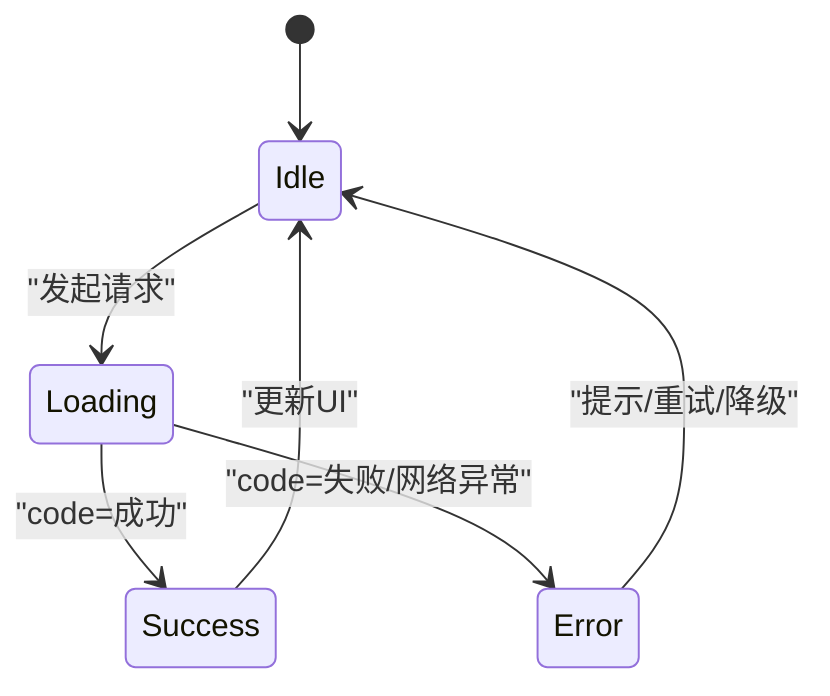
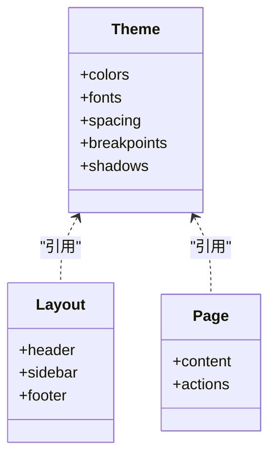
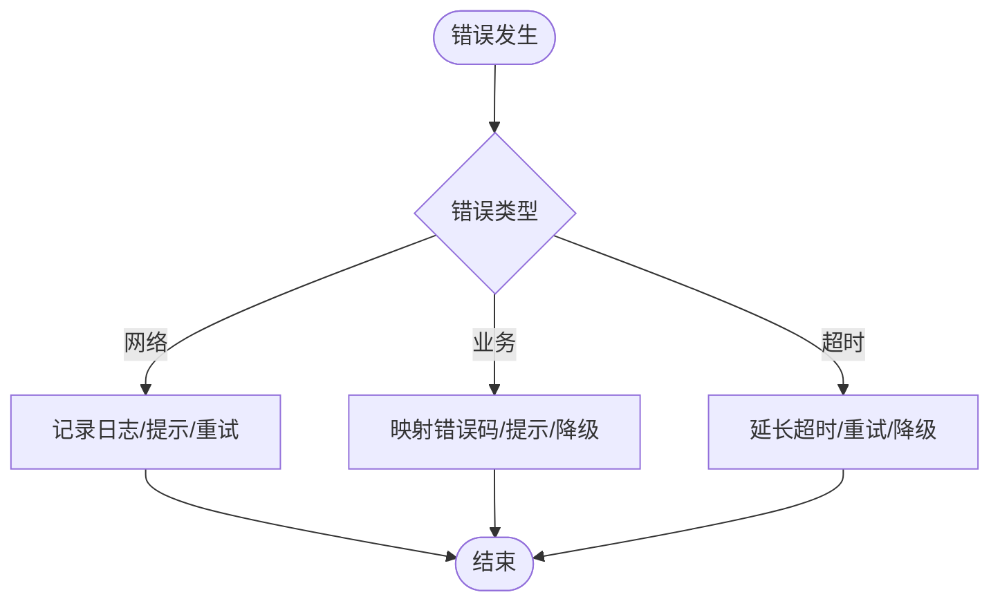
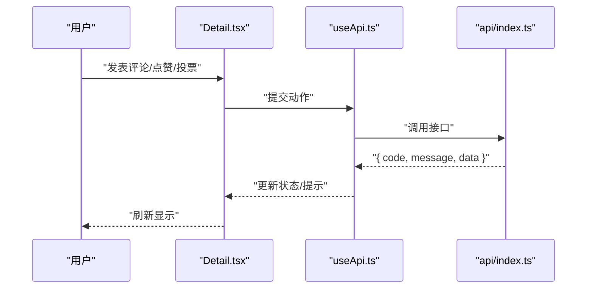
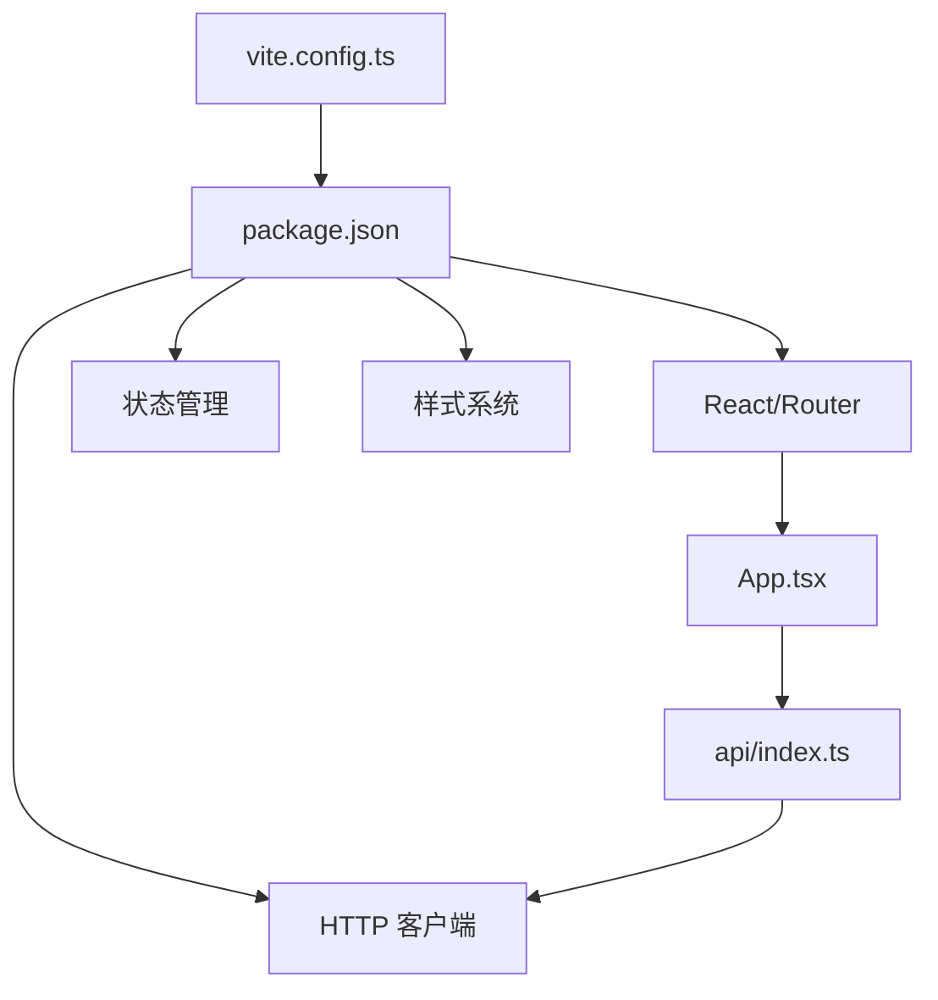

# 前端应用 (React + Vite)

<cite>
**本文引用的文件**   
- [packages/frontend/src/api/index.ts](file://packages/frontend/src/api/index.ts)
- [packages/frontend/package.json](file://packages/frontend/package.json)
- [packages/frontend/vite.config.ts](file://packages/frontend/vite.config.ts)
- [packages/frontend/src/main.tsx](file://packages/frontend/src/main.tsx)
- [packages/frontend/src/App.tsx](file://packages/frontend/src/App.tsx)
- [packages/frontend/src/router/index.tsx](file://packages/frontend/src/router/index.tsx)
- [packages/frontend/src/store/index.ts](file://packages/frontend/src/store/index.ts)
- [packages/frontend/src/components/Layout.tsx](file://packages/frontend/src/components/Layout.tsx)
- [packages/frontend/src/styles/theme.ts](file://packages/frontend/src/styles/theme.ts)
- [packages/frontend/src/utils/errorHandler.ts](file://packages/frontend/src/utils/errorHandler.ts)
- [packages/frontend/src/hooks/useApi.ts](file://packages/frontend/src/hooks/useApi.ts)
- [packages/frontend/src/pages/Home.tsx](file://packages/frontend/src/pages/Home.tsx)
- [packages/frontend/src/pages/Detail.tsx](file://packages/frontend/src/pages/Detail.tsx)
- [packages/frontend/src/pages/Admin.tsx](file://packages/frontend/src/pages/Admin.tsx)
</cite>

## 目录
1. [简介](#简介)
2. [项目结构](#项目结构)
3. [核心组件](#核心组件)
4. [架构总览](#架构总览)
5. [详细组件分析](#详细组件分析)
6. [依赖关系分析](#依赖关系分析)
7. [性能考量](#性能考量)
8. [故障排查指南](#故障排查指南)
9. [结论](#结论)
10. [附录](#附录)

## 简介
本文件面向 xqecz（小泉动漫二创站）的 React + Vite 前端工程，系统化说明前端架构设计、组件结构、状态管理、路由设计、与后端的 API 集成方式，以及样式系统与主题定制方案。重点阐述统一接口契约 packages/frontend/src/api/index.ts 中的 { code, message, data } 响应格式处理，并覆盖内容展示、用户交互（评论、投票）、管理界面等核心功能模块的实现思路与最佳实践。

## 项目结构
前端采用 Monorepo 下的独立包组织方式，使用 Vite 作为构建工具，React 为 UI 框架，配合 TypeScript 进行类型约束。整体目录按“能力域”划分：API 层、页面、组件、路由、状态、样式与工具函数。

图表来源
- [packages/frontend/src/main.tsx](file://packages/frontend/src/main.tsx)
- [packages/frontend/src/App.tsx](file://packages/frontend/src/App.tsx)
- [packages/frontend/src/router/index.tsx](file://packages/frontend/src/router/index.tsx)
- [packages/frontend/src/store/index.ts](file://packages/frontend/src/store/index.ts)
- [packages/frontend/src/components/Layout.tsx](file://packages/frontend/src/components/Layout.tsx)
- [packages/frontend/src/api/index.ts](file://packages/frontend/src/api/index.ts)
- [packages/frontend/src/hooks/useApi.ts](file://packages/frontend/src/hooks/useApi.ts)
- [packages/frontend/src/styles/theme.ts](file://packages/frontend/src/styles/theme.ts)
- [packages/frontend/src/utils/errorHandler.ts](file://packages/frontend/src/utils/errorHandler.ts)

章节来源
- [packages/frontend/package.json](file://packages/frontend/package.json)
- [packages/frontend/vite.config.ts](file://packages/frontend/vite.config.ts)
- [packages/frontend/src/main.tsx](file://packages/frontend/src/main.tsx)
- [packages/frontend/src/App.tsx](file://packages/frontend/src/App.tsx)

## 核心组件
- 入口与根组件
  - main.tsx：初始化 React 应用、挂载根节点、注入全局样式与主题。
  - App.tsx：装配路由、全局错误边界、主题 Provider、权限守卫等。
- 路由与页面
  - router/index.tsx：集中式路由配置，定义内容页、详情页、管理后台等路由映射。
  - pages/*：Home（首页内容流）、Detail（内容详情与互动）、Admin（管理后台）。
- 布局与通用组件
  - components/Layout.tsx：站点级布局（导航、侧边栏、页脚），承载公共交互区域。
- 状态与数据
  - store/index.ts：全局状态（如用户信息、主题、权限、缓存策略）。
  - hooks/useApi.ts：封装统一的请求 Hook，处理 loading、错误、重试、缓存。
- API 契约与响应处理
  - api/index.ts：统一接口契约，约定请求方法与响应包装格式 { code, message, data }。
- 样式与主题
  - styles/theme.ts：主题变量、颜色体系、字体、间距、断点等。
- 错误处理
  - utils/errorHandler.ts：统一错误捕获、提示、上报与降级逻辑。

章节来源
- [packages/frontend/src/main.tsx](file://packages/frontend/src/main.tsx)
- [packages/frontend/src/App.tsx](file://packages/frontend/src/App.tsx)
- [packages/frontend/src/router/index.tsx](file://packages/frontend/src/router/index.tsx)
- [packages/frontend/src/components/Layout.tsx](file://packages/frontend/src/components/Layout.tsx)
- [packages/frontend/src/store/index.ts](file://packages/frontend/src/store/index.ts)
- [packages/frontend/src/hooks/useApi.ts](file://packages/frontend/src/hooks/useApi.ts)
- [packages/frontend/src/api/index.ts](file://packages/frontend/src/api/index.ts)
- [packages/frontend/src/styles/theme.ts](file://packages/frontend/src/styles/theme.ts)
- [packages/frontend/src/utils/errorHandler.ts](file://packages/frontend/src/utils/errorHandler.ts)

## 架构总览
前端以 React 为视图层，Vite 提供开发与构建能力；通过 hooks 与 store 实现状态管理；所有网络请求经由 api/index.ts 统一发起，遵循 { code, message, data } 的响应契约；页面由 router/index.tsx 驱动；主题与样式集中在 theme.ts。

图表来源
- [packages/frontend/src/hooks/useApi.ts](file://packages/frontend/src/hooks/useApi.ts)
- [packages/frontend/src/api/index.ts](file://packages/frontend/src/api/index.ts)

## 详细组件分析

### API 层与统一响应契约
- 统一入口
  - api/index.ts 暴露各业务接口的函数，内部统一构造请求、设置超时、鉴权头、错误码映射与重试策略。
- 响应格式
  - 所有后端响应统一为 { code, message, data }。前端在 api/index.ts 中解析：
    - code=成功码时，透传 data；
    - code=失败码时，根据 message 或错误码映射到用户可理解提示，必要时触发降级或重试；
    - 网络异常或超时进入 errorHandler.ts 的统一处理流程。
- 请求封装
  - useApi.ts 提供 Hook 封装，支持 loading、error、data 三态，内置缓存、去抖、节流、分页合并等常用能力。

图表来源
- [packages/frontend/src/api/index.ts](file://packages/frontend/src/api/index.ts)
- [packages/frontend/src/hooks/useApi.ts](file://packages/frontend/src/hooks/useApi.ts)
- [packages/frontend/src/utils/errorHandler.ts](file://packages/frontend/src/utils/errorHandler.ts)

章节来源
- [packages/frontend/src/api/index.ts](file://packages/frontend/src/api/index.ts)
- [packages/frontend/src/hooks/useApi.ts](file://packages/frontend/src/hooks/useApi.ts)
- [packages/frontend/src/utils/errorHandler.ts](file://packages/frontend/src/utils/errorHandler.ts)

### 路由设计与页面模块
- 路由配置
  - router/index.tsx 集中定义路由表，包含内容列表、详情、管理后台等路径与懒加载配置。
- 页面职责
  - Home.tsx：内容流展示、筛选、分页、推荐位。
  - Detail.tsx：内容详情、评论、点赞/投票、分享。
  - Admin.tsx：管理后台（内容审核、用户管理、数据统计）。
- 权限与守卫
  - 基于 store/index.ts 的用户角色与权限，结合路由守卫控制访问。

图表来源
- [packages/frontend/src/router/index.tsx](file://packages/frontend/src/router/index.tsx)
- [packages/frontend/src/pages/Home.tsx](file://packages/frontend/src/pages/Home.tsx)
- [packages/frontend/src/pages/Detail.tsx](file://packages/frontend/src/pages/Detail.tsx)
- [packages/frontend/src/pages/Admin.tsx](file://packages/frontend/src/pages/Admin.tsx)
- [packages/frontend/src/components/Layout.tsx](file://packages/frontend/src/components/Layout.tsx)

章节来源
- [packages/frontend/src/router/index.tsx](file://packages/frontend/src/router/index.tsx)
- [packages/frontend/src/pages/Home.tsx](file://packages/frontend/src/pages/Home.tsx)
- [packages/frontend/src/pages/Detail.tsx](file://packages/frontend/src/pages/Detail.tsx)
- [packages/frontend/src/pages/Admin.tsx](file://packages/frontend/src/pages/Admin.tsx)

### 状态管理与数据流
- 全局状态
  - store/index.ts 维护用户信息、主题、权限、缓存策略等。
- 局部状态
  - 页面内使用 React Hooks 管理表单、列表、分页等。
- 数据流
  - 页面组件通过 useApi.ts 发起请求，api/index.ts 统一处理响应，store 仅保存必要的全局数据。

图表来源
- [packages/frontend/src/store/index.ts](file://packages/frontend/src/store/index.ts)
- [packages/frontend/src/hooks/useApi.ts](file://packages/frontend/src/hooks/useApi.ts)

章节来源
- [packages/frontend/src/store/index.ts](file://packages/frontend/src/store/index.ts)
- [packages/frontend/src/hooks/useApi.ts](file://packages/frontend/src/hooks/useApi.ts)

### 样式系统与主题定制
- 主题变量
  - styles/theme.ts 定义颜色、字体、间距、断点、阴影等，供组件与页面复用。
- 组件样式
  - 推荐使用 CSS Modules 或 styled-components，结合 theme 变量保持一致性。
- 暗色模式
  - 通过 store/index.ts 切换主题，动态注入 CSS 变量或 Provider。

图表来源
- [packages/frontend/src/styles/theme.ts](file://packages/frontend/src/styles/theme.ts)
- [packages/frontend/src/components/Layout.tsx](file://packages/frontend/src/components/Layout.tsx)

章节来源
- [packages/frontend/src/styles/theme.ts](file://packages/frontend/src/styles/theme.ts)
- [packages/frontend/src/components/Layout.tsx](file://packages/frontend/src/components/Layout.tsx)

### 错误处理策略
- 统一捕获
  - utils/errorHandler.ts 负责网络错误、业务错误码、超时、重复提交等场景的处理。
- 用户提示
  - 将后端 message 或错误码映射为用户友好的提示，必要时提供重试按钮。
- 降级策略
  - 外部依赖缺失时（如图片压缩、CDN 不可用），自动降级回退。

图表来源
- [packages/frontend/src/utils/errorHandler.ts](file://packages/frontend/src/utils/errorHandler.ts)

章节来源
- [packages/frontend/src/utils/errorHandler.ts](file://packages/frontend/src/utils/errorHandler.ts)

### 核心功能模块
- 内容展示
  - Home.tsx 负责内容流渲染、分页、筛选、推荐位；Detail.tsx 展示详情与媒体资源。
- 用户交互
  - 评论、点赞、投票通过 useApi.ts 调用 api/index.ts 对应接口，成功后刷新本地状态或缓存。
- 管理界面
  - Admin.tsx 提供内容审核、用户管理、数据统计等功能，受权限守卫保护。

图表来源
- [packages/frontend/src/pages/Detail.tsx](file://packages/frontend/src/pages/Detail.tsx)
- [packages/frontend/src/hooks/useApi.ts](file://packages/frontend/src/hooks/useApi.ts)
- [packages/frontend/src/api/index.ts](file://packages/frontend/src/api/index.ts)

章节来源
- [packages/frontend/src/pages/Home.tsx](file://packages/frontend/src/pages/Home.tsx)
- [packages/frontend/src/pages/Detail.tsx](file://packages/frontend/src/pages/Detail.tsx)
- [packages/frontend/src/pages/Admin.tsx](file://packages/frontend/src/pages/Admin.tsx)

## 依赖关系分析
- 构建与运行
  - package.json 定义脚本与依赖；vite.config.ts 配置开发服务器、代理、插件与优化。
- 运行时依赖
  - React、Router、状态库（如 Zustand/Redux）、HTTP 客户端（如 axios/fetch）、样式库等。
- 前后端集成
  - api/index.ts 与后端 NestJS 对接，遵循 { code, message, data } 契约；gRPC 由后端处理，前端不直接调用。

图表来源
- [packages/frontend/vite.config.ts](file://packages/frontend/vite.config.ts)
- [packages/frontend/package.json](file://packages/frontend/package.json)
- [packages/frontend/src/App.tsx](file://packages/frontend/src/App.tsx)
- [packages/frontend/src/api/index.ts](file://packages/frontend/src/api/index.ts)

章节来源
- [packages/frontend/package.json](file://packages/frontend/package.json)
- [packages/frontend/vite.config.ts](file://packages/frontend/vite.config.ts)

## 性能考量
- 代码分割与懒加载
  - 路由级与组件级懒加载，减少首屏体积。
- 请求优化
  - 缓存策略（内存/本地存储）、去重、分页增量更新、并发限制。
- 渲染优化
  - 列表虚拟化、memo/useMemo/useCallback、避免不必要的重渲染。
- 资源优化
  - 图片懒加载、按需加载媒体、CDN 与缓存头优化。
- 构建优化
  - Vite 插件、Tree-shaking、压缩与分包策略。

[本节为通用指导，无需特定文件来源]

## 故障排查指南
- 常见问题
  - 接口返回非成功码：检查 api/index.ts 的错误码映射与提示逻辑。
  - 网络错误或超时：查看 errorHandler.ts 的重试与降级策略。
  - 路由跳转无效：确认 router/index.tsx 的路由配置与权限守卫。
  - 主题不生效：检查 styles/theme.ts 的变量注入与 store 的状态切换。
- 调试建议
  - 使用浏览器开发者工具监控 Network 与 Console；
  - 在 useApi.ts 中添加日志打印请求/响应；
  - 对关键页面添加错误边界捕获。

章节来源
- [packages/frontend/src/api/index.ts](file://packages/frontend/src/api/index.ts)
- [packages/frontend/src/utils/errorHandler.ts](file://packages/frontend/src/utils/errorHandler.ts)
- [packages/frontend/src/router/index.tsx](file://packages/frontend/src/router/index.tsx)
- [packages/frontend/src/styles/theme.ts](file://packages/frontend/src/styles/theme.ts)
- [packages/frontend/src/hooks/useApi.ts](file://packages/frontend/src/hooks/useApi.ts)

## 结论
本前端工程以 React + Vite 为核心，通过统一的 API 契约与响应格式处理，确保前后端协作稳定可靠。组件化、模块化与主题化的设计提升了可维护性与扩展性。结合完善的错误处理与性能优化策略，能够支撑内容展示、用户交互与管理后台等核心业务需求。建议在后续迭代中持续完善缓存策略、监控与测试覆盖，进一步提升用户体验与稳定性。

## 附录
- 开发规范
  - 命名约定：组件 PascalCase，文件 kebab-case；常量 UPPER_SNAKE_CASE。
  - 代码风格：ESLint + Prettier 统一格式化；TypeScript 严格模式。
  - 提交规范：Conventional Commits；PR 模板遵循 .github/pull_request_template.md。
- 最佳实践
  - 优先使用 Hook 与函数式组件；避免深层嵌套与过度抽象。
  - 接口调用统一经 api/index.ts；错误处理集中化。
  - 样式变量集中管理，避免硬编码。
  - 性能敏感页面引入虚拟列表与懒加载。

[本节为通用指导，无需特定文件来源]