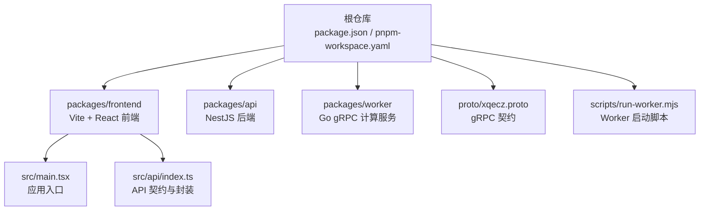
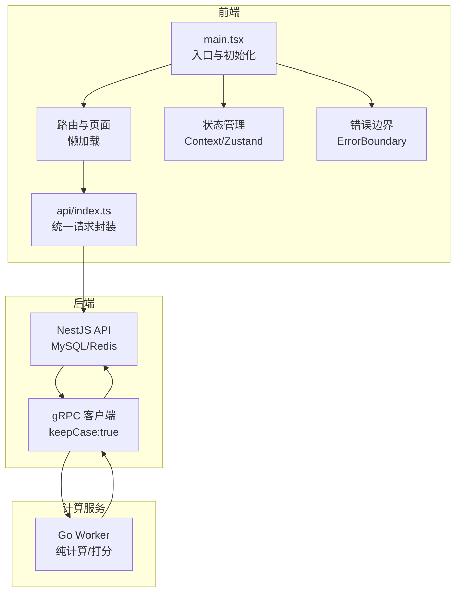
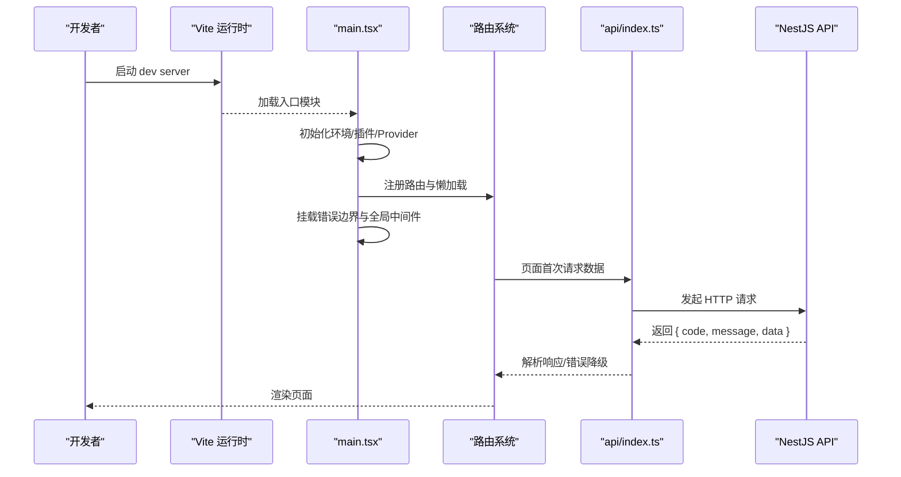
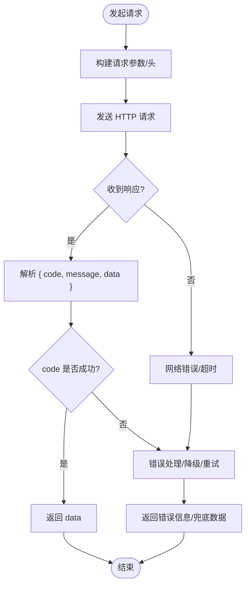
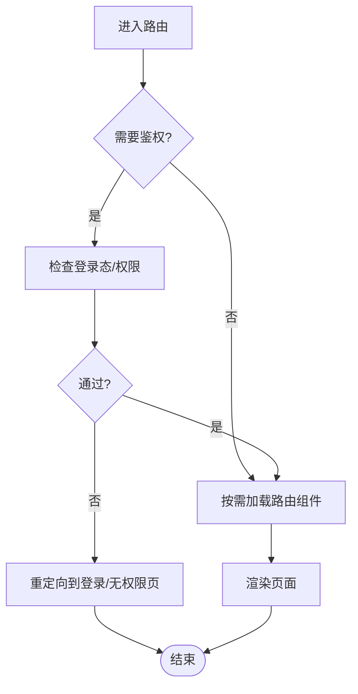
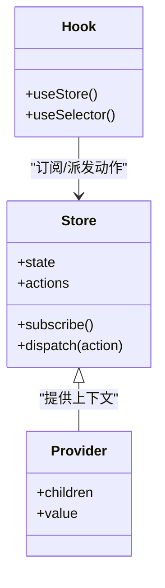
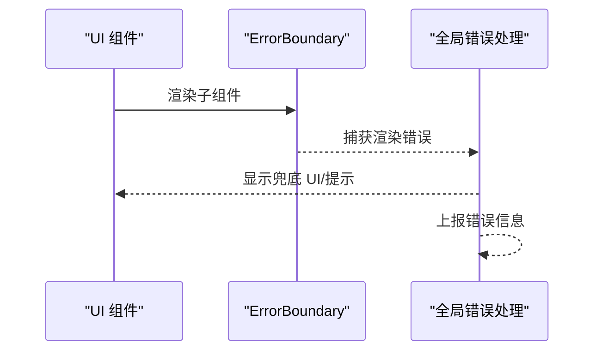
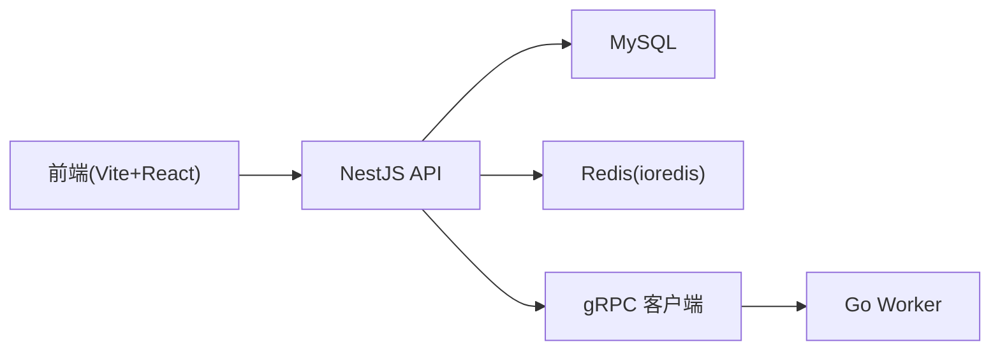

# 前端架构设计

<cite>
**本文引用的文件**   
- [package.json](file://package.json)
- [pnpm-workspace.yaml](file://pnpm-workspace.yaml)
- [packages/frontend/package.json](file://packages/frontend/package.json)
- [packages/frontend/src/main.tsx](file://packages/frontend/src/main.tsx)
- [packages/frontend/src/api/index.ts](file://packages/frontend/src/api/index.ts)
- [proto/xqecz.proto](file://proto/xqecz.proto)
- [scripts/run-worker.mjs](file://scripts/run-worker.mjs)
</cite>

## 目录
1. [简介](#简介)
2. [项目结构](#项目结构)
3. [核心组件](#核心组件)
4. [架构总览](#架构总览)
5. [详细组件分析](#详细组件分析)
6. [依赖关系分析](#依赖关系分析)
7. [性能考虑](#性能考虑)
8. [故障排查指南](#故障排查指南)
9. [结论](#结论)
10. [附录](#附录)

## 简介
本文件面向 xqecz（小泉动漫二创站）的前端架构，聚焦基于 Vite + React 的技术选型与工程化实践。文档从 monorepo 组织、模块化分层、状态管理策略入手，详细说明应用入口 main.tsx 的初始化流程（路由、全局中间件、错误边界），并给出构建优化、开发环境与生产打包策略，以及性能优化、代码分割与懒加载的最佳实践。同时提供开发规范与环境配置指导，帮助团队在统一标准下高效协作。

## 项目结构
xqecz 采用 pnpm monorepo 组织，前端位于 packages/frontend。根级 package.json 与 pnpm-workspace.yaml 定义工作区与脚本；proto 与 scripts 分别承载 gRPC 契约与 Worker 启动脚本。前端内部以功能域划分模块，遵循“页面/视图层 → 业务逻辑层 → 数据访问层”的分层模式，并通过统一的 API 契约文件与后端交互。

图表来源
- [package.json:1-200](file://package.json#L1-L200)
- [pnpm-workspace.yaml:1-200](file://pnpm-workspace.yaml#L1-L200)
- [packages/frontend/package.json:1-200](file://packages/frontend/package.json#L1-L200)
- [packages/frontend/src/main.tsx:1-200](file://packages/frontend/src/main.tsx#L1-L200)
- [packages/frontend/src/api/index.ts:1-200](file://packages/frontend/src/api/index.ts#L1-L200)
- [proto/xqecz.proto:1-200](file://proto/xqecz.proto#L1-L200)
- [scripts/run-worker.mjs:1-200](file://scripts/run-worker.mjs#L1-L200)

章节来源
- [package.json:1-200](file://package.json#L1-L200)
- [pnpm-workspace.yaml:1-200](file://pnpm-workspace.yaml#L1-L200)
- [packages/frontend/package.json:1-200](file://packages/frontend/package.json#L1-L200)

## 核心组件
- 应用入口 main.tsx：负责初始化 Vite 运行时、挂载 React 根节点、注册路由、全局中间件（如请求拦截器、日志、埋点）、错误边界与全局异常处理。
- API 契约与封装 src/api/index.ts：定义前后端唯一接口契约，统一响应格式 { code, message, data }，并提供请求封装、错误降级与重试策略。
- 路由与页面：按功能域拆分路由，结合 React Router 实现页面级与组件级懒加载。
- 状态管理：推荐 React Context + useReducer 或轻量状态库（如 Zustand/Jotai），对跨组件共享状态进行集中管理，避免过度耦合。
- 错误边界：使用 React ErrorBoundary 捕获渲染期错误，配合全局错误上报与用户友好提示。

章节来源
- [packages/frontend/src/main.tsx:1-200](file://packages/frontend/src/main.tsx#L1-L200)
- [packages/frontend/src/api/index.ts:1-200](file://packages/frontend/src/api/index.ts#L1-L200)

## 架构总览
前端通过 Vite 快速开发与热更新，React 作为 UI 框架，React Router 管理路由，API 层统一封装与后端 NestJS 通信。gRPC 契约由 proto/xqecz.proto 定义，前端不直接调用 gRPC，而是通过 NestJS 提供的 REST/GraphQL 接口获取数据。Worker 为无状态计算服务，仅与 NestJS 交互，前端对其透明。

图表来源
- [packages/frontend/src/main.tsx:1-200](file://packages/frontend/src/main.tsx#L1-L200)
- [packages/frontend/src/api/index.ts:1-200](file://packages/frontend/src/api/index.ts#L1-L200)
- [proto/xqecz.proto:1-200](file://proto/xqecz.proto#L1-L200)
- [scripts/run-worker.mjs:1-200](file://scripts/run-worker.mjs#L1-L200)

## 详细组件分析

### 应用入口 main.tsx 初始化流程
- 初始化 Vite 环境：读取环境变量、设置调试开关、启用插件链（如路径别名、压缩、代理）。
- 挂载 React 根节点：创建根容器、注入 Provider（主题、国际化、状态等）。
- 路由配置：注册页面路由与嵌套路由，开启懒加载与代码分割。
- 全局中间件：注册请求拦截器（鉴权、重试、错误降级）、日志与埋点、全局错误边界。
- 错误边界：包裹应用树，捕获渲染期错误并展示兜底 UI，上报错误信息。

图表来源
- [packages/frontend/src/main.tsx:1-200](file://packages/frontend/src/main.tsx#L1-L200)
- [packages/frontend/src/api/index.ts:1-200](file://packages/frontend/src/api/index.ts#L1-L200)

章节来源
- [packages/frontend/src/main.tsx:1-200](file://packages/frontend/src/main.tsx#L1-L200)

### API 契约与统一响应
- 统一响应格式：所有接口返回 { code, message, data }，前端据此做成功/失败分支处理。
- 请求封装：统一处理鉴权头、超时、重试、错误码映射、网络异常降级。
- 错误降级：外部依赖缺失时（如图片压缩、FFmpeg、Worker）一律降级，保证可用性。

图表来源
- [packages/frontend/src/api/index.ts:1-200](file://packages/frontend/src/api/index.ts#L1-L200)

章节来源
- [packages/frontend/src/api/index.ts:1-200](file://packages/frontend/src/api/index.ts#L1-L200)

### 路由与懒加载
- 路由组织：按功能域划分路由模块，支持嵌套路由与动态路由。
- 懒加载：使用 React.lazy 与 Suspense 实现页面级与组件级懒加载，减少首屏体积。
- 路由守卫：根据鉴权状态与权限控制页面访问。

[此图为概念流程图，无需源码映射]

### 状态管理策略
- 选择原则：优先使用 React Context + useReducer 管理局部共享状态；复杂场景可引入 Zustand/Jotai 提升可维护性。
- 数据流：单向数据流，避免循环依赖；将副作用（请求、缓存）下沉至 API 层或自定义 Hook。
- 缓存策略：结合浏览器缓存与内存缓存，减少重复请求。

[此图为概念类图，用于说明状态管理模式]

### 错误边界与全局异常
- 渲染期错误：使用 ErrorBoundary 捕获组件渲染异常，展示兜底 UI。
- 运行期错误：全局监听未捕获异常，上报错误信息并降级功能。
- 用户反馈：统一错误提示与重试入口，提升用户体验。

[此图为概念序列图，用于说明错误边界流程]

## 依赖关系分析
- 前端依赖：Vite、React、React Router、状态管理库、HTTP 客户端、工具库。
- 后端依赖：NestJS、TypeORM、ioredis、gRPC 客户端。
- Worker 依赖：Go、gRPC 服务端。
- 契约依赖：proto/xqecz.proto 定义字段命名与消息结构，NestJS 客户端设置 keepCase:true 并使用 snake_case 字段。

图表来源
- [packages/frontend/package.json:1-200](file://packages/frontend/package.json#L1-L200)
- [proto/xqecz.proto:1-200](file://proto/xqecz.proto#L1-L200)
- [scripts/run-worker.mjs:1-200](file://scripts/run-worker.mjs#L1-L200)

章节来源
- [packages/frontend/package.json:1-200](file://packages/frontend/package.json#L1-L200)
- [proto/xqecz.proto:1-200](file://proto/xqecz.proto#L1-L200)
- [scripts/run-worker.mjs:1-200](file://scripts/run-worker.mjs#L1-L200)

## 性能考虑
- 构建优化：启用 Vite 生产模式下的代码压缩、Tree Shaking、资源哈希与缓存策略。
- 代码分割：按路由与组件粒度进行懒加载，减少首屏体积。
- 资源优化：图片懒加载、WebP 格式、CDN 加速、字体子集化。
- 缓存策略：浏览器缓存、Service Worker 缓存静态资源，API 响应缓存与去重。
- 监控与度量：接入性能监控（FCP、LCP、TBT），定位瓶颈并持续优化。

[本节为通用性能建议，无需源码映射]

## 故障排查指南
- 常见问题：
  - 路由 404：检查路由注册与懒加载路径是否正确。
  - API 错误：查看统一响应格式 { code, message, data }，确认后端返回与前端解析逻辑。
  - 错误边界触发：检查组件渲染逻辑与依赖项，确保异常被正确捕获。
- 调试技巧：
  - 使用浏览器开发者工具 Network 面板查看请求与响应。
  - 启用 Vite 调试模式，查看构建产物与依赖图。
  - 检查环境变量与代理配置，确保本地开发链路畅通。

章节来源
- [packages/frontend/src/api/index.ts:1-200](file://packages/frontend/src/api/index.ts#L1-L200)
- [packages/frontend/src/main.tsx:1-200](file://packages/frontend/src/main.tsx#L1-L200)

## 结论
xqecz 前端采用 Vite + React 的现代技术栈，结合 monorepo 与清晰的模块化分层，实现了高内聚、低耦合的架构设计。通过统一的 API 契约、错误边界与性能优化策略，保障了开发效率与用户体验。建议在后续迭代中持续完善状态管理与监控体系，进一步提升系统的可维护性与稳定性。

[本节为总结性内容，无需源码映射]

## 附录
- 开发规范：
  - 命名约定：组件 PascalCase，文件 kebab-case，常量 UPPER_SNAKE_CASE。
  - 代码风格：ESLint + Prettier 统一格式化，提交前自动校验。
  - 注释规范：关键逻辑添加 JSDoc 注释，便于 IDE 提示与文档生成。
- 环境配置：
  - 开发环境：pnpm dev 启动前端、后端与 Worker，端口分别为 5173、3000、50051。
  - 生产环境：pnpm start 一键构建与运行，启用生产优化与缓存策略。
  - 环境变量：UPLOAD_DIR 指定共享上传目录，确保前后端一致。

[本节为通用规范与建议，无需源码映射]