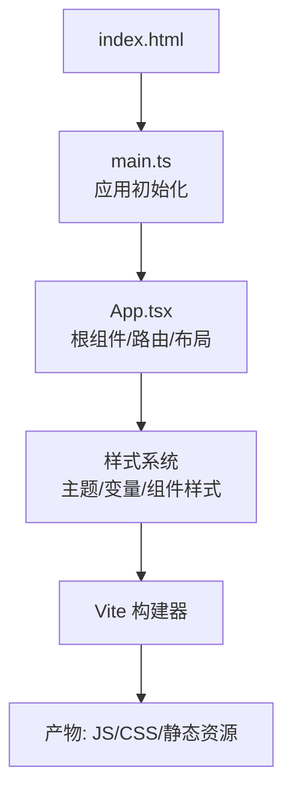
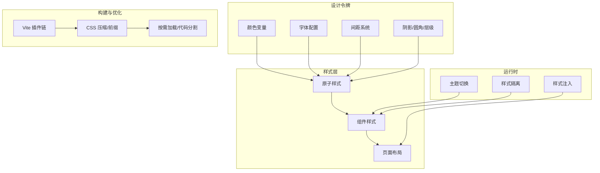
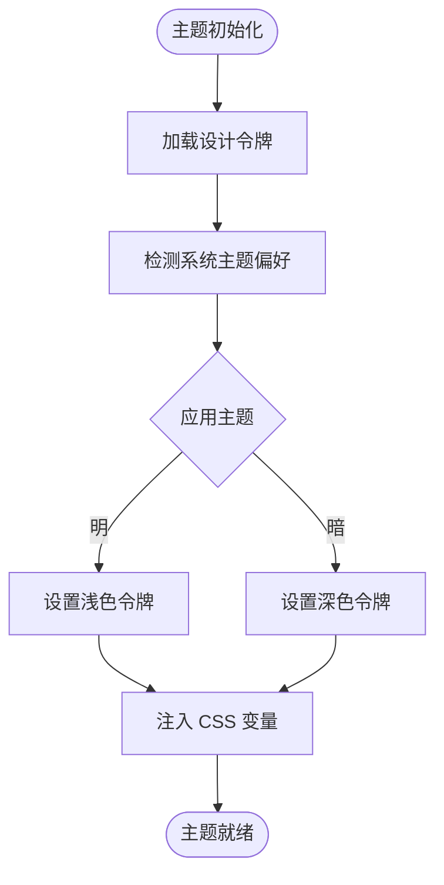
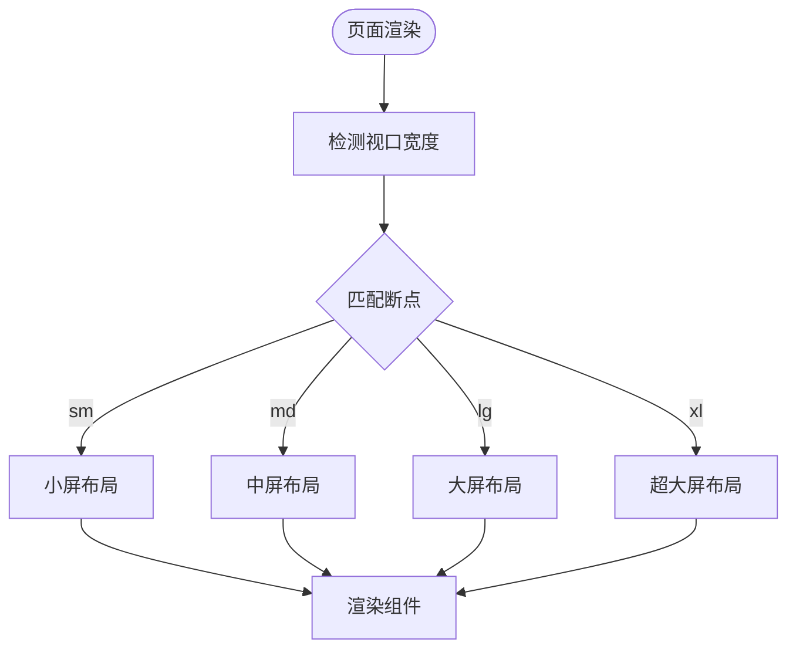
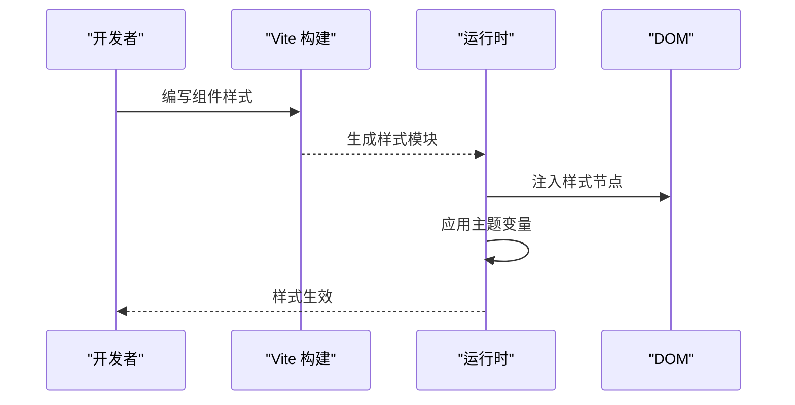
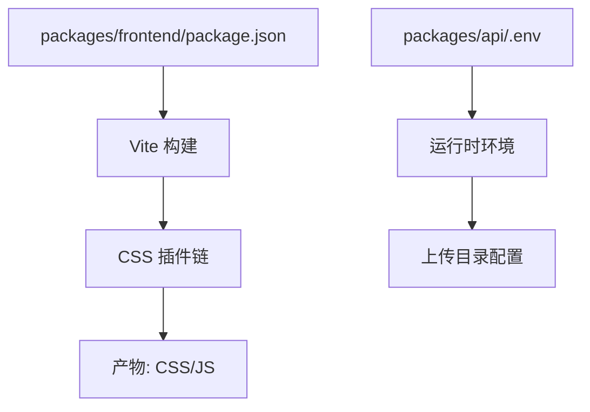

# 样式系统与主题

<cite>
**本文引用的文件**   
- [packages/frontend/package.json](file://packages/frontend/package.json)
- [packages/frontend/src/main.ts](file://packages/frontend/src/main.ts)
- [packages/frontend/src/App.tsx](file://packages/frontend/src/App.tsx)
- [packages/frontend/src/vite-env.d.ts](file://packages/frontend/src/vite-env.d.ts)
- [packages/frontend/index.html](file://packages/frontend/index.html)
- [packages/api/.env](file://packages/api/.env)
</cite>

## 目录
1. [简介](#简介)
2. [项目结构](#项目结构)
3. [核心组件](#核心组件)
4. [架构总览](#架构总览)
5. [详细组件分析](#详细组件分析)
6. [依赖分析](#依赖分析)
7. [性能考虑](#性能考虑)
8. [故障排查指南](#故障排查指南)
9. [结论](#结论)
10. [附录](#附录)

## 简介
本文件面向 xqecz 平台的样式系统，目标是建立统一的样式架构、主题与命名规范，确保跨端一致性与可维护性。文档覆盖：
- CSS 架构设计与样式组织方式
- 主题系统（颜色变量、字体配置、间距系统、组件样式定制）
- 响应式设计与移动端适配策略
- 跨浏览器兼容性处理
- 样式注入、CSS-in-JS 使用与样式隔离方案
- 样式性能优化、压缩与按需加载
- 开发规范与主题定制指南

说明：当前仓库未包含前端样式源码的具体实现细节，本文基于 monorepo 结构与通用工程实践给出可落地的架构建议与实施路径，便于后续在 packages/frontend 中落地。

## 项目结构
- 前端位于 packages/frontend，采用 Vite 构建，入口为 index.html，应用初始化由 main.ts 驱动，根组件 App.tsx 承载路由与布局。
- 后端 API 环境变量统一于 packages/api/.env，worker 启动脚本读取同一 .env，保证上传目录等关键路径一致。
- 样式系统应置于 packages/frontend 内，遵循“按功能域拆分 + 全局主题”的组织方式。

图表来源
- [packages/frontend/index.html](file://packages/frontend/index.html)
- [packages/frontend/src/main.ts](file://packages/frontend/src/main.ts)
- [packages/frontend/src/App.tsx](file://packages/frontend/src/App.tsx)

章节来源
- [packages/frontend/package.json](file://packages/frontend/package.json)
- [packages/frontend/src/main.ts](file://packages/frontend/src/main.ts)
- [packages/frontend/src/App.tsx](file://packages/frontend/src/App.tsx)
- [packages/frontend/src/vite-env.d.ts](file://packages/frontend/src/vite-env.d.ts)
- [packages/frontend/index.html](file://packages/frontend/index.html)

## 核心组件
- 主题引擎：集中管理颜色、字体、间距、阴影、圆角等设计令牌（Design Tokens），提供运行时切换能力（明/暗主题）。
- 样式原子层：基础元素样式（按钮、输入框、卡片、栅格等），通过主题变量组合而成。
- 组件样式：业务组件的样式封装，优先使用主题变量与原子类，避免硬编码。
- 响应式工具：断点、媒体查询封装、移动端优先策略。
- 构建集成：Vite 插件链（CSS 预处理、压缩、自动前缀、按需加载）。

章节来源
- [packages/frontend/package.json](file://packages/frontend/package.json)

## 架构总览
样式系统采用“设计令牌 → 原子样式 → 组件样式 → 页面布局”的分层架构，配合 Vite 构建流程实现高效开发与生产优化。

图表来源
- [packages/frontend/src/main.ts](file://packages/frontend/src/main.ts)
- [packages/frontend/src/App.tsx](file://packages/frontend/src/App.tsx)
- [packages/frontend/package.json](file://packages/frontend/package.json)

## 详细组件分析

### 主题系统
- 颜色变量：定义主色、辅助色、语义色（成功、警告、错误）、中性色阶；支持明/暗两套调色板，运行时切换。
- 字体配置：字族、字号阶梯、行高、字重；提供标题、正文、注释等预设。
- 间距系统：基于 4px/8px 网格，统一边距、内边距、间距比例。
- 组件样式定制：通过主题变量控制组件外观，避免组件内硬编码颜色或尺寸。

图表来源
- [packages/frontend/src/main.ts](file://packages/frontend/src/main.ts)
- [packages/frontend/src/App.tsx](file://packages/frontend/src/App.tsx)

章节来源
- [packages/frontend/src/main.ts](file://packages/frontend/src/main.ts)
- [packages/frontend/src/App.tsx](file://packages/frontend/src/App.tsx)

### 响应式设计与移动端适配
- 断点策略：以移动端优先为基础，定义 sm/md/lg/xl 断点，使用媒体查询封装。
- 栅格系统：12 列栅格，支持流式布局与弹性对齐。
- 交互适配：触摸手势、点击热区、滚动行为优化。
- 图片与媒体：自适应尺寸、懒加载、占位图。

图表来源
- [packages/frontend/src/App.tsx](file://packages/frontend/src/App.tsx)

章节来源
- [packages/frontend/src/App.tsx](file://packages/frontend/src/App.tsx)

### 样式注入与隔离
- 注入策略：通过 Vite 插件将样式注入到 DOM，支持动态主题切换。
- 隔离方案：组件级样式作用域（如 CSS Modules 或 scoped 样式），避免全局污染。
- 优先级控制：明确样式优先级规则，避免覆盖冲突。

图表来源
- [packages/frontend/src/main.ts](file://packages/frontend/src/main.ts)
- [packages/frontend/src/App.tsx](file://packages/frontend/src/App.tsx)

章节来源
- [packages/frontend/src/main.ts](file://packages/frontend/src/main.ts)
- [packages/frontend/src/App.tsx](file://packages/frontend/src/App.tsx)

### CSS-in-JS 使用
- 选择建议：若需运行时主题切换与条件样式，可使用 CSS-in-JS（如 styled-components 或 Emotion）；否则优先使用 CSS Modules 以获得更好的性能与调试体验。
- 最佳实践：避免在渲染路径中创建新样式对象，使用 useMemo/useCallback 缓存。

章节来源
- [packages/frontend/package.json](file://packages/frontend/package.json)

### 跨浏览器兼容性
- 目标浏览器：现代浏览器（Chrome/Firefox/Safari/Edge 最新两个版本）。
- 兼容手段：PostCSS 自动前缀、polyfill 按需引入、特性检测降级。
- 测试策略：本地多浏览器验证 + CI 自动化测试。

章节来源
- [packages/frontend/package.json](file://packages/frontend/package.json)

## 依赖分析
- 构建依赖：Vite 及其插件生态（CSS 预处理、压缩、前缀）。
- 运行时依赖：主题切换库（可选）、样式隔离方案（CSS Modules/scoped）。
- 环境变量：UPLOAD_DIR 等关键路径由 packages/api/.env 统一管理，确保前后端一致。

图表来源
- [packages/frontend/package.json](file://packages/frontend/package.json)
- [packages/api/.env](file://packages/api/.env)

章节来源
- [packages/frontend/package.json](file://packages/frontend/package.json)
- [packages/api/.env](file://packages/api/.env)

## 性能考虑
- CSS 压缩：启用生产模式压缩与去重，减少体积。
- 自动前缀：仅为目标浏览器添加必要前缀。
- 按需加载：组件样式随组件懒加载，避免首屏阻塞。
- 缓存策略：利用浏览器缓存与 CDN 缓存静态资源。
- 测量与监控：使用 Lighthouse 与 Web Vitals 持续优化。

章节来源
- [packages/frontend/package.json](file://packages/frontend/package.json)

## 故障排查指南
- 主题不生效：检查主题变量注入顺序与作用域，确认运行时切换逻辑。
- 样式覆盖冲突：审查优先级与选择器特异性，使用命名空间隔离。
- 构建失败：检查 Vite 插件配置与依赖版本，清理缓存后重试。
- 移动端异常：验证媒体查询断点与触摸事件处理。

章节来源
- [packages/frontend/src/main.ts](file://packages/frontend/src/main.ts)
- [packages/frontend/src/App.tsx](file://packages/frontend/src/App.tsx)

## 结论
通过分层架构与统一主题系统，xqecz 平台可实现一致的视觉体验与高效的样式维护。建议在 packages/frontend 中尽快落地设计令牌、原子样式与组件样式体系，并结合 Vite 构建优化提升性能。

## 附录
- 开发规范：统一命名约定（BEM/模块化）、提交前 lint 检查、样式评审清单。
- 主题定制：新增颜色/字体/间距时同步更新设计令牌与文档，确保团队一致性。