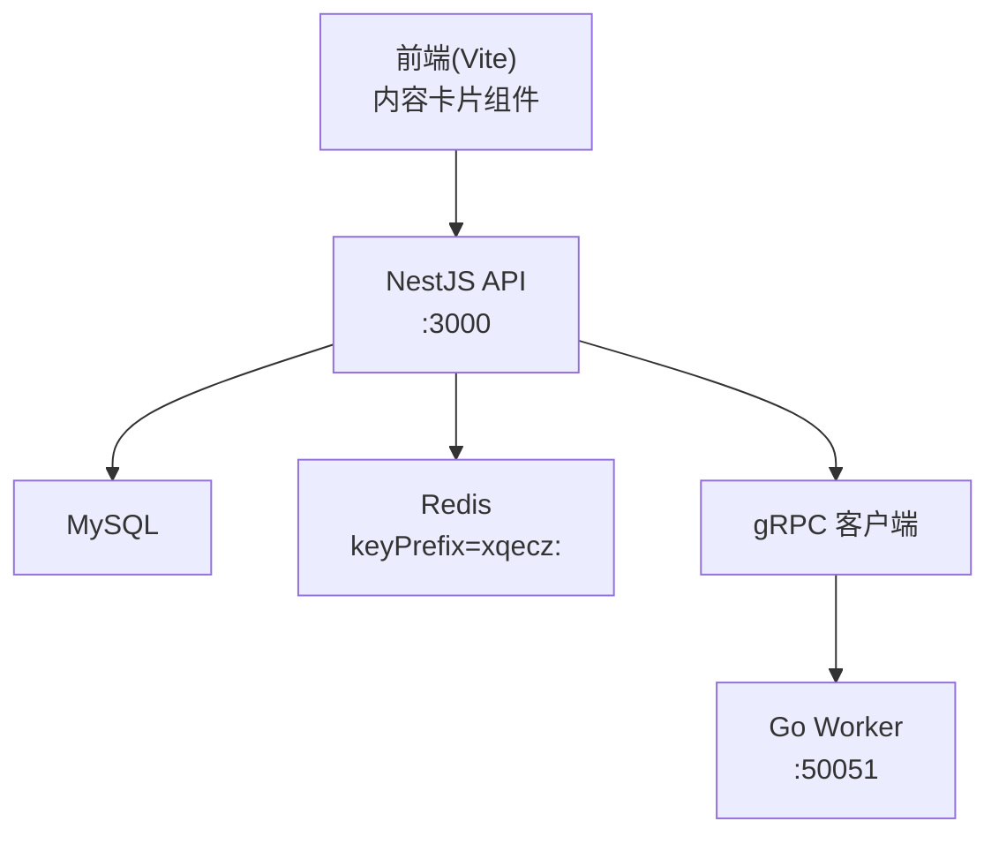
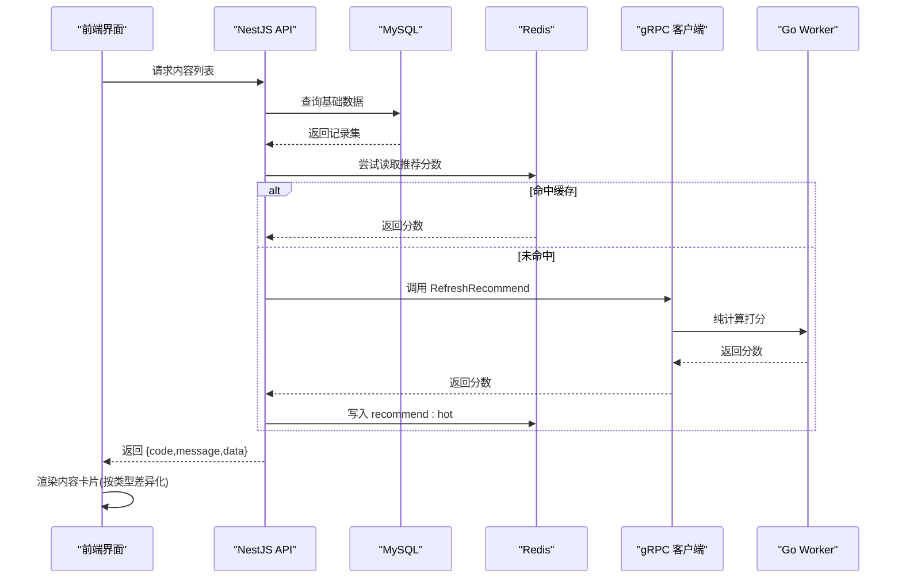
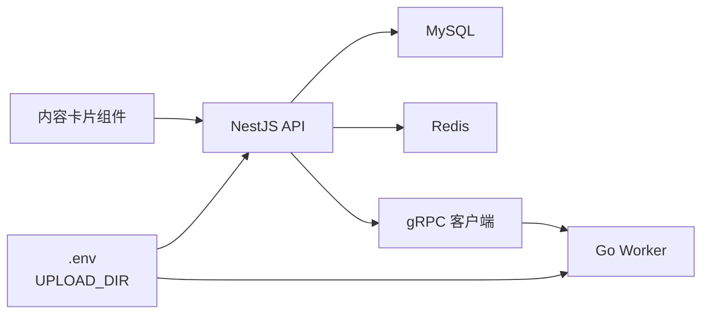

# 内容卡片组件

<cite>
**本文引用的文件**   
- [packages/frontend/src/api/index.ts](file://packages/frontend/src/api/index.ts)
- [proto/xqecz.proto](file://proto/xqecz.proto)
- [packages/api/.env](file://packages/api/.env)
- [scripts/run-worker.mjs](file://scripts/run-worker.mjs)
- [package.json](file://package.json)
</cite>

## 目录
1. [简介](#简介)
2. [项目结构](#项目结构)
3. [核心组件](#核心组件)
4. [架构总览](#架构总览)
5. [详细组件分析](#详细组件分析)
6. [依赖分析](#依赖分析)
7. [性能考虑](#性能考虑)
8. [故障排查指南](#故障排查指南)
9. [结论](#结论)
10. [附录](#附录)

## 简介
本文件为 xqecz 平台“内容卡片”组件的权威文档，面向前端与全栈开发者。内容卡片用于在首页列表、搜索结果页、个人主页等场景中统一展示二次创作内容（图片、视频、图文、链接）。本文从布局设计、数据结构、渲染逻辑、交互行为、类型适配策略、配置项、事件回调与扩展点、使用示例与集成指南等方面进行全面说明，帮助读者快速落地并稳定维护该组件。

## 项目结构
xqecz 采用 monorepo 组织：
- packages/api：NestJS 后端服务，负责数据库与缓存读写、gRPC 客户端调用。
- packages/worker：Go 无状态 gRPC 计算服务，执行推荐打分等纯计算任务。
- packages/frontend：Vite 前端应用，包含内容卡片组件及页面集成。
- proto：gRPC 契约定义，字段命名遵循 snake_case。

图表来源
- [packages/frontend/src/api/index.ts](file://packages/frontend/src/api/index.ts)
- [proto/xqecz.proto](file://proto/xqecz.proto)
- [scripts/run-worker.mjs](file://scripts/run-worker.mjs)

章节来源
- [package.json](file://package.json)

## 核心组件
内容卡片组件的核心职责：
- 标题显示：单行或多行截断，支持省略号或展开收起。
- 摘要截取：按字符数或行数限制，提供可配置长度与“展开更多”。
- 标签展示：最多 N 个标签，超出部分以“+M”形式提示。
- 元数据呈现：作者、发布时间、浏览量、评分等，支持格式化与空值处理。
- 媒体预览图：根据内容类型选择图片、视频封面或占位图；支持懒加载与错误降级。
- 交互行为：点击跳转详情、悬停高亮、收藏/取消收藏、分享等。

章节来源
- [packages/frontend/src/api/index.ts](file://packages/frontend/src/api/index.ts)

## 架构总览
内容卡片的数据流与渲染流程如下：
- 前端通过统一的 API 契约获取内容列表，响应体统一为 { code, message, data }。
- NestJS 读取 MySQL，必要时调用 Go Worker 进行推荐打分，结果写入 Redis ZSet（recommend:hot），读取失败时降级为 view_count 排序。
- 前端将原始数据映射为卡片所需结构，渲染不同内容类型的差异化视图。

图表来源
- [packages/frontend/src/api/index.ts](file://packages/frontend/src/api/index.ts)
- [proto/xqecz.proto](file://proto/xqecz.proto)

## 详细组件分析

### 数据结构要求
内容卡片所需的最小字段集合（由 API 响应 data 中每条记录映射而来）：
- title：字符串，必填，用于标题展示。
- description：字符串，可选，用于摘要截取。
- tags：字符串数组，可选，用于标签展示，建议限制数量。
- author：字符串，必填，作者名或昵称。
- createdAt：时间戳或日期字符串，必填，用于时间格式化。
- viewCount：数字，可选，默认 0，用于浏览量展示。
- rating：数字，可选，范围 0~5，用于评分展示。
- mediaType：枚举，必填，区分内容类型：image、video、article、link。
- mediaUrl：字符串，可选，媒体资源地址（图片/视频封面/缩略图）。
- coverUrl：字符串，可选，通用封面图，当媒体不可用时回退。
- id：字符串或数字，必填，唯一标识，用于路由与收藏操作。
- favorite：布尔，可选，是否已收藏，用于图标状态切换。

注意：
- 字段命名遵循 snake_case（来自 proto 与 NestJS 客户端配置 keepCase:true）。
- 缺失字段需有默认值与降级策略，保证卡片稳定渲染。

章节来源
- [packages/frontend/src/api/index.ts](file://packages/frontend/src/api/index.ts)
- [proto/xqecz.proto](file://proto/xqecz.proto)

### 渲染逻辑
- 标题：单行显示，超长使用省略号；支持 hover 或点击展开。
- 摘要：按配置长度截取，超过显示“...”，提供“展开/收起”按钮。
- 标签：最多显示 N 个，剩余以“+M”表示；点击标签可筛选。
- 元数据：
  - 作者：显示昵称，支持跳转到用户主页。
  - 时间：相对时间（如“3小时前”）或绝对时间（YYYY-MM-DD）。
  - 浏览量：千分位格式化，空值显示“-”。
  - 评分：星级或小数，空值隐藏。
- 媒体预览：
  - image：直接显示图片，懒加载，失败回退到 coverUrl。
  - video：显示封面图，右下角播放图标，点击进入播放器。
  - article：显示首图或占位图，点击进入详情页。
  - link：显示链接预览图或占位图，点击在新窗口打开。

章节来源
- [packages/frontend/src/api/index.ts](file://packages/frontend/src/api/index.ts)

### 用户交互行为
- onClick：点击卡片主体跳转详情或打开播放器。
- onHover：悬停高亮、显示快捷操作（收藏、分享）。
- onFavorite：收藏/取消收藏，更新 favorite 状态与后端同步。
- onTagClick：点击标签触发筛选或搜索。
- onMediaError：媒体加载失败时自动回退到 coverUrl 或占位图。

章节来源
- [packages/frontend/src/api/index.ts](file://packages/frontend/src/api/index.ts)

### 内容类型适配策略
- 图片卡片：大图优先，强调视觉冲击力；摘要可选；标签突出风格分类。
- 视频卡片：封面图 + 播放图标；时长信息可叠加；点击进入播放器。
- 图文卡片：首图 + 标题 + 摘要；适合深度阅读入口。
- 链接卡片：外链标识（外部图标）；预览图或占位；新窗口打开。

章节来源
- [packages/frontend/src/api/index.ts](file://packages/frontend/src/api/index.ts)

### 组件配置选项
- summaryLength：摘要最大字符数，默认 120。
- maxTags：最大标签数，默认 3。
- showRating：是否显示评分，默认 true。
- showViewCount：是否显示浏览量，默认 true。
- timeFormat：时间格式，支持 relative 或 absolute。
- mediaFallback：媒体失败回退策略，默认使用 coverUrl。
- cardStyle：卡片样式主题，如 compact、standard、large。

章节来源
- [packages/frontend/src/api/index.ts](file://packages/frontend/src/api/index.ts)

### 事件回调与自定义扩展
- onClick(item): 跳转详情或播放。
- onHover(item, state): 悬停状态变化，可用于 tooltip 或快捷操作。
- onFavorite(item, isFav): 收藏状态变更，触发后端同步。
- onTagClick(tag): 标签筛选回调。
- onMediaError(url): 媒体加载失败回调，可自定义降级逻辑。
- renderExtra(item): 自定义扩展区域渲染函数，用于业务定制。

章节来源
- [packages/frontend/src/api/index.ts](file://packages/frontend/src/api/index.ts)

### 使用示例与集成指南
- 首页列表：
  - 数据源：推荐接口（优先）或浏览排序（降级）。
  - 布局：标准卡片，显示标题、摘要、标签、元数据、媒体图。
  - 交互：点击跳转详情，收藏更新状态。
- 搜索结果：
  - 数据源：搜索接口，匹配关键词高亮标题/摘要。
  - 布局：紧凑卡片，减少摘要长度，突出匹配片段。
  - 交互：支持按标签筛选、排序切换。
- 个人主页：
  - 数据源：用户发布内容列表。
  - 布局：标准或大卡片，突出作者信息与发布时间。
  - 交互：编辑/删除入口（管理员或本人）。

章节来源
- [packages/frontend/src/api/index.ts](file://packages/frontend/src/api/index.ts)

## 依赖分析
内容卡片组件的依赖关系：
- 前端依赖 API 契约（packages/frontend/src/api/index.ts）获取数据。
- NestJS 依赖 MySQL 与 Redis，以及 gRPC 客户端调用 Worker。
- Worker 无状态，仅执行计算，不访问数据库。
- 环境变量 UPLOAD_DIR 统一上传目录，Worker 启动时注入。

图表来源
- [packages/frontend/src/api/index.ts](file://packages/frontend/src/api/index.ts)
- [packages/api/.env](file://packages/api/.env)
- [scripts/run-worker.mjs](file://scripts/run-worker.mjs)
- [proto/xqecz.proto](file://proto/xqecz.proto)

章节来源
- [packages/api/.env](file://packages/api/.env)
- [scripts/run-worker.mjs](file://scripts/run-worker.mjs)
- [proto/xqecz.proto](file://proto/xqecz.proto)

## 性能考虑
- 媒体懒加载：避免首屏阻塞，提升加载速度。
- 摘要与标签裁剪：减少 DOM 节点与文本渲染开销。
- 缓存推荐分数：Redis ZSet 降低重复计算压力。
- 降级策略：Worker 不可用或缓存未命中时，回退到 view_count 排序。
- 软删除过滤：后端自动过滤 deleted_at，前端无需额外处理。

[本节为通用性能指导，不直接分析具体文件]

## 故障排查指南
- 媒体加载失败：检查 mediaUrl 与 coverUrl 有效性，启用 fallback 策略。
- 标签显示异常：确认 tags 数组非空且长度不超过 maxTags。
- 时间格式错乱：校验 createdAt 格式，统一转换为本地时区。
- 收藏状态不同步：检查 onFavorite 回调与后端接口一致性。
- 推荐分数缺失：确认 Redis keyPrefix 与 recommend:hot 键存在。

章节来源
- [packages/frontend/src/api/index.ts](file://packages/frontend/src/api/index.ts)

## 结论
内容卡片组件是 xqecz 平台内容展示的核心单元，通过统一的数据结构与灵活的渲染策略，适配多种内容类型与场景。结合可靠的 API 契约与后端缓存/降级机制，确保用户体验与系统稳定性。建议在生产环境中严格遵循配置项与事件回调约定，并结合业务需求进行适度扩展。

[本节为总结性内容，不直接分析具体文件]

## 附录
- 环境变量：UPLOAD_DIR 统一上传目录，前后端共享。
- gRPC 契约：proto/xqecz.proto 定义字段命名与服务接口。
- 启动方式：pnpm dev 启动开发环境，pnpm start 生产构建与运行。

章节来源
- [packages/api/.env](file://packages/api/.env)
- [proto/xqecz.proto](file://proto/xqecz.proto)
- [package.json](file://package.json)