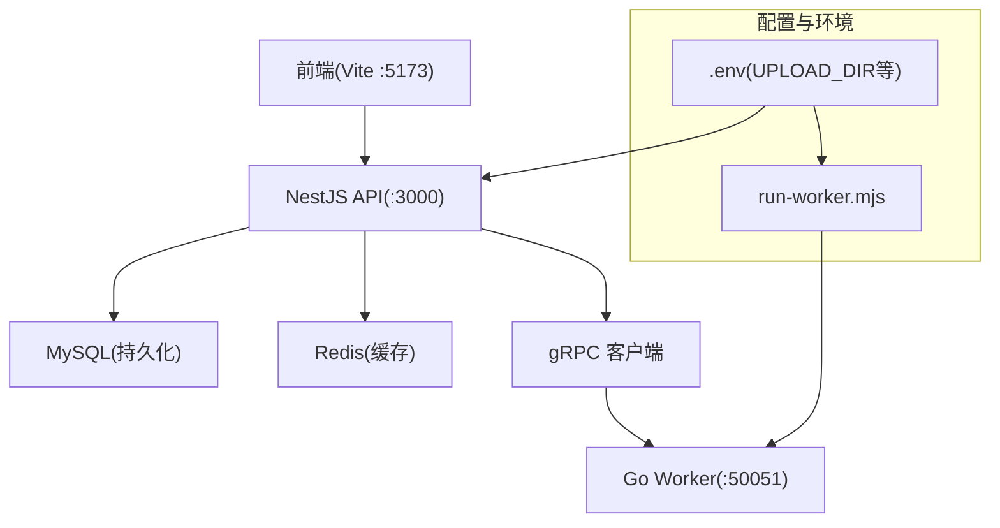
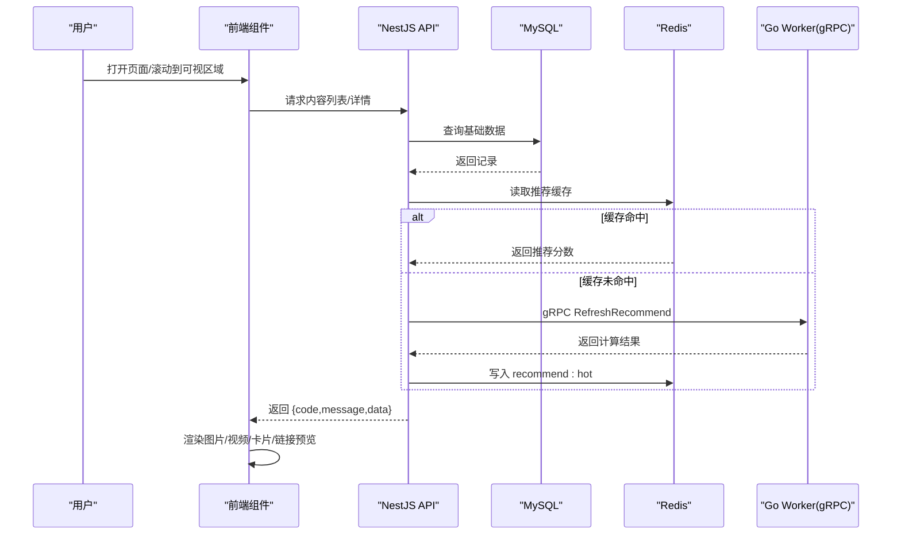
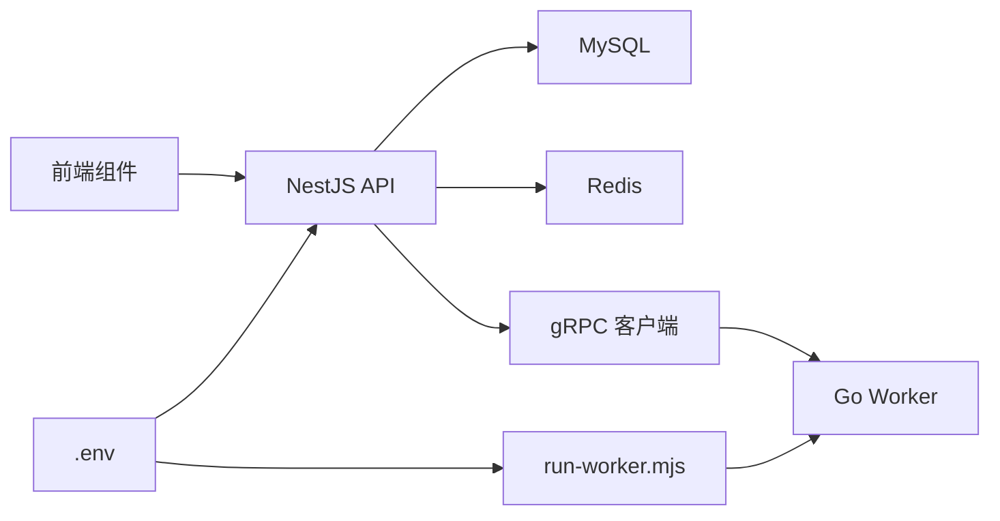

# 内容展示组件

<cite>
**本文引用的文件**   
- [plan.md](file://plan.md)
- [AGENTS.md](file://AGENTS.md)
- [packages/api/.env](file://packages/api/.env)
- [scripts/run-worker.mjs](file://scripts/run-worker.mjs)
- [proto/xqecz.proto](file://proto/xqecz.proto)
- [packages/frontend/src/api/index.ts](file://packages/frontend/src/api/index.ts)
</cite>

## 目录
1. [简介](#简介)
2. [项目结构](#项目结构)
3. [核心组件](#核心组件)
4. [架构总览](#架构总览)
5. [详细组件分析](#详细组件分析)
6. [依赖分析](#依赖分析)
7. [性能考虑](#性能考虑)
8. [故障排查指南](#故障排查指南)
9. [结论](#结论)
10. [附录](#附录)

## 简介
本文件面向 xqecz 平台的内容展示层，聚焦四类前端展示组件：图片展示、视频播放、图文卡片与链接预览。文档从数据结构、渲染逻辑、用户交互、媒体处理策略、缓存机制与性能优化等方面给出完整说明，并补充配置项、事件回调与扩展方式，以及集成示例与最佳实践。

项目定位与运行要点（来自仓库约定）：
- 小泉动漫二创站，用户上传/浏览二次创作内容（图片、视频、图文、链接），含评论、投票与管理后台。
- 唯一运行方式：pnpm dev 启动 NestJS API(:3000)、Go Worker(:50051)、Vite 前端(:5173)；生产模式 pnpm start 一键构建+运行。
- 前后端接口契约统一封装在 packages/frontend/src/api/index.ts，响应格式为 { code, message, data }。
- gRPC 契约定义于 proto/xqecz.proto；NestJS 客户端设置 keepCase:true，字段使用 snake_case。
- 共享上传目录由 UPLOAD_DIR 环境变量约定，单一配置源为 packages/api/.env；worker 经 scripts/run-worker.mjs 启动时自动读取同一 .env 注入，文件路径以绝对路径传递。
- 推荐链路：api 的 ContentService.refreshRecommend() 读 MySQL → gRPC RefreshRecommend 由 worker 纯打分 → api 写 Redis ZSet recommend:hot（ioredis keyPrefix=xqecz:）；读取降级为 view_count 排序。
- 所有删除均为软删除（deleted_at + TypeORM @DeleteDateColumn 自动过滤）；外部依赖缺失一律降级，gRPC 不返 rpc error，只返 success=false + error 文本。

**章节来源**
- [plan.md](file://plan.md)
- [AGENTS.md](file://AGENTS.md)
- [packages/api/.env](file://packages/api/.env)
- [scripts/run-worker.mjs](file://scripts/run-worker.mjs)
- [proto/xqecz.proto](file://proto/xqecz.proto)
- [packages/frontend/src/api/index.ts](file://packages/frontend/src/api/index.ts)

## 项目结构
xqecz 采用 monorepo 组织，关键目录与职责如下：
- packages/api：NestJS 后端服务，负责业务编排、数据库访问、缓存与 gRPC 客户端调用。
- packages/worker：Go 无状态计算服务，接收 gRPC 请求执行纯计算任务，结果回传。
- packages/frontend：Vite 前端应用，提供页面与内容展示组件。
- proto：gRPC 协议定义，生成代码用于前后端与服务间通信。
- scripts：运行脚本，如 run-worker.mjs 负责注入环境变量并启动 worker。

**图表来源**
- [packages/api/.env](file://packages/api/.env)
- [scripts/run-worker.mjs](file://scripts/run-worker.mjs)
- [proto/xqecz.proto](file://proto/xqecz.proto)

**章节来源**
- [packages/api/.env](file://packages/api/.env)
- [scripts/run-worker.mjs](file://scripts/run-worker.mjs)
- [proto/xqecz.proto](file://proto/xqecz.proto)

## 核心组件
本节概述四类内容展示组件的职责与边界：
- 图片展示组件：支持缩放、懒加载、多图轮播，适配不同尺寸与比例，具备占位图与错误兜底。
- 视频播放器组件：支持多种格式、播放控制、字幕显示，具备预加载与断点续播体验优化。
- 图文卡片组件：标题、摘要、标签、元数据（作者、时间、点赞数等），支持点击跳转与分享。
- 链接预览组件：抓取/渲染链接封面、标题、描述，具备缓存与降级策略。

这些组件在前端通过统一的 API 契约获取数据，并在渲染层遵循可配置、可扩展的设计原则。

**章节来源**
- [packages/frontend/src/api/index.ts](file://packages/frontend/src/api/index.ts)

## 架构总览
内容展示组件的数据流与渲染流程如下：
- 前端组件发起数据请求（图片/视频/图文/链接元信息）。
- NestJS API 聚合数据，必要时调用 Go Worker 进行计算（如推荐打分）。
- 结果写入 Redis 缓存或返回给前端；前端根据组件类型渲染 UI。
- 媒体资源（图片/视频）通过 CDN 或直链加载，结合懒加载与缩略图提升性能。

**图表来源**
- [packages/frontend/src/api/index.ts](file://packages/frontend/src/api/index.ts)
- [proto/xqecz.proto](file://proto/xqecz.proto)

**章节来源**
- [packages/frontend/src/api/index.ts](file://packages/frontend/src/api/index.ts)
- [proto/xqecz.proto](file://proto/xqecz.proto)

## 详细组件分析

### 图片展示组件
- 数据结构要求
  - 图片条目需包含：唯一标识、URL/CDN 地址、宽高比或尺寸、缩略图 URL、懒加载阈值、是否参与轮播。
  - 多图集合需包含：顺序索引、当前页码、切换动画参数。
- 渲染逻辑
  - 首屏优先渲染可见区域图片，非可见区域使用 IntersectionObserver 触发懒加载。
  - 大图按需加载原图，缩略图作为占位，避免布局抖动。
  - 轮播组件基于触摸/鼠标拖拽与自动播放，支持循环与指示器。
- 用户交互行为
  - 双击放大、滚轮缩放、拖拽平移；长按保存（受权限控制）。
  - 错误状态显示占位图与重试按钮；网络失败时自动降级为缩略图。
- 媒体处理策略与缓存
  - 浏览器缓存：利用 HTTP 缓存头与 ETag；本地缓存缩略图与最近浏览图片。
  - 服务端缓存：图片元信息（尺寸、比例）缓存至 Redis，减少重复计算。
- 性能优化
  - 图片压缩与 WebP/AVIF 自适应；延迟加载与分片加载。
  - 虚拟列表渲染长列表，限制并发请求数量。
- 配置选项
  - 是否启用懒加载、缩略图策略、轮播间隔、缩放上限、错误重试次数。
- 事件回调
  - onImageLoad、onImageError、onSlideChange、onZoomChange。
- 自定义扩展
  - 替换懒加载实现、接入第三方水印/防盗链、扩展手势识别。

**章节来源**
- [packages/frontend/src/api/index.ts](file://packages/frontend/src/api/index.ts)

### 视频播放器组件
- 数据结构要求
  - 视频条目需包含：视频 URL/CDN、封面图、时长、分辨率、字幕文件 URL、播放权限。
  - 播放状态需包含：当前时间、音量、倍速、全屏状态、字幕轨道。
- 渲染逻辑
  - 使用 HTML5 Video 或 H5 播放器库，按浏览器能力选择编码格式（H.264/H.265/WebM）。
  - 首帧预加载封面，进入可视区域后开始缓冲；支持分段加载与断点续播。
- 用户交互行为
  - 播放/暂停、进度条拖动、音量调节、全屏切换、字幕开关与语言切换。
  - 键盘快捷键（空格播放/暂停、方向键快进/后退、M 静音）。
- 媒体处理策略与缓存
  - 浏览器缓存播放片段；服务端缓存字幕与元信息。
  - 多清晰度切换时优先命中缓存，降低带宽消耗。
- 性能优化
  - 自适应码率（ABR）、预加载下一段、节流事件与防抖拖动。
  - 低电量/弱网模式下自动降清。
- 配置选项
  - 默认清晰度、是否自动播放、是否显示控件、字幕默认语言、错误重试策略。
- 事件回调
  - onPlay、onPause、onTimeUpdate、onEnded、onSubtitleChange、onQualityChange。
- 自定义扩展
  - 接入弹幕、画中画、投屏、录制回放；扩展字幕解析器。

**章节来源**
- [packages/frontend/src/api/index.ts](file://packages/frontend/src/api/index.ts)

### 图文卡片组件
- 数据结构要求
  - 标题、摘要、标签数组、元数据（作者、发布时间、点赞数、评论数、浏览量）。
  - 封面图 URL、分类、状态（已发布/草稿/归档）。
- 渲染逻辑
  - 网格/瀑布流布局，按权重排序（推荐分数或热度）；空状态与骨架屏。
  - 点击跳转详情页，支持长按菜单（收藏/分享/举报）。
- 用户交互行为
  - 点赞、收藏、分享、筛选标签、搜索关键词高亮。
- 媒体处理策略与缓存
  - 封面图懒加载与缩略图策略；热门卡片缓存至本地存储。
- 性能优化
  - 虚拟列表渲染、分页加载、去抖搜索与节流滚动。
- 配置选项
  - 布局模式、每行列数、是否显示摘要、是否显示标签、点击行为。
- 事件回调
  - onClick、onLike、onFavorite、onShare、onFilterChange。
- 自定义扩展
  - 自定义卡片模板、接入统计埋点、扩展分享渠道。

**章节来源**
- [packages/frontend/src/api/index.ts](file://packages/frontend/src/api/index.ts)

### 链接预览组件
- 数据结构要求
  - 链接 URL、标题、描述、封面图、站点名称、是否安全校验通过。
- 渲染逻辑
  - 首次请求抓取元信息（Open Graph 等），失败时降级为默认占位。
  - 缓存命中后直接渲染，避免重复抓取。
- 用户交互行为
  - 点击在新窗口打开、复制链接、标记为不安全链接。
- 媒体处理策略与缓存
  - 封面图与元信息缓存至 Redis；本地缓存最近预览链接。
- 性能优化
  - 异步抓取与超时控制；并发限制与重试退避。
- 配置选项
  - 是否启用抓取、超时时间、缓存过期时间、是否校验安全。
- 事件回调
  - onFetchSuccess、onFetchError、onClickLink、onMarkUnsafe。
- 自定义扩展
  - 接入第三方预览服务、扩展安全校验规则、自定义渲染模板。

**章节来源**
- [packages/frontend/src/api/index.ts](file://packages/frontend/src/api/index.ts)

## 依赖分析
组件对外部依赖的耦合关系如下：
- 前端组件依赖 API 契约（packages/frontend/src/api/index.ts）获取数据。
- NestJS API 依赖 MySQL、Redis 与 gRPC 客户端（proto/xqecz.proto）。
- Go Worker 无状态，仅依赖输入参数与计算逻辑，输出结果回传。
- 环境变量（packages/api/.env）与启动脚本（scripts/run-worker.mjs）确保一致的配置注入。

**图表来源**
- [packages/api/.env](file://packages/api/.env)
- [scripts/run-worker.mjs](file://scripts/run-worker.mjs)
- [proto/xqecz.proto](file://proto/xqecz.proto)
- [packages/frontend/src/api/index.ts](file://packages/frontend/src/api/index.ts)

**章节来源**
- [packages/api/.env](file://packages/api/.env)
- [scripts/run-worker.mjs](file://scripts/run-worker.mjs)
- [proto/xqecz.proto](file://proto/xqecz.proto)
- [packages/frontend/src/api/index.ts](file://packages/frontend/src/api/index.ts)

## 性能考虑
- 懒加载与虚拟列表：仅在可视区域渲染，减少 DOM 压力。
- 媒体资源优化：图片压缩与格式自适应；视频 ABR 与分段加载。
- 缓存策略：Redis 缓存推荐与元信息；浏览器缓存与本地存储配合。
- 并发控制：限制同时请求数量，避免雪崩。
- 降级策略：外部依赖缺失时优雅降级，保证可用性。

[本节为通用指导，无需具体文件引用]

## 故障排查指南
- 常见问题
  - 图片加载失败：检查 URL 可达性、CDN 配置、跨域策略与错误重试。
  - 视频无法播放：确认编码格式、字幕文件路径、浏览器兼容性。
  - 推荐不更新：检查 gRPC 连接、Worker 状态、Redis 写入与 keyPrefix。
  - 链接预览失败：抓取超时、目标站点屏蔽、安全校验拦截。
- 调试建议
  - 查看 API 响应 {code,message,data} 中的 message 与 data 字段。
  - 检查 .env 中 UPLOAD_DIR 与端口配置是否正确。
  - 使用浏览器开发者工具观察网络请求与缓存命中情况。
  - 核对 proto 字段命名（snake_case）与 keepCase 设置。

**章节来源**
- [packages/api/.env](file://packages/api/.env)
- [packages/frontend/src/api/index.ts](file://packages/frontend/src/api/index.ts)
- [proto/xqecz.proto](file://proto/xqecz.proto)

## 结论
内容展示组件围绕图片、视频、图文卡片与链接预览四大类，形成统一的数据获取与渲染体系。通过懒加载、缓存、降级与性能优化策略，保障用户体验与系统稳定性。组件具备可配置、可扩展特性，便于后续功能迭代与生态集成。

[本节为总结性内容，无需具体文件引用]

## 附录
- 集成示例（步骤概览）
  - 安装依赖并启动开发环境：pnpm dev。
  - 配置 .env 中的 UPLOAD_DIR 与必要端口。
  - 在页面中引入对应组件，传入数据模型与配置项。
  - 监听事件回调，实现业务逻辑（如点赞、分享）。
- 扩展方法
  - 替换懒加载实现：注入自定义 IntersectionObserver 逻辑。
  - 扩展播放器能力：接入弹幕、画中画、投屏等插件。
  - 自定义链接预览：对接第三方服务或自建抓取器。

[本节为操作指引，无需具体文件引用]