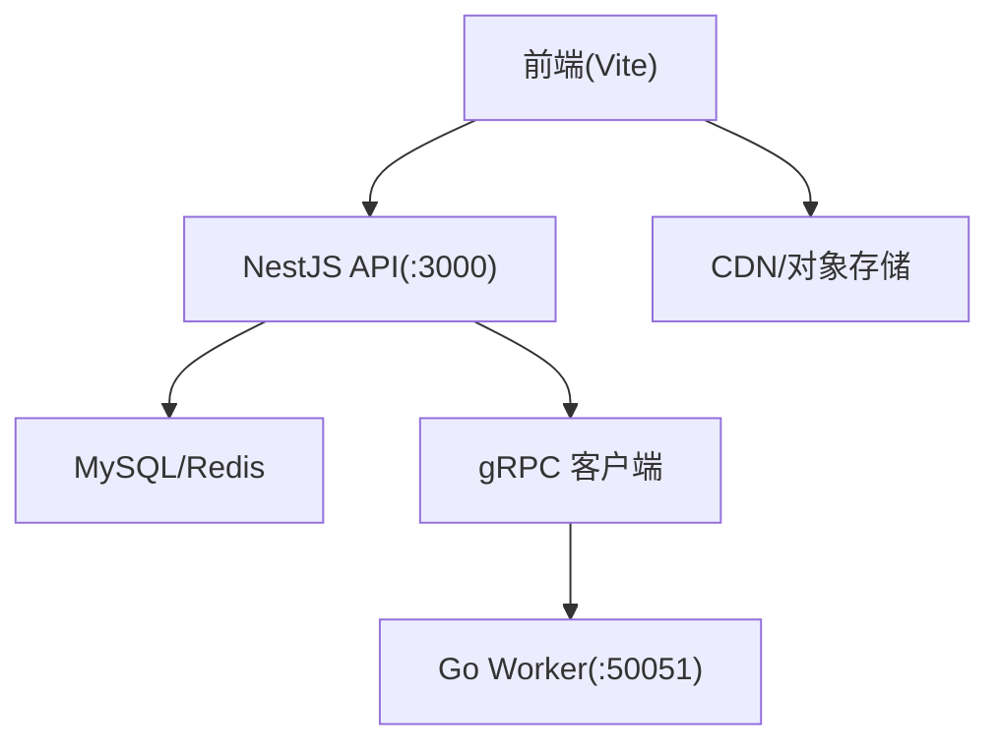
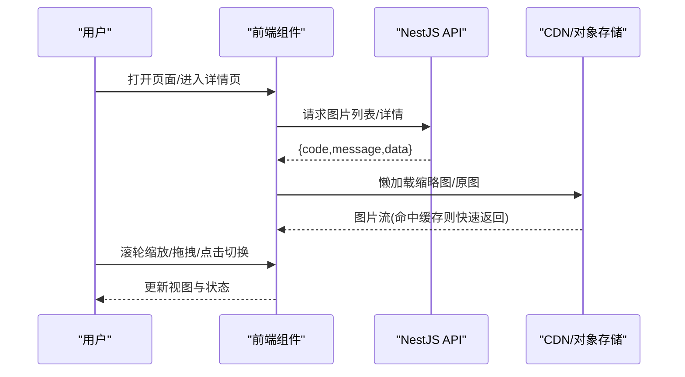
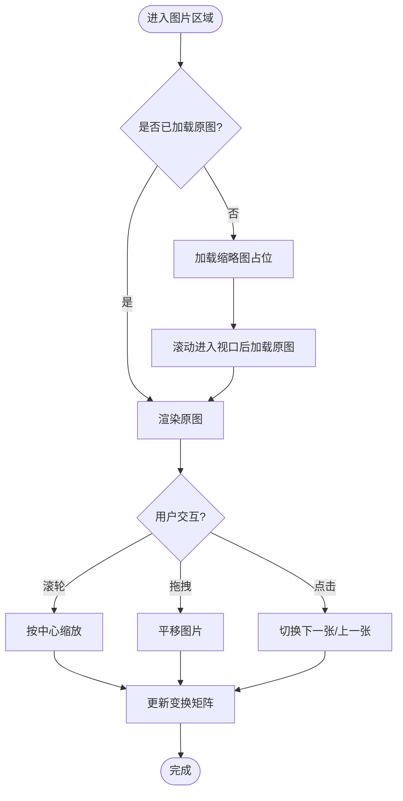
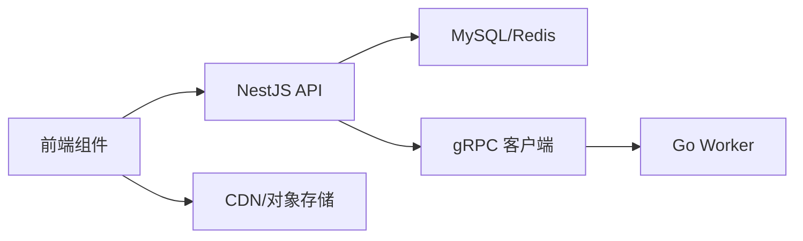

# 图片展示组件

<cite>
**本文引用的文件**   
- [packages/frontend/src/api/index.ts](file://packages/frontend/src/api/index.ts)
- [proto/xqecz.proto](file://proto/xqecz.proto)
- [package.json](file://package.json)
- [pnpm-workspace.yaml](file://pnpm-workspace.yaml)
</cite>

## 目录
1. [简介](#简介)
2. [项目结构](#项目结构)
3. [核心组件](#核心组件)
4. [架构总览](#架构总览)
5. [详细组件分析](#详细组件分析)
6. [依赖分析](#依赖分析)
7. [性能考虑](#性能考虑)
8. [故障排查指南](#故障排查指南)
9. [结论](#结论)
10. [附录](#附录)

## 简介
本文件面向 xqecz 平台的“图片展示组件”，聚焦以下能力：
- 图片懒加载与占位策略
- 缩放（鼠标滚轮缩放、拖拽平移）
- 多图轮播切换
- 缩略图预览
- 数据结构约定（src、alt、width、height、thumbnail 等）
- 渲染逻辑与用户交互行为
- 资源处理策略（格式转换、尺寸优化、CDN 缓存、错误降级）
- 配置项、事件回调与扩展点
- 使用示例与集成指南（内容卡片、详情页、画廊）

说明：当前仓库未包含前端图片组件的具体实现源码，本文基于平台定位、前后端契约与通用工程实践给出可落地的设计与集成方案。若后续接入具体实现，可按本文规范对齐接口与行为。

## 项目结构
- 前端位于 packages/frontend，API 契约定义在 packages/frontend/src/api/index.ts，统一响应格式为 { code, message, data }。
- gRPC 契约定义在 proto/xqecz.proto，NestJS 客户端启用 keepCase:true，字段采用 snake_case。
- 运行方式：pnpm dev 启动 NestJS API(:3000)、Go Worker(:50051)、Vite 前端(:5173)。

图表来源
- [packages/frontend/src/api/index.ts](file://packages/frontend/src/api/index.ts)
- [proto/xqecz.proto](file://proto/xqecz.proto)

章节来源
- [packages/frontend/src/api/index.ts](file://packages/frontend/src/api/index.ts)
- [proto/xqecz.proto](file://proto/xqecz.proto)
- [package.json](file://package.json)
- [pnpm-workspace.yaml](file://pnpm-workspace.yaml)

## 核心组件
- 图片展示组件（ImageViewer）
  - 功能：懒加载、缩放、拖拽、轮播、缩略图预览、错误降级、占位符
  - 输入：图片数据数组、当前索引、配置项、事件回调
  - 输出：渲染后的图片视图与交互状态
- 缩略图面板（ThumbnailPanel）
  - 功能：缩略图网格、选中态、点击切换大图
- 轮播控制器（CarouselController）
  - 功能：上一张/下一张、自动播放开关、循环模式、过渡动画

章节来源
- [packages/frontend/src/api/index.ts](file://packages/frontend/src/api/index.ts)

## 架构总览
图片展示组件的端到端流程如下：
- 前端请求图片元数据与地址（通过 API），获取 src、thumbnail、宽高等信息
- 按需懒加载真实图片，失败时回退到占位图或缩略图
- 支持滚轮缩放与拖拽平移，限制最大缩放比例
- 多图场景下提供轮播与缩略图导航
- 资源经 CDN 缓存，结合浏览器缓存与 ETag/Last-Modified 提升性能

图表来源
- [packages/frontend/src/api/index.ts](file://packages/frontend/src/api/index.ts)
- [proto/xqecz.proto](file://proto/xqecz.proto)

## 详细组件分析

### 数据结构约定
- 单张图片对象字段
  - src: string，原图 URL（建议带尺寸参数）
  - thumbnail: string，缩略图 URL（用于懒加载与预览）
  - alt: string，替代文本（无障碍与 SEO）
  - width: number，原始宽度
  - height: number，原始高度
  - orientation?: "landscape" | "portrait" | "square"，可选方向信息
  - mimeType?: string，媒体类型
  - size?: number，字节数
  - cdnKey?: string，CDN Key（便于清理缓存）
  - meta?: object，扩展元数据（如作者、版权、拍摄时间）
- 图片列表
  - items: ImageItem[]
  - total: number
  - page: number
  - pageSize: number
- 响应包装
  - code: number
  - message: string
  - data: any（图片数据或分页对象）

章节来源
- [packages/frontend/src/api/index.ts](file://packages/frontend/src/api/index.ts)

### 渲染逻辑与交互
- 懒加载
  - 首屏仅加载缩略图，滚动进入视口后再加载原图
  - 占位符：骨架屏或纯色块，避免布局抖动
- 缩放与平移
  - 滚轮缩放：以鼠标位置为中心放大/缩小，限制最小/最大比例
  - 拖拽平移：按下拖动移动图片，边界检测防止越界
  - 双击重置缩放与位置
- 轮播切换
  - 左右箭头、键盘左右键、触摸滑动
  - 循环模式与自动播放（可配置）
- 缩略图预览
  - 底部或侧边缩略图条，点击切换当前大图
  - 高亮当前选中项，支持键盘导航

### 资源处理策略
- 格式转换与尺寸优化
  - 服务端或 CDN 根据请求参数生成不同尺寸与格式（WebP/AVIF）
  - 优先加载缩略图，再渐进加载高清原图
- CDN 缓存机制
  - 使用稳定 URL + 版本化参数（如 v=xxx）
  - 合理设置 Cache-Control、ETag、Last-Modified
- 错误降级
  - 网络失败或 4xx/5xx 时显示占位图或缩略图
  - 记录错误日志并上报监控，不影响整体浏览体验

### 配置选项
- maxZoom: number，最大缩放比例（默认 5）
- minZoom: number，最小缩放比例（默认 0.5）
- zoomStep: number，每次滚轮缩放步长（默认 0.2）
- enablePan: boolean，是否允许拖拽平移（默认 true）
- loop: boolean，是否循环轮播（默认 true）
- autoplay: boolean，是否自动播放（默认 false）
- interval: number，自动播放间隔（毫秒，默认 3000）
- placeholder: string，占位图 URL 或颜色
- errorFallback: string，错误回退图 URL
- lazyThreshold: number，懒加载阈值（像素，默认 200）
- preloadNext: boolean，预加载下一张（默认 true）

### 事件回调
- onLoad(imageIndex, imageInfo): 图片加载成功
- onError(imageIndex, error): 图片加载失败
- onZoom(scale, center): 缩放变化
- onPan(offsetX, offsetY): 平移变化
- onSwitch(index, direction): 切换图片
- onVisibleChange(visible): 可见性变化（用于统计与埋点）

### 自定义扩展方法
- setTransform(scale, offsetX, offsetY): 设置变换矩阵
- reset(): 重置缩放与位置
- next()/prev(): 手动切换
- loadByIndex(index): 指定索引加载
- getBounds(): 获取当前可视范围与偏移

章节来源
- [packages/frontend/src/api/index.ts](file://packages/frontend/src/api/index.ts)

## 依赖分析
- 前端依赖
  - Vite 构建与开发服务器
  - 图片懒加载库（可选 IntersectionObserver 原生实现）
  - 手势与缩放库（可选 Hammer.js / 自研）
- 后端依赖
  - NestJS 作为 API 网关，统一响应格式
  - MySQL/Redis 持久化与缓存
  - gRPC 客户端调用 Go Worker（纯计算服务）
- 外部依赖
  - CDN/对象存储（图片分发与缓存）
  - 可选图像处理服务（格式转换、裁剪、压缩）

图表来源
- [packages/frontend/src/api/index.ts](file://packages/frontend/src/api/index.ts)
- [proto/xqecz.proto](file://proto/xqecz.proto)

章节来源
- [packages/frontend/src/api/index.ts](file://packages/frontend/src/api/index.ts)
- [proto/xqecz.proto](file://proto/xqecz.proto)

## 性能考虑
- 懒加载与渐进式加载：先缩略图后原图，减少首屏带宽
- 图片尺寸适配：按设备 DPR 与容器尺寸选择合适分辨率
- 缓存策略：CDN + 浏览器缓存，合理使用版本号与强缓存头
- 预加载：智能预加载下一张，降低切换延迟
- 防抖节流：对缩放与拖拽事件进行节流，避免频繁重排
- 内存管理：及时释放不可见图片的解码与纹理资源

## 故障排查指南
- 图片不显示
  - 检查 src/thumbnail 是否可达，确认 CDN 域名与权限
  - 查看控制台网络请求与错误码，必要时开启调试日志
- 缩放卡顿
  - 检查 transform 更新频率，启用 will-change 与硬件加速
  - 限制最大缩放比例与图片尺寸，避免过大图像解码
- 轮播异常
  - 校验图片数组长度与索引边界
  - 检查自动播放定时器是否正确清理
- 错误降级
  - 确保 fallback 图可用，记录错误上下文以便定位

章节来源
- [packages/frontend/src/api/index.ts](file://packages/frontend/src/api/index.ts)

## 结论
本文给出了 xqecz 平台图片展示组件的完整设计蓝图与集成指南，涵盖数据结构、渲染与交互、资源处理、配置与事件、性能优化与故障排查。实际接入时，请遵循统一的 API 响应格式与 gRPC 契约，确保前后端一致性与可扩展性。

## 附录

### 使用示例与集成指南
- 内容卡片
  - 使用缩略图 thumbnail 作为卡片封面，点击跳转详情页
  - 懒加载原图，提升列表滚动性能
- 详情页
  - 大图全屏查看，支持滚轮缩放与拖拽平移
  - 顶部显示标题与描述，底部显示缩略图导航
- 画廊
  - 多图轮播，支持循环与自动播放
  - 缩略图网格快速定位，键盘与触摸友好

章节来源
- [packages/frontend/src/api/index.ts](file://packages/frontend/src/api/index.ts)