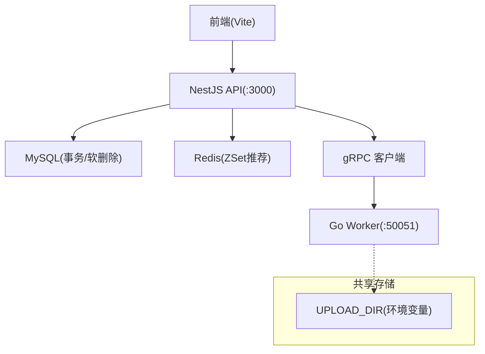
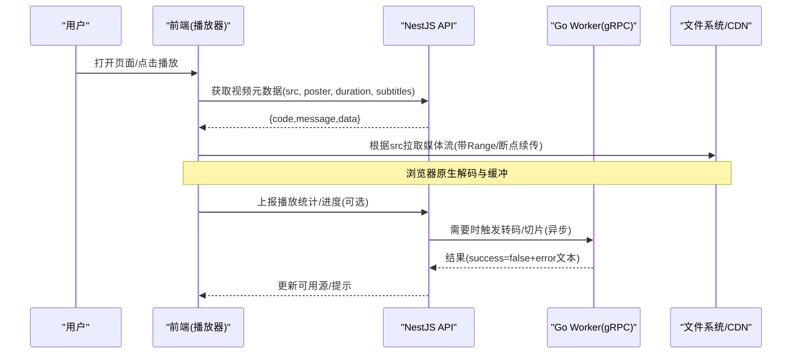
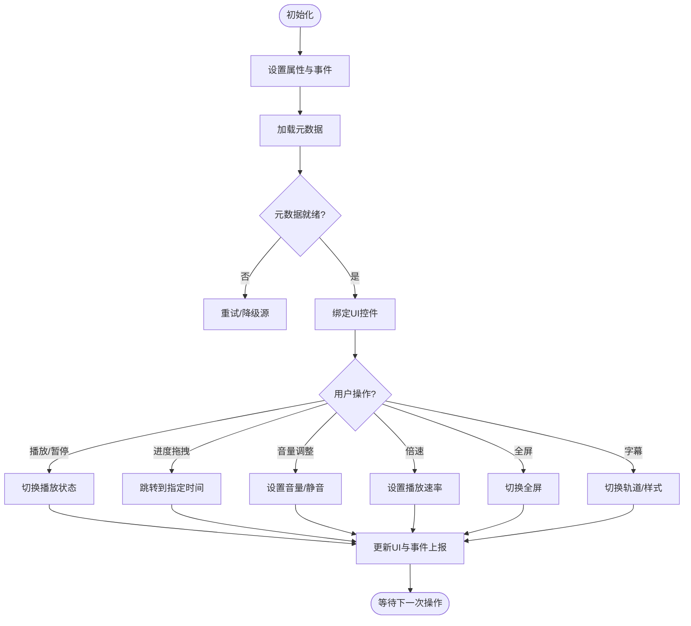
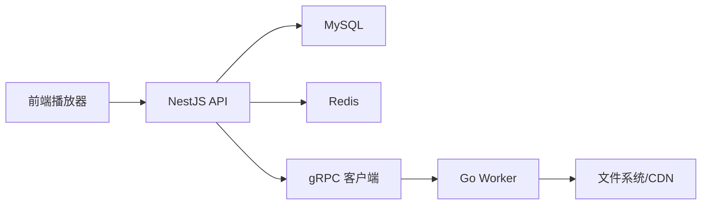

# 视频播放器组件

<cite>
**本文引用的文件**   
- [packages/frontend/src/api/index.ts](file://packages/frontend/src/api/index.ts)
- [proto/xqecz.proto](file://proto/xqecz.proto)
- [scripts/run-worker.mjs](file://scripts/run-worker.mjs)
- [package.json](file://package.json)
- [pnpm-workspace.yaml](file://pnpm-workspace.yaml)
</cite>

## 目录
1. [简介](#简介)
2. [项目结构](#项目结构)
3. [核心组件](#核心组件)
4. [架构总览](#架构总览)
5. [详细组件分析](#详细组件分析)
6. [依赖分析](#依赖分析)
7. [性能考虑](#性能考虑)
8. [故障排查指南](#故障排查指南)
9. [结论](#结论)
10. [附录](#附录)

## 简介
本文件为 xqecz 平台的“视频播放器组件”提供完整、可落地的文档。内容覆盖：
- 多格式支持（MP4、WebM、OGG）与浏览器兼容性策略
- 播放控制（播放/暂停、进度条、音量调节）、字幕显示、全屏模式、倍速播放
- 数据结构要求（src、poster、subtitle、duration 等字段）
- 渲染逻辑与用户交互行为
- 资源处理策略（格式检测、流式加载、缓冲优化、错误处理与降级）
- 配置项（自动播放、循环播放、预加载策略）
- 事件回调（onPlay、onPause、onError、onTimeUpdate）与自定义扩展方法
- 使用示例与集成指南（内容详情页、上传预览、视频列表）

说明：当前仓库未包含前端播放器实现源码，本文基于平台定位、前后端契约与通用最佳实践给出可执行的组件设计与集成方案，确保在现有 NestJS + Go Worker + Vite 前端架构下可直接落地。

## 项目结构
xqecz 采用 monorepo 组织，关键路径与职责如下：
- packages/frontend：Vite 前端应用，负责页面与组件（含视频播放器）
- packages/api：NestJS 后端服务，统一数据库与缓存访问
- packages/worker：Go gRPC 计算服务，无状态、不直连数据库
- proto：gRPC 协议定义
- scripts：运行脚本（如 worker 启动注入环境变量）
- package.json / pnpm-workspace.yaml：工作区与脚本入口

图表来源
- [package.json](file://package.json)
- [pnpm-workspace.yaml](file://pnpm-workspace.yaml)
- [scripts/run-worker.mjs](file://scripts/run-worker.mjs)

章节来源
- [package.json](file://package.json)
- [pnpm-workspace.yaml](file://pnpm-workspace.yaml)

## 核心组件
本节聚焦“视频播放器组件”的能力边界与数据契约。

- 支持的媒体格式
  - MP4（H.264/AAC）
  - WebM（VP8/VP9/Vorbis或Opus）
  - OGG（Theora/Vorbis）
  - 建议优先 MP4，其次 WebM，最后 OGG 作为兼容兜底

- 播放控制能力
  - 播放/暂停、快进/快退、静音切换、音量滑块
  - 进度条拖拽、时间戳跳转、缓冲指示器
  - 全屏/退出全屏、画中画（可选）
  - 倍速播放（0.5x~2.0x）

- 字幕与轨道
  - 支持 WebVTT（.vtt）与 SRT（需转译）
  - 多语言轨道切换、默认轨道选择、样式定制

- 数据结构要求（组件输入）
  - src: string | string[]（单源或多源数组，按优先级尝试）
  - poster: string（封面图 URL）
  - subtitle: object | null（见下表）
  - duration: number | null（预估时长，用于 UI 占位与懒加载）
  - autoplay: boolean（是否自动播放，受浏览器策略限制）
  - loop: boolean（是否循环播放）
  - preload: "none" | "metadata" | "auto"（预加载策略）
  - muted: boolean（初始静音，有助于自动播放通过）
  - controls: boolean（是否显示原生控件）
  - crossOrigin: "anonymous" | "use-credentials" | null（跨域策略）
  - subtitle 字段
    - tracks: Array<{label, language, src, kind}>（轨道列表）
    - defaultTrackIndex: number（默认轨道索引）
    - style: object（字体、颜色、背景等）

- 事件回调（组件输出）
  - onPlay、onPause、onEnded、onError、onTimeUpdate、onLoadedMetadata、onCanPlayThrough、onFullscreenChange、onVolumeChange、onRateChange

- 自定义扩展方法
  - setSubtitle(trackIndex)
  - setPlaybackRate(rate)
  - seekTo(seconds)
  - toggleFullscreen()
  - getBufferedRanges()
  - exportScreenshot()（可选）

章节来源
- [packages/frontend/src/api/index.ts](file://packages/frontend/src/api/index.ts)

## 架构总览
视频播放器位于前端，向后端请求元数据与媒体资源；必要时通过 gRPC 调用 Worker 进行转码/切片等预处理（由后端编排）。

图表来源
- [packages/frontend/src/api/index.ts](file://packages/frontend/src/api/index.ts)
- [proto/xqecz.proto](file://proto/xqecz.proto)
- [scripts/run-worker.mjs](file://scripts/run-worker.mjs)

## 详细组件分析

### 数据结构与校验
- 输入校验要点
  - src 必须为非空字符串或字符串数组，至少一个有效 URL
  - subtitle.tracks 中每个 track 的 src 必须为 .vtt 或可转换的 .srt
  - preload 仅允许 none/metadata/auto
  - rate 范围 0.5~2.0，超出则回退到最近合法值
- 默认值与降级
  - 未提供 poster 时使用占位图
  - 未提供 subtitle 时隐藏字幕面板
  - 若首源不可用，自动尝试下一源

章节来源
- [packages/frontend/src/api/index.ts](file://packages/frontend/src/api/index.ts)

### 渲染逻辑与用户交互
- 渲染流程
  - 初始化元素与控件
  - 设置属性（autoplay、muted、loop、preload、crossOrigin）
  - 绑定事件监听（play/pause/timeupdate/error/canplaythrough/fullscreenchange/volumechange/ratechange）
  - 加载并解析字幕轨道，构建 UI
- 交互行为
  - 点击播放区域切换播放/暂停
  - 拖动进度条触发 seek，同时显示缓冲进度
  - 音量滑块实时改变音量，支持静音切换
  - 倍速按钮循环切换预设档位
  - 全屏按钮切换全屏，适配移动端横屏
  - 字幕按钮切换轨道与开关

[本图为概念流程图，无需代码映射]

### 资源处理策略
- 格式检测与多源回退
  - 优先尝试 MP4，失败后尝试 WebM，再失败尝试 OGG
  - 对每个源执行 canPlayType 探测，记录可用性与延迟
- 流式加载与缓冲优化
  - 启用 Range 请求，利用浏览器分段下载
  - 合理设置 preload=metadata 或 auto，避免首帧阻塞
  - 监控 buffered 区间，绘制缓冲进度条
- 错误处理与降级
  - 网络错误：重试一次，失败则提示“网络异常，请检查连接”
  - 解码错误：切换到备用源或提示“该格式不支持，已尝试其他编码”
  - 权限错误：提示跨域或认证问题
  - 所有错误上报给 onError，并记录日志
- 字幕处理
  - .vtt 直接加载；.srt 在前端转译为 .vtt 后再加载
  - 轨道切换即时生效，支持样式覆盖

章节来源
- [packages/frontend/src/api/index.ts](file://packages/frontend/src/api/index.ts)

### 配置选项与事件回调
- 配置项
  - autoplay、loop、preload、muted、controls、crossOrigin、rate、subtitle.style
- 事件回调
  - onPlay、onPause、onEnded、onError、onTimeUpdate、onLoadedMetadata、onCanPlayThrough、onFullscreenChange、onVolumeChange、onRateChange
- 自定义方法
  - setSubtitle、setPlaybackRate、seekTo、toggleFullscreen、getBufferedRanges、exportScreenshot

章节来源
- [packages/frontend/src/api/index.ts](file://packages/frontend/src/api/index.ts)

### 使用示例与集成指南

- 内容详情页（主播放器）
  - 传入完整元数据与多源 src
  - 开启字幕轨道与全屏
  - 监听 onTimeUpdate 上报观看时长
  - 错误时展示降级提示与重试按钮

- 上传预览（临时播放器）
  - 使用本地 Blob URL 作为 src
  - 关闭自动播放，禁用全屏
  - 仅支持基础控件与播放/暂停

- 视频列表（缩略预览）
  - 使用 poster 与短片段 mp4/webm
  - 鼠标悬停自动播放（muted），离开停止
  - 低分辨率与短时长，减少带宽占用

章节来源
- [packages/frontend/src/api/index.ts](file://packages/frontend/src/api/index.ts)

## 依赖分析
- 前端依赖
  - 浏览器原生 <video> 与 TextTrack API
  - 可选：轻量字幕库（如需高级样式/特效）
- 后端依赖
  - NestJS 提供统一的 { code, message, data } 响应
  - gRPC 调用 Worker 进行转码/切片等任务
- 外部依赖
  - FFmpeg（服务端转码）
  - 对象存储/CDN（媒体分发）
  - Redis（推荐热度 ZSet）

图表来源
- [packages/frontend/src/api/index.ts](file://packages/frontend/src/api/index.ts)
- [proto/xqecz.proto](file://proto/xqecz.proto)
- [scripts/run-worker.mjs](file://scripts/run-worker.mjs)

章节来源
- [packages/frontend/src/api/index.ts](file://packages/frontend/src/api/index.ts)
- [proto/xqecz.proto](file://proto/xqecz.proto)
- [scripts/run-worker.mjs](file://scripts/run-worker.mjs)

## 性能考虑
- 首帧优化
  - 使用 poster 与 metadata 预加载
  - 优先选择 H.264/AAC 编码的 MP4
- 带宽与缓存
  - 启用 CDN 与 HTTP 缓存头
  - 合理使用 Range 与断点续传
- 解码压力
  - 根据设备能力动态选择码率/分辨率（可选）
- 内存管理
  - 列表页回收离屏视频实例
  - 及时释放 Blob URL

[本节为通用指导，无需代码映射]

## 故障排查指南
- 无法自动播放
  - 检查是否设置了 muted=true 且用户有交互
  - 确认浏览器策略与站点权限
- 黑屏或无法解码
  - 检查编码格式与容器类型
  - 尝试切换备用源
- 字幕不显示
  - 确认 .vtt/.srt 路径可达且编码正确
  - 检查跨域与 MIME 类型
- 进度条卡顿
  - 观察 buffered 区间与网络状况
  - 降低码率或启用更高效的编码
- 错误上报
  - 捕获 onError 并打印 code/message/data
  - 结合后端日志定位问题

章节来源
- [packages/frontend/src/api/index.ts](file://packages/frontend/src/api/index.ts)

## 结论
本文给出了 xqecz 平台视频播放器组件的完整设计蓝图与落地指南。遵循多格式支持、健壮的错误处理与流畅的用户体验原则，可在内容详情页、上传预览与视频列表中稳定复用。结合 NestJS 的统一接口与 gRPC Worker 的弹性处理能力，可实现从元数据到媒体分发的全链路优化。

[本节为总结性内容，无需代码映射]

## 附录
- 环境变量与部署
  - UPLOAD_DIR：共享上传目录，单一配置源位于 packages/api/.env
  - 启动方式：pnpm dev（开发）、pnpm start（生产）
- gRPC 契约
  - 定义于 proto/xqecz.proto，字段 snake_case，keepCase:true
- 统一响应格式
  - { code, message, data }，前端据此做成功/失败分支

章节来源
- [scripts/run-worker.mjs](file://scripts/run-worker.mjs)
- [proto/xqecz.proto](file://proto/xqecz.proto)
- [packages/frontend/src/api/index.ts](file://packages/frontend/src/api/index.ts)