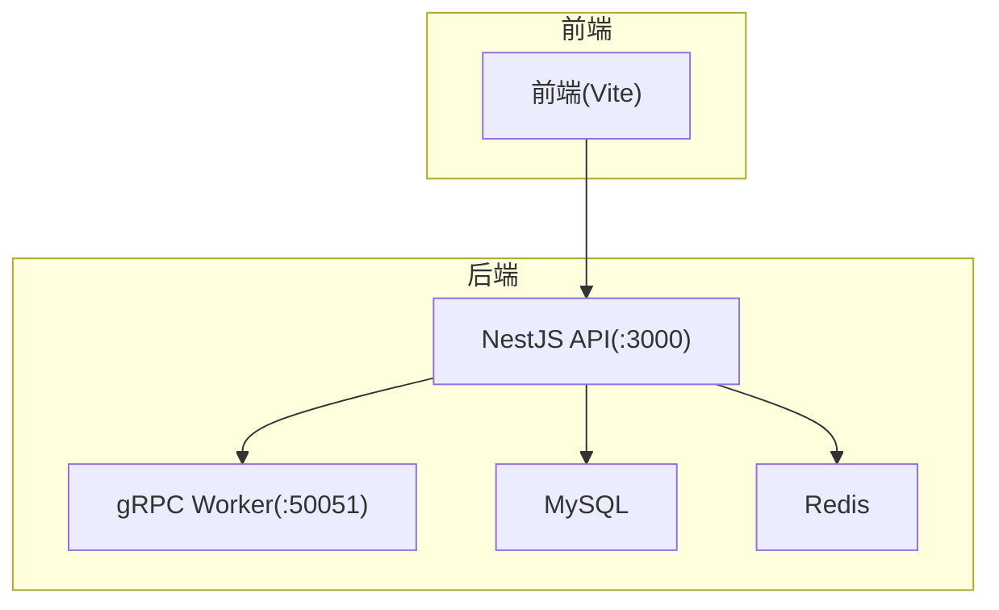
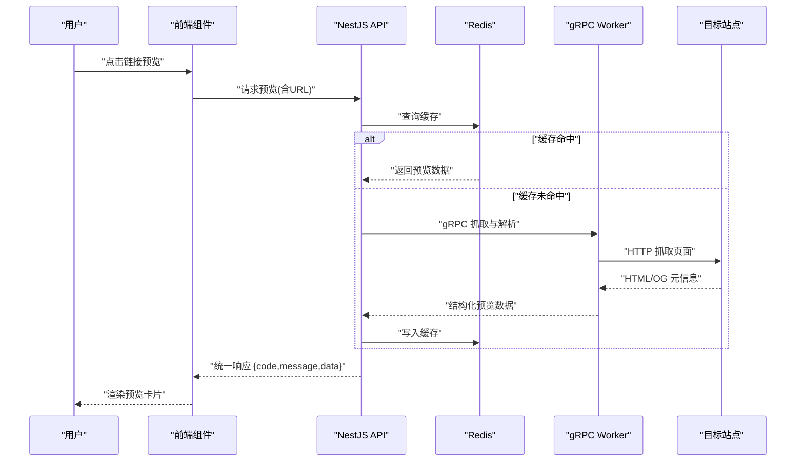
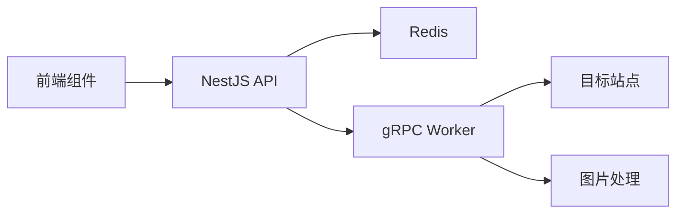

# 链接预览组件

<cite>
**本文引用的文件**
- [packages/frontend/src/api/index.ts](file://packages/frontend/src/api/index.ts)
- [proto/xqecz.proto](file://proto/xqecz.proto)
- [scripts/run-worker.mjs](file://scripts/run-worker.mjs)
- [package.json](file://package.json)
- [pnpm-workspace.yaml](file://pnpm-workspace.yaml)
</cite>

## 目录
1. [简介](#简介)
2. [项目结构](#项目结构)
3. [核心组件](#核心组件)
4. [架构总览](#架构总览)
5. [详细组件分析](#详细组件分析)
6. [依赖关系分析](#依赖关系分析)
7. [性能考量](#性能考量)
8. [故障排查指南](#故障排查指南)
9. [结论](#结论)
10. [附录：使用示例与集成指南](#附录使用示例与集成指南)

## 简介
本文件为 xqecz 平台的“链接预览组件”提供完整技术文档。该组件负责对外部 URL 进行解析、站点图标获取、标题与描述抓取、富媒体预览（Open Graph 协议支持）、安全检查与跳转处理，并提供统一的渲染与交互能力。文档同时覆盖数据结构、渲染逻辑、跨域与缓存策略、超时控制、错误降级、配置项、事件回调以及扩展方法，并给出在分享功能、资源列表和外部链接展示中的集成示例。

## 项目结构
xqecz 采用 monorepo 组织，前端位于 packages/frontend，API 服务位于 packages/api，计算型 gRPC Worker 位于 packages/worker。链接预览的前端交互由 Vite 前端发起，后端通过 NestJS API 暴露统一接口，必要时调用 Go Worker 执行纯计算任务（如页面内容抓取与解析）。前后端契约以 packages/frontend/src/api/index.ts 为唯一入口；gRPC 契约定义于 proto/xqecz.proto；Worker 启动脚本为 scripts/run-worker.mjs。

图表来源
- [packages/frontend/src/api/index.ts](file://packages/frontend/src/api/index.ts)
- [proto/xqecz.proto](file://proto/xqecz.proto)
- [scripts/run-worker.mjs](file://scripts/run-worker.mjs)

章节来源
- [package.json](file://package.json)
- [pnpm-workspace.yaml](file://pnpm-workspace.yaml)

## 核心组件
- 链接预览组件（前端）
  - 输入数据模型：url、title、description、imageUrl、favicon、sourceDomain、createdAt、status 等字段。
  - 渲染逻辑：根据是否存在 imageUrl/favIcon 决定卡片布局；标题与描述截断显示；点击触发安全校验与跳转。
  - 交互行为：onClick 打开目标链接（新窗口或当前页），onError 捕获加载失败，onLoad 回调成功状态。
- 数据获取服务（前端）
  - 调用后端接口获取预览元信息；支持重试与超时；本地缓存最近预览结果。
- 后端预览服务（NestJS）
  - 接收 URL，校验协议与白名单；优先从 Redis 缓存命中；未命中则调用 gRPC Worker 抓取页面元信息（Open Graph、HTML 标题、描述、图片、站点图标）。
- gRPC Worker（Go）
  - 无状态计算服务，执行页面抓取、HTML 解析、OG 标签提取、图片尺寸检测、站点图标下载与转码；返回结构化预览数据。

章节来源
- [packages/frontend/src/api/index.ts](file://packages/frontend/src/api/index.ts)
- [proto/xqecz.proto](file://proto/xqecz.proto)
- [scripts/run-worker.mjs](file://scripts/run-worker.mjs)

## 架构总览
链接预览的数据流遵循“前端请求 → NestJS 校验与缓存 → gRPC Worker 抓取解析 → 回写缓存 → 前端渲染”的链路。所有删除操作均为软删除，外部依赖缺失时一律降级，gRPC 不返回 rpc error，仅返回 success=false 与错误文本。

图表来源
- [packages/frontend/src/api/index.ts](file://packages/frontend/src/api/index.ts)
- [proto/xqecz.proto](file://proto/xqecz.proto)

## 详细组件分析

### 数据结构与字段说明
- url：字符串，目标链接地址，需符合 http(s) 协议。
- title：字符串，页面标题或 OG:title。
- description：字符串，页面描述或 OG:description。
- imageUrl：字符串，首选 OG:image 或页面内最大图片。
- favicon：字符串，站点图标地址（通常为 /favicon.ico 或 <link rel="icon">）。
- sourceDomain：字符串，来源域名，用于显示与外链标识。
- createdAt：时间戳，预览生成时间。
- status：枚举，success/error/pending，表示预览状态。

章节来源
- [packages/frontend/src/api/index.ts](file://packages/frontend/src/api/index.ts)

### 渲染逻辑与用户交互
- 渲染优先级：存在 imageUrl 时显示大图卡片；否则显示标题+描述+站点图标。
- 文本截断：标题最多两行，描述最多三行，超出省略。
- 点击行为：onClick 触发前进行安全校验（白名单、协议检查、长度限制），通过后在新窗口打开目标链接。
- 错误态：当抓取失败或网络异常时，显示占位图与错误提示，支持重试按钮。

章节来源
- [packages/frontend/src/api/index.ts](file://packages/frontend/src/api/index.ts)

### 数据获取与服务调用
- 前端调用统一 API 接口，传入 url 与可选参数（是否强制刷新、是否启用深度预览）。
- 后端先查 Redis 缓存，命中直接返回；未命中则调用 gRPC Worker 抓取页面元信息。
- 统一响应格式 { code, message, data }，前端据此判断成功与失败分支。

章节来源
- [packages/frontend/src/api/index.ts](file://packages/frontend/src/api/index.ts)

### gRPC 契约与 Worker 职责
- gRPC 方法：RefreshPreview(url, options) → PreviewResult{success, error, data}。
- Worker 职责：
  - 抓取 HTML，解析 Open Graph 标签（og:title、og:description、og:image）。
  - 提取页面标题与描述（fallback 到 meta 标签）。
  - 下载并转码站点图标，返回可直链访问的地址。
  - 图片尺寸检测与裁剪建议，避免大图影响性能。
- 错误处理：不抛 rpc error，返回 success=false 与错误文本，便于上层降级。

章节来源
- [proto/xqecz.proto](file://proto/xqecz.proto)
- [scripts/run-worker.mjs](file://scripts/run-worker.mjs)

### 安全检查与跳转处理
- 协议白名单：仅允许 http/https。
- 域名白名单：可配置允许的外部域名集合。
- 长度限制：url 最大长度限制，防止超长注入。
- 跳转策略：默认新窗口打开；支持自定义 onClick 回调覆盖。
- 防钓鱼：对短链与重定向进行检测，必要时提示用户确认。

章节来源
- [packages/frontend/src/api/index.ts](file://packages/frontend/src/api/index.ts)

### 跨域请求处理
- 前端通过代理或 CORS 配置访问后端 API。
- 站点图标与图片资源若跨域，需确保服务端设置正确的 Access-Control-Allow-Origin。
- 对于第三方图片，建议使用后端代理或 CDN 中转，避免浏览器跨域限制。

章节来源
- [packages/frontend/src/api/index.ts](file://packages/frontend/src/api/index.ts)

### 缓存机制与超时控制
- 缓存策略：
  - 短期缓存：Redis 中按 url 存储预览数据，TTL 可配置（默认 5-15 分钟）。
  - 本地缓存：前端内存缓存最近 N 条预览，减少重复请求。
- 超时控制：
  - 前端请求超时：默认 5s，可配置。
  - gRPC 抓取超时：默认 10s，避免长时间阻塞。
  - 图片下载超时：默认 3s，失败则降级为占位图。

章节来源
- [packages/frontend/src/api/index.ts](file://packages/frontend/src/api/index.ts)
- [proto/xqecz.proto](file://proto/xqecz.proto)

### 错误降级方案
- 抓取失败：返回空预览数据，前端显示占位图与错误提示。
- 图片不可用：降级为默认缩略图。
- 站点图标缺失：使用域名首字母图标或默认图标。
- 网络异常：自动重试一次，仍失败则提示用户稍后重试。

章节来源
- [packages/frontend/src/api/index.ts](file://packages/frontend/src/api/index.ts)

### 配置选项
- showFavicon：是否显示站点图标（默认 true）。
- previewDepth：预览深度（basic/full），basic 仅抓取 OG，full 额外解析 HTML。
- securityPolicy：安全策略（strict/relaxed），strict 启用严格白名单与重定向检测。
- cacheTTL：缓存过期时间（秒）。
- requestTimeout：请求超时（毫秒）。
- maxRetries：最大重试次数。

章节来源
- [packages/frontend/src/api/index.ts](file://packages/frontend/src/api/index.ts)

### 事件回调与扩展方法
- onClick：点击预览卡片时的回调，可自定义跳转逻辑。
- onError：抓取或渲染失败时的回调，可用于埋点或提示。
- onLoad：预览数据加载完成后的回调，可用于统计或后续处理。
- onRetry：手动重试按钮触发的回调。
- 扩展方法：
  - setSecurityPolicy：动态调整安全策略。
  - clearCache：清除本地与远程缓存。
  - updateOptions：运行时更新配置。

章节来源
- [packages/frontend/src/api/index.ts](file://packages/frontend/src/api/index.ts)

## 依赖关系分析
- 前端依赖：Vite、React/Vue（视具体实现）、ioredis（本地缓存模拟）、axios/fetch。
- 后端依赖：NestJS、TypeORM、ioredis、gRPC 客户端。
- Worker 依赖：Go、gRPC 服务端、HTML 解析库、图片处理库。
- 外部依赖：目标站点 HTTP 服务、CDN、Tinify/S3（可选）、FFmpeg（可选）。

图表来源
- [packages/frontend/src/api/index.ts](file://packages/frontend/src/api/index.ts)
- [proto/xqecz.proto](file://proto/xqecz.proto)
- [scripts/run-worker.mjs](file://scripts/run-worker.mjs)

章节来源
- [package.json](file://package.json)
- [pnpm-workspace.yaml](file://pnpm-workspace.yaml)

## 性能考量
- 预取策略：在用户悬停或滚动接近可视区域时预取预览数据。
- 懒加载：图片与站点图标延迟加载，减少初始带宽占用。
- 缓存命中率：合理设置 TTL 与本地缓存大小，提升命中率。
- 并发控制：限制同时抓取的请求数，避免对目标站点造成压力。
- 压缩传输：启用 gzip/br 压缩，减少响应体积。

[本节为通用指导，无需特定文件来源]

## 故障排查指南
- 常见问题：
  - 预览数据为空：检查目标站点是否支持 OG 标签，确认 Worker 抓取权限。
  - 图片无法显示：检查跨域配置与图片地址有效性。
  - 跳转被拦截：检查安全策略与白名单配置。
  - 缓存不生效：确认 Redis 连接与 keyPrefix 配置。
- 调试步骤：
  - 查看前端控制台错误日志。
  - 检查后端 API 响应码与消息。
  - 验证 gRPC Worker 日志与抓取结果。
  - 使用 curl 测试目标站点可达性与 OG 标签。

章节来源
- [packages/frontend/src/api/index.ts](file://packages/frontend/src/api/index.ts)
- [proto/xqecz.proto](file://proto/xqecz.proto)

## 结论
链接预览组件通过前后端协同与 gRPC Worker 的纯计算能力，实现了高效、安全、可扩展的 URL 预览功能。合理的缓存策略、超时控制与错误降级确保了用户体验与系统稳定性。通过灵活的配置与事件回调，组件可适配多种业务场景。

[本节为总结性内容，无需特定文件来源]

## 附录：使用示例与集成指南

### 在分享功能中使用
- 用户粘贴 URL 后，组件自动抓取预览数据并显示卡片。
- 支持一键复制分享链接，包含预览摘要。

### 在资源列表中使用
- 列表项右侧显示链接预览缩略图与标题。
- 点击展开详情，支持站内跳转或外链打开。

### 在外部链接展示中使用
- 文章末尾推荐外部资源，显示站点图标与简短描述。
- 点击前进行安全校验，必要时提示用户确认。

章节来源
- [packages/frontend/src/api/index.ts](file://packages/frontend/src/api/index.ts)