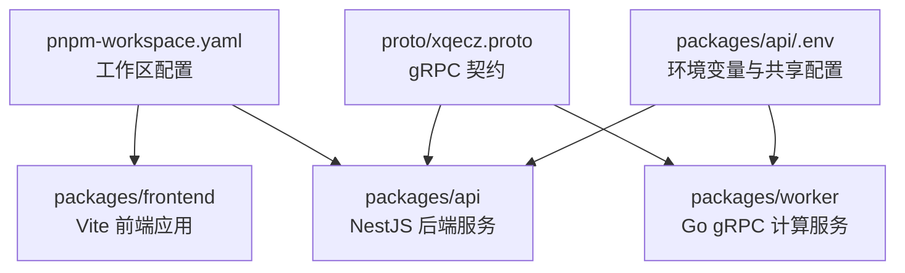
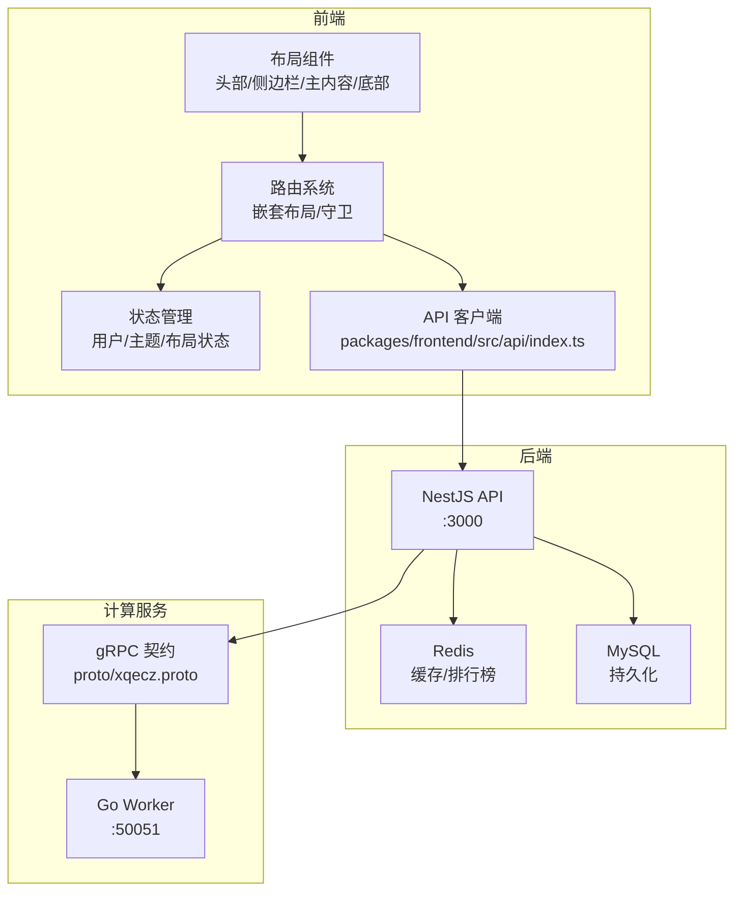
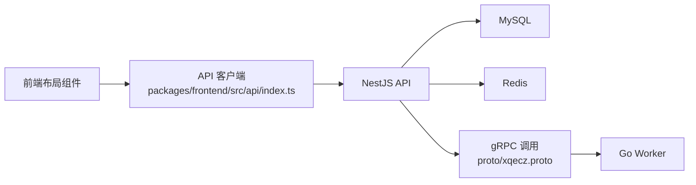

# 布局组件

<cite>
**本文档引用的文件**   
- [package.json](file://package.json)
- [pnpm-workspace.yaml](file://pnpm-workspace.yaml)
- [plan.md](file://plan.md)
- [AGENTS.md](file://AGENTS.md)
- [packages/api/.env](file://packages/api/.env)
- [packages/frontend/src/api/index.ts](file://packages/frontend/src/api/index.ts)
- [proto/xqecz.proto](file://proto/xqecz.proto)
</cite>

## 目录
1. [简介](#简介)
2. [项目结构](#项目结构)
3. [核心组件](#核心组件)
4. [架构总览](#架构总览)
5. [详细组件分析](#详细组件分析)
6. [依赖分析](#依赖分析)
7. [性能考虑](#性能考虑)
8. [故障排查指南](#故障排查指南)
9. [结论](#结论)
10. [附录](#附录)

## 简介
本文件面向 xqecz 平台的“布局组件”体系，目标是系统化说明页面框架（头部导航、侧边栏、主内容区、底部信息）、响应式网格系统、容器组件与路由布局的实现方式。文档覆盖结构设计、样式系统与适配策略，解释移动端适配、屏幕尺寸检测与动态布局调整机制；并给出组件组合模式、插槽使用与主题定制方法，提供具体布局示例、最佳实践与性能优化建议，以及与路由系统的集成方式和状态管理策略。

## 项目结构
xqecz 为 monorepo，前端位于 packages/frontend，API 服务位于 packages/api，gRPC 契约定义在 proto/xqecz.proto。开发运行通过 pnpm 脚本统一启动：NestJS API(:3000)、Go Worker(:50051)、Vite 前端(:5173)。生产构建与运行由 pnpm start 一键完成。

图表来源
- [pnpm-workspace.yaml](file://pnpm-workspace.yaml)
- [packages/api/.env](file://packages/api/.env)
- [proto/xqecz.proto](file://proto/xqecz.proto)

章节来源
- [package.json](file://package.json)
- [pnpm-workspace.yaml](file://pnpm-workspace.yaml)
- [plan.md](file://plan.md)
- [AGENTS.md](file://AGENTS.md)

## 核心组件
本节概述布局体系中的关键构件与职责划分（概念性说明）：
- 页面框架组件
  - 头部导航：站点标识、全局搜索、用户入口、消息通知等
  - 侧边栏：功能导航、分类筛选、快捷入口
  - 主内容区：承载路由视图、列表/详情/表单等
  - 底部信息：版权、链接、帮助入口
- 响应式网格系统：栅格列数、间距、断点与流式布局
- 容器组件：页面壳、抽屉/模态容器、滚动区域容器
- 路由布局：基于路由的嵌套布局、守卫与权限控制

说明：由于当前仓库未包含前端源码实现细节，本节为通用布局体系说明，用于指导后续落地与扩展。

## 架构总览
下图展示布局组件与前后端交互的总体关系，强调前端布局如何与路由、API 契约和 gRPC 服务协作。

图表来源
- [packages/frontend/src/api/index.ts](file://packages/frontend/src/api/index.ts)
- [proto/xqecz.proto](file://proto/xqecz.proto)

## 详细组件分析

### 页面框架组件（头部导航、侧边栏、主内容区、底部信息）
- 结构与职责
  - 头部导航：固定顶部，支持折叠菜单、面包屑、用户下拉
  - 侧边栏：可折叠，支持多级菜单与图标，移动端以抽屉形式呈现
  - 主内容区：自适应高度，支持滚动隔离与内嵌页面
  - 底部信息：固定或跟随内容，支持多语言与主题切换
- 样式系统
  - CSS 变量驱动主题（颜色、字号、间距、阴影）
  - Flex/Grid 混合布局，保证在不同视口下的稳定性
  - 媒体查询与容器查询结合，实现细粒度适配
- 适配策略
  - 移动端优先：默认单列，逐步增强到平板/桌面多列
  - 触摸友好：增大点击区域、手势滑动切换面板
  - 无障碍：语义化标签、键盘导航、ARIA 属性
- 组合模式与插槽
  - 通过插槽注入自定义头部/侧边栏/底部内容
  - 提供默认插槽与具名插槽，便于二次封装
- 主题定制
  - 通过 CSS 变量覆盖默认主题
  - 支持运行时切换主题（亮/暗/品牌色）

[本节为概念性说明，不直接分析具体文件]

### 响应式网格系统
- 栅格设计
  - 12 列基础栅格，支持自动换行与对齐
  - 间距系统：统一 gutter 与 margin 规范
- 断点策略
  - 小屏（≤576px）：单列堆叠
  - 中屏（577–992px）：双列/三列
  - 大屏（≥993px）：四列及以上
- 流式与弹性
  - 使用百分比宽度与 min/max 约束
  - 配合 flex-wrap 与 gap 实现自适应
- 性能优化
  - 避免过度嵌套与复杂选择器
  - 使用 will-change 与 transform 提升动画性能

[本节为概念性说明，不直接分析具体文件]

### 容器组件与路由布局
- 容器组件
  - 页面壳：统一外边距、背景、滚动行为
  - 抽屉/模态：遮罩层、层级管理、焦点陷阱
  - 滚动容器：局部滚动、惯性滚动、虚拟列表
- 路由布局
  - 嵌套路由：根据路径渲染不同子布局
  - 路由守卫：鉴权、加载态、错误页
  - 懒加载：按路由拆分代码，减少首屏体积

[本节为概念性说明，不直接分析具体文件]

### 移动端适配、屏幕尺寸检测与动态布局调整
- 屏幕尺寸检测
  - 监听 resize 事件，防抖处理
  - 使用 matchMedia 进行断点判断
- 动态布局调整
  - 根据视口切换侧边栏显示模式（抽屉/常驻）
  - 动态调整栅格列数与间距
- 性能要点
  - 节流/防抖避免频繁重排
  - 按需加载组件，减少初始开销

[本节为概念性说明，不直接分析具体文件]

### 组件组合模式、插槽使用与主题定制方法
- 组合模式
  - 将头部、侧边栏、主内容、底部作为独立模块组合
  - 通过 props 与插槽灵活拼装
- 插槽使用
  - 默认插槽：填充主体内容
  - 具名插槽：替换特定区域（如头部右侧操作区）
- 主题定制
  - CSS 变量覆盖：颜色、字体、圆角、阴影
  - 运行时主题切换：存储偏好至本地存储

[本节为概念性说明，不直接分析具体文件]

### 与路由系统的集成与状态管理策略
- 路由集成
  - 布局组件作为路由出口，嵌套子路由渲染具体内容
  - 路由元信息控制布局可见性与权限
- 状态管理
  - 用户状态：登录态、角色、权限
  - 布局状态：侧边栏展开/收起、主题、语言
  - 数据状态：列表分页、筛选条件、缓存

[本节为概念性说明，不直接分析具体文件]

## 依赖分析
布局组件的前端依赖主要围绕 Vite 构建、路由与状态管理库；后端依赖 NestJS、MySQL、Redis 与 gRPC Worker。API 客户端统一通过 packages/frontend/src/api/index.ts 访问，gRPC 契约由 proto/xqecz.proto 定义。

图表来源
- [packages/frontend/src/api/index.ts](file://packages/frontend/src/api/index.ts)
- [proto/xqecz.proto](file://proto/xqecz.proto)

章节来源
- [packages/frontend/src/api/index.ts](file://packages/frontend/src/api/index.ts)
- [proto/xqecz.proto](file://proto/xqecz.proto)

## 性能考虑
- 首屏优化
  - 路由懒加载与代码分割
  - 静态资源压缩与 CDN 加速
- 渲染优化
  - 虚拟列表与分页加载
  - 图片懒加载与占位图
- 网络优化
  - 请求合并与缓存策略
  - gRPC 流式传输大对象
- 内存与 CPU
  - 避免长列表全量渲染
  - 防抖/节流与取消重复请求

[本节为通用建议，不直接分析具体文件]

## 故障排查指南
- 常见问题
  - 布局错乱：检查媒体查询与栅格类名是否正确
  - 移动端交互异常：确认触摸事件与手势冲突
  - 主题失效：验证 CSS 变量覆盖顺序与优先级
- 调试技巧
  - 浏览器开发者工具：元素检查、网络面板、性能面板
  - 日志输出：关键状态变更与接口调用记录
- 降级策略
  - 外部依赖缺失时降级（如 S3/FFmpeg/Worker）
  - gRPC 失败返回 success=false + error 文本

[本节为通用建议，不直接分析具体文件]

## 结论
本布局组件体系以模块化、响应式与可主题化为核心目标，结合路由与状态管理实现灵活的页面框架。通过统一的 API 客户端与 gRPC 契约，前后端解耦清晰，易于扩展与维护。遵循最佳实践与性能优化建议，可在多终端环境下提供稳定、流畅的用户体验。

## 附录
- 运行方式
  - 开发：pnpm dev（NestJS :3000、Go Worker :50051、Vite 前端 :5173）
  - 生产：pnpm start（一键构建与运行）
- 环境变量
  - 共享上传目录由 UPLOAD_DIR 约定，单一配置源为 packages/api/.env
- API 契约
  - 统一响应格式 { code, message, data }
- gRPC 契约
  - 字段命名 snake_case，keepCase:true

章节来源
- [package.json](file://package.json)
- [pnpm-workspace.yaml](file://pnpm-workspace.yaml)
- [plan.md](file://plan.md)
- [AGENTS.md](file://AGENTS.md)
- [packages/api/.env](file://packages/api/.env)
- [packages/frontend/src/api/index.ts](file://packages/frontend/src/api/index.ts)
- [proto/xqecz.proto](file://proto/xqecz.proto)