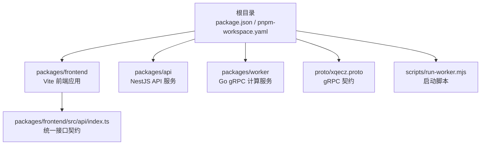
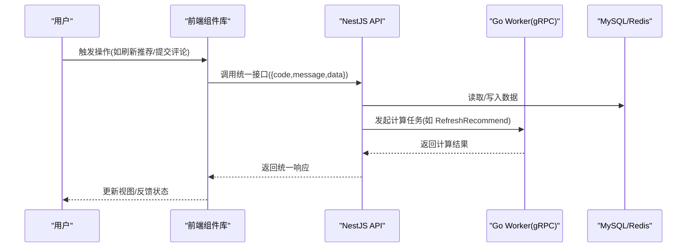
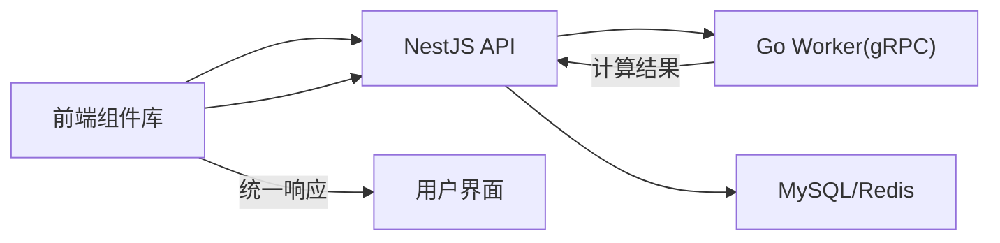

# 核心组件库

<cite>
**本文引用的文件**   
- [package.json](file://package.json)
- [pnpm-workspace.yaml](file://pnpm-workspace.yaml)
- [plan.md](file://plan.md)
- [AGENTS.md](file://AGENTS.md)
- [packages/frontend/src/api/index.ts](file://packages/frontend/src/api/index.ts)
- [proto/xqecz.proto](file://proto/xqecz.proto)
- [scripts/run-worker.mjs](file://scripts/run-worker.mjs)
</cite>

## 目录
1. [简介](#简介)
2. [项目结构](#项目结构)
3. [核心组件](#核心组件)
4. [架构总览](#架构总览)
5. [详细组件分析](#详细组件分析)
6. [依赖分析](#依赖分析)
7. [性能考虑](#性能考虑)
8. [故障排查指南](#故障排查指南)
9. [结论](#结论)
10. [附录](#附录)

## 简介
本文件为 xqecz 平台“核心组件库”的权威文档，面向前端与全栈开发者，系统化阐述组件的分类、组织与设计原则，覆盖内容展示（图片、视频、图文卡片）、用户交互（评论框、投票按钮、收藏按钮）与管理界面组件的实现要点。文档同时给出 props 接口设计范式、事件处理机制、插槽使用方式、样式系统与主题定制、响应式实现策略，以及组件复用模式、组合模式与性能优化技巧，并提供使用示例与扩展指南。

项目定位：小泉动漫二创站，用户上传/浏览二次创作内容（图片、视频、图文、链接），包含评论、投票、管理后台等能力。运行方式：pnpm dev 启动 NestJS API(:3000)、Go Worker(:50051)、Vite 前端(:5173)。

## 项目结构
当前仓库采用 monorepo 组织，核心前端位于 packages/frontend，API 契约定义在 proto/xqecz.proto，前后端唯一接口契约由 packages/frontend/src/api/index.ts 维护。根级 package.json 与 pnpm-workspace.yaml 定义了工作区与脚本入口；scripts/run-worker.mjs 负责注入 .env 并启动 worker。

图表来源 
- [package.json](file://package.json)
- [pnpm-workspace.yaml](file://pnpm-workspace.yaml)
- [packages/frontend/src/api/index.ts](file://packages/frontend/src/api/index.ts)
- [proto/xqecz.proto](file://proto/xqecz.proto)
- [scripts/run-worker.mjs](file://scripts/run-worker.mjs)

章节来源
- [package.json](file://package.json)
- [pnpm-workspace.yaml](file://pnpm-workspace.yaml)
- [plan.md](file://plan.md)
- [AGENTS.md](file://AGENTS.md)

## 核心组件
本节从分类与组织角度概述组件库的设计原则，便于读者建立整体认知。

- 通用组件
  - 目标：跨页面、跨业务复用的基础 UI 元素（如按钮、输入框、图标、弹窗、加载态）。
  - 设计原则：无状态或弱状态、纯函数优先、props 最小化且类型严格、事件语义清晰、可组合性强。
  - 样式与主题：基于 CSS 变量或主题 token，支持明暗主题切换与品牌色定制。
  - 响应式：通过断点与弹性布局适配多端尺寸。

- 业务组件
  - 目标：承载具体业务能力的组件（如图片卡片、视频播放器、图文卡片、评论框、投票按钮、收藏按钮）。
  - 设计原则：封装领域逻辑（如点赞计数、收藏状态、评论分页）、对外暴露稳定接口、内部状态与副作用隔离。
  - 数据契约：遵循统一 API 响应格式 { code, message, data }，错误降级与重试策略内聚。

- 布局组件
  - 目标：页面骨架与导航容器（头部、侧边栏、主内容区、页脚、栅格系统）。
  - 设计原则：高内聚低耦合、插槽扩展、响应式栅格、可嵌套组合。

章节来源
- [packages/frontend/src/api/index.ts](file://packages/frontend/src/api/index.ts)

## 架构总览
组件库与前后端协作的关键在于统一的接口契约与稳定的数据流。前端组件通过 api/index.ts 调用 NestJS API，必要时触发 Go Worker 的 gRPC 计算任务（如推荐刷新）。

图表来源 
- [packages/frontend/src/api/index.ts](file://packages/frontend/src/api/index.ts)
- [proto/xqecz.proto](file://proto/xqecz.proto)

章节来源
- [packages/frontend/src/api/index.ts](file://packages/frontend/src/api/index.ts)
- [proto/xqecz.proto](file://proto/xqecz.proto)

## 详细组件分析

### 内容展示组件
- 图片组件
  - Props：src、alt、loading、lazy、placeholder、errorFallback、aspectRatio、onClick、onError、onLoad。
  - 事件：load、error、click、visibilityChange（懒加载）。
  - 插槽：placeholder、errorFallback、overlay（叠加层）。
  - 样式：响应式宽高、占位图、加载骨架屏、主题色边框。
  - 性能：懒加载、预加载、缓存策略、WebP/AVIF 自适应。

- 视频组件
  - Props：src、poster、autoplay、muted、loop、controls、preload、fallback、onPlay、onPause、onError。
  - 事件：play、pause、ended、error、timeupdate。
  - 插槽：poster、fallback、controlsOverlay。
  - 样式：全屏、比例锁定、主题控制条。
  - 性能：分段加载、预缓冲、截图帧缓存、移动端自动静音。

- 图文卡片组件
  - Props：title、description、image、video、tags、author、createdAt、likeCount、commentCount、actions、onClick、onLike、onComment、onShare。
  - 事件：点击、点赞、评论跳转、分享。
  - 插槽：header、media、footer、actions、extra。
  - 样式：卡片阴影、圆角、悬停动效、响应式网格。
  - 性能：虚拟列表、图片懒加载、骨架屏、防抖点击。

章节来源
- [packages/frontend/src/api/index.ts](file://packages/frontend/src/api/index.ts)

### 用户交互组件
- 评论框组件
  - Props：placeholder、maxLength、submitLabel、autoFocus、initialValue、onSubmit、onCancel、onPreview、onUpload。
  - 事件：submit、cancel、preview、upload、focus、blur。
  - 插槽：toolbar、footer、attachmentList、mentionList。
  - 样式：富文本工具栏、表情面板、附件预览、主题配色。
  - 性能：防抖提交、增量渲染、本地草稿缓存。

- 投票按钮组件
  - Props：optionId、label、count、selected、disabled、onChange、onVote。
  - 事件：change、vote、select。
  - 插槽：icon、suffix、tooltip。
  - 样式：选中态、禁用态、动画过渡、无障碍标签。
  - 性能：乐观更新、去重请求、失败回滚。

- 收藏按钮组件
  - Props：targetId、isCollected、label、onToggle、onSuccess、onError。
  - 事件：toggle、success、error。
  - 插槽：icon、badge、tooltip。
  - 样式：收藏态、数量徽标、动效反馈。
  - 性能：本地缓存、批量同步、离线可用。

章节来源
- [packages/frontend/src/api/index.ts](file://packages/frontend/src/api/index.ts)

### 管理界面组件
- 数据表格组件
  - Props：columns、data、pagination、sortable、filterable、rowKey、selection、actions、onRowClick、onSort、onFilter、onPageChange。
  - 事件：rowClick、sort、filter、pageChange、selectionChange。
  - 插槽：headerCell、bodyCell、footer、toolbar、emptyState。
  - 样式：斑马纹、悬浮行、主题表头、导出按钮。
  - 性能：虚拟滚动、服务端分页、列宽缓存。

- 表单构建器组件
  - Props：schema、formData、rules、layout、submitLabel、resetLabel、onSubmit、onReset、onFieldChange。
  - 事件：submit、reset、fieldChange、validation。
  - 插槽：fieldSlot、actionSlot、helpSlot。
  - 样式：字段分组、校验提示、主题控件。
  - 性能：按需渲染、延迟校验、缓存 schema。

- 权限与菜单组件
  - Props：menuItems、role、permissions、onSelect、onExpand。
  - 事件：select、expand、collapse。
  - 插槽：logo、userMenu、breadcrumb。
  - 样式：侧边栏折叠、面包屑、主题高亮。
  - 性能：路由懒加载、菜单缓存。

章节来源
- [packages/frontend/src/api/index.ts](file://packages/frontend/src/api/index.ts)

### 组件接口与事件规范
- Props 设计
  - 命名：camelCase，语义明确，避免缩写。
  - 类型：严格 TypeScript 类型，提供默认值与校验。
  - 可选性：区分必填与选填，提供 fallback。
  - 组合：支持布尔开关、枚举值、回调函数。

- 事件机制
  - 命名：onXxx 形式，动词短语描述行为。
  - 参数：最小必要参数，携带上下文标识。
  - 生命周期：before/after 钩子用于扩展。

- 插槽使用
  - 默认插槽：内容主体。
  - 具名插槽：header/footer/actions/extra 等区域。
  - 作用域插槽：传递内部状态供外部定制。

章节来源
- [packages/frontend/src/api/index.ts](file://packages/frontend/src/api/index.ts)

### 样式系统、主题定制与响应式设计
- 样式系统
  - 基于 CSS 变量与主题 token，集中管理颜色、间距、字体、阴影。
  - 组件级样式与作用域隔离，避免全局污染。
  - 支持 SCSS/CSS Modules/Vite 插件链。

- 主题定制
  - 明暗主题切换、品牌色替换、字体族配置。
  - 运行时主题注入与持久化存储。
  - 组件主题覆盖与扩展点。

- 响应式设计
  - 断点体系：xs/sm/md/lg/xl。
  - 弹性布局与栅格系统，移动端优先。
  - 媒体查询与容器查询结合。

章节来源
- [packages/frontend/src/api/index.ts](file://packages/frontend/src/api/index.ts)

### 组件复用模式与组合模式
- 复用模式
  - 高阶组件：包装通用逻辑（权限、日志、埋点）。
  - 渲染函数：动态生成复杂 UI。
  - 组合式函数：逻辑复用与状态共享。

- 组合模式
  - 父子组合：通过 props 与插槽传递数据与行为。
  - 兄弟组合：通过事件总线或状态管理协调。
  - 树形组合：递归渲染与路径追踪。

章节来源
- [packages/frontend/src/api/index.ts](file://packages/frontend/src/api/index.ts)

### 性能优化技巧
- 渲染优化
  - 虚拟列表、分页加载、懒加载。
  - 组件拆分与代码分割。
  - 防抖与节流。

- 网络优化
  - 请求合并、缓存策略、重试机制。
  - 错误降级与离线兼容。

- 资源优化
  - 图片压缩与格式转换。
  - 字体子集化与异步加载。
  - 静态资源 CDN 与版本化。

章节来源
- [packages/frontend/src/api/index.ts](file://packages/frontend/src/api/index.ts)

### 使用示例与自定义扩展指南
- 使用示例
  - 图片组件：传入 src、alt、loading=lazy，监听 onLoad 与 onError。
  - 评论框：设置 placeholder、maxLength=500，监听 onSubmit 提交。
  - 投票按钮：绑定 optionId 与 onChange，实现实时计数。
  - 收藏按钮：根据 isCollected 切换状态，调用 onToggle。

- 自定义扩展
  - 插槽扩展：在 header/footer/actions 插槽中插入自定义内容。
  - 主题覆盖：通过 CSS 变量覆盖组件样式。
  - 事件增强：在 onXxx 回调中添加埋点或日志。
  - 组合扩展：与其他组件组合形成新业务能力。

章节来源
- [packages/frontend/src/api/index.ts](file://packages/frontend/src/api/index.ts)

## 依赖分析
组件库依赖关系清晰，前端通过 api/index.ts 与后端交互，gRPC 契约由 proto/xqecz.proto 定义，worker 通过 scripts/run-worker.mjs 启动并注入环境变量。

图表来源 
- [packages/frontend/src/api/index.ts](file://packages/frontend/src/api/index.ts)
- [proto/xqecz.proto](file://proto/xqecz.proto)
- [scripts/run-worker.mjs](file://scripts/run-worker.mjs)

章节来源
- [packages/frontend/src/api/index.ts](file://packages/frontend/src/api/index.ts)
- [proto/xqecz.proto](file://proto/xqecz.proto)
- [scripts/run-worker.mjs](file://scripts/run-worker.mjs)

## 性能考虑
- 前端渲染：虚拟列表、懒加载、组件拆分、代码分割。
- 网络请求：缓存、重试、降级、错误边界。
- 资源加载：图片压缩、字体子集化、CDN 加速。
- 内存管理：事件解绑、定时器清理、大对象释放。
- 监控指标：首屏时间、交互延迟、错误率、资源体积。

[本节为通用指导，不直接分析具体文件]

## 故障排查指南
- 常见问题
  - 图片加载失败：检查 src 有效性、CORS、懒加载触发条件。
  - 视频播放异常：检查格式兼容性、 autoplay 策略、移动端静音要求。
  - 评论提交失败：检查网络状态、表单校验、后端响应码。
  - 投票/收藏状态不同步：检查本地缓存、请求去重、失败回滚。

- 调试技巧
  - 浏览器开发者工具：网络面板、控制台日志、性能分析。
  - 组件调试：打印 props、事件参数、插槽内容。
  - 错误边界：捕获渲染错误、记录堆栈、友好提示。

- 降级策略
  - 外部依赖缺失：Tinify/S3/FFmpeg/Worker 缺失时降级到本地或默认行为。
  - gRPC 错误：不返回 rpc error，返回 success=false + error 文本。
  - 网络超时：重试机制、缓存回退、离线模式。

章节来源
- [packages/frontend/src/api/index.ts](file://packages/frontend/src/api/index.ts)

## 结论
xqecz 核心组件库以清晰的分类与组织、严格的接口契约、灵活的插槽机制、完善的样式与主题系统、高效的性能优化策略，为平台提供了稳定、可扩展的前端基础能力。通过复用模式与组合模式，组件能够灵活适应不同业务场景，同时保持代码质量与可维护性。建议在实际使用中遵循本文档的设计原则与最佳实践，确保组件的一致性与高性能。

[本节为总结性内容，不直接分析具体文件]

## 附录
- 运行方式：pnpm dev 启动开发环境，pnpm start 生产模式一键构建+运行。
- 环境变量：UPLOAD_DIR 约定上传目录，.env 单一配置源。
- gRPC 契约：proto/xqecz.proto 定义接口，NestJS 客户端 keepCase:true、snake_case 字段。
- 删除策略：软删除 deleted_at + TypeORM @DeleteDateColumn 自动过滤。
- 推荐链路：api ContentService.refreshRecommend() → gRPC RefreshRecommend → Redis ZSet recommend:hot。

章节来源
- [plan.md](file://plan.md)
- [AGENTS.md](file://AGENTS.md)
- [proto/xqecz.proto](file://proto/xqecz.proto)
- [scripts/run-worker.mjs](file://scripts/run-worker.mjs)