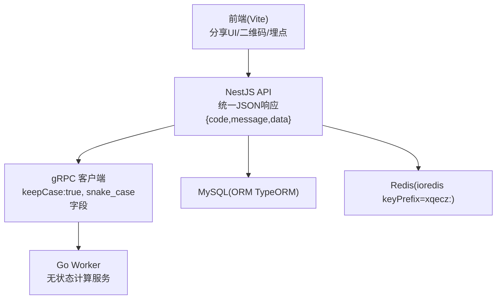
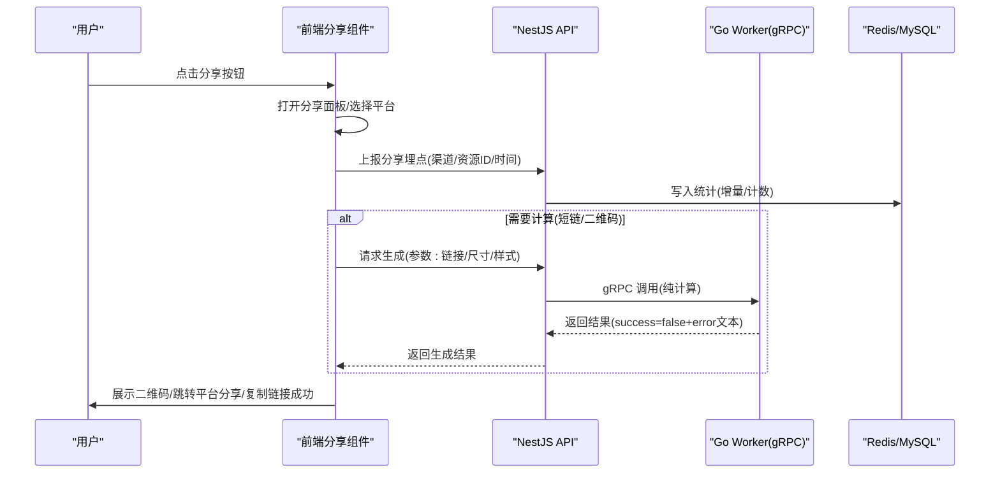
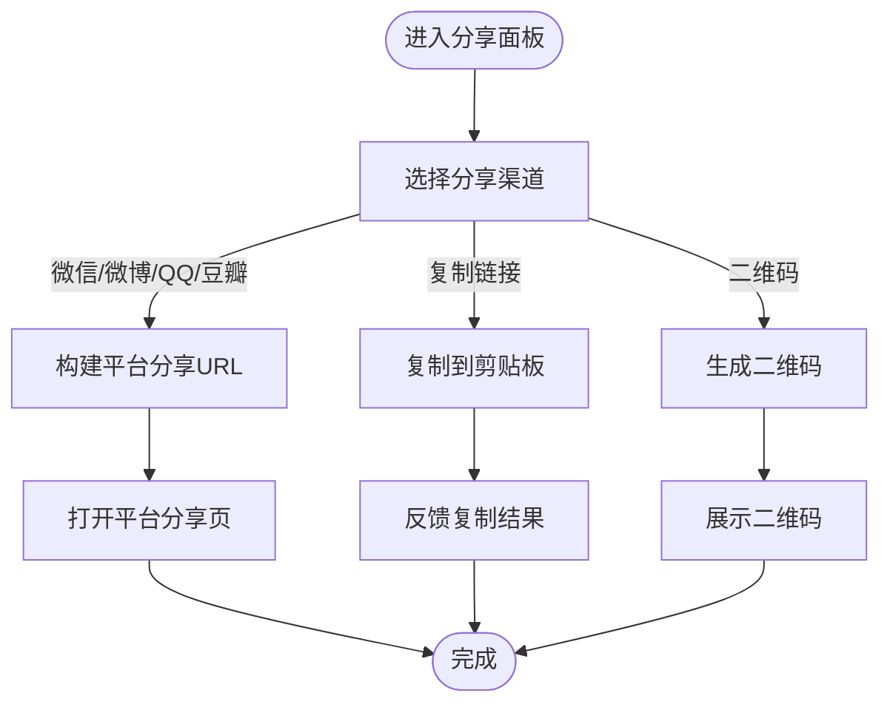
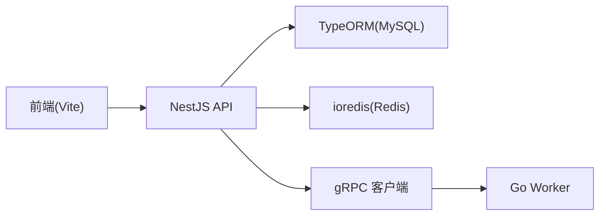

# 分享组件

<cite>
**本文引用的文件**   
- [packages/frontend/src/api/index.ts](file://packages/frontend/src/api/index.ts)
- [proto/xqecz.proto](file://proto/xqecz.proto)
- [scripts/run-worker.mjs](file://scripts/run-worker.mjs)
- [package.json](file://package.json)
- [pnpm-workspace.yaml](file://pnpm-workspace.yaml)
</cite>

## 目录
1. [简介](#简介)
2. [项目结构](#项目结构)
3. [核心组件](#核心组件)
4. [架构总览](#架构总览)
5. [详细组件分析](#详细组件分析)
6. [依赖分析](#依赖分析)
7. [性能考虑](#性能考虑)
8. [故障排查指南](#故障排查指南)
9. [结论](#结论)
10. [附录](#附录)

## 简介
本文件为 xqecz 平台的“分享组件”提供完整文档，覆盖分享按钮组件的实现思路、多平台分享支持、二维码生成、分享链接生成、社交平台集成与分享统计、数据收集与隐私保护、用户体验优化、配置项、API 接口与第三方服务集成，以及使用示例与自定义开发指南。

xqecz 是「小泉动漫二创站」，用户可上传/浏览二次创作内容（图片、视频、图文、链接），并包含评论、投票与管理后台。当前运行方式为 pnpm 脚本本地直启：NestJS API(:3000)、Go Worker(:50051)、Vite 前端(:5173)。前后端唯一接口契约位于 packages/frontend/src/api/index.ts；gRPC 契约定义在 proto/xqecz.proto；worker 通过 scripts/run-worker.mjs 启动时自动读取同一 .env 注入，文件路径经 gRPC 以绝对路径传递。所有删除均为软删除；外部依赖缺失一律降级；gRPC 不返 rpc error，只返回 success=false + error 文本。

## 项目结构
- 前端（Vite）：负责分享 UI、二维码生成、多平台分享入口、分享事件埋点上报。
- API（NestJS）：对外暴露统一 JSON 接口 { code, message, data }，管理分享元数据、统计写入 Redis 或 MySQL。
- Worker（Go）：无状态计算服务，接收 gRPC 请求进行纯计算（如二维码生成、短链生成等），结果回传 NestJS 落库/写缓存。
- Proto：gRPC 契约定义，字段采用 snake_case，客户端 keepCase:true。

图表来源 
- [packages/frontend/src/api/index.ts](file://packages/frontend/src/api/index.ts)
- [proto/xqecz.proto](file://proto/xqecz.proto)
- [scripts/run-worker.mjs](file://scripts/run-worker.mjs)

章节来源
- [package.json](file://package.json)
- [pnpm-workspace.yaml](file://pnpm-workspace.yaml)

## 核心组件
- 分享按钮组件（前端）
  - 功能：触发分享面板、选择平台、生成分享链接、调用平台分享 API、生成二维码、上报分享埋点。
  - 行为：默认复制链接到剪贴板；支持微信/微博/QQ/豆瓣等平台分享；移动端优先唤起系统分享或平台 App。
- 二维码生成器（前端）
  - 功能：将分享链接编码为二维码，支持尺寸、颜色、容错级别配置。
  - 降级：若浏览器不支持 Canvas/WebGL，回退到轻量方案或提示。
- 分享统计（前端埋点 + 后端聚合）
  - 埋点：记录分享渠道、目标资源 ID、时间戳、设备信息（脱敏）。
  - 聚合：NestJS 写入 Redis ZSet 或 MySQL，供排行榜/热度计算使用。
- 分享配置（前端 + 后端）
  - 前端：平台开关、文案、图标、是否显示二维码、默认复制文案。
  - 后端：平台 OAuth/AppKey、回调域名、限流策略、审计开关。

章节来源
- [packages/frontend/src/api/index.ts](file://packages/frontend/src/api/index.ts)

## 架构总览
分享链路分为两条主线：
- 展示与交互线：前端渲染分享按钮 → 用户选择平台 → 生成分享链接/二维码 → 调用平台分享或复制链接。
- 统计与计算线：前端上报埋点 → NestJS 校验与聚合 → 可选 gRPC 调用 Worker 进行计算（如短链/二维码）→ 结果落库/写缓存。

图表来源 
- [packages/frontend/src/api/index.ts](file://packages/frontend/src/api/index.ts)
- [proto/xqecz.proto](file://proto/xqecz.proto)
- [scripts/run-worker.mjs](file://scripts/run-worker.mjs)

## 详细组件分析

### 分享按钮组件（前端）
- 能力
  - 多平台分享：微信、微博、QQ、豆瓣等，按平台规则拼接分享 URL。
  - 复制链接：优先调用 Clipboard API，失败则回退到临时 textarea 方案。
  - 二维码：基于分享链接生成二维码，支持尺寸、颜色、容错等级。
  - 埋点上报：记录分享渠道、资源 ID、时间戳、设备指纹（脱敏）。
- 交互流程
  - 点击按钮 → 弹出面板 → 选择平台 → 执行对应动作（跳转/复制链接/生成二维码）。
  - 移动端：尝试调用系统 Web Share API，不可用则回退到平台链接或二维码。
- 错误处理
  - 剪贴板权限不足：提示用户手动复制。
  - 平台分享失败：保留原页面，提示重试或复制链接。
  - 二维码生成失败：降级为文本链接。

章节来源
- [packages/frontend/src/api/index.ts](file://packages/frontend/src/api/index.ts)

### 二维码生成功能（前端）
- 输入参数
  - 链接字符串、尺寸、前景色/背景色、容错级别、边距。
- 输出
  - Canvas/SVG 二维码图像，或下载 PNG。
- 降级策略
  - 不支持 Canvas：回退到轻量库或提示。
  - 超大链接：建议先短链化再转码。

章节来源
- [packages/frontend/src/api/index.ts](file://packages/frontend/src/api/index.ts)

### 分享链接生成与社交平台集成
- 链接生成
  - 基础链接：平台域名 + 资源路径 + 查询参数（标题、摘要、封面图）。
  - 平台适配：不同平台对参数名/大小写/编码有差异，需按平台规则转换。
- 社交平台集成
  - 微信：分享卡片参数、回调域名、签名校验（后端提供）。
  - 微博：OpenAPI 分享、OAuth 授权（可选）、回调地址。
  - QQ：分享参数、AppID、回调域名。
  - 豆瓣：分享链接格式与限制。
- 安全与合规
  - 白名单域名校验、防重放、签名校验、敏感词过滤。

章节来源
- [packages/frontend/src/api/index.ts](file://packages/frontend/src/api/index.ts)

### 分享统计与埋点
- 埋点字段
  - 资源 ID、分享渠道、时间戳、设备信息（脱敏）、IP（可选）。
- 存储策略
  - 实时计数写入 Redis（ZSet 用于热度排序），定时任务聚合至 MySQL。
  - 读取降级：当 Redis 不可用时，回退到 view_count 排序。
- 隐私保护
  - 去标识化、最小化采集、可配置审计开关。

章节来源
- [packages/frontend/src/api/index.ts](file://packages/frontend/src/api/index.ts)

### gRPC 计算服务（Worker）
- 职责
  - 无状态计算：二维码生成、短链生成、内容签名等。
  - 不连接数据库、无 cron，仅做纯计算。
- 通信
  - NestJS 客户端 keepCase:true，字段 snake_case。
  - 失败返回 success=false + error 文本，不抛 rpc error。
- 启动与环境
  - 通过 scripts/run-worker.mjs 启动，自动读取 .env 注入环境变量。

章节来源
- [proto/xqecz.proto](file://proto/xqecz.proto)
- [scripts/run-worker.mjs](file://scripts/run-worker.mjs)

### 配置选项
- 前端配置
  - 平台开关、文案、图标、是否显示二维码、默认复制文案、二维码样式。
- 后端配置
  - 平台 AppKey/Secret、回调域名、限流策略、审计开关、统计开关。
- 环境变量
  - UPLOAD_DIR 共享上传目录；其他平台相关密钥由 .env 注入。

章节来源
- [scripts/run-worker.mjs](file://scripts/run-worker.mjs)

### API 接口规范
- 统一响应格式
  - { code, message, data }，code 表示状态码，message 描述信息，data 业务数据。
- 分享相关接口（概念性说明）
  - 上报埋点：POST /share/track，入参：resource_id、channel、timestamp、device_info。
  - 生成短链：POST /share/shorten，入参：url、expire、platform。
  - 生成二维码：POST /share/qrcode，入参：url、size、style。
  - 获取分享统计：GET /share/stats，入参：resource_id、channel、time_range。
- 注意
  - 具体路径与字段以 packages/frontend/src/api/index.ts 为准。

章节来源
- [packages/frontend/src/api/index.ts](file://packages/frontend/src/api/index.ts)

### 使用示例
- 基本用法
  - 引入分享组件，传入资源 ID、标题、封面图、平台列表。
  - 点击分享按钮，选择平台后自动跳转或复制链接。
- 自定义平台
  - 扩展平台映射表，实现平台 URL 构建逻辑与参数转换。
- 埋点接入
  - 在分享成功后调用埋点上报接口，记录渠道与资源 ID。

章节来源
- [packages/frontend/src/api/index.ts](file://packages/frontend/src/api/index.ts)

### 自定义开发指南
- 新增平台
  - 在前端添加平台映射与 URL 构建函数；在后端配置平台参数与回调域名。
  - 如需签名/鉴权，调用后端接口获取签名后再拼接分享链接。
- 扩展统计
  - 在埋点上报中增加新字段；后端聚合逻辑同步更新。
- 二维码定制
  - 调整尺寸、颜色、容错级别；必要时对接后端生成服务提升性能。

章节来源
- [packages/frontend/src/api/index.ts](file://packages/frontend/src/api/index.ts)

## 依赖分析
- 前端依赖
  - Vite、Canvas/WebGL（二维码）、Clipboard API、Web Share API（可选）。
- 后端依赖
  - NestJS、TypeORM（MySQL）、ioredis（Redis，keyPrefix=xqecz:）。
- gRPC 依赖
  - proto/xqecz.proto 定义；NestJS 客户端 keepCase:true；Worker 无状态。

图表来源 
- [packages/frontend/src/api/index.ts](file://packages/frontend/src/api/index.ts)
- [proto/xqecz.proto](file://proto/xqecz.proto)
- [scripts/run-worker.mjs](file://scripts/run-worker.mjs)

章节来源
- [packages/frontend/src/api/index.ts](file://packages/frontend/src/api/index.ts)
- [proto/xqecz.proto](file://proto/xqecz.proto)
- [scripts/run-worker.mjs](file://scripts/run-worker.mjs)

## 性能考虑
- 前端
  - 懒加载二维码库，按需初始化；大链接先短链化再转码。
  - 剪贴板操作批量处理，减少重复 I/O。
- 后端
  - 统计写入 Redis 为主，MySQL 异步聚合；热点数据走缓存。
  - gRPC 计算服务无锁、无状态，水平扩展友好。
- 网络
  - 平台分享链接预校验，失败快速回退；CDN 加速静态资源。

[本节为通用指导，无需引用具体文件]

## 故障排查指南
- 常见问题
  - 剪贴板权限不足：提示用户手动复制，检查浏览器安全策略。
  - 平台分享失败：检查回调域名、AppKey、签名；确认链接格式符合平台要求。
  - 二维码生成失败：检查输入长度、Canvas 支持、内存占用。
  - 统计未生效：检查 Redis 连通性、埋点上报是否成功、聚合任务是否正常。
- 调试建议
  - 前端：控制台打印分享参数与上报 payload。
  - 后端：查看日志中的 success=false + error 文本；检查 gRPC 调用链路。
  - Worker：确认环境变量注入、端口 :50051 可达。

章节来源
- [scripts/run-worker.mjs](file://scripts/run-worker.mjs)
- [packages/frontend/src/api/index.ts](file://packages/frontend/src/api/index.ts)

## 结论
分享组件围绕“展示与交互”和“统计与计算”两条主线设计，前端负责 UI 与交互，后端负责统一接口与聚合，Worker 提供无状态计算能力。通过合理的降级策略与隐私保护，确保在不同环境与平台下稳定可用。建议持续优化平台适配、统计维度与性能表现。

[本节为总结，无需引用具体文件]

## 附录
- 运行方式
  - 本地开发：pnpm dev（NestJS :3000、Go Worker :50051、Vite :5173）。
  - 生产模式：pnpm start（一键构建+运行）。
- 环境变量
  - UPLOAD_DIR：共享上传目录；其他平台密钥由 .env 注入。
- 参考文件
  - 前后端接口契约：packages/frontend/src/api/index.ts
  - gRPC 契约：proto/xqecz.proto
  - Worker 启动：scripts/run-worker.mjs

章节来源
- [package.json](file://package.json)
- [pnpm-workspace.yaml](file://pnpm-workspace.yaml)
- [packages/frontend/src/api/index.ts](file://packages/frontend/src/api/index.ts)
- [proto/xqecz.proto](file://proto/xqecz.proto)
- [scripts/run-worker.mjs](file://scripts/run-worker.mjs)