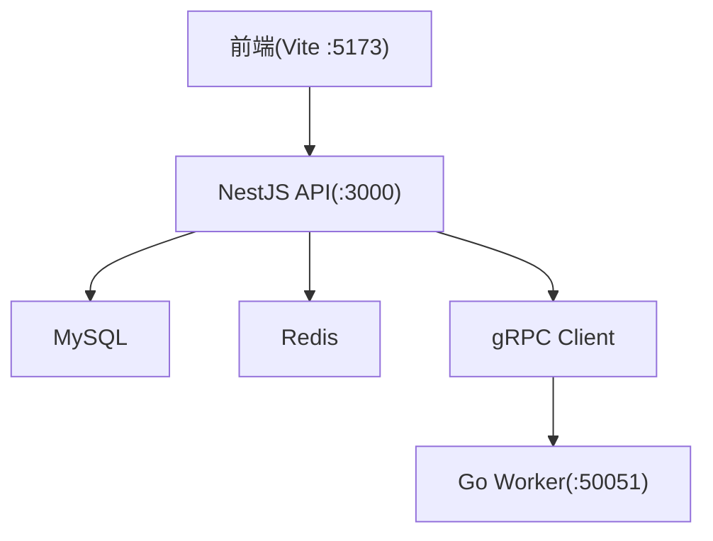
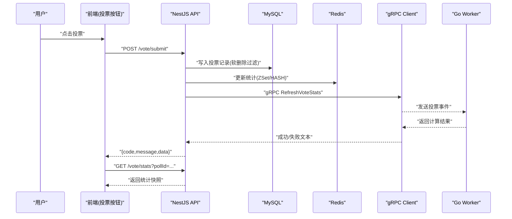
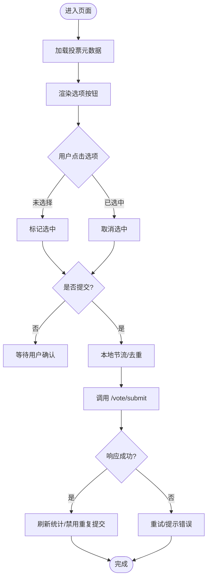
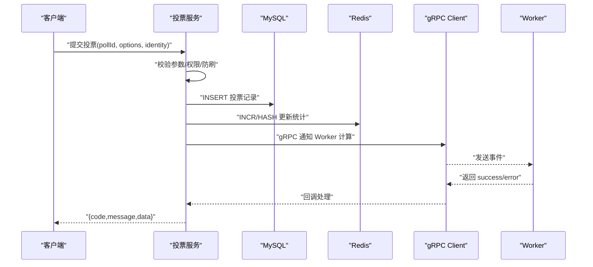
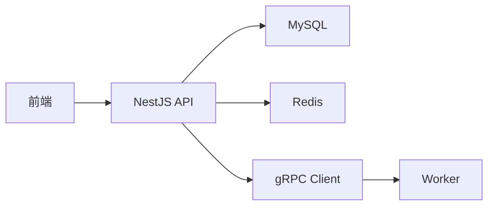

# 投票组件

<cite>
**本文引用的文件**   
- [xqecz.proto](file://proto/xqecz.proto)
- [index.ts](file://packages/frontend/src/api/index.ts)
- [plan.md](file://plan.md)
- [AGENTS.md](file://AGENTS.md)
</cite>

## 目录
1. [简介](#简介)
2. [项目结构](#项目结构)
3. [核心组件](#核心组件)
4. [架构总览](#架构总览)
5. [详细组件分析](#详细组件分析)
6. [依赖分析](#依赖分析)
7. [性能考虑](#性能考虑)
8. [故障排查指南](#故障排查指南)
9. [结论](#结论)
10. [附录](#附录)

## 简介
本文件为 xqecz 平台的“投票组件”提供完整文档，覆盖投票按钮组件的实现要点（多选项支持、实时统计显示、防刷机制）、投票的创建/参与/结果展示流程、状态管理、数据同步与错误处理、配置项、API 接口与用户体验优化，并给出使用示例与自定义开发指南。

项目定位：小泉动漫二创站（xqecz），用户上传/浏览二次创作内容（图片、视频、图文、链接），含评论、投票、管理后台。  
运行方式：pnpm dev 启动 NestJS API(:3000)、Go Worker(:50051)、Vite 前端(:5173)。  
架构铁律：NestJS 独占 MySQL/Redis；Go worker 是无状态 gRPC 计算服务，不连数据库、无 cron，数据经 gRPC 从 NestJS 传入、结果回传 NestJS 落库/写缓存。  
前后端契约：packages/frontend/src/api/index.ts 是前后端唯一接口契约，API 响应统一为 { code, message, data } 包装格式。  
gRPC 契约：proto/xqecz.proto，NestJS 客户端 keepCase:true、字段 snake_case；proto/gen 与 packages/worker/proto 为生成产物。

## 项目结构
当前仓库采用 monorepo 组织，关键目录：
- proto：gRPC 协议定义
- packages/api：NestJS 后端（MySQL/Redis）
- packages/frontend：Vite 前端
- packages/worker：Go 无状态 gRPC 计算服务
- scripts：Worker 启动脚本

图表来源
- [xqecz.proto](file://proto/xqecz.proto)
- [index.ts](file://packages/frontend/src/api/index.ts)

章节来源
- [plan.md](file://plan.md)
- [AGENTS.md](file://AGENTS.md)

## 核心组件
- 投票按钮组件（前端）：承载用户交互（选择/提交）、实时统计展示、防刷提示与重试。
- 投票服务（后端 API）：校验请求、持久化投票记录、聚合统计、写入缓存。
- 统计计算（Worker）：纯计算逻辑，接收投票事件，输出统计增量或排序权重。
- gRPC 契约：定义投票相关消息与服务方法。

章节来源
- [xqecz.proto](file://proto/xqecz.proto)
- [index.ts](file://packages/frontend/src/api/index.ts)

## 架构总览
投票端到端链路（创建/参与/结果）：
- 创建：管理员通过管理端调用 API 创建投票，写入 MySQL，预热 Redis 缓存。
- 参与：前端点击投票按钮，调用 API 进行校验与落库，触发 gRPC 计算，更新 Redis 统计。
- 结果：前端轮询或订阅获取最新统计，渲染百分比与排名。

图表来源
- [xqecz.proto](file://proto/xqecz.proto)
- [index.ts](file://packages/frontend/src/api/index.ts)

## 详细组件分析

### 投票按钮组件（前端）
职责
- 多选项支持：渲染单选/多选按钮组，禁用已选或重复提交。
- 实时统计：轮询或 WebSocket 拉取最新统计，按总数计算百分比。
- 防刷机制：本地节流、去重、服务端校验（同一用户/会话/IP 限制）。
- 错误处理：网络异常降级、重试策略、友好提示。

交互流程

实现要点
- 状态管理：本地保存 selectedOptions、submitted、loading、error。
- 防刷：前端节流 + 后端幂等键（如 userId+pollId+optionHash）。
- 统计展示：根据 totalVotes 与 optionCounts 计算百分比，四舍五入保证总和≈100%。
- 可访问性：键盘导航、ARIA 标签、焦点管理。

章节来源
- [index.ts](file://packages/frontend/src/api/index.ts)

### 投票服务（NestJS API）
职责
- 校验：参数校验、权限校验、防刷规则（频率限制、重复提交）。
- 持久化：写入投票记录（软删除），确保审计与可恢复。
- 统计聚合：更新 Redis 中的投票计数与排序集合。
- 对外暴露：统一的 {code,message,data} 响应格式。

关键流程

错误处理
- 参数错误：直接返回 code!=0 与 message。
- 业务冲突（重复投票）：返回明确 message，前端提示“已投票”。
- 外部依赖缺失：降级策略（如 Worker 不可用则仅落库，稍后补偿）。

章节来源
- [index.ts](file://packages/frontend/src/api/index.ts)

### Worker（Go gRPC 计算服务）
职责
- 无状态计算：接收投票事件，执行打分/权重计算，返回结果。
- 不直连数据库：所有读写由 NestJS 负责。
- 失败容忍：返回 success=false + error 文本，NestJS 做降级。

章节来源
- [xqecz.proto](file://proto/xqecz.proto)

### gRPC 契约（proto）
说明
- 定义投票相关消息与服务方法（如提交、刷新统计、查询结果）。
- NestJS 客户端 keepCase:true，字段 snake_case。
- 生成代码位于 proto/gen 与 packages/worker/proto，视为产物。

章节来源
- [xqecz.proto](file://proto/xqecz.proto)

## 依赖分析
- 前端依赖：API 契约（index.ts）、UI 组件库、状态管理。
- 后端依赖：MySQL（持久化）、Redis（缓存与统计）、gRPC 客户端（Worker）。
- Worker 依赖：gRPC 服务端、纯内存计算。

图表来源
- [xqecz.proto](file://proto/xqecz.proto)
- [index.ts](file://packages/frontend/src/api/index.ts)

章节来源
- [plan.md](file://plan.md)
- [AGENTS.md](file://AGENTS.md)

## 性能考虑
- 统计读取优先走 Redis，避免频繁读 MySQL。
- 投票写入批量合并（必要时）降低热点写压力。
- 前端轮询间隔自适应（低负载时延长，高负载时缩短）。
- Worker 计算尽量无锁、无 IO，减少延迟。
- 对大流量场景启用限流与熔断（API 层）。

[本节为通用指导，无需引用具体文件]

## 故障排查指南
常见问题
- 重复投票：检查幂等键与防刷规则，确认前端节流与后端校验一致。
- 统计不同步：核对 Redis 更新与 Worker 回调，必要时触发补偿任务。
- 前端显示异常：检查 API 响应码与数据结构，确认百分比计算逻辑。
- Worker 不可用：NestJS 应降级为仅落库，后续补偿；查看日志中 success=false 的错误文本。

排查步骤
- 查看 API 日志与错误码，定位问题阶段（校验/落库/缓存/gRPC）。
- 检查 Redis 键空间与值一致性（如 ZSet/HASH）。
- 验证 gRPC 连接与超时设置。
- 复现最小用例，逐步隔离前端/后端/Worker。

章节来源
- [index.ts](file://packages/frontend/src/api/index.ts)
- [xqecz.proto](file://proto/xqecz.proto)

## 结论
投票组件以“前端交互 + NestJS 服务 + Worker 计算”的分层架构实现，兼顾实时性与可扩展性。通过严格的防刷与幂等设计、统一的 API 契约与降级策略，保障稳定性与用户体验。建议在生产环境完善监控告警与补偿机制，持续优化统计精度与延迟。

[本节为总结，无需引用具体文件]

## 附录

### 投票配置选项（建议）
- 投票类型：单选/多选
- 匿名/实名：控制身份标识来源
- 防刷策略：同用户/同会话/同 IP 限制
- 统计粒度：实时/分钟级/小时级
- 缓存策略：TTL、预热、失效策略
- 权限控制：公开/登录可见/管理员可见

[本节为通用配置建议，无需引用具体文件]

### API 接口约定
- 统一响应格式：{ code, message, data }
- 主要接口（示例命名）：
  - POST /vote/submit：提交投票
  - GET /vote/stats：查询统计
  - POST /vote/create：创建投票（管理端）
- 字段命名：遵循 snake_case（gRPC 契约）

章节来源
- [index.ts](file://packages/frontend/src/api/index.ts)

### 使用示例（前端）
- 初始化：加载投票元数据，渲染选项按钮。
- 交互：选择选项 -> 提交 -> 刷新统计。
- 错误处理：网络异常重试、提示用户。

章节来源
- [index.ts](file://packages/frontend/src/api/index.ts)

### 自定义开发指南
- 新增选项类型：扩展前端渲染与后端校验。
- 新增统计维度：在 Worker 中增加计算逻辑，API 层聚合。
- 接入第三方认证：调整身份标识来源与防刷策略。
- 国际化：文案与错误信息多语言化。

[本节为通用开发指导，无需引用具体文件]