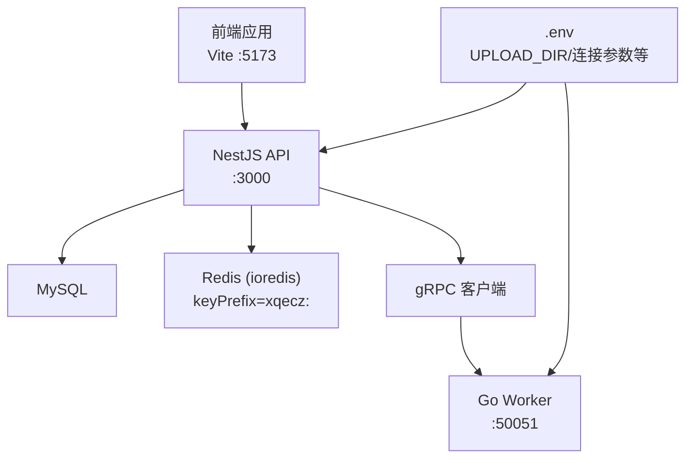
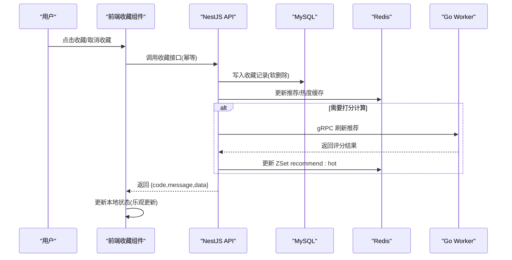
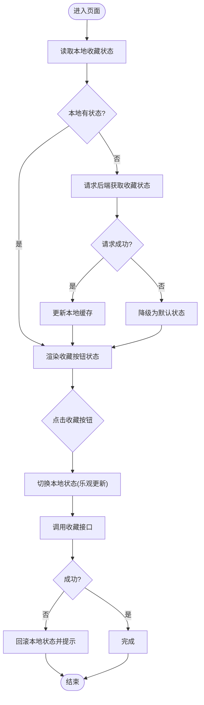
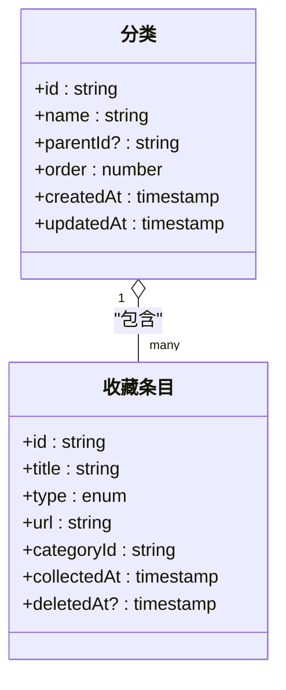
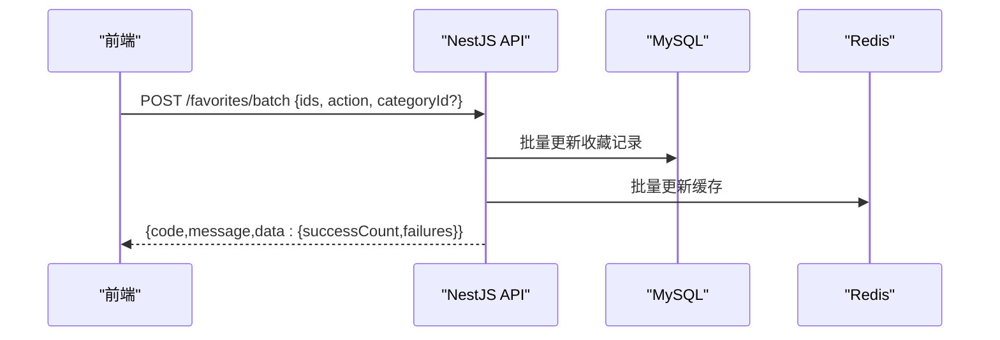
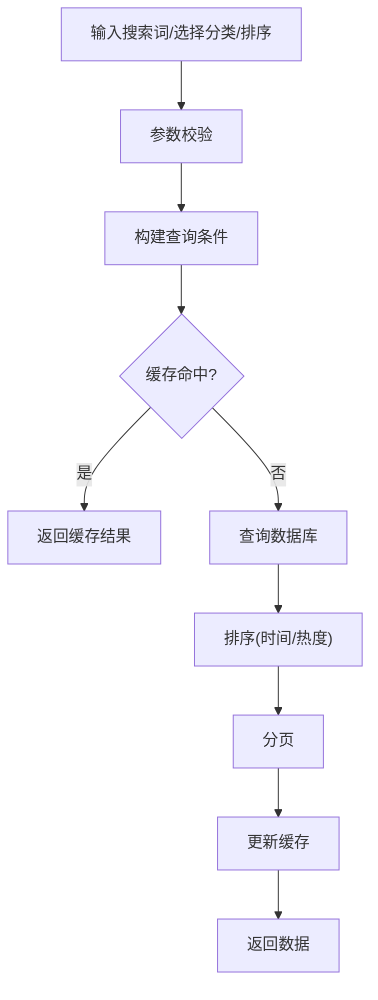
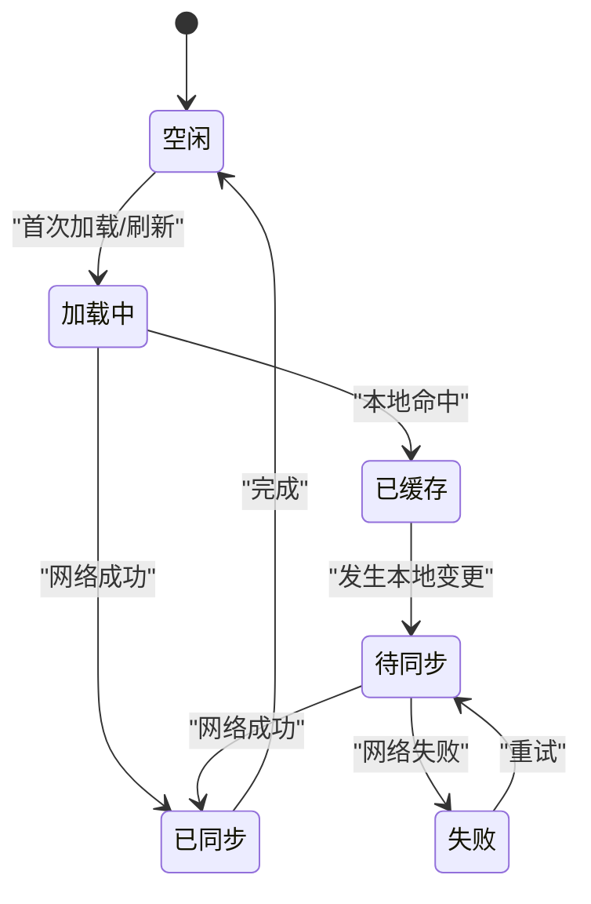
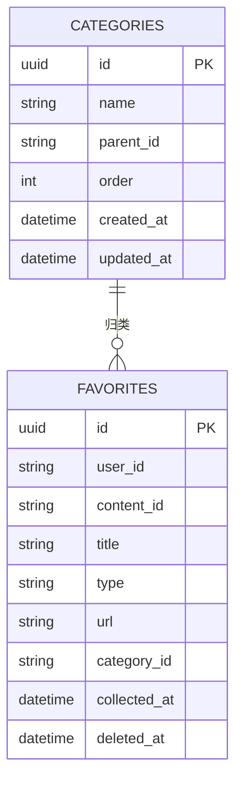
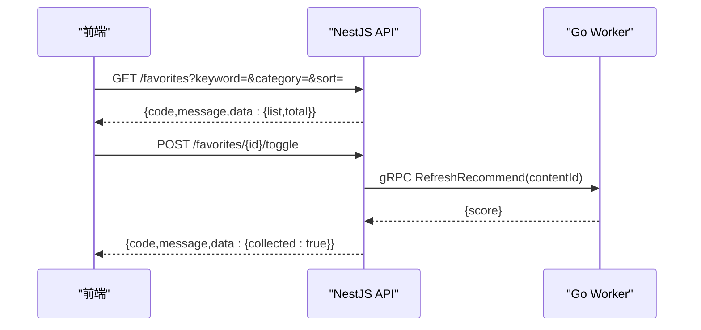
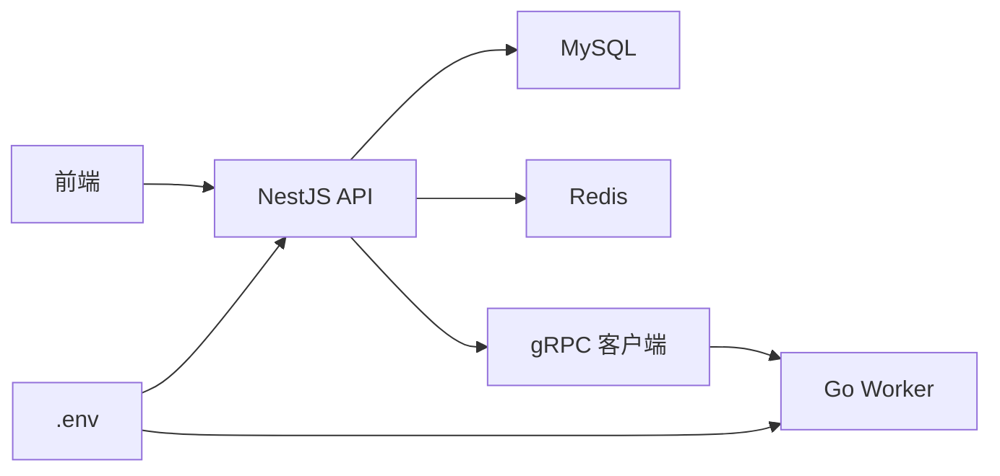

# 收藏组件

<cite>
**本文引用的文件**   
- [packages/api/.env](file://packages/api/.env)
- [packages/frontend/src/api/index.ts](file://packages/frontend/src/api/index.ts)
- [proto/xqecz.proto](file://proto/xqecz.proto)
- [scripts/run-worker.mjs](file://scripts/run-worker.mjs)
- [plan.md](file://plan.md)
</cite>

## 目录
1. [简介](#简介)
2. [项目结构](#项目结构)
3. [核心组件](#核心组件)
4. [架构总览](#架构总览)
5. [详细组件分析](#详细组件分析)
6. [依赖分析](#依赖分析)
7. [性能考虑](#性能考虑)
8. [故障排查指南](#故障排查指南)
9. [结论](#结论)
10. [附录](#附录)

## 简介
本文件为 xqecz 平台的“收藏组件”提供完整文档，覆盖收藏按钮组件的实现要点、收藏状态切换、分类管理、批量操作、本地存储与云端同步机制、收藏列表管理与搜索过滤排序、数据模型、API 接口与状态管理，并给出使用示例与自定义开发指南。xqecz 定位为二次创作内容平台（图片、视频、图文、链接），支持评论、投票与管理后台；运行方式以 pnpm dev/start 为主，NestJS API(:3000)、Go Worker(:50051)、Vite 前端(:5173)协同工作。

## 项目结构
围绕收藏功能，代码主要分布在以下位置：
- 前端契约与调用入口：packages/frontend/src/api/index.ts
- gRPC 契约定义：proto/xqecz.proto
- 环境变量与共享配置：packages/api/.env
- Worker 启动脚本（读取 .env）：scripts/run-worker.mjs
- 项目规划与说明：plan.md

**图表来源**
- [packages/frontend/src/api/index.ts](file://packages/frontend/src/api/index.ts)
- [proto/xqecz.proto](file://proto/xqecz.proto)
- [packages/api/.env](file://packages/api/.env)
- [scripts/run-worker.mjs](file://scripts/run-worker.mjs)

**章节来源**
- [packages/frontend/src/api/index.ts](file://packages/frontend/src/api/index.ts)
- [proto/xqecz.proto](file://proto/xqecz.proto)
- [packages/api/.env](file://packages/api/.env)
- [scripts/run-worker.mjs](file://scripts/run-worker.mjs)
- [plan.md](file://plan.md)

## 核心组件
- 收藏按钮组件：负责用户点击后的收藏/取消收藏交互，展示当前收藏状态，触发本地状态更新与后端同步。
- 收藏分类管理：支持创建、编辑、删除分类，将收藏条目归入对应分类。
- 批量操作：支持对多个收藏条目进行批量加入/移出分类、批量删除等操作。
- 收藏列表管理：分页加载、搜索过滤、排序（如按时间、热度）。
- 本地存储与云端同步：优先本地缓存（IndexedDB/LocalStorage），网络请求失败时回退到本地；成功时写 Redis 缓存与 MySQL 持久化。
- 状态管理：前端基于响应式状态管理收藏项的选中态、分类筛选、搜索词、排序键等。

**章节来源**
- [packages/frontend/src/api/index.ts](file://packages/frontend/src/api/index.ts)
- [proto/xqecz.proto](file://proto/xqecz.proto)
- [packages/api/.env](file://packages/api/.env)

## 架构总览
收藏功能的整体流程如下：
- 前端发起收藏/取消收藏或分类变更请求，统一通过 packages/frontend/src/api/index.ts 中的接口方法调用 NestJS API。
- NestJS API 校验参数后，写入 MySQL（软删除策略），并更新 Redis ZSet 缓存（用于推荐/热度计算）。
- 若涉及复杂计算（如推荐分数），NestJS 通过 gRPC 调用 Go Worker，Worker 返回结果后由 API 落库/写缓存。
- 前端在本地维护收藏状态，确保离线可用与快速响应。

**图表来源**
- [packages/frontend/src/api/index.ts](file://packages/frontend/src/api/index.ts)
- [proto/xqecz.proto](file://proto/xqecz.proto)
- [packages/api/.env](file://packages/api/.env)

## 详细组件分析

### 收藏按钮组件
- 功能要点
  - 显示当前收藏状态（已收藏/未收藏）。
  - 点击后切换状态，触发本地状态更新与后端同步。
  - 支持批量选择（多选）以便后续批量操作。
- 交互流程
  - 首次加载：从本地缓存读取状态，若无则拉取后端数据。
  - 点击切换：立即更新 UI，随后异步调用 API；失败时回滚本地状态。
  - 错误处理：网络异常或后端失败时提示用户并保留本地一致性。

**图表来源**
- [packages/frontend/src/api/index.ts](file://packages/frontend/src/api/index.ts)

**章节来源**
- [packages/frontend/src/api/index.ts](file://packages/frontend/src/api/index.ts)

### 收藏分类管理
- 能力范围
  - 创建/编辑/删除分类。
  - 将收藏条目移动到指定分类。
  - 支持分类层级（可选）与排序。
- 数据流
  - 前端维护分类树与选中分类。
  - 修改分类后调用 API 同步至数据库与缓存。
  - 列表页根据选中分类过滤展示。

**图表来源**
- [proto/xqecz.proto](file://proto/xqecz.proto)

**章节来源**
- [proto/xqecz.proto](file://proto/xqecz.proto)

### 批量操作
- 场景
  - 批量加入收藏/移出分类。
  - 批量删除收藏条目。
- 实现要点
  - 前端维护选中集合，提交时一次性发送 ID 列表。
  - 后端逐条处理并聚合结果，保证幂等与事务性。
  - 失败部分可返回明细，前端局部重试或提示。

**图表来源**
- [packages/frontend/src/api/index.ts](file://packages/frontend/src/api/index.ts)

**章节来源**
- [packages/frontend/src/api/index.ts](file://packages/frontend/src/api/index.ts)

### 收藏列表管理、搜索过滤与排序
- 列表能力
  - 分页加载、无限滚动。
  - 搜索关键词匹配标题/描述/标签。
  - 排序：按收藏时间、更新时间、热度（推荐分）。
- 过滤维度
  - 分类筛选、类型筛选（图片/视频/图文/链接）、时间范围。
- 性能优化
  - 前端缓存查询结果，减少重复请求。
  - 后端使用索引与缓存加速检索。

**图表来源**
- [packages/frontend/src/api/index.ts](file://packages/frontend/src/api/index.ts)

**章节来源**
- [packages/frontend/src/api/index.ts](file://packages/frontend/src/api/index.ts)

### 本地存储与云端同步机制
- 本地存储
  - 使用 IndexedDB/LocalStorage 缓存收藏状态与列表片段。
  - 离线可用，网络恢复后自动同步。
- 云端同步
  - 所有变更最终一致地写入 MySQL 与 Redis。
  - 推荐/热度通过 Redis ZSet 维护，keyPrefix 统一为 xqecz:。
- 降级策略
  - 外部依赖缺失（S3/FFmpeg/Worker）一律降级，不中断主流程。
  - gRPC 失败不抛 rpc error，返回 success=false + error 文本。

**图表来源**
- [packages/api/.env](file://packages/api/.env)

**章节来源**
- [packages/api/.env](file://packages/api/.env)

### 收藏数据模型
- 字段建议
  - id、title、type、url、categoryId、collectedAt、deletedAt。
- 约束与索引
  - user_id + content_id 唯一索引避免重复收藏。
  - category_id、collectedAt、deletedAt 建立索引加速查询。
- 软删除
  - 使用 deleted_at 标记删除，ORM 自动过滤。

**图表来源**
- [proto/xqecz.proto](file://proto/xqecz.proto)

**章节来源**
- [proto/xqecz.proto](file://proto/xqecz.proto)

### API 接口与状态管理
- 接口契约
  - 统一响应格式：{ code, message, data }。
  - 常用接口：收藏/取消收藏、批量操作、分类 CRUD、列表查询。
- 状态管理
  - 前端维护：selectedIds、categoryFilter、searchKeyword、sortKey、page、pageSize。
  - 后端维护：MySQL 持久化、Redis 缓存（ZSet 推荐/热度）。
- gRPC 集成
  - 字段 snake_case，keepCase:true。
  - 推荐刷新链路：API → gRPC RefreshRecommend → Worker 打分 → API 写 Redis。

**图表来源**
- [packages/frontend/src/api/index.ts](file://packages/frontend/src/api/index.ts)
- [proto/xqecz.proto](file://proto/xqecz.proto)

**章节来源**
- [packages/frontend/src/api/index.ts](file://packages/frontend/src/api/index.ts)
- [proto/xqecz.proto](file://proto/xqecz.proto)

## 依赖分析
- 前端依赖
  - 统一 API 入口：packages/frontend/src/api/index.ts。
  - 状态管理库（如 Pinia/Vuex/Redux）用于维护收藏状态与筛选条件。
- 后端依赖
  - NestJS 服务、TypeORM（MySQL）、ioredis（Redis）。
  - gRPC 客户端对接 Go Worker。
- 环境变量
  - UPLOAD_DIR、数据库连接、Redis 连接等统一在 packages/api/.env。
- Worker 启动
  - scripts/run-worker.mjs 读取同一 .env，注入绝对路径供 gRPC 传递。

**图表来源**
- [packages/frontend/src/api/index.ts](file://packages/frontend/src/api/index.ts)
- [packages/api/.env](file://packages/api/.env)
- [scripts/run-worker.mjs](file://scripts/run-worker.mjs)

**章节来源**
- [packages/frontend/src/api/index.ts](file://packages/frontend/src/api/index.ts)
- [packages/api/.env](file://packages/api/.env)
- [scripts/run-worker.mjs](file://scripts/run-worker.mjs)

## 性能考虑
- 前端
  - 乐观更新与本地缓存，减少网络往返。
  - 分页与虚拟列表，降低 DOM 压力。
  - 防抖/节流搜索输入，避免频繁请求。
- 后端
  - 合理使用索引（user_id、content_id、category_id、collected_at）。
  - Redis ZSet 维护推荐/热度，读多写少场景下提升吞吐。
  - 批量接口合并多次单条操作，降低锁竞争。
- 外部依赖
  - 缺失降级（S3/FFmpeg/Worker），保障主流程稳定。

[本节为通用指导，无需特定文件引用]

## 故障排查指南
- 常见问题
  - 收藏状态不同步：检查本地缓存是否被覆盖，确认 API 返回码与消息。
  - 批量操作部分失败：查看 failures 明细，定位具体条目原因。
  - 搜索无结果：确认关键词大小写、分词逻辑与索引是否生效。
- 调试步骤
  - 前端：打开网络面板，核对请求参数与响应格式。
  - 后端：查看日志中 gRPC 调用与数据库执行计划。
  - 环境：确认 .env 变量正确，Worker 端口 :50051 可达。
- 降级与容错
  - gRPC 失败返回 success=false + error 文本，前端需友好提示。
  - 外部依赖缺失时，跳过相关计算或返回空结果。

**章节来源**
- [packages/frontend/src/api/index.ts](file://packages/frontend/src/api/index.ts)
- [packages/api/.env](file://packages/api/.env)
- [scripts/run-worker.mjs](file://scripts/run-worker.mjs)

## 结论
收藏组件通过前端乐观更新与后端强一致存储相结合，实现了流畅的用户体验与可靠的数据一致性。借助 Redis ZSet 与 gRPC Worker，平台能够在高并发下维持推荐与热度的实时性。遵循统一的 API 契约与环境配置，便于扩展与维护。

[本节为总结，无需特定文件引用]

## 附录
- 使用示例
  - 收藏按钮：点击切换，观察本地状态变化与网络请求。
  - 分类管理：新建分类后，将收藏条目移入该分类并验证列表过滤。
  - 批量操作：选择多条收藏，执行批量删除或移动分类。
- 自定义开发指南
  - 新增字段：在 proto 中定义新字段，生成代码后在前端与后端同步添加。
  - 新增排序：前端增加 sortKey，后端实现对应 SQL 排序与缓存键映射。
  - 新增分类属性：扩展分类表与 API，保持软删除与索引规范。
  - 监控与埋点：记录收藏成功率、失败原因、平均耗时，便于持续优化。

[本节为补充信息，无需特定文件引用]