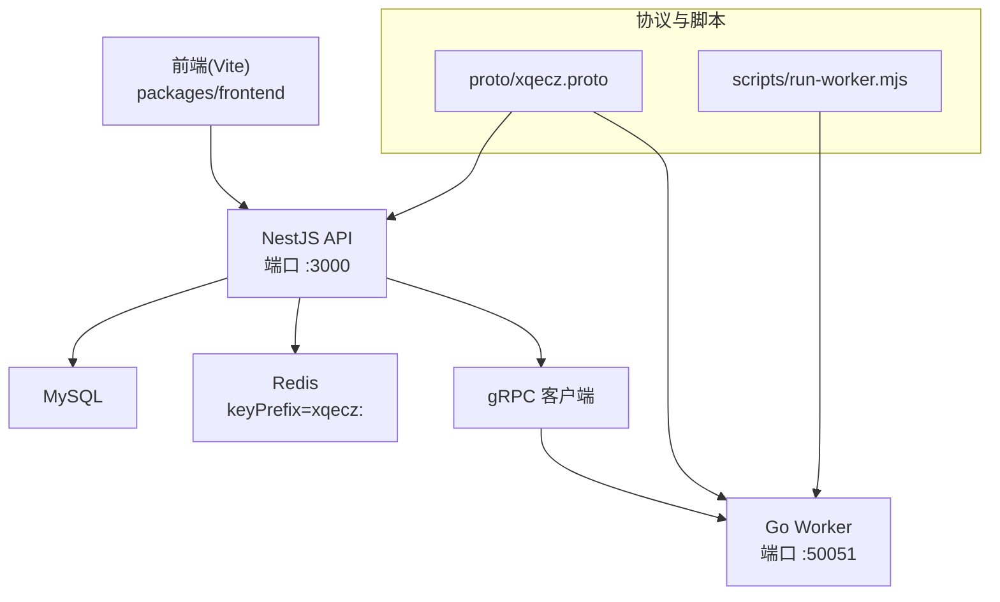
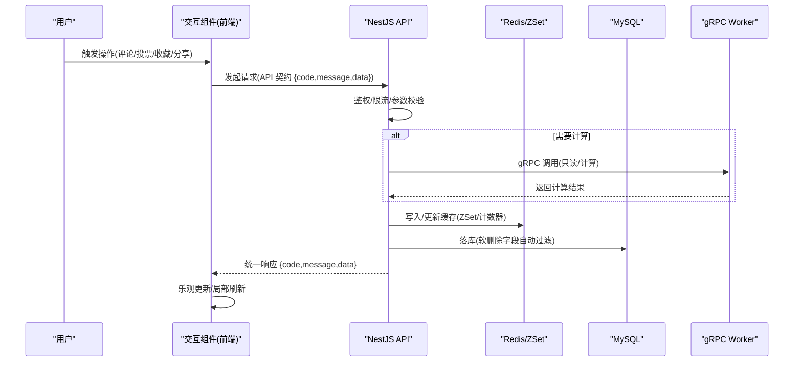
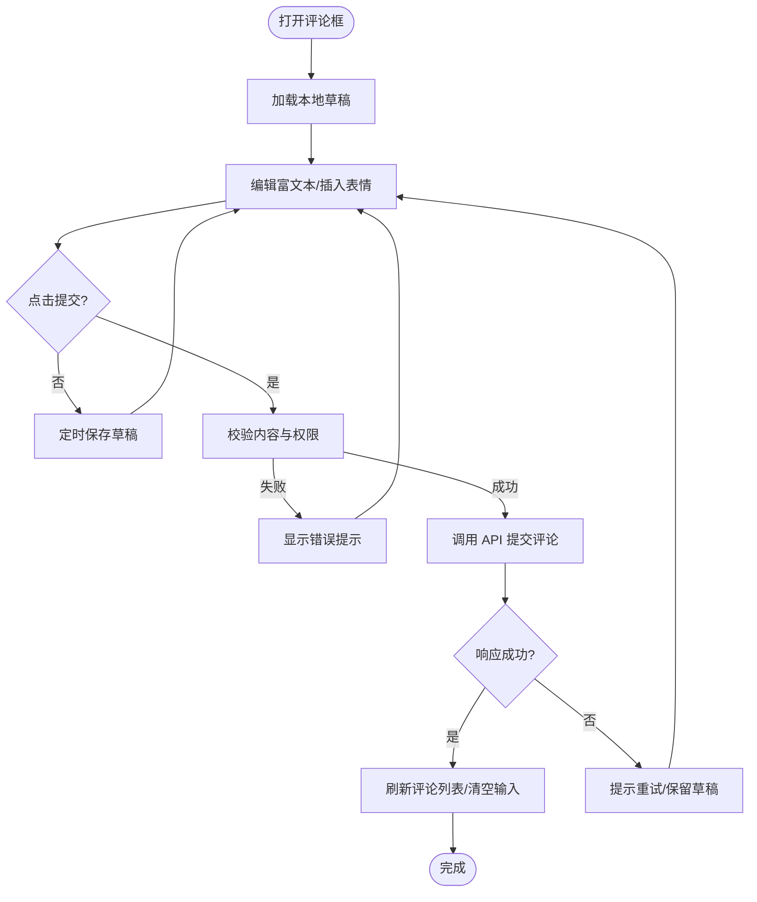
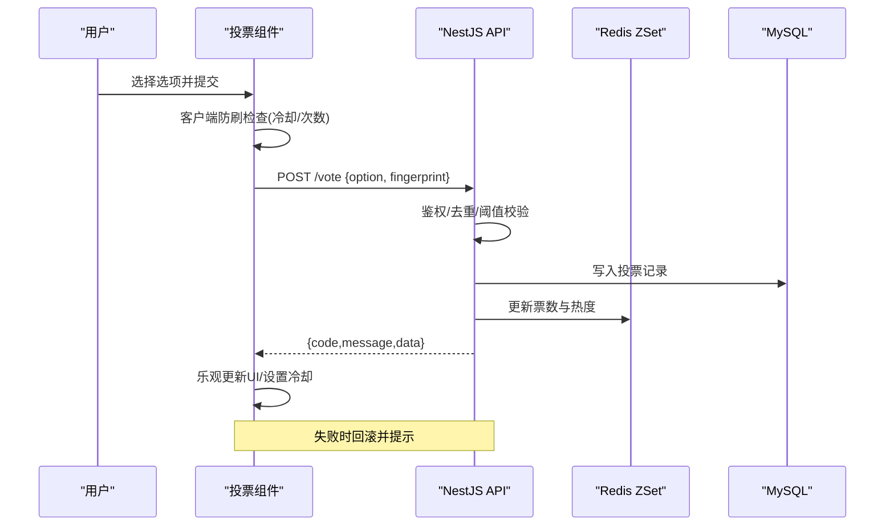
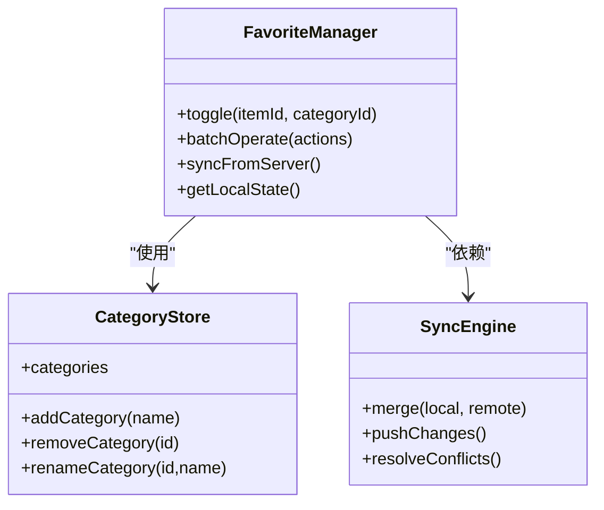
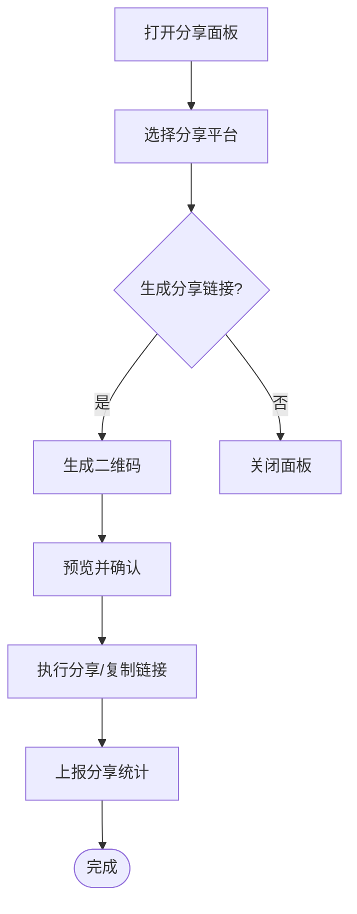
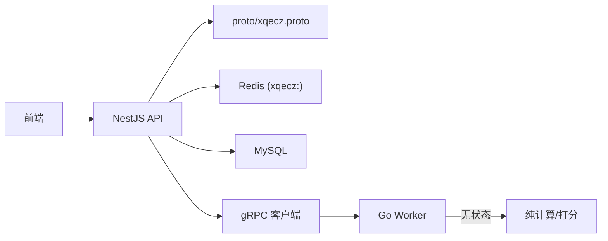

# 用户交互组件

<cite>
**本文引用的文件**   
- [packages/frontend/src/api/index.ts](file://packages/frontend/src/api/index.ts)
- [proto/xqecz.proto](file://proto/xqecz.proto)
- [scripts/run-worker.mjs](file://scripts/run-worker.mjs)
- [package.json](file://package.json)
- [pnpm-workspace.yaml](file://pnpm-workspace.yaml)
</cite>

## 目录
1. [简介](#简介)
2. [项目结构](#项目结构)
3. [核心组件](#核心组件)
4. [架构总览](#架构总览)
5. [详细组件分析](#详细组件分析)
6. [依赖关系分析](#依赖关系分析)
7. [性能考量](#性能考量)
8. [故障排查指南](#故障排查指南)
9. [结论](#结论)
10. [附录](#附录)

## 简介
本文件面向 xqecz 平台的用户交互组件，聚焦以下四个关键能力：评论框（富文本编辑、表情符号、回复嵌套）、投票按钮（多选项、实时统计、防刷机制）、收藏按钮（分类管理、批量操作）与分享组件（多平台分享、二维码生成）。文档从系统架构、数据流、状态管理、权限校验、错误处理、API 契约、事件模型与配置项等维度进行系统化说明，并提供使用示例与自定义开发指南，帮助开发者快速集成与扩展。

## 项目结构
xqecz 采用 monorepo 组织方式，前端、API 与 Worker 通过 pnpm workspace 协同。前后端唯一接口契约由 packages/frontend/src/api/index.ts 定义；gRPC 契约在 proto/xqecz.proto 中声明；Worker 通过 scripts/run-worker.mjs 启动并读取统一环境变量。

图表来源
- [packages/frontend/src/api/index.ts](file://packages/frontend/src/api/index.ts)
- [proto/xqecz.proto](file://proto/xqecz.proto)
- [scripts/run-worker.mjs](file://scripts/run-worker.mjs)

章节来源
- [package.json](file://package.json)
- [pnpm-workspace.yaml](file://pnpm-workspace.yaml)

## 核心组件
本节概述四大组件的职责边界与协作关系，后续章节将逐一展开实现细节。

- 评论框组件：负责富文本渲染、表情插入、回复树构建、草稿本地缓存与提交同步。
- 投票按钮组件：支持单选/多选、实时计数更新、防刷策略（频率限制、设备指纹、服务端校验）。
- 收藏按钮组件：支持分类标签、批量收藏/取消、跨页面状态同步与持久化。
- 分享组件：支持多平台分享链接、二维码生成、分享统计上报。

章节来源
- [packages/frontend/src/api/index.ts](file://packages/frontend/src/api/index.ts)
- [proto/xqecz.proto](file://proto/xqecz.proto)

## 架构总览
用户交互组件遵循“前端 UI + API 服务 + gRPC Worker”的解耦模式。所有写操作经 API 层统一鉴权与校验，必要时调用 gRPC Worker 执行纯计算任务（如评分、统计），结果回写数据库或缓存。读路径优先走缓存，失败降级到数据库。

图表来源
- [packages/frontend/src/api/index.ts](file://packages/frontend/src/api/index.ts)
- [proto/xqecz.proto](file://proto/xqecz.proto)

## 详细组件分析

### 评论框组件（富文本、表情、回复嵌套）
- 功能要点
  - 富文本编辑器：支持基础格式、图片粘贴、链接预览。
  - 表情符号：内置表情面板，支持搜索与最近使用记录。
  - 回复嵌套：支持多级回复树展示与折叠。
  - 草稿缓存：本地存储未提交内容，断网可恢复。
  - 提交同步：成功后刷新评论列表，失败保留草稿并提示。
- 状态管理
  - 本地状态：编辑器内容、光标位置、表情面板显隐、草稿键值。
  - 远端状态：评论列表、点赞数、作者信息、审核状态。
  - 同步策略：先乐观更新 UI，再异步提交；失败时回滚并提示。
- 权限验证
  - 登录态校验、内容长度/敏感词校验、重复提交保护。
- 错误处理
  - 网络异常重试、富文本解析失败降级为纯文本、表情加载失败回退默认集。
- API 与事件
  - 提交评论、获取评论列表、点赞/举报、插入表情、保存草稿。
  - 事件：onSubmit、onDraftSave、onError、onSuccess、onReplyOpen。
- 配置项
  - 编辑器主题、表情源、最大回复层级、草稿过期时间、敏感词策略。

图表来源
- [packages/frontend/src/api/index.ts](file://packages/frontend/src/api/index.ts)

章节来源
- [packages/frontend/src/api/index.ts](file://packages/frontend/src/api/index.ts)

### 投票按钮组件（多选项、实时统计、防刷）
- 功能要点
  - 支持单选/多选投票，实时显示票数与比例。
  - 防刷机制：客户端频率限制、设备指纹、服务端去重与阈值控制。
  - 实时统计：WebSocket 或轮询增量更新，ZSet 排序热点内容。
- 状态管理
  - 本地状态：已选选项、是否已投、倒计时冷却。
  - 远端状态：各选项票数、投票人统计、投票截止时间。
  - 同步策略：提交后乐观更新 UI，失败则回滚并提示。
- 权限验证
  - 登录态校验、IP/设备指纹校验、同一用户重复投票拦截。
- 错误处理
  - 网络超时重试、服务端拒绝（黑名单/风控）友好提示。
- API 与事件
  - 提交投票、查询票数、刷新统计、上报异常。
  - 事件：onVote、onUpdate、onCooldown、onError。
- 配置项
  - 投票类型、冷却时间、防刷阈值、是否匿名、统计刷新间隔。

图表来源
- [packages/frontend/src/api/index.ts](file://packages/frontend/src/api/index.ts)

章节来源
- [packages/frontend/src/api/index.ts](file://packages/frontend/src/api/index.ts)

### 收藏按钮组件（分类管理、批量操作）
- 功能要点
  - 支持按分类收藏、批量收藏/取消、收藏夹排序与搜索。
  - 跨页面状态同步：路由切换保持选中态，离线缓存可用。
- 状态管理
  - 本地状态：收藏集合、分类映射、批量选择集。
  - 远端状态：收藏条目、分类元数据、更新时间戳。
  - 同步策略：批量操作合并请求，失败部分回滚。
- 权限验证
  - 登录态校验、分类权限控制、批量上限限制。
- 错误处理
  - 网络异常重试、分类不存在降级为默认分类、冲突解决提示。
- API 与事件
  - 添加/移除收藏、批量操作、分类 CRUD、同步状态。
  - 事件：onToggle、onBatch、onCategoryChange、onSync。
- 配置项
  - 分类策略、批量大小、缓存策略、是否允许匿名收藏。

图表来源
- [packages/frontend/src/api/index.ts](file://packages/frontend/src/api/index.ts)

章节来源
- [packages/frontend/src/api/index.ts](file://packages/frontend/src/api/index.ts)

### 分享组件（多平台分享、二维码生成）
- 功能要点
  - 支持多平台分享（微信、微博、QQ、Twitter、Facebook 等）。
  - 二维码生成：根据分享链接生成二维码，支持尺寸与样式配置。
  - 分享统计：上报分享渠道与来源，便于数据分析。
- 状态管理
  - 本地状态：分享面板显隐、目标平台选择、二维码缓存。
  - 远端状态：分享统计、热门分享排行。
  - 同步策略：分享动作立即反馈，统计异步上报。
- 权限验证
  - 分享链接有效性校验、平台白名单控制、反爬策略。
- 错误处理
  - 平台不可用降级为复制链接、二维码生成失败回退静态图。
- API 与事件
  - 生成分享链接、上传分享统计、获取平台列表。
  - 事件：onShare、onQrReady、onError。
- 配置项
  - 平台列表、二维码尺寸、分享文案模板、统计上报开关。

图表来源
- [packages/frontend/src/api/index.ts](file://packages/frontend/src/api/index.ts)

章节来源
- [packages/frontend/src/api/index.ts](file://packages/frontend/src/api/index.ts)

## 依赖关系分析
- 前端与 API：通过 packages/frontend/src/api/index.ts 统一调用，响应格式 {code, message, data}。
- API 与 gRPC：依据 proto/xqecz.proto 定义，NestJS 客户端 keepCase:true，字段 snake_case。
- Worker 启动：scripts/run-worker.mjs 读取 .env 注入环境变量，确保 UPLOAD_DIR 等一致。
- 缓存与数据库：NestJS 独占 MySQL/Redis，zset 用于推荐与热度排序，keyPrefix=xqecz:。

图表来源
- [packages/frontend/src/api/index.ts](file://packages/frontend/src/api/index.ts)
- [proto/xqecz.proto](file://proto/xqecz.proto)
- [scripts/run-worker.mjs](file://scripts/run-worker.mjs)

章节来源
- [packages/frontend/src/api/index.ts](file://packages/frontend/src/api/index.ts)
- [proto/xqecz.proto](file://proto/xqecz.proto)
- [scripts/run-worker.mjs](file://scripts/run-worker.mjs)

## 性能考量
- 前端优化
  - 乐观更新与局部刷新减少重绘。
  - 表情与二维码资源懒加载与缓存。
  - 批量操作合并请求降低网络开销。
- 后端优化
  - 热点数据优先读 Redis，失败降级到 MySQL。
  - gRPC Worker 无状态计算，避免阻塞 I/O。
  - 软删除与索引优化提升查询效率。
- 一致性保障
  - 幂等接口设计，防止重复提交。
  - 分布式锁或原子操作保证计数准确。

## 故障排查指南
- 常见问题
  - 评论提交失败：检查登录态、敏感词、网络重试与草稿恢复。
  - 投票被拒：查看防刷阈值、设备指纹与黑名单策略。
  - 收藏不同步：核对分类权限、批量上限与冲突解决逻辑。
  - 分享失败：确认平台白名单、链接有效性与二维码生成器可用性。
- 调试建议
  - 启用前端日志与网络抓包，定位 API 响应码与消息。
  - 检查 Redis 键前缀与 TTL，确认缓存命中情况。
  - 核对 proto 字段命名与 keepCase 配置，避免序列化问题。

章节来源
- [packages/frontend/src/api/index.ts](file://packages/frontend/src/api/index.ts)
- [proto/xqecz.proto](file://proto/xqecz.proto)

## 结论
xqecz 的用户交互组件以清晰的职责划分与统一的 API 契约为基础，结合 gRPC Worker 的无状态计算能力，实现了高可用、高性能与易扩展的交互体验。通过严格的状态管理与错误处理机制，以及完善的权限与防刷策略，确保了用户体验与数据安全。开发者可基于本文档的 API、事件与配置项快速集成与定制。

## 附录
- 运行方式
  - 开发模式：pnpm dev 启动 NestJS API(:3000)、Go Worker(:50051)、Vite 前端(:5173)。
  - 生产模式：pnpm start 一键构建与运行。
- 环境变量
  - UPLOAD_DIR：共享上传目录，统一于 packages/api/.env，Worker 启动时自动注入。
- 推荐链路
  - ContentService.refreshRecommend() 读 MySQL → gRPC RefreshRecommend 由 worker 纯打分 → api 写 Redis ZSet recommend:hot；读取降级为 view_count 排序。

章节来源
- [package.json](file://package.json)
- [scripts/run-worker.mjs](file://scripts/run-worker.mjs)
- [proto/xqecz.proto](file://proto/xqecz.proto)