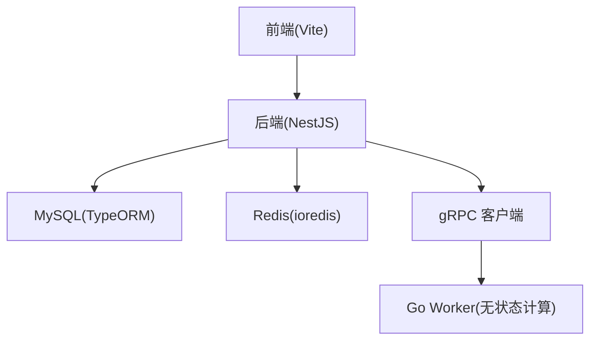
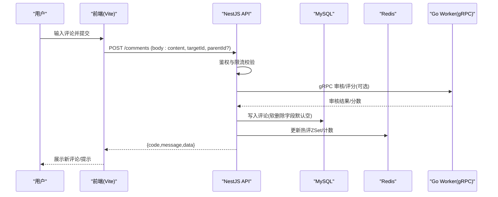
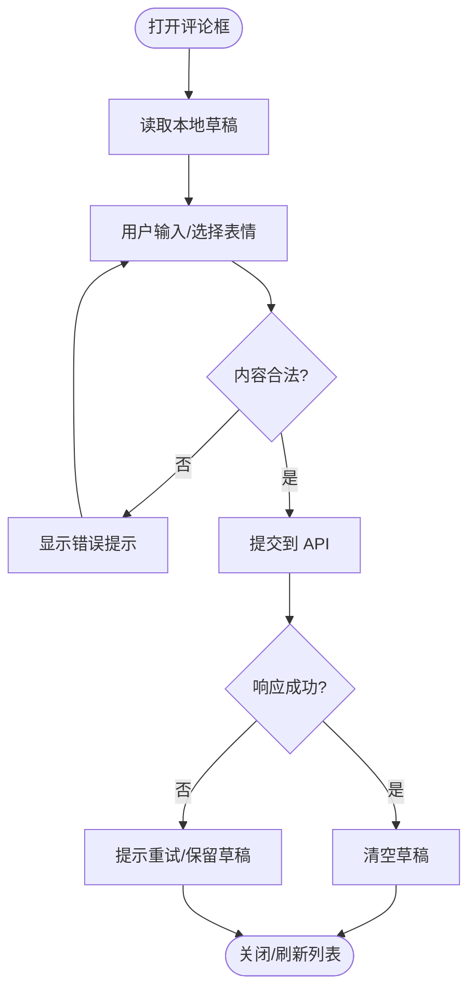
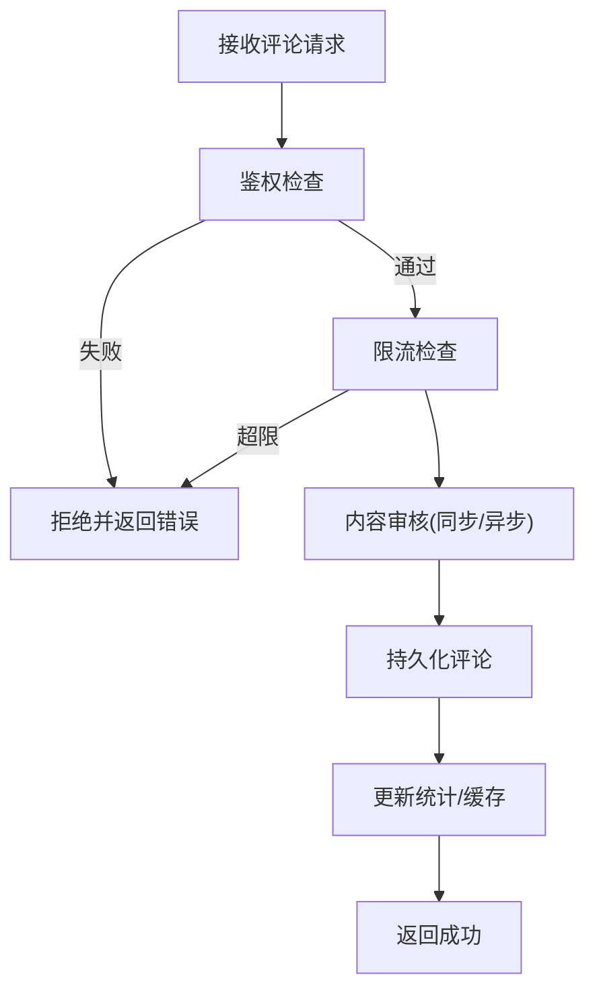
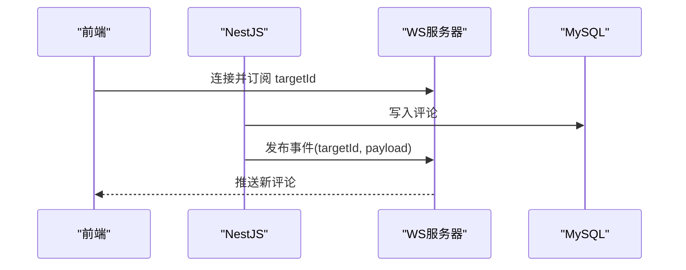
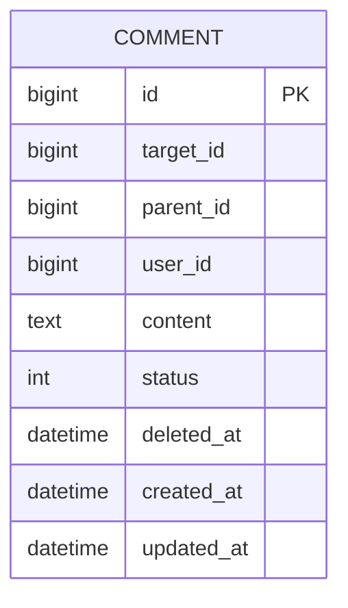
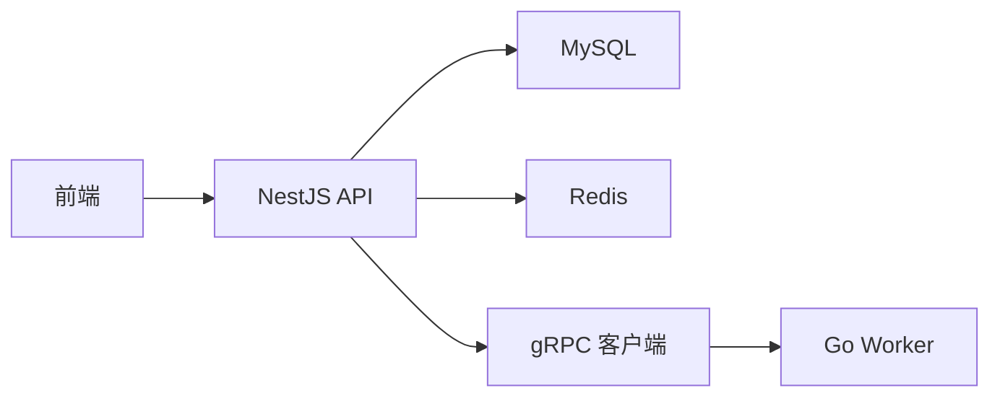

# 评论组件

<cite>
**本文引用的文件**   
- [xqecz.proto](file://proto/xqecz.proto)
- [index.ts](file://packages/frontend/src/api/index.ts)
- [plan.md](file://plan.md)
- [AGENTS.md](file://AGENTS.md)
</cite>

## 目录
1. [简介](#简介)
2. [项目结构](#项目结构)
3. [核心组件](#核心组件)
4. [架构总览](#架构总览)
5. [详细组件分析](#详细组件分析)
6. [依赖关系分析](#依赖关系分析)
7. [性能考虑](#性能考虑)
8. [故障排查指南](#故障排查指南)
9. [结论](#结论)
10. [附录](#附录)

## 简介
本文件为 xqecz 平台的“评论组件”提供完整技术文档，覆盖评论框组件（富文本编辑器、表情符号支持、回复嵌套）、评论的创建/编辑/删除、实时同步机制与错误处理、用户权限验证、内容审核流程与防刷机制。同时给出评论数据模型、API 接口调用与状态管理说明，并提供使用示例与自定义开发指南。

## 项目结构
xqecz 采用 monorepo 组织：NestJS API、Go Worker、Vite 前端与 gRPC 契约定义位于同一仓库。评论功能涉及前后端与 gRPC 契约，但当前仓库未包含评论模块的具体实现代码，因此本文基于约定与通用实践进行设计说明，并标注可落地的集成点。

[本图为概念性结构图，不直接映射具体源码文件]

## 核心组件
- 评论框组件（前端）
  - 富文本编辑器：支持基础排版与图片插入
  - 表情符号：本地表情面板与快捷插入
  - 回复嵌套：支持对评论或子评论的引用回复
- 评论服务（后端）
  - 评论 CRUD：创建、查询、更新、软删除
  - 权限校验：登录态、资源归属、角色控制
  - 内容审核：敏感词过滤、人工复核队列
  - 防刷限流：按用户/IP/资源维度限制提交频率
- 实时同步（可选）
  - WebSocket/Server-Sent Events：新评论、点赞、审核结果推送
- 数据模型
  - 评论主表、子评论关联、作者信息、审核状态、时间戳等

[本节为概念性概述，不直接分析具体文件]

## 架构总览
评论功能的整体交互如下：前端通过 NestJS API 完成评论的增删改查；必要时通过 gRPC 调用 Go Worker 执行纯计算任务（如内容审核打分）。所有写操作均走 NestJS，数据库与缓存由 NestJS 独占管理。

[本图为概念性序列图，不直接映射具体源码文件]

## 详细组件分析

### 评论框组件（前端）
- 富文本编辑器
  - 能力：加粗、斜体、列表、链接、图片上传
  - 约束：最大长度、图片大小限制、白名单标签
- 表情符号
  - 本地表情库，点击插入占位符或 base64 图片
  - 支持搜索与最近使用记录
- 回复嵌套
  - 支持对任意评论或子评论进行引用回复
  - 显示层级缩进与折叠/展开
- 状态管理
  - 本地草稿暂存（localStorage/sessionStorage）
  - 提交中禁用按钮与加载态
  - 失败重试与错误提示

[本图为概念性流程图，不直接映射具体源码文件]

### 评论服务（后端）
- 鉴权与权限
  - 登录态校验、目标资源访问权限、是否本人/管理员
- 内容审核
  - 敏感词检测、AI 打分、人工复核队列
  - 审核通过后才可见或进入待审池
- 防刷限流
  - 按用户、IP、目标资源维度限制单位时间内提交次数
  - 违规封禁冷却期
- 数据一致性
  - 事务保证评论与计数原子更新
  - 软删除策略（deleted_at）

[本图为概念性流程图，不直接映射具体源码文件]

### 实时同步机制（可选）
- 事件源：新评论、点赞变化、审核结果
- 传输通道：WebSocket/SSE
- 订阅范围：按目标资源 ID 订阅
- 降级策略：轮询兜底

[本图为概念性序列图，不直接映射具体源码文件]

### 数据模型（建议）
- 评论表
  - id、target_id、parent_id、user_id、content、status、deleted_at、created_at、updated_at
- 子评论
  - 通过 parent_id 自关联形成树形结构
- 审核相关
  - status：待审、通过、拒绝、隐藏
- 统计
  - 点赞数、踩数、举报数（可独立表或冗余字段）

[本图为概念性 ER 图，不直接映射具体源码文件]

### API 接口（约定）
- 统一响应格式：{ code, message, data }
- 典型接口
  - 创建评论：POST /comments
  - 获取评论列表：GET /comments?targetId=&parentId=&page=&size=
  - 更新评论：PUT /comments/:id
  - 删除评论：DELETE /comments/:id（软删除）
  - 点赞/举报：POST /comments/:id/action
- 鉴权头：Authorization（JWT）
- 限流头：X-RateLimit-*

[本节为概念性接口约定，不直接映射具体源码文件]

### 状态管理（前端）
- 评论列表状态：loading、error、data、hasMore
- 评论表单状态：draft、submitting、submitError
- 实时消息：新增评论入队、审核结果回写
- 本地持久化：草稿自动保存、失败重试队列

[本节为概念性说明，不直接映射具体源码文件]

## 依赖关系分析
- 前端依赖 NestJS API 与可选的实时通道
- NestJS 依赖 MySQL、Redis、gRPC 客户端
- Go Worker 无状态，仅处理计算任务并通过 gRPC 返回结果
- 共享配置与环境变量：UPLOAD_DIR、数据库连接、Redis 连接、gRPC 地址

[本图为概念性依赖图，不直接映射具体源码文件]

## 性能考虑
- 分页与懒加载：首屏只加载根评论，按需展开子评论
- 缓存策略：热门评论 ZSet、评论计数缓存、短 TTL 热点键
- 异步审核：敏感词/AI 审核走异步队列，避免阻塞写入
- 限流与熔断：网关层限流、下游超时与重试退避
- 图片优化：压缩、CDN 加速、懒加载

[本节为通用性能建议，不直接分析具体文件]

## 故障排查指南
- 常见错误
  - 鉴权失败：检查 Token 有效性、过期时间与权限
  - 限流触发：检查频率限制策略与冷却时间
  - 审核拒绝：查看审核日志与原因码
  - 写入失败：检查数据库连接、事务与唯一约束
- 调试要点
  - 前端网络面板：请求/响应、错误码
  - 后端日志：鉴权、限流、审核、写入链路
  - Redis/MySQL：键是否存在、命中率、慢查询
  - gRPC：Worker 健康检查、超时与错误文本

[本节为通用排查建议，不直接分析具体文件]

## 结论
本文从组件、架构、数据模型、API 与状态管理等维度，系统阐述了 xqecz 平台评论组件的设计与实现要点。由于当前仓库未包含评论模块的具体源码，本文以约定与实践为基础，提供了可直接落地的方案与集成指引。后续可在 NestJS 中实现评论服务，在前端集成富文本与表情组件，并通过 gRPC 对接 Worker 完成审核与打分。

## 附录
- 运行方式
  - 开发模式：pnpm dev（启动 NestJS API、Go Worker、Vite 前端）
  - 生产模式：pnpm start（一键构建与运行）
- 关键约定
  - API 统一响应格式：{ code, message, data }
  - gRPC 契约：proto/xqecz.proto，NestJS 客户端 keepCase:true，字段 snake_case
  - 上传目录：UPLOAD_DIR 环境变量，路径经 gRPC 以绝对路径传递
  - 删除策略：软删除（deleted_at），TypeORM @DeleteDateColumn 自动过滤

**章节来源**
- [xqecz.proto](file://proto/xqecz.proto)
- [index.ts](file://packages/frontend/src/api/index.ts)
- [plan.md](file://plan.md)
- [AGENTS.md](file://AGENTS.md)