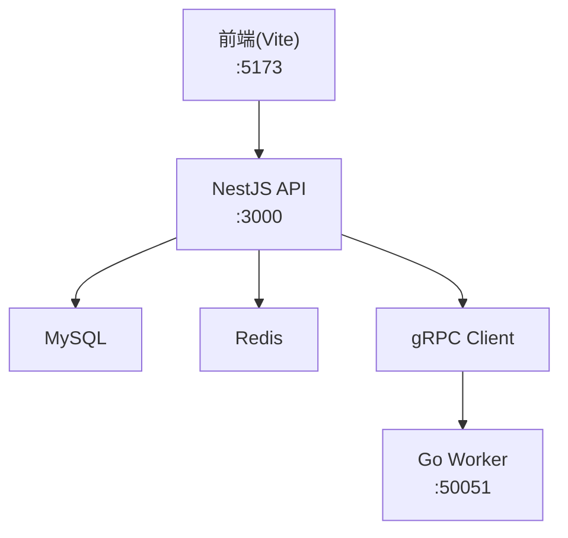
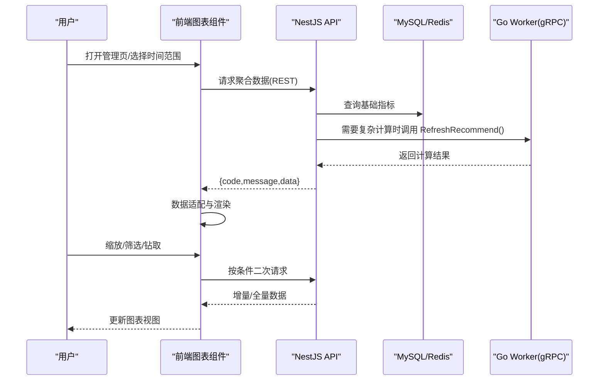
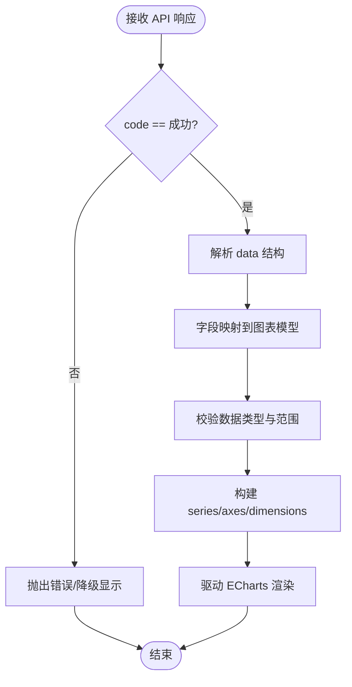
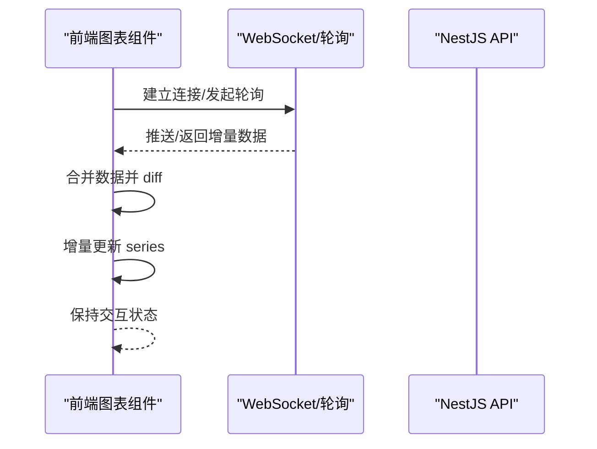
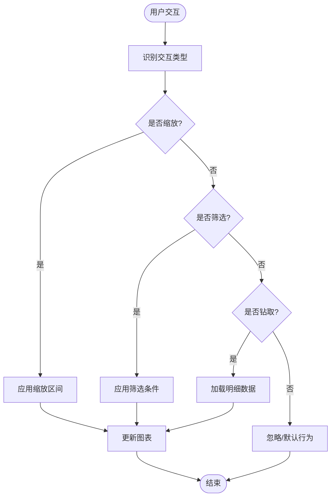
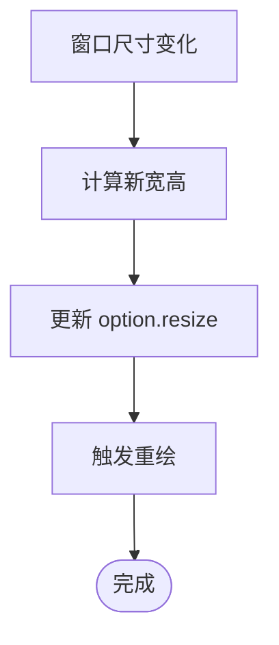
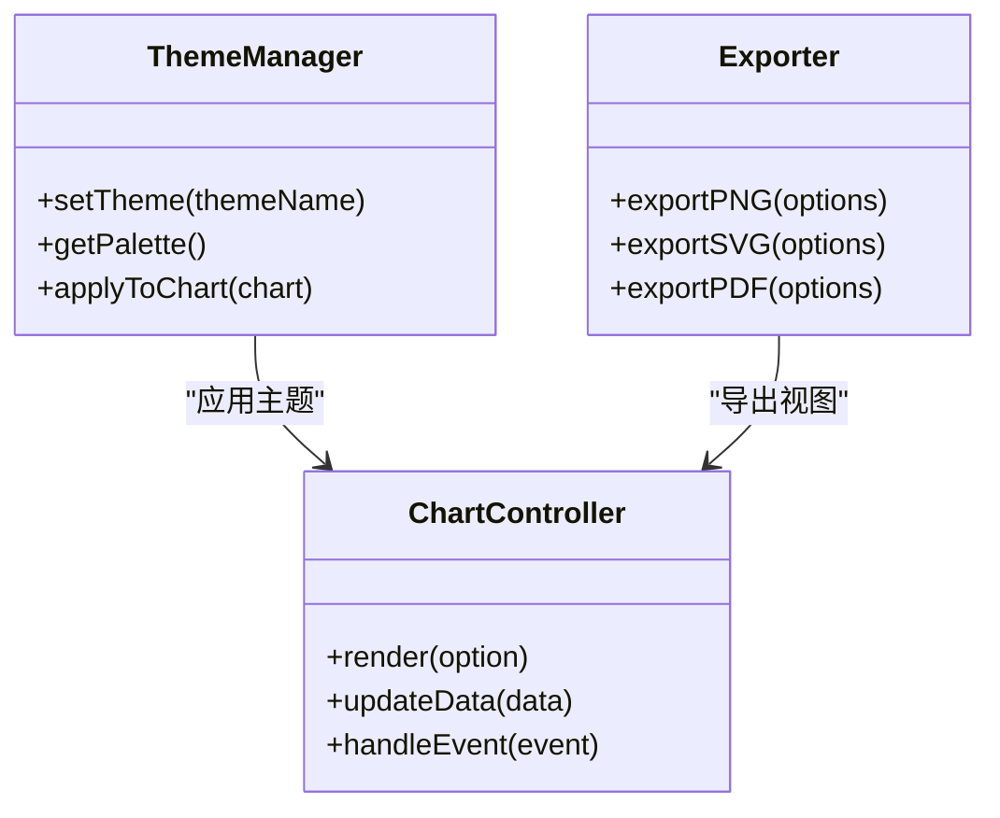
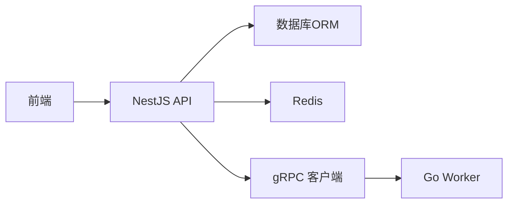

# 图表展示组件

<cite>
**本文引用的文件**   
- [packages/frontend/src/api/index.ts](file://packages/frontend/src/api/index.ts)
- [proto/xqecz.proto](file://proto/xqecz.proto)
- [scripts/run-worker.mjs](file://scripts/run-worker.mjs)
- [package.json](file://package.json)
- [pnpm-workspace.yaml](file://pnpm-workspace.yaml)
</cite>

## 目录
1. [简介](#简介)
2. [项目结构](#项目结构)
3. [核心组件](#核心组件)
4. [架构总览](#架构总览)
5. [详细组件分析](#详细组件分析)
6. [依赖分析](#依赖分析)
7. [性能考虑](#性能考虑)
8. [故障排查指南](#故障排查指南)
9. [结论](#结论)
10. [附录](#附录)

## 简介
本文件面向 xqecz 平台的“图表展示组件”，聚焦统计图表（柱状图、折线图、饼图、雷达图）与数据可视化能力的实现说明。内容涵盖：
- 图表数据绑定与实时更新机制
- 交互能力（缩放、筛选、钻取）
- 响应式适配策略
- 主题配置、颜色方案、动画效果与导出功能
- 管理场景示例（内容统计、用户增长、互动分析）
- 自定义图表类型、数据源接入与性能优化指南

本项目为 monorepo，前端位于 packages/frontend，API 服务由 NestJS 提供，Go Worker 通过 gRPC 提供无状态计算能力。前后端唯一接口契约定义在 packages/frontend/src/api/index.ts，gRPC 契约定义在 proto/xqecz.proto。

## 项目结构
- 前端工程：packages/frontend（Vite 构建，开发端口 :5173）
- API 服务：packages/api（NestJS，默认端口 :3000）
- 计算服务：packages/worker（Go，gRPC 端口 :50051）
- 脚本入口：scripts/run-worker.mjs（启动 worker，读取 .env）
- 工作区配置：pnpm-workspace.yaml、package.json（统一脚本与依赖管理）

**图示来源** 
- [package.json](file://package.json)
- [pnpm-workspace.yaml](file://pnpm-workspace.yaml)
- [scripts/run-worker.mjs](file://scripts/run-worker.mjs)

**章节来源**
- [package.json](file://package.json)
- [pnpm-workspace.yaml](file://pnpm-workspace.yaml)

## 核心组件
- 图表容器组件：负责渲染 ECharts 实例、生命周期管理与事件订阅
- 数据适配器：将 API 返回的 { code, message, data } 转换为 ECharts 所需的数据结构
- 交互控制器：处理缩放、筛选、钻取等交互逻辑，触发数据刷新
- 主题管理器：集中管理主题、颜色方案、动画与导出配置
- 实时数据桥接：基于 WebSocket 或轮询更新图表数据（按需启用）

说明：上述组件为通用设计建议，具体实现需结合前端代码中的图表模块进行落地。若当前仓库未包含图表实现，可参考以下集成步骤快速搭建。

**章节来源**
- [packages/frontend/src/api/index.ts](file://packages/frontend/src/api/index.ts)

## 架构总览
图表展示的整体数据流如下：
- 前端发起请求获取聚合指标（如内容统计、用户增长、互动分析）
- NestJS API 从 MySQL/Redis 读取数据，必要时调用 Go Worker 进行纯计算
- 结果以统一格式返回给前端
- 前端数据适配器转换后驱动 ECharts 渲染
- 交互操作触发局部刷新或全量刷新

**图示来源** 
- [packages/frontend/src/api/index.ts](file://packages/frontend/src/api/index.ts)
- [proto/xqecz.proto](file://proto/xqecz.proto)

## 详细组件分析

### 数据绑定与适配器
- 输入：API 统一响应 { code, message, data }
- 输出：ECharts 系列数据（xAxis/yAxis/series）、饼图 labelMap、雷达图维度数组等
- 关键点：
  - 字段映射：确保时间轴、数值轴、分类轴与后端字段一致
  - 空值处理：缺失数据补零或跳过，避免断点异常
  - 类型安全：数值型字段强制转换，防止渲染错误

**图示来源** 
- [packages/frontend/src/api/index.ts](file://packages/frontend/src/api/index.ts)

**章节来源**
- [packages/frontend/src/api/index.ts](file://packages/frontend/src/api/index.ts)

### 实时更新机制
- 可选方式：
  - WebSocket：服务端推送变更，客户端合并更新
  - 轮询：定时拉取差异数据，增量更新
- 注意事项：
  - 去抖与节流：避免频繁重绘导致卡顿
  - 幂等更新：使用 key 或版本号避免重复渲染
  - 降级策略：连接失败回退到轮询或静态缓存

[此图为概念流程，不直接对应具体源码]

### 交互功能（缩放、筛选、钻取）
- 缩放：支持时间轴缩放、类目轴缩放，联动数据过滤
- 筛选：多维度筛选（日期、分类、标签），支持组合条件
- 钻取：点击层级下钻至明细，保留上下文状态
- 实现要点：
  - 事件监听：on('click'/'dataZoom'/'filter')
  - 路由/状态同步：URL 参数或全局状态保存筛选条件
  - 性能优化：虚拟滚动、按需加载、防抖

[此图为概念流程，不直接对应具体源码]

### 响应式适配
- 容器自适应：监听窗口尺寸变化，动态调整图表宽高
- 布局策略：移动端优先，减少密集刻度与重叠标签
- 字体与交互：触控友好，增大点击区域，简化图例

[此图为概念流程，不直接对应具体源码]

### 主题配置、颜色方案、动画与导出
- 主题：集中管理明暗主题、品牌色板、对比度
- 颜色：按系列自动分配，保证无障碍可读性
- 动画：入场动画、过渡动画，控制时长与缓动
- 导出：PNG/SVG/PDF，支持标题、图例、水印

[此图为概念类图，不直接对应具体源码]

### 管理场景示例
- 内容统计：柱状图展示发布量、浏览量、收藏量；折线图展示趋势；饼图展示分类占比；雷达图展示多维质量评分
- 用户增长：折线图/面积图展示新增、活跃、留存；柱状图对比渠道来源
- 互动分析：堆叠柱状图评论/点赞/分享；雷达图用户活跃度维度

[本节为概念说明，不直接对应具体源码]

## 依赖分析
- 前端依赖：ECharts（图表库）、Axios/Fetch（HTTP）、WebSocket（可选）
- 后端依赖：NestJS、TypeORM/Prisma（数据库）、ioredis（缓存）、gRPC 客户端
- 计算服务：Go Worker（无状态，纯计算）

**图示来源** 
- [package.json](file://package.json)
- [pnpm-workspace.yaml](file://pnpm-workspace.yaml)
- [scripts/run-worker.mjs](file://scripts/run-worker.mjs)

**章节来源**
- [package.json](file://package.json)
- [pnpm-workspace.yaml](file://pnpm-workspace.yaml)

## 性能考虑
- 数据层：
  - 预聚合：按天/周/月聚合，减少前端计算压力
  - 分页与懒加载：大列表按需加载
  - 缓存：Redis 缓存热点指标，缩短响应时间
- 渲染层：
  - 增量更新：仅更新变化的 series
  - 虚拟化：大数据集使用虚拟节点
  - 动画开关：移动端关闭复杂动画
- 网络层：
  - 压缩：Gzip/Brotli
  - 去重：ETag/Last-Modified
  - 降级：Worker 不可用时回退 view_count 排序

[本节为通用指导，不直接对应具体源码]

## 故障排查指南
- 常见错误：
  - 数据为空：检查 API 返回码与字段映射
  - 渲染异常：确认数据类型与范围，处理 NaN/Infinity
  - 交互失效：核对事件绑定与作用域
- 调试手段：
  - 浏览器开发者工具：Network 面板查看请求与响应
  - 日志：前端 console.warn/error，后端 API 日志
  - 降级验证：禁用 Worker，观察回退逻辑

**章节来源**
- [packages/frontend/src/api/index.ts](file://packages/frontend/src/api/index.ts)

## 结论
本指南为 xqecz 平台图表展示组件提供了从数据绑定、实时更新、交互、响应式到主题与导出的完整说明。建议在现有前端工程中引入 ECharts，并通过统一的 API 契约与数据适配器实现稳定可靠的可视化体验。对于复杂计算，利用 Go Worker 的无状态特性提升扩展性与性能。

[本节为总结，不直接对应具体源码]

## 附录
- 开发环境启动：pnpm dev（前端 :5173、API :3000、Worker :50051）
- 生产模式：pnpm start（一键构建+运行）
- 环境变量：UPLOAD_DIR 等统一由 packages/api/.env 管理，Worker 启动时注入

**章节来源**
- [package.json](file://package.json)
- [scripts/run-worker.mjs](file://scripts/run-worker.mjs)