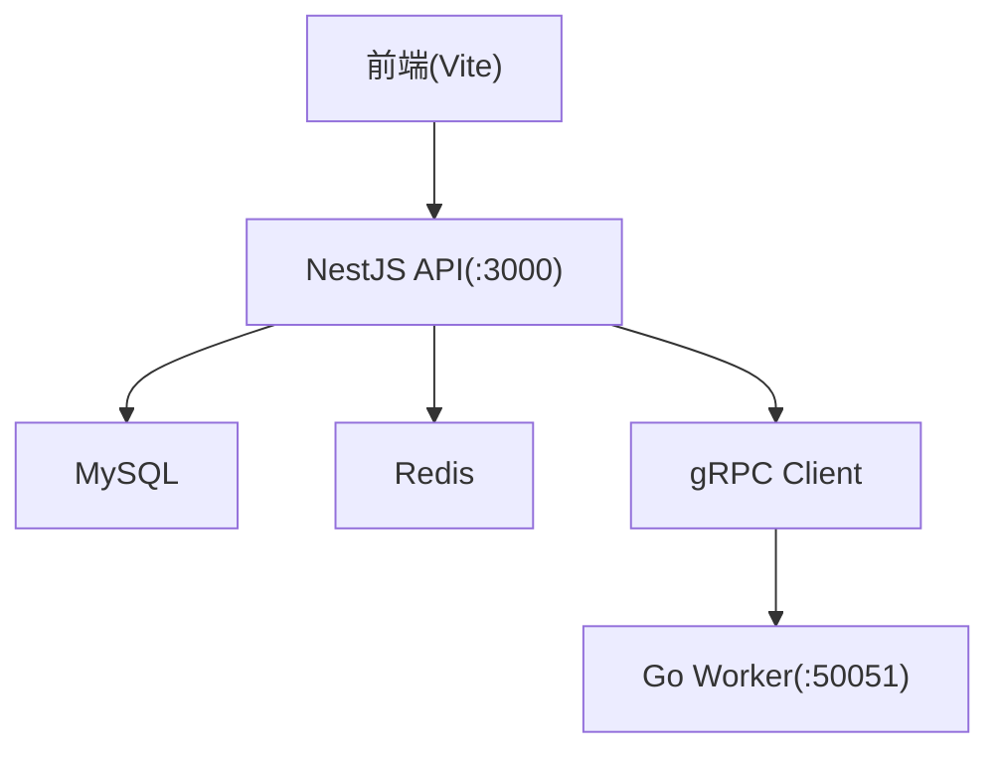
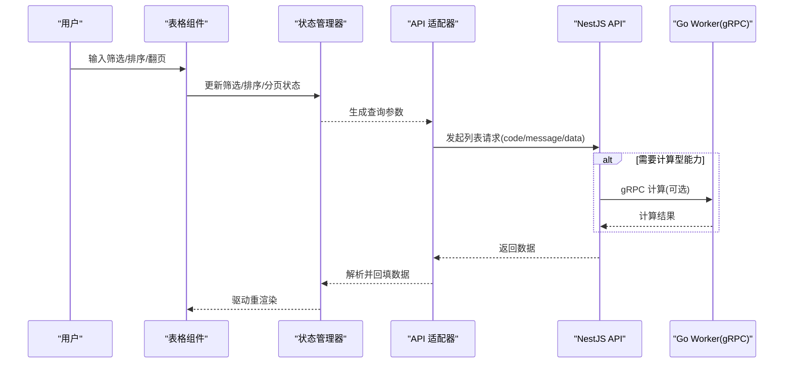
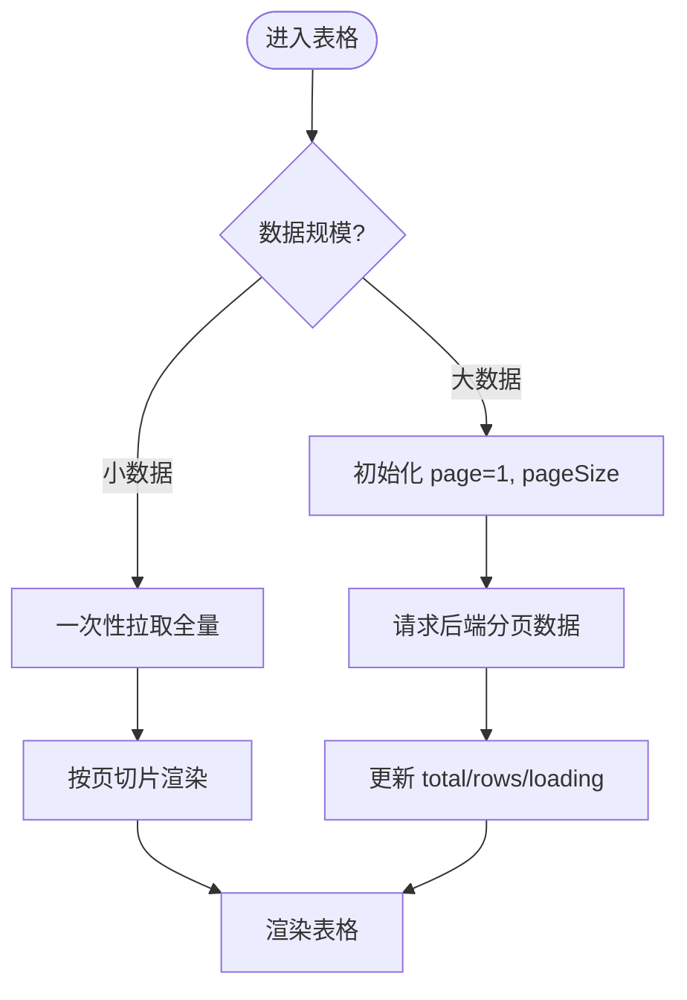
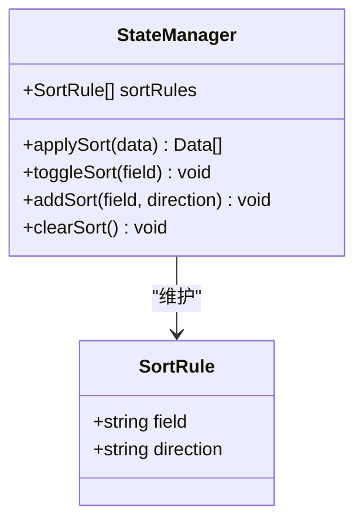
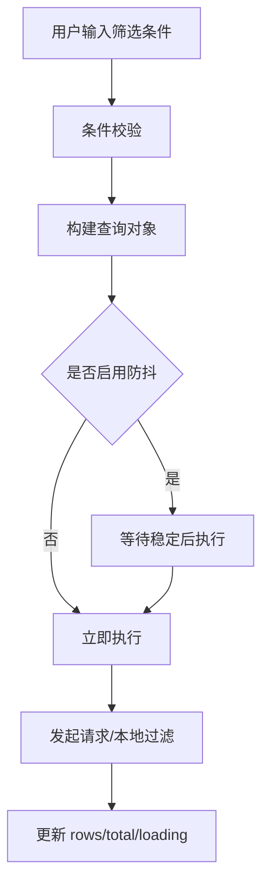
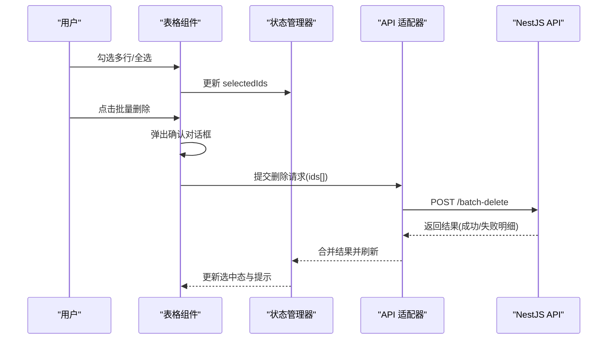
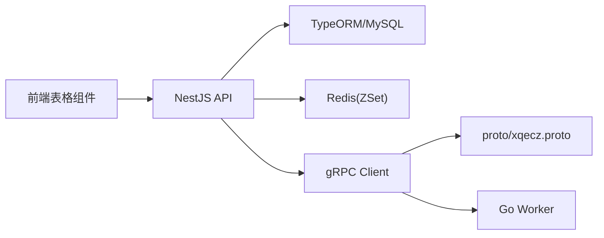

# 数据表格组件

<cite>
**本文引用的文件**   
- [packages/frontend/src/api/index.ts](file://packages/frontend/src/api/index.ts)
- [proto/xqecz.proto](file://proto/xqecz.proto)
- [scripts/run-worker.mjs](file://scripts/run-worker.mjs)
- [package.json](file://package.json)
</cite>

## 目录
1. [简介](#简介)
2. [项目结构](#项目结构)
3. [核心组件](#核心组件)
4. [架构总览](#架构总览)
5. [详细组件分析](#详细组件分析)
6. [依赖关系分析](#依赖关系分析)
7. [性能考量](#性能考量)
8. [故障排查指南](#故障排查指南)
9. [结论](#结论)
10. [附录](#附录)

## 简介
本文件为 xqecz 平台“数据表格组件”的权威文档，面向内容管理、用户管理等后台场景。文档覆盖分页（前端/后端）、排序（单列/多列）、筛选（文本搜索/数值范围/下拉选择）、批量操作（全选/多选/批量删除/批量导出）的实现要点；阐述数据绑定与状态管理（选中、排序、筛选），以及响应式布局、虚拟滚动优化与性能调优策略；并提供配置项、自定义列渲染、行操作按钮与事件处理的说明，帮助快速落地高质量表格体验。

## 项目结构
xqecz 采用 monorepo 组织：NestJS API、Go Worker、Vite 前端等模块位于 packages 下，gRPC 契约定义在 proto 目录，脚本入口在 scripts。数据表格组件属于前端 UI 层，通过统一的 API 契约与 NestJS 交互，必要时经 gRPC 调用 Go Worker 完成计算密集型任务（如推荐打分）。

图表来源
- [packages/frontend/src/api/index.ts](file://packages/frontend/src/api/index.ts)
- [proto/xqecz.proto](file://proto/xqecz.proto)
- [scripts/run-worker.mjs](file://scripts/run-worker.mjs)

章节来源
- [package.json](file://package.json)

## 核心组件
- 表格容器组件：负责渲染表头、表体、工具栏、分页器、筛选面板、批量操作栏，并承载状态管理与事件分发。
- 数据源适配器：对接统一 API 响应格式 { code, message, data }，封装分页、排序、筛选参数到请求，解析返回数据为表格行集合。
- 状态管理器：维护当前页码、每页条数、排序规则、筛选条件、选中行集合、加载态、错误信息等。
- 渲染引擎：支持自定义列模板、单元格格式化、行操作按钮插槽、响应式列显示/隐藏。
- 交互控制器：处理键盘导航、拖拽排序、多选全选、批量操作确认、导出触发等。

章节来源
- [packages/frontend/src/api/index.ts](file://packages/frontend/src/api/index.ts)

## 架构总览
表格组件遵循“视图-状态-数据源”分层：
- 视图层：表格渲染、工具栏、分页器、筛选面板、批量操作栏。
- 状态层：选中集、排序规则、筛选条件、分页参数、加载/错误状态。
- 数据层：API 适配层将状态转换为查询参数，拉取数据并回填状态。

图表来源
- [packages/frontend/src/api/index.ts](file://packages/frontend/src/api/index.ts)
- [proto/xqecz.proto](file://proto/xqecz.proto)

## 详细组件分析

### 分页功能（前端分页/后端分页）
- 前端分页：适用于小数据集，由状态管理器缓存全量数据，按页码与每页条数切片展示。适合离线或一次性拉取的静态数据。
- 后端分页：大数据集首选，每次翻页/排序/筛选都向 API 发送请求，服务端返回对应页的数据与总数。建议开启防抖与取消重复请求。
- 关键状态字段：page、pageSize、total、hasMore、loading。
- 交互流程：切换页码/每页条数时，重新拉取数据；首次进入默认请求第一页。

图表来源
- [packages/frontend/src/api/index.ts](file://packages/frontend/src/api/index.ts)

章节来源
- [packages/frontend/src/api/index.ts](file://packages/frontend/src/api/index.ts)

### 排序功能（单列排序/多列排序）
- 单列排序：点击列头切换 asc/desc/null，状态管理器记录当前排序键与方向。
- 多列排序：按住修饰键点击列头追加排序维度，状态管理器维护排序规则数组。
- 后端排序：将排序规则序列化为查询参数，服务端按优先级排序。
- 性能建议：对大表优先使用后端排序；前端排序仅用于小数据或临时预览。

图表来源
- [packages/frontend/src/api/index.ts](file://packages/frontend/src/api/index.ts)

章节来源
- [packages/frontend/src/api/index.ts](file://packages/frontend/src/api/index.ts)

### 筛选功能（文本搜索/数值范围/下拉选择）
- 文本搜索：支持模糊匹配、多字段搜索、去空格与大小写归一化。
- 数值范围：起止区间校验、单位换算、边界包含性可配置。
- 下拉选择：单选/多选、级联选择、动态选项加载。
- 组合筛选：AND/OR 逻辑可配置，支持保存常用筛选方案。
- 状态管理：筛选对象与 URL 同步，便于分享与回退。

图表来源
- [packages/frontend/src/api/index.ts](file://packages/frontend/src/api/index.ts)

章节来源
- [packages/frontend/src/api/index.ts](file://packages/frontend/src/api/index.ts)

### 批量操作（全选/多选/批量删除/批量导出）
- 全选/多选：首列复选框联动，支持跨页记忆选中（需后端持久化或本地缓存）。
- 批量删除：二次确认、失败重试、部分成功提示。
- 批量导出：流式下载、进度反馈、错误降级（如转 CSV）。
- 权限控制：基于角色/资源粒度禁用敏感操作。

图表来源
- [packages/frontend/src/api/index.ts](file://packages/frontend/src/api/index.ts)

章节来源
- [packages/frontend/src/api/index.ts](file://packages/frontend/src/api/index.ts)

### 数据绑定机制
- 统一响应格式：{ code, message, data }，适配器负责解包与异常映射。
- 双向绑定：表单筛选与 URL 同步，路由参数驱动筛选状态。
- 懒加载：按需加载列模板与扩展插件，减少初始包体积。
- 类型安全：TS 类型约束行结构与字段映射，避免运行时错误。

章节来源
- [packages/frontend/src/api/index.ts](file://packages/frontend/src/api/index.ts)

### 状态管理（选中状态、排序状态、筛选状态）
- 选中状态：selectedIds Set，支持跨页记忆与撤销。
- 排序状态：sortRules 数组，支持多列优先级与方向切换。
- 筛选状态：filters 对象，支持嵌套与表达式。
- 副作用：状态变更触发请求或本地重算，避免不必要的渲染。

章节来源
- [packages/frontend/src/api/index.ts](file://packages/frontend/src/api/index.ts)

### 用户交互逻辑
- 键盘导航：上下移动焦点、回车编辑、Esc 取消。
- 拖拽排序：列头拖拽调整顺序，移动端禁用。
- 右键菜单：复制行、打开详情、快捷操作。
- 无障碍：ARIA 标签、屏幕阅读器友好。

章节来源
- [packages/frontend/src/api/index.ts](file://packages/frontend/src/api/index.ts)

### 响应式设计
- 列自适应：根据视口宽度自动折叠次要列，提供横向滚动。
- 工具栏折叠：筛选与批量操作在小屏收起为抽屉。
- 触摸友好：增大点击区域，支持滑动翻页。

章节来源
- [packages/frontend/src/api/index.ts](file://packages/frontend/src/api/index.ts)

### 虚拟滚动优化
- 可视区渲染：仅渲染可见行，滚动时动态替换 DOM。
- 高度预估：固定行高或估算行高，提升滚动性能。
- 增量更新：只更新变化行，避免整表重绘。

章节来源
- [packages/frontend/src/api/index.ts](file://packages/frontend/src/api/index.ts)

### 性能调优
- 请求优化：防抖/节流、取消重复请求、并发限制。
- 渲染优化：React.memo/VirtualList、惰性加载、代码分割。
- 内存管理：及时释放监听器与定时器，避免泄漏。

章节来源
- [packages/frontend/src/api/index.ts](file://packages/frontend/src/api/index.ts)

### 配置选项
- 基础配置：columns、dataSource、pagination、rowKey、size。
- 行为配置：sortable、filterable、selectable、batchActions、exportable。
- 样式配置：theme、compact、striped、bordered、stickyHeader。
- 高级配置：virtualScroll、lazyLoad、errorBoundary、i18n。

章节来源
- [packages/frontend/src/api/index.ts](file://packages/frontend/src/api/index.ts)

### 自定义列渲染
- 插槽/模板：支持函数或组件渲染单元格内容。
- 格式化器：日期、金额、百分比、枚举翻译。
- 操作列：新增、编辑、删除、查看、更多操作。

章节来源
- [packages/frontend/src/api/index.ts](file://packages/frontend/src/api/index.ts)

### 行操作按钮与事件处理
- 内置动作：查看详情、编辑、删除、导出单行。
- 自定义动作：通过事件钩子注入业务逻辑。
- 权限控制：基于角色/资源动态显示/禁用。

章节来源
- [packages/frontend/src/api/index.ts](file://packages/frontend/src/api/index.ts)

### 使用示例：内容管理
- 目标：展示图片/视频/图文/链接列表，支持按标题搜索、分类筛选、浏览量排序。
- 步骤：
  - 配置 columns 与 dataSource，启用 sortable/filterable/pagination。
  - 接入 API 适配器，确保 { code, message, data } 正确解析。
  - 添加导出与批量删除，结合权限控制。
  - 对小图缩略图启用懒加载与占位图。

章节来源
- [packages/frontend/src/api/index.ts](file://packages/frontend/src/api/index.ts)

### 使用示例：用户管理
- 目标：展示用户列表，支持邮箱/手机号搜索、状态筛选、注册时间范围。
- 步骤：
  - 配置 filters 为文本+范围+下拉组合。
  - 启用后端分页与排序，避免前端压力。
  - 批量禁用/启用用户，失败重试与日志上报。
  - 导出用户清单为 CSV，脱敏敏感字段。

章节来源
- [packages/frontend/src/api/index.ts](file://packages/frontend/src/api/index.ts)

## 依赖关系分析
- 前端依赖：UI 框架、状态库、网络库、国际化库。
- API 契约：统一响应格式与错误码约定。
- gRPC 契约：与 Go Worker 的计算接口定义。
- 环境变量：UPLOAD_DIR 等影响文件路径与存储行为。

图表来源
- [packages/frontend/src/api/index.ts](file://packages/frontend/src/api/index.ts)
- [proto/xqecz.proto](file://proto/xqecz.proto)
- [scripts/run-worker.mjs](file://scripts/run-worker.mjs)

章节来源
- [packages/frontend/src/api/index.ts](file://packages/frontend/src/api/index.ts)
- [proto/xqecz.proto](file://proto/xqecz.proto)
- [scripts/run-worker.mjs](file://scripts/run-worker.mjs)

## 性能考量
- 数据规模评估：小数据用前端分页，大数据强制后端分页。
- 请求去重与取消：相同参数请求合并，页面离开时取消未完成的请求。
- 渲染优化：虚拟滚动、行高预估、增量更新、避免深比较。
- 内存与泄漏：清理定时器、事件监听、订阅；避免闭包持有大对象。
- 网络与缓存：合理设置缓存策略，利用 Redis ZSet 热点数据。

[本节为通用指导，不直接分析具体文件]

## 故障排查指南
- 常见错误：
  - 数据为空：检查 API 返回 code/message/data 结构是否正确。
  - 分页异常：核对 page/pageSize/total 字段映射。
  - 排序错乱：确认后端排序字段与前端一致。
  - 筛选无效：检查筛选条件序列化与去重。
  - 批量操作失败：查看失败明细与重试策略。
- 调试手段：
  - 网络面板抓包，验证请求参数与响应结构。
  - 控制台打印状态快照，定位状态更新时机。
  - 单元测试覆盖关键分支，回归验证。

章节来源
- [packages/frontend/src/api/index.ts](file://packages/frontend/src/api/index.ts)

## 结论
数据表格组件以清晰的分层与状态管理为核心，结合前后端协作与 gRPC 扩展能力，满足内容管理与用户管理等复杂场景。通过合理的分页、排序、筛选与批量操作设计，配合虚拟滚动与性能调优，可在大规模数据下保持流畅体验。建议在生产环境严格遵循统一 API 契约与错误处理规范，确保稳定性与可维护性。

[本节为总结，不直接分析具体文件]

## 附录
- 运行方式：pnpm dev 启动 NestJS API(:3000)、Go Worker(:50051)、Vite 前端(:5173)。
- 环境变量：UPLOAD_DIR 统一上传目录，.env 集中配置。
- gRPC 契约：字段 snake_case，keepCase:true，proto/gen 与 worker/proto 为生成产物。

章节来源
- [package.json](file://package.json)
- [scripts/run-worker.mjs](file://scripts/run-worker.mjs)
- [proto/xqecz.proto](file://proto/xqecz.proto)
- [packages/frontend/src/api/index.ts](file://packages/frontend/src/api/index.ts)