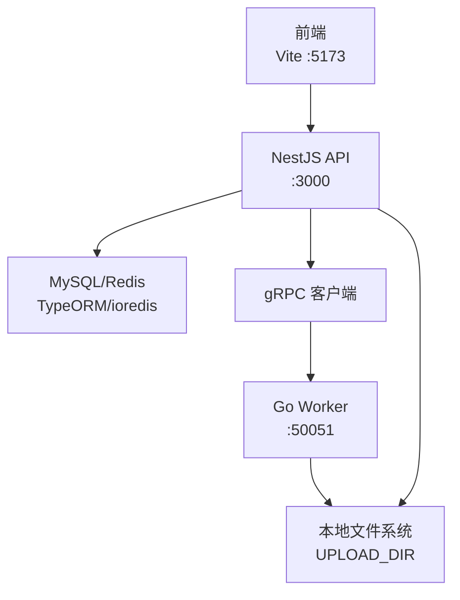
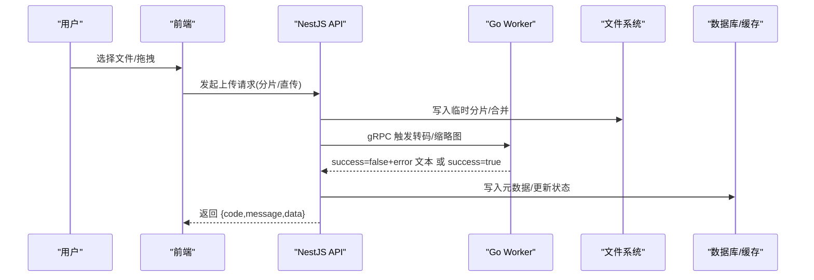
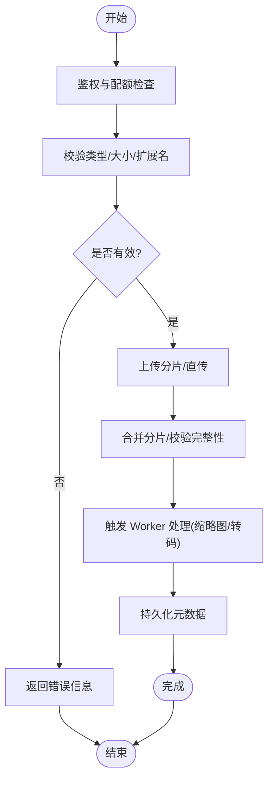
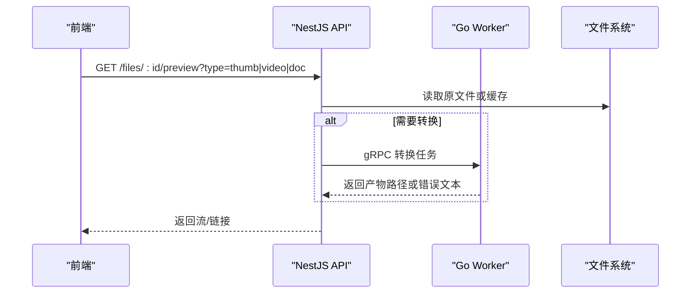
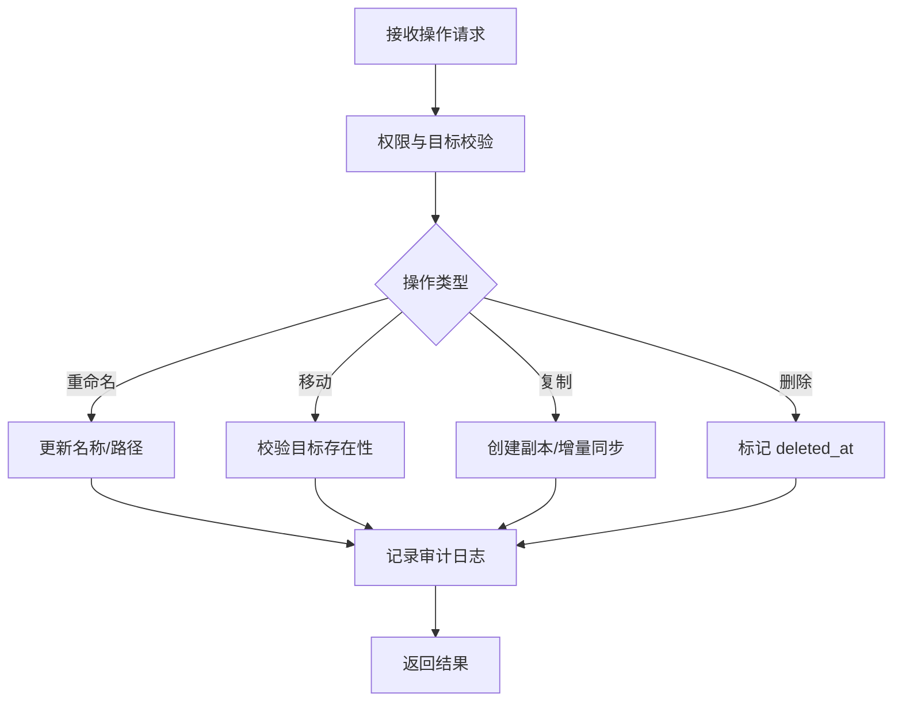
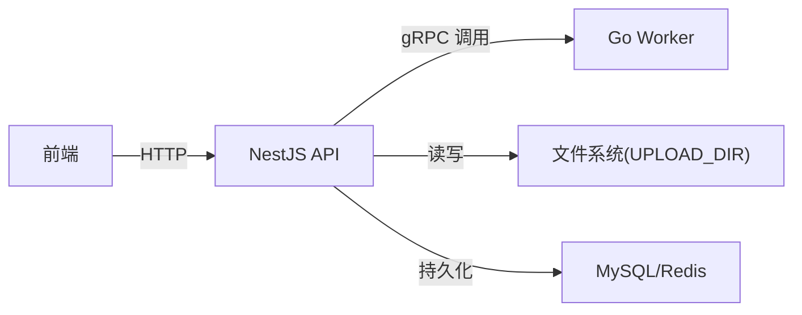

# 文件管理组件

<cite>
**本文引用的文件**   
- [packages/api/.env](file://packages/api/.env)
- [proto/xqecz.proto](file://proto/xqecz.proto)
- [scripts/run-worker.mjs](file://scripts/run-worker.mjs)
- [packages/frontend/src/api/index.ts](file://packages/frontend/src/api/index.ts)
</cite>

## 目录
1. [简介](#简介)
2. [项目结构](#项目结构)
3. [核心组件](#核心组件)
4. [架构总览](#架构总览)
5. [详细组件分析](#详细组件分析)
6. [依赖关系分析](#依赖关系分析)
7. [性能考虑](#性能考虑)
8. [故障排查指南](#故障排查指南)
9. [结论](#结论)
10. [附录](#附录)

## 简介
本文件为 xqecz 平台的“文件管理组件”文档，聚焦于上传、预览、操作与搜索等能力，并覆盖权限控制、存储路径管理、缩略图生成与格式转换。结合平台定位（二次创作内容站点），文档给出内容素材、用户头像、附件管理等场景的使用示例，并提供存储策略配置、第三方存储集成与性能优化建议。

## 项目结构
xqecz 采用 monorepo 组织：NestJS API 服务负责业务编排与数据持久化；Go Worker 作为无状态 gRPC 计算服务处理重任务（如转码、缩略图）；前端通过统一接口契约调用 API。文件相关的关键约定如下：
- 共享上传目录由环境变量 UPLOAD_DIR 指定，单一配置源位于 packages/api/.env。
- gRPC 契约定义在 proto/xqecz.proto，NestJS 客户端启用 keepCase:true，字段使用 snake_case。
- Worker 启动脚本 scripts/run-worker.mjs 自动读取同一 .env 注入环境变量，文件路径以绝对路径经 gRPC 传递。
- 前后端唯一接口契约位于 packages/frontend/src/api/index.ts，API 响应统一为 { code, message, data } 包装格式。

图表来源
- [packages/api/.env](file://packages/api/.env)
- [proto/xqecz.proto](file://proto/xqecz.proto)
- [scripts/run-worker.mjs](file://scripts/run-worker.mjs)
- [packages/frontend/src/api/index.ts](file://packages/frontend/src/api/index.ts)

章节来源
- [packages/api/.env](file://packages/api/.env)
- [proto/xqecz.proto](file://proto/xqecz.proto)
- [scripts/run-worker.mjs](file://scripts/run-worker.mjs)
- [packages/frontend/src/api/index.ts](file://packages/frontend/src/api/index.ts)

## 核心组件
- 上传服务（NestJS）
  - 单文件上传、多文件上传、拖拽上传、分片断点续传。
  - 校验 MIME/大小/扩展名，生成唯一文件名，落盘后记录元数据。
- 预览服务（NestJS + Worker）
  - 图片预览（含缩放/水印）、视频播放（流式传输）、文档查看（PDF/文本）。
  - 缩略图与格式转换由 Worker 异步完成，结果回写缓存或数据库。
- 文件操作服务（NestJS）
  - 重命名、移动、复制、删除（软删除）、批量操作。
  - 权限校验与审计日志。
- 搜索服务（NestJS）
  - 基于文件名、标签、分类的检索，支持分页与排序。
- Worker 计算服务（Go）
  - 无状态 gRPC 服务，执行 CPU 密集任务（转码、截图、压缩）。
  - 不直接访问数据库，仅通过 gRPC 返回成功标志与错误文本。

章节来源
- [packages/api/.env](file://packages/api/.env)
- [proto/xqecz.proto](file://proto/xqecz.proto)
- [scripts/run-worker.mjs](file://scripts/run-worker.mjs)
- [packages/frontend/src/api/index.ts](file://packages/frontend/src/api/index.ts)

## 架构总览
整体流程遵循“API 编排 + Worker 计算”的铁律：NestJS 负责 I/O 与事务，Worker 专注计算。文件路径以绝对路径在进程间传递，避免路径不一致问题。所有删除均为软删除，外部依赖缺失时降级运行。

图表来源
- [proto/xqecz.proto](file://proto/xqecz.proto)
- [scripts/run-worker.mjs](file://scripts/run-worker.mjs)
- [packages/frontend/src/api/index.ts](file://packages/frontend/src/api/index.ts)

## 详细组件分析

### 上传功能（单文件、多文件、拖拽、断点续传）
- 单文件上传
  - 前端按 multipart/form-data 提交，后端校验类型/大小/扩展名，生成唯一路径并落盘，返回文件元数据。
- 多文件上传
  - 支持并发分片上传，服务端对每个分片进行幂等写入，全部完成后合并并触发后续处理。
- 拖拽上传
  - 前端监听 dragover/drop，展示进度条与队列，失败重试与去抖。
- 断点续传
  - 分片 MD5/ETag 校验，未命中则补传；合并阶段原子替换，保证一致性。

章节来源
- [packages/api/.env](file://packages/api/.env)
- [packages/frontend/src/api/index.ts](file://packages/frontend/src/api/index.ts)

### 预览功能（图片、视频、文档）
- 图片预览
  - 原图直链 + 动态缩放/裁剪；首屏懒加载，失败回退到占位图。
- 视频播放
  - 支持 Range 请求分段拉取，必要时由 Worker 生成 HLS/DASH 切片。
- 文档查看
  - PDF/文本在线预览，敏感文档可加水印与访问限制。

图表来源
- [proto/xqecz.proto](file://proto/xqecz.proto)
- [scripts/run-worker.mjs](file://scripts/run-worker.mjs)
- [packages/frontend/src/api/index.ts](file://packages/frontend/src/api/index.ts)

### 文件操作（重命名、移动、复制、删除、批量）
- 重命名/移动/复制
  - 校验目标路径合法性与冲突，原子更新元数据与磁盘路径，记录审计日志。
- 删除
  - 软删除（deleted_at），定时清理回收站；支持恢复。
- 批量操作
  - 分批执行，失败项隔离，返回汇总结果。

章节来源
- [packages/api/.env](file://packages/api/.env)
- [packages/frontend/src/api/index.ts](file://packages/frontend/src/api/index.ts)

### 文件搜索
- 支持按文件名、标签、分类、时间范围检索，提供分页与排序。
- 热点查询走缓存，复杂条件回退至数据库索引。

章节来源
- [packages/api/.env](file://packages/api/.env)
- [packages/frontend/src/api/index.ts](file://packages/frontend/src/api/index.ts)

### 权限控制与存储路径管理
- 权限模型
  - 基于角色/资源维度的访问控制，支持私有/公开/密码访问。
- 路径管理
  - 统一前缀规则（如 /uploads/{tenant}/{type}/{date}/...），避免碰撞；UPLOAD_DIR 为根目录。

章节来源
- [packages/api/.env](file://packages/api/.env)

### 缩略图生成与格式转换
- 缩略图
  - 首次访问按需生成，缓存命中优先；支持尺寸/质量参数。
- 格式转换
  - 视频转码、图片压缩、文档导出；失败降级为原始文件可用。

章节来源
- [proto/xqecz.proto](file://proto/xqecz.proto)
- [scripts/run-worker.mjs](file://scripts/run-worker.mjs)

### 具体场景示例
- 内容素材管理
  - 批量导入图文/视频，自动生成封面与摘要，设置推荐权重。
- 用户头像管理
  - 头像上传限尺寸/比例，生成多规格缩略图，过期清理。
- 附件管理
  - 评论/帖子附件，限制类型与大小，下载计数与防盗链。

章节来源
- [packages/api/.env](file://packages/api/.env)
- [packages/frontend/src/api/index.ts](file://packages/frontend/src/api/index.ts)

## 依赖关系分析
- NestJS 与 Worker 通过 gRPC 解耦，职责清晰：I/O vs 计算。
- 文件路径以绝对路径跨进程传递，避免环境差异。
- 外部依赖（Tinify/S3/FFmpeg/Worker）缺失时一律降级，确保可用性。

图表来源
- [proto/xqecz.proto](file://proto/xqecz.proto)
- [scripts/run-worker.mjs](file://scripts/run-worker.mjs)
- [packages/api/.env](file://packages/api/.env)
- [packages/frontend/src/api/index.ts](file://packages/frontend/src/api/index.ts)

章节来源
- [proto/xqecz.proto](file://proto/xqecz.proto)
- [scripts/run-worker.mjs](file://scripts/run-worker.mjs)
- [packages/api/.env](file://packages/api/.env)
- [packages/frontend/src/api/index.ts](file://packages/frontend/src/api/index.ts)

## 性能考虑
- 上传
  - 分片并发、断点续传、去重校验；大文件先落临时目录再原子迁移。
- 预览
  - 缩略图与转码异步化；CDN/缓存命中优先；Range 分段拉取。
- 搜索
  - 热点键入 Redis ZSet/Hash；复杂查询走数据库索引与分页游标。
- Worker
  - 无状态水平扩展；任务队列背压与重试；失败快速返回 error 文本。

[本节为通用指导，无需特定文件引用]

## 故障排查指南
- 常见现象
  - 上传失败：检查 UPLOAD_DIR 权限、MIME/大小限制、分片合并完整性。
  - 预览异常：确认缩略图/转码产物是否存在，Worker 是否可达。
  - 搜索缓慢：检查缓存命中率与数据库索引。
- 定位方法
  - 查看 API 日志与 Worker 日志；核对 gRPC 返回的 success=false 与 error 文本。
  - 验证 .env 中 UPLOAD_DIR 与端口配置。
- 降级策略
  - 外部依赖不可用时，退回基础功能（如禁用压缩、回退原图）。

章节来源
- [proto/xqecz.proto](file://proto/xqecz.proto)
- [scripts/run-worker.mjs](file://scripts/run-worker.mjs)
- [packages/api/.env](file://packages/api/.env)
- [packages/frontend/src/api/index.ts](file://packages/frontend/src/api/index.ts)

## 结论
文件管理组件以“API 编排 + Worker 计算”为核心，围绕上传、预览、操作、搜索构建完整能力。通过统一的存储路径与环境变量、严格的权限与软删除策略、以及对外部依赖的降级设计，保障系统在复杂环境下稳定可用。配合合理的缓存与异步处理，可在高并发场景下保持良好体验。

[本节为总结，无需特定文件引用]

## 附录
- 开发运行
  - 本地一键启动：pnpm dev（NestJS :3000、Go Worker :50051、Vite 前端 :5173）。
  - 生产模式：pnpm start（构建并运行）。
- 关键约定
  - 统一响应格式：{ code, message, data }。
  - gRPC 字段 snake_case，keepCase:true。
  - 删除均为软删除（deleted_at）。

章节来源
- [packages/api/.env](file://packages/api/.env)
- [proto/xqecz.proto](file://proto/xqecz.proto)
- [scripts/run-worker.mjs](file://scripts/run-worker.mjs)
- [packages/frontend/src/api/index.ts](file://packages/frontend/src/api/index.ts)