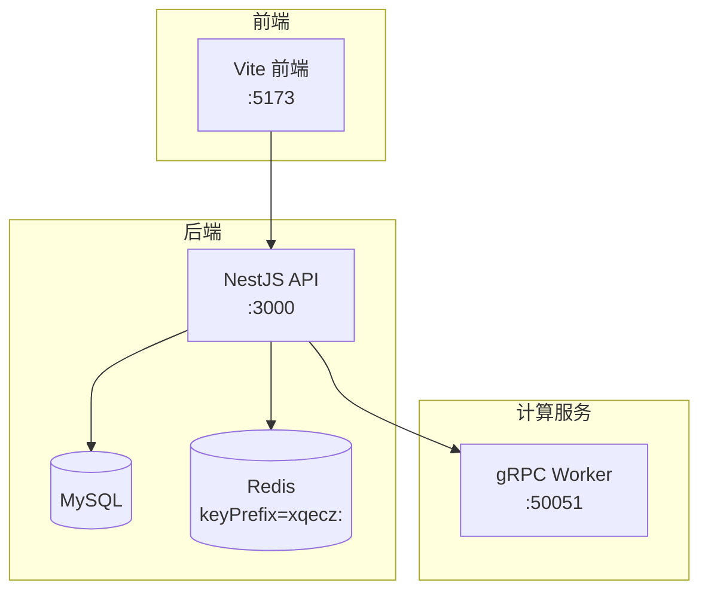
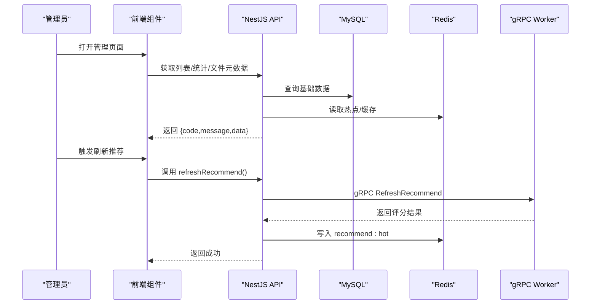
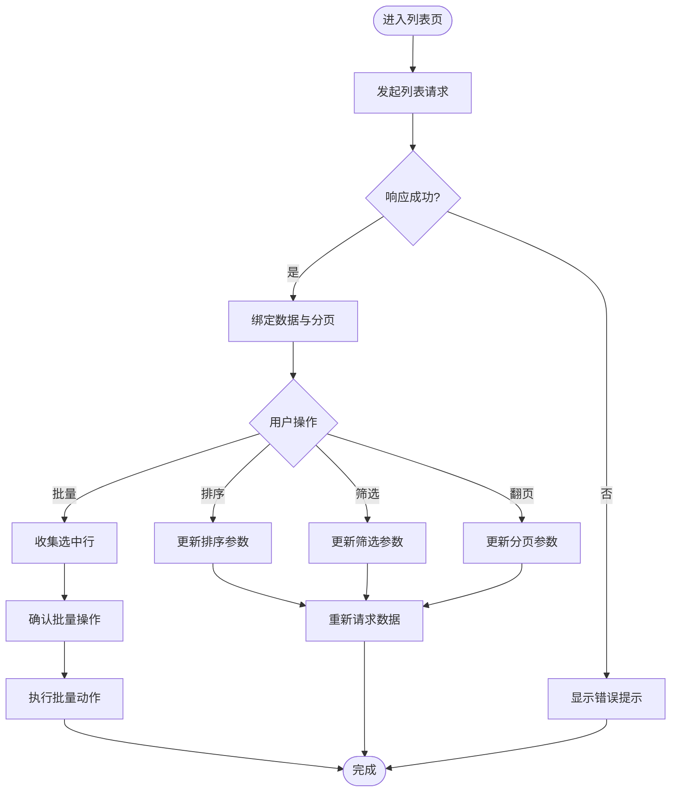
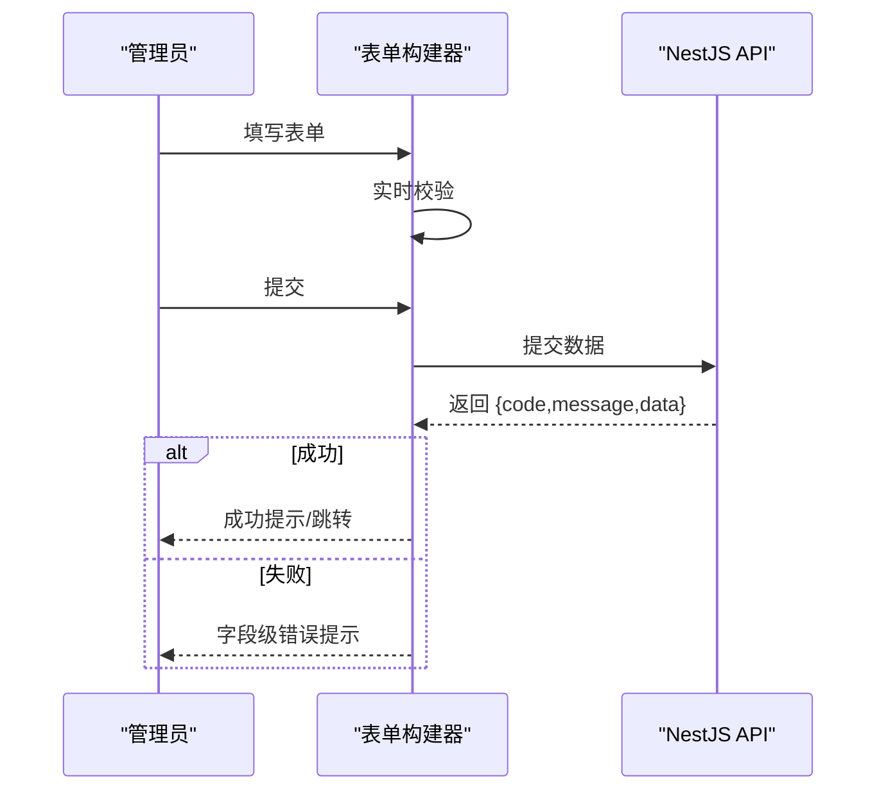
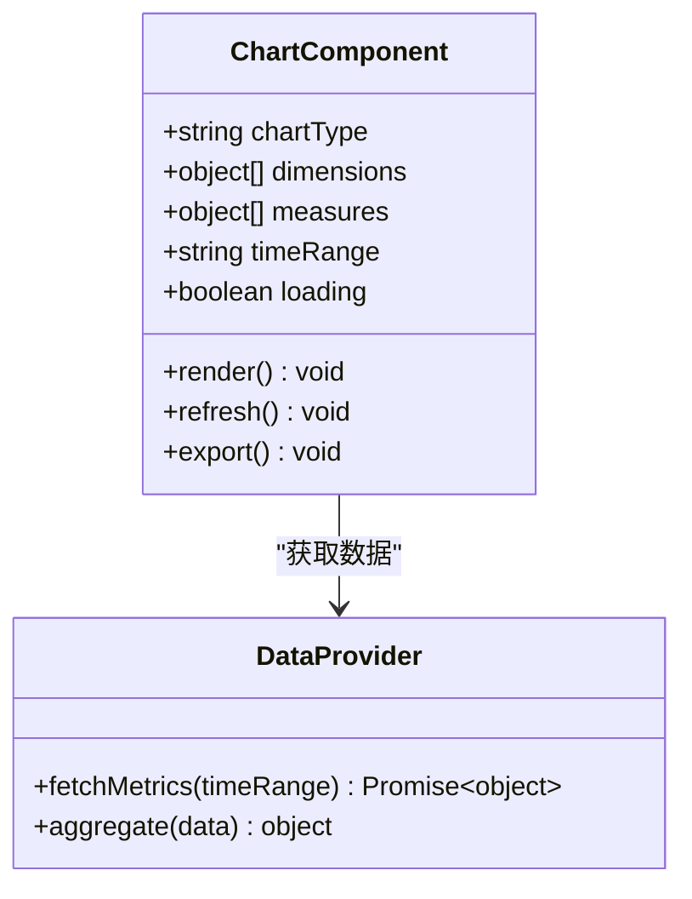
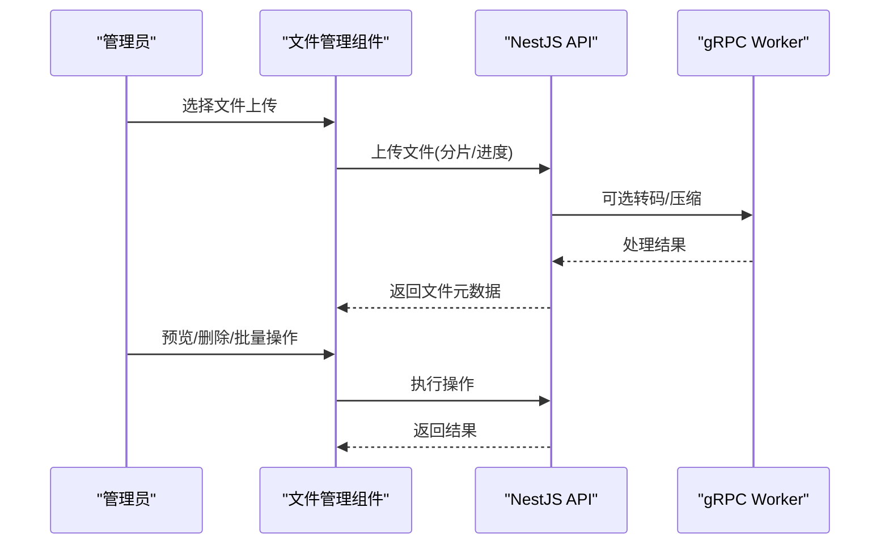
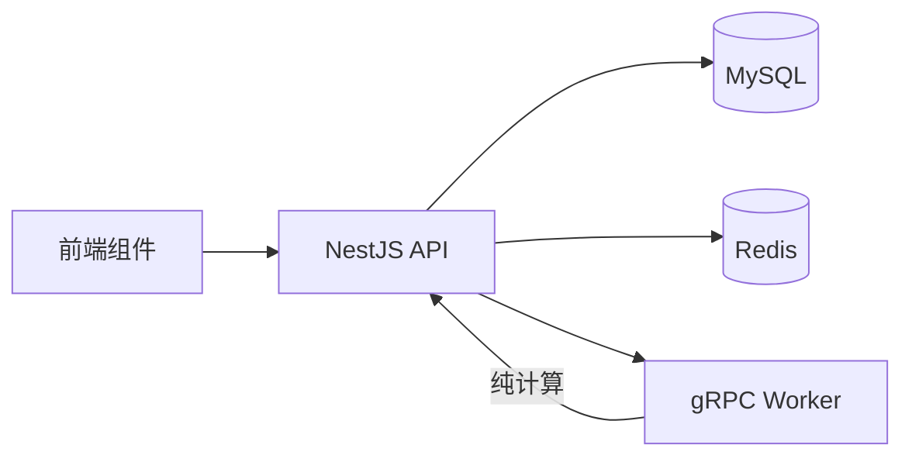

# 管理界面组件

<cite>
**本文引用的文件**   
- [packages/frontend/src/api/index.ts](file://packages/frontend/src/api/index.ts)
- [proto/xqecz.proto](file://proto/xqecz.proto)
- [scripts/run-worker.mjs](file://scripts/run-worker.mjs)
- [package.json](file://package.json)
- [pnpm-workspace.yaml](file://pnpm-workspace.yaml)
</cite>

## 目录
1. [简介](#简介)
2. [项目结构](#项目结构)
3. [核心组件](#核心组件)
4. [架构总览](#架构总览)
5. [详细组件分析](#详细组件分析)
6. [依赖关系分析](#依赖关系分析)
7. [性能考量](#性能考量)
8. [故障排查指南](#故障排查指南)
9. [结论](#结论)
10. [附录](#附录)

## 简介
本文件面向 xqecz 平台的管理后台，系统化说明四大管理界面组件的实现与使用：数据表格、表单构建器、图表展示、文件管理。文档聚焦于数据绑定、状态管理、用户交互逻辑，以及权限控制、操作审计与错误处理机制；同时给出配置项、事件与扩展方法，并提供典型管理场景示例与自定义开发指南。

项目定位与运行方式要点（来自项目约定）：
- 小泉动漫二创站（xqecz），支持用户上传/浏览二次创作内容（图片、视频、图文、链接），含评论、投票与管理后台。
- 唯一运行方式为 pnpm 脚本本地直启：pnpm dev 启动 NestJS API(:3000)、Go Worker(:50051)、Vite 前端(:5173)。
- 前后端接口契约统一在 packages/frontend/src/api/index.ts，响应格式为 { code, message, data }。
- gRPC 契约定义在 proto/xqecz.proto，NestJS 客户端设置 keepCase:true、字段 snake_case；worker 无状态计算，不直接访问数据库。
- 所有删除均为软删除（deleted_at + TypeORM @DeleteDateColumn 自动过滤）。
- 外部依赖缺失一律降级，gRPC 不返回 rpc error，只返回 success=false + error 文本。

## 项目结构
- 前端工程位于 packages/frontend，通过 Vite 提供开发服务器与构建产物。
- 后端 API 由 NestJS 提供，统一暴露 REST/gRPC 能力，并负责 MySQL/Redis 的读写。
- Go worker 作为无状态计算服务，接收 gRPC 请求进行纯计算后回传结果。
- 共享上传目录由 UPLOAD_DIR 环境变量约定，单一配置源为 packages/api/.env；worker 经 scripts/run-worker.mjs 启动时自动读取同一 .env 注入，文件路径以绝对路径传递。

**图示来源**
- [package.json](file://package.json)
- [pnpm-workspace.yaml](file://pnpm-workspace.yaml)

**章节来源**
- [package.json](file://package.json)
- [pnpm-workspace.yaml](file://pnpm-workspace.yaml)

## 核心组件
本节概述四大管理组件的职责与通用能力，后续章节将逐项深入实现细节。

- 数据表格组件
  - 能力：分页、排序、筛选、批量操作、列配置、行选择、加载态与错误态。
  - 数据绑定：通过统一的 API 响应 { code, message, data } 绑定列表数据与分页元信息。
  - 状态管理：本地状态（当前页、排序键、筛选条件、选中行）+ 可选全局状态（如用户权限、角色）。
  - 交互逻辑：搜索防抖、分页切换、排序切换、批量勾选与批量动作确认。
  - 权限控制：基于角色/权限点渲染可操作列与按钮。
  - 错误处理：网络异常、业务码非成功时的提示与重试策略。

- 表单构建器组件
  - 能力：动态字段渲染、校验规则、联动、提交处理、草稿保存。
  - 数据绑定：JSON Schema 或 DSL 驱动字段定义，双向绑定到表单模型。
  - 状态管理：字段值、校验状态、错误信息、提交中状态。
  - 交互逻辑：字段联动、实时校验、提交前拦截、成功后回调。
  - 权限控制：按权限隐藏/禁用字段或提交按钮。
  - 错误处理：服务端校验错误映射到字段级错误，统一提示。

- 图表展示组件
  - 能力：数据统计、趋势分析、可视化报表（折线、柱状、饼图、堆叠等）。
  - 数据绑定：聚合后的指标数据与时间序列数据。
  - 状态管理：图表类型、维度/度量配置、时间范围、加载态。
  - 交互逻辑：点击钻取、缩放、导出、刷新。
  - 权限控制：按权限决定可见图表与数据粒度。
  - 错误处理：数据为空、接口失败时的降级展示。

- 文件管理组件
  - 能力：上传、预览、删除、批量操作（移动、重命名、下载）。
  - 数据绑定：文件元数据（名称、大小、类型、创建时间、缩略图 URL）。
  - 状态管理：上传队列、进度、预览模态、选中文件集合。
  - 交互逻辑：拖拽上传、分片上传、断点续传、预览弹窗、批量删除确认。
  - 权限控制：按角色限制上传/删除/下载等操作。
  - 错误处理：上传失败重试、预览失败降级、删除软删除确认。

**章节来源**
- [packages/frontend/src/api/index.ts](file://packages/frontend/src/api/index.ts)

## 架构总览
管理界面组件通过前端 API 层与 NestJS 后端交互，关键链路包括：
- 列表查询：前端调用 API → NestJS 读 MySQL/Redis → 返回分页数据。
- 推荐刷新：NestJS 调用 gRPC RefreshRecommend → Worker 打分 → 写入 Redis ZSet recommend:hot → 读取降级为 view_count。
- 文件上传：前端上传至 API → 可能触发 Worker 转码/压缩 → 落库/写缓存 → 返回文件元数据。
- 删除操作：API 执行软删除（deleted_at），前端仅展示未删除记录。

**图示来源**
- [packages/frontend/src/api/index.ts](file://packages/frontend/src/api/index.ts)
- [proto/xqecz.proto](file://proto/xqecz.proto)

**章节来源**
- [packages/frontend/src/api/index.ts](file://packages/frontend/src/api/index.ts)
- [proto/xqecz.proto](file://proto/xqecz.proto)

## 详细组件分析

### 数据表格组件
- 数据绑定
  - 列表数据与分页元信息绑定到表格内部状态，响应格式遵循 { code, message, data }。
  - 支持列显隐、宽度、格式化函数、插槽扩展。
- 状态管理
  - 本地状态：page、pageSize、sortField、sortOrder、filters、selectedRows。
  - 可选全局状态：用户角色、权限点（用于按钮/列显示控制）。
- 用户交互逻辑
  - 搜索输入防抖，避免频繁请求。
  - 排序切换更新 sortField/sortOrder，重新拉取数据。
  - 筛选条件组合查询，支持多选/范围。
  - 批量操作：勾选多行后执行批量删除/状态变更/导出等。
- 权限控制
  - 根据权限点渲染“编辑”“删除”“审核”等操作按钮。
  - 列级别权限：敏感列对低权限用户隐藏。
- 错误处理
  - 网络异常：显示重试按钮与错误提示。
  - 业务码非成功：message 提示，data 为空时降级展示空态。
- 配置选项
  - columns、pagination、sortable、filterable、batchActions、rowKey、loading、errorRetry。
- 事件处理
  - onSortChange、onFilterChange、onPageChange、onRowSelect、onBatchAction。
- 扩展方法
  - 自定义列渲染、自定义操作按钮、自定义筛选器、自定义批量动作。

**图示来源**
- [packages/frontend/src/api/index.ts](file://packages/frontend/src/api/index.ts)

**章节来源**
- [packages/frontend/src/api/index.ts](file://packages/frontend/src/api/index.ts)

### 表单构建器组件
- 数据绑定
  - 通过 JSON Schema/DSL 定义字段类型、默认值、必填、长度、正则等。
  - 双向绑定到表单模型，支持嵌套对象与数组。
- 状态管理
  - 字段值、校验状态、错误信息、提交中状态、草稿状态。
- 用户交互逻辑
  - 字段联动：根据某字段值动态显示/隐藏其他字段。
  - 实时校验：输入时即时反馈错误。
  - 提交前拦截：校验失败阻止提交，成功后回调。
- 权限控制
  - 按权限隐藏/禁用字段或提交按钮。
- 错误处理
  - 服务端校验错误映射到字段级错误，统一提示。
- 配置选项
  - fields、rules、layout、submitHandler、draftSave、permissionMap。
- 事件处理
  - onChange、onValidate、onSubmit、onReset。
- 扩展方法
  - 自定义字段组件、自定义校验器、自定义布局模板。

**图示来源**
- [packages/frontend/src/api/index.ts](file://packages/frontend/src/api/index.ts)

**章节来源**
- [packages/frontend/src/api/index.ts](file://packages/frontend/src/api/index.ts)

### 图表展示组件
- 数据绑定
  - 指标数据与时间序列数据绑定到图表实例。
  - 支持多维度聚合、分组、汇总。
- 状态管理
  - 图表类型、维度/度量配置、时间范围、加载态、错误态。
- 用户交互逻辑
  - 点击钻取、缩放、导出、刷新。
- 权限控制
  - 按权限决定可见图表与数据粒度。
- 错误处理
  - 数据为空、接口失败时的降级展示（占位图/提示）。
- 配置选项
  - chartType、dimensions、measures、timeRange、formatter、exportEnabled。
- 事件处理
  - onClick、onZoom、onExport、onRefresh。
- 扩展方法
  - 自定义图表类型、自定义 formatter、自定义导出格式。

**图示来源**
- [packages/frontend/src/api/index.ts](file://packages/frontend/src/api/index.ts)

**章节来源**
- [packages/frontend/src/api/index.ts](file://packages/frontend/src/api/index.ts)

### 文件管理组件
- 数据绑定
  - 文件元数据（名称、大小、类型、创建时间、缩略图 URL）绑定到列表/预览。
- 状态管理
  - 上传队列、进度、预览模态、选中文件集合、分页。
- 用户交互逻辑
  - 拖拽上传、分片上传、断点续传、预览弹窗、批量删除确认。
- 权限控制
  - 按角色限制上传/删除/下载等操作。
- 错误处理
  - 上传失败重试、预览失败降级、删除软删除确认。
- 配置选项
  - uploadEndpoint、previewEnabled、batchActions、maxSize、allowedTypes。
- 事件处理
  - onUploadProgress、onPreview、onDelete、onBatchAction。
- 扩展方法
  - 自定义上传处理器、自定义预览器、自定义批量动作。

**图示来源**
- [packages/frontend/src/api/index.ts](file://packages/frontend/src/api/index.ts)
- [proto/xqecz.proto](file://proto/xqecz.proto)

**章节来源**
- [packages/frontend/src/api/index.ts](file://packages/frontend/src/api/index.ts)
- [proto/xqecz.proto](file://proto/xqecz.proto)

## 依赖关系分析
- 前端依赖
  - 统一 API 层 packages/frontend/src/api/index.ts 提供所有接口调用。
  - 响应格式 { code, message, data } 贯穿各组件。
- 后端依赖
  - NestJS 负责 MySQL/Redis 读写，gRPC 客户端连接 Worker。
  - gRPC 契约 proto/xqecz.proto 定义服务方法与字段命名（snake_case）。
- Worker 依赖
  - 无状态计算服务，不连数据库，接收 gRPC 请求后返回计算结果。
  - 启动脚本 scripts/run-worker.mjs 注入 .env 环境变量（UPLOAD_DIR 等）。

**图示来源**
- [packages/frontend/src/api/index.ts](file://packages/frontend/src/api/index.ts)
- [proto/xqecz.proto](file://proto/xqecz.proto)
- [scripts/run-worker.mjs](file://scripts/run-worker.mjs)

**章节来源**
- [packages/frontend/src/api/index.ts](file://packages/frontend/src/api/index.ts)
- [proto/xqecz.proto](file://proto/xqecz.proto)
- [scripts/run-worker.mjs](file://scripts/run-worker.mjs)

## 性能考量
- 列表查询
  - 分页与筛选减少数据传输量；排序字段建立索引提升查询效率。
  - 热点数据优先从 Redis 读取，降级到 MySQL view_count 排序。
- 图表数据
  - 聚合计算在后端完成，前端仅渲染；时间范围合理划分避免大查询。
- 文件上传
  - 分片上传与断点续传提升大文件稳定性；Worker 异步处理转码/压缩。
- 缓存策略
  - 推荐榜单写入 Redis ZSet recommend:hot，keyPrefix=xqecz:，读取快速且一致。
- 错误降级
  - 外部依赖缺失（Tinify/S3/FFmpeg/Worker）一律降级，保证可用性。

[本节为通用指导，无需具体文件引用]

## 故障排查指南
- 接口响应异常
  - 检查 { code, message, data } 中的 code 与 message，定位业务错误。
  - 网络异常时启用重试与错误提示。
- gRPC 调用失败
  - 确认 Worker 是否启动（:50051），查看 proto 字段命名（snake_case）。
  - Worker 返回 success=false + error 文本，记录日志并提示用户。
- 文件上传问题
  - 检查 UPLOAD_DIR 环境变量与权限；分片上传进度与断点续传状态。
  - 预览失败时降级为占位图或提示。
- 删除操作无效
  - 确认软删除逻辑（deleted_at）生效，列表查询自动过滤已删除记录。
- 权限与审计
  - 权限点未生效时检查角色映射与组件权限控制逻辑。
  - 操作审计日志需记录操作人、时间、目标资源与结果。

**章节来源**
- [packages/frontend/src/api/index.ts](file://packages/frontend/src/api/index.ts)
- [proto/xqecz.proto](file://proto/xqecz.proto)
- [scripts/run-worker.mjs](file://scripts/run-worker.mjs)

## 结论
管理界面组件围绕统一 API 契约与 gRPC 计算服务构建，具备高内聚、低耦合特性。数据表格、表单构建器、图表展示、文件管理四大组件覆盖管理后台核心场景，支持权限控制、操作审计与错误降级。通过合理的状态管理与交互设计，可在保证可用性的同时提升用户体验。建议在实际项目中结合业务需求扩展组件能力，并严格遵循接口契约与错误处理规范。

[本节为总结性内容，无需具体文件引用]

## 附录
- 典型管理场景示例
  - 内容审核：列表筛选待审内容 → 批量审核 → 更新状态 → 刷新列表。
  - 用户管理：表单新增/编辑用户 → 校验规则 → 提交保存 → 提示成功。
  - 数据分析：选择时间范围 → 聚合指标 → 图表展示 → 导出报表。
  - 文件管理：拖拽上传 → 预览缩略图 → 批量删除 → 软删除确认。
- 自定义开发指南
  - 扩展数据表格列：自定义渲染函数与插槽。
  - 扩展表单字段：注册自定义字段组件与校验器。
  - 扩展图表类型：实现新的图表渲染逻辑与数据适配。
  - 扩展文件操作：自定义上传处理器与预览器。

[本节为概念性内容，无需具体文件引用]