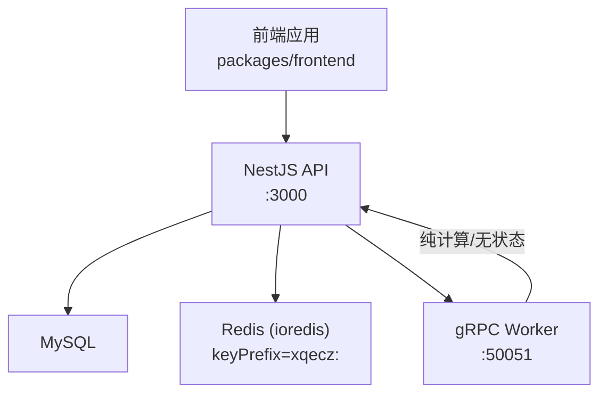
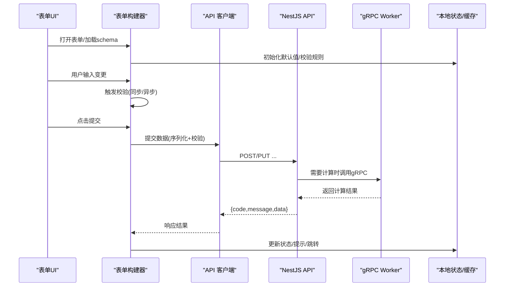
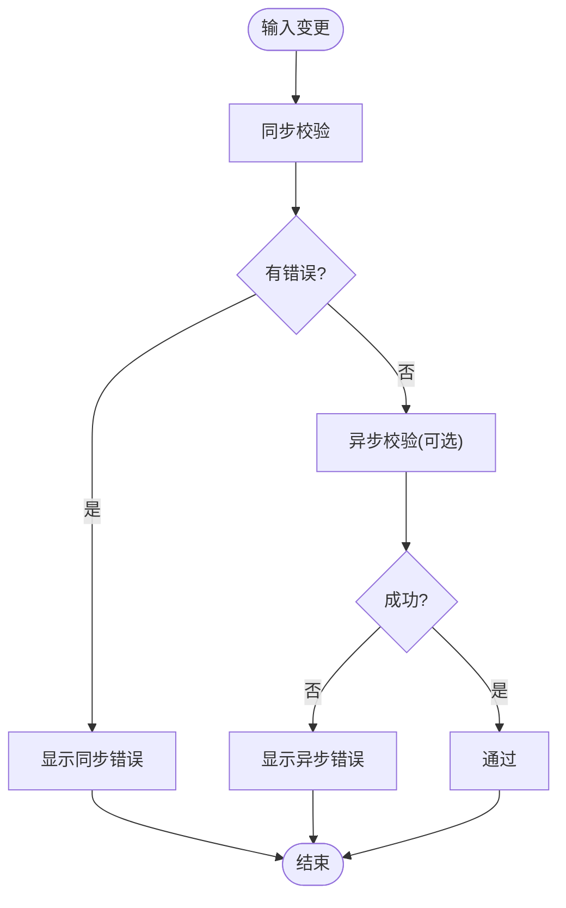
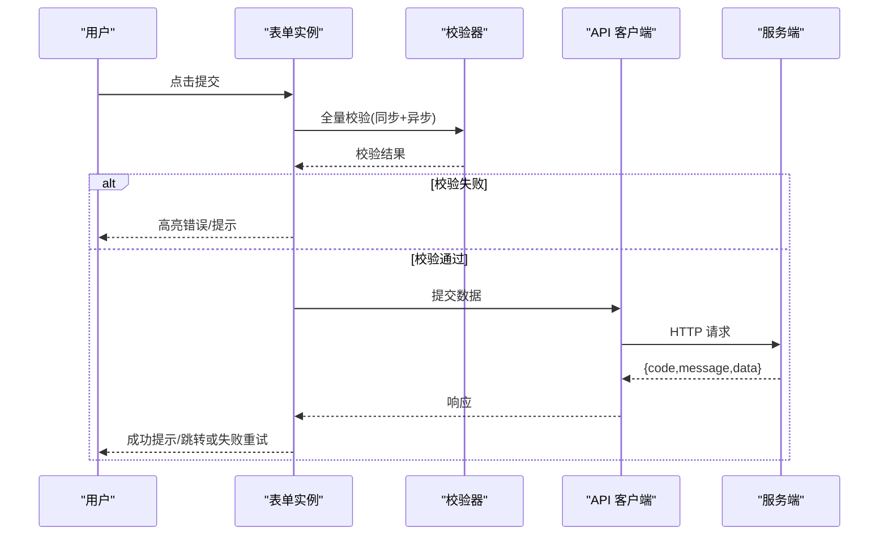
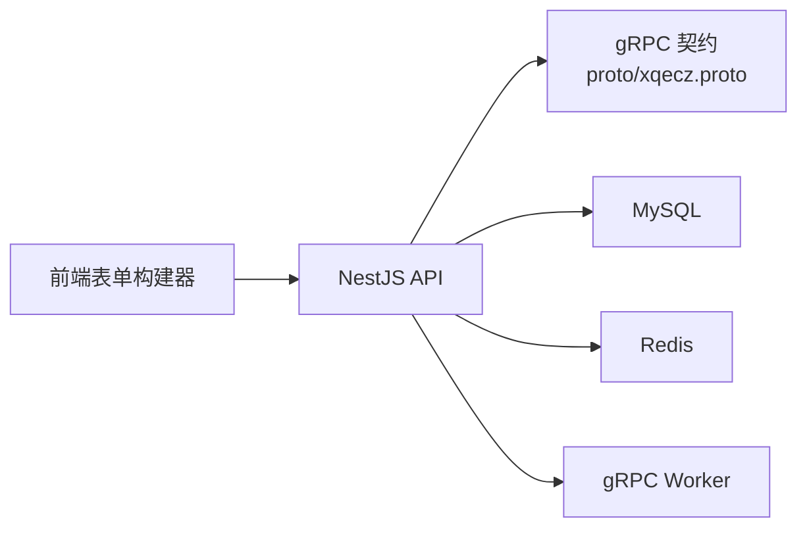

# 表单构建器组件

<cite>
**本文引用的文件**   
- [packages/frontend/src/api/index.ts](file://packages/frontend/src/api/index.ts)
- [proto/xqecz.proto](file://proto/xqecz.proto)
- [package.json](file://package.json)
- [pnpm-workspace.yaml](file://pnpm-workspace.yaml)
</cite>

## 目录
1. [简介](#简介)
2. [项目结构](#项目结构)
3. [核心组件](#核心组件)
4. [架构总览](#架构总览)
5. [详细组件分析](#详细组件分析)
6. [依赖关系分析](#依赖关系分析)
7. [性能考量](#性能考量)
8. [故障排查指南](#故障排查指南)
9. [结论](#结论)
10. [附录](#附录)

## 简介
本文件面向 xqecz 平台的“表单构建器组件”，聚焦于动态表单字段生成、验证规则、错误处理、数据绑定与状态管理、提交流程，以及布局配置、字段依赖、条件显示与动态验证。文档同时给出内容编辑、用户管理、系统配置等典型场景的使用示例与自定义开发指南，帮助开发者快速落地并扩展表单能力。

## 项目结构
xqecz 为 monorepo，前端位于 packages/frontend，API 契约由 proto/xqecz.proto 定义，前后端通过 NestJS API 与 gRPC Worker 协作。表单构建器作为前端核心能力之一，需遵循统一接口契约与响应格式 { code, message, data }。

图表来源
- [packages/frontend/src/api/index.ts](file://packages/frontend/src/api/index.ts)
- [proto/xqecz.proto](file://proto/xqecz.proto)

章节来源
- [packages/frontend/src/api/index.ts](file://packages/frontend/src/api/index.ts)
- [proto/xqecz.proto](file://proto/xqecz.proto)
- [package.json](file://package.json)
- [pnpm-workspace.yaml](file://pnpm-workspace.yaml)

## 核心组件
- 动态字段渲染引擎：根据字段元数据（schema）动态生成文本输入、数字输入、下拉选择、日期选择、文件上传、富文本编辑器等控件。
- 校验与错误处理：内置必填、格式、自定义与异步校验；统一错误聚合与展示。
- 数据绑定与状态管理：双向绑定、脏检查、受控与非受控模式、撤销/重做（可选）。
- 布局与条件逻辑：栅格/分栏布局、字段依赖、条件显示、联动更新。
- 提交与集成：表单序列化、批量校验、防抖提交、失败重试、进度反馈。

章节来源
- [packages/frontend/src/api/index.ts](file://packages/frontend/src/api/index.ts)

## 架构总览
表单构建器在前后端交互中的位置如下：前端通过统一的 API 层发起请求，后端返回标准包装体；复杂计算或外部依赖通过 gRPC 调用 Worker，结果回写缓存或数据库。

图表来源
- [packages/frontend/src/api/index.ts](file://packages/frontend/src/api/index.ts)
- [proto/xqecz.proto](file://proto/xqecz.proto)

## 详细组件分析

### 动态字段生成
- 文本输入：支持占位符、只读、禁用、字数限制、正则校验。
- 数字输入：支持范围、步长、千分位格式化、精度控制。
- 下拉选择：单选/多选、远程搜索、分组、禁用项。
- 日期选择：日期/时间/区间、时区、禁用范围、快捷选项。
- 文件上传：单/多文件、拖拽、预览、大小/类型限制、断点续传（可选）、进度条。
- 富文本编辑：工具栏定制、图片/附件插入、内容清洗、字数统计。

实现要点
- 字段元数据驱动渲染：type、label、placeholder、rules、options、layout、visibleIf、dependencies 等。
- 组件注册表：按 type 映射到具体组件，便于扩展新控件。
- 事件总线：onChange/onBlur/onFocus 统一派发，驱动校验与联动。

章节来源
- [packages/frontend/src/api/index.ts](file://packages/frontend/src/api/index.ts)

### 表单验证规则与错误处理
- 必填验证：required、message。
- 格式验证：email、url、phone、regex、minLength/maxLength、min/max。
- 自定义验证：函数式校验，支持上下文参数。
- 异步验证：网络查询（如用户名唯一性），带防抖与取消令牌。
- 错误聚合：按字段收集错误，顶部/行内/气泡提示，国际化支持。

流程图（校验与错误处理）

图表来源
- [packages/frontend/src/api/index.ts](file://packages/frontend/src/api/index.ts)

章节来源
- [packages/frontend/src/api/index.ts](file://packages/frontend/src/api/index.ts)

### 数据绑定、状态管理与提交流程
- 数据绑定：受控组件模式，value + onChange；非受控用于大文件或富文本优化。
- 状态管理：局部状态 + 全局 store（可选），支持快照、撤销/重做。
- 提交流程：序列化 -> 校验 -> 防抖/节流 -> 发送请求 -> 统一响应处理 -> 成功回调/失败重试/错误提示。

序列图（提交流程）

图表来源
- [packages/frontend/src/api/index.ts](file://packages/frontend/src/api/index.ts)

章节来源
- [packages/frontend/src/api/index.ts](file://packages/frontend/src/api/index.ts)

### 布局配置、字段依赖、条件显示与动态验证
- 布局：栅格列数、分栏、标签对齐、间距、响应式。
- 依赖与联动：字段 A 变化影响字段 B/C 的值、可见性、禁用态、校验规则。
- 条件显示：visibleIf 表达式，支持布尔、枚举、范围判断。
- 动态验证：根据上下文动态生成 rules，支持跨字段联合校验。

章节来源
- [packages/frontend/src/api/index.ts](file://packages/frontend/src/api/index.ts)

### 使用示例与管理场景

#### 内容编辑表单
- 字段：标题、封面图、分类、正文（富文本）、标签、发布时间。
- 校验：标题必填、正文长度限制、发布时间合法。
- 联动：选择分类后动态加载子分类；发布状态影响按钮文案。
- 提交：草稿保存与正式发布两条路径。

章节来源
- [packages/frontend/src/api/index.ts](file://packages/frontend/src/api/index.ts)

#### 用户管理表单
- 字段：用户名、邮箱、手机号、角色、状态、备注。
- 校验：用户名唯一（异步）、邮箱/手机号格式、角色必选。
- 联动：角色变化影响权限字段可见性。
- 提交：新增/编辑复用同一表单，差异在于路由与初始数据。

章节来源
- [packages/frontend/src/api/index.ts](file://packages/frontend/src/api/index.ts)

#### 系统配置表单
- 字段：站点名称、上传限制、第三方服务开关、缓存策略。
- 校验：数值范围、开关互斥、URL 格式。
- 联动：开启某服务后显示对应密钥字段。
- 提交：分批保存，失败可部分回滚。

章节来源
- [packages/frontend/src/api/index.ts](file://packages/frontend/src/api/index.ts)

### 自定义开发指南
- 新增字段类型：在组件注册表中添加映射，实现最小可用组件（value、onChange、校验）。
- 扩展校验规则：注册自定义规则，支持同步/异步，提供默认消息。
- 主题与样式：通过 CSS 变量或主题对象覆盖默认样式。
- 国际化：字段 label/message 支持 i18n key。
- 性能优化：大表单虚拟滚动、懒加载字段、异步校验去抖与取消。

章节来源
- [packages/frontend/src/api/index.ts](file://packages/frontend/src/api/index.ts)

## 依赖关系分析
- 前端依赖：统一 API 客户端、状态管理库（可选）、富文本编辑器、文件上传组件。
- 后端依赖：NestJS 提供 REST/gRPC 代理；gRPC Worker 负责纯计算任务。
- 协议：proto/xqecz.proto 定义 gRPC 方法；API 响应统一 { code, message, data }。

图表来源
- [packages/frontend/src/api/index.ts](file://packages/frontend/src/api/index.ts)
- [proto/xqecz.proto](file://proto/xqecz.proto)

章节来源
- [packages/frontend/src/api/index.ts](file://packages/frontend/src/api/index.ts)
- [proto/xqecz.proto](file://proto/xqecz.proto)

## 性能考量
- 校验优化：同步校验优先，异步校验去抖与取消；必要时分页/延迟加载字段。
- 渲染优化：大表单虚拟列表、按需渲染、避免不必要的重渲染。
- 网络优化：合并请求、缓存热点数据、失败重试与退避。
- 内存优化：及时释放大文件临时对象、富文本内容增量更新。

[本节为通用指导，无需特定文件引用]

## 故障排查指南
- 常见错误
  - 校验不通过：检查 rules 配置与字段值类型；查看控制台错误信息。
  - 异步校验卡住：确认取消令牌与去抖设置；检查后端接口可用性。
  - 文件上传失败：检查文件大小/类型限制、网络超时、服务端限流。
  - 富文本内容丢失：检查内容清洗策略与存储编码。
- 定位步骤
  - 打开浏览器 Network 面板，观察请求与响应 { code, message, data }。
  - 在表单实例上打印当前值与校验状态，确认数据绑定是否正确。
  - 对关键校验规则增加日志，定位问题分支。
- 降级策略
  - 外部依赖缺失时，表单应降级为基本功能可用，错误以友好提示展示。

章节来源
- [packages/frontend/src/api/index.ts](file://packages/frontend/src/api/index.ts)

## 结论
表单构建器以 schema 驱动为核心，结合完善的校验体系与统一 API 契约，能够高效支撑内容编辑、用户管理、系统配置等多样场景。通过组件注册、规则扩展与主题定制，可在保持一致体验的同时满足个性化需求。建议在生产环境启用异步校验去抖、失败重试与监控埋点，以提升稳定性与可观测性。

[本节为总结，无需特定文件引用]

## 附录

### 运行与部署要点
- 本地开发：pnpm dev 启动 NestJS API(:3000)、Go Worker(:50051)、Vite 前端(:5173)。
- 生产模式：pnpm start 一键构建与运行。
- 环境变量：UPLOAD_DIR 统一配置上传目录；worker 启动时自动读取 .env。

章节来源
- [package.json](file://package.json)
- [pnpm-workspace.yaml](file://pnpm-workspace.yaml)

### 接口契约与响应格式
- 统一响应：{ code, message, data }。
- gRPC：方法定义见 proto/xqecz.proto；NestJS 客户端 keepCase:true，字段 snake_case。

章节来源
- [packages/frontend/src/api/index.ts](file://packages/frontend/src/api/index.ts)
- [proto/xqecz.proto](file://proto/xqecz.proto)