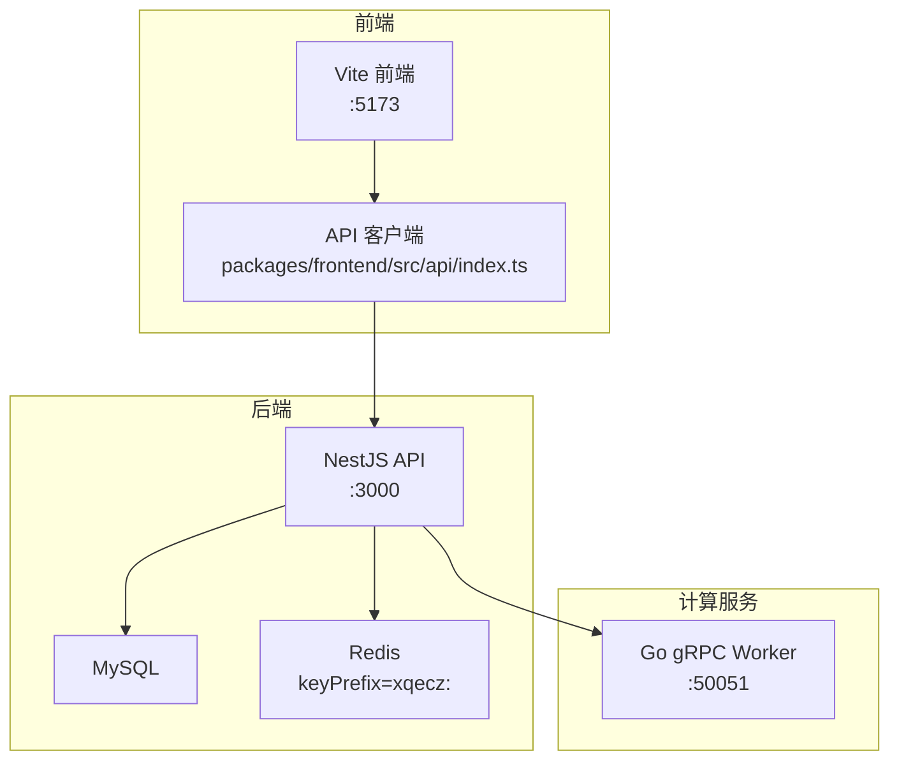
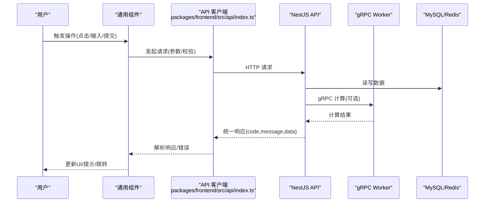
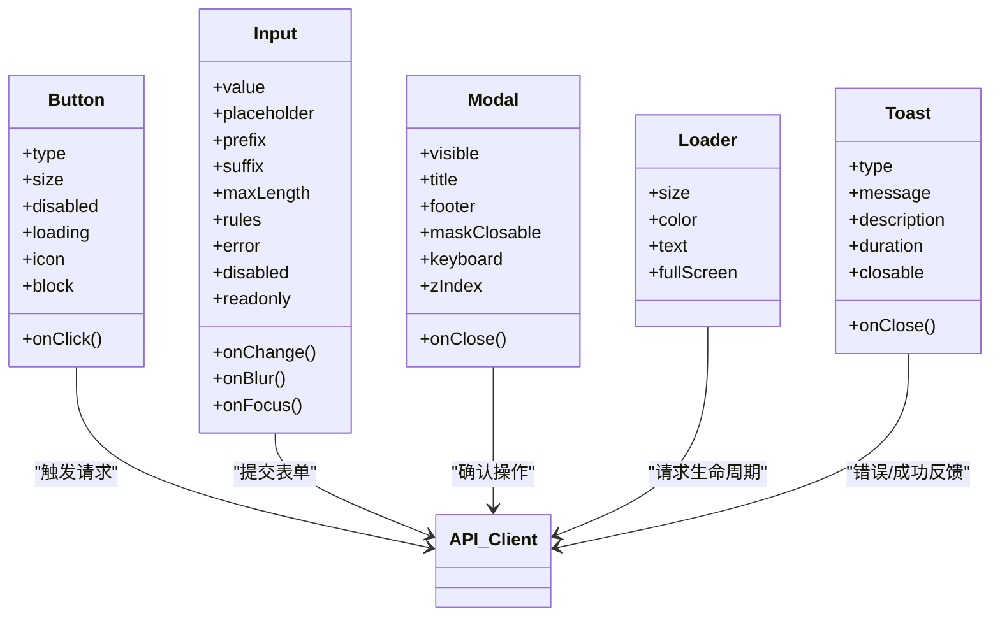
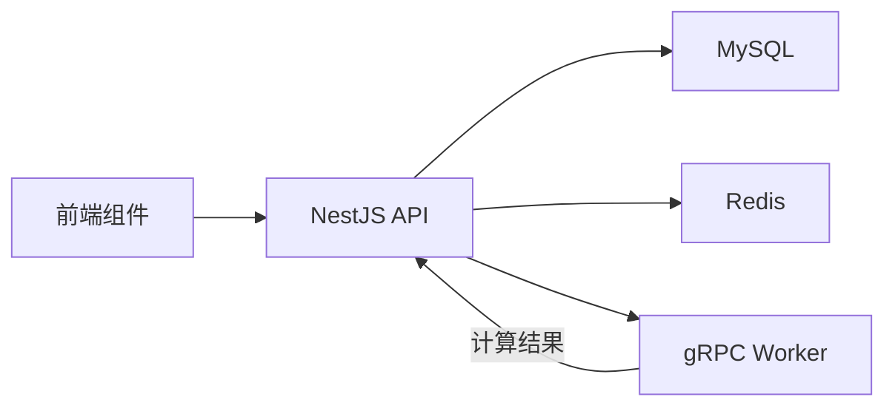

# 通用组件

<cite>
**本文引用的文件**   
- [packages/frontend/src/api/index.ts](file://packages/frontend/src/api/index.ts)
- [proto/xqecz.proto](file://proto/xqecz.proto)
- [scripts/run-worker.mjs](file://scripts/run-worker.mjs)
- [package.json](file://package.json)
- [pnpm-workspace.yaml](file://pnpm-workspace.yaml)
</cite>

## 目录
1. [简介](#简介)
2. [项目结构](#项目结构)
3. [核心组件](#核心组件)
4. [架构总览](#架构总览)
5. [详细组件分析](#详细组件分析)
6. [依赖分析](#依赖分析)
7. [性能考虑](#性能考虑)
8. [故障排查指南](#故障排查指南)
9. [结论](#结论)
10. [附录](#附录)

## 简介
本文件为 xqecz 平台的“通用组件”文档，聚焦前端基础 UI 组件的设计原则与实现方式，覆盖按钮、输入框、模态框、加载指示器、错误提示等常见交互组件。文档从接口契约、事件处理、样式定制、可访问性、响应式与跨浏览器兼容性出发，给出使用示例、最佳实践与性能优化建议，并说明主题系统与样式覆盖方法、自定义扩展指南。

xqecz 平台定位为二次创作内容社区（图片、视频、图文、链接），包含评论、投票与管理后台。前端通过 Vite 开发，统一通过 packages/frontend/src/api/index.ts 与 NestJS API 通信；后端与 gRPC Worker 的契约定义在 proto/xqecz.proto。所有删除均为软删除，外部依赖缺失时一律降级。

## 项目结构
- monorepo 使用 pnpm workspace，前后端与 worker 同仓管理。
- 前端入口与 API 契约集中在 packages/frontend/src/api/index.ts，作为前后端唯一接口契约。
- gRPC 契约定义在 proto/xqecz.proto，NestJS 客户端启用 keepCase:true，字段采用 snake_case。
- 启动方式：pnpm dev 同时启动 NestJS API(:3000)、Go Worker(:50051)、Vite 前端(:5173)。生产模式使用 pnpm start 一键构建+运行。
- 共享上传目录由 UPLOAD_DIR 环境变量约定，单一配置源为 packages/api/.env；worker 经 scripts/run-worker.mjs 启动时自动读取同一 .env 注入，文件路径经 gRPC 以绝对路径传递。

图表来源
- [packages/frontend/src/api/index.ts](file://packages/frontend/src/api/index.ts)
- [proto/xqecz.proto](file://proto/xqecz.proto)
- [scripts/run-worker.mjs](file://scripts/run-worker.mjs)

章节来源
- [package.json](file://package.json)
- [pnpm-workspace.yaml](file://pnpm-workspace.yaml)
- [packages/frontend/src/api/index.ts](file://packages/frontend/src/api/index.ts)
- [proto/xqecz.proto](file://proto/xqecz.proto)
- [scripts/run-worker.mjs](file://scripts/run-worker.mjs)

## 核心组件
本节概述通用组件的设计原则与实现要点，确保一致的用户体验与可维护性。

- 设计原则
  - 语义化与可访问性优先：遵循 ARIA 规范，提供键盘导航、焦点管理与屏幕阅读器支持。
  - 组合优于继承：通过插槽/子组件组合实现复杂布局，避免深层继承链。
  - 受控与非受控双模式：输入类组件同时支持受控与非受控用法，便于灵活集成。
  - 主题驱动：基于 CSS 变量或主题对象驱动样式，保证多主题一致性。
  - 渐进增强与降级：对外部依赖缺失进行降级处理，保证基本可用性。

- 通用交互模式
  - 按钮：主操作、次要操作、危险操作、禁用态、加载态、尺寸与图标变体。
  - 输入框：文本、密码、数字、搜索、带前缀/后缀、校验反馈、字数限制。
  - 模态框：对话框、抽屉、全屏面板；支持遮罩、滚动锁定、ESC 关闭、焦点陷阱。
  - 加载指示器：全局与局部加载，骨架屏替代长耗时渲染。
  - 错误提示：Toast、Inline 错误、Banner 通知；支持自动消失与手动关闭。

- 事件处理机制
  - 标准化事件命名：onClick、onChange、onSubmit、onClose、onError 等。
  - 受控组件回调：value + onChange 成对出现，避免状态不一致。
  - 异步流程：提交前校验、防抖节流、取消请求、重试策略。

- 样式定制选项
  - 主题变量：颜色、字号、间距、圆角、阴影、动画时长。
  - 覆盖策略：CSS 变量覆盖 > 主题对象覆盖 > 组件 className 覆盖。
  - 响应式：移动端优先，断点统一，栅格系统配合。

- 可访问性与兼容性
  - 键盘可达、焦点可见、对比度达标、ARIA 标签完整。
  - 兼容主流现代浏览器，针对旧版浏览器提供降级方案。

章节来源
- [packages/frontend/src/api/index.ts](file://packages/frontend/src/api/index.ts)

## 架构总览
通用组件位于前端层，通过 API 客户端与 NestJS 交互，必要时调用 gRPC Worker 完成纯计算任务。组件层不直接访问数据库或缓存，仅消费 API 返回的统一格式 { code, message, data }。

图表来源
- [packages/frontend/src/api/index.ts](file://packages/frontend/src/api/index.ts)
- [proto/xqecz.proto](file://proto/xqecz.proto)

章节来源
- [packages/frontend/src/api/index.ts](file://packages/frontend/src/api/index.ts)
- [proto/xqecz.proto](file://proto/xqecz.proto)

## 详细组件分析

### 按钮组件
- 职责：承载主要交互动作，支持多种形态与状态。
- Props 接口
  - type: 主类型/次要/危险/幽灵
  - size: 大/中/小
  - disabled: 是否禁用
  - loading: 是否显示加载态
  - icon: 前置/后置图标
  - block: 是否全宽
  - onClick: 点击回调
  - className/style: 样式覆盖
- 事件处理
  - 点击前校验、防重复提交、loading 态控制。
- 样式定制
  - 主题色、尺寸、圆角、阴影、禁用态透明度。
- 可访问性
  - role="button"、tabIndex、aria-disabled、aria-busy。
- 使用示例
  - 主操作按钮：type=primary、size=medium、icon=submit、onClick=handleSubmit。
  - 危险操作按钮：type=danger、loading={isDeleting}。
- 最佳实践
  - 避免在同一行放置过多主按钮；确认类操作需二次确认。
- 性能优化
  - 使用 React.memo 包裹；避免频繁 re-render。

章节来源
- [packages/frontend/src/api/index.ts](file://packages/frontend/src/api/index.ts)

### 输入框组件
- 职责：接收用户输入，提供校验与反馈。
- Props 接口
  - value: 当前值
  - onChange: 值变化回调
  - placeholder: 占位符
  - prefix/suffix: 前后缀元素
  - maxLength: 最大长度
  - rules: 校验规则数组
  - error: 错误信息
  - disabled/readonly: 禁用/只读
  - onBlur/onFocus: 失焦/聚焦回调
  - className/style: 样式覆盖
- 事件处理
  - 受控模式：value + onChange；非受控模式：defaultValue + ref。
  - 实时校验与延迟提交结合。
- 样式定制
  - 边框、聚焦高亮、错误红色、前缀/后缀样式。
- 可访问性
  - aria-invalid、aria-describedby、aria-required。
- 使用示例
  - 搜索输入：prefix=searchIcon、onSearch=handleSearch。
  - 密码输入：type=password、showPasswordToggle。
- 最佳实践
  - 输入过滤与格式化在 onChange 中统一处理；避免在渲染中执行重计算。
- 性能优化
  - 防抖输入；useMemo 缓存校验结果。

章节来源
- [packages/frontend/src/api/index.ts](file://packages/frontend/src/api/index.ts)

### 模态框组件
- 职责：弹窗展示重要信息或收集关键操作。
- Props 接口
  - visible: 是否显示
  - onClose: 关闭回调
  - title: 标题
  - footer: 底部操作区
  - maskClosable: 点击遮罩关闭
  - keyboard: ESC 关闭
  - zIndex: 层级
  - className/style: 样式覆盖
- 事件处理
  - 焦点陷阱、滚动锁定、Esc 关闭、遮罩点击关闭。
- 样式定制
  - 尺寸、圆角、阴影、动画过渡。
- 可访问性
  - role="dialog"、aria-modal、aria-labelledby、aria-describedby。
- 使用示例
  - 确认删除：title=确认删除、footer=[取消, 确定]。
  - 表单弹窗：visible={formVisible}、onClose={() => setFormVisible(false)}。
- 最佳实践
  - 避免嵌套模态框；长内容使用滚动容器。
- 性能优化
  - 懒渲染内容；避免在 modal 内执行重型计算。

章节来源
- [packages/frontend/src/api/index.ts](file://packages/frontend/src/api/index.ts)

### 加载指示器组件
- 职责：反馈异步操作的进行中状态。
- Props 接口
  - size: 大小
  - color: 颜色
  - text: 文案
  - fullScreen: 全屏覆盖
  - className/style: 样式覆盖
- 事件处理
  - 无交互事件，通常与请求生命周期绑定。
- 样式定制
  - 旋转动画、骨架屏占位。
- 可访问性
  - role="progressbar"、aria-busy、aria-label。
- 使用示例
  - 局部加载：包裹列表区域；全局加载：页面级遮罩。
- 最佳实践
  - 区分“加载中”和“空状态”；避免长时间无反馈。
- 性能优化
  - 最小化重绘；骨架屏提升感知性能。

章节来源
- [packages/frontend/src/api/index.ts](file://packages/frontend/src/api/index.ts)

### 错误提示组件
- 职责：向用户反馈错误与异常信息。
- Props 接口
  - type: 错误/警告/成功/信息
  - message: 标题
  - description: 详细描述
  - duration: 自动消失时间
  - closable: 可关闭
  - onClose: 关闭回调
  - className/style: 样式覆盖
- 事件处理
  - 自动消失、手动关闭、重试操作。
- 样式定制
  - 颜色主题、图标、位置（顶部/底部/居中）。
- 可访问性
  - role="alert"、aria-live、aria-atomic。
- 使用示例
  - 网络错误：type=error、message=请求失败、description=请检查网络。
  - 业务错误：根据 API 返回的 message 动态展示。
- 最佳实践
  - 错误信息具体且可操作；避免堆叠过多提示。
- 性能优化
  - 去抖提示；合并同类错误。

章节来源
- [packages/frontend/src/api/index.ts](file://packages/frontend/src/api/index.ts)

### 组件间关系与数据流

图表来源
- [packages/frontend/src/api/index.ts](file://packages/frontend/src/api/index.ts)

## 依赖分析
- 前端依赖
  - Vite 构建工具、React/Vue（视框架而定）、HTTP 客户端（如 axios/fetch）。
  - 样式方案：CSS 变量、CSS Modules、Tailwind 或 styled-components（依项目选择）。
- 后端依赖
  - NestJS API 连接 MySQL/Redis；gRPC 客户端连接 Go Worker。
- gRPC 契约
  - 字段命名 snake_case；keepCase:true；错误统一 success=false + error 文本。
- 环境变量
  - UPLOAD_DIR 统一配置上传目录；.env 被 api 与 worker 共享读取。

图表来源
- [packages/frontend/src/api/index.ts](file://packages/frontend/src/api/index.ts)
- [proto/xqecz.proto](file://proto/xqecz.proto)
- [scripts/run-worker.mjs](file://scripts/run-worker.mjs)

章节来源
- [packages/frontend/src/api/index.ts](file://packages/frontend/src/api/index.ts)
- [proto/xqecz.proto](file://proto/xqecz.proto)
- [scripts/run-worker.mjs](file://scripts/run-worker.mjs)

## 性能考虑
- 组件渲染
  - 使用 React.memo/useMemo/useCallback 减少不必要重渲染。
  - 列表虚拟化（虚拟滚动）处理大数据集。
- 网络请求
  - 请求去重、缓存策略（内存/本地存储）、超时与重试。
  - 分页与增量加载，避免一次性拉取大量数据。
- 样式与主题
  - 主题切换避免全量重绘；按需加载样式。
- 资源优化
  - 图片懒加载、压缩与 WebP；字体子集化。
- 可访问性
  - 减少不必要的 aria 属性；保持语义正确。

[本节为通用指导，无需特定文件引用]

## 故障排查指南
- 常见问题
  - API 响应格式不一致：检查 { code, message, data } 包装与错误码。
  - gRPC 调用失败：确认 Worker 端口、keepCase 与字段命名。
  - 上传失败：检查 UPLOAD_DIR 权限与环境变量注入。
  - 模态框焦点丢失：验证焦点陷阱与 tabindex 设置。
  - 输入校验不生效：确认受控模式与 onChange 绑定。
- 调试步骤
  - 打开浏览器开发者工具，查看 Network 与 Console。
  - 打印 API 请求/响应，核对字段与错误信息。
  - 检查 .env 配置与 Worker 日志。
- 降级策略
  - 外部依赖缺失时回退到默认行为（如离线模式、本地缓存）。
  - gRPC 失败时返回 success=false 与错误文本，前端友好提示。

章节来源
- [packages/frontend/src/api/index.ts](file://packages/frontend/src/api/index.ts)
- [proto/xqecz.proto](file://proto/xqecz.proto)
- [scripts/run-worker.mjs](file://scripts/run-worker.mjs)

## 结论
通用组件是 xqecz 前端体验的核心基石。通过统一的接口契约、事件模型、主题系统与可访问性规范，组件在不同场景下保持一致性与可维护性。结合性能优化与降级策略，可在复杂业务中稳定交付高质量交互。建议团队在新增组件时严格遵循本文档的设计原则与最佳实践，确保整体用户体验与工程效率。

[本节为总结性内容，无需特定文件引用]

## 附录
- 启动与部署
  - 开发：pnpm dev（NestJS :3000、Worker :50051、Vite :5173）。
  - 生产：pnpm start（一键构建+运行）。
- 环境变量
  - UPLOAD_DIR：共享上传目录，api 与 worker 共享读取。
- 接口契约
  - 统一响应：{ code, message, data }。
  - gRPC：snake_case 字段，keepCase:true。

章节来源
- [package.json](file://package.json)
- [pnpm-workspace.yaml](file://pnpm-workspace.yaml)
- [packages/frontend/src/api/index.ts](file://packages/frontend/src/api/index.ts)
- [proto/xqecz.proto](file://proto/xqecz.proto)
- [scripts/run-worker.mjs](file://scripts/run-worker.mjs)