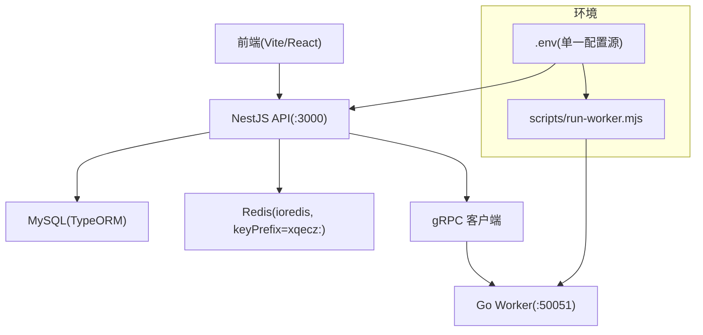
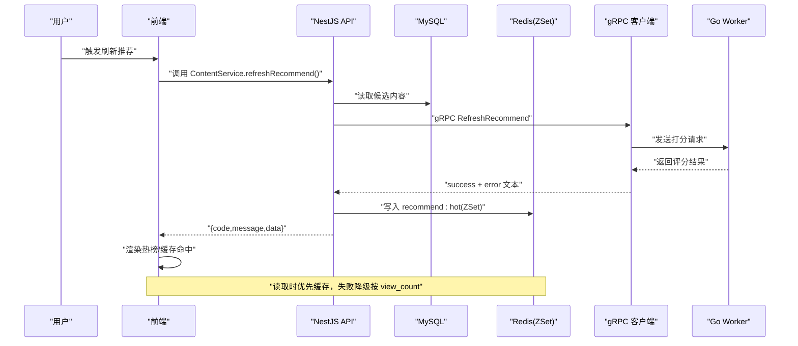
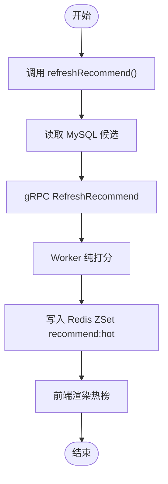
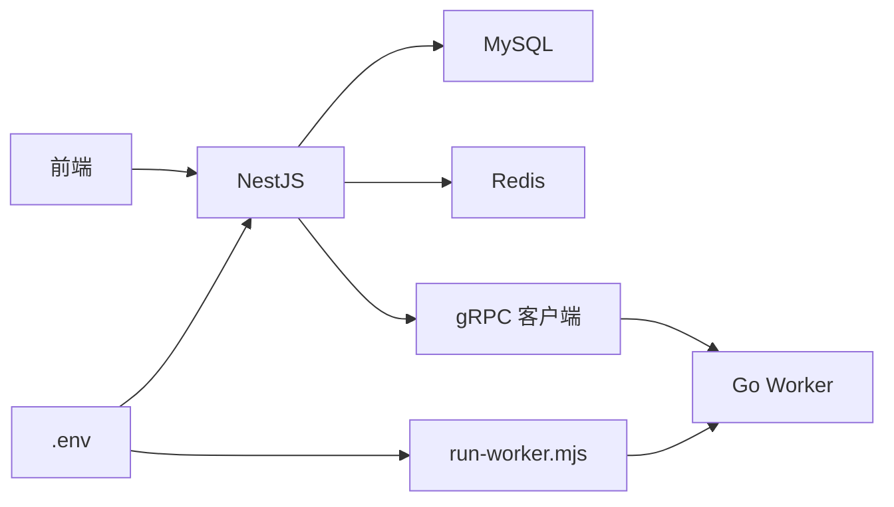

# 状态管理

<cite>
**本文引用的文件**   
- [packages/frontend/src/api/index.ts](file://packages/frontend/src/api/index.ts)
- [proto/xqecz.proto](file://proto/xqecz.proto)
- [scripts/run-worker.mjs](file://scripts/run-worker.mjs)
- [package.json](file://package.json)
- [pnpm-workspace.yaml](file://pnpm-workspace.yaml)
</cite>

## 目录
1. [简介](#简介)
2. [项目结构](#项目结构)
3. [核心组件](#核心组件)
4. [架构总览](#架构总览)
5. [详细组件分析](#详细组件分析)
6. [依赖分析](#依赖分析)
7. [性能考虑](#性能考虑)
8. [故障排查指南](#故障排查指南)
9. [结论](#结论)
10. [附录](#附录)

## 简介
本文件面向 xqecz 平台的前端与整体系统，系统化阐述状态管理的架构设计与实践规范。内容覆盖全局状态、组件状态、表单状态的管理策略；React Context 的使用场景与最佳实践；自定义 hooks 的设计模式；状态持久化、缓存策略与数据同步机制；状态更新流程、副作用处理与异步操作管理；以及调试工具、性能监控与优化技巧。文档同时结合项目的运行方式（pnpm dev/start）、NestJS API、Go Worker gRPC 服务与统一 API 契约，给出端到端的状态流转说明与落地建议。

## 项目结构
xqecz 为 monorepo，前端位于 packages/frontend，API 由 NestJS 提供，Worker 为无状态 gRPC 计算服务。前端通过统一的 API 入口与后端交互，所有响应遵循 { code, message, data } 格式。Worker 的启动与环境注入由脚本统一管理，确保上传路径等关键配置一致。

图表来源
- [package.json](file://package.json)
- [pnpm-workspace.yaml](file://pnpm-workspace.yaml)
- [scripts/run-worker.mjs](file://scripts/run-worker.mjs)
- [proto/xqecz.proto](file://proto/xqecz.proto)

章节来源
- [package.json](file://package.json)
- [pnpm-workspace.yaml](file://pnpm-workspace.yaml)

## 核心组件
- 前端状态层
  - 全局状态：用户会话、权限、主题、语言、应用级开关等
  - 组件状态：页面局部 UI 状态、列表分页、筛选条件等
  - 表单状态：输入校验、提交中、错误提示、草稿缓存
- 数据访问层
  - 统一 API 封装：基于 packages/frontend/src/api/index.ts 的接口定义与响应解包
  - 缓存层：浏览器内存缓存、localStorage/sessionStorage、IndexedDB（大对象）
- 服务端状态
  - NestJS 负责 MySQL/Redis 读写
  - Go Worker 纯计算，结果回传后由 NestJS 落库或写缓存

章节来源
- [packages/frontend/src/api/index.ts](file://packages/frontend/src/api/index.ts)

## 架构总览
下图展示从前端到服务端的全链路状态流转，包括推荐刷新链路（读 MySQL → gRPC 打分 → 写 Redis ZSet → 读取降级）。

图表来源
- [packages/frontend/src/api/index.ts](file://packages/frontend/src/api/index.ts)
- [proto/xqecz.proto](file://proto/xqecz.proto)

## 详细组件分析

### 全局状态设计（Context + Provider）
- 适用场景
  - 跨层级共享且变更频率低的数据：用户信息、权限、主题、语言、功能开关
  - 需要订阅与批量更新的复杂状态：使用轻量 store（如 Zustand/Jotai）配合 Context 作为“桥”
- 设计要点
  - 将 Context 拆分为多个独立 Provider，避免不必要的重渲染
  - 使用 useReducer 或不可变更新函数保证可预测性
  - 对敏感数据做最小暴露（只暴露必要字段与方法）
- 与 API 集成
  - 在根 Provider 初始化时拉取用户信息与基础配置
  - 登录/登出时清理本地缓存并重置状态

章节来源
- [packages/frontend/src/api/index.ts](file://packages/frontend/src/api/index.ts)

### 组件状态与表单状态
- 组件状态
  - 使用 useState/useReducer 管理 UI 状态（展开/折叠、分页、筛选）
  - 列表数据采用“查询键 + 缓存”的模式，避免重复请求
- 表单状态
  - 受控组件 + 校验规则（如 zod/yup），提交前进行本地校验
  - 草稿自动保存到 localStorage，支持恢复
  - 提交中状态与错误提示分离，提升用户体验

章节来源
- [packages/frontend/src/api/index.ts](file://packages/frontend/src/api/index.ts)

### React Context 最佳实践
- 拆分上下文：UI 主题、用户、通知等分别独立
- 避免在高频更新路径上放置 Context
- 使用选择器或派生状态减少重渲染
- 与 Suspense/懒加载结合，按需加载大型模块

章节来源
- [packages/frontend/src/api/index.ts](file://packages/frontend/src/api/index.ts)

### 自定义 Hooks 设计与实现模式
- 数据获取 Hook
  - 封装 useFetch/useQuery，统一错误处理、重试、缓存与取消
  - 与 API 入口对接，解析 { code, message, data }
- 表单 Hook
  - 封装 useForm，集中处理校验、提交、草稿、错误
- 副作用 Hook
  - 封装 useDebounce/useThrottle/useIntersectionObserver 等
- 与 gRPC/Worker 联动
  - 当需要长耗时计算时，通过 API 中转至 Worker，Hook 内处理轮询或 SSE/WebSocket

章节来源
- [packages/frontend/src/api/index.ts](file://packages/frontend/src/api/index.ts)

### 状态持久化、缓存策略与数据同步
- 持久化
  - 小量配置：localStorage/sessionStorage
  - 大对象/离线：IndexedDB
  - 敏感信息加密存储
- 缓存策略
  - 内存缓存：请求去重、短期缓存
  - 磁盘缓存：按资源类型设置过期时间
  - 失效策略：写扩散（更新时主动失效）+ 读扩散（按需刷新）
- 数据同步
  - 前后端一致性：乐观更新 + 冲突解决
  - 多标签页同步：BroadcastChannel/localStorage 事件
  - 与服务端增量同步：ETag/Last-Modified（若后端支持）

章节来源
- [packages/frontend/src/api/index.ts](file://packages/frontend/src/api/index.ts)

### 状态更新流程、副作用与异步管理
- 更新流程
  - 用户操作 → 表单校验 → 发起请求 → 乐观更新 → 成功后确认/失败回滚
- 副作用处理
  - 统一副作用入口（useEffect 组合或专用 Hook）
  - 清理逻辑：取消请求、移除监听、释放资源
- 异步管理
  - 统一错误边界与重试策略
  - 并发控制：限流、队列、优先级
  - 与 gRPC 协作：超时、重试、降级

章节来源
- [packages/frontend/src/api/index.ts](file://packages/frontend/src/api/index.ts)

### 推荐刷新链路（示例）

图表来源
- [packages/frontend/src/api/index.ts](file://packages/frontend/src/api/index.ts)
- [proto/xqecz.proto](file://proto/xqecz.proto)

## 依赖分析
- 前端依赖
  - 统一 API 入口：packages/frontend/src/api/index.ts
  - 运行时依赖：Vite、React、状态库（可选）
- 后端依赖
  - NestJS：TypeORM、ioredis、gRPC 客户端
  - Go Worker：无状态，接收参数、返回结果
- 配置与环境
  - 单一 .env 配置源，Worker 通过脚本注入环境变量
  - proto 定义 gRPC 契约，字段命名与大小写约定明确

图表来源
- [package.json](file://package.json)
- [pnpm-workspace.yaml](file://pnpm-workspace.yaml)
- [scripts/run-worker.mjs](file://scripts/run-worker.mjs)
- [proto/xqecz.proto](file://proto/xqecz.proto)

章节来源
- [package.json](file://package.json)
- [pnpm-workspace.yaml](file://pnpm-workspace.yaml)
- [scripts/run-worker.mjs](file://scripts/run-worker.mjs)
- [proto/xqecz.proto](file://proto/xqecz.proto)

## 性能考虑
- 前端
  - 减少 Context 重渲染：拆分 Provider、选择器、memo 化
  - 列表虚拟化、分页与懒加载
  - 请求去重与缓存命中率优化
  - 图片/媒体资源 CDN 与压缩
- 后端
  - Redis 热点 Key 保护与分片
  - gRPC 连接池与超时控制
  - 数据库索引与慢查询优化
- 监控
  - 前端：性能埋点、错误上报、首屏指标
  - 后端：QPS、延迟、错误率、缓存命中率

[本节为通用指导，不直接分析具体文件]

## 故障排查指南
- 常见问题
  - API 响应非预期：检查 { code, message, data } 解析与错误分支
  - gRPC 调用失败：确认 Worker 是否启动、端口与 .env 注入
  - 缓存不一致：清理缓存、强制刷新、检查失效策略
- 定位手段
  - 网络面板：请求/响应体、状态码、耗时
  - 控制台日志：统一日志输出与错误堆栈
  - 缓存查看：localStorage/IndexedDB/Redis CLI
- 降级策略
  - 外部依赖缺失时降级（如 Worker/Tinify/S3/FFmpeg）
  - gRPC 不抛 rpc error，返回 success=false + error 文本

章节来源
- [scripts/run-worker.mjs](file://scripts/run-worker.mjs)
- [proto/xqecz.proto](file://proto/xqecz.proto)
- [packages/frontend/src/api/index.ts](file://packages/frontend/src/api/index.ts)

## 结论
xqecz 的状态管理以“清晰分层、统一入口、可观测、可降级”为核心原则。前端通过 Context 与自定义 Hooks 组织状态，结合缓存与持久化保障体验；后端以 NestJS 为中心，协调 MySQL/Redis 与无状态 Worker，形成稳定高效的数据流水线。遵循本文档的模式与规范，可在保证性能与可维护性的同时，快速迭代业务功能。

[本节为总结性内容，不直接分析具体文件]

## 附录
- 开发规范
  - 统一 API 响应格式与错误处理
  - 状态命名与目录组织约定
  - 单元测试与集成测试覆盖关键路径
- 调试工具
  - React DevTools、Redux DevTools（如使用）
  - 浏览器缓存与网络面板
  - 后端日志与 APM（如 Sentry、Prometheus）

[本节为补充信息，不直接分析具体文件]