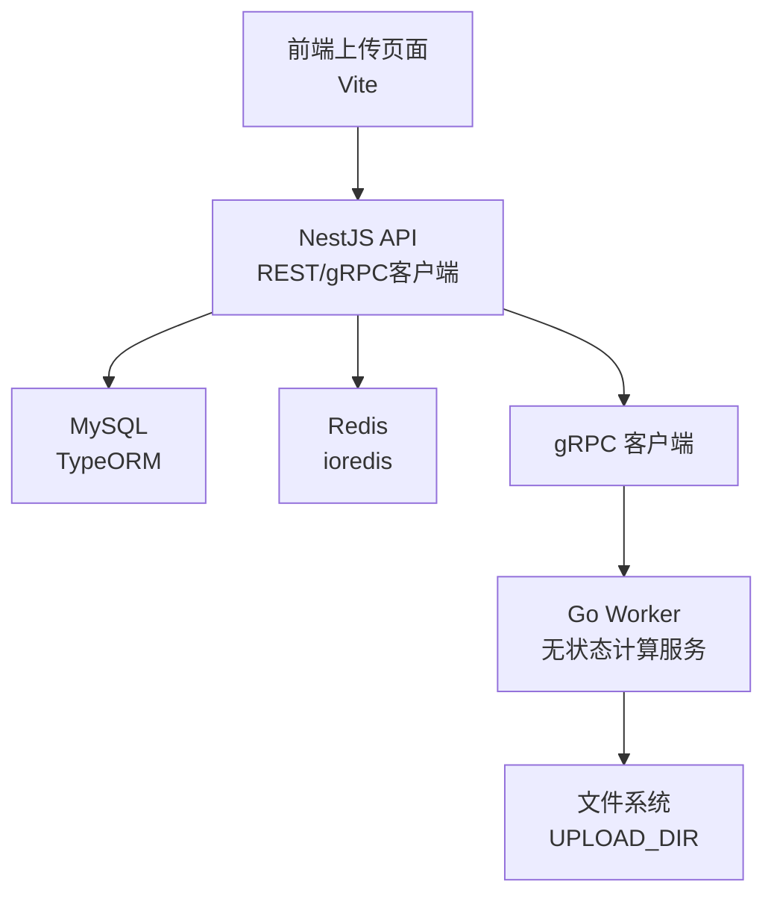
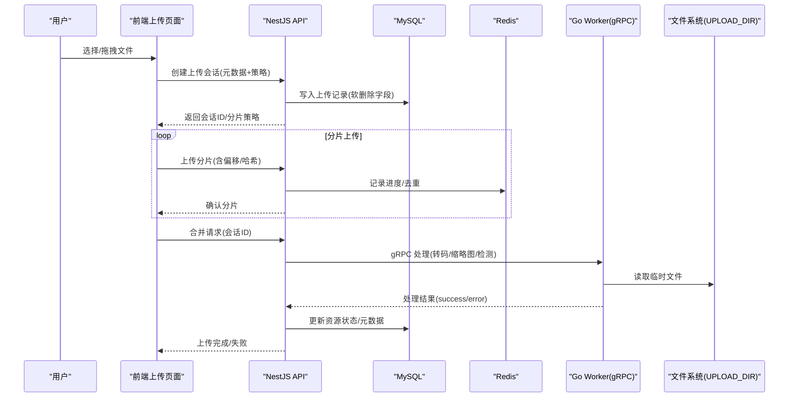
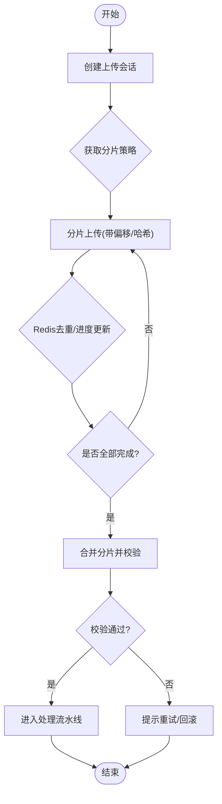
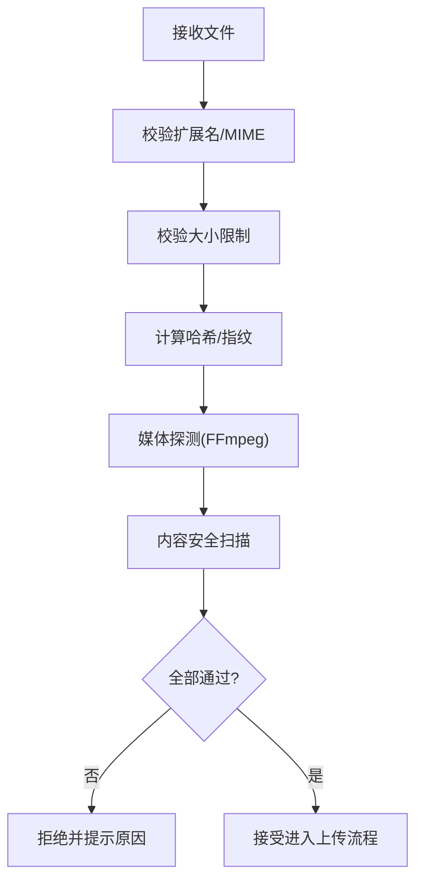
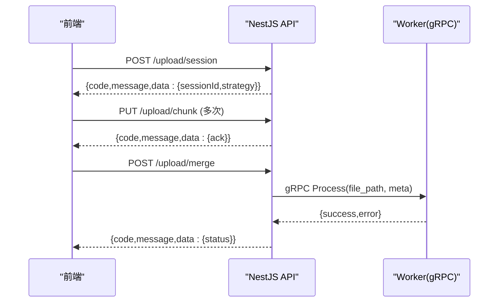
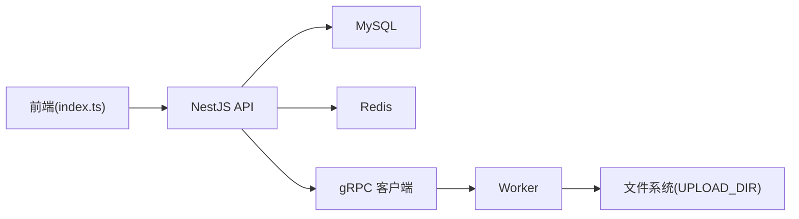

# 上传页面

<cite>
**本文引用的文件**   
- [packages/api/.env](file://packages/api/.env)
- [proto/xqecz.proto](file://proto/xqecz.proto)
- [scripts/run-worker.mjs](file://scripts/run-worker.mjs)
- [packages/frontend/src/api/index.ts](file://packages/frontend/src/api/index.ts)
</cite>

## 目录
1. [简介](#简介)
2. [项目结构](#项目结构)
3. [核心组件](#核心组件)
4. [架构总览](#架构总览)
5. [详细组件分析](#详细组件分析)
6. [依赖关系分析](#依赖关系分析)
7. [性能考量](#性能考量)
8. [故障排查指南](#故障排查指南)
9. [结论](#结论)
10. [附录](#附录)

## 简介
本文件为 xqecz 平台“上传页面”模块的技术文档，聚焦于多格式（图片、视频、文档）上传、拖拽与批量上传、进度显示、断点续传、预览与编辑、文件验证（格式/大小/内容安全）、标签与分类选择、元数据管理、失败重试与网络异常处理、与后端 API 的交互流程及错误处理机制，以及文件存储路径管理与环境变量配置。

## 项目结构
xqecz 采用 monorepo 组织：前端（Vite）、API（NestJS）、计算 Worker（Go gRPC）三者协作。上传页面的关键实现涉及：
- 前端：上传 UI、校验、预览、分片与进度、与 API 交互
- API：统一接口契约、鉴权、参数校验、调用 gRPC Worker、落库与缓存
- Worker：无状态计算服务，接收绝对路径进行转码/缩略图/内容检测等
- 配置与环境：统一通过 packages/api/.env 注入，Worker 启动脚本自动读取

图表来源
- [packages/frontend/src/api/index.ts](file://packages/frontend/src/api/index.ts)
- [proto/xqecz.proto](file://proto/xqecz.proto)
- [scripts/run-worker.mjs](file://scripts/run-worker.mjs)
- [packages/api/.env](file://packages/api/.env)

章节来源
- [packages/frontend/src/api/index.ts](file://packages/frontend/src/api/index.ts)
- [proto/xqecz.proto](file://proto/xqecz.proto)
- [scripts/run-worker.mjs](file://scripts/run-worker.mjs)
- [packages/api/.env](file://packages/api/.env)

## 核心组件
- 上传 UI 与交互
  - 支持拖拽区域、点击选择、批量选择
  - 实时进度条、分片上传、断点续传
  - 图片/视频预览、基础编辑（裁剪、旋转、封面帧提取）
- 文件验证
  - 格式白名单（图片/视频/文档扩展名与 MIME）
  - 大小限制（单文件与总量）
  - 内容安全检测（哈希、敏感信息扫描、FFmpeg 探测）
- 标签与分类、元数据
  - 标签输入/建议、分类下拉/树形选择
  - 标题、描述、封面、语言、版权、可见性等元数据
- 错误处理与重试
  - 网络异常重试、指数退避、队列化重试
  - 用户可感知失败原因与一键重试
- 与后端交互
  - 统一响应 { code, message, data }
  - 上传会话创建、分片上传、合并、完成回调
  - gRPC 任务下发与结果回传

章节来源
- [packages/frontend/src/api/index.ts](file://packages/frontend/src/api/index.ts)
- [proto/xqecz.proto](file://proto/xqecz.proto)
- [scripts/run-worker.mjs](file://scripts/run-worker.mjs)
- [packages/api/.env](file://packages/api/.env)

## 架构总览
上传链路遵循“前端 → NestJS API → gRPC Worker → 文件系统/外部工具”的分层设计。API 独占数据库与缓存；Worker 仅做计算，不直连数据库。

图表来源
- [packages/frontend/src/api/index.ts](file://packages/frontend/src/api/index.ts)
- [proto/xqecz.proto](file://proto/xqecz.proto)
- [scripts/run-worker.mjs](file://scripts/run-worker.mjs)
- [packages/api/.env](file://packages/api/.env)

## 详细组件分析

### 上传会话与分片上传
- 会话创建：前端提交初始元数据（文件名、类型、大小、MD5），后端生成会话 ID 并返回分片策略（大小、并发、超时）。
- 分片上传：按偏移与哈希上传，后端基于 Redis 去重与进度聚合，避免重复传输。
- 合并与校验：所有分片完成后触发合并，校验完整性后进入处理流水线。
- 断点续传：利用分片索引与已上传集合恢复中断任务。

图表来源
- [packages/frontend/src/api/index.ts](file://packages/frontend/src/api/index.ts)
- [packages/api/.env](file://packages/api/.env)

章节来源
- [packages/frontend/src/api/index.ts](file://packages/frontend/src/api/index.ts)
- [packages/api/.env](file://packages/api/.env)

### 文件验证逻辑
- 格式检查：基于扩展名与 MIME 类型白名单，拒绝非法类型。
- 大小限制：单文件大小上限与批量总量上限，超限即拦截。
- 内容安全：
  - 哈希指纹用于去重与快速比对
  - FFmpeg 探测媒体时长/分辨率/编码
  - 可选敏感内容扫描（如 NSFW 模型或规则）
- 校验失败：前端即时反馈，后端记录审计日志并拒绝后续处理。

图表来源
- [packages/frontend/src/api/index.ts](file://packages/frontend/src/api/index.ts)
- [scripts/run-worker.mjs](file://scripts/run-worker.mjs)

章节来源
- [packages/frontend/src/api/index.ts](file://packages/frontend/src/api/index.ts)
- [scripts/run-worker.mjs](file://scripts/run-worker.mjs)

### 预览与编辑
- 图片预览：本地生成缩略图与预览图，支持旋转、裁剪、滤镜。
- 视频预览：首帧截图作为封面，支持截取片段预览。
- 编辑能力：轻量级编辑在前端完成，最终产物随分片上传。
- 性能优化：大文件使用 Blob 切片与 OffscreenCanvas/WebCodecs（按需）。

章节来源
- [packages/frontend/src/api/index.ts](file://packages/frontend/src/api/index.ts)

### 标签系统、分类与元数据
- 标签：支持输入联想、常用标签、批量添加/移除。
- 分类：树形分类选择，支持多选与默认分类。
- 元数据：标题、描述、语言、版权、可见性、封面图等。
- 校验：必填项校验、长度限制、敏感词过滤。

章节来源
- [packages/frontend/src/api/index.ts](file://packages/frontend/src/api/index.ts)

### 失败重试与网络异常处理
- 网络异常：连接超时、DNS 解析失败、HTTP 错误码等统一捕获。
- 重试策略：指数退避 + 抖动，最大重试次数限制。
- 队列化：失败分片入队，后台定时重试，避免阻塞主线程。
- 用户体验：明确错误文案、一键重试、继续/暂停控制。

章节来源
- [packages/frontend/src/api/index.ts](file://packages/frontend/src/api/index.ts)

### 与后端 API 的交互与错误处理
- 统一响应：{ code, message, data }，前端据此分支处理成功/失败。
- 上传接口：创建会话、分片上传、合并、完成回调。
- gRPC 契约：字段 snake_case，keepCase:true，Worker 返回 success=false 时附带 error 文本。
- 错误映射：将 gRPC 错误文本映射为用户可读提示。

图表来源
- [packages/frontend/src/api/index.ts](file://packages/frontend/src/api/index.ts)
- [proto/xqecz.proto](file://proto/xqecz.proto)

章节来源
- [packages/frontend/src/api/index.ts](file://packages/frontend/src/api/index.ts)
- [proto/xqecz.proto](file://proto/xqecz.proto)

### 文件存储路径管理与环境变量
- 单一配置源：packages/api/.env 中的 UPLOAD_DIR 定义上传根目录。
- 路径传递：Worker 通过 gRPC 接收绝对路径，避免相对路径歧义。
- 启动注入：scripts/run-worker.mjs 启动 Worker 时自动读取 .env 注入环境变量。
- 权限与安全：确保进程对 UPLOAD_DIR 有读写权限，必要时启用隔离目录与命名规范。

章节来源
- [packages/api/.env](file://packages/api/.env)
- [scripts/run-worker.mjs](file://scripts/run-worker.mjs)
- [proto/xqecz.proto](file://proto/xqecz.proto)

## 依赖关系分析
- 前端依赖 API 统一接口契约，所有上传相关操作均通过 index.ts 暴露的方法发起。
- API 依赖 MySQL/Redis 持久化与缓存，依赖 gRPC 客户端调用 Worker。
- Worker 依赖文件系统与外部工具（FFmpeg/Tinify/S3 等），缺失则降级。
- 配置依赖 .env 统一注入，保证前后端与 Worker 路径一致。

图表来源
- [packages/frontend/src/api/index.ts](file://packages/frontend/src/api/index.ts)
- [proto/xqecz.proto](file://proto/xqecz.proto)
- [scripts/run-worker.mjs](file://scripts/run-worker.mjs)
- [packages/api/.env](file://packages/api/.env)

章节来源
- [packages/frontend/src/api/index.ts](file://packages/frontend/src/api/index.ts)
- [proto/xqecz.proto](file://proto/xqecz.proto)
- [scripts/run-worker.mjs](file://scripts/run-worker.mjs)
- [packages/api/.env](file://packages/api/.env)

## 性能考量
- 分片并发：合理设置分片大小与并发数，平衡吞吐与内存占用。
- 去重与缓存：基于哈希在 Redis 中快速去重，减少重复 IO。
- 预览优化：懒加载与缩略图生成，避免大图阻塞渲染。
- Worker 并行：无状态 Worker 横向扩展，提升转码/检测吞吐。
- 降级策略：外部依赖不可用时降级为基本功能，保障可用性。

[本节为通用指导，无需特定文件引用]

## 故障排查指南
- 上传失败
  - 检查网络连通性与代理设置
  - 查看 API 返回的 { code, message, data } 定位错误原因
  - 确认分片顺序与偏移正确，Redis 进度未丢失
- Worker 处理失败
  - 检查 ffmpeg/tinify/s3 等依赖是否可用
  - 查看 gRPC 返回的 success=false 与 error 文本
  - 确认 UPLOAD_DIR 权限与磁盘空间
- 预览异常
  - 浏览器兼容性（OffscreenCanvas/WebCodecs）
  - 媒体文件损坏或编码不支持
- 路径问题
  - 核对 .env 中 UPLOAD_DIR 与实际挂载一致
  - 确认 Worker 启动脚本已注入环境变量

章节来源
- [packages/frontend/src/api/index.ts](file://packages/frontend/src/api/index.ts)
- [proto/xqecz.proto](file://proto/xqecz.proto)
- [scripts/run-worker.mjs](file://scripts/run-worker.mjs)
- [packages/api/.env](file://packages/api/.env)

## 结论
上传页面模块以“前端交互 + API 编排 + Worker 计算”的分层架构实现，覆盖多格式、拖拽、批量、进度、断点续传、预览编辑、验证、标签分类与元数据、失败重试与网络异常处理，并通过统一的环境变量与 gRPC 契约保证一致性。建议在大规模上传场景下关注分片策略、Worker 扩容与外部依赖降级，以提升稳定性与性能。

[本节为总结，无需特定文件引用]

## 附录
- 环境变量说明
  - UPLOAD_DIR：上传根目录（绝对路径），由 packages/api/.env 统一管理，Worker 启动时注入。
- 推荐调试步骤
  - 开启前端控制台与 Network 面板，观察上传请求与响应
  - 查看 API 日志与 Redis 键值（进度/去重）
  - 检查 Worker 输出与文件系统临时目录

[本节为补充说明，无需特定文件引用]