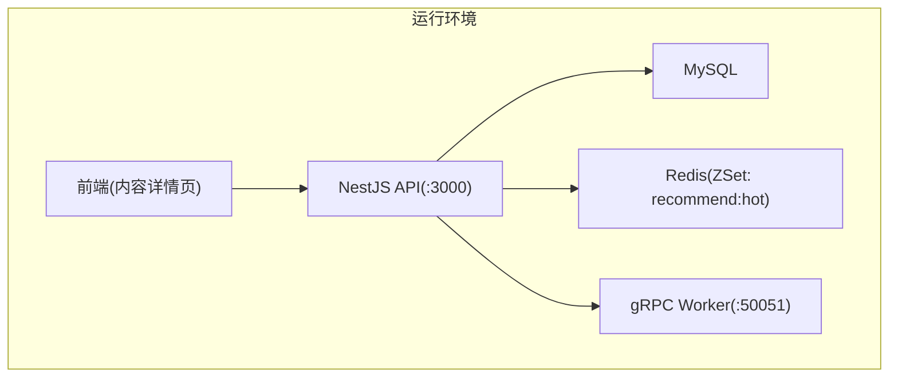
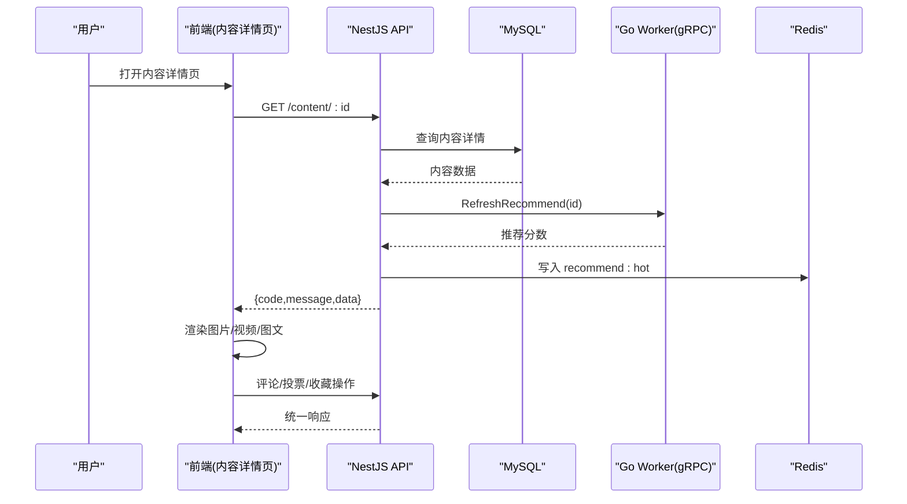
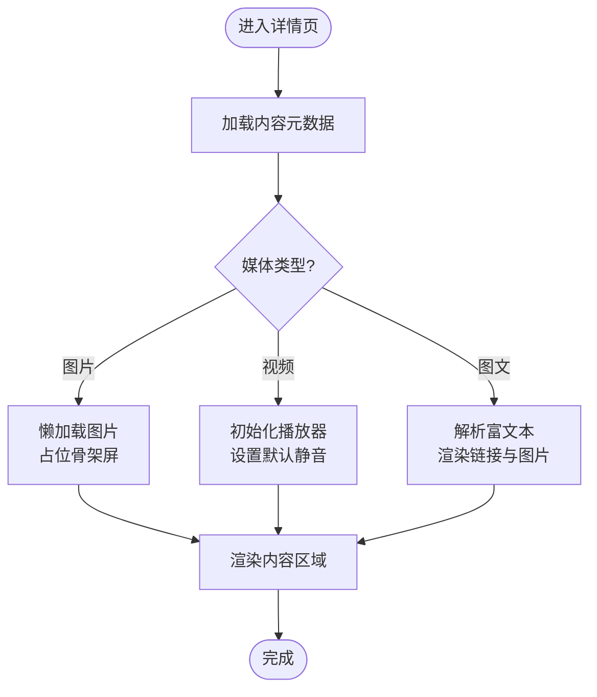
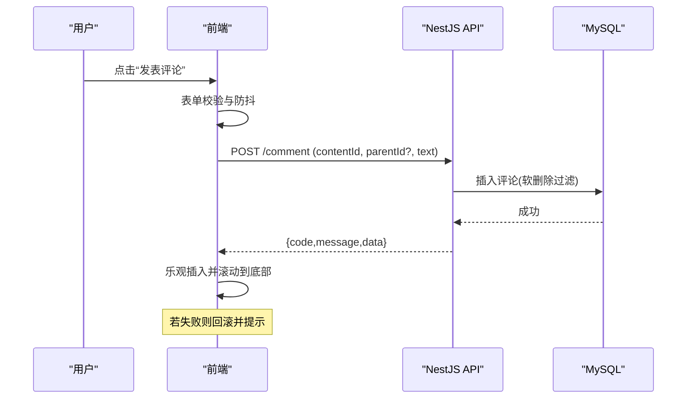
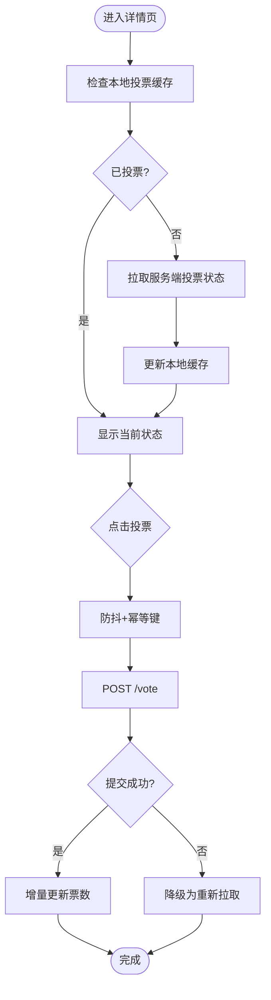
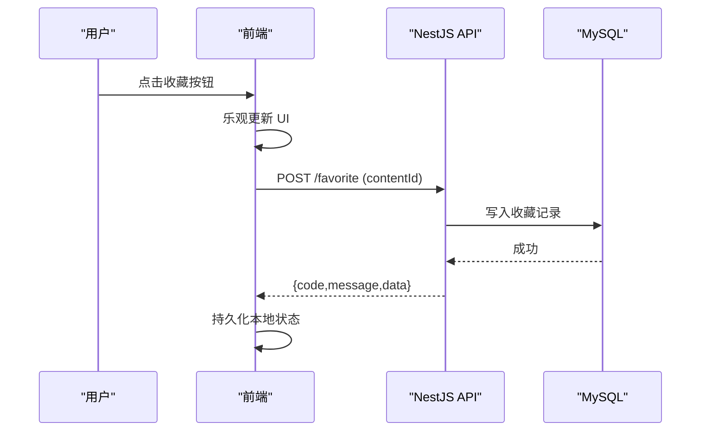
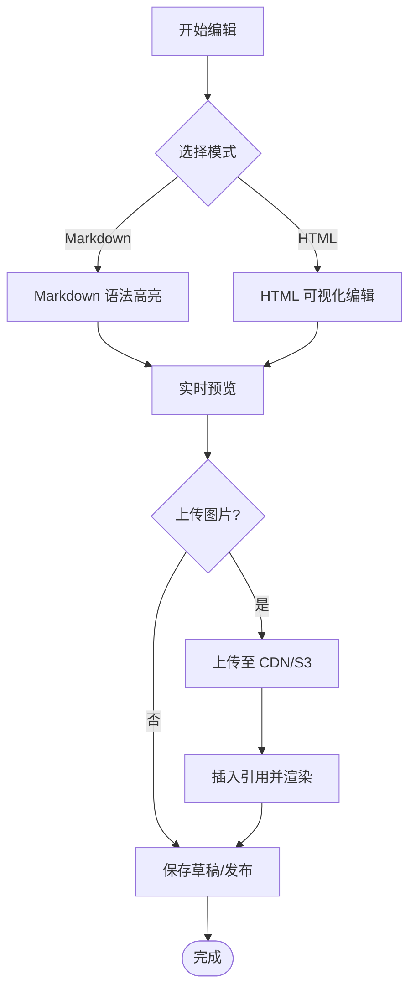
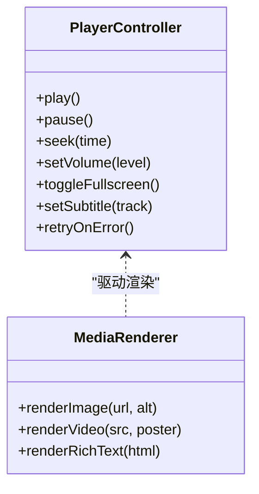
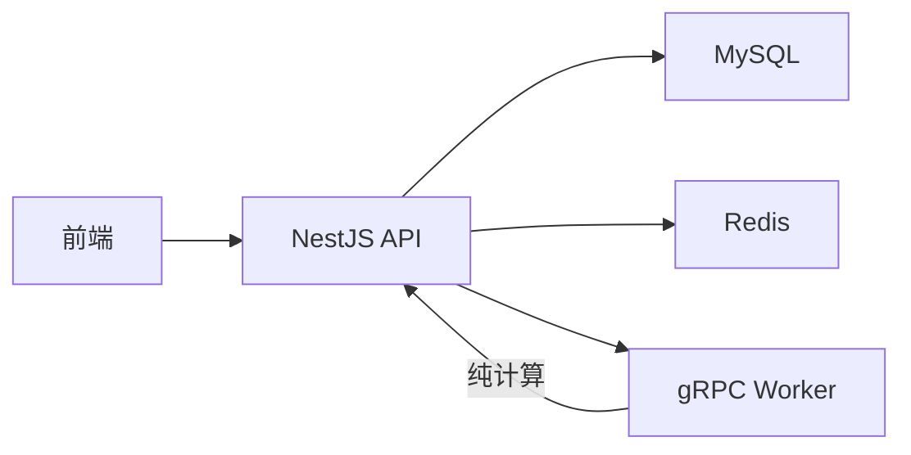

# 内容详情页

<cite>
**本文引用的文件**   
- [packages/frontend/src/api/index.ts](file://packages/frontend/src/api/index.ts)
- [proto/xqecz.proto](file://proto/xqecz.proto)
- [scripts/run-worker.mjs](file://scripts/run-worker.mjs)
- [package.json](file://package.json)
- [pnpm-workspace.yaml](file://pnpm-workspace.yaml)
</cite>

## 目录
1. [简介](#简介)
2. [项目结构](#项目结构)
3. [核心组件](#核心组件)
4. [架构总览](#架构总览)
5. [详细组件分析](#详细组件分析)
6. [依赖关系分析](#依赖关系分析)
7. [性能考虑](#性能考虑)
8. [故障排查指南](#故障排查指南)
9. [结论](#结论)
10. [附录](#附录)

## 简介
本文件面向 xqecz 平台“内容详情页”模块，聚焦于内容展示与交互实现，涵盖图片、视频、图文等多媒体渲染；评论系统（列表、发布、回复、权限）；投票机制（状态管理、实时更新、防重复提交）；收藏功能（交互设计与状态同步）；富文本编辑器集成；媒体播放器控制；以及错误处理、加载状态管理与网络异常恢复策略。文档基于仓库现有契约与运行方式，确保读者在不深入源码的情况下也能理解并正确使用该模块。

## 项目结构
xqecz 为 monorepo，前端位于 packages/frontend，API 服务位于 packages/api，计算 worker 位于 packages/worker。内容详情页的前端通过统一的 API 契约访问 NestJS 后端，NestJS 负责 MySQL/Redis 数据读写，并通过 gRPC 调用 Go worker 进行纯计算任务（如推荐打分）。所有删除均为软删除，外部依赖缺失时统一降级。

图表来源
- [packages/frontend/src/api/index.ts](file://packages/frontend/src/api/index.ts)
- [proto/xqecz.proto](file://proto/xqecz.proto)
- [scripts/run-worker.mjs](file://scripts/run-worker.mjs)

章节来源
- [package.json](file://package.json)
- [pnpm-workspace.yaml](file://pnpm-workspace.yaml)

## 核心组件
- 内容展示层：支持图片、视频、图文混排渲染，具备响应式布局与懒加载。
- 评论子系统：评论列表分页、发布、回复、点赞/举报、权限校验（登录态、角色）。
- 投票子系统：投票状态本地缓存、服务端去重、实时刷新、防重复提交。
- 收藏子系统：收藏/取消收藏、状态同步、离线缓存与冲突解决。
- 富文本编辑器：Markdown/HTML 输入、预览、安全过滤、上传回调。
- 媒体播放器：播放/暂停、进度、音量、全屏、字幕、错误重试。
- 错误与加载：全局 loading、骨架屏、重试、降级与回退策略。

章节来源
- [packages/frontend/src/api/index.ts](file://packages/frontend/src/api/index.ts)

## 架构总览
内容详情页的端到端流程如下：前端发起请求获取内容详情，NestJS 从 MySQL 读取主数据，必要时调用 Go worker 计算推荐分数并写入 Redis ZSet；前端在页面内完成评论、投票、收藏等交互，均通过统一 API 包装格式 { code, message, data } 返回。

图表来源
- [packages/frontend/src/api/index.ts](file://packages/frontend/src/api/index.ts)
- [proto/xqecz.proto](file://proto/xqecz.proto)
- [scripts/run-worker.mjs](file://scripts/run-worker.mjs)

## 详细组件分析

### 多媒体渲染（图片、视频、图文）
- 图片：支持缩略图与高清大图切换、懒加载、占位骨架屏、失败重试与降级到静态资源。
- 视频：自适应码率、自动播放策略（静音）、错误重试、断点续播、弹幕/字幕开关。
- 图文：富文本渲染、外链安全跳转、图片懒加载与尺寸优化。

章节来源
- [packages/frontend/src/api/index.ts](file://packages/frontend/src/api/index.ts)

### 评论系统（列表、发布、回复、权限）
- 列表：分页加载、按时间或热度排序、折叠/展开、敏感词过滤。
- 发布：表单校验、防抖提交、乐观更新、失败回滚。
- 回复：嵌套层级限制、@提及、引用块。
- 权限：未登录提示登录、仅作者可编辑/删除、管理员可置顶/加精。

章节来源
- [packages/frontend/src/api/index.ts](file://packages/frontend/src/api/index.ts)

### 投票机制（状态管理、实时更新、防重复提交）
- 状态管理：本地缓存投票结果与服务端一致化，避免闪烁。
- 实时更新：WebSocket 或轮询刷新票数，增量更新。
- 防重复提交：幂等键、客户端去重、服务端唯一约束。

章节来源
- [packages/frontend/src/api/index.ts](file://packages/frontend/src/api/index.ts)

### 收藏功能（交互设计与状态同步）
- 交互：一键收藏/取消，带微动效与 Toast 反馈。
- 同步：本地优先，服务端确认；冲突时以服务端为准。
- 离线：缓存收藏状态，网络恢复后同步。

章节来源
- [packages/frontend/src/api/index.ts](file://packages/frontend/src/api/index.ts)

### 富文本编辑器集成
- 输入：Markdown/HTML 双模式，实时预览。
- 安全：白名单过滤、外链 rel="noopener noreferrer"。
- 上传：图片/附件上传回调，失败重试与占位图。

章节来源
- [packages/frontend/src/api/index.ts](file://packages/frontend/src/api/index.ts)

### 媒体播放器控制
- 控制项：播放/暂停、进度拖拽、音量、全屏、倍速、字幕。
- 体验：首帧快速、错误重试、低带宽降级、自动下一集。
- 无障碍：键盘导航、屏幕阅读器兼容。

图表来源
- [packages/frontend/src/api/index.ts](file://packages/frontend/src/api/index.ts)

章节来源
- [packages/frontend/src/api/index.ts](file://packages/frontend/src/api/index.ts)

## 依赖关系分析
- 前端依赖 NestJS API 的统一接口契约，所有响应遵循 { code, message, data }。
- NestJS 依赖 MySQL 与 Redis，推荐热点使用 ZSet 存储。
- gRPC 契约定义在 proto/xqecz.proto，Worker 无状态，仅做计算。
- 启动脚本 scripts/run-worker.mjs 注入 .env 环境变量，确保 UPLOAD_DIR 一致。

图表来源
- [packages/frontend/src/api/index.ts](file://packages/frontend/src/api/index.ts)
- [proto/xqecz.proto](file://proto/xqecz.proto)
- [scripts/run-worker.mjs](file://scripts/run-worker.mjs)

章节来源
- [packages/frontend/src/api/index.ts](file://packages/frontend/src/api/index.ts)
- [proto/xqecz.proto](file://proto/xqecz.proto)
- [scripts/run-worker.mjs](file://scripts/run-worker.mjs)

## 性能考虑
- 图片懒加载与 WebP/AVIF 自适应，CDN 加速与缓存头优化。
- 视频分片加载、自适应码率、预加载关键帧。
- 评论分页与虚拟列表，减少 DOM 压力。
- 投票与收藏的本地缓存与增量更新，降低网络开销。
- 推荐热点使用 Redis ZSet，读多写少场景下提升吞吐。

[本节为通用指导，不直接分析具体文件]

## 故障排查指南
- 统一响应格式：检查 { code, message, data } 中 code 与 message 定位问题。
- 网络异常：启用重试与降级策略，必要时回退到 view_count 排序。
- 外部依赖缺失：Tinify/S3/FFmpeg/Worker 缺失时走降级路径，确保页面可用。
- 软删除数据：确认 deleted_at 字段过滤逻辑，避免脏数据出现。
- 日志与监控：前端埋点上报错误堆栈，后端记录 gRPC 调用耗时与失败率。

章节来源
- [packages/frontend/src/api/index.ts](file://packages/frontend/src/api/index.ts)

## 结论
内容详情页模块以统一 API 契约为核心，结合 NestJS 与 Go Worker 的分工协作，实现了稳定高效的多媒体渲染、评论、投票与收藏能力。通过完善的错误处理、加载状态管理与降级策略，保障了用户体验与系统可用性。建议在生产环境中持续监控关键指标，并根据业务需求迭代优化。

[本节为总结性内容，不直接分析具体文件]

## 附录
- 运行方式：pnpm dev 启动 NestJS API(:3000)、Go Worker(:50051)、Vite 前端(:5173)。
- 环境变量：UPLOAD_DIR 由 packages/api/.env 统一管理，worker 启动时自动注入。
- 协议与生成：proto/xqecz.proto 为 gRPC 契约，proto/gen 与 packages/worker/proto 为生成产物。

章节来源
- [package.json](file://package.json)
- [pnpm-workspace.yaml](file://pnpm-workspace.yaml)
- [scripts/run-worker.mjs](file://scripts/run-worker.mjs)
- [proto/xqecz.proto](file://proto/xqecz.proto)