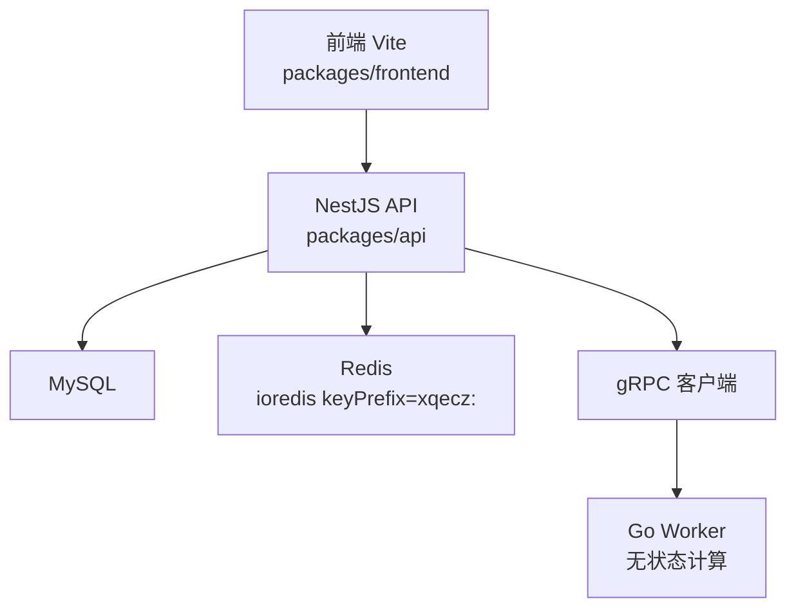
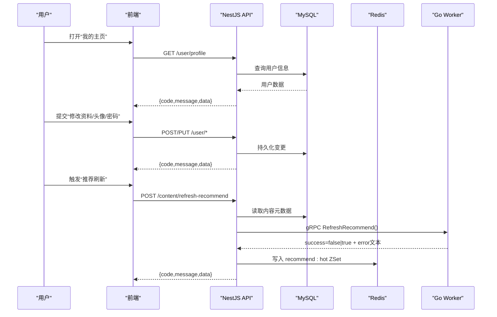
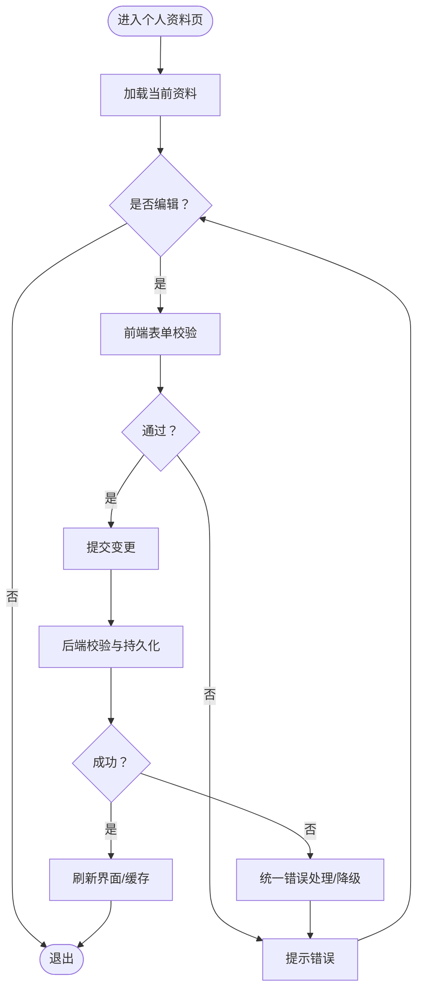
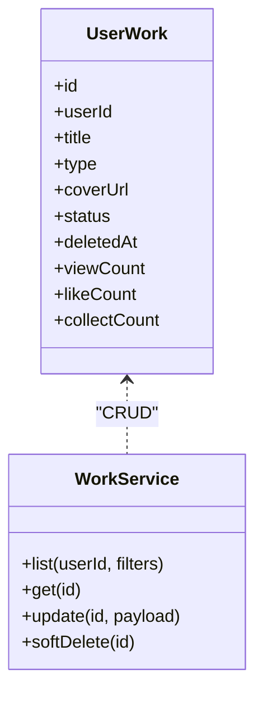
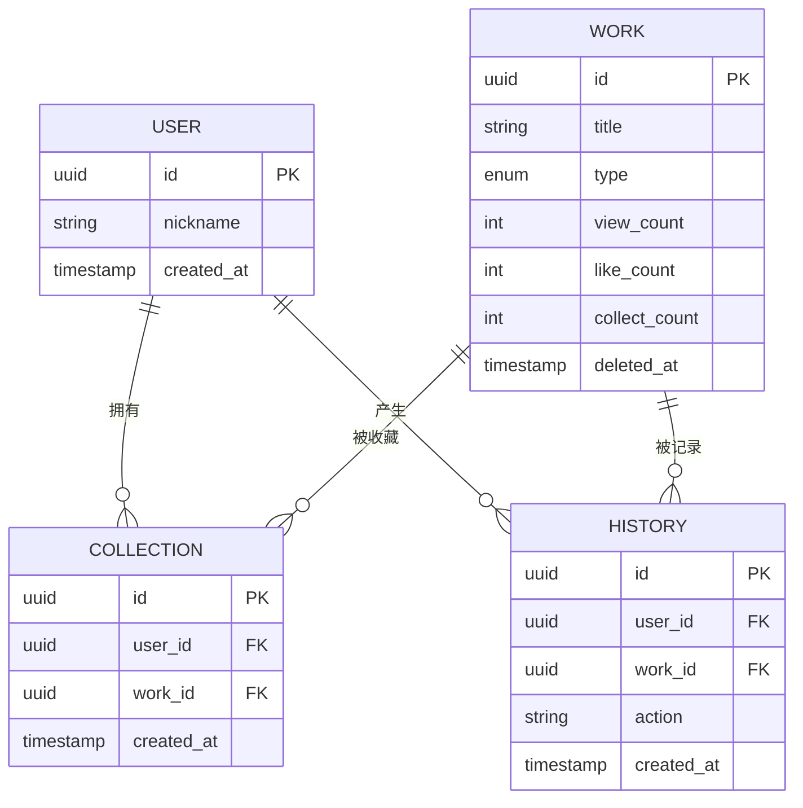
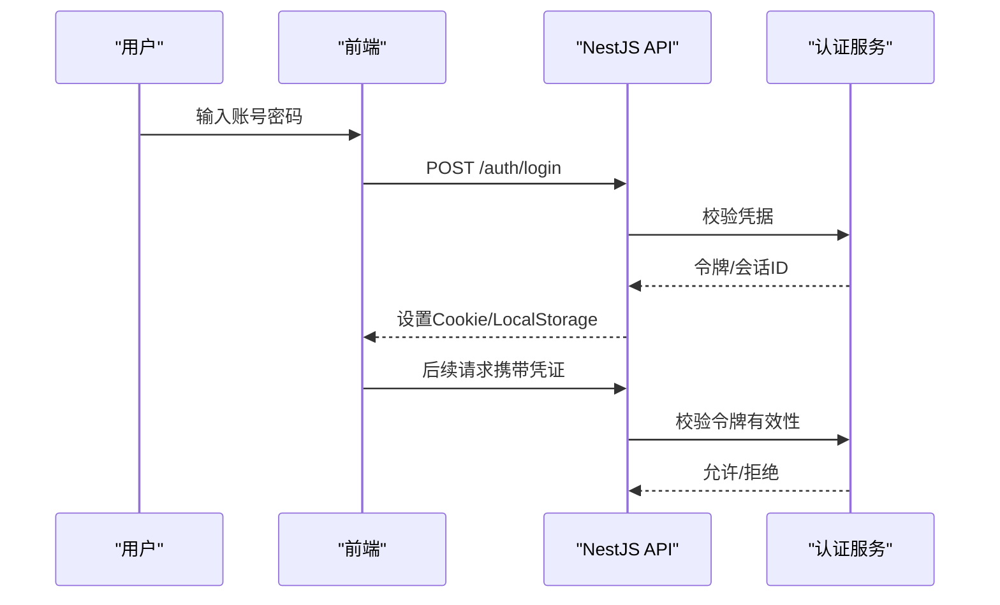
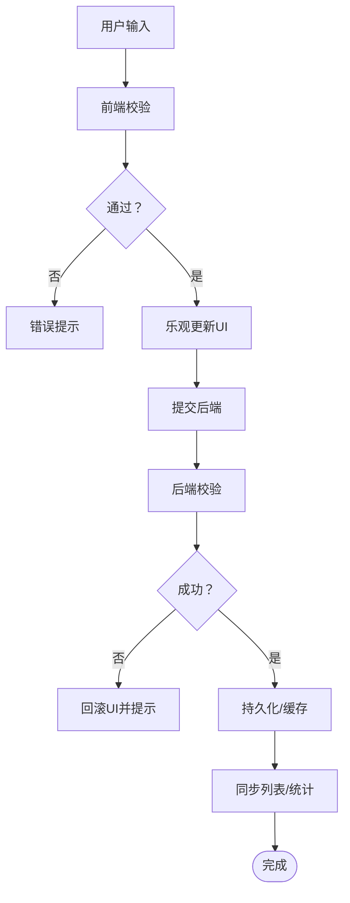
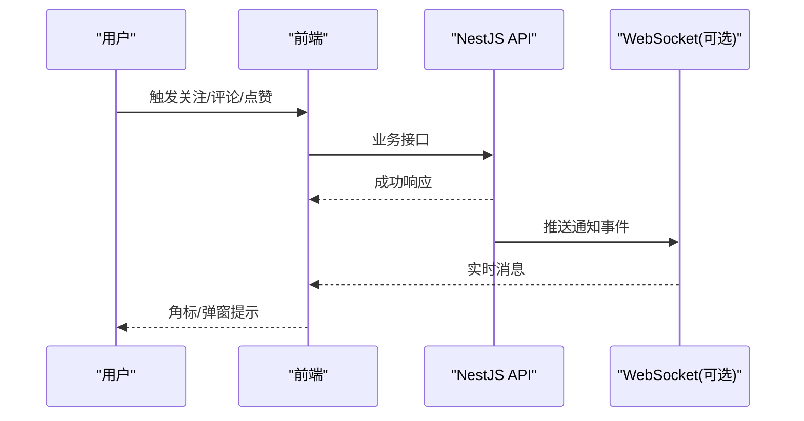
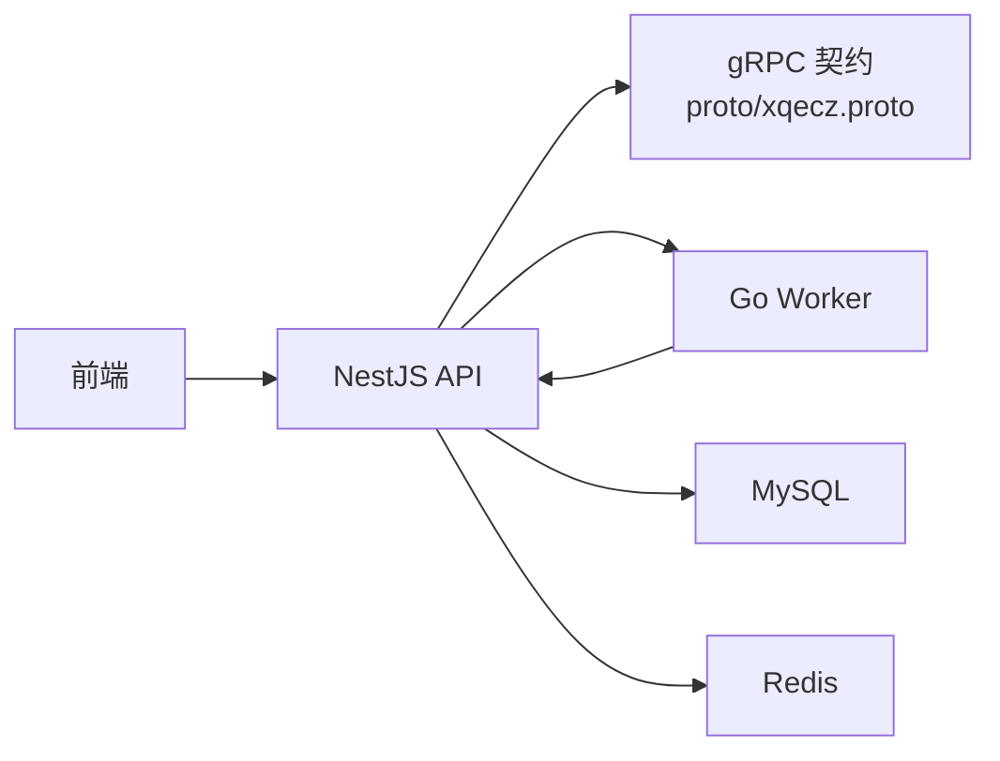

# 用户中心

<cite>
**本文引用的文件**   
- [xqecz.proto](file://proto/xqecz.proto)
- [index.ts](file://packages/frontend/src/api/index.ts)
- [run-worker.mjs](file://scripts/run-worker.mjs)
- [plan.md](file://plan.md)
- [AGENTS.md](file://AGENTS.md)
</cite>

## 目录
1. [简介](#简介)
2. [项目结构](#项目结构)
3. [核心组件](#核心组件)
4. [架构总览](#架构总览)
5. [详细组件分析](#详细组件分析)
6. [依赖关系分析](#依赖关系分析)
7. [性能考量](#性能考量)
8. [故障排查指南](#故障排查指南)
9. [结论](#结论)
10. [附录](#附录)

## 简介
本文件面向 xqecz 平台“用户中心”模块，覆盖个人信息管理、作品管理、收藏与历史、个人设置、权限验证与会话保持、表单校验与数据同步、通知与互动反馈、隐私与数据安全等。文档以仓库现有契约与约定为依据，结合通用前端/后端实践给出可落地的实现建议与最佳实践，帮助读者在不深入源码的情况下也能正确设计与集成用户中心功能。

## 项目结构
xqecz 采用 monorepo 组织：
- proto：gRPC 协议定义（snake_case 字段）
- packages/api：NestJS API 服务（MySQL/Redis 独占）
- packages/frontend：Vite 前端（唯一接口契约在 api/index.ts）
- scripts：Worker 启动脚本（注入 .env）

图表来源
- [xqecz.proto](file://proto/xqecz.proto)
- [index.ts](file://packages/frontend/src/api/index.ts)
- [run-worker.mjs](file://scripts/run-worker.mjs)

章节来源
- [plan.md](file://plan.md)
- [AGENTS.md](file://AGENTS.md)

## 核心组件
- 用户个人信息管理：资料编辑、头像上传、密码修改
- 用户作品管理：上传内容的查看、编辑、删除（软删除）
- 收藏列表与历史记录：用户行为记录与展示
- 个人设置：偏好配置与开关项
- 权限与会话：登录态、鉴权、会话保持
- 表单校验与数据同步：前端校验、后端校验、乐观/悲观更新策略
- 通知与互动：站内消息、评论/点赞/收藏反馈
- 隐私与安全：最小化采集、加密存储、访问控制

章节来源
- [index.ts](file://packages/frontend/src/api/index.ts)
- [xqecz.proto](file://proto/xqecz.proto)

## 架构总览
用户中心涉及前后端交互与 gRPC 计算链路。统一响应格式为 { code, message, data }；所有删除为软删除；外部依赖缺失时降级处理。

图表来源
- [index.ts](file://packages/frontend/src/api/index.ts)
- [xqecz.proto](file://proto/xqecz.proto)
- [run-worker.mjs](file://scripts/run-worker.mjs)

## 详细组件分析

### 个人信息管理（资料编辑、头像上传、密码修改）
- 资料编辑：支持昵称、签名、性别、生日等字段的增改；前端做必填/长度/格式校验，后端二次校验并落库。
- 头像上传：优先直传对象存储或经 API 中转；失败回退到本地临时目录；返回可访问的绝对路径或 CDN URL。
- 密码修改：需旧密码校验与新密码强度规则；成功后强制下线其他设备会话（可选）。

章节来源
- [index.ts](file://packages/frontend/src/api/index.ts)

### 用户作品管理（查看、编辑、删除）
- 查看：分页/筛选/排序；支持按类型（图片/视频/图文/链接）过滤。
- 编辑：标题、描述、封面、标签、可见性；保存后更新索引与缓存。
- 删除：软删除（deleted_at），列表自动过滤；支持回收站恢复（可选）。

章节来源
- [index.ts](file://packages/frontend/src/api/index.ts)

### 收藏列表与历史记录
- 收藏：对作品进行收藏/取消收藏，列表支持排序与筛选。
- 历史：浏览/播放/阅读记录，支持清空最近 N 条、按时间范围导出。
- 数据模型：用户-作品多对多关系，记录操作时间与来源。

章节来源
- [index.ts](file://packages/frontend/src/api/index.ts)

### 个人设置
- 主题、语言、通知开关、隐私可见性等；设置项键值化存储，便于扩展。
- 支持批量导入/导出与默认模板。

章节来源
- [index.ts](file://packages/frontend/src/api/index.ts)

### 权限验证、登录状态与会话保持
- 登录态：JWT/Session 方案均可；建议将敏感标识放 HttpOnly Cookie，Token 仅用于接口签名。
- 鉴权：基于角色的路由守卫与资源级授权；未登录/无权限统一错误码。
- 会话保持：跨端一致；支持单点登录与设备数限制；过期自动续期。

章节来源
- [index.ts](file://packages/frontend/src/api/index.ts)

### 表单验证、数据同步与状态持久化
- 前端：即时校验、防抖提交、乐观更新；失败回滚。
- 后端：严格校验、幂等写、事务保护关键路径。
- 状态：本地缓存+服务端权威源；冲突时服务端优先。

章节来源
- [index.ts](file://packages/frontend/src/api/index.ts)

### 通知系统、消息提醒与互动反馈
- 通知：系统公告、审核结果、互动提醒（评论/点赞/收藏）。
- 渠道：站内信、WebSocket 推送（可选）、邮件（可选）。
- 反馈：评分、举报、纠错；审核流程闭环。

章节来源
- [index.ts](file://packages/frontend/src/api/index.ts)

### 隐私保护、数据安全与个人信息管理
- 最小化采集：仅收集必要字段，明确用途。
- 加密与脱敏：密码哈希、敏感字段加密传输与存储；日志脱敏。
- 访问控制：RBAC/ABAC，越权检测；审计日志。
- 合规：数据导出/删除、同意撤回、第三方共享披露。

章节来源
- [index.ts](file://packages/frontend/src/api/index.ts)

## 依赖关系分析
- 前端与后端契约：统一响应体 { code, message, data }，位于 packages/frontend/src/api/index.ts。
- gRPC 契约：proto/xqecz.proto，字段 snake_case；NestJS 客户端 keepCase:true。
- Worker 启动：scripts/run-worker.mjs 注入 .env，路径经 gRPC 传递。

图表来源
- [index.ts](file://packages/frontend/src/api/index.ts)
- [xqecz.proto](file://proto/xqecz.proto)
- [run-worker.mjs](file://scripts/run-worker.mjs)

章节来源
- [index.ts](file://packages/frontend/src/api/index.ts)
- [xqecz.proto](file://proto/xqecz.proto)
- [run-worker.mjs](file://scripts/run-worker.mjs)

## 性能考量
- 读多写少场景：热点数据入 Redis ZSet（如 recommend:hot），读取优先缓存，降级到 MySQL 排序。
- 大文件上传：分片/断点续传/并发合并；CDN 加速静态资源。
- 数据库：合理索引、分页游标、读写分离（可选）。
- gRPC：超时重试、熔断降级、限流。

[本节为通用指导，不直接分析具体文件]

## 故障排查指南
- 统一错误码：前端根据 code/message 提示；后端记录 traceId。
- 常见错误：
  - 登录态失效：检查 Cookie/Token 有效期与跨域配置。
  - 上传失败：检查对象存储/FFmpeg/Tinify 可用性，确认降级逻辑。
  - gRPC 调用失败：检查 Worker 进程、端口、环境变量注入。
- 定位手段：接口日志、数据库慢查询、Redis 命中率、Worker 日志。

章节来源
- [index.ts](file://packages/frontend/src/api/index.ts)
- [run-worker.mjs](file://scripts/run-worker.mjs)

## 结论
用户中心围绕“个人信息—作品—收藏/历史—设置—权限—通知—安全”形成完整闭环。遵循统一接口契约、软删除、降级与缓存策略，可在保证体验的同时提升稳定性与可扩展性。建议逐步补齐 WebSocket 实时通知、细粒度权限与审计能力，持续优化上传与推荐链路性能。

[本节为总结，不直接分析具体文件]

## 附录
- 运行方式：pnpm dev 同时启动 NestJS API(:3000)、Go Worker(:50051)、Vite 前端(:5173)；pnpm start 生产模式一键构建+运行。
- 环境变量：UPLOAD_DIR 为单一上传目录配置源；Worker 启动脚本自动注入同一 .env。
- 推荐链路：ContentService.refreshRecommend() 读 MySQL → gRPC RefreshRecommend → 写 Redis ZSet recommend:hot；读取失败降级为 view_count 排序。

章节来源
- [plan.md](file://plan.md)
- [AGENTS.md](file://AGENTS.md)
- [run-worker.mjs](file://scripts/run-worker.mjs)