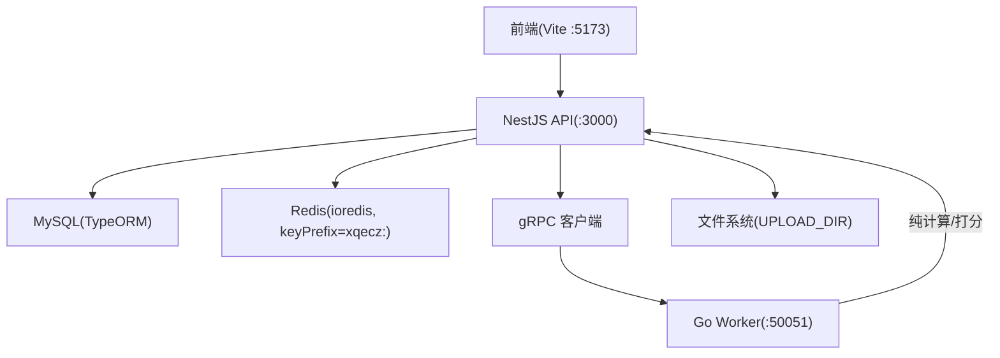
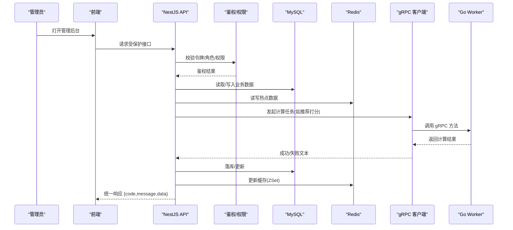
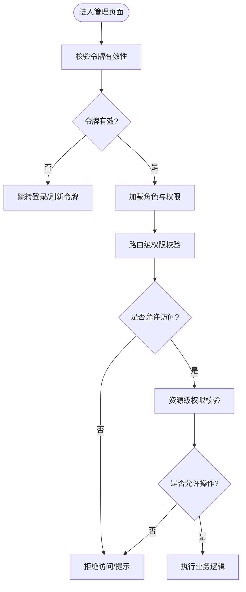
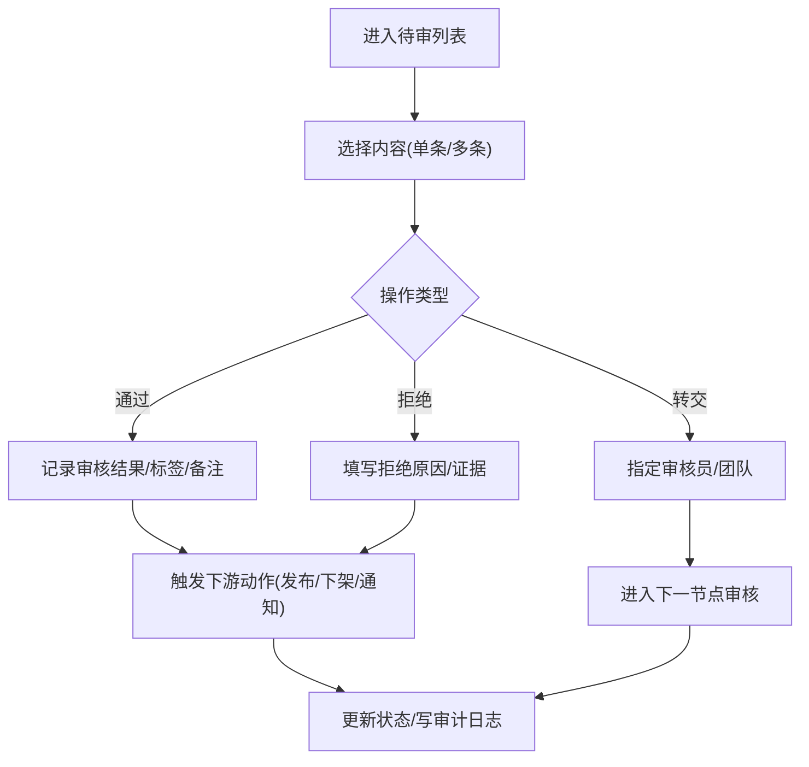
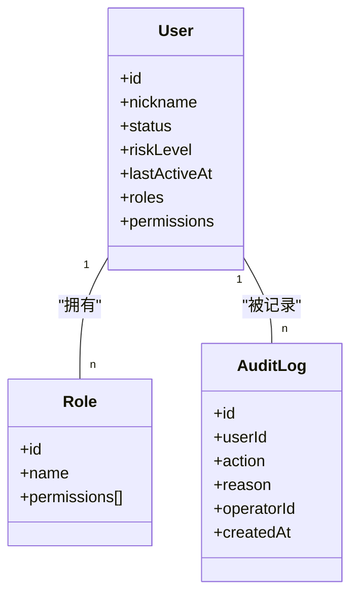
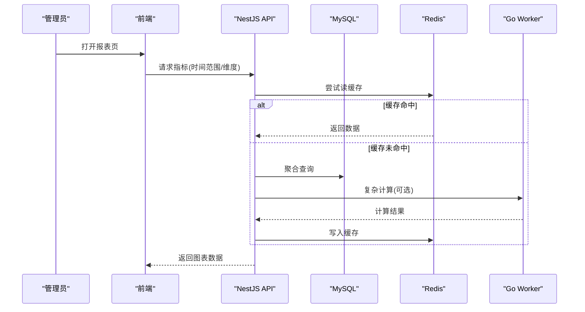
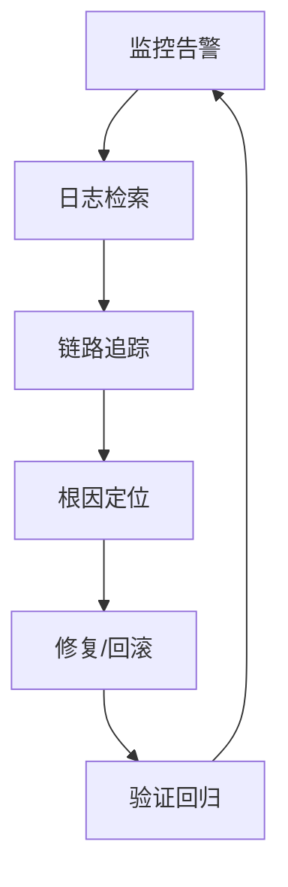
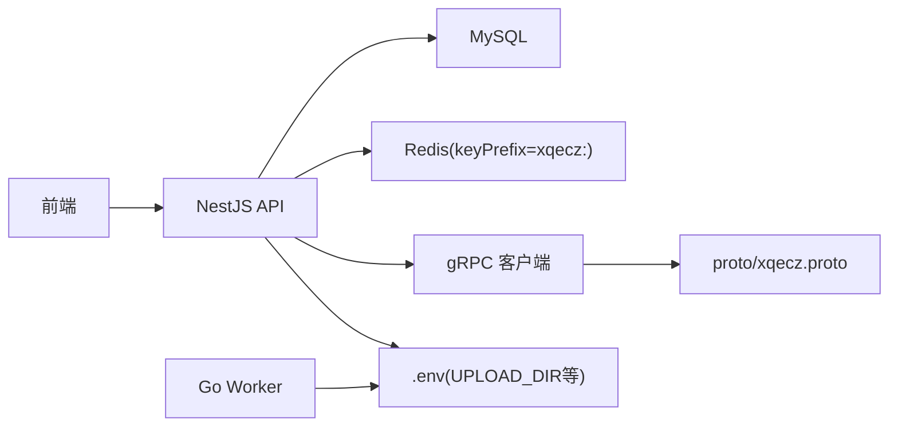

# 管理后台

<cite>
**本文引用的文件**   
- [packages/api/.env](file://packages/api/.env)
- [proto/xqecz.proto](file://proto/xqecz.proto)
- [scripts/run-worker.mjs](file://scripts/run-worker.mjs)
- [packages/frontend/src/api/index.ts](file://packages/frontend/src/api/index.ts)
</cite>

## 目录
1. [简介](#简介)
2. [项目结构](#项目结构)
3. [核心组件](#核心组件)
4. [架构总览](#架构总览)
5. [详细组件分析](#详细组件分析)
6. [依赖关系分析](#依赖关系分析)
7. [性能考量](#性能考量)
8. [故障排查指南](#故障排查指南)
9. [结论](#结论)
10. [附录](#附录)

## 简介
本文件面向 xqecz 平台管理后台模块，聚焦管理员权限验证、角色与访问控制、内容审核（待审列表、审核操作、批量处理与管理工具）、用户管理（列表、权限分配、账号状态、违规处理）、数据统计与报表（活跃度、内容统计、趋势分析与导出）、系统监控与日志、配置管理与维护操作、审计与安全策略及最佳实践。文档基于仓库现有契约与约定进行说明，确保与实际实现一致。

## 项目结构
xqecz 为 monorepo，管理后台相关能力由前端（Vite）与后端（NestJS API）协作完成，计算密集型任务通过 Go Worker 以 gRPC 提供无状态服务。关键约定：
- 唯一运行方式：pnpm dev 启动 NestJS API(:3000)、Go Worker(:50051)、Vite 前端(:5173)。
- 前后端接口契约统一在 packages/frontend/src/api/index.ts，响应格式 { code, message, data }。
- gRPC 契约定义于 proto/xqecz.proto；NestJS 客户端使用 keepCase:true，字段 snake_case。
- 共享上传目录由 UPLOAD_DIR 环境变量约定，单一配置源为 packages/api/.env；worker 经 scripts/run-worker.mjs 启动时自动读取同一 .env 注入，文件路径以绝对路径传递。

图表来源
- [packages/frontend/src/api/index.ts](file://packages/frontend/src/api/index.ts)
- [proto/xqecz.proto](file://proto/xqecz.proto)
- [scripts/run-worker.mjs](file://scripts/run-worker.mjs)
- [packages/api/.env](file://packages/api/.env)

章节来源
- [packages/frontend/src/api/index.ts](file://packages/frontend/src/api/index.ts)
- [proto/xqecz.proto](file://proto/xqecz.proto)
- [scripts/run-worker.mjs](file://scripts/run-worker.mjs)
- [packages/api/.env](file://packages/api/.env)

## 核心组件
- 权限与访问控制
  - 管理员登录鉴权、角色与权限模型、路由守卫与装饰器、资源级授权。
  - 建议采用 RBAC（角色-权限-资源）+ ABAC（属性条件）组合，支持细粒度控制。
- 内容审核
  - 待审队列、人工审核与规则引擎结合、批量审核、审核留痕与回滚。
- 用户管理
  - 用户列表检索、分页、排序；权限分配、账号状态（启用/禁用/封禁）、违规记录与处置。
- 数据统计与报表
  - 用户活跃度、内容指标、趋势分析；数据导出（CSV/Excel/PDF）。
- 系统监控与日志
  - 健康检查、慢查询告警、错误追踪、审计日志、可观测性集成。
- 配置管理与维护
  - 动态配置、功能开关、缓存清理、索引重建、归档与迁移。

章节来源
- [packages/frontend/src/api/index.ts](file://packages/frontend/src/api/index.ts)
- [proto/xqecz.proto](file://proto/xqecz.proto)
- [scripts/run-worker.mjs](file://scripts/run-worker.mjs)
- [packages/api/.env](file://packages/api/.env)

## 架构总览
管理后台整体交互流程如下：前端调用 NestJS API，API 负责鉴权、业务编排、数据持久化与缓存；对高耗时计算（如推荐打分）通过 gRPC 调用 Go Worker，Worker 返回结果后 API 落库或写入 Redis ZSet；所有删除走软删除策略；外部依赖缺失一律降级。

图表来源
- [packages/frontend/src/api/index.ts](file://packages/frontend/src/api/index.ts)
- [proto/xqecz.proto](file://proto/xqecz.proto)
- [scripts/run-worker.mjs](file://scripts/run-worker.mjs)
- [packages/api/.env](file://packages/api/.env)

## 详细组件分析

### 管理员权限验证与访问控制
- 认证流程
  - 管理员登录后获取令牌，后续请求携带令牌至 API。
  - API 解析令牌并校验有效性，加载角色与权限上下文。
- 授权策略
  - 路由级：基于角色的访问控制（RBAC），仅允许具备相应角色的管理员访问。
  - 资源级：结合对象属性与策略（ABAC），限制对特定资源的增删改查。
- 安全加固
  - 最小权限原则、会话超时、IP/UA 风控、防重放与限流。
  - 敏感操作二次确认与审批流。

章节来源
- [packages/frontend/src/api/index.ts](file://packages/frontend/src/api/index.ts)

### 内容审核机制
- 待审列表
  - 支持按类型、时间、来源、风险等级筛选与分页。
  - 展示预览、评论摘要、举报次数、历史审核记录。
- 审核操作
  - 单个通过/拒绝，附带原因与标签；支持草稿保存与撤回。
  - 规则引擎联动：命中高风险规则自动标记或拦截。
- 批量处理
  - 多选批量通过/拒绝/转交；批量打标签与备注。
  - 审核模板与快捷短语，提升效率。
- 管理工具
  - 审核队列看板、SLA 监控、超时预警、质量抽检。
  - 审核回溯与版本对比，支持回滚与再审核。

章节来源
- [packages/frontend/src/api/index.ts](file://packages/frontend/src/api/index.ts)

### 用户管理界面
- 用户列表
  - 多条件检索、排序、分页；显示头像、昵称、注册时间、最近活跃、风险等级。
- 权限分配
  - 角色模板一键套用；自定义角色与权限点；资源级授权。
- 账号状态管理
  - 启用/禁用/封禁；设置有效期与宽限期；自动恢复策略。
- 违规处理
  - 违规记录聚合、证据附件、处罚策略（警告/限流/封号/注销）；申诉通道。

章节来源
- [packages/frontend/src/api/index.ts](file://packages/frontend/src/api/index.ts)

### 数据统计与报表
- 指标体系
  - 用户活跃度（DAU/WAU/MAU、留存、新增/流失）、内容统计（发布量、互动量、违规率）、趋势分析（同比/环比/分时段）。
- 可视化与导出
  - 多维图表、钻取下探、筛选器；导出 CSV/Excel/PDF，支持定时生成与邮件推送。
- 数据一致性
  - 实时指标与离线报表双轨；缓存预热与增量更新。

章节来源
- [packages/frontend/src/api/index.ts](file://packages/frontend/src/api/index.ts)
- [proto/xqecz.proto](file://proto/xqecz.proto)

### 系统监控、日志与故障排查
- 监控
  - 健康检查、QPS/延迟/错误率、数据库连接池、Redis 命中率、Worker 负载。
- 日志
  - 结构化日志、审计日志、错误堆栈、链路追踪；集中采集与检索。
- 故障排查
  - 快速定位根因、热修复、灰度回滚、容量评估与扩容。

章节来源
- [packages/frontend/src/api/index.ts](file://packages/frontend/src/api/index.ts)

### 配置管理与维护操作
- 配置项
  - 数据库、缓存、上传目录、第三方服务、功能开关、限流阈值等。
- 维护操作
  - 缓存清理、索引重建、数据归档、备份恢复、滚动重启。
- 安全策略
  - 最小权限、白名单、密钥轮换、审计与合规。

章节来源
- [packages/api/.env](file://packages/api/.env)
- [scripts/run-worker.mjs](file://scripts/run-worker.mjs)

## 依赖关系分析
- 前后端契约
  - 前端通过 packages/frontend/src/api/index.ts 统一调用 API，响应格式 { code, message, data }。
- gRPC 契约
  - proto/xqecz.proto 定义服务与方法；NestJS 客户端 keepCase:true，字段 snake_case。
- Worker 启动
  - scripts/run-worker.mjs 启动 Worker，自动读取 packages/api/.env 注入环境变量。
- 存储与缓存
  - NestJS 独占 MySQL/Redis；ioredis keyPrefix=xqecz:；推荐位写入 recommend:hot ZSet。

图表来源
- [packages/frontend/src/api/index.ts](file://packages/frontend/src/api/index.ts)
- [proto/xqecz.proto](file://proto/xqecz.proto)
- [scripts/run-worker.mjs](file://scripts/run-worker.mjs)
- [packages/api/.env](file://packages/api/.env)

章节来源
- [packages/frontend/src/api/index.ts](file://packages/frontend/src/api/index.ts)
- [proto/xqecz.proto](file://proto/xqecz.proto)
- [scripts/run-worker.mjs](file://scripts/run-worker.mjs)
- [packages/api/.env](file://packages/api/.env)

## 性能考量
- 缓存优先
  - 热点数据入 Redis，ZSet 用于排行榜；读多写少场景显著降低 DB 压力。
- 异步计算
  - 推荐打分等耗时任务交由 Worker 异步处理，避免阻塞主线程。
- 软删除
  - 全表软删除减少误删风险，注意索引与查询优化。
- 降级策略
  - 外部依赖缺失时降级到基础能力，保证可用性。

[本节为通用指导，不直接分析具体文件]

## 故障排查指南
- 常见问题
  - 鉴权失败：检查令牌有效期、角色权限、网关转发头。
  - gRPC 调用失败：核对端口、proto 版本、keepCase 与字段命名。
  - 上传失败：确认 UPLOAD_DIR 存在且权限正确。
  - 缓存不一致：清理对应 keyPrefix 前缀的键，重建索引。
- 诊断步骤
  - 查看审计日志与错误堆栈；追踪链路 ID；比对 Worker 日志与 API 日志。
  - 使用健康检查端点与指标面板定位瓶颈。
- 恢复策略
  - 回滚变更、隔离故障节点、扩容与限流、数据修复脚本。

章节来源
- [packages/frontend/src/api/index.ts](file://packages/frontend/src/api/index.ts)
- [proto/xqecz.proto](file://proto/xqecz.proto)
- [scripts/run-worker.mjs](file://scripts/run-worker.mjs)
- [packages/api/.env](file://packages/api/.env)

## 结论
管理后台围绕“鉴权可控、审核高效、数据可信、运维可视”展开。通过统一的 API 契约、gRPC 计算解耦与完善的监控审计，形成稳定可扩展的管理能力。建议持续完善 RBAC/ABAC 策略、强化审核规则与自动化、提升报表实时性与可解释性，并落实安全基线与合规要求。

[本节为总结性内容，不直接分析具体文件]

## 附录
- 术语
  - RBAC：基于角色的访问控制；ABAC：基于属性的访问控制；ZSet：Redis 有序集合。
- 参考约定
  - 统一响应格式 { code, message, data }；软删除策略；keyPrefix=xqecz:；推荐位 recommend:hot。

[本节为补充信息，不直接分析具体文件]