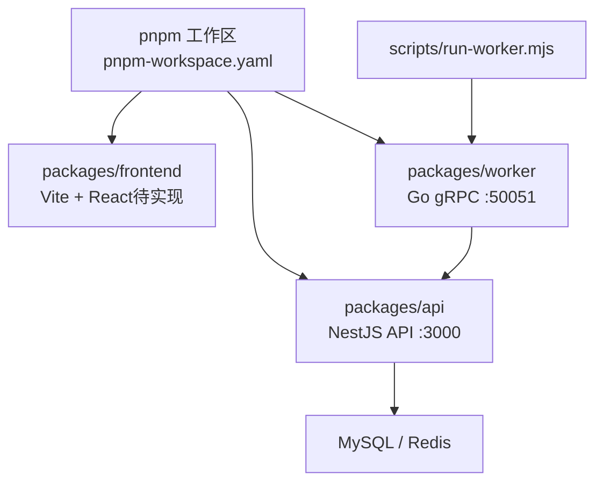
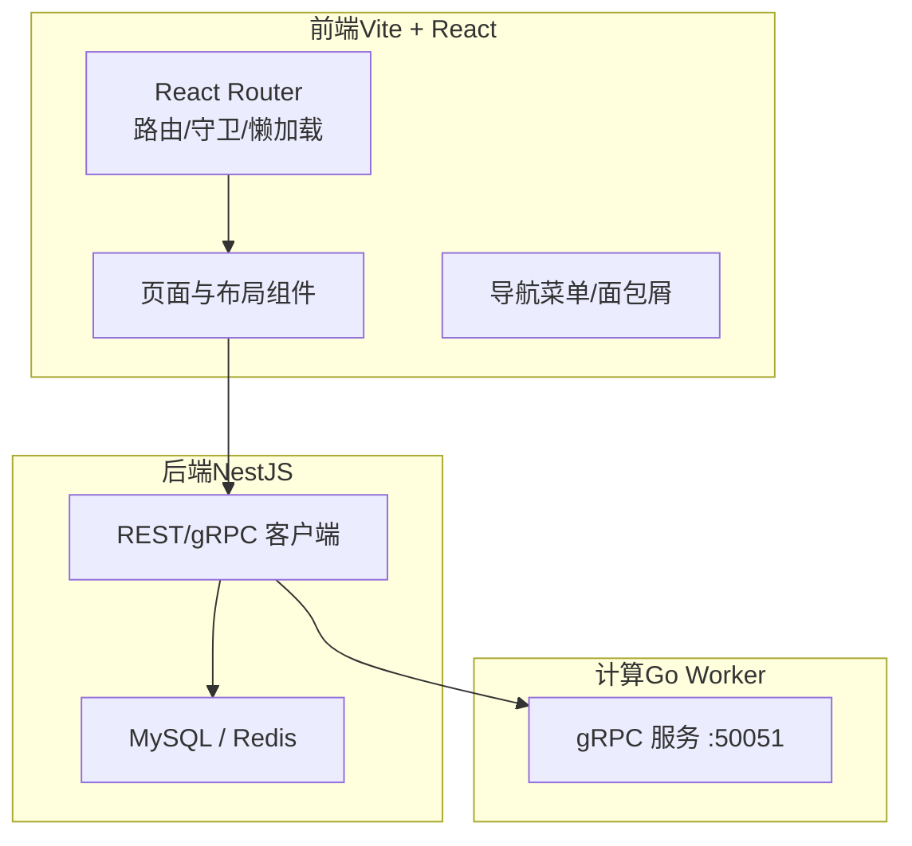
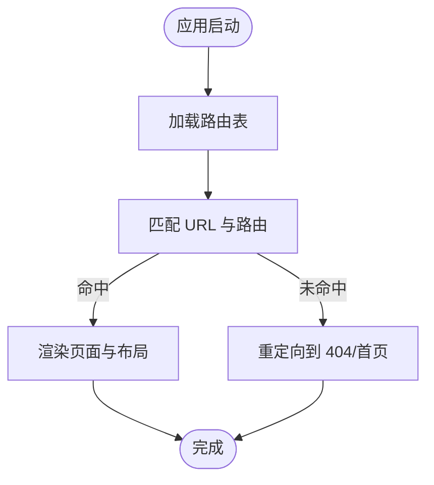
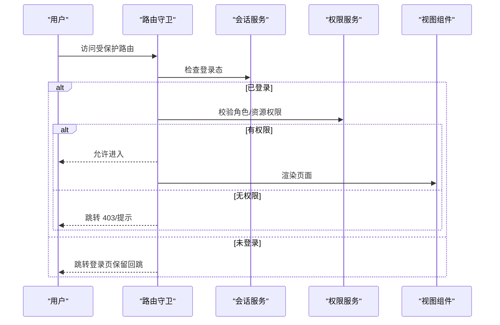
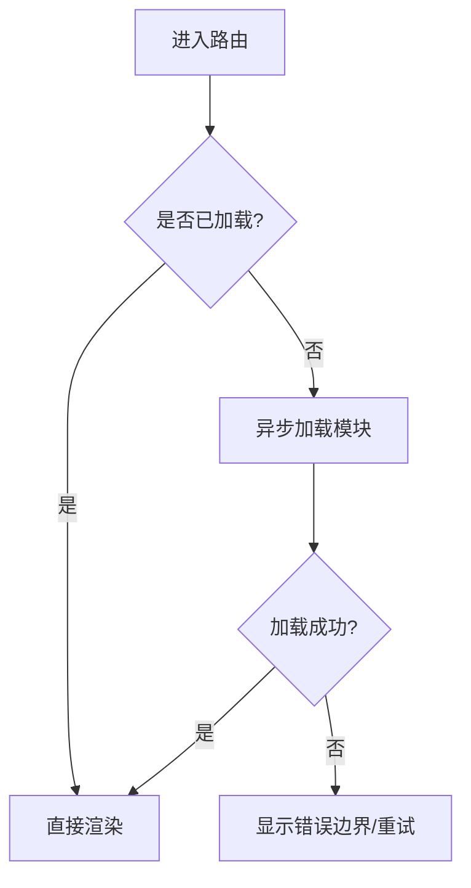
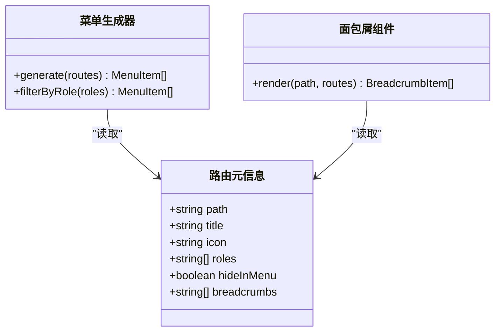
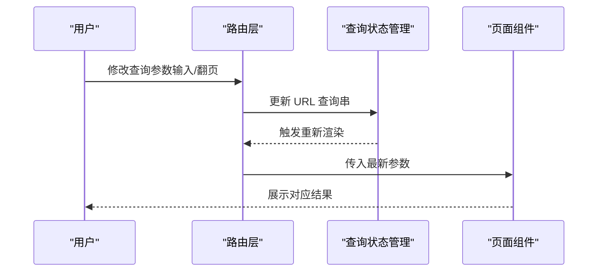
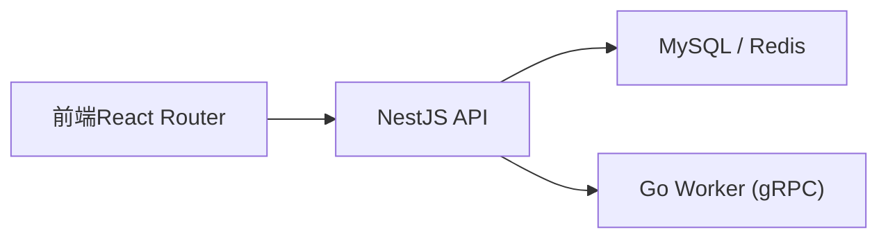

# 路由导航

<cite>
**本文引用的文件**   
- [package.json](file://package.json)
- [pnpm-workspace.yaml](file://pnpm-workspace.yaml)
- [plan.md](file://plan.md)
- [AGENTS.md](file://AGENTS.md)
</cite>

## 目录
1. [简介](#简介)
2. [项目结构](#项目结构)
3. [核心组件](#核心组件)
4. [架构总览](#架构总览)
5. [详细组件分析](#详细组件分析)
6. [依赖分析](#依赖分析)
7. [性能考虑](#性能考虑)
8. [故障排查指南](#故障排查指南)
9. [结论](#结论)
10. [附录](#附录)

## 简介
本文件为 xqecz 平台“路由导航系统”的权威文档。xqecz 是一个二创内容平台（图片、视频、图文、链接），包含评论、投票与管理后台。前端采用 Vite + React，后端 NestJS API(:3000)、Go Worker(:50051)，统一通过 pnpm 脚本本地直启。当前仓库未包含前端源码，因此本文聚焦于：如何基于现有 monorepo 与运行方式，设计并落地一套完整的前端路由导航方案（React Router v6），涵盖路由定义、嵌套/动态参数、守卫与权限、懒加载与代码分割、菜单与面包屑、URL 状态同步、历史管理与兼容性、测试与调试等。

## 项目结构
- 根目录为 monorepo，使用 pnpm workspace 管理多包。
- packages/frontend 为前端工程目录（待实现）。
- packages/api 为 NestJS 服务，提供 REST/gRPC 客户端与数据库访问。
- packages/worker 为 Go gRPC 计算服务，无状态、不直接连库。
- scripts/run-worker.mjs 用于启动 worker，自动注入 .env。
- 运行方式：pnpm dev 同时启动 api、worker、vite；pnpm start 生产构建+运行。

图表来源
- [pnpm-workspace.yaml](file://pnpm-workspace.yaml)
- [package.json](file://package.json)
- [plan.md](file://plan.md)
- [AGENTS.md](file://AGENTS.md)

章节来源
- [package.json](file://package.json)
- [pnpm-workspace.yaml](file://pnpm-workspace.yaml)
- [plan.md](file://plan.md)
- [AGENTS.md](file://AGENTS.md)

## 核心组件
- 路由配置中心：集中定义静态路由、嵌套路由、动态路由与重定向规则。
- 路由守卫与权限控制：登录态校验、角色检查、资源级授权。
- 页面与布局：顶层 AppShell、公共 Layout、子模块 Layout。
- 懒加载与代码分割：按路由或功能块拆分 bundle。
- 导航与状态：侧边菜单生成、面包屑、URL 查询串与状态同步。
- 历史与兼容：History 模式选择、后退导航、浏览器兼容处理。
- 测试与调试：单元测试、集成测试、路由断言与 Mock。

章节来源
- [plan.md](file://plan.md)
- [AGENTS.md](file://AGENTS.md)

## 架构总览
下图展示前端路由在整体系统中的位置与交互关系。前端通过 React Router 管理 URL 到组件映射，并在需要时调用 NestJS API 获取数据；Worker 作为纯计算服务由 API 调用，前端不直接感知。

图表来源
- [plan.md](file://plan.md)
- [AGENTS.md](file://AGENTS.md)

## 详细组件分析

### 路由配置与定义
- 路由表组织：建议以“模块”为单位拆分路由文件，再聚合到统一入口。
- 嵌套路由：使用 Outlet 渲染子路由，适合“列表-详情”、“设置-子项”等场景。
- 动态路由：使用路径参数（如 /post/:id）与搜索参数（?q=...）组合表达资源定位。
- 重定向与默认页：未匹配时跳转到 404 或首页；登录后根据角色跳转目标页。

章节来源
- [plan.md](file://plan.md)
- [AGENTS.md](file://AGENTS.md)

### 路由守卫与权限控制
- 登录验证：进入受保护路由前检查登录态（Token/Cookie），失败则跳转登录页并记录回跳地址。
- 角色检查：根据用户角色（如 viewer/editor/admin）决定可访问的路径集合。
- 资源级授权：结合业务数据（如帖子作者/管理员）进行二次校验。
- 实现要点：
  - 将鉴权逻辑封装为高阶组件或路由守卫函数。
  - 对敏感路由使用路由级守卫，对按钮/操作使用组件级守卫。
  - 统一错误提示与降级策略（无权限时显示空白或提示）。

章节来源
- [plan.md](file://plan.md)
- [AGENTS.md](file://AGENTS.md)

### 懒加载与代码分割
- 路由级懒加载：每个页面按需加载，减少首屏体积。
- 功能块拆分：将大型第三方库或复杂组件拆分为独立 chunk。
- 预取与预加载：对高频路由进行预取，提升交互体验。
- 骨架屏与错误边界：在加载与异常时提供良好反馈。

章节来源
- [plan.md](file://plan.md)
- [AGENTS.md](file://AGENTS.md)

### 导航菜单与面包屑
- 菜单生成：从路由元信息（title、icon、roles、path）自动生成侧边栏。
- 面包屑：根据路由层级与标题动态拼装，支持自定义分隔符与点击跳转。
- 高亮与激活：基于当前路径匹配高亮当前菜单项。
- 国际化：菜单与面包屑文案支持 i18n。

章节来源
- [plan.md](file://plan.md)
- [AGENTS.md](file://AGENTS.md)

### 路由参数与 URL 状态同步
- 路径参数：用于资源标识（如 /post/:id），配合类型校验与默认值。
- 查询字符串：用于筛选、分页、排序等，保持与 URL 双向同步。
- 状态持久化：刷新后恢复筛选条件与分页状态。
- 深链接：分享链接可直接打开到指定筛选结果。

章节来源
- [plan.md](file://plan.md)
- [AGENTS.md](file://AGENTS.md)

### 历史管理与浏览器兼容
- History 模式：推荐 hash 或 browser history，根据部署环境选择。
- 后退导航：避免覆盖用户期望的历史栈；必要时合并多次跳转。
- 兼容性：对不支持 pushState 的环境降级为 hash 模式。
- 埋点与统计：记录页面访问与跳转路径。

章节来源
- [plan.md](file://plan.md)
- [AGENTS.md](file://AGENTS.md)

### 测试与调试
- 单元测试：对路由守卫、菜单生成、面包屑拼装进行断言。
- 集成测试：模拟用户导航流程，验证权限与跳转。
- 调试技巧：
  - 使用浏览器开发者工具查看路由匹配与组件树。
  - 打印路由变化日志，辅助定位问题。
  - 使用 Mock 数据隔离后端依赖。

章节来源
- [plan.md](file://plan.md)
- [AGENTS.md](file://AGENTS.md)

## 依赖分析
- 前端依赖：React、React Router、Vite、状态管理（可选）、UI 库（可选）。
- 后端依赖：NestJS、TypeORM、ioredis、gRPC 客户端。
- Worker 依赖：Go、gRPC 服务端。
- 运行时：Node.js、pnpm。

图表来源
- [plan.md](file://plan.md)
- [AGENTS.md](file://AGENTS.md)

章节来源
- [plan.md](file://plan.md)
- [AGENTS.md](file://AGENTS.md)

## 性能考虑
- 首屏优化：路由懒加载、关键 CSS 内联、字体与图标按需加载。
- 缓存策略：接口响应缓存、路由组件内存缓存（谨慎使用）。
- 网络优化：HTTP/2、CDN、压缩、请求合并。
- 渲染优化：虚拟列表、防抖节流、避免不必要的重渲染。

[本节为通用指导，无需特定文件引用]

## 故障排查指南
- 常见问题：
  - 404 页面频繁出现：检查路由匹配顺序与通配符。
  - 权限误判：核对角色配置与资源权限规则。
  - 查询状态丢失：确认 URL 同步逻辑与刷新恢复。
  - 懒加载失败：检查分包命名与路径是否正确。
- 调试步骤：
  - 开启路由日志，观察跳转链路与参数变化。
  - 使用浏览器 Network 面板检查接口返回。
  - 逐步注释路由与守卫，定位问题范围。

章节来源
- [plan.md](file://plan.md)
- [AGENTS.md](file://AGENTS.md)

## 结论
本文围绕 xqecz 平台的前端路由导航系统，给出了从架构到实现的完整蓝图。尽管当前仓库未包含前端源码，但基于 monorepo 结构与运行方式，可按本文方案快速落地 React Router 路由体系，确保权限可控、性能优良、可维护性强。后续可在 packages/frontend 中逐步实现上述组件与策略，并通过 pnpm 脚本一键联调。

[本节为总结性内容，无需特定文件引用]

## 附录
- 运行说明：pnpm dev 启动开发环境；pnpm start 构建并启动生产环境。
- 环境变量：UPLOAD_DIR 等统一由 packages/api/.env 管理，worker 启动时自动注入。
- 接口契约：packages/frontend/src/api/index.ts 为前后端唯一接口契约（待实现）。

章节来源
- [plan.md](file://plan.md)
- [AGENTS.md](file://AGENTS.md)