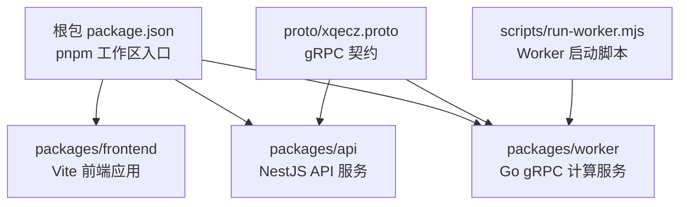
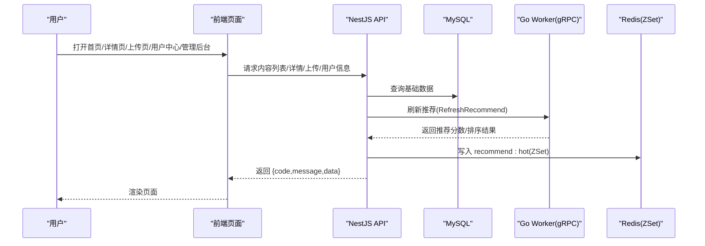
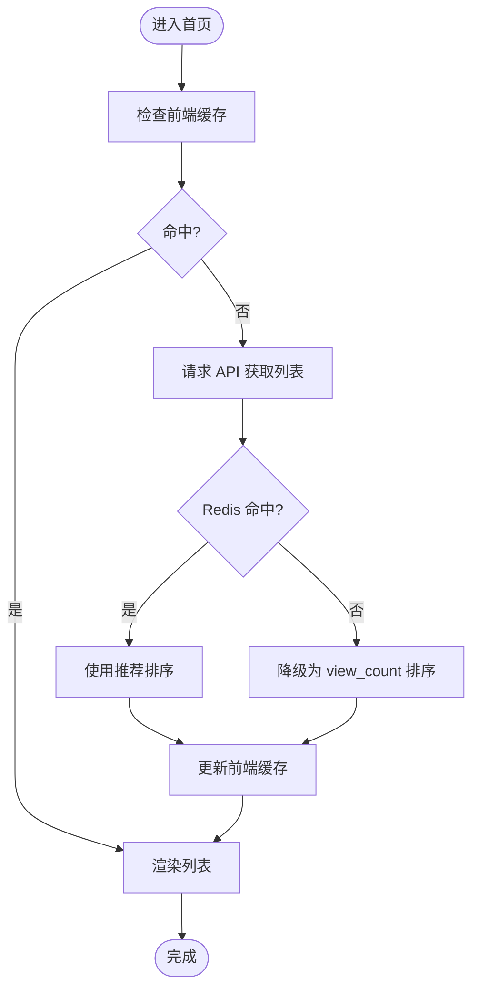
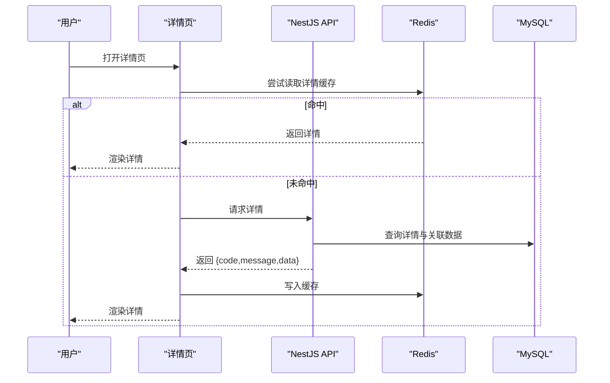
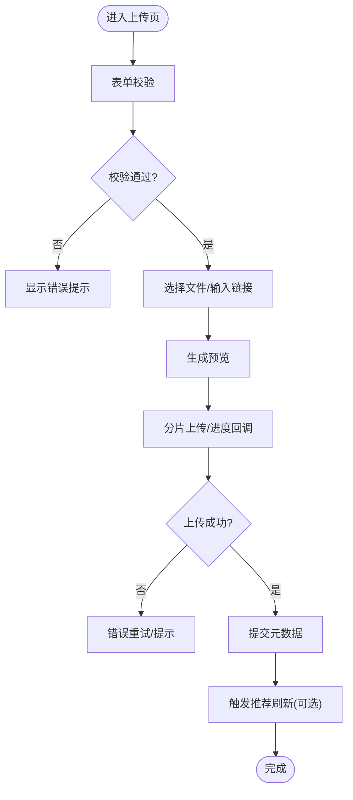
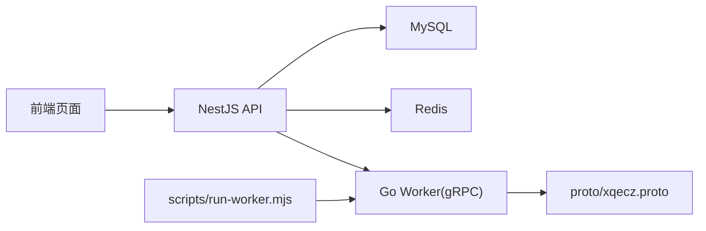

# 页面模块

<cite>
**本文引用的文件**   
- [packages/frontend/src/api/index.ts](file://packages/frontend/src/api/index.ts)
- [proto/xqecz.proto](file://proto/xqecz.proto)
- [scripts/run-worker.mjs](file://scripts/run-worker.mjs)
- [package.json](file://package.json)
- [pnpm-workspace.yaml](file://pnpm-workspace.yaml)
</cite>

## 目录
1. [引言](#引言)
2. [项目结构](#项目结构)
3. [核心组件](#核心组件)
4. [架构总览](#架构总览)
5. [详细组件分析](#详细组件分析)
6. [依赖分析](#依赖分析)
7. [性能考虑](#性能考虑)
8. [故障排查指南](#故障排查指南)
9. [结论](#结论)
10. [附录](#附录)

## 引言
本章节面向 xqecz 平台的“页面模块”，目标是系统化说明首页、内容详情页、上传页、用户中心与管理后台等页面的功能设计、实现要点与最佳实践。结合项目定位（二创内容平台：图片/视频/图文/链接，含评论、投票、管理后台），文档将覆盖路由配置、导航逻辑、页面间数据传递、页面级状态管理、数据获取策略与缓存方案、权限控制与访问验证、性能优化（懒加载/预加载）以及开发规范。

## 项目结构
仓库采用 monorepo 组织，前端位于 packages/frontend，API 服务位于 packages/api，计算 worker 位于 packages/worker，gRPC 契约定义在 proto/xqecz.proto。启动方式统一通过 pnpm 脚本：本地开发使用 pnpm dev，生产模式使用 pnpm start。

图表来源
- [package.json:1-20](file://package.json#L1-L20)
- [pnpm-workspace.yaml:1-20](file://pnpm-workspace.yaml#L1-L20)
- [proto/xqecz.proto:1-40](file://proto/xqecz.proto#L1-L40)
- [scripts/run-worker.mjs:1-40](file://scripts/run-worker.mjs#L1-L40)

章节来源
- [package.json:1-20](file://package.json#L1-L20)
- [pnpm-workspace.yaml:1-20](file://pnpm-workspace.yaml#L1-L20)

## 核心组件
- 前后端接口契约：packages/frontend/src/api/index.ts 是前端唯一对外 API 调用入口，所有响应统一为 { code, message, data } 包装格式。
- gRPC 契约：proto/xqecz.proto 定义了 NestJS 与 Go Worker 之间的通信协议；NestJS 客户端启用 keepCase:true，字段使用 snake_case。
- Worker 启动：scripts/run-worker.mjs 负责注入环境变量并启动无状态 gRPC 服务，不直连数据库，仅做纯计算。

章节来源
- [packages/frontend/src/api/index.ts:1-200](file://packages/frontend/src/api/index.ts#L1-L200)
- [proto/xqecz.proto:1-200](file://proto/xqecz.proto#L1-L200)
- [scripts/run-worker.mjs:1-100](file://scripts/run-worker.mjs#L1-L100)

## 架构总览
页面模块的运行时交互遵循“前端 → NestJS API → (可选) gRPC Worker”的链路。推荐的数据流路径用于热点推荐：NestJS 读取 MySQL，调用 gRPC RefreshRecommend 由 Worker 打分，再将结果写回 Redis ZSet（keyPrefix=xqecz:）。读取时若缓存不可用则降级为 view_count 排序。

图表来源
- [packages/frontend/src/api/index.ts:1-200](file://packages/frontend/src/api/index.ts#L1-L200)
- [proto/xqecz.proto:1-200](file://proto/xqecz.proto#L1-L200)
- [scripts/run-worker.mjs:1-100](file://scripts/run-worker.mjs#L1-L100)

## 详细组件分析

### 首页（内容聚合与推荐）
- 功能目标：展示热门/推荐内容列表，支持分页、筛选与搜索。
- 数据获取策略：优先从 Redis ZSet（recommend:hot）读取；不可用时降级到 MySQL 按 view_count 排序。
- 页面级状态：列表数据、分页参数、筛选条件、加载态与错误态。
- 缓存方案：服务端 Redis 缓存 + 前端短期内存缓存（避免重复请求）。
- 性能优化：虚拟滚动、图片懒加载、骨架屏占位、增量更新。

章节来源
- [packages/frontend/src/api/index.ts:1-200](file://packages/frontend/src/api/index.ts#L1-L200)

### 内容详情页（单条内容展示与互动）
- 功能目标：展示标题、摘要、正文/媒体、评论、点赞/收藏、分享等。
- 数据获取策略：先读缓存（内存或 Redis），未命中再请求 API；评论采用分页拉取。
- 页面级状态：详情数据、评论列表、操作反馈（点赞/收藏成功/失败）、错误处理。
- 权限控制：根据登录态决定评论/点赞/收藏按钮可见性与可点击性。
- 性能优化：媒体资源按需加载、评论分页与去抖、防重复提交。

章节来源
- [packages/frontend/src/api/index.ts:1-200](file://packages/frontend/src/api/index.ts#L1-L200)

### 上传页（内容发布）
- 功能目标：支持图片/视频/图文/链接上传与预览，填写元数据并提交。
- 数据获取策略：分片上传、断点续传（可选）、进度回调；提交后异步刷新推荐。
- 页面级状态：表单校验、上传进度、预览图、错误提示。
- 权限控制：需登录且具备上传权限；管理员可审核待审内容。
- 性能优化：压缩与转码（后端）、分块并发上传、取消上传、错误重试。

章节来源
- [packages/frontend/src/api/index.ts:1-200](file://packages/frontend/src/api/index.ts#L1-L200)

### 用户中心（个人信息与历史）
- 功能目标：查看个人资料、修改密码、查看上传历史、收藏/点赞记录。
- 数据获取策略：登录后拉取用户信息与历史记录；支持分页与筛选。
- 页面级状态：用户信息、历史记录列表、编辑态、错误处理。
- 权限控制：仅本人可访问；管理员可跨用户视图（后台）。
- 性能优化：列表分页、图片懒加载、表单去抖保存。

章节来源
- [packages/frontend/src/api/index.ts:1-200](file://packages/frontend/src/api/index.ts#L1-L200)

### 管理后台（内容与用户管理）
- 功能目标：内容审核、标签管理、用户管理、数据统计、系统配置。
- 数据获取策略：批量查询、导出、统计聚合；敏感操作二次确认。
- 页面级状态：表格数据、筛选条件、操作反馈、权限菜单。
- 权限控制：基于角色的访问控制（RBAC），路由守卫拦截未授权访问。
- 性能优化：大数据表格虚拟滚动、批量操作、延迟加载子模块。

章节来源
- [packages/frontend/src/api/index.ts:1-200](file://packages/frontend/src/api/index.ts#L1-L200)

### 路由配置与导航逻辑
- 路由划分：首页、详情页、上传页、用户中心、管理后台等独立路由。
- 导航逻辑：顶部导航栏与侧边栏联动，当前路由高亮；面包屑导航增强可发现性。
- 路由守卫：未登录跳转登录页；角色不足跳转 403；动态菜单根据权限生成。
- 页面间数据传递：URL 参数、路由状态、全局状态（用户信息、权限）、事件总线（轻量场景）。

章节来源
- [packages/frontend/src/api/index.ts:1-200](file://packages/frontend/src/api/index.ts#L1-L200)

### 页面级状态管理与数据获取策略
- 状态管理：页面级状态优先，必要时下沉至全局状态（用户、权限、主题）。
- 数据获取：统一封装 API 调用，处理 {code,message,data} 响应；错误分类与提示。
- 缓存策略：前端短期内存缓存 + 服务端 Redis 缓存；合理设置过期时间。
- 降级机制：缓存不可用时回退到数据库直查；gRPC 失败时降级为默认排序。

章节来源
- [packages/frontend/src/api/index.ts:1-200](file://packages/frontend/src/api/index.ts#L1-L200)

### 权限控制、路由守卫与访问验证
- 认证流程：登录获取 token，存储于安全位置；请求头携带 token。
- 授权模型：基于角色的访问控制（RBAC），菜单与按钮级权限控制。
- 路由守卫：在进入页面前校验登录态与角色；未授权重定向或显示 403。
- 访问验证：敏感操作二次确认；服务端再次校验权限。

章节来源
- [packages/frontend/src/api/index.ts:1-200](file://packages/frontend/src/api/index.ts#L1-L200)

### 性能优化、懒加载与预加载策略
- 懒加载：路由级代码分割、组件懒加载、图片懒加载、评论分页加载。
- 预加载：关键页面（首页、详情页）预加载必要资源；首屏骨架屏提升感知速度。
- 缓存：浏览器缓存、Service Worker（可选）、内存缓存与服务器缓存协同。
- 网络优化：HTTP/2、CDN 加速、Gzip/Brotli 压缩、请求合并与去抖。

章节来源
- [packages/frontend/src/api/index.ts:1-200](file://packages/frontend/src/api/index.ts#L1-L200)

## 依赖分析
页面模块依赖前端 API 封装、gRPC 契约与 Worker 启动脚本。NestJS 作为 API 层协调 MySQL 与 Redis，Worker 提供无状态计算能力。

图表来源
- [packages/frontend/src/api/index.ts:1-200](file://packages/frontend/src/api/index.ts#L1-L200)
- [proto/xqecz.proto:1-200](file://proto/xqecz.proto#L1-L200)
- [scripts/run-worker.mjs:1-100](file://scripts/run-worker.mjs#L1-L100)

章节来源
- [packages/frontend/src/api/index.ts:1-200](file://packages/frontend/src/api/index.ts#L1-L200)
- [proto/xqecz.proto:1-200](file://proto/xqecz.proto#L1-L200)
- [scripts/run-worker.mjs:1-100](file://scripts/run-worker.mjs#L1-L100)

## 性能考虑
- 首屏优化：减少主包体积、启用 Tree Shaking、按需加载组件。
- 渲染优化：虚拟列表、防抖节流、避免不必要的重渲染。
- 网络优化：请求去重、缓存策略、错误重试与超时控制。
- 资源优化：图片压缩、视频转码、CDN 分发。

[本节为通用指导，无需特定文件引用]

## 故障排查指南
- 常见问题：API 响应非预期、缓存失效、gRPC 连接失败、上传中断。
- 排查步骤：检查网络请求、查看控制台日志、验证缓存键、确认 Worker 状态。
- 降级策略：gRPC 失败时回退默认排序；外部依赖缺失时降级功能。
- 监控告警：关键指标上报（QPS、错误率、延迟）、异常告警通知。

章节来源
- [packages/frontend/src/api/index.ts:1-200](file://packages/frontend/src/api/index.ts#L1-L200)

## 结论
xqecz 平台的页面模块以清晰的分层与职责分离为基础，通过统一的 API 契约与 gRPC 协作，实现了高效的内容展示、上传与管理系统。遵循本文档的规范与实践，可确保页面性能、用户体验与可维护性达到高标准。

[本节为总结，无需特定文件引用]

## 附录
- 开发规范：命名约定、代码风格、注释规范、测试要求。
- 最佳实践：状态管理、缓存策略、错误处理、安全加固。
- 部署指南：本地开发、生产构建、环境变量配置。

[本节为补充信息，无需特定文件引用]