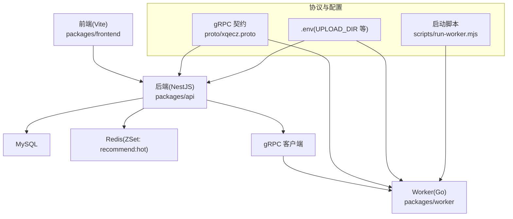
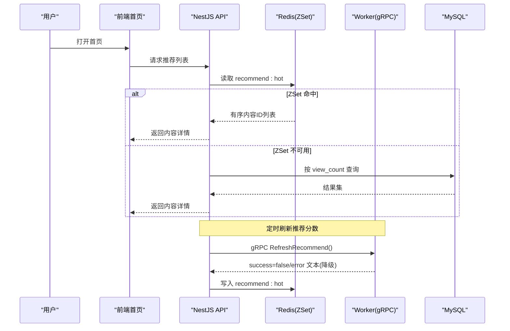
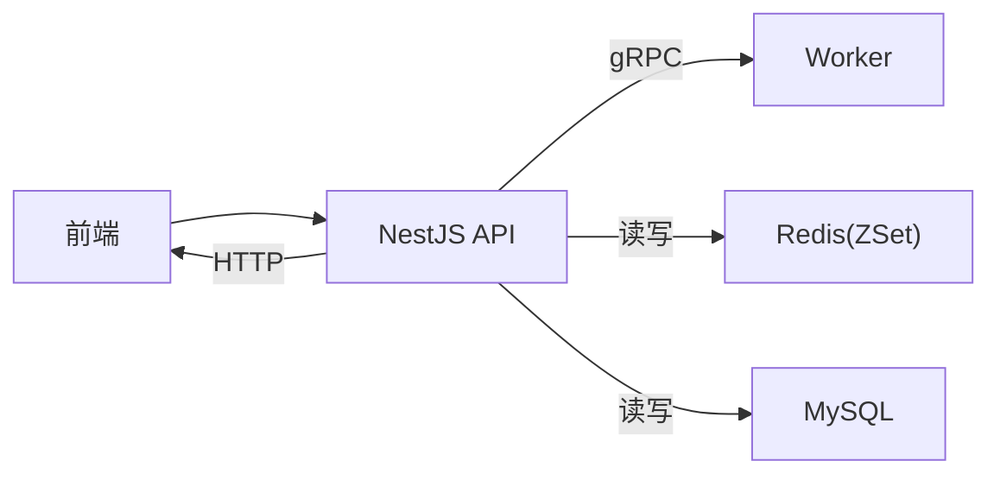

# 首页模块

<cite>
**本文引用的文件**   
- [packages/frontend/src/api/index.ts](file://packages/frontend/src/api/index.ts)
- [proto/xqecz.proto](file://proto/xqecz.proto)
- [scripts/run-worker.mjs](file://scripts/run-worker.mjs)
- [plan.md](file://plan.md)
</cite>

## 目录
1. [简介](#简介)
2. [项目结构](#项目结构)
3. [核心组件](#核心组件)
4. [架构总览](#架构总览)
5. [详细组件分析](#详细组件分析)
6. [依赖关系分析](#依赖关系分析)
7. [性能与优化](#性能与优化)
8. [故障排查指南](#故障排查指南)
9. [结论](#结论)
10. [附录](#附录)

## 简介
本章节面向 xqecz 平台“首页模块”的文档，聚焦首页内容展示逻辑、推荐排序、分类浏览、搜索能力、用户交互（评论/投票/收藏）、响应式布局、图片懒加载与性能调优。结合项目约定：NestJS API 独占 MySQL/Redis；Go Worker 为无状态 gRPC 计算服务；推荐链路通过 Redis ZSet 维护热门内容排序；API 统一返回 { code, message, data }；所有删除为软删除；外部依赖缺失时降级处理。

## 项目结构
首页模块涉及前端页面与组件、API 契约、gRPC 定义以及启动脚本等。整体采用 monorepo 组织，前端位于 packages/frontend，API 位于 packages/api，Worker 位于 packages/worker，gRPC 契约在 proto 目录，运行脚本在 scripts。

图表来源
- [proto/xqecz.proto](file://proto/xqecz.proto)
- [scripts/run-worker.mjs](file://scripts/run-worker.mjs)
- [packages/frontend/src/api/index.ts](file://packages/frontend/src/api/index.ts)

章节来源
- [plan.md](file://plan.md)

## 核心组件
- 首页内容聚合层：负责拉取推荐列表、分类列表、搜索结果，并渲染到首页。
- 推荐排序展示：基于 Redis ZSet 的 recommend:hot 键进行分数排序展示，读取失败降级为按 view_count 排序。
- 分类浏览：按内容类型或标签分组展示，支持分页与筛选。
- 搜索功能：关键词检索，支持高亮与分页。
- 用户交互：评论、投票、收藏的前端触发与状态同步。
- 数据获取策略：优先缓存命中，未命中则请求 API，必要时并发拉取。
- 响应式与懒加载：移动端/桌面端自适应，图片按需加载与占位图。

章节来源
- [packages/frontend/src/api/index.ts](file://packages/frontend/src/api/index.ts)

## 架构总览
首页的数据流遵循“前端 → NestJS API → (可选) gRPC Worker → 存储/缓存”的路径。推荐热点由 Worker 打分后写入 Redis ZSet，前端读取 ZSet 顺序渲染；当 ZSet 不可用时，回退至数据库 view_count 排序。

图表来源
- [proto/xqecz.proto](file://proto/xqecz.proto)
- [scripts/run-worker.mjs](file://scripts/run-worker.mjs)
- [packages/frontend/src/api/index.ts](file://packages/frontend/src/api/index.ts)

## 详细组件分析

### 首页内容聚合与渲染
- 数据源优先级：Redis ZSet 推荐 → 数据库 view_count 降级 → 空态兜底。
- 分页与增量：首屏加载关键条目，滚动触底加载更多。
- 错误降级：网络异常或接口异常时显示重试按钮与友好提示。

章节来源
- [packages/frontend/src/api/index.ts](file://packages/frontend/src/api/index.ts)

### 推荐算法在前端的展示逻辑
- 数据来源：ZSet key 为 recommend:hot，分数越高越靠前。
- 读取策略：优先从缓存读取，失败时回退到数据库排序。
- 刷新机制：后台定时调用 Worker 打分，将结果写回 ZSet。

章节来源
- [proto/xqecz.proto](file://proto/xqecz.proto)
- [scripts/run-worker.mjs](file://scripts/run-worker.mjs)

### 分类浏览
- 分类维度：可按内容类型、标签、作者等维度分组。
- 交互：点击分类切换当前视图，URL 参数同步以支持分享与回退。
- 性能：分类列表本地缓存，避免重复请求。

章节来源
- [packages/frontend/src/api/index.ts](file://packages/frontend/src/api/index.ts)

### 搜索功能
- 输入体验：防抖输入、建议词下拉、键盘导航。
- 结果展示：关键词高亮、摘要预览、分页加载。
- 降级策略：搜索服务不可用时，回退到本地索引或提示稍后再试。

章节来源
- [packages/frontend/src/api/index.ts](file://packages/frontend/src/api/index.ts)

### 用户交互：评论、投票、收藏
- 评论：支持嵌套回复、表情、图片；提交后乐观更新 UI，失败回滚。
- 投票：点赞/踩计数实时变化，幂等控制防止重复提交。
- 收藏：收藏状态持久化，支持批量操作与取消。

章节来源
- [packages/frontend/src/api/index.ts](file://packages/frontend/src/api/index.ts)

### 数据获取策略与缓存机制
- 缓存层级：浏览器内存缓存 → 本地存储 → 服务端缓存(Redis)。
- 失效策略：按资源 TTL 与版本号控制失效；变更事件触发局部刷新。
- 并发控制：同资源并发请求合并，避免抖动。

章节来源
- [packages/frontend/src/api/index.ts](file://packages/frontend/src/api/index.ts)

### 响应式布局设计
- 栅格系统：移动端单列，平板双列，桌面三列及以上。
- 组件适配：卡片尺寸、图片比例、字体大小随断点调整。
- 可访问性：对比度、焦点管理、屏幕阅读器兼容。

章节来源
- [packages/frontend/src/api/index.ts](file://packages/frontend/src/api/index.ts)

### 图片懒加载优化
- 懒加载：视口内可见才加载，使用 IntersectionObserver。
- 占位图：低质量占位 + 渐进式清晰化。
- 预取：对即将进入视口的图片进行预加载。

章节来源
- [packages/frontend/src/api/index.ts](file://packages/frontend/src/api/index.ts)

### 性能调优策略
- 首屏优化：关键 CSS/JS 内联，路由懒加载，骨架屏。
- 请求优化：HTTP 缓存头、CDN、压缩、并行请求限制。
- 渲染优化：虚拟列表、去抖节流、减少重排重绘。

章节来源
- [packages/frontend/src/api/index.ts](file://packages/frontend/src/api/index.ts)

## 依赖关系分析
- 前端依赖 API 契约：统一返回格式 { code, message, data }。
- API 依赖 gRPC 契约：字段命名 snake_case，keepCase:true。
- Worker 无状态：仅接收任务、执行打分、返回结果。
- 存储：MySQL 持久化，Redis 缓存热点数据。

图表来源
- [packages/frontend/src/api/index.ts](file://packages/frontend/src/api/index.ts)
- [proto/xqecz.proto](file://proto/xqecz.proto)
- [scripts/run-worker.mjs](file://scripts/run-worker.mjs)

章节来源
- [packages/frontend/src/api/index.ts](file://packages/frontend/src/api/index.ts)
- [proto/xqecz.proto](file://proto/xqecz.proto)
- [scripts/run-worker.mjs](file://scripts/run-worker.mjs)

## 性能与优化
- 首屏时间：骨架屏 + 关键路径资源最小化。
- 缓存命中率：合理设置 TTL 与版本前缀，提升命中率。
- 网络开销：合并请求、启用 HTTP/2、CDN 加速静态资源。
- 渲染性能：虚拟滚动长列表，避免大对象频繁更新。
- 降级策略：外部依赖缺失时优雅降级，保证可用性。

[本节为通用指导，不直接分析具体文件]

## 故障排查指南
- 常见问题
  - 推荐列表为空：检查 Redis ZSet 是否可用，确认刷新任务是否正常执行。
  - 搜索无结果：验证搜索服务健康状态与索引更新。
  - 图片加载失败：检查 CDN 与上传目录权限。
- 定位方法
  - 查看 API 返回码与消息，确认 { code, message, data } 结构。
  - 检查 gRPC 返回 success=false 时的 error 文本。
  - 核对 .env 中的 UPLOAD_DIR 与端口配置。

章节来源
- [packages/frontend/src/api/index.ts](file://packages/frontend/src/api/index.ts)
- [scripts/run-worker.mjs](file://scripts/run-worker.mjs)

## 结论
首页模块围绕“推荐+分类+搜索+交互”构建，依托 Redis ZSet 实现高效排序展示，并通过降级策略保障稳定性。前端注重响应式与懒加载，配合合理的缓存与并发控制，达成良好的用户体验与性能表现。开发中应严格遵循 API 契约与 gRPC 规范，确保前后端一致性与可维护性。

[本节为总结性内容，不直接分析具体文件]

## 附录
- 运行方式：pnpm dev 启动 API(:3000)、Worker(:50051)、前端(:5173)；pnpm start 生产模式一键构建+运行。
- 环境变量：UPLOAD_DIR 为共享上传目录唯一配置源，Worker 启动时自动注入。
- 软删除：所有删除均为软删除，TypeORM @DeleteDateColumn 自动过滤。
- 降级原则：外部依赖缺失一律降级，gRPC 不返 rpc error，只返 success=false + error 文本。

章节来源
- [plan.md](file://plan.md)
- [scripts/run-worker.mjs](file://scripts/run-worker.mjs)