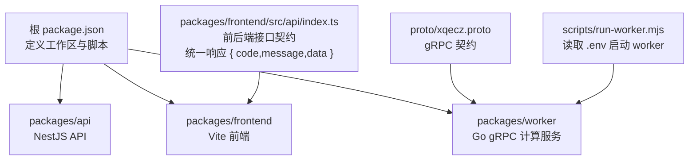
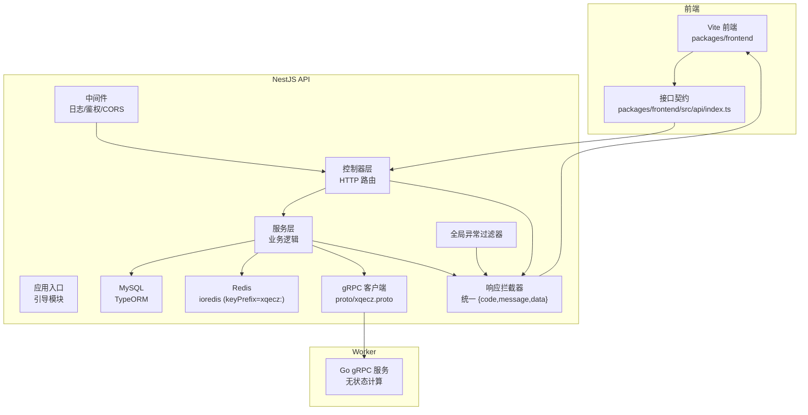
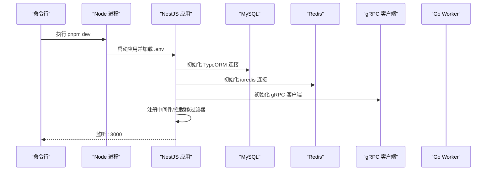
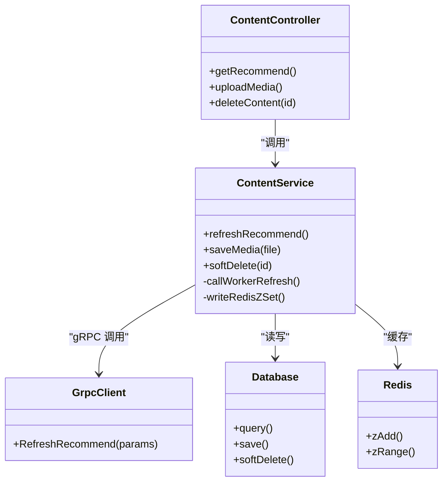
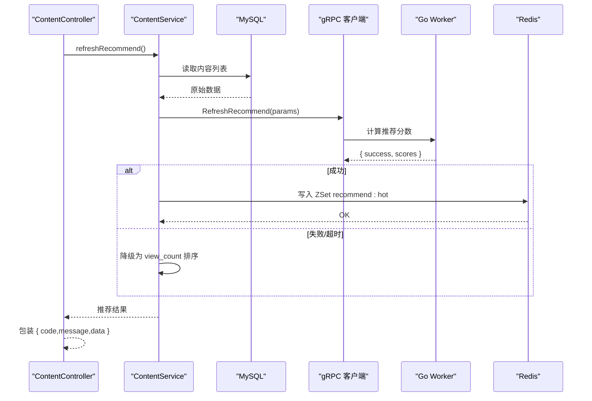
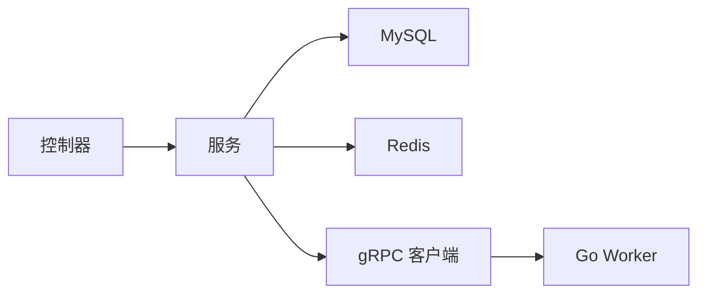

# API 架构设计

<cite>
**本文引用的文件**   
- [package.json](file://package.json)
- [pnpm-workspace.yaml](file://pnpm-workspace.yaml)
- [plan.md](file://plan.md)
- [AGENTS.md](file://AGENTS.md)
- [xqecz.proto](file://proto/xqecz.proto)
- [run-worker.mjs](file://scripts/run-worker.mjs)
- [index.ts](file://packages/frontend/src/api/index.ts)
</cite>

## 目录
1. [简介](#简介)
2. [项目结构](#项目结构)
3. [核心组件](#核心组件)
4. [架构总览](#架构总览)
5. [详细组件分析](#详细组件分析)
6. [依赖关系分析](#依赖关系分析)
7. [性能考量](#性能考量)
8. [故障排查指南](#故障排查指南)
9. [结论](#结论)
10. [附录](#附录)

## 简介
本文件面向 xqecz 平台的 NestJS API 架构，系统性阐述模块化设计、启动流程、中间件与全局配置、RESTful 规范、统一响应格式 { code, message, data }、依赖注入模式、错误处理、请求验证与响应拦截器。同时提供创建新模块/控制器/服务的步骤示例，帮助开发者快速上手并遵循平台约定。

## 项目结构
仓库采用 pnpm monorepo，核心后端位于 packages/api（NestJS），Go Worker 为无状态 gRPC 计算服务，前端位于 packages/frontend。根目录脚本通过 pnpm dev 一键启动三端：NestJS(:3000)、Worker(:50051)、Vite(:5173)。生产构建与运行使用 pnpm start。

图表来源
- [package.json](file://package.json)
- [pnpm-workspace.yaml](file://pnpm-workspace.yaml)
- [xqecz.proto](file://proto/xqecz.proto)
- [run-worker.mjs](file://scripts/run-worker.mjs)
- [index.ts](file://packages/frontend/src/api/index.ts)

章节来源
- [package.json](file://package.json)
- [pnpm-workspace.yaml](file://pnpm-workspace.yaml)
- [plan.md](file://plan.md)
- [AGENTS.md](file://AGENTS.md)

## 核心组件
- 应用模块与入口
  - NestJS 应用由主模块引导，加载数据库、缓存、gRPC 客户端、路由与中间件等全局配置。
  - 环境变量集中管理于 packages/api/.env，上传目录 UPLOAD_DIR、Redis keyPrefix=xqecz:、gRPC 目标地址等。
- 控制器层
  - 负责 HTTP 请求解析、参数校验、调用服务层、返回统一响应体 { code, message, data }。
- 服务层
  - 封装业务逻辑，访问 MySQL/Redis，调用 gRPC 客户端与外部服务（如 Tinify/S3/FFmpeg）并做降级处理。
- gRPC 客户端
  - 基于 proto/xqecz.proto 生成客户端，字段保持 snake_case，keepCase:true，用于与 Go Worker 通信。
- 统一响应与错误处理
  - 所有 API 响应包装为 { code, message, data }；异常经全局异常过滤器转换为标准错误响应。
- 中间件与拦截器
  - 中间件用于日志、鉴权、CORS、速率限制等；响应拦截器统一格式化输出。

章节来源
- [index.ts](file://packages/frontend/src/api/index.ts)
- [xqecz.proto](file://proto/xqecz.proto)
- [run-worker.mjs](file://scripts/run-worker.mjs)

## 架构总览
下图展示 NestJS API 与 Go Worker、MySQL、Redis 的交互关系，以及前后端统一响应契约。

图表来源
- [xqecz.proto](file://proto/xqecz.proto)
- [index.ts](file://packages/frontend/src/api/index.ts)
- [run-worker.mjs](file://scripts/run-worker.mjs)

## 详细组件分析

### 应用启动流程与全局配置
- 启动流程
  - 执行 pnpm dev，Node 进程启动 NestJS 应用，加载 .env 环境变量。
  - 初始化 TypeORM 连接 MySQL，初始化 ioredis 连接 Redis（设置 keyPrefix）。
  - 注册 gRPC 客户端，指向 Go Worker 端口 :50051。
  - 挂载中间件（日志、CORS、鉴权等）、全局异常过滤器、响应拦截器。
  - 启动 HTTP 服务器监听 :3000。
- 全局配置要点
  - 数据库连接、缓存连接、gRPC 目标地址、上传目录 UPLOAD_DIR 均从 .env 读取。
  - 统一响应格式在响应拦截器中实现，确保所有返回体一致。
  - 软删除策略由 ORM 层自动过滤 deleted_at。

图表来源
- [run-worker.mjs](file://scripts/run-worker.mjs)
- [xqecz.proto](file://proto/xqecz.proto)

章节来源
- [run-worker.mjs](file://scripts/run-worker.mjs)
- [xqecz.proto](file://proto/xqecz.proto)

### 控制器层与服务层职责划分
- 控制器层
  - 接收 HTTP 请求，进行参数校验（DTO + class-validator），调用服务层方法，返回统一响应体。
  - 不直接访问数据库或外部服务，保证职责单一。
- 服务层
  - 实现业务逻辑，组合多个数据源（MySQL、Redis、gRPC、对象存储等），处理降级与重试。
  - 对异常进行捕获并转换为业务错误码与消息。

图表来源
- [xqecz.proto](file://proto/xqecz.proto)

章节来源
- [xqecz.proto](file://proto/xqecz.proto)

### RESTful API 设计规范与统一响应
- 路径与动词
  - 资源命名使用复数名词，动词使用 HTTP 方法表达操作语义。
  - 分页查询使用 query 参数，排序与过滤使用标准化键名。
- 统一响应体
  - 成功：{ code: 0, message: "success", data: ... }
  - 失败：{ code: 非0, message: "错误描述", data: null }
- 错误码约定
  - 业务错误码按模块划分，系统级错误码独立；message 面向用户可读。
- 文档契约
  - 前后端唯一接口契约位于 packages/frontend/src/api/index.ts，API 响应统一为该格式。

章节来源
- [index.ts](file://packages/frontend/src/api/index.ts)

### 依赖注入模式在控制器与服务层中的应用
- 控制器通过构造函数注入服务实例，服务通过构造函数注入仓储、缓存、gRPC 客户端等。
- 模块内共享服务可通过 @Injectable() 与模块 providers 注册，跨模块通过 forRoot 或动态模块注入。
- 避免循环依赖，必要时使用抽象类或接口解耦。

章节来源
- [xqecz.proto](file://proto/xqecz.proto)

### 错误处理机制、请求验证与响应拦截器
- 错误处理
  - 全局异常过滤器捕获未处理异常，转换为统一错误响应；业务异常在服务层抛出并携带错误码。
- 请求验证
  - 使用 DTO + class-validator 注解校验输入，非法请求直接返回 400 与统一错误体。
- 响应拦截器
  - 统一包装返回值，确保 { code, message, data } 格式；记录耗时与关键上下文。

章节来源
- [index.ts](file://packages/frontend/src/api/index.ts)

### 创建新模块、控制器与服务的步骤示例
- 新建模块
  - 在 packages/api 下创建模块目录，定义模块类并导出 providers。
  - 将服务加入模块 providers，控制器加入 controllers。
- 新建控制器
  - 定义控制器类，使用装饰器声明路由与方法，注入服务。
- 新建服务
  - 定义服务类，实现业务逻辑，注入数据库、缓存、gRPC 客户端等依赖。
- 注意事项
  - 所有对外暴露的 API 需遵循统一响应格式。
  - 涉及 gRPC 调用时，遵循 proto 字段命名与 keepCase:true。

章节来源
- [xqecz.proto](file://proto/xqecz.proto)

### gRPC 调用与降级策略
- 调用链路
  - ContentService.refreshRecommend() 读 MySQL → gRPC RefreshRecommend → Worker 纯打分 → 写 Redis ZSet recommend:hot。
  - 读取时若 Redis 不可用或为空，降级为 view_count 排序。
- 降级与容错
  - Worker 缺失或超时：返回 success=false 与 error 文本，NestJS 侧降级到本地排序。
  - 外部依赖（Tinify/S3/FFmpeg）缺失：跳过增强步骤，继续主流程。

图表来源
- [xqecz.proto](file://proto/xqecz.proto)

章节来源
- [xqecz.proto](file://proto/xqecz.proto)

### 上传与归档策略
- 上传目录
  - 通过 UPLOAD_DIR 环境变量指定，单一配置源为 packages/api/.env。
- 软删除
  - 所有删除均为软删除，使用 deleted_at 字段，ORM 自动过滤。
- 外部依赖
  - 图片压缩、转码、对象存储等缺失时降级，不影响主流程。

章节来源
- [run-worker.mjs](file://scripts/run-worker.mjs)

## 依赖关系分析
- 模块耦合
  - 控制器仅依赖服务，服务依赖数据源与 gRPC 客户端，层次清晰。
- 外部依赖
  - MySQL、Redis、gRPC、对象存储、媒体处理工具等，均支持降级。
- 循环依赖
  - 通过抽象接口与模块边界避免循环依赖。

图表来源
- [xqecz.proto](file://proto/xqecz.proto)

章节来源
- [xqecz.proto](file://proto/xqecz.proto)

## 性能考量
- 缓存优先
  - 热点数据写入 Redis ZSet，读取优先命中缓存，未命中再回源。
- 异步与批处理
  - 推荐刷新可异步触发，批量更新减少 IO 次数。
- 连接池与超时
  - 合理配置数据库与 Redis 连接池大小与超时时间。
- 降级策略
  - 外部依赖不可用时快速失败并降级，保障可用性。

## 故障排查指南
- 常见问题
  - 端口冲突：确认 :3000/:50051/:5173 未被占用。
  - 环境变量缺失：检查 packages/api/.env 是否包含必要变量。
  - gRPC 连接失败：确认 Worker 已启动且端口可达。
  - 缓存异常：检查 Redis 连通性与 keyPrefix。
- 定位手段
  - 查看中间件日志与响应拦截器输出。
  - 使用全局异常过滤器捕获的错误信息。
  - 逐步断点调试服务层与 gRPC 调用。

## 结论
本架构以 NestJS 为核心，结合 Go Worker 的无状态计算能力，形成高内聚、低耦合的分层体系。通过统一响应格式、严格的路由与验证、完善的错误处理与降级策略，保障了系统的稳定性与可维护性。开发者可按本文档指引快速扩展新功能并保持风格一致。

## 附录
- 启动命令
  - 开发：pnpm dev
  - 生产：pnpm start
- 关键约定
  - 统一响应格式：{ code, message, data }
  - gRPC 字段：snake_case，keepCase:true
  - 上传目录：UPLOAD_DIR
  - 缓存前缀：xqecz: