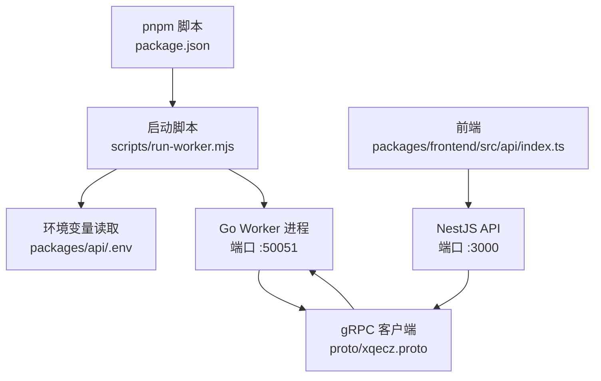
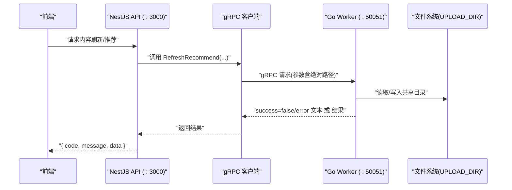
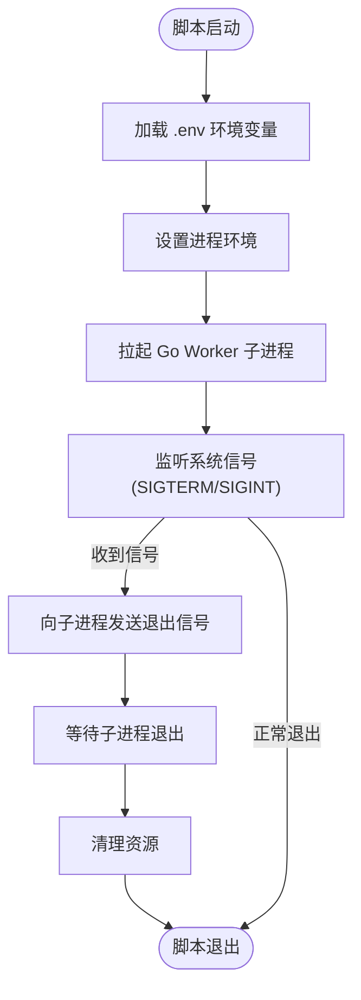
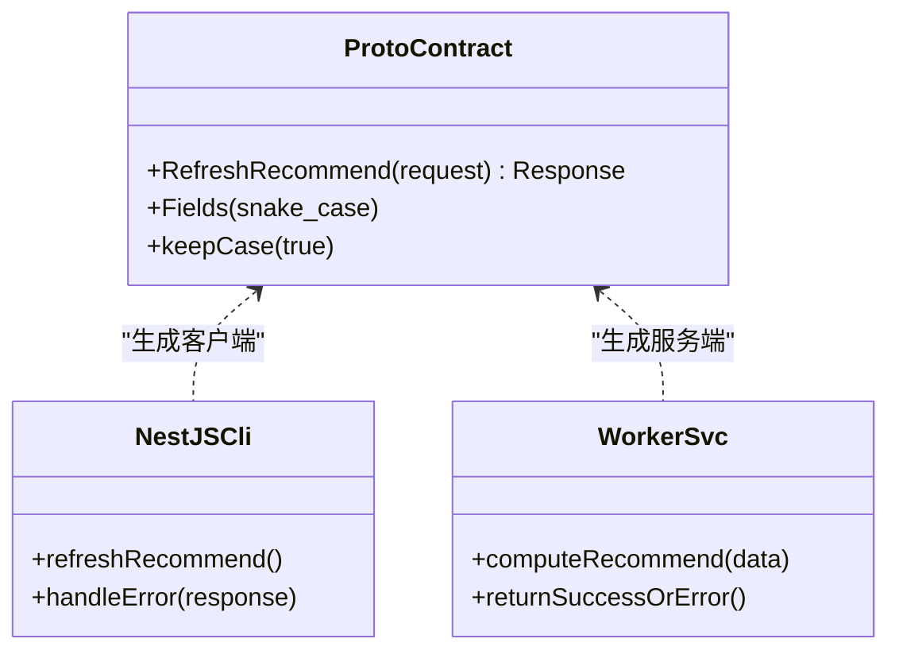
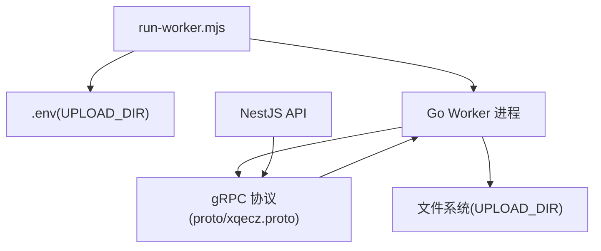

# Worker 服务管理

<cite>
**本文引用的文件**   
- [scripts/run-worker.mjs](file://scripts/run-worker.mjs)
- [packages/api/.env](file://packages/api/.env)
- [proto/xqecz.proto](file://proto/xqecz.proto)
- [packages/worker/proto](file://packages/worker/proto)
- [packages/frontend/src/api/index.ts](file://packages/frontend/src/api/index.ts)
- [package.json](file://package.json)
</cite>

## 目录
1. [简介](#简介)
2. [项目结构](#项目结构)
3. [核心组件](#核心组件)
4. [架构总览](#架构总览)
5. [详细组件分析](#详细组件分析)
6. [依赖关系分析](#依赖关系分析)
7. [性能考量](#性能考量)
8. [故障排查指南](#故障排查指南)
9. [结论](#结论)
10. [附录](#附录)

## 简介
本文件面向 xqecz 平台的 Worker 服务管理，聚焦于启动脚本 scripts/run-worker.mjs 的功能与使用方式，解释环境变量注入机制（特别是 UPLOAD_DIR 共享目录），说明进程管理与守护进程配置，提供服务的启动、停止、重启操作指引，并涵盖日志输出与监控集成建议。同时给出生产环境部署建议、常见问题解决方案与性能调优指南。

项目定位：小泉动漫二创站（xqecz）——用户上传/浏览二次创作内容（图片、视频、图文、链接），含评论、投票、管理后台。运行方式以 pnpm 脚本本地直启为主：pnpm dev 启动 NestJS API(:3000)、Go Worker(:50051)、Vite 前端(:5173)；pnpm start 为生产模式一键构建+运行。Worker 是无状态 gRPC 计算服务，不连接数据库，数据经 gRPC 从 NestJS 传入、结果回传 NestJS 落库或写缓存。

## 项目结构
- scripts/run-worker.mjs：Worker 的启动脚本，负责加载环境变量、拉起 Go Worker 进程、处理信号与退出流程。
- packages/api/.env：统一的环境变量来源，包含 UPLOAD_DIR 等关键配置。
- proto/xqecz.proto：gRPC 契约定义，NestJS 客户端与 Worker 均基于此进行通信。
- packages/worker/proto：由 proto 生成的代码产物，供 Worker 侧实现调用。
- packages/frontend/src/api/index.ts：前后端接口契约，API 响应统一包装格式 { code, message, data }。
- package.json：顶层脚本入口，pnpm dev/start 等命令在此定义。

图表来源
- [package.json](file://package.json)
- [scripts/run-worker.mjs](file://scripts/run-worker.mjs)
- [packages/api/.env](file://packages/api/.env)
- [proto/xqecz.proto](file://proto/xqecz.proto)

章节来源
- [package.json](file://package.json)
- [scripts/run-worker.mjs](file://scripts/run-worker.mjs)
- [packages/api/.env](file://packages/api/.env)
- [proto/xqecz.proto](file://proto/xqecz.proto)

## 核心组件
- 启动脚本 run-worker.mjs
  - 职责：读取 .env 环境变量（尤其是 UPLOAD_DIR），设置进程环境，拉起 Go Worker 进程，监听系统信号（如 SIGTERM/SIGINT）进行优雅关闭，确保子进程正确退出。
  - 关键点：单一配置源为 packages/api/.env；Worker 通过绝对路径访问共享上传目录；gRPC 端口默认 :50051。
- 环境变量与环境注入
  - 统一来源：packages/api/.env。
  - 关键变量：UPLOAD_DIR（共享上传目录绝对路径）、其他 gRPC/日志相关变量（如有）。
  - 注入方式：run-worker.mjs 在启动前将 .env 中的键值注入到 Node 进程环境，再传递给 Go Worker。
- gRPC 契约
  - 定义位置：proto/xqecz.proto。
  - 约定：NestJS 客户端启用 keepCase:true，字段采用 snake_case；Worker 返回 success=false + error 文本用于降级处理。
- 前端接口契约
  - 位置：packages/frontend/src/api/index.ts。
  - 约定：统一响应格式 { code, message, data }。

章节来源
- [scripts/run-worker.mjs](file://scripts/run-worker.mjs)
- [packages/api/.env](file://packages/api/.env)
- [proto/xqecz.proto](file://proto/xqecz.proto)
- [packages/frontend/src/api/index.ts](file://packages/frontend/src/api/index.ts)

## 架构总览
Worker 作为无状态 gRPC 计算服务，接收来自 NestJS 的请求，执行纯计算任务（如推荐打分），并将结果回传给 NestJS，由 NestJS 负责持久化与缓存。

图表来源
- [proto/xqecz.proto](file://proto/xqecz.proto)
- [packages/api/.env](file://packages/api/.env)
- [scripts/run-worker.mjs](file://scripts/run-worker.mjs)

## 详细组件分析

### 启动脚本 run-worker.mjs
- 功能要点
  - 读取并注入环境变量：优先从 packages/api/.env 加载，覆盖 Node 进程环境。
  - 拉起 Go Worker：以子进程方式启动，继承父进程环境变量。
  - 信号处理：捕获 SIGTERM/SIGINT，向子进程发送退出信号，等待其退出后清理资源。
  - 错误处理：当子进程异常退出时记录日志并退出脚本，避免僵尸进程。
- 使用方式
  - 开发模式：pnpm dev 会同时启动 API、Worker、前端；Worker 由 run-worker.mjs 管理。
  - 生产模式：pnpm start 构建并运行，Worker 同样由该脚本管理。
  - 手动启动：可直接运行 node scripts/run-worker.mjs（需确保 .env 存在且路径正确）。
- 环境变量注入机制
  - 单一配置源：packages/api/.env。
  - 关键变量：UPLOAD_DIR 必须为绝对路径，Worker 通过 gRPC 参数接收并使用。
  - 安全建议：不要在 .env 中暴露敏感信息；如需多环境，按环境复制并命名区分。
- 进程管理与守护进程
  - 当前脚本仅管理子进程生命周期，未内置常驻守护逻辑。
  - 生产环境建议使用系统级守护（如 systemd）或容器编排（若未来恢复容器化）来保证高可用。
  - 优雅关闭：脚本会处理信号并等待子进程退出，避免数据不一致。

图表来源
- [scripts/run-worker.mjs](file://scripts/run-worker.mjs)
- [packages/api/.env](file://packages/api/.env)

章节来源
- [scripts/run-worker.mjs](file://scripts/run-worker.mjs)
- [packages/api/.env](file://packages/api/.env)

### 环境变量与共享目录 UPLOAD_DIR
- 配置来源
  - 唯一配置源：packages/api/.env。
  - 关键变量：UPLOAD_DIR 指定共享上传目录的绝对路径。
- 注入与传递
  - run-worker.mjs 在启动前读取 .env 并注入到 Node 进程环境。
  - Go Worker 子进程继承该环境，并通过 gRPC 参数以绝对路径访问共享目录。
- 注意事项
  - 路径必须是绝对路径，避免跨平台兼容问题。
  - 权限：确保运行 Worker 的用户对 UPLOAD_DIR 有读写权限。
  - 多实例：多个 Worker 实例可共享同一目录，但需注意并发写入冲突。

章节来源
- [scripts/run-worker.mjs](file://scripts/run-worker.mjs)
- [packages/api/.env](file://packages/api/.env)

### gRPC 契约与数据流
- 契约定义
  - 位置：proto/xqecz.proto。
  - 约定：NestJS 客户端启用 keepCase:true，字段采用 snake_case。
- 典型链路
  - ContentService.refreshRecommend() 读 MySQL → gRPC RefreshRecommend 由 Worker 纯打分 → api 写 Redis ZSet recommend:hot（ioredis keyPrefix=xqecz:）。
  - 读取降级：若无推荐数据，则按 view_count 排序。
- 错误处理
  - Worker 不返回 rpc error，而是 success=false + error 文本，便于 NestJS 降级处理。

图表来源
- [proto/xqecz.proto](file://proto/xqecz.proto)
- [packages/api/.env](file://packages/api/.env)

章节来源
- [proto/xqecz.proto](file://proto/xqecz.proto)
- [packages/api/.env](file://packages/api/.env)

### 前端接口契约
- 统一响应格式
  - 位置：packages/frontend/src/api/index.ts。
  - 格式：{ code, message, data }。
- 影响范围
  - 所有后端 API 响应遵循该格式，前端据此处理成功与失败分支。
  - Worker 的错误通过 NestJS 转换为标准响应格式。

章节来源
- [packages/frontend/src/api/index.ts](file://packages/frontend/src/api/index.ts)

## 依赖关系分析
- 启动脚本依赖
  - Node.js 运行时与 fs/path 模块用于读取 .env 与进程管理。
  - Go Worker 二进制或可执行文件，由脚本拉起。
- 运行时依赖
  - gRPC 客户端与服务端基于 proto/xqecz.proto 生成。
  - 文件系统依赖 UPLOAD_DIR 的权限与可用性。
- 外部依赖
  - NestJS API 依赖 MySQL/Redis；Worker 无数据库依赖。
  - 可选：Tinify/S3/FFmpeg 缺失时降级处理。

图表来源
- [scripts/run-worker.mjs](file://scripts/run-worker.mjs)
- [packages/api/.env](file://packages/api/.env)
- [proto/xqecz.proto](file://proto/xqecz.proto)

章节来源
- [scripts/run-worker.mjs](file://scripts/run-worker.mjs)
- [packages/api/.env](file://packages/api/.env)
- [proto/xqecz.proto](file://proto/xqecz.proto)

## 性能考量
- 计算模型
  - Worker 为无状态计算服务，适合水平扩展；可通过增加实例提升吞吐。
- I/O 优化
  - 共享目录 UPLOAD_DIR 的读写性能直接影响整体延迟；建议使用高性能存储（如 SSD）。
  - 避免大文件频繁读写；必要时引入缓存层（如内存缓存或对象存储预取）。
- gRPC 调优
  - 合理设置超时与重试策略；避免长连接阻塞。
  - 批量处理：将多次计算合并为单次请求以减少网络开销。
- 资源限制
  - 为 Worker 设置 CPU/内存上限，防止单实例占用过多资源。
  - 监控指标：CPU、内存、gRPC 请求耗时、错误率。

[本节为通用指导，无需特定文件引用]

## 故障排查指南
- 启动失败
  - 检查 packages/api/.env 是否存在且 UPLOAD_DIR 路径有效。
  - 确认 Node.js 与 Go Worker 可执行文件权限。
  - 查看脚本日志输出，定位环境变量加载与子进程拉起阶段的问题。
- 共享目录权限问题
  - 确保运行用户具备 UPLOAD_DIR 的读写权限。
  - 多实例并发写入时注意锁机制或幂等性设计。
- gRPC 通信异常
  - 核对 proto/xqecz.proto 字段命名与 keepCase:true 配置。
  - 检查 Worker 是否返回 success=false + error 文本而非 rpc error。
- 性能瓶颈
  - 监控 Worker CPU/内存使用；必要时扩容实例。
  - 优化计算逻辑，减少不必要的 I/O 操作。
- 日志与监控
  - 收集 Worker 标准输出与错误输出，集中到日志系统（如 stdout/stderr 管道）。
  - 接入监控系统（如 Prometheus）采集关键指标。

章节来源
- [scripts/run-worker.mjs](file://scripts/run-worker.mjs)
- [packages/api/.env](file://packages/api/.env)
- [proto/xqecz.proto](file://proto/xqecz.proto)

## 结论
scripts/run-worker.mjs 是 xqecz 平台 Worker 服务管理的核心，负责环境变量注入、进程拉起与优雅关闭。通过统一的 .env 配置与 gRPC 契约，实现了 NestJS 与 Worker 的高效协作。生产环境应关注进程守护、日志监控与性能调优，确保服务稳定可靠。

[本节为总结性内容，无需特定文件引用]

## 附录
- 服务操作指南
  - 启动：pnpm dev（开发）或 pnpm start（生产）。
  - 停止：Ctrl+C 或发送 SIGTERM 给脚本进程。
  - 重启：先停止再启动，或使用系统级工具（如 systemd restart）。
- 常见环境变量
  - UPLOAD_DIR：共享上传目录绝对路径。
  - 其他 gRPC/日志变量（如有）：按需配置。
- 参考文件
  - [scripts/run-worker.mjs](file://scripts/run-worker.mjs)
  - [packages/api/.env](file://packages/api/.env)
  - [proto/xqecz.proto](file://proto/xqecz.proto)
  - [packages/frontend/src/api/index.ts](file://packages/frontend/src/api/index.ts)
  - [package.json](file://package.json)