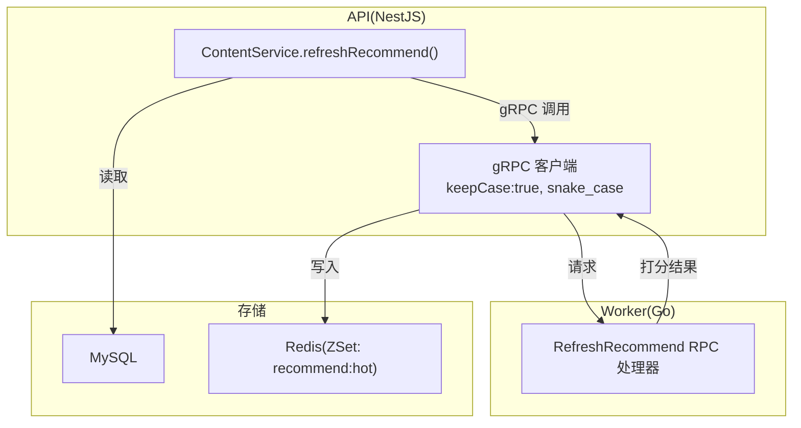
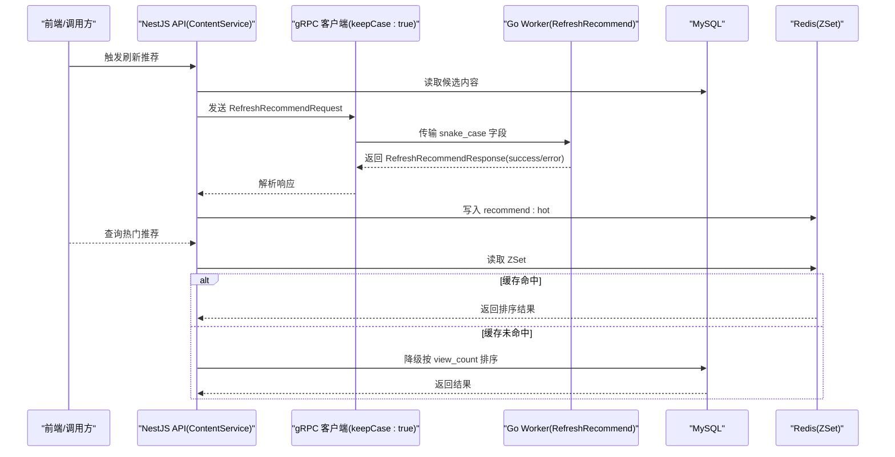
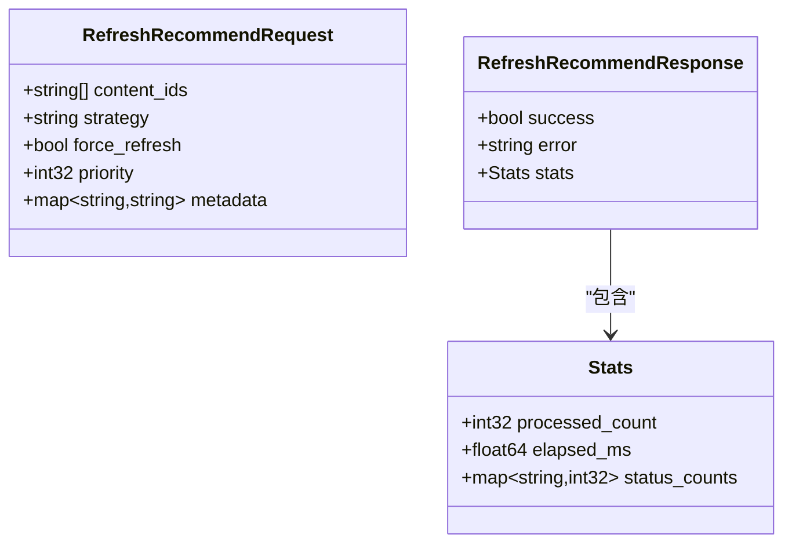
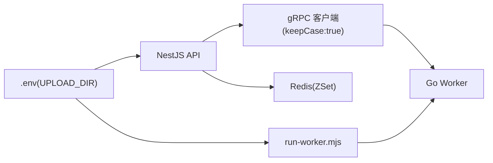

# gRPC 协议定义

<cite>
**本文引用的文件**   
- [proto/xqecz.proto](file://proto/xqecz.proto)
- [packages/api/.env](file://packages/api/.env)
- [scripts/run-worker.mjs](file://scripts/run-worker.mjs)
</cite>

## 目录
1. [简介](#简介)
2. [项目结构](#项目结构)
3. [核心组件](#核心组件)
4. [架构总览](#架构总览)
5. [详细组件分析](#详细组件分析)
6. [依赖关系分析](#依赖关系分析)
7. [性能考量](#性能考量)
8. [故障排查指南](#故障排查指南)
9. [结论](#结论)
10. [附录](#附录)

## 简介
本文件为 xqecz 平台的 gRPC 协议定义文档，聚焦 proto/xqecz.proto 中的消息与服务接口规范。内容涵盖：
- 消息结构与字段类型、约束与默认值
- RPC 方法定义、参数传递与返回值格式
- snake_case 命名约定与 keepCase:true 配置的作用
- 字段验证规则、必填项说明与错误处理策略
- 具体消息示例与序列化格式说明

## 项目结构
xqecz 平台采用 monorepo 组织，gRPC 契约定义位于 proto 目录；NestJS API 作为唯一数据入口（MySQL/Redis），Go worker 作为无状态计算服务通过 gRPC 接收任务并返回结果。

图表来源
- [proto/xqecz.proto](file://proto/xqecz.proto)

章节来源
- [proto/xqecz.proto](file://proto/xqecz.proto)

## 核心组件
- 服务接口
  - 推荐刷新服务：提供 RefreshRecommend 方法，用于触发纯计算的推荐分数更新流程。
- 消息类型
  - 请求消息：RefreshRecommendRequest
  - 响应消息：RefreshRecommendResponse

字段与约束要点
- 字段命名遵循 snake_case，由 NestJS 客户端通过 keepCase:true 保持原始大小写映射到 proto 字段名。
- 所有字段均为可选（proto3 默认行为）；若需强制校验应在上层业务层完成。
- 字符串字段建议设置长度上限与正则校验（如 URL、路径等）。
- 数值字段应设置合理范围（如评分权重、时间戳等）。
- 布尔字段用于开关控制（如是否覆盖缓存、是否异步执行等）。
- 枚举字段限定取值集合，便于前后端一致。

默认值处理
- 未提供的字段使用语言默认值（如 string 为空串、int 为 0、bool 为 false）。
- 对“空即默认”的语义需在业务层显式区分（例如使用 wrapper 或 presence 标记）。

错误处理策略
- Worker 不抛出 rpc error，统一以 success=false + error 文本返回，便于 API 侧降级与日志记录。

章节来源
- [proto/xqecz.proto](file://proto/xqecz.proto)

## 架构总览
推荐链路整体流程如下：
- API 从 MySQL 读取候选内容
- 通过 gRPC 调用 worker 的 RefreshRecommend 进行纯计算打分
- 将结果写入 Redis ZSet（keyPrefix=xqecz:）
- 读取时若 Redis 缺失则降级为按 view_count 排序

图表来源
- [proto/xqecz.proto](file://proto/xqecz.proto)

## 详细组件分析

### 服务接口：RefreshRecommend
- 方法名：RefreshRecommend
- 入参：RefreshRecommendRequest
- 出参：RefreshRecommendResponse
- 语义：触发一次推荐计算任务，worker 仅做计算，不读写数据库

字段设计建议
- 请求消息
  - content_ids: 待打分的实体 ID 列表（数组）
  - strategy: 推荐策略标识（枚举）
  - force_refresh: 是否强制刷新缓存（布尔）
  - priority: 优先级（整数，越大越优先）
  - metadata: 扩展元信息（键值对）
- 响应消息
  - success: 是否成功（布尔）
  - error: 错误描述（字符串，失败时填充）
  - stats: 统计信息（对象，含处理数量、耗时等）

图表来源
- [proto/xqecz.proto](file://proto/xqecz.proto)

章节来源
- [proto/xqecz.proto](file://proto/xqecz.proto)

### 命名约定与 keepCase:true
- snake_case 约定：proto 字段统一使用小写下划线命名，提升可读性与跨语言一致性。
- keepCase:true：NestJS gRPC 客户端启用后，会将 JSON/TS 字段名保持原样（snake_case）直接映射到 proto 字段，避免自动转换为 camelCase 导致的字段名不一致问题。
- 影响范围：请求与响应均受此配置影响，确保两端字段名严格一致。

章节来源
- [proto/xqecz.proto](file://proto/xqecz.proto)

### 字段验证规则与默认值
- 必填项：proto3 无内置必填机制，建议在 API 层对必要字段进行非空校验（如 content_ids 非空）。
- 长度限制：字符串字段建议设置最大长度（如 content_id 不超过 64 字节）。
- 数值范围：整数字段建议设置最小/最大值（如 priority 在 -100~100 之间）。
- 枚举校验：strategy 限定为预定义集合（如 default、weighted、custom）。
- 默认值：未提供字段使用语言默认值；业务上需要区分“未传”和“空值”时应使用包装类型或 presence 标记。

章节来源
- [proto/xqecz.proto](file://proto/xqecz.proto)

### 消息示例与序列化格式
- 序列化格式：gRPC 基于 Protocol Buffers 二进制编码，高效且跨语言兼容。
- 示例（JSON 示意，实际为二进制）：
  - 请求：{ "content_ids": ["id1","id2"], "strategy": "default", "force_refresh": true, "priority": 10, "metadata": {"source":"api"} }
  - 响应：{ "success": true, "error": "", "stats": { "processed_count": 2, "elapsed_ms": 120.5, "status_counts": {"ok":2} } }

注意：上述为示意，实际序列化由 protobuf 编译器生成，字段名与 proto 定义保持一致。

章节来源
- [proto/xqecz.proto](file://proto/xqecz.proto)

## 依赖关系分析
- NestJS API 依赖 gRPC 客户端（keepCase:true）与 Redis（ioredis，keyPrefix=xqecz:）
- Go Worker 无外部依赖（不连数据库、无 cron），仅负责计算
- 环境变量：UPLOAD_DIR 由 packages/api/.env 统一配置，scripts/run-worker.mjs 启动 worker 时注入相同 .env，确保文件路径一致

图表来源
- [packages/api/.env](file://packages/api/.env)
- [scripts/run-worker.mjs](file://scripts/run-worker.mjs)
- [proto/xqecz.proto](file://proto/xqecz.proto)

章节来源
- [packages/api/.env](file://packages/api/.env)
- [scripts/run-worker.mjs](file://scripts/run-worker.mjs)
- [proto/xqecz.proto](file://proto/xqecz.proto)

## 性能考量
- 计算隔离：worker 无状态、无 IO，适合高并发打分场景
- 批量处理：content_ids 支持批量传入，减少往返次数
- 缓存优先：Redis ZSet 作为热点数据源，读路径低延迟
- 降级策略：缓存缺失时回退至数据库排序，保证可用性
- 序列化开销：protobuf 二进制编码优于 JSON，降低网络与 CPU 开销

[本节为通用指导，无需特定文件引用]

## 故障排查指南
- 常见错误
  - 字段缺失：检查 API 层必填校验与 keepCase:true 配置是否正确
  - 枚举非法：确认 strategy 取值是否在允许集合内
  - 数值越界：校验 priority 等字段的范围
  - 路径错误：核对 UPLOAD_DIR 环境变量与 run-worker.mjs 注入
- 定位步骤
  - 查看 worker 响应中的 error 字段
  - 检查 Redis keyPrefix 是否为 xqecz:
  - 确认 gRPC 客户端 keepCase:true 已启用
  - 比对 proto 字段名与 TS/Go 生成代码的一致性

章节来源
- [proto/xqecz.proto](file://proto/xqecz.proto)
- [packages/api/.env](file://packages/api/.env)
- [scripts/run-worker.mjs](file://scripts/run-worker.mjs)

## 结论
本文件系统化梳理了 xqecz 平台的 gRPC 协议定义，明确了消息结构、服务接口、命名约定、验证规则与错误处理策略。通过 keepCase:true 与 snake_case 的统一约定，确保 NestJS 与 Go worker 之间的字段映射稳定可靠。结合缓存优先与降级策略，系统在可用性与性能之间取得平衡。

[本节为总结性内容，无需特定文件引用]

## 附录
- 环境变量
  - UPLOAD_DIR：上传根目录，统一由 packages/api/.env 管理，worker 启动脚本自动注入
- 关键路径
  - proto/xqecz.proto：gRPC 契约定义
  - scripts/run-worker.mjs：worker 启动与环境注入
  - packages/api/.env：统一环境配置源

章节来源
- [proto/xqecz.proto](file://proto/xqecz.proto)
- [scripts/run-worker.mjs](file://scripts/run-worker.mjs)
- [packages/api/.env](file://packages/api/.env)