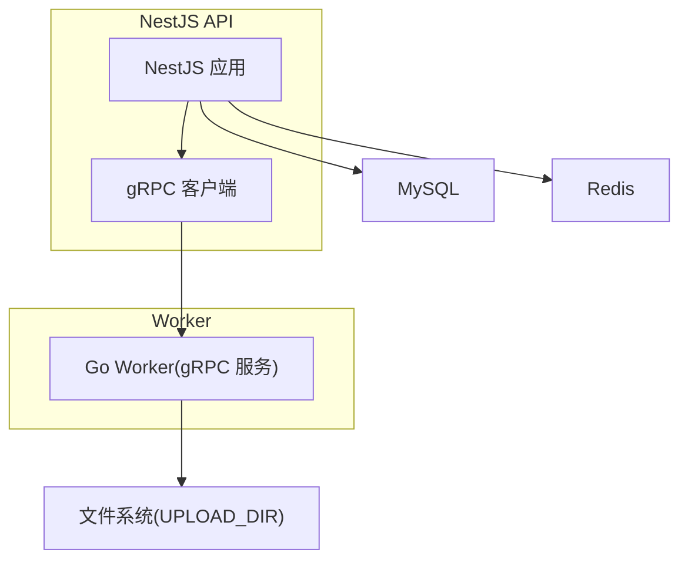
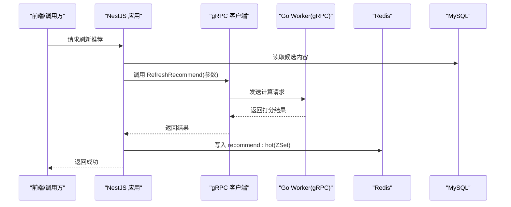
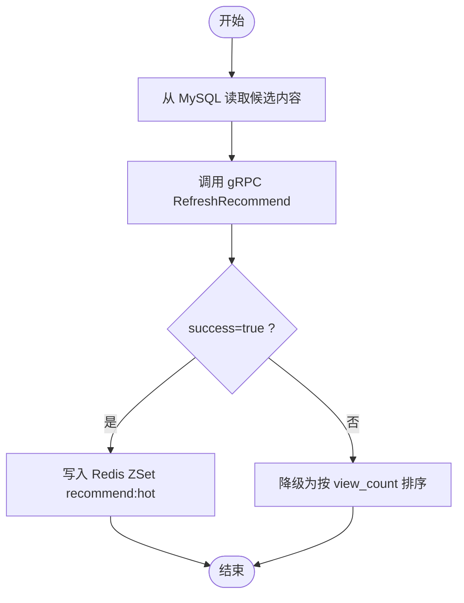
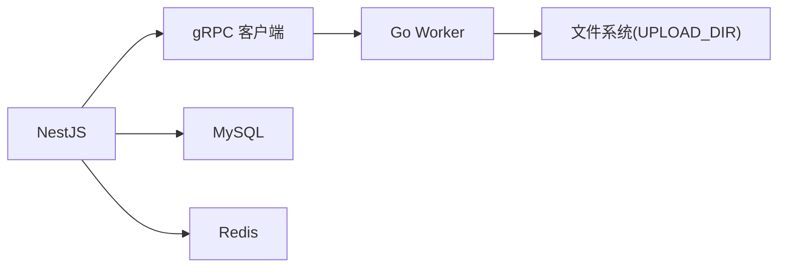

# gRPC 客户端配置

<cite>
**本文引用的文件**   
- [xqecz.proto](file://proto/xqecz.proto)
- [packages/api/.env](file://packages/api/.env)
- [scripts/run-worker.mjs](file://scripts/run-worker.mjs)
- [plan.md](file://plan.md)
</cite>

## 目录
1. [简介](#简介)
2. [项目结构](#项目结构)
3. [核心组件](#核心组件)
4. [架构总览](#架构总览)
5. [详细组件分析](#详细组件分析)
6. [依赖关系分析](#依赖关系分析)
7. [性能考虑](#性能考虑)
8. [故障排查指南](#故障排查指南)
9. [结论](#结论)
10. [附录](#附录)

## 简介
本文件面向 xqecz 平台 NestJS 端的 gRPC 客户端配置与使用，聚焦以下目标：
- 连接地址、超时、重试等关键配置的来源与含义
- keepCase:true 对字段命名（snake_case）的影响与最佳实践
- 错误处理策略：连接失败、超时、降级机制
- 如何正确构造参数并处理响应
- 结合推荐刷新链路的具体调用流程与示例说明

## 项目结构
- proto/xqecz.proto：gRPC 契约定义，包含服务方法与消息结构
- packages/api/.env：NestJS 运行环境变量（如 gRPC 服务端地址）
- scripts/run-worker.mjs：Go Worker 启动脚本，读取同一 .env 注入环境变量，并以绝对路径传递文件路径
- plan.md：项目规划与架构要点（NestJS 独占 MySQL/Redis；Worker 为无状态 gRPC 计算服务）

图表来源 
- [plan.md](file://plan.md)

章节来源
- [plan.md](file://plan.md)

## 核心组件
- gRPC 客户端（NestJS）：负责与 Go Worker 通信，发起计算任务（如内容推荐打分），接收结果后落库或写缓存
- gRPC 服务端（Go Worker）：无状态计算服务，不直接访问数据库，仅通过 gRPC 接收输入、返回结果
- 配置文件与环境变量：NestJS 从 .env 读取 gRPC 服务端地址；Worker 由 run-worker.mjs 启动时注入相同 .env 变量

章节来源
- [plan.md](file://plan.md)

## 架构总览
NestJS 作为唯一数据面入口，持有 MySQL/Redis。Worker 仅承担 CPU 密集计算（如推荐打分）。NestJS 通过 gRPC 将输入数据传给 Worker，Worker 返回结构化结果，NestJS 再写入 Redis ZSet 或数据库。

图表来源 
- [plan.md](file://plan.md)

## 详细组件分析

### gRPC 客户端初始化与连接配置
- 连接地址：从 NestJS 的环境变量中读取（通常位于 packages/api/.env），用于指向 Go Worker 的 gRPC 监听地址
- 超时设置：建议为每个 gRPC 调用设置合理的超时时间，避免长耗时阻塞上游请求
- 重试机制：针对幂等且可恢复的错误（如网络抖动）进行有限次重试；对于业务错误或超时不应盲目重试
- keepCase:true：启用后保持 proto 定义的字段名大小写（通常为 snake_case），便于在 NestJS 端直接使用下划线字段名，减少转换成本

章节来源
- [packages/api/.env](file://packages/api/.env)
- [xqecz.proto](file://proto/xqecz.proto)

### keepCase:true 的作用与影响
- 作用：关闭默认的大小写规范化，保留 proto 中的原始字段名（如 snake_case）
- 影响：
  - 在 NestJS 端可直接使用与 proto 一致的字段名，避免手动映射
  - 与 JSON 序列化保持一致，降低前后端或跨语言字段不一致风险
- 最佳实践：
  - 统一以 snake_case 作为接口字段约定
  - 在 DTO/响应对象中保持与 proto 一致的结构，减少额外转换

章节来源
- [xqecz.proto](file://proto/xqecz.proto)

### 错误处理策略
- 连接失败：捕获 gRPC 连接异常，记录日志并触发降级逻辑（如回退到基于 view_count 的排序）
- 超时处理：区分网络超时与业务超时，优先快速失败并返回友好提示；必要时触发重试（仅限幂等场景）
- 降级机制：当 Worker 不可用时，NestJS 应提供本地降级策略（例如读缓存、回退算法），保证可用性
- 错误语义：Worker 不返回 rpc error，而是返回 success=false + error 文本，NestJS 据此判断并执行降级

章节来源
- [plan.md](file://plan.md)

### 正确调用 gRPC 服务方法
- 参数构造：依据 proto 定义的消息结构组装参数，确保必填字段完整、类型匹配
- 响应处理：解析 success 标志与 error 文本；成功则继续业务流程（写入 Redis ZSet 或数据库）
- 幂等性：对可重试的方法确保幂等，避免重复提交导致副作用
- 上下文控制：合理设置超时与取消信号，避免长时间占用资源

章节来源
- [xqecz.proto](file://proto/xqecz.proto)

### 推荐刷新链路示例（概念流程）

图表来源 
- [plan.md](file://plan.md)

## 依赖关系分析
- NestJS 依赖 gRPC 客户端与 Worker 服务
- Worker 依赖文件系统（UPLOAD_DIR）与外部工具（如 FFmpeg/Tinify/S3），缺失时降级
- NestJS 依赖 MySQL/Redis，Worker 不直接访问数据库

图表来源 
- [plan.md](file://plan.md)

章节来源
- [plan.md](file://plan.md)

## 性能考虑
- 连接池与复用：复用 gRPC 连接，避免频繁握手开销
- 超时与并发：合理设置超时与最大并发，防止雪崩
- 降级与熔断：在 Worker 不可用时快速降级，保护主链路
- 缓存优先：优先从 Redis 获取热点数据，减少 gRPC 调用频率

[本节为通用指导，无需特定文件引用]

## 故障排查指南
- 检查环境变量：确认 packages/api/.env 中 gRPC 地址正确，Worker 已启动
- 查看日志：NestJS 与 Worker 日志定位连接失败、超时与业务错误
- 验证契约：确保 proto 版本一致，字段名与类型匹配
- 降级验证：模拟 Worker 不可用，确认降级逻辑生效

章节来源
- [packages/api/.env](file://packages/api/.env)
- [scripts/run-worker.mjs](file://scripts/run-worker.mjs)
- [plan.md](file://plan.md)

## 结论
通过明确 gRPC 客户端的连接、超时、重试与 keepCase 配置，结合稳健的错误处理与降级策略，NestJS 能够稳定地与无状态 Worker 协作，保障高可用与高性能。遵循 snake_case 字段约定与幂等调用原则，可显著降低跨语言集成的复杂度。

[本节为总结，无需特定文件引用]

## 附录
- 环境变量参考：packages/api/.env
- gRPC 契约：proto/xqecz.proto
- Worker 启动：scripts/run-worker.mjs（读取同一 .env 注入环境变量）

章节来源
- [packages/api/.env](file://packages/api/.env)
- [xqecz.proto](file://proto/xqecz.proto)
- [scripts/run-worker.mjs](file://scripts/run-worker.mjs)