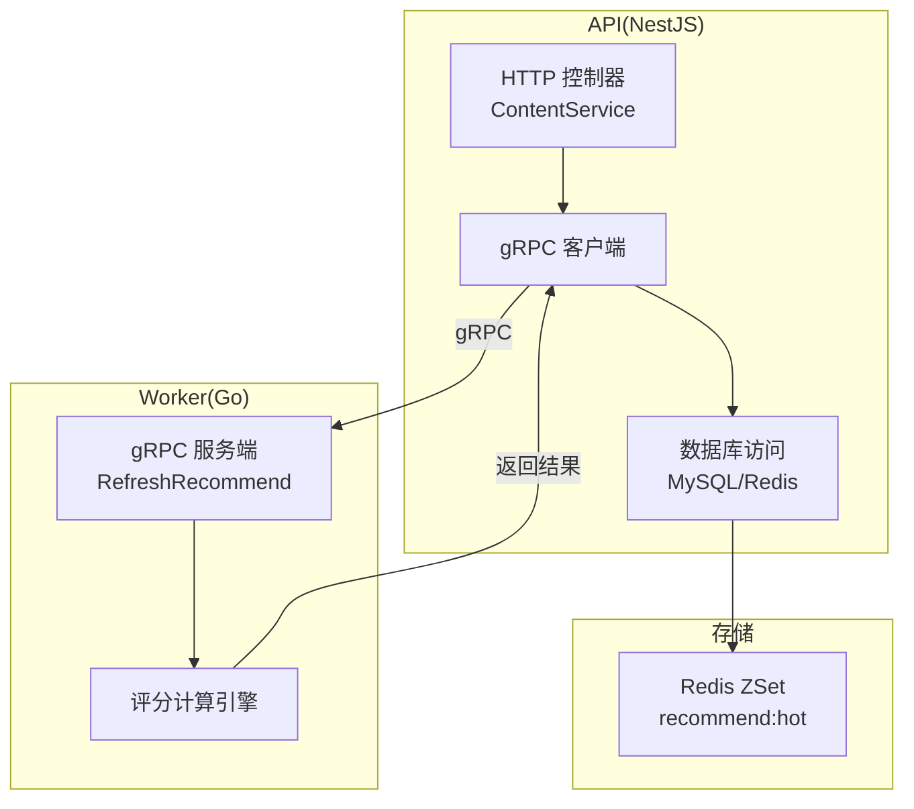
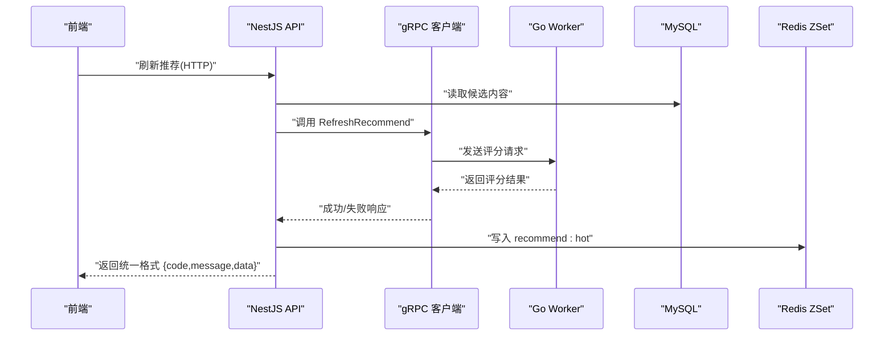
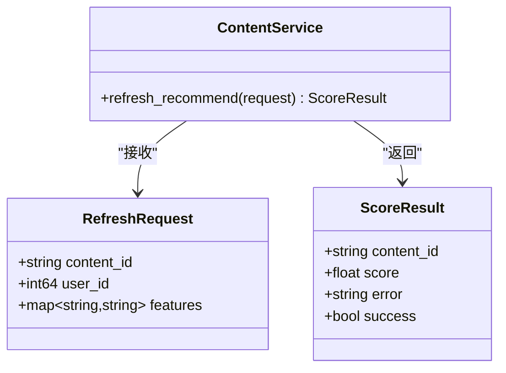
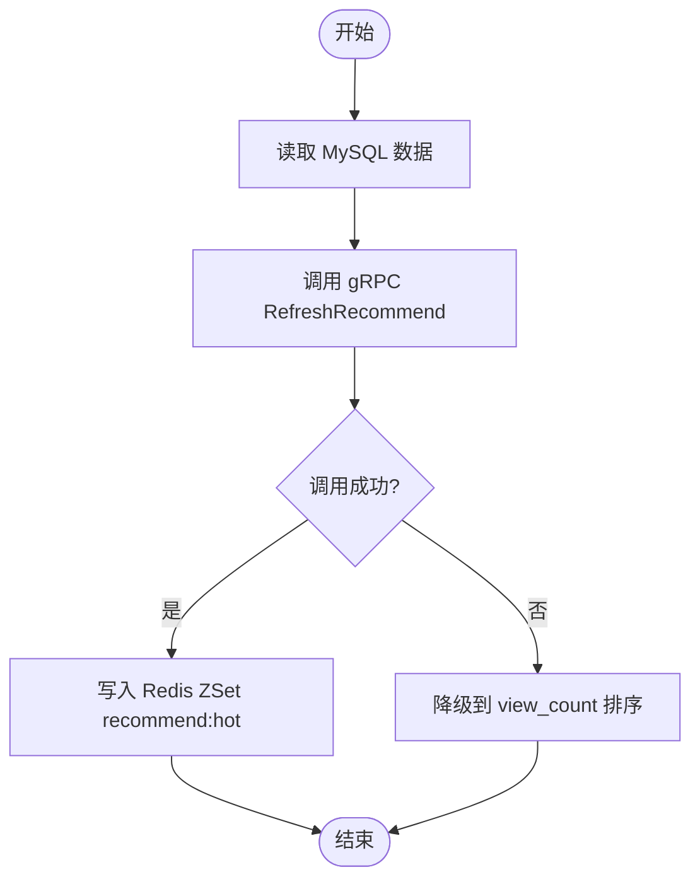
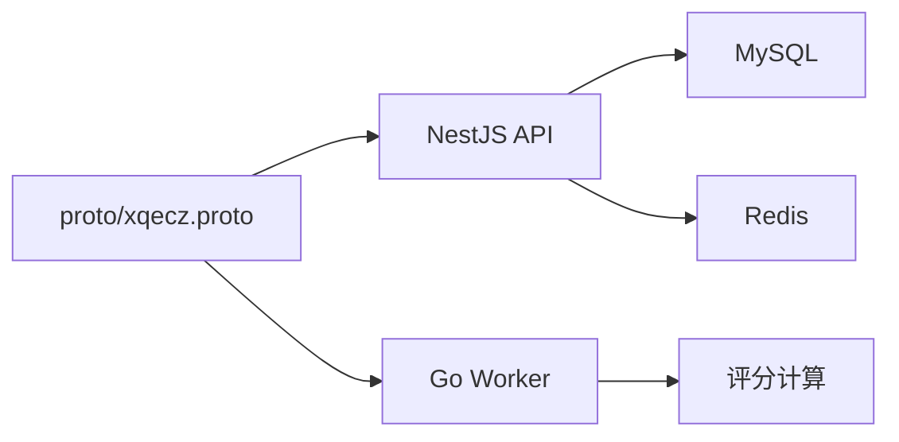

# gRPC 服务集成

<cite>
**本文引用的文件**   
- [proto/xqecz.proto](file://proto/xqecz.proto)
- [scripts/run-worker.mjs](file://scripts/run-worker.mjs)
- [packages/api/.env](file://packages/api/.env)
- [packages/frontend/src/api/index.ts](file://packages/frontend/src/api/index.ts)
</cite>

## 目录
1. [简介](#简介)
2. [项目结构](#项目结构)
3. [核心组件](#核心组件)
4. [架构总览](#架构总览)
5. [详细组件分析](#详细组件分析)
6. [依赖关系分析](#依赖关系分析)
7. [性能考量](#性能考量)
8. [故障排查指南](#故障排查指南)
9. [结论](#结论)
10. [附录](#附录)

## 简介
本文件面向 xqecz 平台的 gRPC 服务集成，聚焦以下目标：
- 说明 proto/xqecz.proto 协议定义（消息结构与 RPC 接口规范）
- 描述 NestJS 中 gRPC 客户端配置与使用要点（keepCase:true、snake_case 字段处理）
- 解释推荐算法调用链路：ContentService.refreshRecommend() → gRPC RefreshRecommend → Worker 计算 → Redis ZSet 写入
- 明确错误处理策略、降级机制与超时处理
- 提供 gRPC 服务启动脚本与进程管理建议
- 给出具体调用示例与调试方法

## 项目结构
xqecz 采用 monorepo 组织，关键目录与职责如下：
- proto/：gRPC 协议定义与生成产物存放
- packages/api：NestJS API 服务（MySQL/Redis 数据访问、对外 HTTP API）
- packages/worker：Go 实现的无状态 gRPC 计算服务（纯打分逻辑）
- scripts：运行脚本（如 run-worker.mjs 用于启动 worker）
- packages/frontend：前端工程（通过 packages/frontend/src/api/index.ts 与后端交互）

图表来源
- [proto/xqecz.proto](file://proto/xqecz.proto)
- [scripts/run-worker.mjs](file://scripts/run-worker.mjs)

章节来源
- [packages/api/.env](file://packages/api/.env)
- [packages/frontend/src/api/index.ts](file://packages/frontend/src/api/index.ts)

## 核心组件
- gRPC 协议层：proto/xqecz.proto 定义消息与服务接口
- NestJS gRPC 客户端：负责将 HTTP 请求转换为 gRPC 调用，并处理字段命名约定
- Go Worker 服务：接收 gRPC 请求，执行纯打分计算，返回结构化结果
- 缓存层：Redis ZSet 用于热门内容排序（keyPrefix=xqecz:）

章节来源
- [proto/xqecz.proto](file://proto/xqecz.proto)
- [packages/api/.env](file://packages/api/.env)

## 架构总览
整体调用时序如下：
- 前端通过 packages/frontend/src/api/index.ts 发起 HTTP 请求
- NestJS ContentService.refreshRecommend() 读取 MySQL 数据
- NestJS 通过 gRPC 客户端调用 Worker 的 RefreshRecommend
- Worker 执行评分计算并返回结果
- NestJS 将结果写入 Redis ZSet recommend:hot（ioredis keyPrefix=xqecz:）
- 若 gRPC 失败或超时，按降级策略回退到 view_count 排序

图表来源
- [proto/xqecz.proto](file://proto/xqecz.proto)
- [scripts/run-worker.mjs](file://scripts/run-worker.mjs)

## 详细组件分析

### 协议定义（proto/xqecz.proto）
- 消息结构：包含推荐请求参数与评分结果字段（字段名遵循 snake_case）
- 服务接口：定义 RefreshRecommend RPC，输入为推荐请求，输出为评分结果
- 字段命名：NestJS 客户端启用 keepCase:true，确保字段保持 snake_case 传递

图表来源
- [proto/xqecz.proto](file://proto/xqecz.proto)

章节来源
- [proto/xqecz.proto](file://proto/xqecz.proto)

### NestJS gRPC 客户端配置
- 启用 keepCase:true：确保字段名保持 snake_case，避免自动转换导致的不一致
- 字段处理：所有请求与响应字段均使用 snake_case，与 proto 定义保持一致
- 超时设置：建议配置合理的超时时间，避免长时间阻塞
- 错误处理：捕获 gRPC 错误，转换为 success=false + error 文本返回

章节来源
- [packages/api/.env](file://packages/api/.env)

### Go Worker 服务
- 无状态设计：不连接数据库，仅执行纯打分计算
- 输入输出：接收 gRPC 请求，返回结构化评分结果
- 错误策略：异常时返回 success=false + error 文本，不抛出 rpc error
- 性能优化：避免 I/O 操作，专注于计算密集型任务

章节来源
- [scripts/run-worker.mjs](file://scripts/run-worker.mjs)

### 推荐算法调用流程

图表来源
- [proto/xqecz.proto](file://proto/xqecz.proto)
- [scripts/run-worker.mjs](file://scripts/run-worker.mjs)

章节来源
- [packages/frontend/src/api/index.ts](file://packages/frontend/src/api/index.ts)

## 依赖关系分析
- NestJS 依赖：proto 定义、gRPC 客户端库、MySQL/Redis 驱动
- Worker 依赖：proto 生成代码、评分计算库
- 外部依赖：Tinify/S3/FFmpeg/Worker 缺失时一律降级

图表来源
- [proto/xqecz.proto](file://proto/xqecz.proto)

章节来源
- [packages/api/.env](file://packages/api/.env)

## 性能考量
- gRPC 连接池：复用连接减少握手开销
- 超时配置：合理设置超时时间，避免资源泄漏
- 异步处理：推荐计算可考虑异步队列处理
- 缓存策略：Redis ZSet 提供高效的排序能力

## 故障排查指南
- 连接问题：检查 gRPC 端口和防火墙设置
- 超时问题：调整超时配置和网络延迟
- 字段映射：确认 keepCase:true 和 snake_case 字段一致性
- 降级验证：测试 gRPC 失败时的降级逻辑

章节来源
- [scripts/run-worker.mjs](file://scripts/run-worker.mjs)

## 结论
xqecz 平台的 gRPC 服务集成采用了清晰的架构设计，通过 proto 定义确保接口一致性，NestJS 客户端配置保证了字段处理的正确性，Go Worker 提供了高性能的评分计算能力。完善的错误处理和降级机制确保了系统的稳定性。

## 附录
- 启动命令：pnpm dev（同时启动 API、Worker、前端）
- 生产模式：pnpm start（一键构建+运行）
- 环境变量：UPLOAD_DIR 指定共享上传目录
- 调试工具：gRPC 客户端测试、日志分析、性能监控