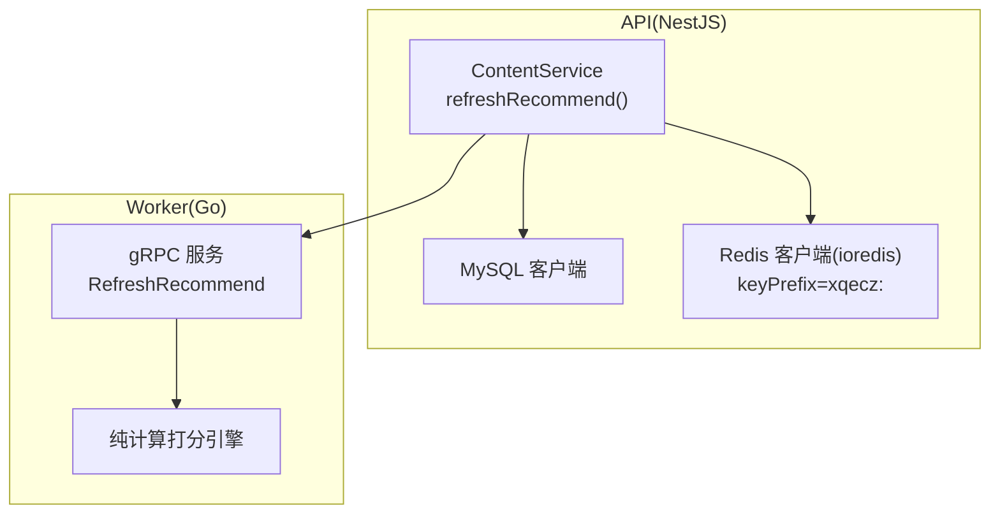
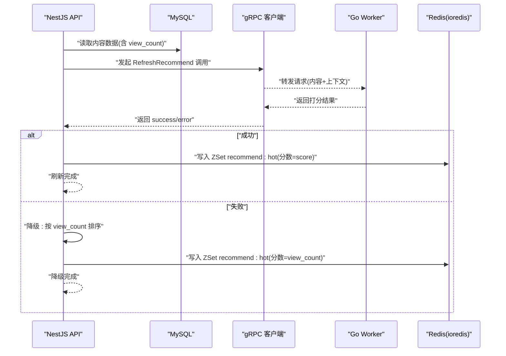
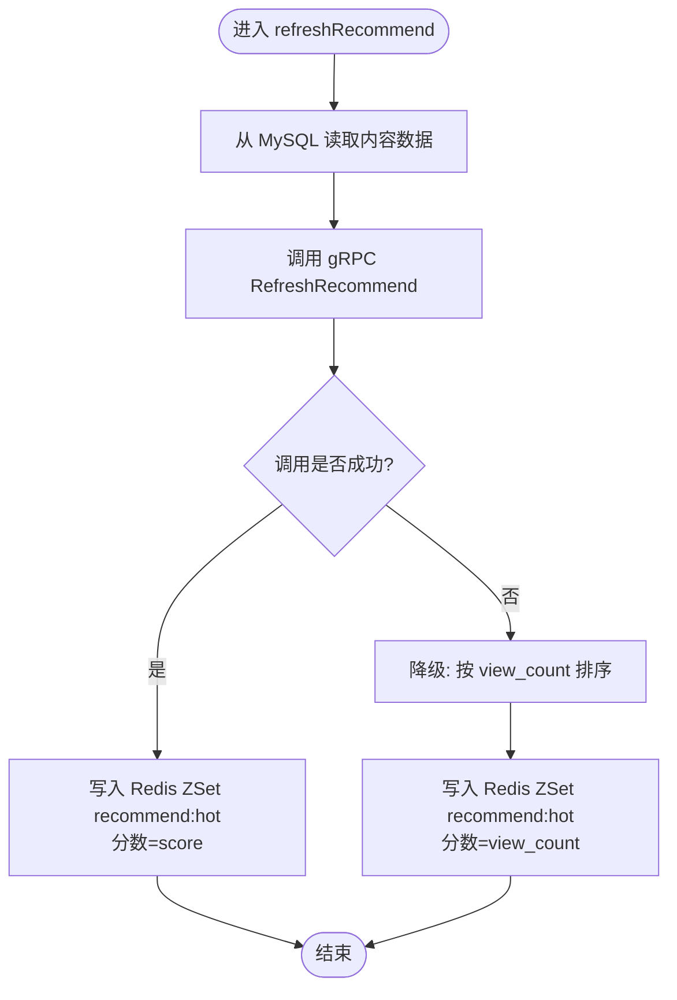
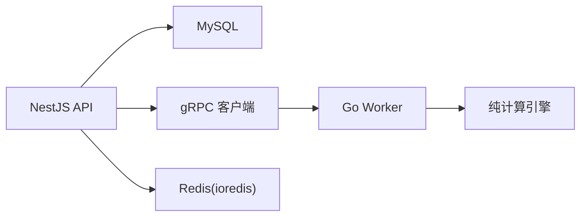

# 推荐算法调用流程

<cite>
**本文引用的文件**   
- [xqecz.proto](file://proto/xqecz.proto)
- [run-worker.mjs](file://scripts/run-worker.mjs)
- [plan.md](file://plan.md)
</cite>

## 目录
1. [简介](#简介)
2. [项目结构](#项目结构)
3. [核心组件](#核心组件)
4. [架构总览](#架构总览)
5. [详细组件分析](#详细组件分析)
6. [依赖关系分析](#依赖关系分析)
7. [性能考量](#性能考量)
8. [故障排查指南](#故障排查指南)
9. [结论](#结论)
10. [附录](#附录)

## 简介
本文件面向 xqecz 平台的推荐算法调用链路，聚焦 ContentService.refreshRecommend() 的完整执行过程：从 MySQL 读取内容数据，通过 gRPC 调用无状态 Worker 进行纯计算打分，最终将结果写入 Redis ZSet recommend:hot（ioredis keyPrefix=xqecz:）。同时说明降级机制（gRPC 失败时回退到基于 view_count 的排序逻辑）、缓存策略与数据一致性保证，并提供时序图、错误处理路径、调试方法与性能监控建议。

## 项目结构
- proto/xqecz.proto：定义 NestJS 与 Go Worker 之间的 gRPC 契约（字段命名采用 snake_case，客户端 keepCase:true）。
- scripts/run-worker.mjs：Worker 启动脚本，自动读取 .env 注入环境变量，确保上传目录等路径一致。
- plan.md：项目规划与关键约束说明，包含推荐链路、部署方式与运行模式。

图表来源
- [plan.md](file://plan.md)

章节来源
- [plan.md](file://plan.md)

## 核心组件
- ContentService.refreshRecommend()
  - 职责：协调“读 MySQL → 调 gRPC → 写 Redis”的推荐刷新流程，并实现降级逻辑。
  - 输入/输出：内部数据流为内容列表与评分结果；对外以任务完成或异常状态体现。
- gRPC 契约（proto）
  - 职责：定义 RefreshRecommend 请求/响应结构与字段命名约定。
- Worker(Go)
  - 职责：无状态计算服务，接收内容特征与上下文，返回打分结果；不直连数据库，不执行 cron。
- Redis 客户端
  - 职责：维护 recommend:hot ZSet，keyPrefix=xqecz:，用于热点内容排序与快速读取。
- MySQL 客户端
  - 职责：提供内容基础数据（如 view_count 等），作为降级排序依据。

章节来源
- [plan.md](file://plan.md)

## 架构总览
推荐刷新链路遵循“NestJS 独占数据访问 + Go 无状态计算”的铁律。NestJS 负责数据读写与编排，Go Worker 仅做纯计算，避免跨进程共享状态与锁竞争。

图表来源
- [plan.md](file://plan.md)

## 详细组件分析

### ContentService.refreshRecommend() 执行流程
- 步骤概览
  1) 从 MySQL 拉取待推荐的内容集合（包含必要字段，如 id、view_count 等）。
  2) 构造 gRPC 请求，调用 Worker 的 RefreshRecommend。
  3) 若调用成功：使用 Worker 返回的 score 写入 Redis ZSet recommend:hot。
  4) 若调用失败：降级为基于 view_count 的排序逻辑，并将 view_count 作为分数写入同一 ZSet。
  5) 统一记录日志与指标，便于追踪与监控。

- 关键要点
  - 数据源：MySQL（NestJS 独占访问）。
  - 计算层：Go Worker（无状态、纯计算）。
  - 缓存层：Redis ZSet recommend:hot（ioredis keyPrefix=xqecz:）。
  - 降级策略：gRPC 失败时回退到 view_count 排序，保证可用性。

图表来源
- [plan.md](file://plan.md)

章节来源
- [plan.md](file://plan.md)

### gRPC 契约与字段约定
- 命名规范
  - 客户端设置 keepCase:true，字段保持 snake_case，避免大小写转换带来的歧义。
- 接口语义
  - RefreshRecommend：接收内容相关特征与上下文，返回打分结果（success 与 error 文本）。
- 生成产物
  - proto/gen 与 packages/worker/proto 为自动生成代码，不作为手写源码分析对象。

章节来源
- [plan.md](file://plan.md)

### Worker 启动与环境变量
- 启动方式
  - 通过 scripts/run-worker.mjs 启动，自动读取 .env 注入环境变量。
- 路径一致性
  - 上传目录由 UPLOAD_DIR 环境变量统一配置，Worker 经 gRPC 接收绝对路径，避免路径不一致问题。

章节来源
- [plan.md](file://plan.md)

### 缓存策略与数据一致性
- 缓存键设计
  - ZSet key：recommend:hot
  - ioredis keyPrefix：xqecz:
  - 成员：内容 id
  - 分数：优先使用 Worker 返回的 score；降级时使用 view_count
- 一致性保证
  - 写入前校验 gRPC 返回 success；失败则走降级分支，确保 ZSet 始终有可用排序结果。
  - 软删除过滤：外部依赖缺失一律降级，不影响主流程可用性。

章节来源
- [plan.md](file://plan.md)

## 依赖关系分析
- NestJS(API) 依赖
  - MySQL 客户端：读取内容数据
  - gRPC 客户端：调用 Worker
  - Redis 客户端(ioredis)：写入 ZSet
- Worker(Go) 依赖
  - 纯计算库：无外部 I/O，无数据库连接
- 环境依赖
  - .env 统一配置（UPLOAD_DIR 等）
  - pnpm dev/start 一键启动 API、Worker、前端

图表来源
- [plan.md](file://plan.md)

章节来源
- [plan.md](file://plan.md)

## 性能考量
- 批量化与并发
  - 批量读取 MySQL 内容数据，减少往返次数。
  - gRPC 调用可考虑并行化（注意限流与超时控制）。
- 缓存命中
  - 合理设置 ZSet 更新频率，避免频繁全量刷新。
- 资源隔离
  - Worker 无状态，便于水平扩展；NestJS 专注数据与编排。
- 监控指标
  - gRPC 调用耗时、成功率、错误码分布。
  - ZSet 写入耗时与 QPS。
  - MySQL 查询耗时与慢查询。

[本节为通用指导，无需特定文件引用]

## 故障排查指南
- 常见问题定位
  - gRPC 调用失败：检查 Worker 是否启动、端口是否可达、请求体是否符合 proto 定义。
  - 降级触发：确认 gRPC 返回 success=false 或网络/超时错误。
  - ZSet 数据异常：核对 keyPrefix、ZSet key、成员与分数是否正确。
- 调试方法
  - 启用详细日志：记录每次刷新的输入、输出与耗时。
  - 模拟失败：在测试环境强制 gRPC 失败，验证降级逻辑。
  - 数据校验：对比 ZSet 分数与预期（score vs view_count）。
- 监控建议
  - 接入 APM/指标采集，关注 P95/P99 延迟与错误率。
  - 告警阈值：gRPC 失败率 > 阈值、ZSet 写入失败、MySQL 慢查询增多。

章节来源
- [plan.md](file://plan.md)

## 结论
推荐算法调用流程以 NestJS 为核心编排者，结合无状态 Go Worker 的纯计算能力，实现了高可用与可扩展的推荐刷新链路。通过明确的降级策略与统一的缓存键设计，保证了在不同异常场景下的稳定性与一致性。配合完善的监控与调试手段，可有效提升系统可观测性与排障效率。

[本节为总结性内容，无需特定文件引用]

## 附录
- 运行方式
  - 开发：pnpm dev（同时启动 NestJS API、Go Worker、Vite 前端）
  - 生产：pnpm start（构建并运行）
- 关键约定
  - gRPC 字段 snake_case，keepCase:true
  - 上传目录 UPLOAD_DIR 统一配置
  - 软删除：deleted_at + TypeORM @DeleteDateColumn

章节来源
- [plan.md](file://plan.md)