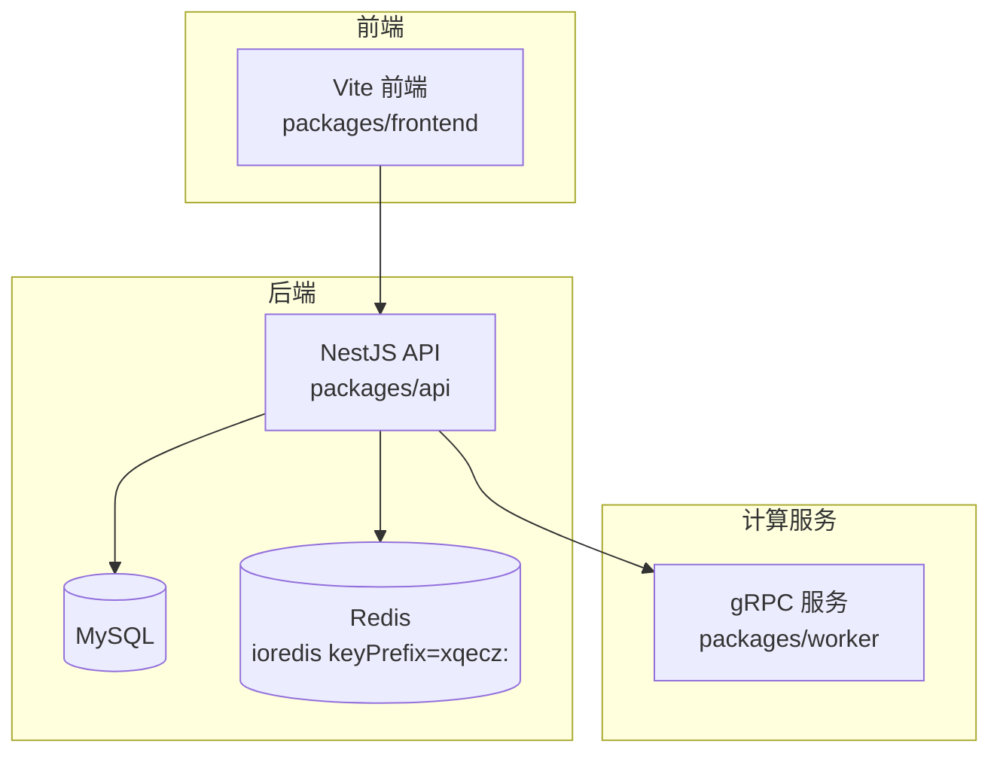
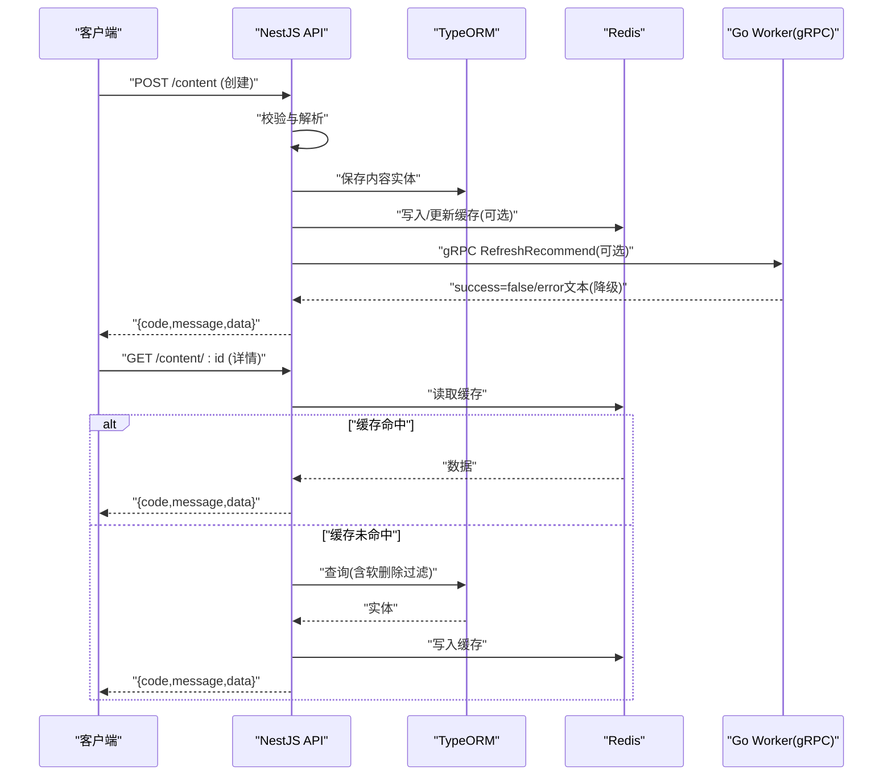
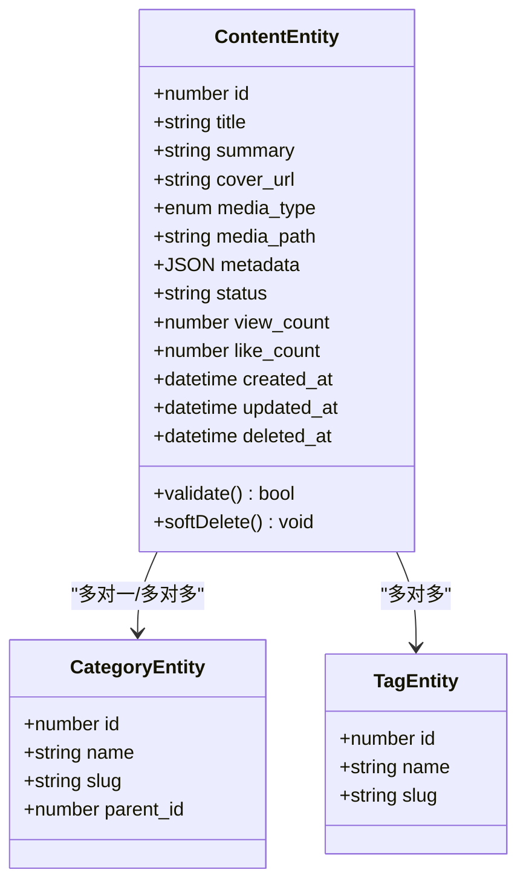
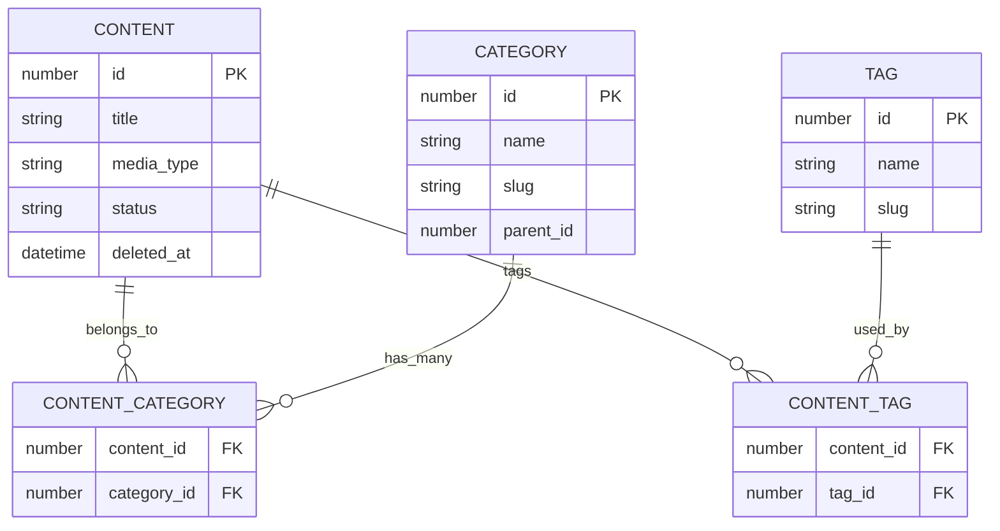
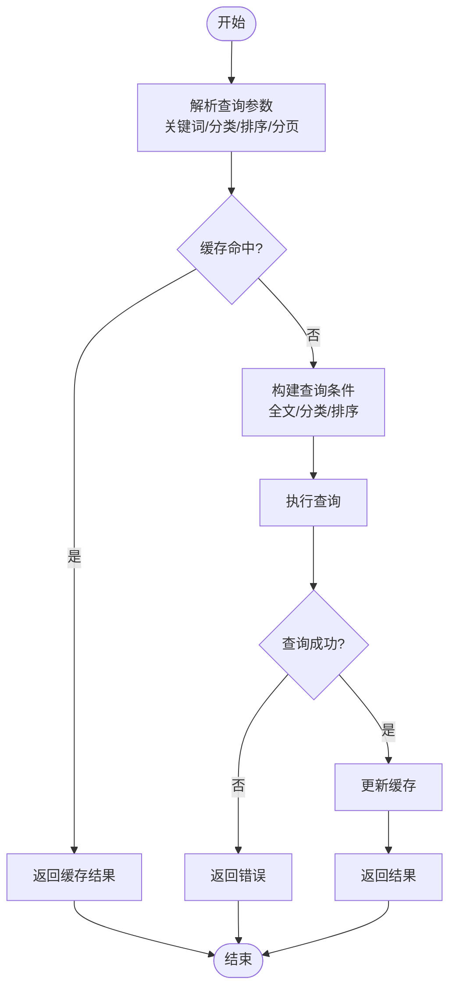
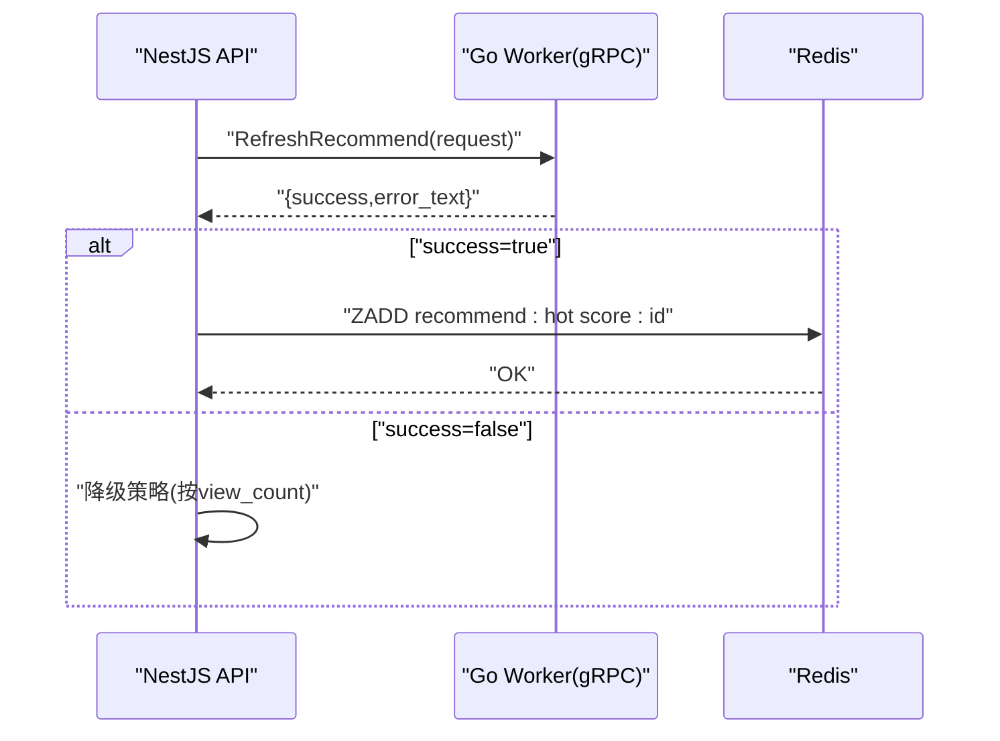
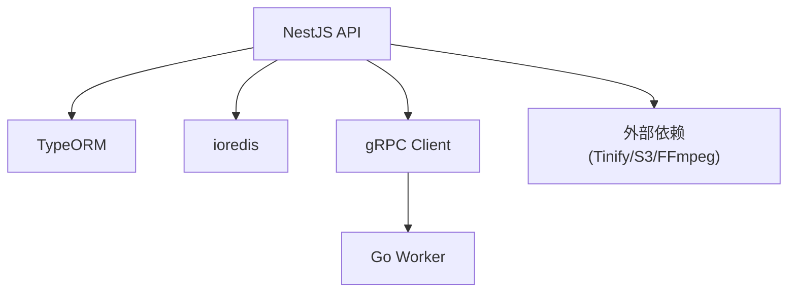

# 内容 CRUD 操作

<cite>
**本文引用的文件**   
- [plan.md](file://plan.md)
- [AGENTS.md](file://AGENTS.md)
- [xqecz.proto](file://proto/xqecz.proto)
- [run-worker.mjs](file://scripts/run-worker.mjs)
- [package.json](file://package.json)
</cite>

## 目录
1. [简介](#简介)
2. [项目结构](#项目结构)
3. [核心组件](#核心组件)
4. [架构总览](#架构总览)
5. [详细组件分析](#详细组件分析)
6. [依赖关系分析](#依赖关系分析)
7. [性能考量](#性能考量)
8. [故障排查指南](#故障排查指南)
9. [结论](#结论)
10. [附录：API 接口文档](#附录api-接口文档)

## 简介
本文件面向 xqecz 平台的内容（图片、视频、图文、链接等）CRUD 操作，系统性说明以下内容实体的创建、读取、更新、删除实现逻辑与差异；阐述 TypeORM 实体设计中的软删除机制（deleted_at 字段）与自动过滤查询；解释内容分类、标签系统的数据库设计与关联关系；描述内容搜索功能的实现（全文搜索、分类筛选、排序选项）；并提供完整的 API 接口文档（请求参数、响应格式、错误处理示例）。

本项目为「小泉动漫二创站」，用户可上传/浏览二次创作内容（图片、视频、图文、链接），并支持评论、投票与管理后台。运行方式采用 pnpm 脚本本地直启：pnpm dev 启动 NestJS API(:3000)、Go Worker(:50051)、Vite 前端(:5173)；生产模式使用 pnpm start 一键构建+运行。NestJS 独占 MySQL/Redis；Go worker 是无状态 gRPC 计算服务，不连数据库、无 cron，数据经 gRPC 从 NestJS 传入、结果回传 NestJS 落库/写缓存。所有删除均为软删除（deleted_at + TypeORM @DeleteDateColumn 自动过滤）；外部依赖缺失一律降级，gRPC 不返回 rpc error，只返回 success=false + error 文本。

## 项目结构
- packages/api：NestJS 后端服务，负责 HTTP API、TypeORM 数据访问、Redis 缓存、gRPC 客户端调用。
- packages/frontend：Vite 前端应用，通过 packages/frontend/src/api/index.ts 与后端交互，统一 { code, message, data } 响应包装。
- packages/worker：Go 无状态 gRPC 计算服务，用于纯计算任务（如推荐打分）。
- proto：gRPC 契约定义（xqecz.proto），NestJS 客户端设置 keepCase:true，字段使用 snake_case。
- scripts：运行脚本，如 run-worker.mjs 启动 worker 时注入 .env。
- 根目录 package.json：pnpm 工作区配置与脚本入口。

**图表来源** 
- [package.json](file://package.json)
- [xqecz.proto](file://proto/xqecz.proto)
- [run-worker.mjs](file://scripts/run-worker.mjs)

**章节来源**
- [plan.md](file://plan.md)
- [AGENTS.md](file://AGENTS.md)
- [package.json](file://package.json)

## 核心组件
- 内容实体（Content Entity）：承载图片、视频、图文、链接等多类型内容，包含标题、摘要、封面、媒体路径、元数据、状态、时间戳、软删除字段 deleted_at 等。
- 分类实体（Category Entity）：内容分类维度，支持层级或扁平分类，内容与分类多对一或多对多。
- 标签实体（Tag Entity）：内容标签维度，内容与标签多对多。
- 搜索索引：基于 MySQL 全文索引或 Redis 倒排索引（视实现），提供全文检索、分类筛选、排序。
- 推荐服务：NestJS 调用 Go Worker 的 RefreshRecommend 进行打分，写入 Redis ZSet recommend:hot，读取时优先 ZSet，降级到 view_count 排序。

**章节来源**
- [AGENTS.md](file://AGENTS.md)
- [plan.md](file://plan.md)

## 架构总览
内容 CRUD 的核心流程由 NestJS 编排：
- 创建：接收上传/表单数据 → 校验 → 持久化（TypeORM）→ 触发异步任务（如转码、缩略图生成）→ 写入缓存（可选）。
- 读取：列表/详情查询 → 软删除过滤 → 全文搜索/分类筛选/排序 → 缓存命中则直接返回。
- 更新：权限校验 → 增量更新 → 失效相关缓存 → 重新生成必要资源。
- 删除：软删除（设置 deleted_at）→ 清理缓存 → 异步清理外部资源（S3/Tinify/FFmpeg）。

**图表来源** 
- [xqecz.proto](file://proto/xqecz.proto)
- [run-worker.mjs](file://scripts/run-worker.mjs)

## 详细组件分析

### 内容实体与软删除机制
- 实体字段建议：id、title、summary、cover_url、media_type（image/video/article/link）、media_path、metadata(JSON)、status、view_count、like_count、created_at、updated_at、deleted_at。
- 软删除：使用 TypeORM @DeleteDateColumn 标注 deleted_at，查询默认自动过滤已删除记录；删除接口仅设置 deleted_at，不物理删除。
- 自动过滤：在 Repository/Service 层统一启用 whereDeleted(false)，确保全量查询不返回软删除数据。

**图表来源** 
- [AGENTS.md](file://AGENTS.md)

**章节来源**
- [AGENTS.md](file://AGENTS.md)

### 分类与标签系统
- 分类：支持层级（parent_id）或扁平分类，slug 唯一便于路由与 SEO。
- 标签：自由标签，slug 唯一，避免重复。
- 关联关系：
  - 内容与分类：多对一（单分类）或多对多（多分类）。
  - 内容与标签：多对多（一个内容多个标签，一个标签被多个内容引用）。
- 查询优化：建立索引 on category_slug、tag_slug、media_type、status、deleted_at。

**图表来源** 
- [AGENTS.md](file://AGENTS.md)

**章节来源**
- [AGENTS.md](file://AGENTS.md)

### 内容搜索功能
- 全文搜索：MySQL 全文索引（MATCH AGAINST）或 Redis 倒排索引（按词项映射内容 ID）。
- 分类筛选：按 category_slug 精确匹配或层级递归。
- 排序选项：按 view_count、like_count、created_at、updated_at、score（推荐分数）。
- 分页：limit/offset 或 cursor-based 分页。

**图表来源** 
- [AGENTS.md](file://AGENTS.md)

**章节来源**
- [AGENTS.md](file://AGENTS.md)

### 推荐与 gRPC 集成
- 推荐链路：NestJS 调用 Go Worker 的 RefreshRecommend，worker 纯打分后返回结果，NestJS 写入 Redis ZSet recommend:hot（keyPrefix=xqecz:）。
- 读取降级：若推荐不可用，则按 view_count 排序。
- gRPC 契约：proto/xqecz.proto 定义 RefreshRecommend 请求/响应；NestJS 客户端 keepCase:true，字段 snake_case。

**图表来源** 
- [xqecz.proto](file://proto/xqecz.proto)
- [run-worker.mjs](file://scripts/run-worker.mjs)

**章节来源**
- [AGENTS.md](file://AGENTS.md)
- [xqecz.proto](file://proto/xqecz.proto)
- [run-worker.mjs](file://scripts/run-worker.mjs)

### 内容类型的处理差异
- 图片：上传后生成缩略图、压缩（Tinify 可选）、存储至 UPLOAD_DIR；详情页懒加载封面。
- 视频：上传后转码（FFmpeg 可选）、生成预览帧、分片下载；播放页统计观看次数。
- 图文：富文本内容，存储 HTML/Markdown，渲染前做 XSS 过滤。
- 链接：外链跳转，记录点击次数，支持短链。

**章节来源**
- [AGENTS.md](file://AGENTS.md)

## 依赖关系分析
- NestJS 依赖：
  - TypeORM：MySQL 连接、实体映射、软删除过滤。
  - ioredis：缓存读写、ZSet 推荐。
  - gRPC 客户端：调用 Go Worker。
- Go Worker：无状态，纯计算，不连数据库。
- 外部依赖：Tinify/S3/FFmpeg 缺失降级，不影响主流程。

**图表来源** 
- [AGENTS.md](file://AGENTS.md)

**章节来源**
- [AGENTS.md](file://AGENTS.md)

## 性能考量
- 缓存策略：热点内容详情、列表首屏、推荐 ZSet 均缓存；合理设置 TTL 与失效策略。
- 查询优化：合理使用索引（category_slug、tag_slug、media_type、status、deleted_at），避免 N+1 查询。
- 异步处理：转码、缩略图生成、推荐打分走异步队列或 gRPC，避免阻塞主线程。
- 降级策略：外部依赖失败时降级，保证可用性。

## 故障排查指南
- 常见问题：
  - 软删除导致数据“消失”：检查 deleted_at 字段与查询是否启用软删除过滤。
  - 推荐不可用：查看 gRPC 返回 success=false 与 error 文本，确认 Worker 状态。
  - 上传失败：检查 UPLOAD_DIR 环境变量与权限，外部依赖是否可用。
- 日志定位：NestJS 日志级别、gRPC 调用日志、Redis 命中率监控。

**章节来源**
- [AGENTS.md](file://AGENTS.md)

## 结论
xqecz 平台的内容 CRUD 以 NestJS 为核心，结合 TypeORM 软删除、Redis 缓存与 Go Worker 推荐打分，形成高可用、可扩展的内容服务体系。分类与标签系统提供灵活的维度组织，搜索功能支持全文检索与多维度筛选。通过统一的 API 响应格式与完善的降级策略，保障用户体验与系统稳定性。

## 附录：API 接口文档
以下接口遵循统一响应格式 { code, message, data }。

- 创建内容
  - 方法：POST /content
  - 请求体：title、summary、media_type、media_path、metadata、category_ids[]、tag_ids[]
  - 响应：data 为新内容实体
  - 错误：code=400/401/403/404/500，message 描述原因

- 获取内容详情
  - 方法：GET /content/:id
  - 路径参数：id
  - 响应：data 为内容实体
  - 错误：code=404（不存在或已软删除）

- 更新内容
  - 方法：PUT /content/:id
  - 路径参数：id
  - 请求体：可更新字段（title、summary、media_path、metadata、category_ids[]、tag_ids[]）
  - 响应：data 为更新后的实体
  - 错误：code=400/401/403/404/500

- 删除内容（软删除）
  - 方法：DELETE /content/:id
  - 路径参数：id
  - 响应：data 为空对象
  - 错误：code=401/403/404/500

- 搜索内容
  - 方法：GET /content/search
  - 查询参数：keyword、category_slug、tag_slug、sort_by、order、page、limit
  - 响应：data 为分页结果（items[], total, page, limit）
  - 错误：code=400/500

- 获取推荐列表
  - 方法：GET /content/recommend
  - 查询参数：page、limit
  - 响应：data 为推荐内容列表
  - 错误：code=500（推荐服务不可用时降级）

**章节来源**
- [AGENTS.md](file://AGENTS.md)