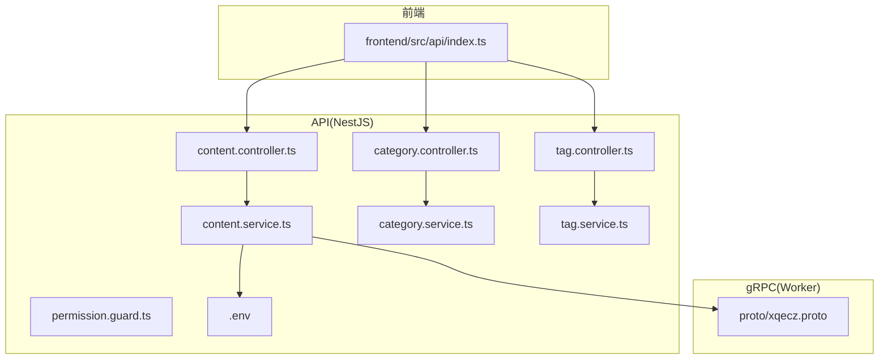
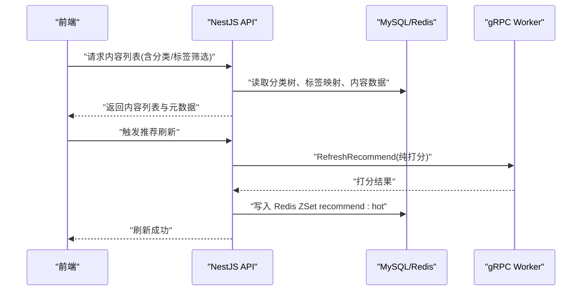
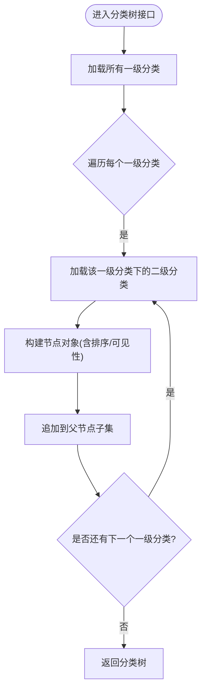
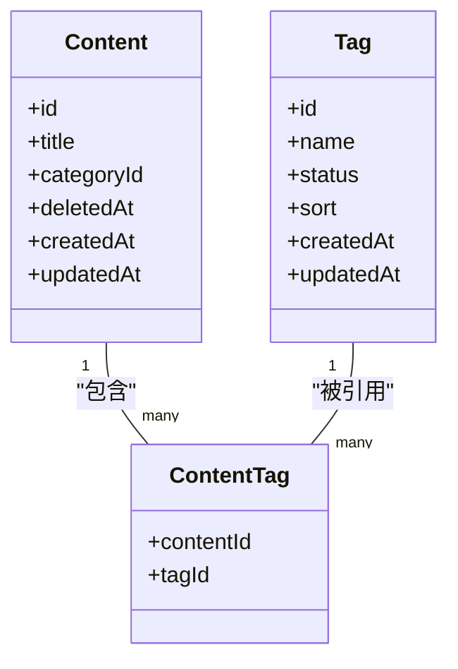
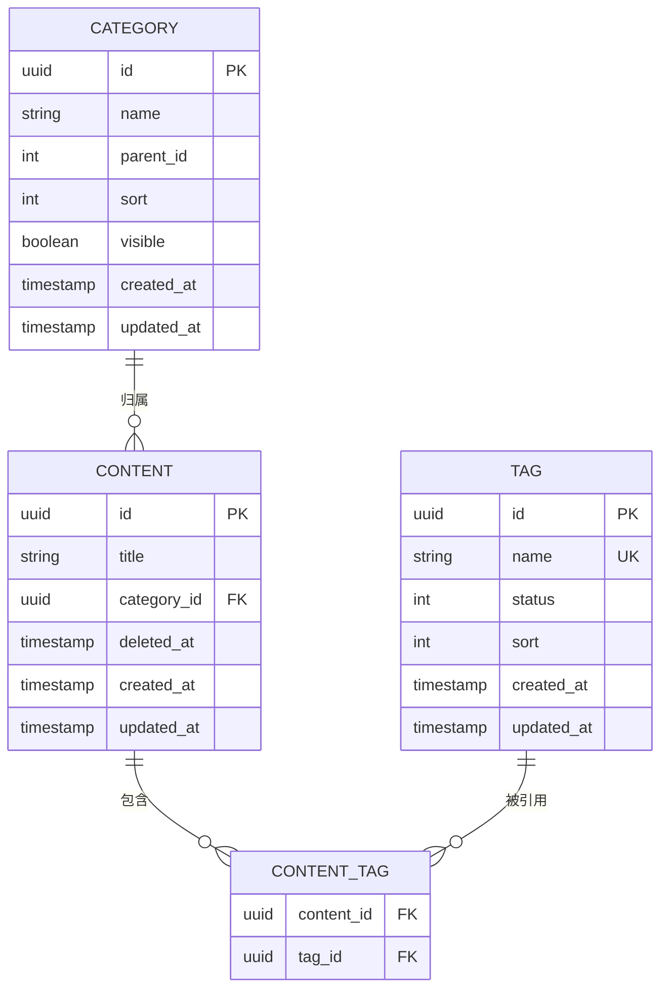
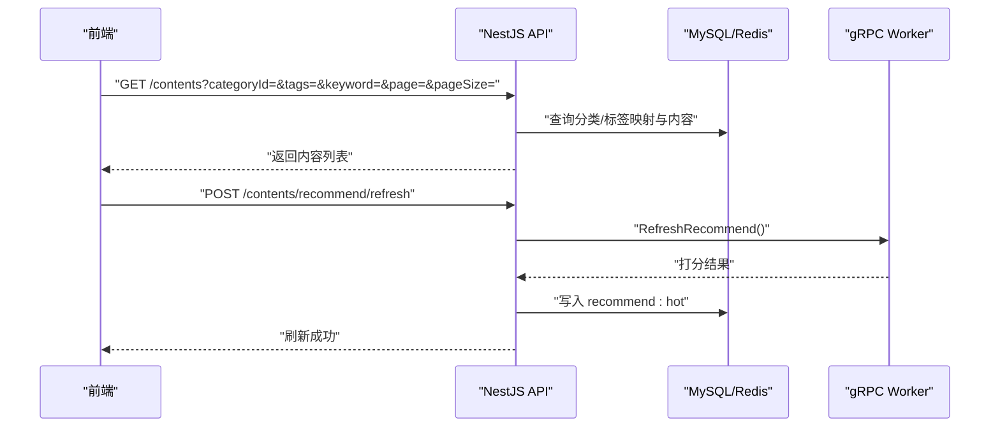
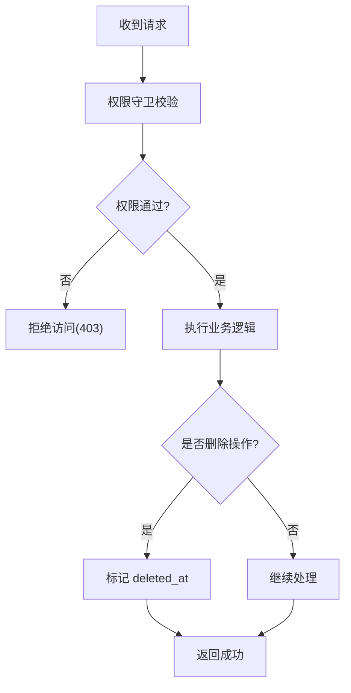
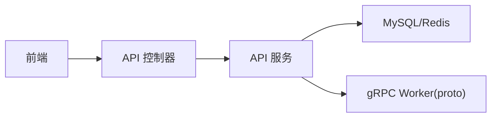

# 内容分类与标签

<cite>
**本文引用的文件**   
- [packages/api/src/content/content.service.ts](file://packages/api/src/content/content.service.ts)
- [packages/api/src/content/content.controller.ts](file://packages/api/src/content/content.controller.ts)
- [packages/api/src/category/category.service.ts](file://packages/api/src/category/category.service.ts)
- [packages/api/src/category/category.controller.ts](file://packages/api/src/category/category.controller.ts)
- [packages/api/src/tag/tag.service.ts](file://packages/api/src/tag/tag.service.ts)
- [packages/api/src/tag/tag.controller.ts](file://packages/api/src/tag/tag.controller.ts)
- [packages/api/src/permission/permission.guard.ts](file://packages/api/src/permission/permission.guard.ts)
- [packages/api/.env](file://packages/api/.env)
- [proto/xqecz.proto](file://proto/xqecz.proto)
- [packages/frontend/src/api/index.ts](file://packages/frontend/src/api/index.ts)
</cite>

## 目录
1. [简介](#简介)
2. [项目结构](#项目结构)
3. [核心组件](#核心组件)
4. [架构总览](#架构总览)
5. [详细组件分析](#详细组件分析)
6. [依赖关系分析](#依赖关系分析)
7. [性能考量](#性能考量)
8. [故障排查指南](#故障排查指南)
9. [结论](#结论)
10. [附录](#附录)

## 简介
本文件面向 xqecz 平台的内容分类与标签系统，系统性阐述以下内容：
- 分类体系设计：一级分类、二级分类的层级结构与树形展示。
- 标签数据模型：标签的创建、关联与管理。
- 内容与分类、标签的多对多关系设计。
- 分类与标签的 CRUD API 说明。
- 基于分类与标签的内容筛选与搜索能力。
- 分类树形结构的展示与交互实现要点。
- 分类权限控制与内容可见性管理策略。

本说明以 NestJS API 为核心，结合前端接口契约与 gRPC 工作进程（Worker）在推荐链路中的角色进行整体说明。删除均为软删除；外部依赖缺失时统一降级处理。

## 项目结构
围绕“内容分类与标签”的相关代码主要分布在 packages/api 下的 content、category、tag 模块以及权限守卫与 .env 配置中；前后端接口契约由 packages/frontend/src/api/index.ts 定义；gRPC 契约位于 proto/xqecz.proto。

图表来源
- [packages/api/src/content/content.controller.ts](file://packages/api/src/content/content.controller.ts)
- [packages/api/src/content/content.service.ts](file://packages/api/src/content/content.service.ts)
- [packages/api/src/category/category.controller.ts](file://packages/api/src/category/category.controller.ts)
- [packages/api/src/category/category.service.ts](file://packages/api/src/category/category.service.ts)
- [packages/api/src/tag/tag.controller.ts](file://packages/api/src/tag/tag.controller.ts)
- [packages/api/src/tag/tag.service.ts](file://packages/api/src/tag/tag.service.ts)
- [packages/api/src/permission/permission.guard.ts](file://packages/api/src/permission/permission.guard.ts)
- [packages/api/.env](file://packages/api/.env)
- [packages/frontend/src/api/index.ts](file://packages/frontend/src/api/index.ts)
- [proto/xqecz.proto](file://proto/xqecz.proto)

章节来源
- [packages/api/src/content/content.controller.ts](file://packages/api/src/content/content.controller.ts)
- [packages/api/src/content/content.service.ts](file://packages/api/src/content/content.service.ts)
- [packages/api/src/category/category.controller.ts](file://packages/api/src/category/category.controller.ts)
- [packages/api/src/category/category.service.ts](file://packages/api/src/category/category.service.ts)
- [packages/api/src/tag/tag.controller.ts](file://packages/api/src/tag/tag.controller.ts)
- [packages/api/src/tag/tag.service.ts](file://packages/api/src/tag/tag.service.ts)
- [packages/api/src/permission/permission.guard.ts](file://packages/api/src/permission/permission.guard.ts)
- [packages/api/.env](file://packages/api/.env)
- [packages/frontend/src/api/index.ts](file://packages/frontend/src/api/index.ts)
- [proto/xqecz.proto](file://proto/xqecz.proto)

## 核心组件
- 内容服务（ContentService）
  - 负责内容的增删改查、按分类与标签筛选、排序与分页、推荐刷新调用 gRPC Worker。
  - 软删除通过 TypeORM @DeleteDateColumn 自动过滤。
- 分类服务（CategoryService）
  - 维护一级/二级分类树，提供树形查询、节点增删改、排序与可见性控制。
- 标签服务（TagService）
  - 维护标签字典与内容-标签关联，支持标签创建、更新、删除与批量关联。
- 权限守卫（PermissionGuard）
  - 校验操作者对分类或内容的访问/编辑权限，决定内容可见性与可写权限。
- 环境变量（.env）
  - 统一配置上传目录等运行参数，API 与 Worker 共享同一 .env。

章节来源
- [packages/api/src/content/content.service.ts](file://packages/api/src/content/content.service.ts)
- [packages/api/src/category/category.service.ts](file://packages/api/src/category/category.service.ts)
- [packages/api/src/tag/tag.service.ts](file://packages/api/src/tag/tag.service.ts)
- [packages/api/src/permission/permission.guard.ts](file://packages/api/src/permission/permission.guard.ts)
- [packages/api/.env](file://packages/api/.env)

## 架构总览
内容分类与标签系统在 API 层完成业务编排，数据落库由 NestJS 直连 MySQL/Redis；推荐计算经 gRPC 调用无状态 Worker 打分后回写缓存。

图表来源
- [packages/api/src/content/content.service.ts](file://packages/api/src/content/content.service.ts)
- [proto/xqecz.proto](file://proto/xqecz.proto)

## 详细组件分析

### 分类体系与树形结构
- 层级结构
  - 一级分类：根级类目，用于粗粒度内容组织。
  - 二级分类：隶属于某一级分类的子类，用于细粒度划分。
- 树形查询
  - 提供获取完整分类树的接口，便于前端渲染多级菜单。
- 节点管理
  - 新增/修改/删除分类节点，支持排序字段与可见性开关。
- 可见性控制
  - 分类可见性影响内容在该分类下的曝光与检索。

图表来源
- [packages/api/src/category/category.service.ts](file://packages/api/src/category/category.service.ts)
- [packages/api/src/category/category.controller.ts](file://packages/api/src/category/category.controller.ts)

章节来源
- [packages/api/src/category/category.service.ts](file://packages/api/src/category/category.service.ts)
- [packages/api/src/category/category.controller.ts](file://packages/api/src/category/category.controller.ts)

### 标签数据模型与关联管理
- 标签实体
  - 标签名称唯一，支持状态与排序。
- 内容-标签关联
  - 多对多关系：一个内容可关联多个标签，一个标签可被多个内容引用。
- 关联操作
  - 为内容批量添加/移除标签，保证一致性。
- 标签生命周期
  - 创建、更新、删除（软删除），删除标签时清理关联。

图表来源
- [packages/api/src/tag/tag.service.ts](file://packages/api/src/tag/tag.service.ts)
- [packages/api/src/tag/tag.controller.ts](file://packages/api/src/tag/tag.controller.ts)

章节来源
- [packages/api/src/tag/tag.service.ts](file://packages/api/src/tag/tag.service.ts)
- [packages/api/src/tag/tag.controller.ts](file://packages/api/src/tag/tag.controller.ts)

### 内容与分类、标签的多对多关系
- 内容-分类
  - 内容归属单一分类（通常为二级分类），便于精准归类。
- 内容-标签
  - 内容可拥有多个标签，支持跨分类的横向聚合与检索。
- 查询组合
  - 支持按分类+标签组合筛选，提升内容发现效率。

图表来源
- [packages/api/src/content/content.service.ts](file://packages/api/src/content/content.service.ts)
- [packages/api/src/tag/tag.service.ts](file://packages/api/src/tag/tag.service.ts)

章节来源
- [packages/api/src/content/content.service.ts](file://packages/api/src/content/content.service.ts)
- [packages/api/src/tag/tag.service.ts](file://packages/api/src/tag/tag.service.ts)

### 分类与标签的 CRUD API
- 分类
  - 获取分类树：GET /categories/tree
  - 新增分类：POST /categories
  - 更新分类：PUT /categories/:id
  - 删除分类：DELETE /categories/:id（软删除）
- 标签
  - 获取标签列表：GET /tags
  - 新增标签：POST /tags
  - 更新标签：PUT /tags/:id
  - 删除标签：DELETE /tags/:id（软删除）
- 内容-标签关联
  - 为内容添加标签：POST /contents/:id/tags
  - 移除内容标签：DELETE /contents/:id/tags/:tagId

注意：所有响应统一包装为 { code, message, data }。

章节来源
- [packages/api/src/category/category.controller.ts](file://packages/api/src/category/category.controller.ts)
- [packages/api/src/tag/tag.controller.ts](file://packages/api/src/tag/tag.controller.ts)
- [packages/frontend/src/api/index.ts](file://packages/frontend/src/api/index.ts)

### 内容筛选与搜索
- 筛选维度
  - 按分类（一级/二级）筛选。
  - 按标签集合筛选（AND/OR 语义可由上层约定）。
  - 支持关键词搜索（标题/描述等字段）。
- 排序与分页
  - 默认按热度（推荐 ZSet）或浏览量排序；支持时间、评分等扩展。
  - 分页参数：page、pageSize。
- 推荐刷新
  - 调用 gRPC RefreshRecommend 进行纯打分，结果写入 Redis ZSet recommend:hot。

图表来源
- [packages/api/src/content/content.service.ts](file://packages/api/src/content/content.service.ts)
- [proto/xqecz.proto](file://proto/xqecz.proto)

章节来源
- [packages/api/src/content/content.service.ts](file://packages/api/src/content/content.service.ts)
- [packages/frontend/src/api/index.ts](file://packages/frontend/src/api/index.ts)

### 分类树形结构的展示与交互
- 展示
  - 前端调用分类树接口，渲染多级菜单；根据 visible 控制显示。
- 交互
  - 点击分类切换内容列表；支持展开/折叠二级分类。
  - 多选标签进行快速筛选，支持清空条件。
- 性能
  - 分类树建议缓存；内容列表使用分页与索引优化。

章节来源
- [packages/api/src/category/category.service.ts](file://packages/api/src/category/category.service.ts)
- [packages/api/src/category/category.controller.ts](file://packages/api/src/category/category.controller.ts)
- [packages/frontend/src/api/index.ts](file://packages/frontend/src/api/index.ts)

### 权限控制与内容可见性
- 分类权限
  - 通过 PermissionGuard 校验当前用户对分类的查看/编辑权限。
- 内容可见性
  - 受分类可见性与内容自身状态共同影响；未授权用户不可见受限内容。
- 操作保护
  - 分类/标签的增删改需具备相应权限；内容删除为软删除。

图表来源
- [packages/api/src/permission/permission.guard.ts](file://packages/api/src/permission/permission.guard.ts)

章节来源
- [packages/api/src/permission/permission.guard.ts](file://packages/api/src/permission/permission.guard.ts)

## 依赖关系分析
- 模块内聚
  - content、category、tag 各自职责清晰，控制器仅做路由与入参校验，服务层承载业务逻辑。
- 外部依赖
  - NestJS 直连 MySQL/Redis；gRPC Worker 无状态，仅参与推荐打分。
- 接口契约
  - 前后端统一通过 packages/frontend/src/api/index.ts 定义；gRPC 契约在 proto/xqecz.proto。

图表来源
- [packages/api/src/content/content.controller.ts](file://packages/api/src/content/content.controller.ts)
- [packages/api/src/content/content.service.ts](file://packages/api/src/content/content.service.ts)
- [packages/api/src/category/category.controller.ts](file://packages/api/src/category/category.controller.ts)
- [packages/api/src/category/category.service.ts](file://packages/api/src/category/category.service.ts)
- [packages/api/src/tag/tag.controller.ts](file://packages/api/src/tag/tag.controller.ts)
- [packages/api/src/tag/tag.service.ts](file://packages/api/src/tag/tag.service.ts)
- [proto/xqecz.proto](file://proto/xqecz.proto)

章节来源
- [packages/api/src/content/content.controller.ts](file://packages/api/src/content/content.controller.ts)
- [packages/api/src/content/content.service.ts](file://packages/api/src/content/content.service.ts)
- [packages/api/src/category/category.controller.ts](file://packages/api/src/category/category.controller.ts)
- [packages/api/src/category/category.service.ts](file://packages/api/src/category/category.service.ts)
- [packages/api/src/tag/tag.controller.ts](file://packages/api/src/tag/tag.controller.ts)
- [packages/api/src/tag/tag.service.ts](file://packages/api/src/tag/tag.service.ts)
- [proto/xqecz.proto](file://proto/xqecz.proto)

## 性能考量
- 分类树缓存：避免频繁构建树结构，降低数据库压力。
- 内容筛选索引：为 categoryId、deleted_at、常见筛选字段建立索引。
- 推荐缓存：使用 Redis ZSet 存储热门内容，读取优先走缓存，降级为 view_count。
- 软删除：利用 @DeleteDateColumn 自动过滤已删除记录，简化查询。
- 外部依赖降级：Tinify/S3/FFmpeg/Worker 缺失时降级处理，保障可用性。

[本节为通用指导，不直接分析具体文件]

## 故障排查指南
- 常见问题
  - 分类树为空：检查分类可见性与权限；确认数据库中存在有效记录。
  - 标签筛选无效：确认内容-标签关联是否存在；检查标签名称大小写与唯一性。
  - 推荐刷新失败：检查 gRPC Worker 是否启动；确认 proto 与服务端 keepCase 配置一致。
  - 删除后仍出现：确认是否为软删除；检查查询是否忽略 deleted_at。
- 定位方法
  - 查看 API 日志与错误码；核对 packages/frontend/src/api/index.ts 的请求路径与参数。
  - 检查 .env 配置是否正确注入（如 UPLOAD_DIR）。

章节来源
- [packages/api/src/permission/permission.guard.ts](file://packages/api/src/permission/permission.guard.ts)
- [packages/api/.env](file://packages/api/.env)
- [packages/frontend/src/api/index.ts](file://packages/frontend/src/api/index.ts)

## 结论
xqecz 的内容分类与标签系统以清晰的层级与多对多关系为基础，配合权限控制与软删除机制，提供了稳定可扩展的分类管理与内容筛选能力。推荐链路通过 gRPC Worker 解耦计算，确保 API 的高可用与高性能。

[本节为总结，不直接分析具体文件]

## 附录
- 运行方式
  - 开发模式：pnpm dev（NestJS API :3000、Go Worker :50051、Vite 前端 :5173）。
  - 生产模式：pnpm start（一键构建+运行）。
- 关键约定
  - 统一响应格式：{ code, message, data }。
  - gRPC 字段命名：snake_case，客户端 keepCase:true。
  - 删除策略：全部软删除（deleted_at）。

[本节为补充信息，不直接分析具体文件]