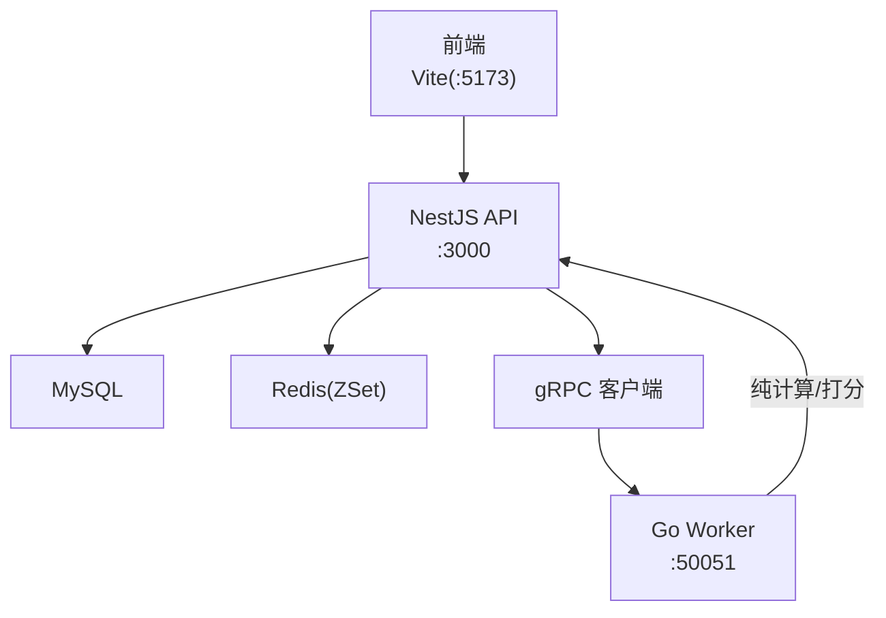
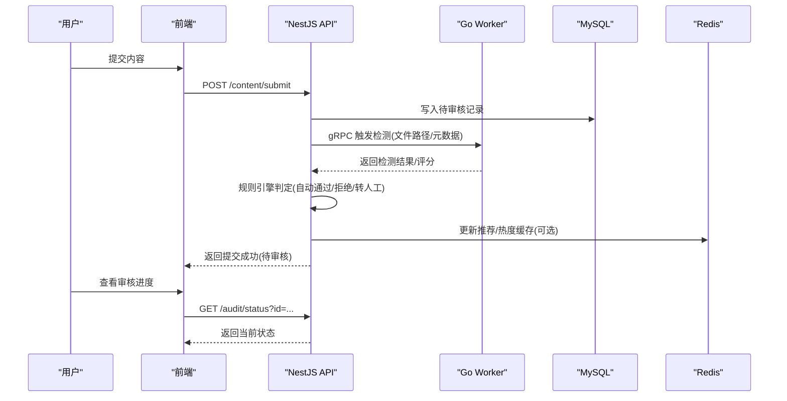
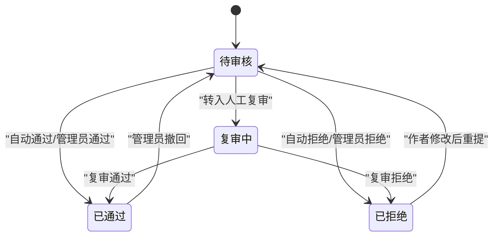
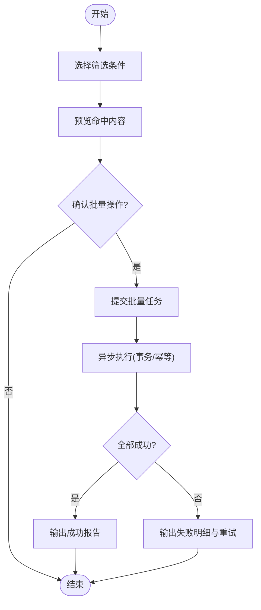
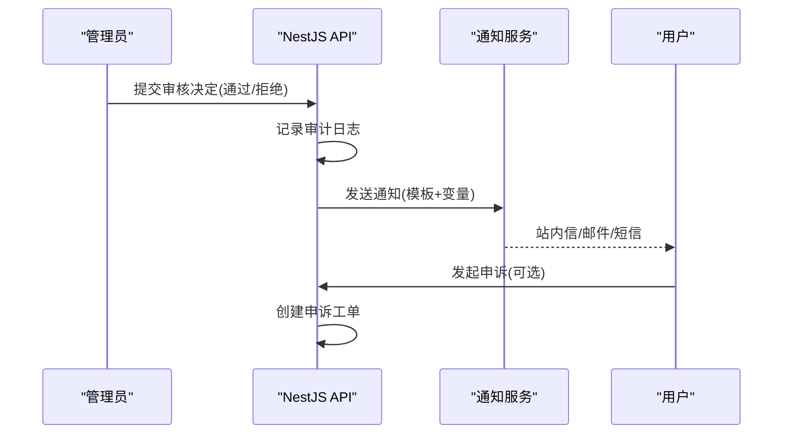
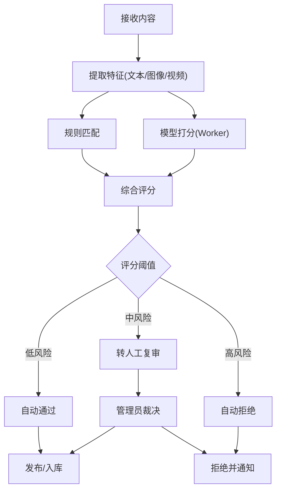
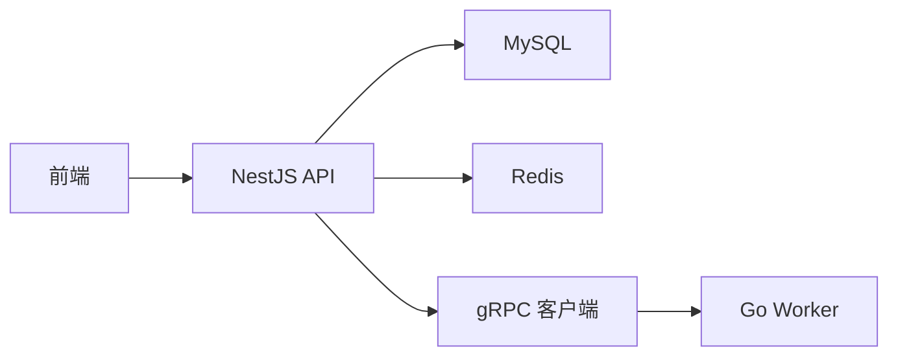

# 内容审核流程

<cite>
**本文引用的文件**   
- [xqecz.proto](file://proto/xqecz.proto)
- [packages/api/.env](file://packages/api/.env)
- [scripts/run-worker.mjs](file://scripts/run-worker.mjs)
- [packages/frontend/src/api/index.ts](file://packages/frontend/src/api/index.ts)
- [plan.md](file://plan.md)
- [AGENTS.md](file://AGENTS.md)
</cite>

## 目录
1. [简介](#简介)
2. [项目结构](#项目结构)
3. [核心组件](#核心组件)
4. [架构总览](#架构总览)
5. [详细组件分析](#详细组件分析)
6. [依赖关系分析](#依赖关系分析)
7. [性能考量](#性能考量)
8. [故障排查指南](#故障排查指南)
9. [结论](#结论)
10. [附录：API 接口文档](#附录api-接口文档)

## 简介
本文件面向 xqecz（小泉动漫二创站）的内容审核流程，覆盖状态流转、管理员权限与授权、批量审核、历史记录、通知与用户反馈、违规检测与处置策略、可配置性与扩展性，以及审核相关 API。由于当前仓库未包含审核业务的具体实现代码，本文基于项目约定与 gRPC 契约进行系统化设计说明，确保读者在不接触具体源码的情况下也能理解并落地审核工作流。

## 项目结构
- 前端通过 packages/frontend/src/api/index.ts 统一调用后端 API，所有响应格式为 { code, message, data }。
- NestJS API 服务独占 MySQL/Redis；Go Worker 是无状态 gRPC 计算服务，不直连数据库，数据经 gRPC 传入、结果回传 NestJS 落库或写缓存。
- gRPC 契约定义在 proto/xqecz.proto；NestJS 客户端启用 keepCase:true，字段使用 snake_case。
- 共享上传目录由 UPLOAD_DIR 环境变量约定，单一配置源为 packages/api/.env；worker 启动时通过 scripts/run-worker.mjs 注入同一 .env，文件路径以绝对路径经 gRPC 传递。

**图示来源** 
- [xqecz.proto](file://proto/xqecz.proto)
- [packages/api/.env](file://packages/api/.env)
- [scripts/run-worker.mjs](file://scripts/run-worker.mjs)
- [packages/frontend/src/api/index.ts](file://packages/frontend/src/api/index.ts)

**章节来源**
- [plan.md](file://plan.md)
- [AGENTS.md](file://AGENTS.md)

## 核心组件
- 审核状态机：待审核、已通过、已拒绝、复审中、撤回等。
- 管理员权限与授权：RBAC 角色控制（如 super_admin、moderator），操作审计日志。
- 批量审核：支持按条件筛选与批量变更状态。
- 审核历史：记录每次操作的审计轨迹（操作人、时间、原因、前后状态）。
- 通知与反馈：站内信/邮件/短信通知作者与管理员；用户申诉入口。
- 违规检测：规则引擎 + 可选 AI 模型（Worker 侧打分），阈值判定与降级策略。
- 可配置性：规则、阈值、审批链、通知模板、黑白名单均可配置化。

[本节为概念性概述，不涉及具体文件]

## 架构总览
审核流程贯穿“提交 → 检测 → 审核 → 发布/拒绝 → 通知 → 申诉”全链路。NestJS 负责持久化与编排，Go Worker 提供无状态计算能力（如内容指纹、AI 评分、相似度匹配），前端提供管理后台与用户端交互。

**图示来源** 
- [xqecz.proto](file://proto/xqecz.proto)
- [packages/api/.env](file://packages/api/.env)
- [scripts/run-worker.mjs](file://scripts/run-worker.mjs)
- [packages/frontend/src/api/index.ts](file://packages/frontend/src/api/index.ts)

## 详细组件分析

### 审核状态机与流转
- 初始状态：待审核。
- 自动处理：符合白名单或低风险直接通过；命中高风险规则直接拒绝。
- 人工介入：中风险进入复审队列，管理员审核后变更为已通过或已拒绝。
- 撤回与重审：管理员可撤回已通过内容至待审核；被拒绝内容允许作者修改后重新提交。
- 状态枚举建议：pending、approved、rejected、reviewing、revoked。

[本节为概念性流程图，不映射具体源码]

### 管理员权限与授权机制
- 角色划分：超级管理员（全局审核）、内容审核员（模块级审核）、运营（仅查看与统计）。
- 权限校验：API 层鉴权中间件校验 JWT/Session，结合 RBAC 决策是否允许执行审核动作。
- 审计追踪：所有审核操作记录操作人、IP、时间、原因、前后状态，支持导出与检索。
- 双人复核：对敏感内容可配置强制双人复核，避免单人误判。

[本节为概念性说明，不涉及具体文件]

### 批量审核功能
- 筛选条件：内容类型、标签、上传者、时间范围、风险等级等。
- 批量操作：批量通过、批量拒绝、批量转入复审、批量撤回。
- 幂等与事务：批量任务需具备幂等性，失败重试与部分成功回滚策略。
- 进度与结果：异步任务返回任务 ID，前端轮询或 WebSocket 推送结果。

[本节为概念性流程图，不映射具体源码]

### 审核历史记录
- 记录维度：内容 ID、操作类型、操作人、时间戳、原因、前后状态、关联证据（截图/哈希）。
- 查询与导出：支持多条件检索、分页、CSV/Excel 导出。
- 合规留存：保留期与归档策略满足平台合规要求。

[本节为概念性说明，不涉及具体文件]

### 审核通知机制与用户反馈
- 通知渠道：站内信、邮件、短信（可配置开关）。
- 触发时机：提交成功、审核通过、审核拒绝、复审结果、申诉处理完成。
- 用户反馈：申诉入口、补充材料上传、二次复核流程。
- 防骚扰：限频与去重策略，避免重复通知。

**图示来源** 
- [packages/api/.env](file://packages/api/.env)
- [packages/frontend/src/api/index.ts](file://packages/frontend/src/api/index.ts)

### 违规内容检测与处理策略
- 规则引擎：关键词、正则、黑名单、MD5/SHA 指纹、图片特征、视频帧采样。
- 模型打分：Worker 侧执行 AI 模型打分，返回风险分与建议动作。
- 阈值策略：低风险自动通过、中风险转人工、高风险自动拒绝。
- 降级策略：外部依赖缺失时降级为保守策略（默认拒绝或转人工）。

[本节为概念性流程图，不映射具体源码]

### 可配置性与扩展性
- 规则与阈值：支持热更新，无需重启服务。
- 审批链：按内容类型/标签配置多级审批。
- 通知模板：变量替换、多语言、渠道开关。
- 插件化：新增检测器或模型只需实现标准接口并通过 gRPC 接入。

[本节为概念性说明，不涉及具体文件]

## 依赖关系分析
- 前端依赖 API 接口契约（统一响应格式）。
- API 依赖 MySQL/Redis 与 gRPC 客户端。
- Worker 依赖 gRPC 服务端与本地计算资源，不依赖数据库。
- 配置文件集中于 packages/api/.env，Worker 通过脚本注入。

**图示来源** 
- [xqecz.proto](file://proto/xqecz.proto)
- [packages/api/.env](file://packages/api/.env)
- [scripts/run-worker.mjs](file://scripts/run-worker.mjs)
- [packages/frontend/src/api/index.ts](file://packages/frontend/src/api/index.ts)

**章节来源**
- [plan.md](file://plan.md)
- [AGENTS.md](file://AGENTS.md)

## 性能考量
- 审核任务异步化：提交即返回，后台异步处理，降低前端等待。
- 缓存热点：热门内容的审核结果与推荐分数写入 Redis ZSet，读取优先读缓存。
- 批处理优化：批量审核采用分批提交与并发控制，避免数据库压力。
- 降级策略：外部依赖不可用时快速失败并降级，保证主流程可用。

[本节为通用指导，不涉及具体文件]

## 故障排查指南
- 常见问题
  - gRPC 连接失败：检查 Worker 端口、网络连通、keepalive 配置。
  - 审核结果不一致：核对规则版本与阈值，检查 Worker 模型版本。
  - 通知未送达：检查渠道配置与限频策略，查看消息队列堆积。
  - 批量任务卡住：查看任务状态、重试次数、事务锁与死锁日志。
- 定位方法
  - 审计日志：按内容 ID 或操作人检索完整操作链。
  - 监控指标：审核耗时、通过率、拒绝率、超时率、错误码分布。
  - 日志聚合：API/Worker/通知服务集中收集，关联请求 ID。

[本节为通用指导，不涉及具体文件]

## 结论
本方案围绕“自动化检测 + 人工复审 + 可配置规则”的审核体系，结合 NestJS 与 Go Worker 的职责分离，实现了高可用、可扩展、易维护的内容审核工作流。通过统一的 API 契约与审计追踪，保障审核过程透明、可追溯、可度量。

[本节为总结性内容，不涉及具体文件]

## 附录：API 接口文档
以下接口为审核相关建议定义，实际实现以 NestJS API 为准。所有响应统一为 { code, message, data }。

- 提交内容
  - 方法：POST
  - 路径：/content/submit
  - 请求体：{ title, type, file_paths[], tags[], description }
  - 响应：{ code, message, data: { id, status: "pending" } }
  - 说明：写入待审核记录，触发 Worker 检测。

- 查询审核状态
  - 方法：GET
  - 路径：/audit/status
  - 查询参数：id
  - 响应：{ code, message, data: { id, status, history[] } }
  - 说明：返回当前状态与历史变更记录。

- 管理员审核
  - 方法：POST
  - 路径：/audit/approve
  - 请求体：{ id, action: "approve"|"reject", reason }
  - 响应：{ code, message, data: { id, status } }
  - 说明：执行审核动作并记录审计日志。

- 批量审核
  - 方法：POST
  - 路径：/audit/batch
  - 请求体：{ filter, action, reason }
  - 响应：{ code, message, data: { task_id } }
  - 说明：异步执行，返回任务 ID 用于进度查询。

- 批量任务进度
  - 方法：GET
  - 路径：/audit/batch/:task_id
  - 响应：{ code, message, data: { status, progress, result_summary } }
  - 说明：轮询获取批量任务执行进度与结果摘要。

- 申诉处理
  - 方法：POST
  - 路径：/appeal/create
  - 请求体：{ content_id, reason, attachments[] }
  - 响应：{ code, message, data: { appeal_id } }
  - 说明：创建申诉工单，进入复审流程。

- 统计信息
  - 方法：GET
  - 路径：/audit/stats
  - 查询参数：start_date, end_date, type
  - 响应：{ code, message, data: { total, approved, rejected, pending, avg_time } }
  - 说明：按时间范围与内容类型统计审核指标。

**章节来源**
- [packages/frontend/src/api/index.ts](file://packages/frontend/src/api/index.ts)
- [xqecz.proto](file://proto/xqecz.proto)
- [packages/api/.env](file://packages/api/.env)
- [scripts/run-worker.mjs](file://scripts/run-worker.mjs)