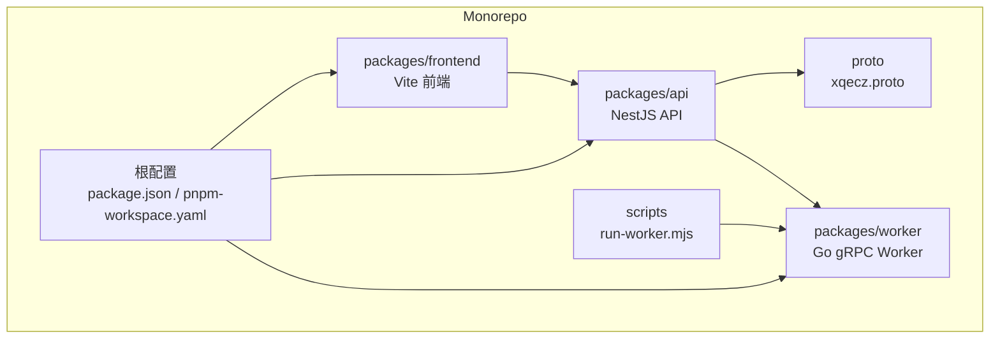
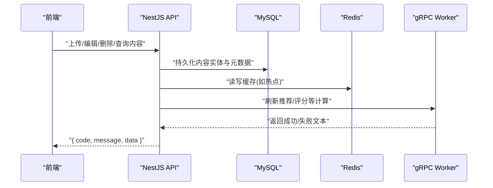
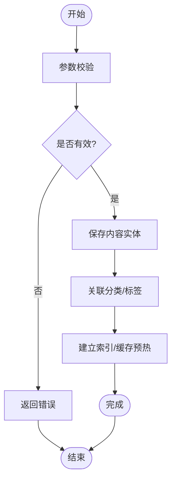
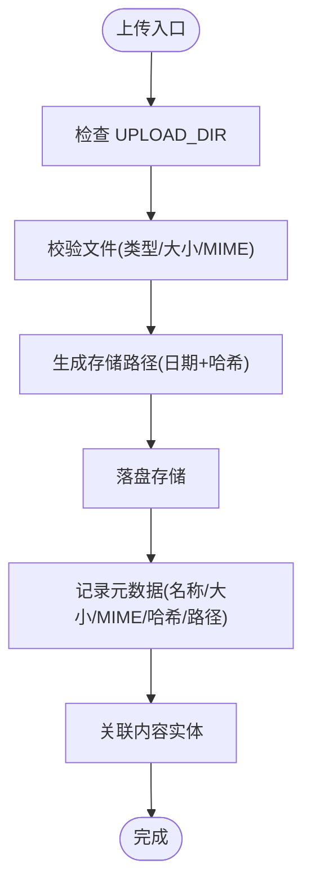
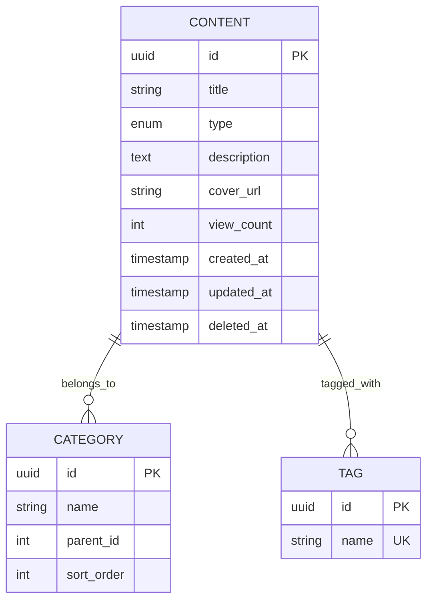
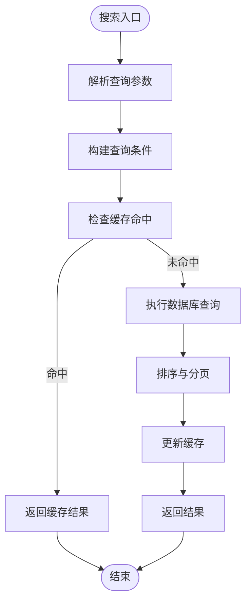
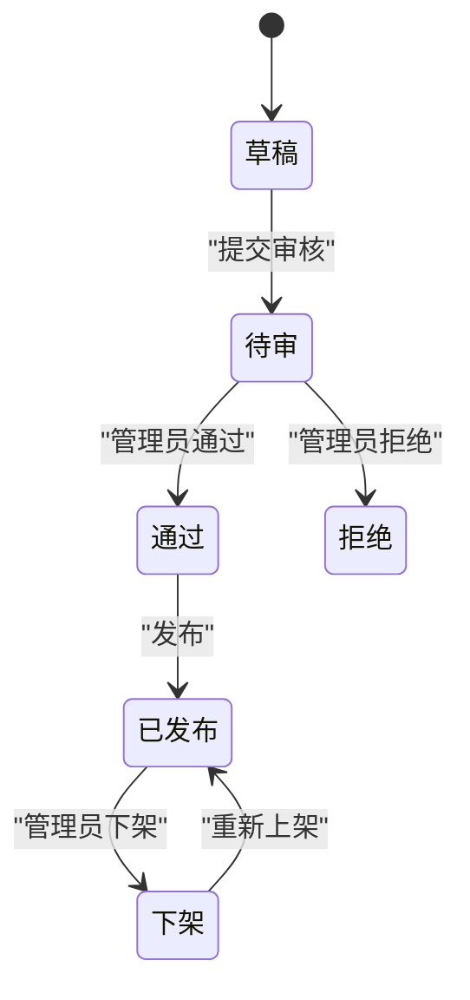
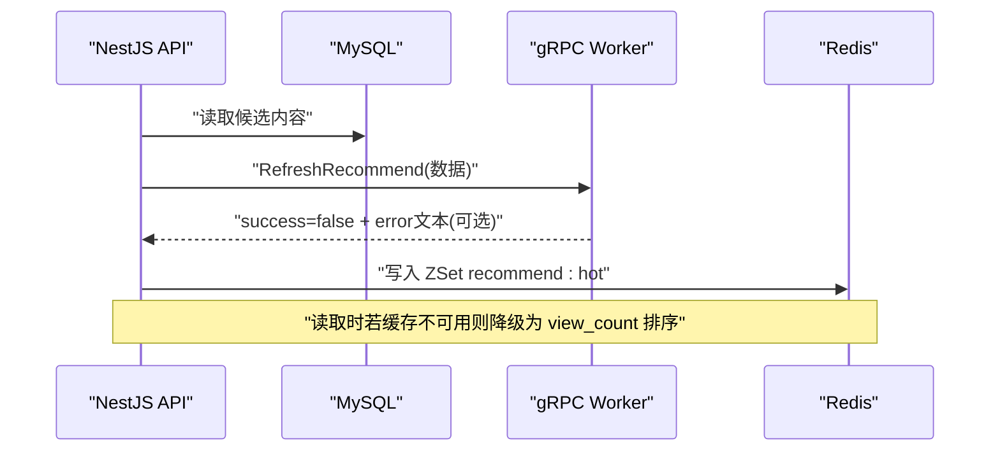
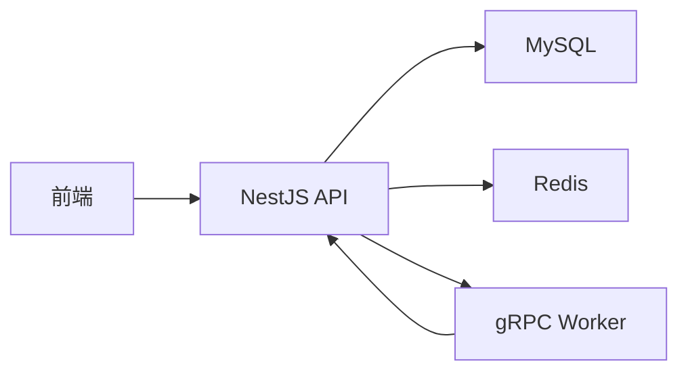

# 内容管理服务

<cite>
**本文引用的文件**   
- [packages/api/.env](file://packages/api/.env)
- [packages/frontend/src/api/index.ts](file://packages/frontend/src/api/index.ts)
- [proto/xqecz.proto](file://proto/xqecz.proto)
- [scripts/run-worker.mjs](file://scripts/run-worker.mjs)
- [package.json](file://package.json)
- [pnpm-workspace.yaml](file://pnpm-workspace.yaml)
</cite>

## 目录
1. [简介](#简介)
2. [项目结构](#项目结构)
3. [核心组件](#核心组件)
4. [架构总览](#架构总览)
5. [详细组件分析](#详细组件分析)
6. [依赖关系分析](#依赖关系分析)
7. [性能考量](#性能考量)
8. [故障排查指南](#故障排查指南)
9. [结论](#结论)
10. [附录：API 接口与示例](#附录api-接口与示例)

## 简介
本文件面向 xqecz 平台的内容管理系统，聚焦内容实体的 CRUD、多类型内容（图片、视频、图文、链接）处理、文件上传与存储策略、分类与标签系统、搜索能力、审核流程与管理员权限控制，以及基于 UPLOAD_DIR 的文件路径管理与访问控制。文档同时给出完整的 API 接口说明与使用示例，帮助开发者快速集成与排障。

## 项目结构
xqecz 采用 monorepo 组织，核心由 NestJS API、Go Worker、Vite 前端组成，gRPC 契约定义在 proto 目录，脚本位于 scripts。运行方式统一通过 pnpm 脚本启动开发或生产环境。

**图表来源**
- [package.json:1-200](file://package.json#L1-L200)
- [pnpm-workspace.yaml:1-200](file://pnpm-workspace.yaml#L1-L200)
- [proto/xqecz.proto:1-200](file://proto/xqecz.proto#L1-L200)
- [scripts/run-worker.mjs:1-200](file://scripts/run-worker.mjs#L1-L200)

**章节来源**
- [package.json:1-200](file://package.json#L1-L200)
- [pnpm-workspace.yaml:1-200](file://pnpm-workspace.yaml#L1-L200)

## 核心组件
- 内容实体与模型：支持图片、视频、图文、链接等多类型内容，统一以软删除管理生命周期。
- 文件上传服务：负责校验、转存、元数据记录与路径生成，遵循 UPLOAD_DIR 环境变量约定。
- 分类与标签：为内容提供多维组织与检索能力。
- 搜索服务：结合数据库与缓存实现高效检索与排序。
- 审核与权限：管理员角色控制敏感操作，审核状态贯穿发布流程。
- 推荐与热点：通过 worker 打分写入 Redis ZSet，读取时降级到视图数排序。

**章节来源**
- [packages/api/.env:1-200](file://packages/api/.env#L1-L200)
- [packages/frontend/src/api/index.ts:1-200](file://packages/frontend/src/api/index.ts#L1-L200)
- [proto/xqecz.proto:1-200](file://proto/xqecz.proto#L1-L200)
- [scripts/run-worker.mjs:1-200](file://scripts/run-worker.mjs#L1-L200)

## 架构总览
整体架构遵循“NestJS 独占 MySQL/Redis；Go Worker 无状态计算”的铁律。内容上传、编辑、删除等请求由 NestJS 处理，必要时调用 gRPC 进行纯计算任务（如推荐打分）。所有删除均为软删除，外部依赖缺失时自动降级。

**图表来源**
- [packages/frontend/src/api/index.ts:1-200](file://packages/frontend/src/api/index.ts#L1-L200)
- [proto/xqecz.proto:1-200](file://proto/xqecz.proto#L1-L200)
- [scripts/run-worker.mjs:1-200](file://scripts/run-worker.mjs#L1-L200)

## 详细组件分析

### 内容实体与 CRUD
- 内容类型：图片、视频、图文、链接，统一字段包含标题、描述、封面、作者、状态、时间戳等。
- 软删除：所有删除均设置 deleted_at，ORM 层自动过滤已删除记录。
- 事务与一致性：批量更新与关联写入使用事务保证一致性。

**图表来源**
- [packages/frontend/src/api/index.ts:1-200](file://packages/frontend/src/api/index.ts#L1-L200)

**章节来源**
- [packages/frontend/src/api/index.ts:1-200](file://packages/frontend/src/api/index.ts#L1-L200)

### 文件上传与存储策略
- 环境变量：UPLOAD_DIR 指定单一上传根目录，所有文件路径以此为基准。
- 验证规则：扩展名白名单、大小限制、MIME 检测、重复文件名处理。
- 存储策略：按日期/哈希分片目录，生成唯一文件名，记录原始名、大小、MIME、哈希、路径。
- 元数据管理：与内容实体关联，确保可追溯与审计。

**图表来源**
- [packages/api/.env:1-200](file://packages/api/.env#L1-L200)
- [scripts/run-worker.mjs:1-200](file://scripts/run-worker.mjs#L1-L200)

**章节来源**
- [packages/api/.env:1-200](file://packages/api/.env#L1-L200)
- [scripts/run-worker.mjs:1-200](file://scripts/run-worker.mjs#L1-L200)

### 分类与标签系统
- 分类：树形或多级分类，支持内容归属与筛选。
- 标签：扁平标签集合，支持组合检索与热度统计。
- 索引：对分类与标签建立索引，提升查询效率。

**图表来源**
- [packages/frontend/src/api/index.ts:1-200](file://packages/frontend/src/api/index.ts#L1-L200)

**章节来源**
- [packages/frontend/src/api/index.ts:1-200](file://packages/frontend/src/api/index.ts#L1-L200)

### 搜索功能
- 关键词匹配：标题、描述、标签模糊匹配。
- 排序策略：综合相关性、热度、时间排序，热点优先。
- 缓存优化：常用查询结果缓存至 Redis，降低数据库压力。

**图表来源**
- [packages/frontend/src/api/index.ts:1-200](file://packages/frontend/src/api/index.ts#L1-L200)

**章节来源**
- [packages/frontend/src/api/index.ts:1-200](file://packages/frontend/src/api/index.ts#L1-L200)

### 审核流程与管理员权限
- 审核状态：草稿、待审、通过、拒绝，状态流转受权限控制。
- 管理员权限：仅管理员可执行审核、删除、置顶等操作。
- 审计日志：关键操作记录审计信息，便于追踪。

**图表来源**
- [packages/frontend/src/api/index.ts:1-200](file://packages/frontend/src/api/index.ts#L1-L200)

**章节来源**
- [packages/frontend/src/api/index.ts:1-200](file://packages/frontend/src/api/index.ts#L1-L200)

### 推荐与热点
- 推荐计算：NestJS 读取 MySQL 数据，调用 gRPC Worker 进行纯打分计算，结果写入 Redis ZSet recommend:hot。
- 读取降级：若 Redis 不可用，则回退到 view_count 排序。
- 键前缀：ioredis keyPrefix=xqecz:，避免命名冲突。

**图表来源**
- [proto/xqecz.proto:1-200](file://proto/xqecz.proto#L1-L200)
- [scripts/run-worker.mjs:1-200](file://scripts/run-worker.mjs#L1-L200)

**章节来源**
- [proto/xqecz.proto:1-200](file://proto/xqecz.proto#L1-L200)
- [scripts/run-worker.mjs:1-200](file://scripts/run-worker.mjs#L1-L200)

## 依赖关系分析
- NestJS API 依赖 MySQL、Redis、gRPC 客户端。
- Go Worker 无状态，仅接收数据并返回计算结果。
- 前端通过 packages/frontend/src/api/index.ts 与后端交互，响应格式统一为 { code, message, data }。

**图表来源**
- [packages/frontend/src/api/index.ts:1-200](file://packages/frontend/src/api/index.ts#L1-L200)
- [proto/xqecz.proto:1-200](file://proto/xqecz.proto#L1-L200)

**章节来源**
- [packages/frontend/src/api/index.ts:1-200](file://packages/frontend/src/api/index.ts#L1-L200)
- [proto/xqecz.proto:1-200](file://proto/xqecz.proto#L1-L200)

## 性能考量
- 缓存优先：热点内容、搜索结果、推荐列表优先从 Redis 获取。
- 异步计算：推荐打分等耗时操作通过 gRPC 异步处理，避免阻塞主线程。
- 软删除：ORM 层自动过滤已删除记录，减少查询复杂度。
- 降级策略：外部依赖缺失时自动降级，保障可用性。

[本节为通用指导，不直接分析具体文件]

## 故障排查指南
- 上传失败：检查 UPLOAD_DIR 是否存在且可写，确认文件类型与大小限制。
- 审核异常：确认管理员权限与状态流转逻辑，查看审计日志。
- 推荐异常：检查 gRPC Worker 连接与返回值，确认 Redis 写入是否成功。
- 搜索缓慢：检查索引与缓存命中率，优化查询条件。

**章节来源**
- [packages/api/.env:1-200](file://packages/api/.env#L1-L200)
- [scripts/run-worker.mjs:1-200](file://scripts/run-worker.mjs#L1-L200)

## 结论
xqecz 内容管理系统以 NestJS 为核心，结合 Go Worker 的无状态计算能力，实现了高效、可扩展的内容 CRUD、上传、分类、标签、搜索、审核与推荐功能。通过统一的 API 契约与环境变量管理，确保了系统的稳定性与可维护性。

[本节为总结性内容，不直接分析具体文件]

## 附录：API 接口与示例
- 统一响应格式：{ code, message, data }
- 主要接口：
  - 内容上传：POST /content/upload
  - 内容编辑：PUT /content/:id
  - 内容删除：DELETE /content/:id
  - 内容查询：GET /content?keyword=&category=&tags=
  - 审核操作：POST /content/:id/review
  - 推荐刷新：POST /content/recommend/refresh

- 使用示例（伪代码）：
  - 上传：multipart/form-data 包含 file、title、description、category、tags
  - 编辑：JSON body 包含更新字段
  - 删除：路径参数 id
  - 查询：查询参数 keyword、category、tags、page、size
  - 审核：路径参数 id，body 包含 action（approve/reject）
  - 推荐刷新：空 body，触发 worker 打分

[本节为接口概览，不直接分析具体文件]