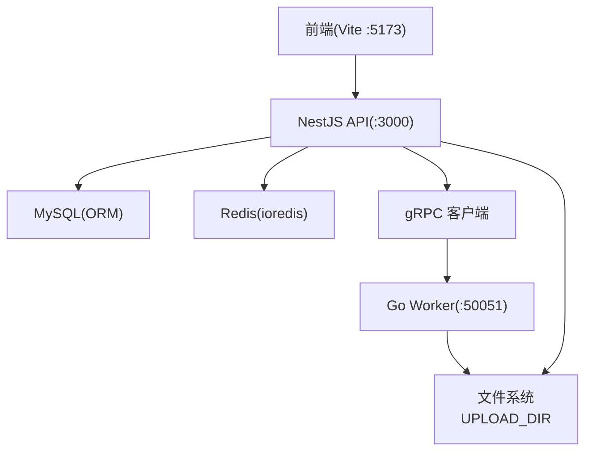
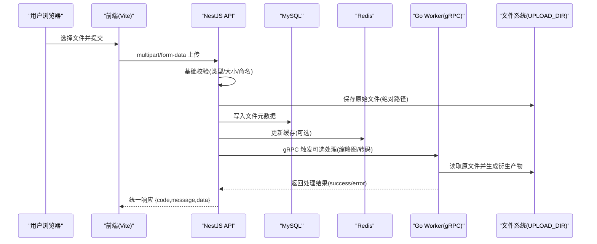
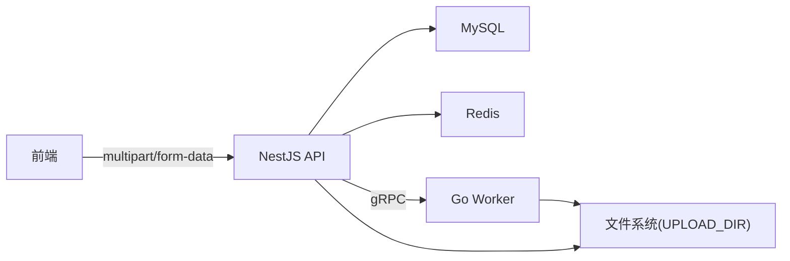

# 文件上传系统

<cite>
**本文引用的文件**   
- [packages/api/.env](file://packages/api/.env)
- [proto/xqecz.proto](file://proto/xqecz.proto)
- [scripts/run-worker.mjs](file://scripts/run-worker.mjs)
- [packages/frontend/src/api/index.ts](file://packages/frontend/src/api/index.ts)
</cite>

## 目录
1. [简介](#简介)
2. [项目结构](#项目结构)
3. [核心组件](#核心组件)
4. [架构总览](#架构总览)
5. [详细组件分析](#详细组件分析)
6. [依赖关系分析](#依赖关系分析)
7. [性能考虑](#性能考虑)
8. [故障排查指南](#故障排查指南)
9. [结论](#结论)
10. [附录：API 接口文档](#附录api-接口文档)

## 简介
本文件为 xqecz 平台的“文件上传系统”提供完整、可操作的文档。内容覆盖前端表单提交、后端接收与校验、文件存储策略与元数据管理、访问控制与安全策略，以及可选的压缩/转码处理流程。同时给出基于 multipart/form-data 的 API 规范、大小限制与错误处理约定，帮助开发者快速集成与排障。

## 项目结构
xqecz 采用 monorepo 组织，当前运行方式以 pnpm 脚本本地直启为主：NestJS API（:3000）、Go Worker（:50051）、Vite 前端（:5173）。共享上传目录由环境变量 UPLOAD_DIR 统一配置，单一配置源位于 packages/api/.env；worker 启动时通过 scripts/run-worker.mjs 自动读取同一 .env 注入，文件路径经 gRPC 以绝对路径传递。前后端唯一接口契约定义在 packages/frontend/src/api/index.ts，所有响应统一包装为 { code, message, data }。

图表来源
- [packages/api/.env](file://packages/api/.env)
- [proto/xqecz.proto](file://proto/xqecz.proto)
- [scripts/run-worker.mjs](file://scripts/run-worker.mjs)
- [packages/frontend/src/api/index.ts](file://packages/frontend/src/api/index.ts)

章节来源
- [packages/api/.env](file://packages/api/.env)
- [proto/xqecz.proto](file://proto/xqecz.proto)
- [scripts/run-worker.mjs](file://scripts/run-worker.mjs)
- [packages/frontend/src/api/index.ts](file://packages/frontend/src/api/index.ts)

## 核心组件
- 前端上传入口：基于 Vite 的前端应用，按 packages/frontend/src/api/index.ts 定义的接口契约发起 multipart/form-data 请求。
- NestJS API：负责接收上传、基础校验、生成元数据、调用 gRPC 进行可选处理（压缩/转码），并落库/写缓存。
- Go Worker：无状态 gRPC 计算服务，执行 CPU 密集型任务（如缩略图生成、视频转码），不直接读写数据库。
- 文件系统：由 UPLOAD_DIR 指定的共享目录，存放原始文件与衍生产物（缩略图、转码后文件等）。
- 元数据与持久化：通过 ORM 写入 MySQL，并通过 Redis 缓存热点数据（如推荐列表）。

章节来源
- [packages/frontend/src/api/index.ts](file://packages/frontend/src/api/index.ts)
- [proto/xqecz.proto](file://proto/xqecz.proto)
- [scripts/run-worker.mjs](file://scripts/run-worker.mjs)
- [packages/api/.env](file://packages/api/.env)

## 架构总览
下图展示了从前端到后端再到存储与计算的端到端链路，包括可选的 worker 处理环节。

图表来源
- [packages/frontend/src/api/index.ts](file://packages/frontend/src/api/index.ts)
- [proto/xqecz.proto](file://proto/xqecz.proto)
- [scripts/run-worker.mjs](file://scripts/run-worker.mjs)
- [packages/api/.env](file://packages/api/.env)

## 详细组件分析

### 前端表单与上传流程
- 使用 multipart/form-data 格式提交，字段名与顺序遵循 packages/frontend/src/api/index.ts 中约定的接口契约。
- 建议在前端完成基础校验（类型白名单、大小上限提示），减少无效请求。
- 支持断点续传与分片上传的场景可在前端实现，但需与后端保持一致的分片策略与合并逻辑。

章节来源
- [packages/frontend/src/api/index.ts](file://packages/frontend/src/api/index.ts)

### 后端接收与验证
- 接收端对 multipart/form-data 进行解析，校验字段完整性与类型。
- 文件类型校验：仅允许图片、视频、音频等受支持的 MIME 或扩展名白名单。
- 文件大小限制：依据业务与存储策略设置上限，超限返回统一错误码。
- 文件名安全：拒绝包含路径穿越字符的文件名，必要时重命名为安全标识。
- 元数据生成：记录原始文件名、MIME、大小、哈希、上传者、时间戳等。

章节来源
- [packages/api/.env](file://packages/api/.env)

### 文件存储策略与路径管理
- 共享目录：通过 UPLOAD_DIR 环境变量指定根目录，确保 API 与 Worker 使用同一物理路径。
- 路径组织：可按日期/类型/用户维度划分子目录，避免单目录文件过多导致 I/O 退化。
- 原子写入：先写入临时文件，成功后再移动至目标路径，避免半写文件被访问。
- 衍生产物：缩略图、转码后的文件与原文件同目录或独立子目录，便于清理与迁移。

章节来源
- [packages/api/.env](file://packages/api/.env)
- [scripts/run-worker.mjs](file://scripts/run-worker.mjs)

### 元数据管理与持久化
- 元数据模型：包含文件标识、原始文件名、MIME、大小、哈希、存储路径、版本、删除标记等。
- 软删除：所有删除操作均为软删除（deleted_at + ORM 注解），查询自动过滤已删除项。
- 缓存策略：热点文件信息（如推荐列表）写入 Redis，keyPrefix=xqecz:，提升读取性能。

章节来源
- [packages/api/.env](file://packages/api/.env)
- [packages/frontend/src/api/index.ts](file://packages/frontend/src/api/index.ts)

### 可选处理流程（压缩/转码）
- 触发时机：上传成功后，根据文件类型与业务需求异步触发 worker 处理。
- 处理内容：图片压缩/生成缩略图；视频转码/提取封面；音频转码/提取时长等。
- 失败降级：外部依赖缺失一律降级，gRPC 不抛 rpc error，只返回 success=false 与错误文本。
- 结果回写：将衍生产物路径与处理状态写回元数据，供后续访问使用。

章节来源
- [proto/xqecz.proto](file://proto/xqecz.proto)
- [scripts/run-worker.mjs](file://scripts/run-worker.mjs)

### 访问控制与安全防护
- 鉴权：上传接口需登录态校验，防止匿名上传。
- 权限：仅资源所有者或管理员可修改/删除元数据与文件。
- 输入校验：严格白名单校验类型与大小，拒绝恶意载荷。
- 路径安全：禁止路径穿越，统一规范化路径。
- 输出安全：对外暴露的访问 URL 应做签名或短期有效令牌，避免直接暴露内部路径。

章节来源
- [packages/api/.env](file://packages/api/.env)
- [packages/frontend/src/api/index.ts](file://packages/frontend/src/api/index.ts)

### 错误处理与统一响应
- 统一响应格式：{ code, message, data }，前端据此判断成功与否与展示消息。
- 错误分类：参数错误、类型不支持、大小超限、存储失败、worker 处理失败等。
- 降级策略：外部依赖不可用时返回 success=false 与可读错误文本，不影响主流程。

章节来源
- [packages/frontend/src/api/index.ts](file://packages/frontend/src/api/index.ts)

## 依赖关系分析
- 前端依赖 packages/frontend/src/api/index.ts 的接口契约。
- NestJS API 依赖 MySQL/Redis 与文件系统（UPLOAD_DIR），并通过 gRPC 客户端调用 Go Worker。
- Go Worker 依赖文件系统与可选的外部工具（如 FFmpeg/Tinify），无数据库连接。
- 环境变量 UPLOAD_DIR 是 API 与 Worker 共享的唯一配置源。

图表来源
- [packages/frontend/src/api/index.ts](file://packages/frontend/src/api/index.ts)
- [proto/xqecz.proto](file://proto/xqecz.proto)
- [scripts/run-worker.mjs](file://scripts/run-worker.mjs)
- [packages/api/.env](file://packages/api/.env)

章节来源
- [packages/frontend/src/api/index.ts](file://packages/frontend/src/api/index.ts)
- [proto/xqecz.proto](file://proto/xqecz.proto)
- [scripts/run-worker.mjs](file://scripts/run-worker.mjs)
- [packages/api/.env](file://packages/api/.env)

## 性能考虑
- 大文件上传：建议启用流式处理与分片上传，降低内存占用与超时风险。
- 并发处理：worker 无状态设计，可通过水平扩容提升吞吐。
- 缓存命中：热点文件元数据与推荐列表优先读 Redis，降低数据库压力。
- 存储布局：合理分目录与索引，避免单目录文件过多造成 I/O 瓶颈。
- 异步处理：耗时任务（转码/压缩）走 gRPC 异步，避免阻塞上传主流程。

[本节为通用指导，无需特定文件来源]

## 故障排查指南
- 上传失败：检查前端表单字段是否符合契约，确认类型白名单与大小限制。
- 存储异常：核对 UPLOAD_DIR 是否存在且可写，路径是否被安全策略拦截。
- Worker 处理失败：查看返回的 success 与 error 文本，定位外部依赖是否可用。
- 元数据不一致：比对数据库与文件系统路径，确认原子写入与软删除策略。
- 缓存问题：检查 Redis keyPrefix 与键空间，确认热点数据是否正确更新。

章节来源
- [packages/api/.env](file://packages/api/.env)
- [proto/xqecz.proto](file://proto/xqecz.proto)
- [scripts/run-worker.mjs](file://scripts/run-worker.mjs)
- [packages/frontend/src/api/index.ts](file://packages/frontend/src/api/index.ts)

## 结论
本文件上传系统以统一的 UPLOAD_DIR 为核心，结合 NestJS API 与无状态 Go Worker，实现了可扩展、高可用的文件上传与处理链路。通过严格的输入校验、安全的存储策略与完善的错误降级机制，保障平台稳定运行。前端遵循统一接口契约，简化集成与维护成本。

[本节为总结性内容，无需特定文件来源]

## 附录：API 接口文档

### 上传接口
- 方法：POST
- 路径：/upload（示例，具体以 packages/frontend/src/api/index.ts 为准）
- Content-Type：multipart/form-data
- 请求体字段
  - file：二进制文件
  - type：文件类型（图片/视频/音频等，用于路由处理）
  - title：标题（可选）
  - description：描述（可选）
- 响应格式
  - { code, message, data }
  - code：数字状态码
  - message：人类可读消息
  - data：上传结果（包含文件标识、路径、衍生产物信息等）

### 支持的类型与验证规则
- 图片：常见图片扩展名与 MIME 白名单；尺寸与分辨率可选校验。
- 视频：常见视频扩展名与 MIME 白名单；时长与码率可选校验。
- 音频：常见音频扩展名与 MIME 白名单；采样率与时长可选校验。
- 大小限制：依据业务与存储策略设定上限，超限返回参数错误。

### 文件大小限制
- 前端提示与后端校验双重限制，避免无效请求。
- 大文件建议分片上传，后端按分片策略合并。

### 错误处理
- 参数错误：字段缺失或类型不符。
- 类型不支持：不在白名单内。
- 大小超限：超过限制。
- 存储失败：磁盘不可用或权限不足。
- 处理失败：worker 返回 success=false 与错误文本。

章节来源
- [packages/frontend/src/api/index.ts](file://packages/frontend/src/api/index.ts)
- [proto/xqecz.proto](file://proto/xqecz.proto)
- [scripts/run-worker.mjs](file://scripts/run-worker.mjs)
- [packages/api/.env](file://packages/api/.env)