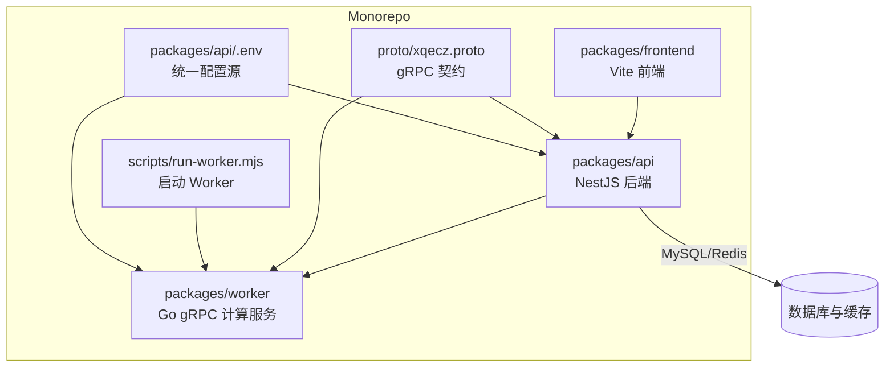
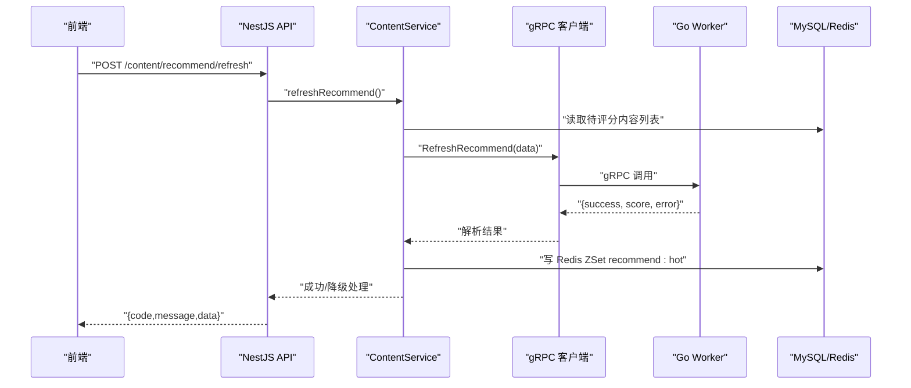
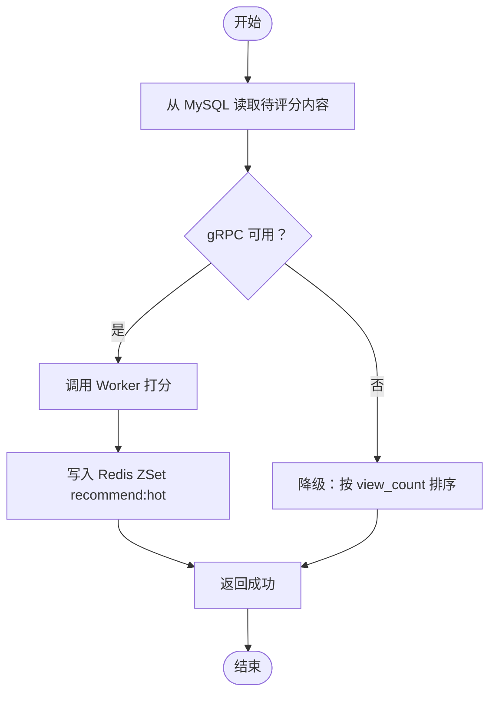
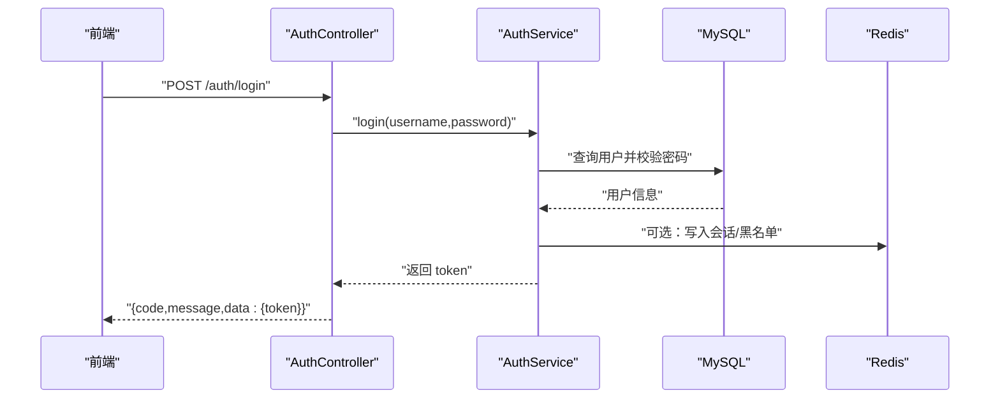
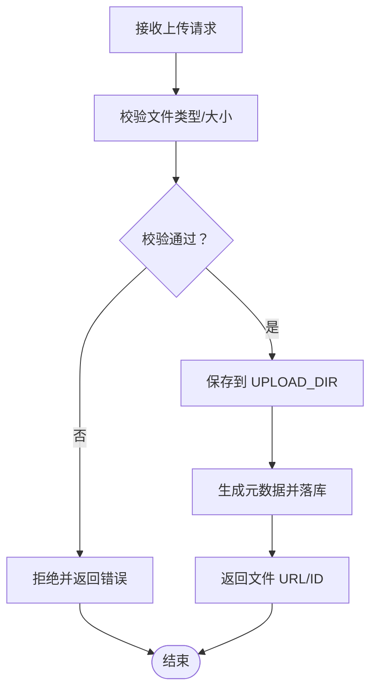
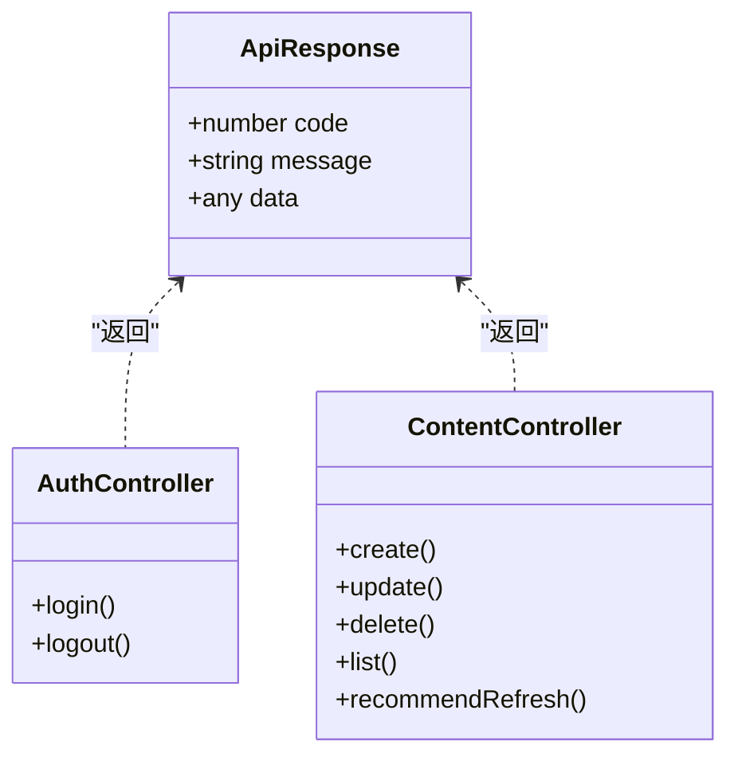
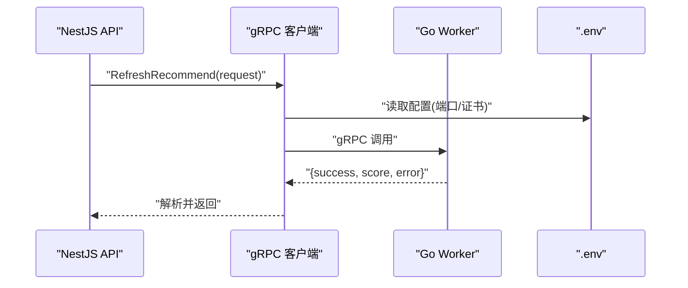
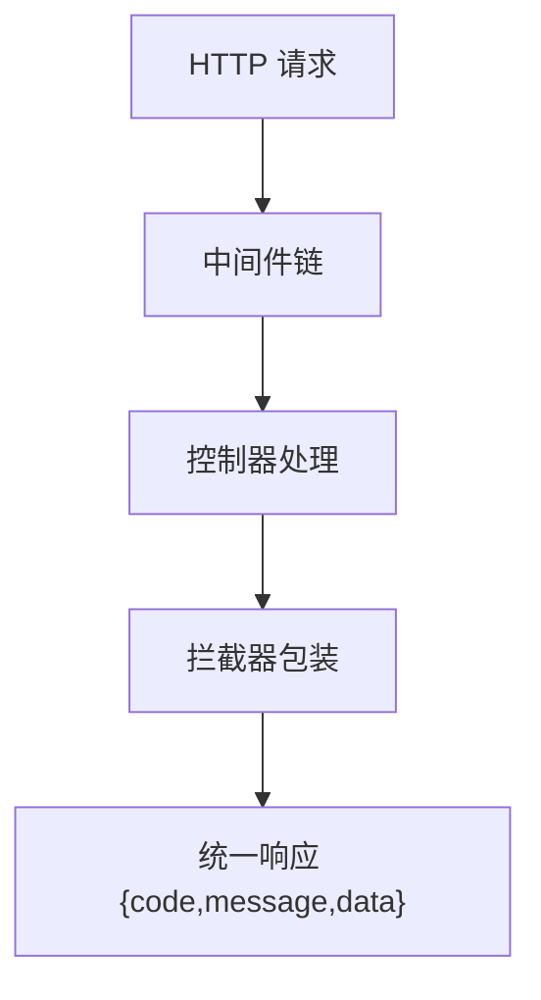
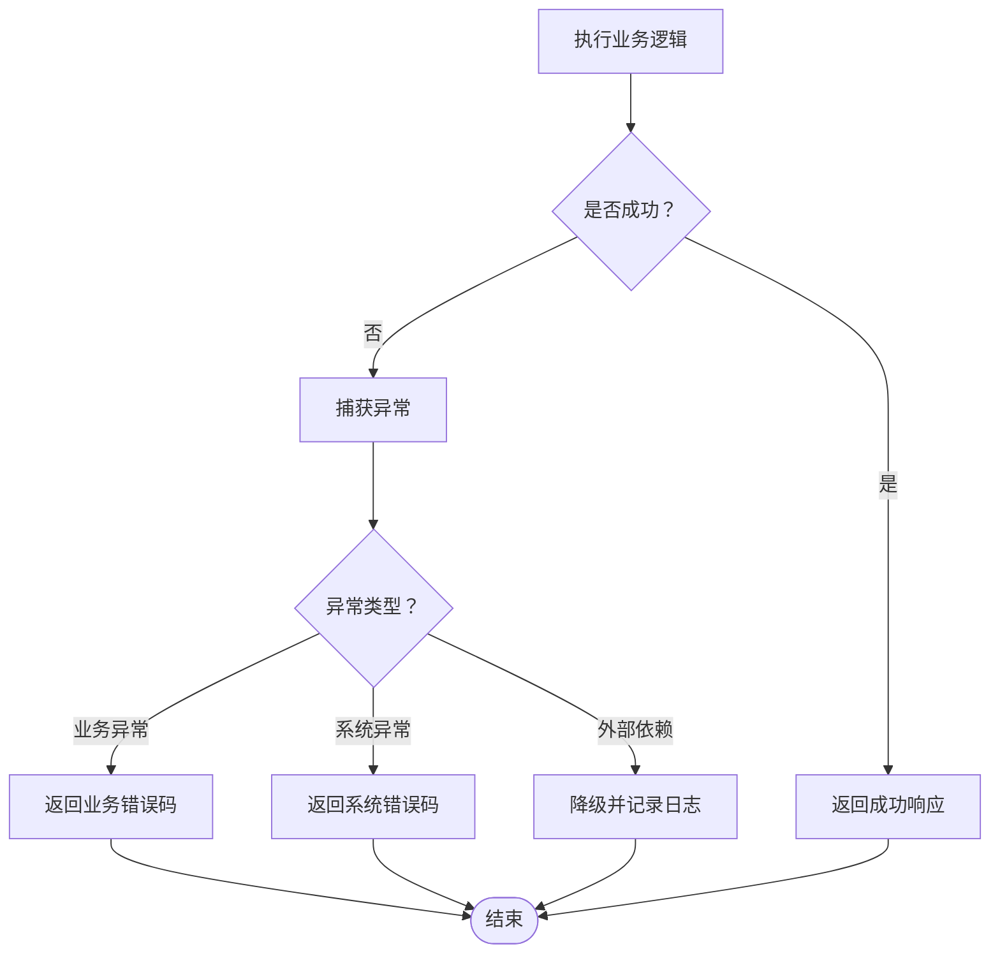
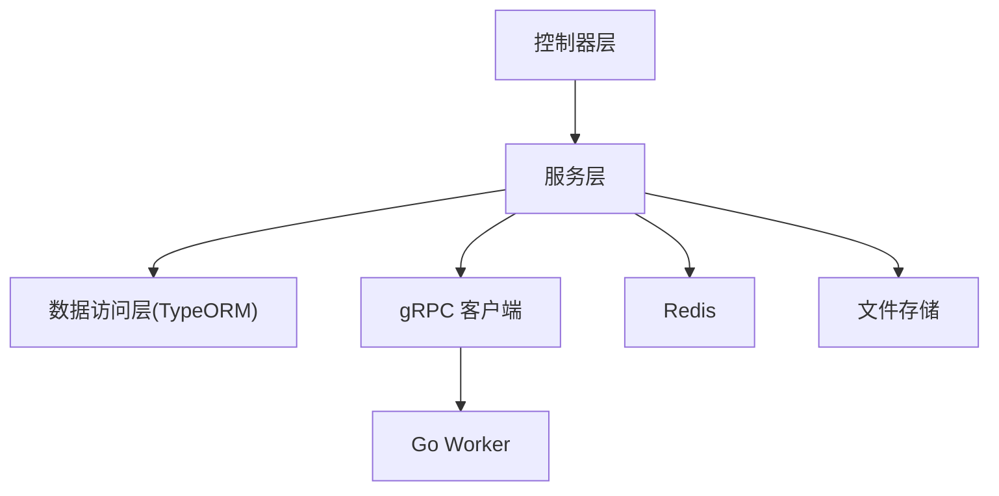

# 后端 API 服务 (NestJS)

<cite>
**本文引用的文件**   
- [packages/api/.env](file://packages/api/.env)
- [packages/frontend/src/api/index.ts](file://packages/frontend/src/api/index.ts)
- [proto/xqecz.proto](file://proto/xqecz.proto)
- [scripts/run-worker.mjs](file://scripts/run-worker.mjs)
- [package.json](file://package.json)
- [pnpm-workspace.yaml](file://pnpm-workspace.yaml)
</cite>

## 目录
1. [简介](#简介)
2. [项目结构](#项目结构)
3. [核心组件](#核心组件)
4. [架构总览](#架构总览)
5. [详细组件分析](#详细组件分析)
6. [依赖关系分析](#依赖关系分析)
7. [性能考量](#性能考量)
8. [故障排查指南](#故障排查指南)
9. [结论](#结论)
10. [附录](#附录)

## 简介
本仓库为“小泉动漫二创站（xqecz）”的 NestJS 后端服务文档。平台面向用户上传与浏览二次创作内容（图片、视频、图文、链接），并支持评论、投票与管理后台。后端采用 NestJS 模块化架构，独占 MySQL/Redis；Go Worker 作为无状态 gRPC 计算服务，仅负责纯打分等计算任务，不连接数据库或执行定时任务。API 响应统一为 { code, message, data } 格式，前后端契约以 packages/frontend/src/api/index.ts 为准。所有删除均为软删除，外部依赖缺失时一律降级处理。

## 项目结构
- Monorepo 使用 pnpm workspace，包含 api、frontend、worker 三个子包以及 proto 定义与脚本。
- 运行方式：本地开发通过 pnpm dev 同时启动 NestJS API(:3000)、Go Worker(:50051)、Vite 前端(:5173)；生产模式通过 pnpm start 一键构建+运行。
- 配置来源：单一 .env 位于 packages/api/.env，共享上传目录由 UPLOAD_DIR 环境变量约定；Worker 启动脚本会读取同一 .env 注入环境变量。
- gRPC 契约：定义在 proto/xqecz.proto，NestJS 客户端启用 keepCase:true，字段使用 snake_case；proto/gen 与 packages/worker/proto 为生成产物。

**图表来源** 
- [package.json:1-20](file://package.json#L1-L20)
- [pnpm-workspace.yaml:1-20](file://pnpm-workspace.yaml#L1-L20)
- [proto/xqecz.proto:1-50](file://proto/xqecz.proto#L1-L50)
- [scripts/run-worker.mjs:1-30](file://scripts/run-worker.mjs#L1-L30)
- [packages/api/.env:1-20](file://packages/api/.env#L1-L20)

**章节来源**
- [package.json:1-20](file://package.json#L1-L20)
- [pnpm-workspace.yaml:1-20](file://pnpm-workspace.yaml#L1-L20)

## 核心组件
- 控制器层（Controllers）：接收 HTTP 请求，参数校验，调用服务层，返回统一响应包装。
- 服务层（Services）：业务逻辑编排，事务控制，调用数据访问层与 gRPC Worker，处理降级与错误。
- 数据访问层（Repositories/Entities）：基于 TypeORM 的实体与查询封装，软删除自动过滤。
- gRPC 客户端：封装对 Go Worker 的调用，保持字段命名一致，失败返回 success=false + error 文本。
- 中间件与拦截器：用于日志、鉴权、统一响应包装、异常转换等横切关注点。
- 配置与环境：集中管理数据库、缓存、上传目录、第三方服务开关与降级策略。

**章节来源**
- [packages/api/.env:1-20](file://packages/api/.env#L1-L20)
- [packages/frontend/src/api/index.ts:1-50](file://packages/frontend/src/api/index.ts#L1-L50)

## 架构总览
NestJS 后端作为唯一数据面，承担用户认证授权、内容管理、文件上传、推荐刷新等职责；Go Worker 作为纯计算侧，提供推荐算法打分能力。两者通过 gRPC 通信，NestJS 负责将输入数据传入 Worker，并将结果落库或写入 Redis ZSet 缓存。

**图表来源** 
- [proto/xqecz.proto:1-50](file://proto/xqecz.proto#L1-L50)
- [packages/api/.env:1-20](file://packages/api/.env#L1-L20)

## 详细组件分析

### 内容管理服务（ContentService）
- 职责：内容 CRUD、评论、投票、推荐刷新、视图计数更新。
- 关键流程：
  - 读取 MySQL 中待评分内容 → 调用 gRPC RefreshRecommend → 将分数写入 Redis ZSet recommend:hot（ioredis keyPrefix=xqecz:）。
  - 读取推荐时优先读 ZSet，降级为按 view_count 排序。
- 软删除：所有实体均含 deleted_at，TypeORM @DeleteDateColumn 自动过滤已删除记录。
- 降级策略：当 gRPC 不可用时，返回 success=false + error 文本，API 层继续走降级路径。

**图表来源** 
- [packages/api/.env:1-20](file://packages/api/.env#L1-L20)
- [proto/xqecz.proto:1-50](file://proto/xqecz.proto#L1-L50)

**章节来源**
- [packages/api/.env:1-20](file://packages/api/.env#L1-L20)
- [proto/xqecz.proto:1-50](file://proto/xqecz.proto#L1-L50)

### 用户认证与授权
- 认证流程：登录接口校验用户名/密码，签发 JWT；受保护路由通过守卫验证令牌。
- 授权策略：基于角色或资源权限的装饰器控制访问。
- 安全建议：敏感信息从 .env 读取，避免硬编码；JWT 过期时间合理设置；密码哈希存储。

**图表来源** 
- [packages/api/.env:1-20](file://packages/api/.env#L1-L20)

**章节来源**
- [packages/api/.env:1-20](file://packages/api/.env#L1-L20)

### 文件上传处理
- 上传入口：控制器接收 multipart/form-data，校验文件大小与类型。
- 存储策略：统一目录 UPLOAD_DIR，文件名去重与扩展名校验。
- 第三方集成：Tinify/S3/FFmpeg 可选，缺失时降级为本地存储。
- 元数据持久化：记录文件路径、大小、类型、MD5 等。

**图表来源** 
- [packages/api/.env:1-20](file://packages/api/.env#L1-L20)

**章节来源**
- [packages/api/.env:1-20](file://packages/api/.env#L1-L20)

### RESTful API 设计规范
- 统一响应格式：{ code, message, data }，由拦截器或响应管道包装。
- 版本化：URL 前缀如 /api/v1，便于演进。
- 错误码：业务错误码与 HTTP 状态码分离，message 描述清晰。
- 契约文件：packages/frontend/src/api/index.ts 为前后端唯一接口契约。

**图表来源** 
- [packages/frontend/src/api/index.ts:1-50](file://packages/frontend/src/api/index.ts#L1-L50)

**章节来源**
- [packages/frontend/src/api/index.ts:1-50](file://packages/frontend/src/api/index.ts#L1-L50)

### gRPC Worker 集成与推荐算法
- 契约：proto/xqecz.proto 定义服务与方法，字段 snake_case，keepCase:true。
- 调用流程：NestJS 客户端构造请求 → Worker 纯打分 → 返回 success 与 error 文本。
- 启动脚本：scripts/run-worker.mjs 读取 .env 注入环境变量，确保 Worker 与 API 共享配置。

**图表来源** 
- [proto/xqecz.proto:1-50](file://proto/xqecz.proto#L1-L50)
- [scripts/run-worker.mjs:1-30](file://scripts/run-worker.mjs#L1-L30)
- [packages/api/.env:1-20](file://packages/api/.env#L1-L20)

**章节来源**
- [proto/xqecz.proto:1-50](file://proto/xqecz.proto#L1-L50)
- [scripts/run-worker.mjs:1-30](file://scripts/run-worker.mjs#L1-L30)
- [packages/api/.env:1-20](file://packages/api/.env#L1-L20)

### 中间件与拦截器
- 中间件：请求日志、CORS、速率限制、请求体解析。
- 拦截器：统一响应包装、耗时统计、异常转换。
- 最佳实践：尽量在拦截器完成响应格式化，避免在各控制器重复包装。

**章节来源**
- [packages/api/.env:1-20](file://packages/api/.env#L1-L20)

### 错误处理策略
- 全局异常过滤器：捕获未处理异常，转换为统一错误响应。
- 业务异常：抛出领域异常，携带错误码与消息。
- 外部依赖降级：第三方服务不可用时返回 success=false + error 文本，不影响主流程。

**章节来源**
- [packages/api/.env:1-20](file://packages/api/.env#L1-L20)

## 依赖关系分析
- NestJS 模块间低耦合：控制器依赖服务，服务依赖数据访问与 gRPC 客户端。
- 外部依赖：MySQL、Redis、gRPC Worker、可选的 Tinify/S3/FFmpeg。
- 配置依赖：统一 .env 源，避免分散配置导致不一致。

**图表来源** 
- [packages/api/.env:1-20](file://packages/api/.env#L1-L20)
- [proto/xqecz.proto:1-50](file://proto/xqecz.proto#L1-L50)

**章节来源**
- [packages/api/.env:1-20](file://packages/api/.env#L1-L20)
- [proto/xqecz.proto:1-50](file://proto/xqecz.proto#L1-L50)

## 性能考量
- 推荐读取优先 Redis ZSet，降级为 MySQL 排序，降低热点查询压力。
- 文件上传分片与并发控制，避免大文件阻塞。
- gRPC 调用超时与重试策略，避免级联失败。
- 数据库索引优化：常见查询字段建立索引，减少全表扫描。

## 故障排查指南
- 常见问题：
  - gRPC 连接失败：检查端口、证书、防火墙与 .env 配置。
  - 文件上传失败：确认 UPLOAD_DIR 权限与磁盘空间。
  - 推荐刷新失败：查看 Worker 日志与 Redis 写入情况。
- 调试建议：
  - 开启 NestJS 详细日志，定位异常堆栈。
  - 使用 Redis CLI 检查 recommend:hot 键值分布。
  - 通过 scripts/run-worker.mjs 启动 Worker 并观察输出。

**章节来源**
- [scripts/run-worker.mjs:1-30](file://scripts/run-worker.mjs#L1-L30)
- [packages/api/.env:1-20](file://packages/api/.env#L1-L20)

## 结论
本后端服务以 NestJS 为核心，结合 TypeORM 与 gRPC Worker，构建了高内聚、低耦合的内容管理与推荐系统。统一的响应格式与完善的错误处理策略保障了前后端协作与系统稳定性。通过合理的降级与监控，系统在外部依赖不可用时仍能维持基本功能。

## 附录
- 运行命令：pnpm dev（开发）、pnpm start（生产）
- 环境配置：packages/api/.env 为唯一配置源
- 接口契约：packages/frontend/src/api/index.ts
- gRPC 契约：proto/xqecz.proto