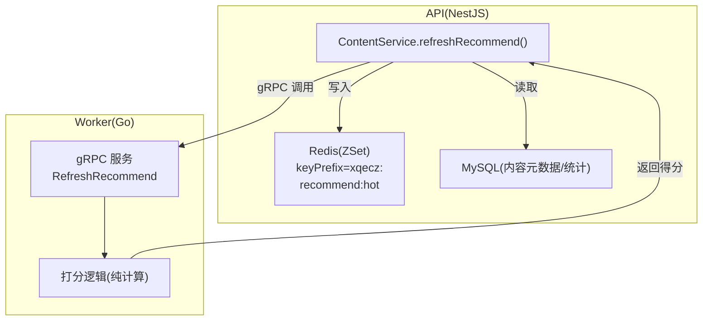
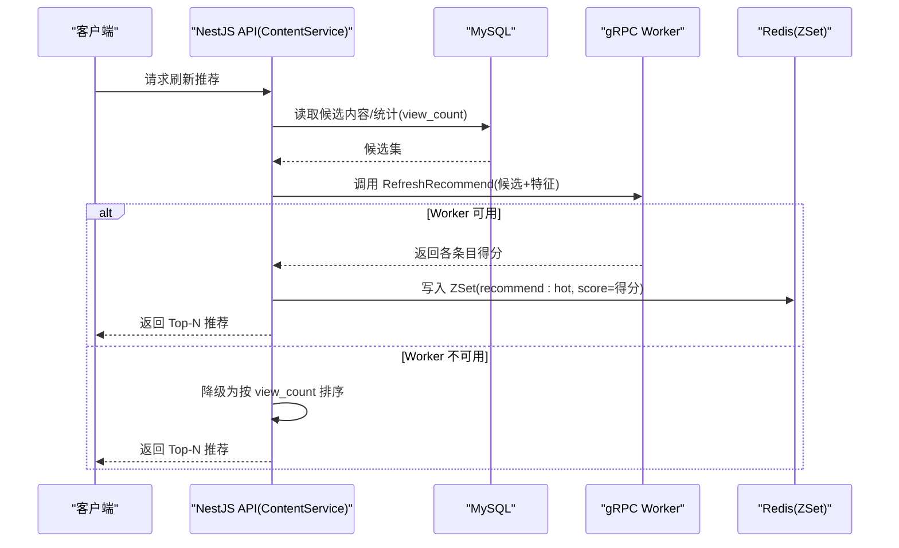
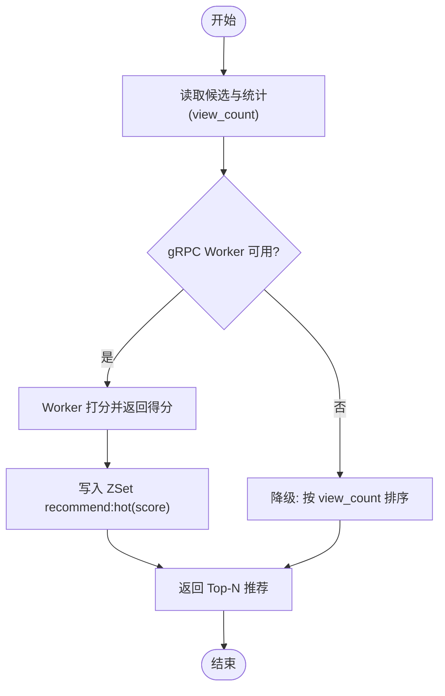
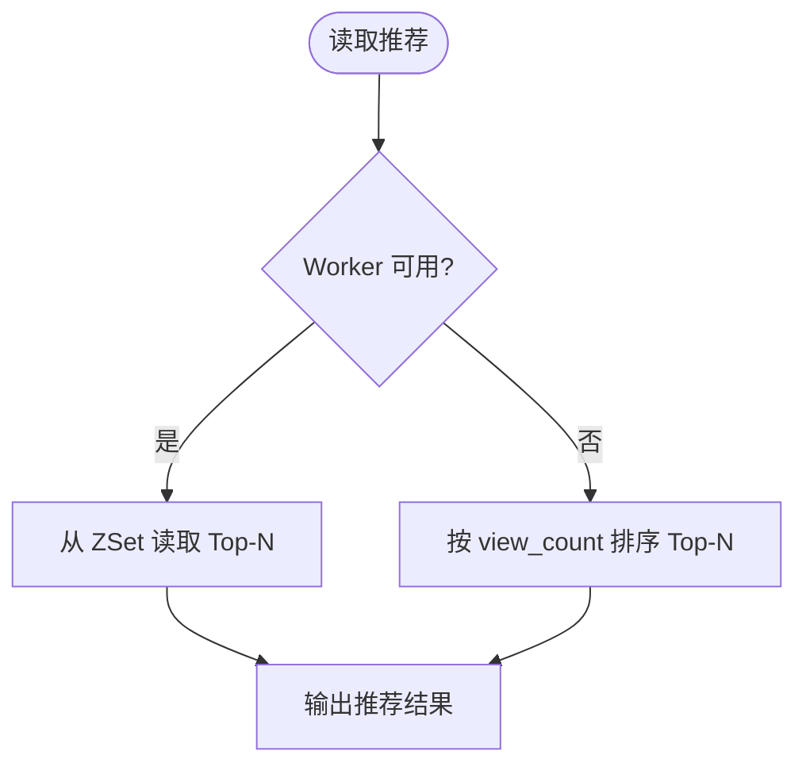
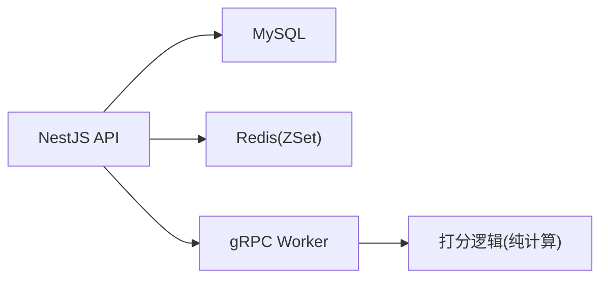

# 推荐系统实现

<cite>
**本文引用的文件**   
- [xqecz.proto](file://proto/xqecz.proto)
- [run-worker.mjs](file://scripts/run-worker.mjs)
- [plan.md](file://plan.md)
</cite>

## 目录
1. [简介](#简介)
2. [项目结构](#项目结构)
3. [核心组件](#核心组件)
4. [架构总览](#架构总览)
5. [详细组件分析](#详细组件分析)
6. [依赖关系分析](#依赖关系分析)
7. [性能考量](#性能考量)
8. [故障排查指南](#故障排查指南)
9. [结论](#结论)
10. [附录](#附录)

## 简介
本文件面向 xqecz 平台的推荐系统，聚焦以下目标：
- 说明推荐算法的触发机制与刷新流程
- 解释 Redis ZSet 数据结构的使用，尤其是 recommend:hot key 的管理与分数计算
- 描述读取降级策略：当 gRPC Worker 不可用时回退到 view_count 排序
- 阐述缓存策略与性能优化技巧
- 说明推荐结果的实时更新与失效机制
- 提供监控指标与调试方法

## 项目结构
当前仓库为 monorepo，推荐系统涉及的关键位置如下：
- proto/xqecz.proto：gRPC 契约定义（包含 RefreshRecommend 等接口）
- scripts/run-worker.mjs：Worker 启动脚本，注入 .env 并拉起 gRPC 服务
- plan.md：项目规划与关键约束（含推荐链路、部署方式、降级策略等）

图表来源
- [plan.md](file://plan.md)
- [xqecz.proto](file://proto/xqecz.proto)
- [run-worker.mjs](file://scripts/run-worker.mjs)

章节来源
- [plan.md](file://plan.md)
- [xqecz.proto](file://proto/xqecz.proto)
- [run-worker.mjs](file://scripts/run-worker.mjs)

## 核心组件
- 触发入口：NestJS API 的 ContentService.refreshRecommend() 负责协调 MySQL 读取、gRPC 调用 Worker 打分、以及将结果写入 Redis ZSet。
- 计算服务：Go Worker 作为无状态 gRPC 服务，接收 NestJS 传入的数据，执行纯打分逻辑，返回得分。
- 存储层：
  - MySQL：持久化内容与基础统计（如 view_count）
  - Redis ZSet：维护 recommend:hot 有序集合，用于快速取 Top-N 推荐
- 降级路径：当 gRPC Worker 不可用时，直接按 view_count 排序返回，保证可用性。

章节来源
- [plan.md](file://plan.md)

## 架构总览
推荐系统的整体交互时序如下：

图表来源
- [plan.md](file://plan.md)
- [xqecz.proto](file://proto/xqecz.proto)

## 详细组件分析

### 触发机制与刷新流程
- 触发点：由 ContentService.refreshRecommend() 发起，通常在内容更新或定时任务后触发。
- 数据准备：从 MySQL 拉取候选内容与必要统计字段（如 view_count）。
- 打分阶段：通过 gRPC 调用 Worker 的 RefreshRecommend，Worker 基于输入特征进行打分。
- 落库与缓存：
  - 成功时：将条目与得分写入 Redis ZSet recommend:hot（ioredis keyPrefix=xqecz:），供后续读取。
  - 失败或不可用时：走降级路径，按 view_count 排序返回。

图表来源
- [plan.md](file://plan.md)

章节来源
- [plan.md](file://plan.md)

### Redis ZSet 使用与 recommend:hot 管理
- Key 命名：recommend:hot，受 ioredis keyPrefix=xqecz: 影响，实际存储键为 xqecz:recommend:hot。
- 成员与分数：
  - member：通常为内容 ID 或唯一标识
  - score：推荐得分（由 Worker 打分得出）
- 常用操作：
  - 写入/更新：ZADD 将条目加入集合并设置得分
  - 查询 Top-N：ZREVRANGE/ZRANGEBYSCORE 获取高分条目
  - 清理/过期：结合 TTL 或定期清理旧条目，避免无限增长
- 设计要点：
  - 分数单调性：确保分数能反映热度/相关性，便于排序稳定
  - 幂等写入：重复刷新不会导致重复或异常膨胀
  - 批量操作：尽量使用管道/批处理减少网络往返

章节来源
- [plan.md](file://plan.md)

### 读取降级策略（gRPC 不可用）
- 触发条件：gRPC Worker 连接失败、超时或返回错误。
- 降级逻辑：放弃使用 recommend:hot，直接基于 MySQL 中的 view_count 排序返回 Top-N。
- 优势：保证在计算服务不可用时仍可提供基本推荐能力，提升系统韧性。

图表来源
- [plan.md](file://plan.md)

章节来源
- [plan.md](file://plan.md)

### 缓存策略与性能优化
- 分层缓存：
  - 热点读：优先从 Redis ZSet 读取 Top-N，降低数据库压力
  - 冷数据：未命中时回源 MySQL
- 写放大控制：
  - 批量写入 ZSet，减少命令次数
  - 合理设置 TTL，避免长期占用内存
- 并发与一致性：
  - 刷新期间允许短暂不一致，最终一致即可
  - 使用幂等写入，避免重复刷新造成数据抖动
- 资源隔离：
  - 推荐读写与主业务读写分离，避免互相阻塞

章节来源
- [plan.md](file://plan.md)

### 实时更新与失效机制
- 实时更新：
  - 内容互动（浏览、点赞等）可增量更新 view_count，并在合适时机触发重算或局部更新
  - 对高频变动条目，可采用延迟合并与批量刷新
- 失效机制：
  - 基于 TTL 自动过期，防止陈旧数据长期驻留
  - 支持主动失效：内容删除或归档时，从 ZSet 移除对应 member
  - 软删除：所有删除均为软删除（deleted_at + TypeORM @DeleteDateColumn 自动过滤），读取时需排除已删除项

章节来源
- [plan.md](file://plan.md)

### gRPC 契约与 Worker 启动
- 契约定义：proto/xqecz.proto 定义了 RefreshRecommend 等接口，字段采用 snake_case，NestJS 客户端启用 keepCase:true。
- Worker 启动：scripts/run-worker.mjs 启动 Go Worker，自动读取同一 .env 注入环境变量，并通过绝对路径传递文件路径。

章节来源
- [xqecz.proto](file://proto/xqecz.proto)
- [run-worker.mjs](file://scripts/run-worker.mjs)

## 依赖关系分析
- NestJS API 依赖：
  - MySQL：读取候选内容与统计
  - Redis：读写 recommend:hot
  - gRPC 客户端：调用 Worker 打分
- Worker 依赖：
  - 无数据库直连，仅做纯计算
  - 接收 NestJS 传入的特征数据，返回得分
- 外部依赖缺失时的行为：
  - Tinify/S3/FFmpeg/Worker 缺失一律降级，不中断主流程
  - gRPC 不返回 rpc error，而是 success=false + error 文本，便于上层判断与降级

图表来源
- [plan.md](file://plan.md)
- [xqecz.proto](file://proto/xqecz.proto)

章节来源
- [plan.md](file://plan.md)
- [xqecz.proto](file://proto/xqecz.proto)

## 性能考量
- 读路径优化：
  - 优先命中 Redis ZSet，减少 MySQL 查询
  - 使用分页与限制 Top-N，控制响应体积
- 写路径优化：
  - 批量 ZADD，减少网络往返
  - 合理分片与过期策略，控制内存占用
- 容错与弹性：
  - Worker 不可用立即降级，避免级联失败
  - 重试与熔断策略（建议）：对 gRPC 调用增加超时、重试上限与熔断保护
- 监控与观测：
  - 记录刷新耗时、命中率、降级比例
  - 关注 ZSet 大小与内存使用，及时清理

[本节为通用指导，无需特定文件引用]

## 故障排查指南
- 常见问题定位：
  - gRPC 调用失败：检查 Worker 是否启动、端口连通性、参数格式（snake_case）
  - ZSet 数据异常：核对写入顺序、分数单调性、TTL 配置
  - 降级频繁：观察 Worker 健康状态与错误日志
- 调试方法：
  - 查看 NestJS 日志中 refreshRecommend 的调用链与耗时
  - 检查 Redis 中 xqecz:recommend:hot 的成员数量与分数分布
  - 验证 Worker 的打分逻辑输入输出是否符合预期
- 外部依赖缺失：
  - 确认 Tinify/S3/FFmpeg/Worker 是否可用，缺失时应走降级路径

章节来源
- [plan.md](file://plan.md)

## 结论
推荐系统以 NestJS 为核心编排，Go Worker 提供无状态打分能力，Redis ZSet 承担高性能排序与缓存职责。通过明确的触发与刷新流程、稳健的降级策略以及合理的缓存与失效机制，系统在可用性与性能之间取得平衡。建议在生产环境完善监控与告警，持续优化打分特征与刷新频率，以提升用户体验与系统稳定性。

[本节为总结性内容，无需特定文件引用]

## 附录
- 部署与运行：
  - 本地开发：pnpm dev 同时启动 NestJS API(:3000)、Go Worker(:50051)、Vite 前端(:5173)
  - 生产模式：pnpm start 一键构建并运行
- 环境变量：
  - 共享上传目录由 UPLOAD_DIR 约定，单一配置源为 packages/api/.env
  - Worker 启动脚本自动注入 .env，文件路径经 gRPC 以绝对路径传递

章节来源
- [plan.md](file://plan.md)
- [run-worker.mjs](file://scripts/run-worker.mjs)