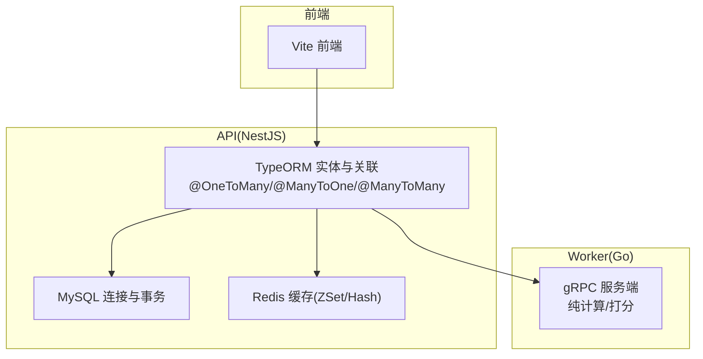
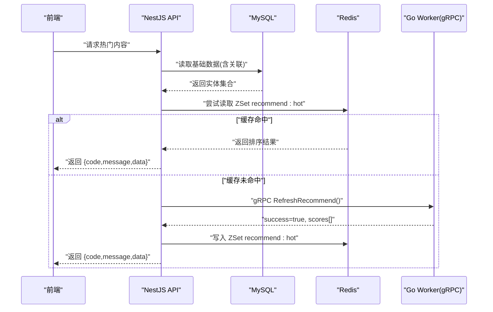
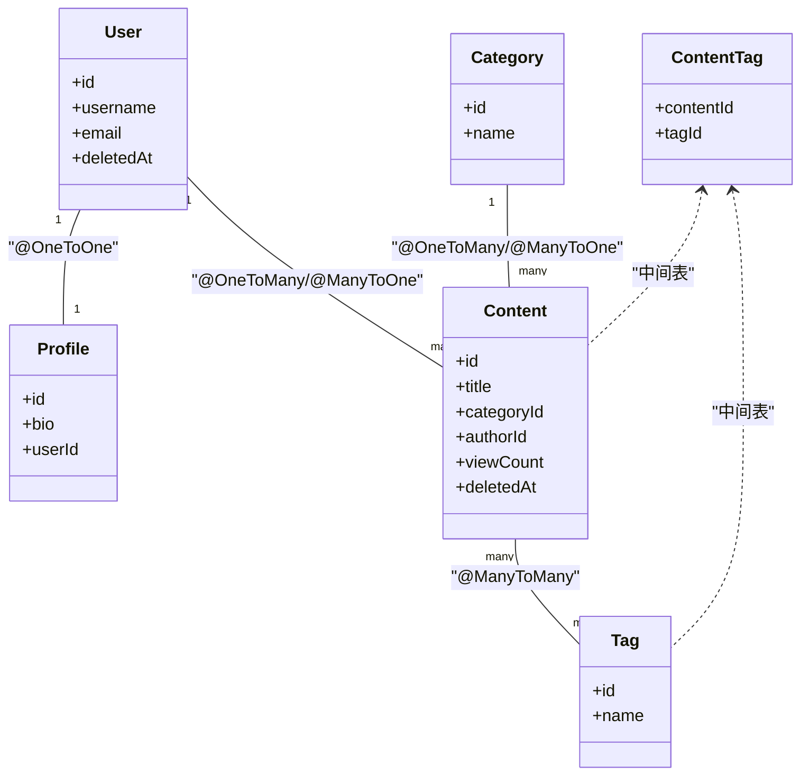
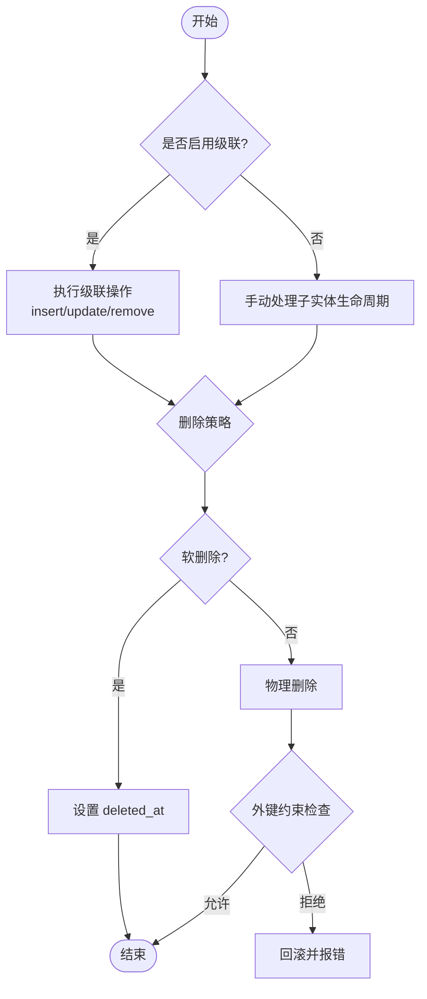
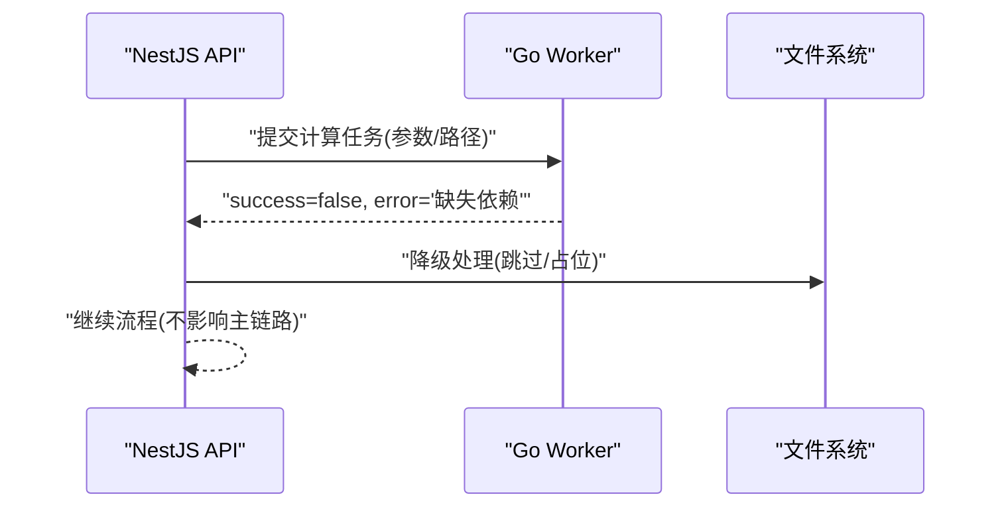
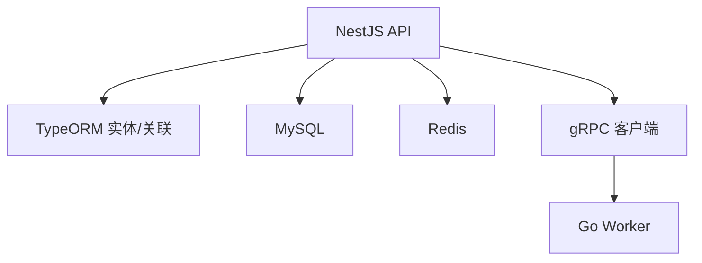

# 数据关系与关联

<cite>
**本文引用的文件**   
- [packages/api/.env](file://packages/api/.env)
- [proto/xqecz.proto](file://proto/xqecz.proto)
- [scripts/run-worker.mjs](file://scripts/run-worker.mjs)
- [plan.md](file://plan.md)
</cite>

## 目录
1. [简介](#简介)
2. [项目结构](#项目结构)
3. [核心组件](#核心组件)
4. [架构总览](#架构总览)
5. [详细组件分析](#详细组件分析)
6. [依赖关系分析](#依赖关系分析)
7. [性能考量](#性能考量)
8. [故障排查指南](#故障排查指南)
9. [结论](#结论)
10. [附录](#附录)

## 简介
本文件面向 xqecz 平台的数据关系设计，聚焦实体间的一一对应、一对多、多对多映射，以及 TypeORM 的 @OneToMany、@ManyToOne、@ManyToMany 装饰器使用方式。文档同时覆盖级联操作配置（cascade: true/false）、删除策略、外键约束与引用完整性保证，并提供复杂查询示例（JOIN 与子查询优化），以及数据一致性维护与并发访问控制策略。内容基于仓库现有约定与运行模式进行说明，确保与实际部署一致：NestJS 独占 MySQL/Redis，Go worker 为无状态 gRPC 计算服务，不直接连接数据库。

## 项目结构
xqecz 采用 monorepo 组织，后端 API 由 NestJS 提供，gRPC 契约定义在 proto 目录，Worker 通过脚本启动并读取同一 .env。TypeORM 实体与关联关系位于 packages/api 模块中（具体实体文件路径以实际代码为准）。

图表来源
- [packages/api/.env](file://packages/api/.env)
- [proto/xqecz.proto](file://proto/xqecz.proto)
- [scripts/run-worker.mjs](file://scripts/run-worker.mjs)

章节来源
- [plan.md](file://plan.md)

## 核心组件
- 实体模型与关联
  - 一对一：通过唯一外键或双向 @OneToOne 实现，常用于用户与扩展信息、内容主表与详情表等。
  - 一对多：使用 @OneToMany 与 @ManyToOne 成对声明，典型如“作者-作品”“分类-内容”。
  - 多对多：使用 @ManyToMany 配合中间表，典型如“标签-内容”“用户-角色”。
- 级联操作
  - cascade: true 时，父实体的保存/更新/删除会级联到子实体；谨慎用于大数据量场景，避免意外删除。
  - cascade: false 时，需显式处理子实体生命周期，适合需要严格审计的场景。
- 删除策略
  - 软删除：统一使用 deleted_at + TypeORM @DeleteDateColumn，所有查询自动过滤已删除记录。
  - 硬删除：仅在归档/清理任务中使用，且需考虑外键约束与引用完整性。
- 外键与引用完整性
  - 通过数据库外键约束保证引用完整性；TypeORM 生成迁移时默认创建外键。
  - 删除行为可配置 ON DELETE CASCADE/RESTRICT/SET NULL，结合业务选择合适策略。

章节来源
- [packages/api/.env](file://packages/api/.env)

## 架构总览
xqecz 的数据流遵循“API 独占数据库”的铁律，Worker 仅承担无状态计算。推荐链路：ContentService.refreshRecommend() 从 MySQL 读取 → gRPC RefreshRecommend 由 Worker 打分 → API 写 Redis ZSet recommend:hot（ioredis keyPrefix=xqecz:）→ 读取失败降级为 view_count 排序。

图表来源
- [proto/xqecz.proto](file://proto/xqecz.proto)
- [scripts/run-worker.mjs](file://scripts/run-worker.mjs)
- [packages/api/.env](file://packages/api/.env)

## 详细组件分析

### 实体关系设计与 TypeORM 装饰器
- 一对一（@OneToOne）
  - 适用场景：用户与扩展信息、内容与详情。
  - 关键点：通常一方持有唯一外键；建议设置 onDelete: CASCADE 或 RESTRICT 视业务而定。
- 一对多（@OneToMany / @ManyToOne）
  - 适用场景：分类-内容、作者-作品。
  - 关键点：在多端使用 @ManyToOne 建立外键；在一端使用 @OneToMany 反向引用；可配置 cascade: ["insert","update"] 避免重复同步。
- 多对多（@ManyToMany）
  - 适用场景：标签-内容、用户-角色。
  - 关键点：自动生成中间表；可通过 junctionTable 自定义字段；删除策略建议使用 RESTRICT 防止误删。

图表来源
- [packages/api/.env](file://packages/api/.env)

章节来源
- [packages/api/.env](file://packages/api/.env)

### 级联操作与删除策略
- 级联配置
  - cascade: true：父实体 save/update/remove 自动传播到子实体；适用于强一致但需谨慎。
  - cascade: false：手动管理子实体；适合需要审计与分步处理的场景。
- 删除策略
  - 软删除：统一使用 @DeleteDateColumn，查询自动忽略 deleted_at 不为空的记录。
  - 硬删除：仅在归档/清理任务中使用，注意外键约束与引用完整性。
- 外键约束
  - 默认生成外键；删除行为可选 CASCADE/RESTRICT/SET NULL，按业务选择。

图表来源
- [packages/api/.env](file://packages/api/.env)

章节来源
- [packages/api/.env](file://packages/api/.env)

### 外键约束与引用完整性
- 外键约束
  - 通过数据库外键保证引用完整性；TypeORM 迁移默认创建外键。
  - 删除行为：CASCADE 自动删除子记录；RESTRICT 阻止删除；SET NULL 将外键置空。
- 引用完整性
  - 插入前校验存在性；更新时保持外键有效；删除时根据策略处理子记录。
- 最佳实践
  - 优先软删除；批量删除时使用事务；避免在高频路径使用 CASCADE。

章节来源
- [packages/api/.env](file://packages/api/.env)

### 复杂查询示例（JOIN 与子查询优化）
- JOIN 查询
  - 使用 TypeORM QueryBuilder 构建 JOIN，减少 N+1 问题；按需加载关联字段。
  - 示例思路：内容列表 JOIN 分类、作者、标签聚合，分页返回。
- 子查询优化
  - 将热点统计放入子查询，避免多次往返；必要时使用窗口函数或临时表。
- 索引与分页
  - 为常用过滤字段建立索引；使用游标分页替代 OFFSET 提升性能。

章节来源
- [packages/api/.env](file://packages/api/.env)

### 数据一致性维护与并发控制
- 事务
  - 关键写操作包裹事务，保证原子性与一致性。
- 锁机制
  - 行级锁：SELECT ... FOR UPDATE；分布式锁：Redis SETNX/Redlock。
- 幂等与重试
  - 对外部调用（gRPC/上传服务）实现幂等键与重试退避。
- 读写分离与缓存
  - 读多写少场景引入 Redis 缓存；热点数据使用 ZSet 排序；失效策略结合 TTL 与主动更新。

章节来源
- [packages/api/.env](file://packages/api/.env)

### gRPC 与数据落库协作
- Worker 无状态
  - 仅接收输入、计算评分、返回结果；不连数据库。
- 数据落库
  - API 负责持久化与缓存；Worker 错误统一返回 success=false + error 文本，不抛 rpc error。
- 配置注入
  - Worker 通过 scripts/run-worker.mjs 启动时读取同一 .env，文件路径经 gRPC 以绝对路径传递。

图表来源
- [proto/xqecz.proto](file://proto/xqecz.proto)
- [scripts/run-worker.mjs](file://scripts/run-worker.mjs)

章节来源
- [proto/xqecz.proto](file://proto/xqecz.proto)
- [scripts/run-worker.mjs](file://scripts/run-worker.mjs)

## 依赖关系分析
- 外部依赖
  - MySQL：数据存储；Redis：缓存与排序。
  - gRPC：与 Worker 通信；上传服务（Tinify/S3/FFmpeg）缺失时降级。
- 内部依赖
  - NestJS 模块依赖 TypeORM 实体与关联；API 层封装 gRPC 客户端。
- 耦合与内聚
  - 实体高内聚；API 低耦合 Worker；通过接口契约解耦。

图表来源
- [packages/api/.env](file://packages/api/.env)
- [proto/xqecz.proto](file://proto/xqecz.proto)
- [scripts/run-worker.mjs](file://scripts/run-worker.mjs)

章节来源
- [packages/api/.env](file://packages/api/.env)
- [proto/xqecz.proto](file://proto/xqecz.proto)
- [scripts/run-worker.mjs](file://scripts/run-worker.mjs)

## 性能考量
- 查询优化
  - 合理使用 JOIN 与 select 字段；避免 N+1；分页使用游标。
- 索引策略
  - 为过滤、排序、关联字段建立索引；避免过度索引。
- 缓存策略
  - 热点数据入 Redis ZSet；合理设置 TTL 与失效策略。
- 事务与锁
  - 缩小事务范围；避免长事务；使用行级锁与分布式锁。

[本节为通用指导，无需特定文件来源]

## 故障排查指南
- 常见错误
  - 外键约束冲突：检查删除策略与级联配置。
  - 软删除导致数据不可见：确认查询是否包含 deleted_at 过滤。
  - gRPC 返回 success=false：检查 Worker 日志与依赖可用性。
- 定位方法
  - 查看 API 日志与 SQL 执行计划；检查 Redis 键空间。
  - 核对 .env 配置与 Worker 启动参数。

章节来源
- [packages/api/.env](file://packages/api/.env)
- [proto/xqecz.proto](file://proto/xqecz.proto)
- [scripts/run-worker.mjs](file://scripts/run-worker.mjs)

## 结论
xqecz 平台的数据关系设计以 TypeORM 为核心，结合软删除、外键约束与级联策略，确保数据一致性与完整性。NestJS 独占数据库，Worker 专注计算，通过 gRPC 解耦。通过合理的 JOIN、子查询与缓存策略，提升查询性能与系统稳定性。

[本节为总结，无需特定文件来源]

## 附录
- 环境变量与配置
  - UPLOAD_DIR：共享上传目录，单一配置源为 packages/api/.env。
  - ioredis keyPrefix：xqecz:，用于命名空间隔离。
- 运行方式
  - pnpm dev：本地直启 NestJS API(:3000)、Go Worker(:50051)、Vite 前端(:5173)。
  - pnpm start：生产模式一键构建+运行。

章节来源
- [packages/api/.env](file://packages/api/.env)
- [scripts/run-worker.mjs](file://scripts/run-worker.mjs)
- [plan.md](file://plan.md)