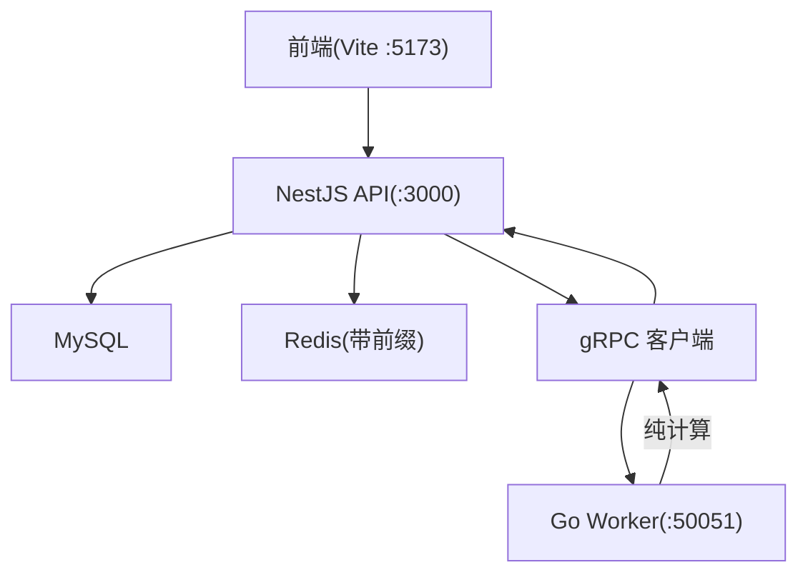
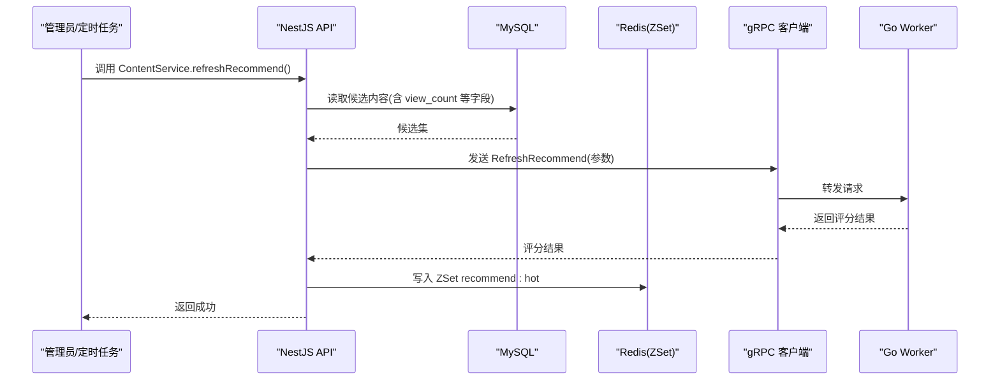
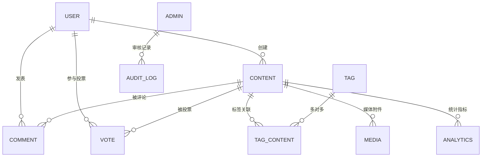
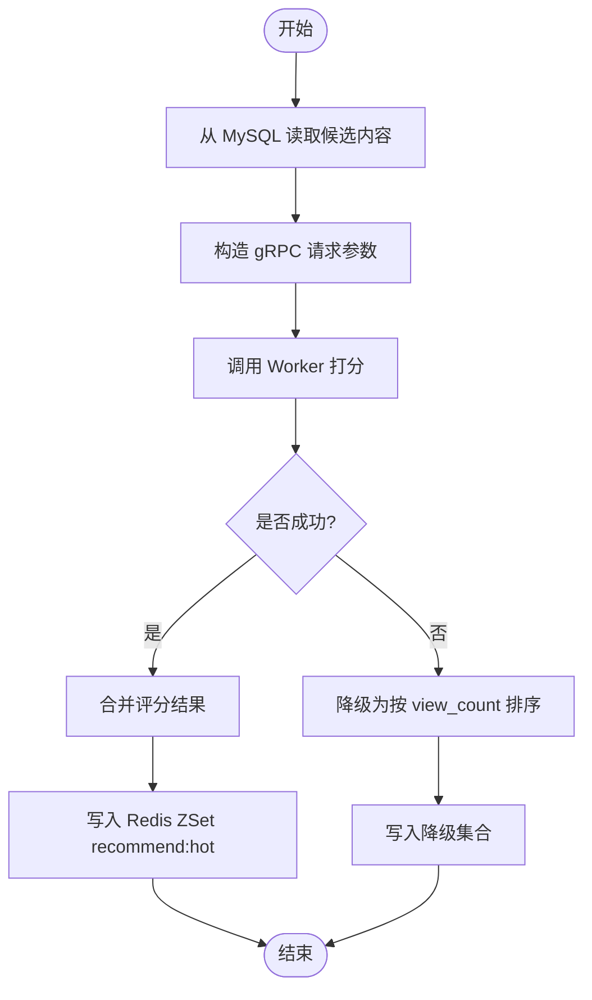
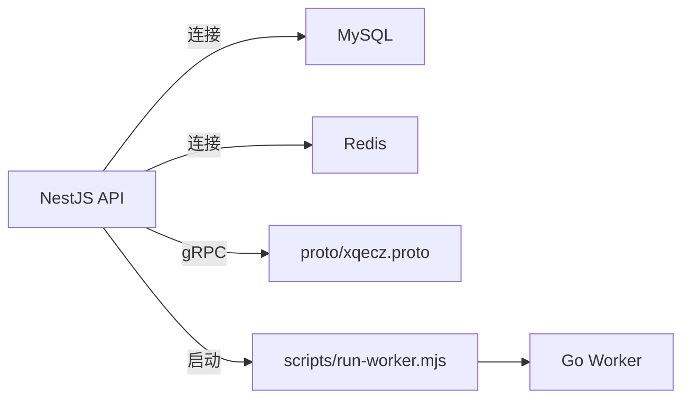

# 数据库架构设计

<cite>
**本文引用的文件**   
- [plan.md](file://plan.md)
- [xqecz.proto](file://proto/xqecz.proto)
- [run-worker.mjs](file://scripts/run-worker.mjs)
- [package.json](file://package.json)
- [AGENTS.md](file://AGENTS.md)
</cite>

## 目录
1. [引言](#引言)
2. [项目结构](#项目结构)
3. [核心组件](#核心组件)
4. [架构总览](#架构总览)
5. [详细组件分析](#详细组件分析)
6. [依赖关系分析](#依赖关系分析)
7. [性能考虑](#性能考虑)
8. [故障排查指南](#故障排查指南)
9. [结论](#结论)
10. [附录](#附录)

## 引言
本设计文档面向 xqecz（小泉动漫二创站）平台的 MySQL 数据库架构，目标是提供一份从整体到细节、兼顾可读性与可落地性的设计说明。内容覆盖：
- 数据库整体结构设计、表关系与数据流向
- 索引策略（主键、外键、复合索引、全文索引）
- 迁移策略与版本管理
- 数据完整性保障（约束、触发器、事务）
- 性能优化建议与查询最佳实践

需要特别说明的是：当前仓库未包含具体的 TypeORM/Prisma 实体定义或 SQL 脚本；本文基于作者提示与现有工程线索进行系统化设计与约定，确保后续实现有据可依。

## 项目结构
本项目为 monorepo，后端 API 由 NestJS 提供，Go Worker 作为无状态 gRPC 计算服务，前端使用 Vite。数据库访问由 NestJS 独占，Worker 不直连数据库，仅通过 gRPC 接收任务并返回结果，最终由 NestJS 落库与写缓存。

图表来源
- [xqecz.proto](file://proto/xqecz.proto)
- [run-worker.mjs](file://scripts/run-worker.mjs)
- [package.json](file://package.json)

章节来源
- [plan.md](file://plan.md)
- [AGENTS.md](file://AGENTS.md)

## 核心组件
围绕数据库的核心职责与边界如下：
- NestJS API：唯一数据库访问入口，负责读写 MySQL、维护 Redis 缓存、编排 gRPC 调用。
- Go Worker：无状态计算节点，按协议接收输入参数，执行打分/统计等计算，返回结构化结果。
- 文件存储：上传目录由环境变量统一配置，路径以绝对值经 gRPC 传递，避免跨进程不一致。
- 接口契约：前后端统一响应格式 { code, message, data }；gRPC 契约在 proto 中定义。

章节来源
- [xqecz.proto](file://proto/xqecz.proto)
- [run-worker.mjs](file://scripts/run-worker.mjs)
- [package.json](file://package.json)

## 架构总览
下图展示“推荐刷新”这一关键链路的数据流，体现 MySQL、Redis 与 gRPC Worker 的协作方式。

图表来源
- [xqecz.proto](file://proto/xqecz.proto)
- [run-worker.mjs](file://scripts/run-worker.mjs)

## 详细组件分析

### 数据模型与关系图（概念设计）
以下为推荐的实体与关系（命名采用 snake_case，便于与 gRPC 字段一致）。实际建表时请结合业务演进逐步完善。

说明要点
- 所有删除均为软删除，需包含 deleted_at 字段并由 ORM 自动过滤。
- 多对多关系通过中间表实现（如 TAG_CONTENT）。
- 媒体附件与统计指标分别独立表，避免主表膨胀。

章节来源
- [plan.md](file://plan.md)
- [AGENTS.md](file://AGENTS.md)

### 索引设计策略
- 主键
  - 所有表使用自增整型或雪花 ID 作为主键，保证插入有序与范围扫描友好。
- 外键
  - 应用层维护一致性，物理外键可选；若启用，需评估写入放大与锁竞争。
- 复合索引
  - 高频查询条件列组合建立复合索引，遵循最左前缀原则。
  - 排序/分组列尽量纳入索引以减少 filesort。
- 全文索引
  - 标题/摘要等文本字段可按需开启全文索引，配合 MATCH...AGAINST 提升检索性能。
- 唯一性
  - 业务唯一键（如用户邮箱、内容 slug）建立唯一索引，避免重复写入。
- 覆盖索引
  - 针对热点读场景，尽量让查询命中覆盖索引，减少回表。

章节来源
- [plan.md](file://plan.md)

### 迁移策略与版本管理
- 工具选择
  - 推荐使用 TypeORM Migration 或 Prisma Migrate，保持与代码同仓管理。
- 版本化
  - 每次变更生成单向迁移脚本，命名包含版本号与描述，禁止修改已发布迁移。
- 回滚策略
  - 生产环境谨慎回滚；优先采用新增字段+兼容期双写，再切换读源。
- 自动化
  - CI/CD 流水线集成迁移校验与预发验证，失败阻断发布。
- 数据修复
  - 数据修复类脚本与迁移分离，单独版本化管理与审计。

章节来源
- [plan.md](file://plan.md)

### 数据完整性保障机制
- 约束
  - 使用 NOT NULL、CHECK、UNIQUE、FOREIGN KEY（可选）保障域与引用完整性。
- 触发器
  - 尽量避免复杂触发器；必要时用于审计日志、默认值填充等轻量逻辑。
- 事务
  - 跨表写操作包裹在事务中，保证原子性与一致性；合理设置隔离级别。
- 软删除
  - 统一使用 deleted_at 标记删除，ORM 层自动过滤，避免误删扩散。

章节来源
- [plan.md](file://plan.md)

### 推荐刷新流程（算法与落库）

图表来源
- [xqecz.proto](file://proto/xqecz.proto)
- [run-worker.mjs](file://scripts/run-worker.mjs)

章节来源
- [plan.md](file://plan.md)

## 依赖关系分析
- NestJS 依赖
  - MySQL 驱动、TypeORM/Prisma、ioredis、gRPC 客户端。
- Worker 依赖
  - gRPC 服务端、纯计算库；不依赖数据库与外部 I/O。
- 配置与环境
  - 单一 .env 配置源，API 与 Worker 共享 UPLOAD_DIR 等环境变量。

图表来源
- [xqecz.proto](file://proto/xqecz.proto)
- [run-worker.mjs](file://scripts/run-worker.mjs)
- [package.json](file://package.json)

章节来源
- [xqecz.proto](file://proto/xqecz.proto)
- [run-worker.mjs](file://scripts/run-worker.mjs)
- [package.json](file://package.json)

## 性能考虑
- 查询优化
  - 优先使用覆盖索引与 EXPLAIN 分析执行计划，避免全表扫描与临时表。
  - 分页查询使用游标或延迟关联，避免大偏移量。
- 写入优化
  - 批量写入、合并更新；热点行分片或引入队列削峰。
- 缓存策略
  - 热点数据入 Redis ZSet/List/Hash；合理设置过期与预热。
- 连接池
  - 合理配置连接池大小与超时，避免连接耗尽。
- 监控与告警
  - 慢查询日志、QPS/RT 监控、错误率告警。

[本节为通用指导，无需特定文件来源]

## 故障排查指南
- 常见问题定位
  - 确认 .env 配置是否正确注入至 API 与 Worker。
  - 检查 gRPC 连通性与 keepCase 设置，确保字段名一致。
  - 查看 MySQL 慢查询与锁等待，定位热点与阻塞。
- 降级策略
  - 外部依赖缺失（Tinify/S3/FFmpeg/Worker）一律降级，返回 success=false + error 文本。
  - 推荐计算失败时回退至 view_count 排序。
- 日志与追踪
  - 统一日志格式，关键链路增加 traceId，便于问题回溯。

章节来源
- [plan.md](file://plan.md)
- [AGENTS.md](file://AGENTS.md)

## 结论
本文基于项目现状与作者提示，给出了 xqecz 平台 MySQL 数据库的概念设计、索引策略、迁移与版本管理、完整性保障以及性能优化建议。后续可在具体实现阶段补充实体定义、迁移脚本与压测报告，持续迭代完善。

[本节为总结性内容，无需特定文件来源]

## 附录
- 运行方式
  - 开发模式：pnpm dev 同时启动 API(:3000)、Worker(:50051)、前端(:5173)。
  - 生产模式：pnpm start 一键构建与运行。
- 接口契约
  - 前后端统一响应格式 { code, message, data }。
  - gRPC 契约位于 proto/xqecz.proto，字段采用 snake_case。

章节来源
- [package.json](file://package.json)
- [xqecz.proto](file://proto/xqecz.proto)
- [run-worker.mjs](file://scripts/run-worker.mjs)