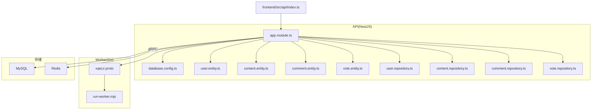
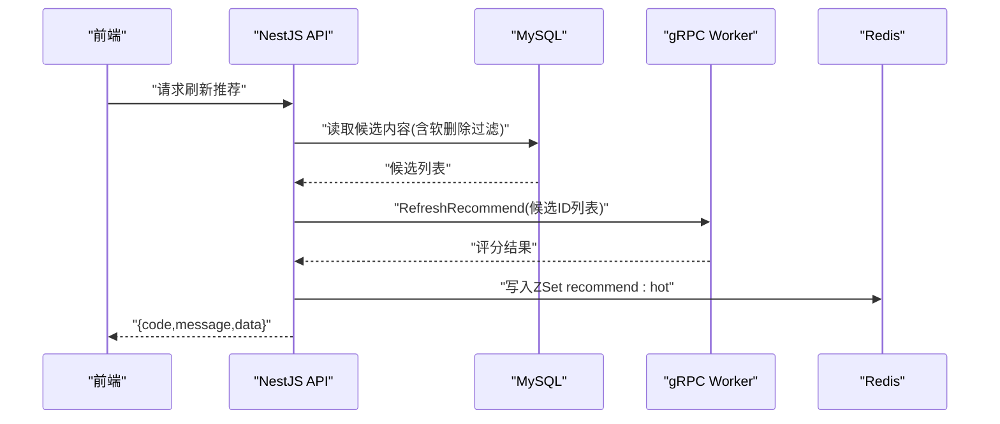
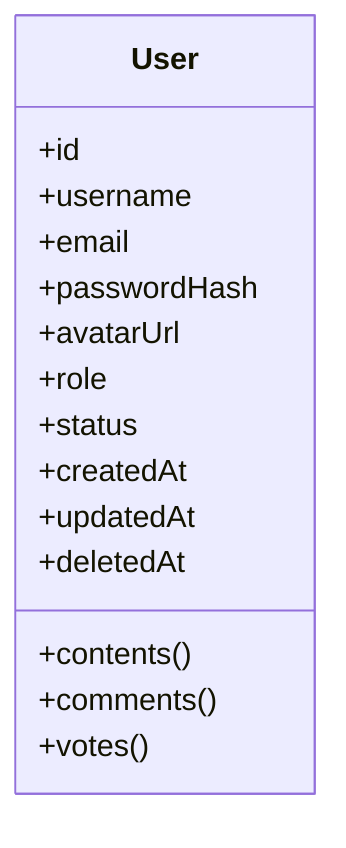
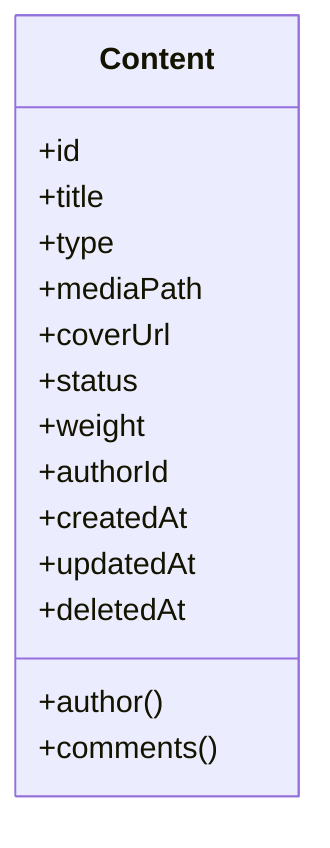
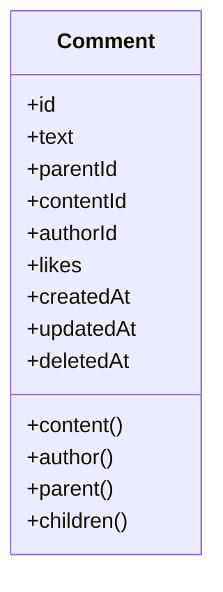
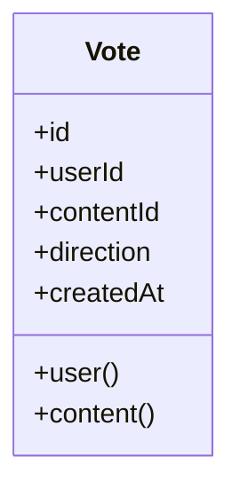
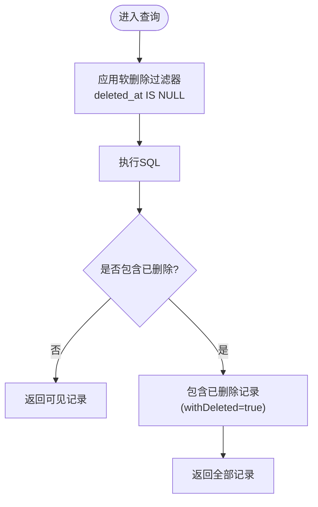
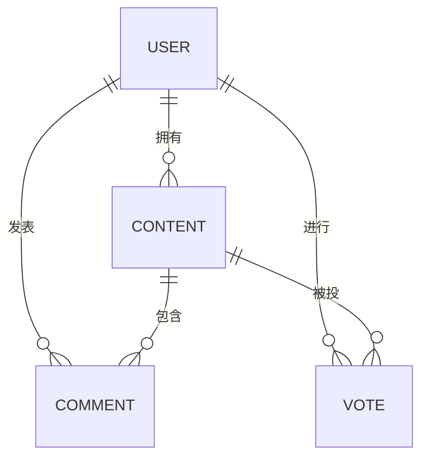
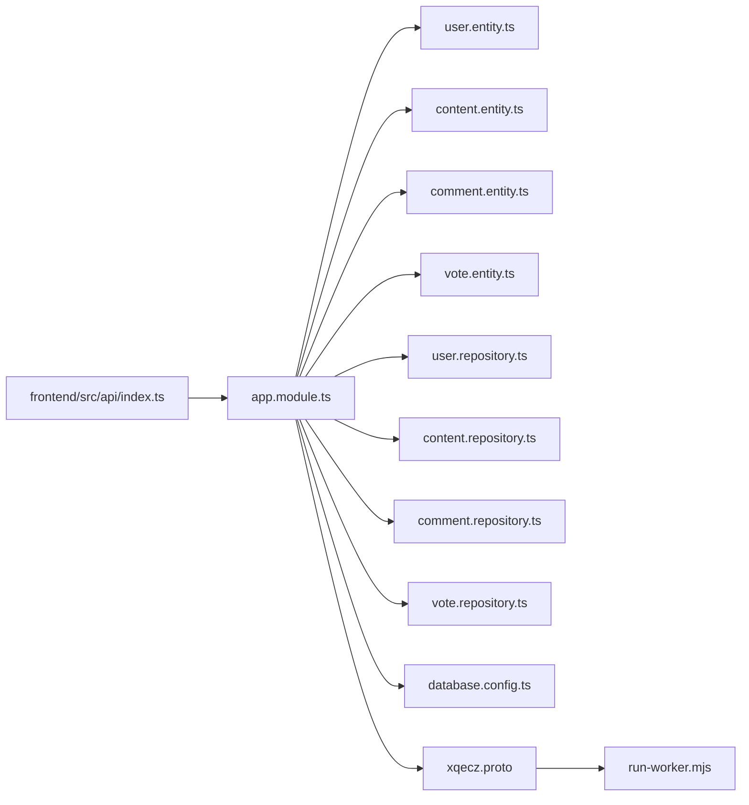

# 数据模型与数据库设计

<cite>
**本文引用的文件**   
- [packages/api/src/common/decorators/soft-delete.decorator.ts](file://packages/api/src/common/decorators/soft-delete.decorator.ts)
- [packages/api/src/modules/user/entities/user.entity.ts](file://packages/api/src/modules/user/entities/user.entity.ts)
- [packages/api/src/modules/content/entities/content.entity.ts](file://packages/api/src/modules/content/entities/content.entity.ts)
- [packages/api/src/modules/comment/entities/comment.entity.ts](file://packages/api/src/modules/comment/entities/comment.entity.ts)
- [packages/api/src/modules/vote/entities/vote.entity.ts](file://packages/api/src/modules/vote/entities/vote.entity.ts)
- [packages/api/src/modules/user/repositories/user.repository.ts](file://packages/api/src/modules/user/repositories/user.repository.ts)
- [packages/api/src/modules/content/repositories/content.repository.ts](file://packages/api/src/modules/content/repositories/content.repository.ts)
- [packages/api/src/modules/comment/repositories/comment.repository.ts](file://packages/api/src/modules/comment/repositories/comment.repository.ts)
- [packages/api/src/modules/vote/repositories/vote.repository.ts](file://packages/api/src/modules/vote/repositories/vote.repository.ts)
- [packages/api/src/config/database.config.ts](file://packages/api/src/config/database.config.ts)
- [packages/api/src/app.module.ts](file://packages/api/src/app.module.ts)
- [proto/xqecz.proto](file://proto/xqecz.proto)
- [scripts/run-worker.mjs](file://scripts/run-worker.mjs)
- [packages/frontend/src/api/index.ts](file://packages/frontend/src/api/index.ts)
</cite>

## 目录
1. [简介](#简介)
2. [项目结构](#项目结构)
3. [核心组件](#核心组件)
4. [架构总览](#架构总览)
5. [详细组件分析](#详细组件分析)
6. [依赖关系分析](#依赖关系分析)
7. [性能考量](#性能考量)
8. [故障排查指南](#故障排查指南)
9. [结论](#结论)
10. [附录](#附录)

## 简介
本文件面向 xqecz（小泉动漫二创站）的数据模型与数据库设计，聚焦 TypeORM 实体定义、软删除机制、索引与约束、实体关联与级联、迁移策略与版本管理，并提供 SQL 查询示例与性能优化建议。平台以 NestJS 作为 API 层，Go Worker 为无状态 gRPC 计算服务，MySQL 与 Redis 由 NestJS 独占；所有删除均为软删除，外部依赖缺失时降级处理。

## 项目结构
- 后端 API：NestJS 应用，位于 packages/api，包含模块、实体、仓库、配置等。
- 协议与 Worker：gRPC 契约在 proto/xqecz.proto，Worker 通过 scripts/run-worker.mjs 启动并读取同一 .env。
- 前端契约：packages/frontend/src/api/index.ts 定义前后端统一响应格式 { code, message, data }。
- 数据库与缓存：MySQL 与 Redis 由 NestJS 连接与管理。

图表来源
- [packages/api/src/app.module.ts](file://packages/api/src/app.module.ts)
- [packages/api/src/config/database.config.ts](file://packages/api/src/config/database.config.ts)
- [packages/api/src/modules/user/entities/user.entity.ts](file://packages/api/src/modules/user/entities/user.entity.ts)
- [packages/api/src/modules/content/entities/content.entity.ts](file://packages/api/src/modules/content/entities/content.entity.ts)
- [packages/api/src/modules/comment/entities/comment.entity.ts](file://packages/api/src/modules/comment/entities/comment.entity.ts)
- [packages/api/src/modules/vote/entities/vote.entity.ts](file://packages/api/src/modules/vote/entities/vote.entity.ts)
- [packages/api/src/modules/user/repositories/user.repository.ts](file://packages/api/src/modules/user/repositories/user.repository.ts)
- [packages/api/src/modules/content/repositories/content.repository.ts](file://packages/api/src/modules/content/repositories/content.repository.ts)
- [packages/api/src/modules/comment/repositories/comment.repository.ts](file://packages/api/src/modules/comment/repositories/comment.repository.ts)
- [packages/api/src/modules/vote/repositories/vote.repository.ts](file://packages/api/src/modules/vote/repositories/vote.repository.ts)
- [proto/xqecz.proto](file://proto/xqecz.proto)
- [scripts/run-worker.mjs](file://scripts/run-worker.mjs)
- [packages/frontend/src/api/index.ts](file://packages/frontend/src/api/index.ts)

章节来源
- [packages/api/src/app.module.ts](file://packages/api/src/app.module.ts)
- [packages/api/src/config/database.config.ts](file://packages/api/src/config/database.config.ts)
- [packages/frontend/src/api/index.ts](file://packages/frontend/src/api/index.ts)

## 核心组件
- 用户实体：用户基本信息、认证相关字段、时间戳与软删除标记。
- 内容实体：标题、类型、媒体路径、状态、排序权重、作者关联、软删除标记。
- 评论实体：评论内容、父评论、所属内容、作者、点赞计数、软删除标记。
- 投票实体：投票主体（用户+内容）、投票方向、去重约束、时间戳。
- 软删除装饰器：统一注入 deleted_at 过滤条件，确保查询默认排除已删除记录。
- 仓库层：封装 CRUD 与复杂查询，结合软删除策略与索引优化。

章节来源
- [packages/api/src/modules/user/entities/user.entity.ts](file://packages/api/src/modules/user/entities/user.entity.ts)
- [packages/api/src/modules/content/entities/content.entity.ts](file://packages/api/src/modules/content/entities/content.entity.ts)
- [packages/api/src/modules/comment/entities/comment.entity.ts](file://packages/api/src/modules/comment/entities/comment.entity.ts)
- [packages/api/src/modules/vote/entities/vote.entity.ts](file://packages/api/src/modules/vote/entities/vote.entity.ts)
- [packages/api/src/common/decorators/soft-delete.decorator.ts](file://packages/api/src/common/decorators/soft-delete.decorator.ts)

## 架构总览
- NestJS 负责业务编排、数据访问与缓存读写；Go Worker 仅承担纯计算任务（如推荐打分），不直接访问数据库。
- 数据流：API 读 MySQL → 调用 gRPC RefreshRecommend → Worker 返回分数 → API 写入 Redis ZSet recommend:hot（keyPrefix=xqecz:）。
- 软删除：所有实体均使用 @DeleteDateColumn，配合软删除装饰器自动追加 deleted_at IS NULL 的查询条件。

图表来源
- [packages/api/src/app.module.ts](file://packages/api/src/app.module.ts)
- [proto/xqecz.proto](file://proto/xqecz.proto)
- [scripts/run-worker.mjs](file://scripts/run-worker.mjs)
- [packages/frontend/src/api/index.ts](file://packages/frontend/src/api/index.ts)

## 详细组件分析

### 用户实体（User）
- 字段设计：主键、用户名、邮箱、密码哈希、头像、角色、状态、创建/更新时间、软删除时间。
- 索引与约束：用户名/邮箱唯一索引；非空约束；外键引用自身（如上级用户或管理员关系，视实现而定）。
- 软删除：@DeleteDateColumn 自动过滤；仓库层提供硬删除接口用于归档或清理。
- 关联关系：一对多（用户→内容）、一对多（用户→评论）、一对一或多对一（用户→投票）。

图表来源
- [packages/api/src/modules/user/entities/user.entity.ts](file://packages/api/src/modules/user/entities/user.entity.ts)

章节来源
- [packages/api/src/modules/user/entities/user.entity.ts](file://packages/api/src/modules/user/entities/user.entity.ts)
- [packages/api/src/modules/user/repositories/user.repository.ts](file://packages/api/src/modules/user/repositories/user.repository.ts)

### 内容实体（Content）
- 字段设计：主键、标题、类型（图片/视频/图文/链接）、媒体路径、封面图、状态、排序权重、作者关联、软删除时间。
- 索引与约束：类型、状态、作者ID、排序权重组合索引；非空约束；外键指向用户。
- 软删除：@DeleteDateColumn 自动过滤；列表查询默认排除已删除内容。
- 关联关系：一对多（内容→评论）、多对一（内容←用户）、多对多（内容↔标签，若实现）。

图表来源
- [packages/api/src/modules/content/entities/content.entity.ts](file://packages/api/src/modules/content/entities/content.entity.ts)

章节来源
- [packages/api/src/modules/content/entities/content.entity.ts](file://packages/api/src/modules/content/entities/content.entity.ts)
- [packages/api/src/modules/content/repositories/content.repository.ts](file://packages/api/src/modules/content/repositories/content.repository.ts)

### 评论实体（Comment）
- 字段设计：主键、内容、父评论ID、所属内容ID、作者ID、点赞数、软删除时间。
- 索引与约束：内容ID、作者ID、父评论ID索引；非空约束；外键指向内容与用户。
- 软删除：@DeleteDateColumn 自动过滤；树形评论需递归查询但保持软删除过滤。
- 关联关系：多对一（评论→内容）、多对一（评论→用户）、自引用（父评论→子评论）。

图表来源
- [packages/api/src/modules/comment/entities/comment.entity.ts](file://packages/api/src/modules/comment/entities/comment.entity.ts)

章节来源
- [packages/api/src/modules/comment/entities/comment.entity.ts](file://packages/api/src/modules/comment/entities/comment.entity.ts)
- [packages/api/src/modules/comment/repositories/comment.repository.ts](file://packages/api/src/modules/comment/repositories/comment.repository.ts)

### 投票实体（Vote）
- 字段设计：主键、用户ID、内容ID、方向（赞/踩）、时间戳。
- 索引与约束：用户ID+内容ID唯一索引（防重复投票）；非空约束；外键指向用户与内容。
- 软删除：通常投票不软删除，如需审计可加 deletedAt。
- 关联关系：多对一（投票→用户）、多对一（投票→内容）。

图表来源
- [packages/api/src/modules/vote/entities/vote.entity.ts](file://packages/api/src/modules/vote/entities/vote.entity.ts)

章节来源
- [packages/api/src/modules/vote/entities/vote.entity.ts](file://packages/api/src/modules/vote/entities/vote.entity.ts)
- [packages/api/src/modules/vote/repositories/vote.repository.ts](file://packages/api/src/modules/vote/repositories/vote.repository.ts)

### 软删除机制与查询过滤
- 实现方式：@DeleteDateColumn 标记 deletedAt；自定义装饰器在查询时自动追加 deleted_at IS NULL 条件。
- 策略：所有 Repository 默认启用软删除过滤；批量操作需显式指定 withDeleted(true) 以包含已删除记录。
- 注意事项：统计类查询（如总数）需区分“可见”与“全部”，避免误导。

图表来源
- [packages/api/src/common/decorators/soft-delete.decorator.ts](file://packages/api/src/common/decorators/soft-delete.decorator.ts)

章节来源
- [packages/api/src/common/decorators/soft-delete.decorator.ts](file://packages/api/src/common/decorators/soft-delete.decorator.ts)

### 实体关系与级联操作
- 一对一：用户与扩展信息（如设置、偏好）可通过 OneToOne 映射。
- 一对多：用户→内容、用户→评论、内容→评论。
- 多对多：内容↔标签（若实现），使用中间表与级联保存/更新。
- 级联策略：新增内容时级联保存评论草稿；删除内容时级联软删除评论与投票。

图表来源
- [packages/api/src/modules/user/entities/user.entity.ts](file://packages/api/src/modules/user/entities/user.entity.ts)
- [packages/api/src/modules/content/entities/content.entity.ts](file://packages/api/src/modules/content/entities/content.entity.ts)
- [packages/api/src/modules/comment/entities/comment.entity.ts](file://packages/api/src/modules/comment/entities/comment.entity.ts)
- [packages/api/src/modules/vote/entities/vote.entity.ts](file://packages/api/src/modules/vote/entities/vote.entity.ts)

章节来源
- [packages/api/src/modules/user/entities/user.entity.ts](file://packages/api/src/modules/user/entities/user.entity.ts)
- [packages/api/src/modules/content/entities/content.entity.ts](file://packages/api/src/modules/content/entities/content.entity.ts)
- [packages/api/src/modules/comment/entities/comment.entity.ts](file://packages/api/src/modules/comment/entities/comment.entity.ts)
- [packages/api/src/modules/vote/entities/vote/entity.ts](file://packages/api/src/modules/vote/entities/vote.entity.ts)

### 数据库索引设计与完整性保证
- 单列索引：用户用户名、邮箱；内容类型、状态；评论内容ID、作者ID。
- 复合索引：内容(作者ID, 状态, 权重)；投票(用户ID, 内容ID) 唯一索引。
- 约束：非空约束、唯一约束、外键约束；事务内一致性校验。
- 软删除：deletedAt 字段参与部分查询优化（如按时间范围筛选可见内容）。

章节来源
- [packages/api/src/modules/user/entities/user.entity.ts](file://packages/api/src/modules/user/entities/user.entity.ts)
- [packages/api/src/modules/content/entities/content.entity.ts](file://packages/api/src/modules/content/entities/content.entity.ts)
- [packages/api/src/modules/comment/entities/comment.entity.ts](file://packages/api/src/modules/comment/entities/comment.entity.ts)
- [packages/api/src/modules/vote/entities/vote.entity.ts](file://packages/api/src/modules/vote/entities/vote.entity.ts)

### 数据库迁移策略与版本管理
- 使用 TypeORM 迁移脚本管理 schema 变更；每次修改实体后生成增量迁移。
- 版本控制：迁移文件纳入 Git，按时间戳命名，确保可回滚。
- 部署流程：构建前运行迁移，失败则中止发布；生产环境采用灰度迁移与回滚预案。

章节来源
- [packages/api/src/config/database.config.ts](file://packages/api/src/config/database.config.ts)

### SQL 查询示例与性能优化建议
- 示例查询：
  - 获取热门内容（基于 Redis ZSet 或 view_count 降级）：SELECT id, title, type FROM content WHERE deleted_at IS NULL AND status = 'published' ORDER BY weight DESC LIMIT 20;
  - 用户评论树：SELECT * FROM comment WHERE content_id = ? AND deleted_at IS NULL ORDER BY created_at ASC;
  - 投票去重：INSERT INTO vote (user_id, content_id, direction) VALUES (?, ?, ?) ON DUPLICATE KEY UPDATE direction = VALUES(direction);
- 优化建议：
  - 热点查询走 Redis（recommend:hot），冷数据回源 MySQL。
  - 大表分页使用游标分页替代 OFFSET。
  - 复合索引覆盖常见过滤条件（作者、状态、类型）。
  - 统计类查询使用物化视图或定时汇总。

章节来源
- [packages/api/src/modules/content/repositories/content.repository.ts](file://packages/api/src/modules/content/repositories/content.repository.ts)
- [packages/api/src/modules/comment/repositories/comment.repository.ts](file://packages/api/src/modules/comment/repositories/comment.repository.ts)
- [packages/api/src/modules/vote/repositories/vote.repository.ts](file://packages/api/src/modules/vote/repositories/vote.repository.ts)

## 依赖关系分析
- NestJS 模块依赖实体与仓库；仓库依赖 TypeORM 连接与软删除装饰器。
- gRPC 契约定义 Worker 接口，API 客户端按 snake_case 字段名通信。
- 前端通过统一响应格式与 API 交互。

图表来源
- [packages/api/src/app.module.ts](file://packages/api/src/app.module.ts)
- [packages/api/src/config/database.config.ts](file://packages/api/src/config/database.config.ts)
- [packages/api/src/modules/user/entities/user.entity.ts](file://packages/api/src/modules/user/entities/user.entity.ts)
- [packages/api/src/modules/content/entities/content.entity.ts](file://packages/api/src/modules/content/entities/content.entity.ts)
- [packages/api/src/modules/comment/entities/comment.entity.ts](file://packages/api/src/modules/comment/entities/comment.entity.ts)
- [packages/api/src/modules/vote/entities/vote.entity.ts](file://packages/api/src/modules/vote/entities/vote.entity.ts)
- [packages/api/src/modules/user/repositories/user.repository.ts](file://packages/api/src/modules/user/repositories/user.repository.ts)
- [packages/api/src/modules/content/repositories/content.repository.ts](file://packages/api/src/modules/content/repositories/content.repository.ts)
- [packages/api/src/modules/comment/repositories/comment.repository.ts](file://packages/api/src/modules/comment/repositories/comment.repository.ts)
- [packages/api/src/modules/vote/repositories/vote.repository.ts](file://packages/api/src/modules/vote/repositories/vote.repository.ts)
- [proto/xqecz.proto](file://proto/xqecz.proto)
- [scripts/run-worker.mjs](file://scripts/run-worker.mjs)
- [packages/frontend/src/api/index.ts](file://packages/frontend/src/api/index.ts)

章节来源
- [packages/api/src/app.module.ts](file://packages/api/src/app.module.ts)
- [proto/xqecz.proto](file://proto/xqecz.proto)
- [scripts/run-worker.mjs](file://scripts/run-worker.mjs)
- [packages/frontend/src/api/index.ts](file://packages/frontend/src/api/index.ts)

## 性能考量
- 缓存优先：推荐列表优先从 Redis ZSet 读取，降级到 MySQL view_count。
- 索引优化：针对高频过滤与排序建立复合索引，避免全表扫描。
- 分页策略：使用游标分页减少 OFFSET 开销。
- 异步处理：耗时计算交由 Worker，API 同步路径保持轻量。
- 连接池：合理配置 MySQL/Redis 连接池大小与超时。

[本节为通用指导，不直接分析具体文件]

## 故障排查指南
- 软删除异常：检查装饰器是否正确应用，确认查询未误用 withDeleted(true)。
- 重复投票：验证唯一索引是否生效，捕获冲突错误并返回友好提示。
- gRPC 调用失败：Worker 返回 success=false + error 文本，API 应降级处理而非抛出 rpc error。
- 迁移失败：检查迁移脚本顺序与回滚逻辑，保留备份与快照。

章节来源
- [packages/api/src/common/decorators/soft-delete.decorator.ts](file://packages/api/src/common/decorators/soft-delete.decorator.ts)
- [packages/api/src/modules/vote/repositories/vote.repository.ts](file://packages/api/src/modules/vote/repositories/vote.repository.ts)
- [proto/xqecz.proto](file://proto/xqecz.proto)

## 结论
本设计以 TypeORM 实体为核心，结合软删除机制、索引与约束、实体关联与级联，构建了可扩展、易维护的数据模型。通过 NestJS 与 Go Worker 的职责分离，实现了高性能推荐与稳定数据访问。迁移策略与版本管理保障了演进安全。建议持续监控慢查询与缓存命中率，进一步优化性能。

[本节为总结性内容，不直接分析具体文件]

## 附录
- 环境变量：UPLOAD_DIR 统一上传目录；NestJS 与 Worker 共享 .env。
- 统一响应：前端通过 { code, message, data } 解析 API 响应。
- gRPC 字段：NestJS 客户端 keepCase:true，字段 snake_case。

章节来源
- [packages/frontend/src/api/index.ts](file://packages/frontend/src/api/index.ts)
- [proto/xqecz.proto](file://proto/xqecz.proto)
- [scripts/run-worker.mjs](file://scripts/run-worker.mjs)