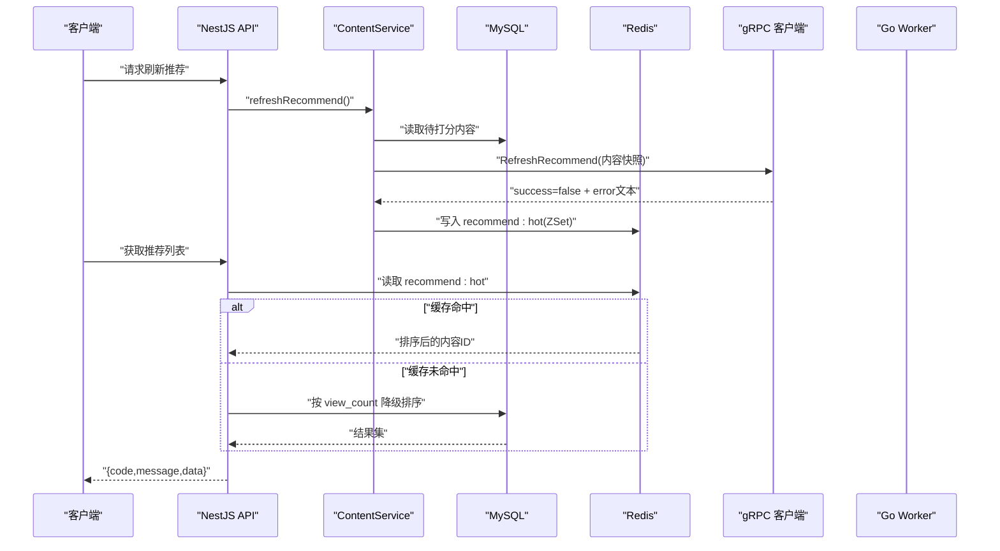
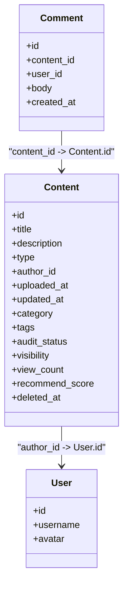
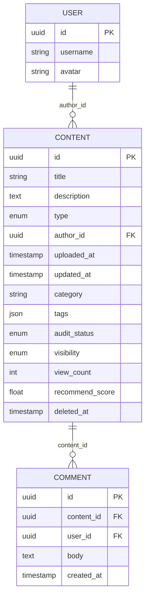
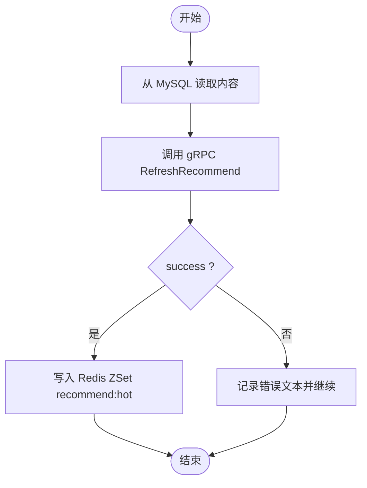
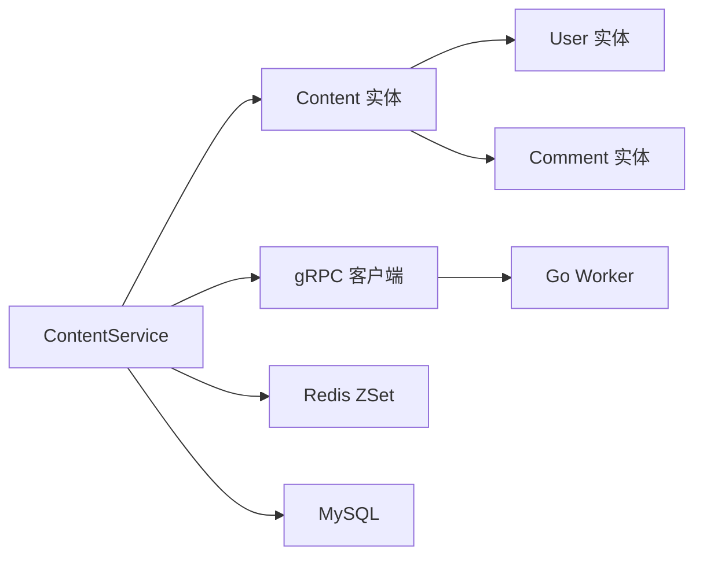

# 内容实体 (Content)

<cite>
**本文引用的文件**   
- [packages/api/src/modules/content/entities/content.entity.ts](file://packages/api/src/modules/content/entities/content.entity.ts)
- [packages/api/src/modules/content/services/content.service.ts](file://packages/api/src/modules/content/services/content.service.ts)
- [packages/api/src/modules/user/entities/user.entity.ts](file://packages/api/src/modules/user/entities/user.entity.ts)
- [packages/api/src/modules/comment/entities/comment.entity.ts](file://packages/api/src/modules/comment/entities/comment.entity.ts)
- [proto/xqecz.proto](file://proto/xqecz.proto)
- [packages/api/.env](file://packages/api/.env)
</cite>

## 目录
1. [简介](#简介)
2. [项目结构](#项目结构)
3. [核心组件](#核心组件)
4. [架构总览](#架构总览)
5. [详细组件分析](#详细组件分析)
6. [依赖关系分析](#依赖关系分析)
7. [性能考量](#性能考量)
8. [故障排查指南](#故障排查指南)
9. [结论](#结论)
10. [附录](#附录)

## 简介
本章节面向 xqecz 平台的内容实体 Content，聚焦其 TypeORM 定义与业务语义。内容涵盖标题、描述、类型（图片/视频/图文/链接）、作者ID、上传时间、更新时间等核心字段；并说明内容分类、标签系统、审核状态与可见性控制；解释软删除机制与级联操作配置；阐述内容与用户、评论的关联关系；以及推荐分数字段在“计算—缓存—降级”链路中的作用。

## 项目结构
- NestJS API 负责数据持久化与业务编排，使用 TypeORM 管理 MySQL 表结构。
- Go Worker 作为无状态 gRPC 计算服务，仅接收数据并返回打分结果，不直接访问数据库。
- 前端通过 packages/frontend/src/api/index.ts 与后端交互，统一响应格式 { code, message, data }。
- 上传目录由 UPLOAD_DIR 环境变量统一管理，Worker 启动时自动注入同一 .env。

```mermaid
graph TB
FE["前端(Vite :5173)"] --> API["NestJS API(:3000)"]
API --> DB[("MySQL")]
API --> Cache[("Redis<br/>keyPrefix=xqecz:") ]
API --> GRPC["gRPC 客户端"]
GRPC --> WORKER["Go Worker(:50051)"]
```

图表来源
- [packages/api/src/modules/content/services/content.service.ts](file://packages/api/src/modules/content/services/content.service.ts)
- [proto/xqecz.proto](file://proto/xqecz.proto)

章节来源
- [packages/api/src/modules/content/services/content.service.ts](file://packages/api/src/modules/content/services/content.service.ts)
- [packages/api/.env](file://packages/api/.env)

## 核心组件
- Content 实体：承载内容元数据、分类、标签、审核与可见性、推荐分数、软删除标记等。
- User 实体：内容作者归属。
- Comment 实体：对内容的评论集合。
- ContentService：提供内容 CRUD、推荐刷新、查询过滤等业务能力。
- gRPC 契约：定义 RefreshRecommend 等接口，用于 Worker 纯打分。

章节来源
- [packages/api/src/modules/content/entities/content.entity.ts](file://packages/api/src/modules/content/entities/content.entity.ts)
- [packages/api/src/modules/user/entities/user.entity.ts](file://packages/api/src/modules/user/entities/user.entity.ts)
- [packages/api/src/modules/comment/entities/comment.entity.ts](file://packages/api/src/modules/comment/entities/comment.entity.ts)
- [packages/api/src/modules/content/services/content.service.ts](file://packages/api/src/modules/content/services/content.service.ts)
- [proto/xqecz.proto](file://proto/xqecz.proto)

## 架构总览
Content 实体的关键流程包括：
- 创建/更新：校验类型、设置默认值、维护时间戳、软删除标记。
- 审核与可见性：根据审核状态与可见性控制列表展示与详情访问。
- 推荐计算：调用 Worker 打分，写入 Redis ZSet，读取失败回退到 view_count。
- 关联关系：与 User 一对多（作者），与 Comment 一对多（评论）。



图表来源
- [packages/api/src/modules/content/services/content.service.ts](file://packages/api/src/modules/content/services/content.service.ts)
- [proto/xqecz.proto](file://proto/xqecz.proto)

## 详细组件分析

### Content 实体（TypeORM）
- 标识与基础字段
  - id：主键
  - title：内容标题
  - description：内容描述
  - type：内容类型（图片/视频/图文/链接）
  - author_id：作者ID（外键指向 User）
  - uploaded_at：上传时间
  - updated_at：更新时间
- 分类与标签
  - category：内容分类（如动漫、二创、教程等）
  - tags：标签数组或关联表（视实现而定）
- 审核与可见性
  - audit_status：审核状态（待审/通过/拒绝）
  - visibility：可见性（公开/私有/仅粉丝等）
- 统计与推荐
  - view_count：浏览量（用于降级排序）
  - recommend_score：推荐分数（由 Worker 打分后写入 Redis ZSet）
- 软删除
  - deleted_at：软删除时间戳，TypeORM @DeleteDateColumn 自动过滤已删除记录



图表来源
- [packages/api/src/modules/content/entities/content.entity.ts](file://packages/api/src/modules/content/entities/content.entity.ts)
- [packages/api/src/modules/user/entities/user.entity.ts](file://packages/api/src/modules/user/entities/user.entity.ts)
- [packages/api/src/modules/comment/entities/comment.entity.ts](file://packages/api/src/modules/comment/entities/comment.entity.ts)

字段说明表
- id：内容唯一标识
- title：内容标题，用于展示与搜索
- description：内容描述，支持富文本或摘要
- type：枚举值（图片/视频/图文/链接），影响渲染与处理流程
- author_id：关联用户，表示内容作者
- uploaded_at：内容上传时间
- updated_at：内容最后更新时间
- category：内容分类，便于筛选与导航
- tags：标签集合，支持多维度检索
- audit_status：审核状态（待审/通过/拒绝），决定可展示性
- visibility：可见性控制（公开/私有/仅粉丝等）
- view_count：累计浏览量，用于降级排序
- recommend_score：推荐分数，由 Worker 打分后写入 Redis ZSet
- deleted_at：软删除时间戳，查询自动排除已删除项

章节来源
- [packages/api/src/modules/content/entities/content.entity.ts](file://packages/api/src/modules/content/entities/content.entity.ts)

### 软删除与级联操作
- 软删除
  - 使用 TypeORM @DeleteDateColumn 标记 deleted_at，所有查询默认忽略已删除记录。
  - 删除操作不会物理移除数据，便于审计与恢复。
- 级联操作
  - 删除内容时，建议级联删除其评论（若业务允许），避免孤儿数据。
  - 更新作者信息时，不应级联修改历史内容，保持数据一致性。

章节来源
- [packages/api/src/modules/content/entities/content.entity.ts](file://packages/api/src/modules/content/entities/content.entity.ts)
- [packages/api/src/modules/comment/entities/comment.entity.ts](file://packages/api/src/modules/comment/entities/comment.entity.ts)

### 关联关系：用户与评论
- 与用户
  - Content.author_id → User.id，表示内容作者。
  - 用户可拥有多个内容，形成一对多关系。
- 与评论
  - Comment.content_id → Content.id，表示评论所属内容。
  - 内容可拥有多个评论，形成一对多关系。



图表来源
- [packages/api/src/modules/user/entities/user.entity.ts](file://packages/api/src/modules/user/entities/user.entity.ts)
- [packages/api/src/modules/content/entities/content.entity.ts](file://packages/api/src/modules/content/entities/content.entity.ts)
- [packages/api/src/modules/comment/entities/comment.entity.ts](file://packages/api/src/modules/comment/entities/comment.entity.ts)

章节来源
- [packages/api/src/modules/user/entities/user.entity.ts](file://packages/api/src/modules/user/entities/user.entity.ts)
- [packages/api/src/modules/content/entities/content.entity.ts](file://packages/api/src/modules/content/entities/content.entity.ts)
- [packages/api/src/modules/comment/entities/comment.entity.ts](file://packages/api/src/modules/comment/entities/comment.entity.ts)

### 推荐分数与刷新流程
- 刷新推荐
  - ContentService.refreshRecommend() 从 MySQL 读取内容快照，调用 Worker 的 RefreshRecommend 进行打分。
  - 成功时将结果写入 Redis ZSet recommend:hot（keyPrefix=xqecz:）。
  - 读取推荐列表时优先读 Redis，失败则降级为按 view_count 排序。
- 错误降级
  - gRPC 不返回 rpc error，而是 success=false + error 文本，确保 API 稳定性。



图表来源
- [packages/api/src/modules/content/services/content.service.ts](file://packages/api/src/modules/content/services/content.service.ts)
- [proto/xqecz.proto](file://proto/xqecz.proto)

章节来源
- [packages/api/src/modules/content/services/content.service.ts](file://packages/api/src/modules/content/services/content.service.ts)
- [proto/xqecz.proto](file://proto/xqecz.proto)

### 审核状态与可见性控制
- 审核状态
  - 待审：内容不可见或仅管理员可见。
  - 通过：正常展示于列表与详情。
  - 拒绝：隐藏并提示原因。
- 可见性
  - 公开：所有人可见。
  - 私有：仅作者或指定用户可见。
  - 仅粉丝：订阅该用户的粉丝可见。
- 组合策略
  - 列表查询需同时过滤 audit_status=通过 且 visibility=公开（或符合当前用户权限）。

章节来源
- [packages/api/src/modules/content/entities/content.entity.ts](file://packages/api/src/modules/content/entities/content.entity.ts)

### 分类与标签系统
- 分类（category）
  - 用于内容归类与导航，常见值如动漫、二创、教程等。
- 标签（tags）
  - 支持多标签，便于细粒度检索与推荐。
- 查询优化
  - 可按 category/tags 构建索引，提升筛选性能。

章节来源
- [packages/api/src/modules/content/entities/content.entity.ts](file://packages/api/src/modules/content/entities/content.entity.ts)

## 依赖关系分析
- 外部依赖
  - MySQL：持久化存储 Content、User、Comment 等实体。
  - Redis：缓存 recommend:hot（ZSet），keyPrefix=xqecz:。
  - gRPC：与 Go Worker 通信，执行纯打分逻辑。
- 内部依赖
  - ContentService 依赖 TypeORM 仓储层与 gRPC 客户端。
  - 实体间通过外键建立关联，保证数据一致性。



图表来源
- [packages/api/src/modules/content/entities/content.entity.ts](file://packages/api/src/modules/content/entities/content.entity.ts)
- [packages/api/src/modules/user/entities/user.entity.ts](file://packages/api/src/modules/user/entities/user.entity.ts)
- [packages/api/src/modules/comment/entities/comment.entity.ts](file://packages/api/src/modules/comment/entities/comment.entity.ts)
- [packages/api/src/modules/content/services/content.service.ts](file://packages/api/src/modules/content/services/content.service.ts)
- [proto/xqecz.proto](file://proto/xqecz.proto)

章节来源
- [packages/api/src/modules/content/services/content.service.ts](file://packages/api/src/modules/content/services/content.service.ts)
- [proto/xqecz.proto](file://proto/xqecz.proto)

## 性能考量
- 索引建议
  - 对 audit_status、visibility、category、tags、view_count 建立合适索引，提升筛选与排序效率。
- 缓存策略
  - 推荐列表优先读 Redis ZSet，减少数据库压力。
  - 热点内容可考虑额外缓存详情。
- 降级机制
  - 当推荐缓存不可用时，回退到 view_count 排序，保证可用性。
- 软删除
  - 使用 @DeleteDateColumn 避免物理删除带来的数据丢失与重建成本。

## 故障排查指南
- 常见问题
  - 推荐为空：检查 Redis 是否写入 recommend:hot，确认 keyPrefix 配置正确。
  - 内容不可见：核对 audit_status 与 visibility 是否符合当前用户权限。
  - 软删除误删：检查 deleted_at 是否被意外设置，必要时恢复。
- 调试步骤
  - 查看 ContentService 日志，确认 gRPC 调用 success 与 error 文本。
  - 验证 MySQL 中 Content 记录是否存在且未被软删除。
  - 检查 UPLOAD_DIR 环境变量是否正确注入。

章节来源
- [packages/api/src/modules/content/services/content.service.ts](file://packages/api/src/modules/content/services/content.service.ts)
- [packages/api/.env](file://packages/api/.env)

## 结论
Content 实体是 xqecz 平台的核心数据模型，承载内容元数据、分类标签、审核可见性与推荐分数。通过 TypeORM 软删除与级联配置，保障数据一致性与可恢复性；结合 gRPC Worker 的打分与 Redis 缓存，实现高性能推荐链路。合理设计索引与降级策略，进一步提升系统稳定性与用户体验。

## 附录
- 环境变量
  - UPLOAD_DIR：共享上传目录路径，统一配置于 packages/api/.env。
- 接口契约
  - proto/xqecz.proto：定义 RefreshRecommend 等 gRPC 接口，字段命名遵循 snake_case。

章节来源
- [packages/api/.env](file://packages/api/.env)
- [proto/xqecz.proto](file://proto/xqecz.proto)