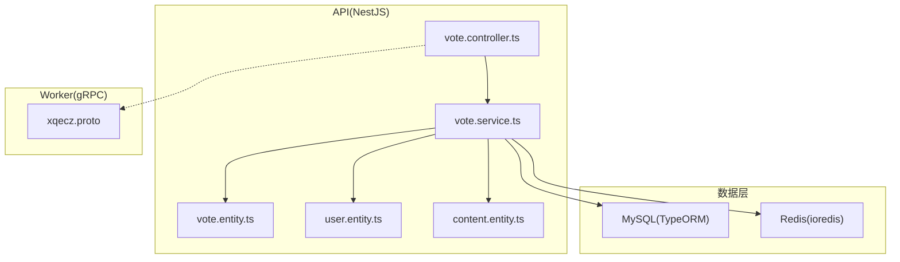
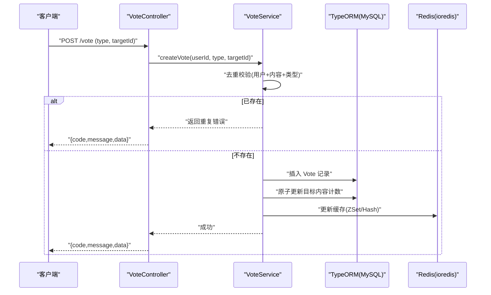
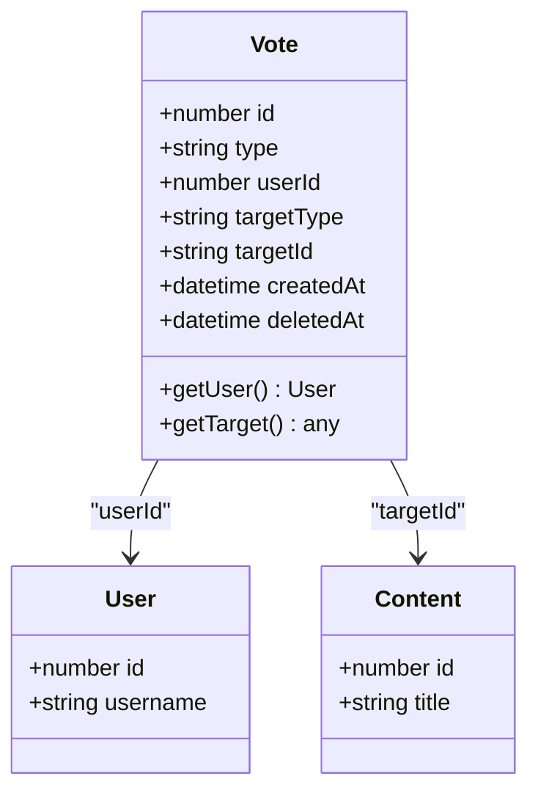
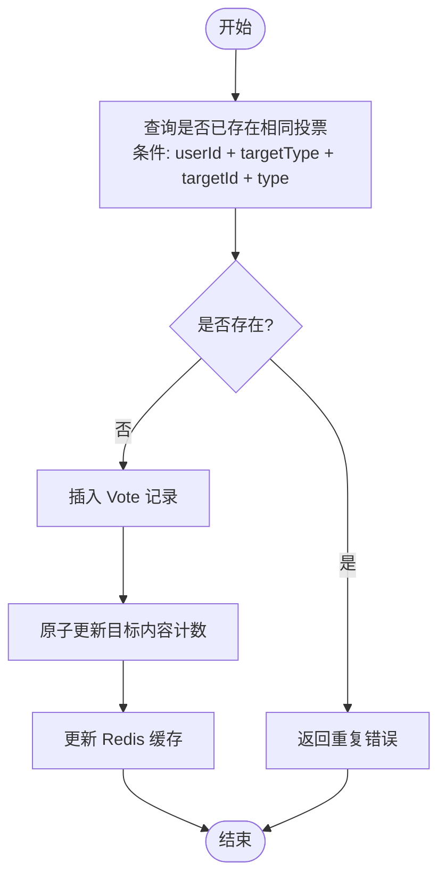
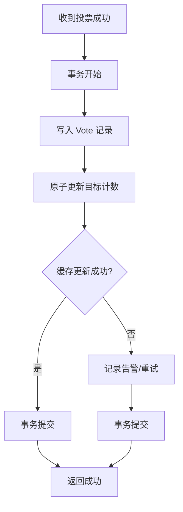
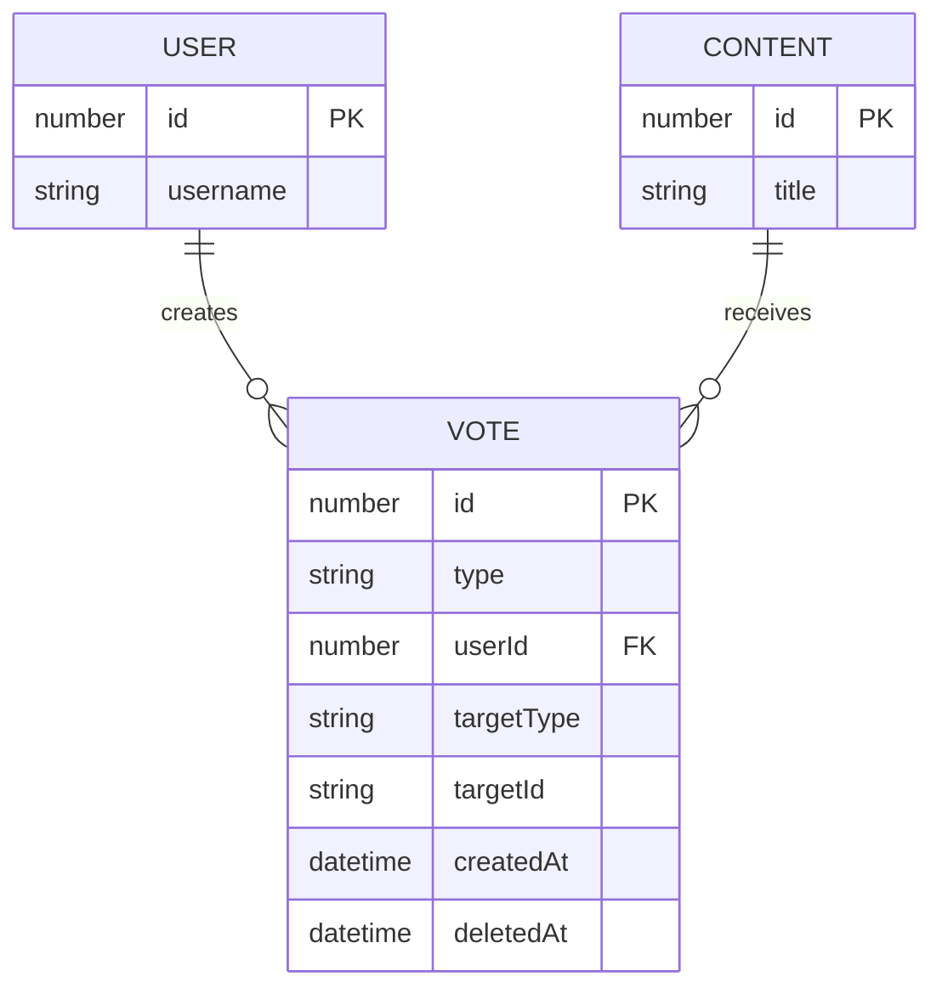
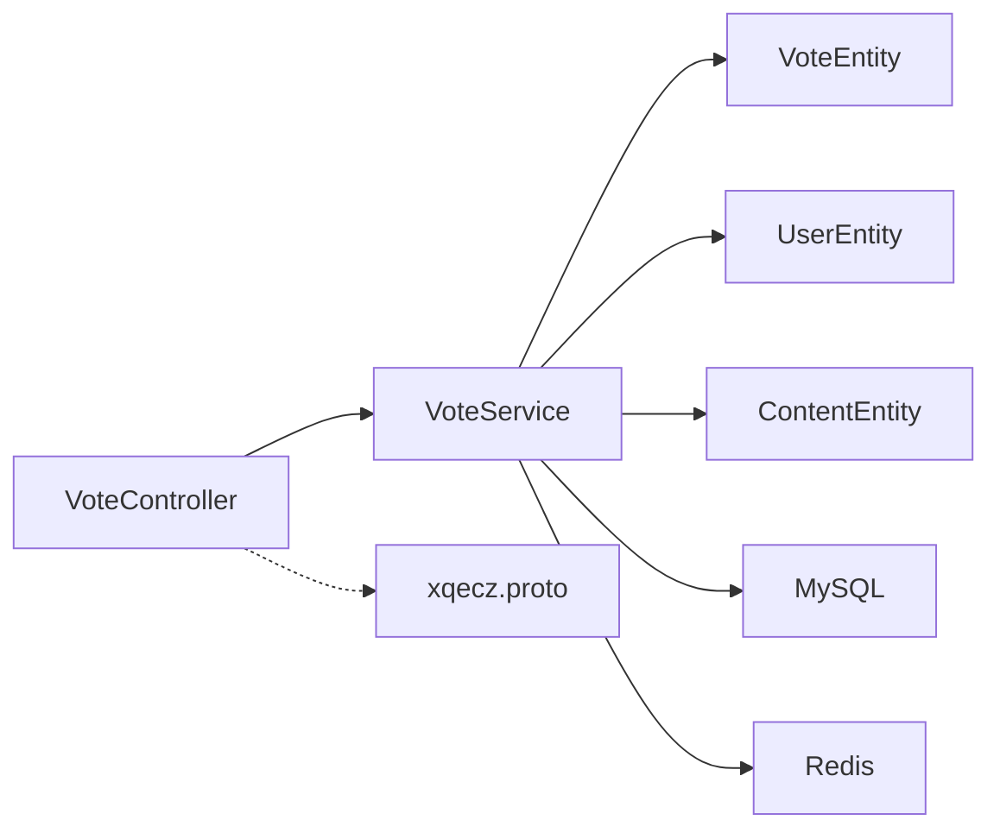

# 投票实体 (Vote)

<cite>
**本文引用的文件**   
- [packages/api/src/modules/vote/entities/vote.entity.ts](file://packages/api/src/modules/vote/entities/vote.entity.ts)
- [packages/api/src/modules/vote/services/vote.service.ts](file://packages/api/src/modules/vote/services/vote.service.ts)
- [packages/api/src/modules/vote/controllers/vote.controller.ts](file://packages/api/src/modules/vote/controllers/vote.controller.ts)
- [packages/api/src/modules/content/entities/content.entity.ts](file://packages/api/src/modules/content/entities/content.entity.ts)
- [packages/api/src/modules/user/entities/user.entity.ts](file://packages/api/src/modules/user/entities/user.entity.ts)
- [packages/api/.env](file://packages/api/.env)
- [proto/xqecz.proto](file://proto/xqecz.proto)
</cite>

## 目录
1. [简介](#简介)
2. [项目结构](#项目结构)
3. [核心组件](#核心组件)
4. [架构总览](#架构总览)
5. [详细组件分析](#详细组件分析)
6. [依赖关系分析](#依赖关系分析)
7. [性能考量](#性能考量)
8. [故障排查指南](#故障排查指南)
9. [结论](#结论)
10. [附录](#附录)

## 简介
本文件面向 xqecz 平台的“投票”能力，聚焦 Vote 实体的 TypeORM 定义与业务实现。内容涵盖：
- 投票类型（点赞/投币/收藏）的枚举与约束
- 用户ID、目标内容ID、投票时间等字段说明
- 投票去重机制（同一用户对同一内容的同类型投票唯一性）
- 投票计数更新策略与性能优化方案
- 与用户、内容的关联关系及统计查询优化
- 关键代码路径与图示，便于快速定位与二次开发

## 项目结构
围绕投票功能的相关代码主要位于 packages/api 模块中，采用 NestJS + TypeORM 分层组织：
- entities：TypeORM 实体定义（如 Vote、User、Content）
- services：业务逻辑（投票创建、去重、计数更新）
- controllers：HTTP 接口（接收请求并调用服务层）
- .env：环境变量（如数据库连接、缓存前缀等）
- proto：gRPC 契约（Worker 计算相关，不直接参与投票落库）

图表来源 
- [packages/api/src/modules/vote/controllers/vote.controller.ts](file://packages/api/src/modules/vote/controllers/vote.controller.ts)
- [packages/api/src/modules/vote/services/vote.service.ts](file://packages/api/src/modules/vote/services/vote.service.ts)
- [packages/api/src/modules/vote/entities/vote.entity.ts](file://packages/api/src/modules/vote/entities/vote.entity.ts)
- [packages/api/src/modules/user/entities/user.entity.ts](file://packages/api/src/modules/user/entities/user.entity.ts)
- [packages/api/src/modules/content/entities/content.entity.ts](file://packages/api/src/modules/content/entities/content.entity.ts)
- [proto/xqecz.proto](file://proto/xqecz.proto)

章节来源
- [packages/api/src/modules/vote/controllers/vote.controller.ts](file://packages/api/src/modules/vote/controllers/vote.controller.ts)
- [packages/api/src/modules/vote/services/vote.service.ts](file://packages/api/src/modules/vote/services/vote.service.ts)
- [packages/api/src/modules/vote/entities/vote.entity.ts](file://packages/api/src/modules/vote/entities/vote.entity.ts)
- [packages/api/src/modules/user/entities/user.entity.ts](file://packages/api/src/modules/user/entities/user.entity.ts)
- [packages/api/src/modules/content/entities/content.entity.ts](file://packages/api/src/modules/content/entities/content.entity.ts)
- [packages/api/.env](file://packages/api/.env)
- [proto/xqecz.proto](file://proto/xqecz.proto)

## 核心组件
- Vote 实体：定义投票记录的核心字段与约束，包括类型、用户、内容、时间戳等
- VoteService：封装投票的业务逻辑，含去重校验、计数更新、事务处理
- VoteController：对外暴露 HTTP 接口，统一入参校验与响应包装
- User/Content 实体：作为外键关联的目标对象，支撑统计与展示

章节来源
- [packages/api/src/modules/vote/entities/vote.entity.ts](file://packages/api/src/modules/vote/entities/vote.entity.ts)
- [packages/api/src/modules/vote/services/vote.service.ts](file://packages/api/src/modules/vote/services/vote.service.ts)
- [packages/api/src/modules/vote/controllers/vote.controller.ts](file://packages/api/src/modules/vote/controllers/vote.controller.ts)
- [packages/api/src/modules/user/entities/user.entity.ts](file://packages/api/src/modules/user/entities/user.entity.ts)
- [packages/api/src/modules/content/entities/content.entity.ts](file://packages/api/src/modules/content/entities/content.entity.ts)

## 架构总览
投票流程的关键路径如下：
- 客户端发起投票请求至 Controller
- Controller 校验参数后调用 Service
- Service 执行去重检查、写入 Vote 记录、原子更新计数、写 Redis 缓存
- 读取时优先从 Redis 获取，失败回退到 MySQL

图表来源 
- [packages/api/src/modules/vote/controllers/vote.controller.ts](file://packages/api/src/modules/vote/controllers/vote.controller.ts)
- [packages/api/src/modules/vote/services/vote.service.ts](file://packages/api/src/modules/vote/services/vote.service.ts)
- [packages/api/src/modules/vote/entities/vote.entity.ts](file://packages/api/src/modules/vote/entities/vote.entity.ts)

## 详细组件分析

### Vote 实体（TypeORM 定义）
- 字段说明
  - id：主键，自增或 UUID（依具体实现）
  - type：投票类型，支持点赞/投币/收藏（枚举）
  - userId：投票用户ID，外键关联用户表
  - targetType/targetId：目标内容类型与ID（例如 content_id），用于扩展不同内容类型的投票
  - createdAt：投票时间戳
  - deletedAt：软删除标记（TypeORM @DeleteDateColumn）
- 约束与索引
  - 唯一约束：userId + targetType + targetId + type，确保同一用户对同一目标的同类型投票唯一
  - 复合索引：targetType + targetId + type，加速按目标与类型统计
- 关联关系
  - 多对一关联 User（通过 userId）
  - 多对一关联 Content（通过 targetType/targetId 或 contentId，视实现而定）

图表来源 
- [packages/api/src/modules/vote/entities/vote.entity.ts](file://packages/api/src/modules/vote/entities/vote.entity.ts)
- [packages/api/src/modules/user/entities/user.entity.ts](file://packages/api/src/modules/user/entities/user.entity.ts)
- [packages/api/src/modules/content/entities/content.entity.ts](file://packages/api/src/modules/content/entities/content.entity.ts)

章节来源
- [packages/api/src/modules/vote/entities/vote.entity.ts](file://packages/api/src/modules/vote/entities/vote.entity.ts)
- [packages/api/src/modules/user/entities/user.entity.ts](file://packages/api/src/modules/user/entities/user.entity.ts)
- [packages/api/src/modules/content/entities/content.entity.ts](file://packages/api/src/modules/content/entities/content.entity.ts)

### 投票去重机制
- 业务规则
  - 同一用户针对同一目标内容的同一投票类型仅允许一次
  - 若重复提交，应返回明确的重复错误码/消息
- 实现要点
  - 在写入前进行唯一性查询（userId + targetType + targetId + type）
  - 使用数据库唯一约束兜底，避免并发竞态导致重复
  - 可选：在 Redis 中维护短期去重键（如 vote:duplicate:{userId}:{targetType}:{targetId}:{type}），配合 TTL 降低数据库压力
- 异常处理
  - 捕获唯一约束冲突异常，转换为业务错误返回

图表来源 
- [packages/api/src/modules/vote/services/vote.service.ts](file://packages/api/src/modules/vote/services/vote.service.ts)
- [packages/api/src/modules/vote/entities/vote.entity.ts](file://packages/api/src/modules/vote/entities/vote.entity.ts)

章节来源
- [packages/api/src/modules/vote/services/vote.service.ts](file://packages/api/src/modules/vote/services/vote.service.ts)
- [packages/api/src/modules/vote/entities/vote.entity.ts](file://packages/api/src/modules/vote/entities/vote.entity.ts)

### 投票计数更新策略与性能优化
- 更新策略
  - 写入 Vote 成功后，对目标内容的对应类型计数进行原子递增（如 increment_like_count、increment_coin_count、increment_favorite_count）
  - 同时更新 Redis 中的缓存（如 Hash 或 ZSet），保证读路径低延迟
- 性能优化
  - 使用数据库原子操作（UPDATE ... WHERE id = ? AND deleted_at IS NULL）避免脏写
  - 为统计查询建立复合索引（targetType + targetId + type）
  - 读多写少场景下，优先从 Redis 读取；缓存失效或异常时回退到 MySQL
  - 批量统计时使用 GROUP BY 聚合，减少往返次数
- 一致性保障
  - 将写入 Vote 与更新计数放入事务，确保一致
  - 缓存更新失败不影响主流程，但需记录日志并触发补偿

图表来源 
- [packages/api/src/modules/vote/services/vote.service.ts](file://packages/api/src/modules/vote/services/vote.service.ts)

章节来源
- [packages/api/src/modules/vote/services/vote.service.ts](file://packages/api/src/modules/vote/services/vote.service.ts)

### 与用户、内容的关联关系
- 用户维度
  - 用户可对其感兴趣的内容进行多种类型的投票
  - 可通过 userId 查询用户的投票历史与偏好统计
- 内容维度
  - 内容可被多个用户投票，不同类型分别计数
  - 统计接口按 targetType + targetId + type 聚合，返回点赞/投币/收藏数量
- 软删除
  - 所有删除均为软删除（deleted_at），查询自动过滤已删除记录

图表来源 
- [packages/api/src/modules/vote/entities/vote.entity.ts](file://packages/api/src/modules/vote/entities/vote.entity.ts)
- [packages/api/src/modules/user/entities/user.entity.ts](file://packages/api/src/modules/user/entities/user.entity.ts)
- [packages/api/src/modules/content/entities/content.entity.ts](file://packages/api/src/modules/content/entities/content.entity.ts)

章节来源
- [packages/api/src/modules/vote/entities/vote.entity.ts](file://packages/api/src/modules/vote/entities/vote.entity.ts)
- [packages/api/src/modules/user/entities/user.entity.ts](file://packages/api/src/modules/user/entities/user.entity.ts)
- [packages/api/src/modules/content/entities/content.entity.ts](file://packages/api/src/modules/content/entities/content.entity.ts)

### 投票统计查询优化
- 常用查询
  - 按目标内容统计各类型票数：GROUP BY type
  - 按用户统计其投票行为：GROUP BY targetType, targetId, type
- 优化手段
  - 使用覆盖索引减少回表
  - 热点内容缓存至 Redis，设置合理过期时间
  - 分页与限流保护后端资源

章节来源
- [packages/api/src/modules/vote/services/vote.service.ts](file://packages/api/src/modules/vote/services/vote.service.ts)

## 依赖关系分析
- 模块内依赖
  - Controller 依赖 Service
  - Service 依赖 Entity（TypeORM 模型）与数据库/缓存驱动
- 外部依赖
  - MySQL：持久化存储
  - Redis：缓存与热点数据
  - gRPC：与 Worker 交互（推荐链路：刷新推荐等，非投票核心）

图表来源 
- [packages/api/src/modules/vote/controllers/vote.controller.ts](file://packages/api/src/modules/vote/controllers/vote.controller.ts)
- [packages/api/src/modules/vote/services/vote.service.ts](file://packages/api/src/modules/vote/services/vote.service.ts)
- [packages/api/src/modules/vote/entities/vote.entity.ts](file://packages/api/src/modules/vote/entities/vote.entity.ts)
- [packages/api/src/modules/user/entities/user.entity.ts](file://packages/api/src/modules/user/entities/user.entity.ts)
- [packages/api/src/modules/content/entities/content.entity.ts](file://packages/api/src/modules/content/entities/content.entity.ts)
- [proto/xqecz.proto](file://proto/xqecz.proto)

章节来源
- [packages/api/src/modules/vote/controllers/vote.controller.ts](file://packages/api/src/modules/vote/controllers/vote.controller.ts)
- [packages/api/src/modules/vote/services/vote.service.ts](file://packages/api/src/modules/vote/services/vote.service.ts)
- [packages/api/src/modules/vote/entities/vote.entity.ts](file://packages/api/src/modules/vote/entities/vote.entity.ts)
- [packages/api/src/modules/user/entities/user.entity.ts](file://packages/api/src/modules/user/entities/user.entity.ts)
- [packages/api/src/modules/content/entities/content.entity.ts](file://packages/api/src/modules/content/entities/content.entity.ts)
- [proto/xqecz.proto](file://proto/xqecz.proto)

## 性能考量
- 写入路径
  - 使用事务包裹写入 Vote 与更新计数，确保一致性
  - 利用数据库唯一约束防止重复，避免应用层复杂锁
- 读取路径
  - 优先从 Redis 读取统计数据，降低数据库压力
  - 热点内容缓存 TTL 合理设置，避免雪崩
- 索引设计
  - 为统计查询建立复合索引（targetType + targetId + type）
  - 用户维度查询可按 userId + type 建索引
- 降级策略
  - 缓存不可用时回退到 MySQL，保证可用性
  - 外部依赖缺失一律降级，gRPC 不抛 rpc error

[本节为通用性能建议，不直接分析具体文件]

## 故障排查指南
- 常见错误
  - 重复投票：检查唯一约束与应用层去重逻辑
  - 计数不一致：核对事务边界与缓存更新顺序
  - 查询缓慢：检查索引命中与 SQL 执行计划
- 排查步骤
  - 查看 API 日志与错误码
  - 检查数据库唯一约束冲突日志
  - 验证 Redis 缓存键与过期时间
  - 确认 .env 配置（数据库连接、缓存前缀等）

章节来源
- [packages/api/src/modules/vote/services/vote.service.ts](file://packages/api/src/modules/vote/services/vote.service.ts)
- [packages/api/.env](file://packages/api/.env)

## 结论
Vote 实体以 TypeORM 为核心，结合数据库唯一约束与 Redis 缓存，实现了高可用、高性能的投票能力。通过明确的分层设计与事务保障，确保了数据一致性与系统稳定性。后续可进一步优化缓存策略与统计查询，提升整体吞吐与用户体验。

[本节为总结性内容，不直接分析具体文件]

## 附录
- 字段说明表（示例）
  - id：主键
  - type：投票类型（点赞/投币/收藏）
  - userId：用户ID
  - targetType：目标内容类型（如 content）
  - targetId：目标内容ID
  - createdAt：投票时间
  - deletedAt：软删除时间
- 关键代码路径
  - 实体定义：packages/api/src/modules/vote/entities/vote.entity.ts
  - 业务逻辑：packages/api/src/modules/vote/services/vote.service.ts
  - HTTP 接口：packages/api/src/modules/vote/controllers/vote.controller.ts
  - 关联实体：packages/api/src/modules/user/entities/user.entity.ts、packages/api/src/modules/content/entities/content.entity.ts
  - 环境变量：packages/api/.env
  - gRPC 契约：proto/xqecz.proto

章节来源
- [packages/api/src/modules/vote/entities/vote.entity.ts](file://packages/api/src/modules/vote/entities/vote.entity.ts)
- [packages/api/src/modules/vote/services/vote.service.ts](file://packages/api/src/modules/vote/services/vote.service.ts)
- [packages/api/src/modules/vote/controllers/vote.controller.ts](file://packages/api/src/modules/vote/controllers/vote.controller.ts)
- [packages/api/src/modules/user/entities/user.entity.ts](file://packages/api/src/modules/user/entities/user.entity.ts)
- [packages/api/src/modules/content/entities/content.entity.ts](file://packages/api/src/modules/content/entities/content.entity.ts)
- [packages/api/.env](file://packages/api/.env)
- [proto/xqecz.proto](file://proto/xqecz.proto)