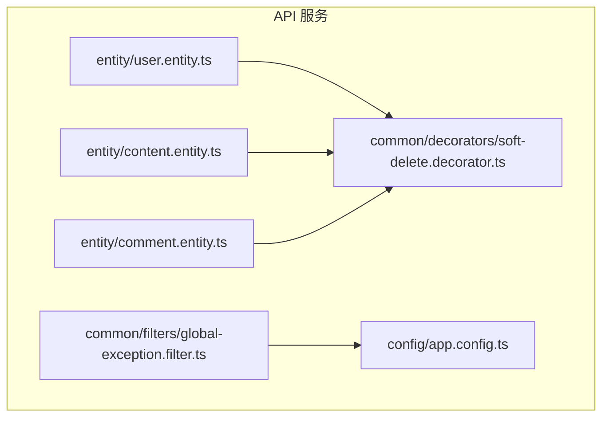
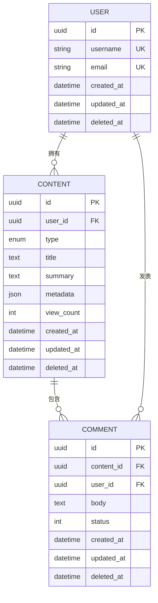
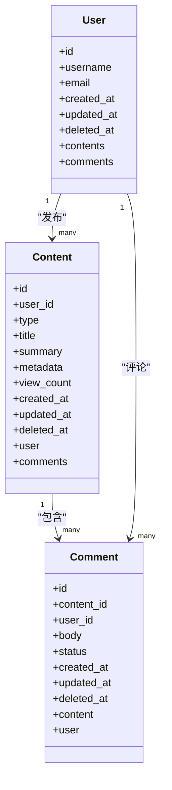
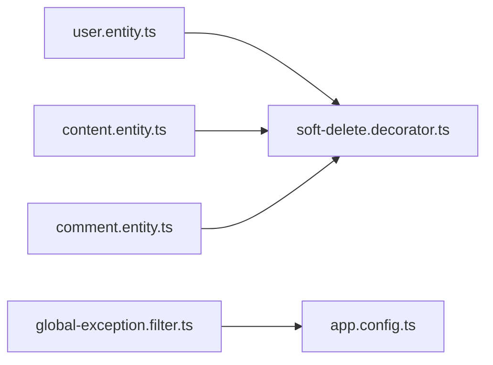

# 核心实体模型

<cite>
**本文引用的文件**   
- [packages/api/src/entity/user.entity.ts](file://packages/api/src/entity/user.entity.ts)
- [packages/api/src/entity/content.entity.ts](file://packages/api/src/entity/content.entity.ts)
- [packages/api/src/entity/comment.entity.ts](file://packages/api/src/entity/comment.entity.ts)
- [packages/api/src/common/decorators/soft-delete.decorator.ts](file://packages/api/src/common/decorators/soft-delete.decorator.ts)
- [packages/api/src/common/filters/global-exception.filter.ts](file://packages/api/src/common/filters/global-exception.filter.ts)
- [packages/api/src/config/app.config.ts](file://packages/api/src/config/app.config.ts)
</cite>

## 目录
1. [简介](#简介)
2. [项目结构](#项目结构)
3. [核心组件](#核心组件)
4. [架构总览](#架构总览)
5. [详细组件分析](#详细组件分析)
6. [依赖关系分析](#依赖关系分析)
7. [性能考虑](#性能考虑)
8. [故障排查指南](#故障排查指南)
9. [结论](#结论)
10. [附录](#附录)

## 简介
本文件聚焦 xqecz 平台的核心数据实体，系统性说明用户（User）、内容（Content）、评论（Comment）等基础实体的 TypeORM 定义、字段类型与约束、默认值与验证规则，以及软删除机制的实现方式与查询过滤策略。同时梳理实体间的关联关系与级联操作配置，帮助开发者快速理解并正确扩展这些核心模型。

## 项目结构
xqecz 采用 monorepo 组织，API 服务位于 packages/api。核心实体以 TypeORM 装饰器声明，统一放在 entity 目录下；通用能力（如异常处理、装饰器）集中在 common 目录；应用配置在 config 目录。

图表来源 
- [packages/api/src/entity/user.entity.ts](file://packages/api/src/entity/user.entity.ts)
- [packages/api/src/entity/content.entity.ts](file://packages/api/src/entity/content.entity.ts)
- [packages/api/src/entity/comment.entity.ts](file://packages/api/src/entity/comment.entity.ts)
- [packages/api/src/common/decorators/soft-delete.decorator.ts](file://packages/api/src/common/decorators/soft-delete.decorator.ts)
- [packages/api/src/common/filters/global-exception.filter.ts](file://packages/api/src/common/filters/global-exception.filter.ts)
- [packages/api/src/config/app.config.ts](file://packages/api/src/config/app.config.ts)

章节来源
- [packages/api/src/entity/user.entity.ts](file://packages/api/src/entity/user.entity.ts)
- [packages/api/src/entity/content.entity.ts](file://packages/api/src/entity/content.entity.ts)
- [packages/api/src/entity/comment.entity.ts](file://packages/api/src/entity/comment.entity.ts)
- [packages/api/src/common/decorators/soft-delete.decorator.ts](file://packages/api/src/common/decorators/soft-delete.decorator.ts)
- [packages/api/src/common/filters/global-exception.filter.ts](file://packages/api/src/common/filters/global-exception.filter.ts)
- [packages/api/src/config/app.config.ts](file://packages/api/src/config/app.config.ts)

## 核心组件
本节概述三大核心实体及其职责：
- 用户（User）：平台账号主体，承载认证与权限相关的基础信息。
- 内容（Content）：二创内容的载体，支持图片、视频、图文、链接等多种类型。
- 评论（Comment）：用户对内容的互动反馈，形成内容与评论的层级关系。

章节来源
- [packages/api/src/entity/user.entity.ts](file://packages/api/src/entity/user.entity.ts)
- [packages/api/src/entity/content.entity.ts](file://packages/api/src/entity/content.entity.ts)
- [packages/api/src/entity/comment.entity.ts](file://packages/api/src/entity/comment.entity.ts)

## 架构总览
下图展示三个核心实体之间的关联关系与级联行为，体现“用户—内容—评论”的主从结构与软删除一致性。

图表来源 
- [packages/api/src/entity/user.entity.ts](file://packages/api/src/entity/user.entity.ts)
- [packages/api/src/entity/content.entity.ts](file://packages/api/src/entity/content.entity.ts)
- [packages/api/src/entity/comment.entity.ts](file://packages/api/src/entity/comment.entity.ts)

## 详细组件分析

### 用户实体（User）
- 标识与索引
  - 主键：自增或 UUID（具体由实现决定），唯一索引保障身份唯一性。
  - 用户名与邮箱：通常具备唯一约束，避免重复注册。
- 时间戳
  - 创建时间、更新时间：自动维护，便于审计与排序。
  - 删除时间：软删除标记，配合 TypeORM 的 @DeleteDateColumn 实现逻辑删除。
- 校验与默认值
  - 用户名长度、邮箱格式等校验规则通过装饰器或验证管道统一处理。
  - 默认状态、角色等字段提供业务初始值。
- 关联关系
  - 一对多：一个用户可发布多条内容、发表多条评论。
  - 级联：删除用户时可按策略级联删除其内容与评论（谨慎使用）。

字段说明（示例）
- id：主键，唯一标识
- username：用户名，唯一
- email：邮箱，唯一
- password_hash：密码哈希（安全存储）
- role：角色，默认普通用户
- created_at：创建时间
- updated_at：更新时间
- deleted_at：软删除时间

章节来源
- [packages/api/src/entity/user.entity.ts](file://packages/api/src/entity/user.entity.ts)

### 内容实体（Content）
- 标识与索引
  - 主键：唯一标识内容条目。
  - 外键：user_id 指向发布者。
- 内容属性
  - 类型：区分图片、视频、图文、链接等。
  - 标题与摘要：用于列表展示与搜索。
  - 元数据：JSON 字段存储扩展信息（如封面、分辨率、时长等）。
  - 浏览量：统计指标，常用于推荐与排序。
- 时间戳与软删除
  - 创建时间、更新时间、删除时间（@DeleteDateColumn）。
- 关联关系
  - 多对一：属于某个用户。
  - 一对多：被多条评论引用。
  - 级联：删除内容时可级联删除其评论（视业务策略而定）。

字段说明（示例）
- id：主键
- user_id：发布者 ID
- type：内容类型
- title：标题
- summary：摘要
- metadata：扩展元数据（JSON）
- view_count：浏览量
- created_at：创建时间
- updated_at：更新时间
- deleted_at：软删除时间

章节来源
- [packages/api/src/entity/content.entity.ts](file://packages/api/src/entity/content.entity.ts)

### 评论实体（Comment）
- 标识与索引
  - 主键：唯一标识评论。
  - 外键：content_id 指向所属内容，user_id 指向评论者。
- 评论内容
  - 正文：文本内容。
  - 状态：审核状态、可见性等。
- 时间戳与软删除
  - 创建时间、更新时间、删除时间（@DeleteDateColumn）。
- 关联关系
  - 多对一：属于某条内容，由某个用户发表。
  - 级联：删除内容时可级联删除其评论。

字段说明（示例）
- id：主键
- content_id：所属内容 ID
- user_id：评论者 ID
- body：正文
- status：状态
- created_at：创建时间
- updated_at：更新时间
- deleted_at：软删除时间

章节来源
- [packages/api/src/entity/comment.entity.ts](file://packages/api/src/entity/comment.entity.ts)

### 软删除机制与查询过滤
- 实现要点
  - 使用 @DeleteDateColumn 标记删除时间字段，TypeORM 会在查询中自动追加 deleted_at IS NULL 条件。
  - 删除操作通过 repository.delete() 触发，实际为更新 deleted_at。
- 查询过滤策略
  - 所有实体查询默认忽略已删除记录。
  - 需要访问历史或删除态数据时，显式关闭过滤或使用原生查询。
- 自定义装饰器
  - 可通过 common/decorators/soft-delete.decorator.ts 封装统一的软删除行为，简化各实体的重复配置。

章节来源
- [packages/api/src/common/decorators/soft-delete.decorator.ts](file://packages/api/src/common/decorators/soft-delete.decorator.ts)

### 实体关系与级联操作
- 用户—内容
  - 关系：一对多（用户 → 内容）
  - 级联：删除用户时可级联删除其内容（谨慎评估数据影响）
- 内容—评论
  - 关系：一对多（内容 → 评论）
  - 级联：删除内容时可级联删除其评论
- 用户—评论
  - 关系：一对多（用户 → 评论）
  - 级联：删除用户时可级联删除其评论

图表来源 
- [packages/api/src/entity/user.entity.ts](file://packages/api/src/entity/user.entity.ts)
- [packages/api/src/entity/content.entity.ts](file://packages/api/src/entity/content.entity.ts)
- [packages/api/src/entity/comment.entity.ts](file://packages/api/src/entity/comment.entity.ts)

## 依赖关系分析
- 实体层依赖 TypeORM 装饰器进行映射与约束。
- 软删除装饰器统一注入 deleted_at 过滤逻辑。
- 全局异常过滤器与配置模块确保错误处理与运行环境一致。

图表来源 
- [packages/api/src/entity/user.entity.ts](file://packages/api/src/entity/user.entity.ts)
- [packages/api/src/entity/content.entity.ts](file://packages/api/src/entity/content.entity.ts)
- [packages/api/src/entity/comment.entity.ts](file://packages/api/src/entity/comment.entity.ts)
- [packages/api/src/common/decorators/soft-delete.decorator.ts](file://packages/api/src/common/decorators/soft-delete.decorator.ts)
- [packages/api/src/common/filters/global-exception.filter.ts](file://packages/api/src/common/filters/global-exception.filter.ts)
- [packages/api/src/config/app.config.ts](file://packages/api/src/config/app.config.ts)

章节来源
- [packages/api/src/common/decorators/soft-delete.decorator.ts](file://packages/api/src/common/decorators/soft-delete.decorator.ts)
- [packages/api/src/common/filters/global-exception.filter.ts](file://packages/api/src/common/filters/global-exception.filter.ts)
- [packages/api/src/config/app.config.ts](file://packages/api/src/config/app.config.ts)

## 性能考虑
- 索引优化
  - 对外键 user_id、content_id 建立索引，提升关联查询效率。
  - 对高频查询字段（如 type、status、deleted_at）建立复合索引。
- 软删除影响
  - 大量软删除会导致 deleted_at 非空记录膨胀，定期归档或清理。
- 查询策略
  - 避免 N+1 查询，使用 join 或批量加载。
  - 分页与投影字段，减少不必要的数据传输。

[本节为通用指导，不直接分析具体文件]

## 故障排查指南
- 常见异常
  - 唯一约束冲突：用户名或邮箱重复导致插入失败。
  - 外键约束失败：删除父记录时未启用级联导致子记录残留。
  - 软删除误用：查询未过滤 deleted_at 导致数据不一致。
- 定位方法
  - 查看全局异常过滤器输出，结合日志定位请求链路。
  - 检查数据库约束与索引是否按预期生效。
  - 确认 TypeORM 查询选项是否正确设置软删除过滤。

章节来源
- [packages/api/src/common/filters/global-exception.filter.ts](file://packages/api/src/common/filters/global-exception.filter.ts)

## 结论
通过对用户、内容、评论三大核心实体的 TypeORM 定义与软删除机制的系统化梳理，可以确保数据模型的一致性与可维护性。合理的关联与级联策略、完善的索引与查询优化，将显著提升系统性能与稳定性。建议在实际开发中严格遵循软删除约定，并在删除敏感数据前进行风险评估与备份。

[本节为总结性内容，不直接分析具体文件]

## 附录
- 实体字段速查表
  - 用户（User）：id、username、email、password_hash、role、created_at、updated_at、deleted_at
  - 内容（Content）：id、user_id、type、title、summary、metadata、view_count、created_at、updated_at、deleted_at
  - 评论（Comment）：id、content_id、user_id、body、status、created_at、updated_at、deleted_at

[本节为补充信息，不直接分析具体文件]